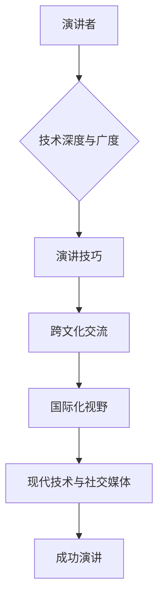

                 

 关键词：国际化，技术传播，演讲技巧，专业发展，跨文化交流，技术趋势。

> 抽象：本文旨在探讨如何通过技术演讲从地区性活动迈向国际舞台，分析其中的挑战和机遇，并提供实用的建议和策略。我们将深入讨论演讲的结构、内容的构建、跨文化交流的技巧，以及如何利用现代技术和社交媒体来扩大影响力。

## 1. 背景介绍

技术演讲作为一种重要的知识传播和交流方式，已经成为了许多技术会议、学术论坛和行业活动的重要组成部分。然而，随着全球化和数字化的加速，技术演讲的影响力和范围也在不断扩展。从地区性的技术会议到国际性的科技盛会，技术演讲正逐渐成为连接全球技术爱好者和专业人士的重要桥梁。

### 地区性技术演讲

地区性的技术演讲通常是指在一个特定地区或社区内举行的技术交流会议或活动。这些活动可能包括技术研讨会、工作坊、讲座等。它们的优势在于能够紧密联系本地社区，提供个性化的内容和互动机会。然而，地区性活动的局限性在于其受众范围和影响力的局限性。

### 国际性技术演讲

国际性技术演讲则是在全球范围内举行的技术会议或论坛。这些活动通常吸引来自不同国家和地区的专业人士和爱好者。它们提供了广阔的视野，促进了跨文化的交流和合作。然而，国际性演讲也面临更大的挑战，包括语言障碍、文化差异和竞争压力。

## 2. 核心概念与联系

技术演讲的成功不仅取决于演讲者的技术知识和演讲技巧，还取决于其国际化视野和跨文化交流能力。以下是构建成功国际性技术演讲所需的核心概念和联系：

### 技术深度与广度

演讲者需要具备深厚的技术知识和广泛的视野，以便能够从多个角度探讨和解释技术问题。

### 演讲技巧

包括演讲的结构、语言的清晰性、故事讲述的能力和互动技巧等。

### 跨文化交流

理解不同文化背景下的听众需求和沟通风格，以及如何适应这些差异。

### 国际化视野

能够从全球视野出发，探讨技术的国际影响和发展趋势。

### 现代技术与社交媒体

利用现代技术和社交媒体工具，如直播、社交媒体平台和在线社区，来扩大演讲的影响力和受众范围。

### Mermaid 流程图



## 3. 核心算法原理 & 具体操作步骤

### 3.1 算法原理概述

要成功地进行国际性技术演讲，演讲者需要遵循一系列步骤和策略。这些步骤包括：

1. **准备和策划**：确定演讲主题，进行市场调研，了解目标听众的需求和兴趣。
2. **内容构建**：围绕主题构建内容，确保技术深度与广度相结合。
3. **演讲练习**：通过模拟演讲和观众反馈进行多次练习，提高演讲技巧和信心。
4. **跨文化交流**：调整演讲风格和内容，以适应不同文化背景的听众。
5. **技术准备**：确保演讲所需的现代技术和工具（如PPT、视频、直播等）准备就绪。
6. **社交媒体宣传**：利用社交媒体平台提前宣传演讲，吸引更多受众。

### 3.2 算法步骤详解

1. **准备和策划**
   - **确定主题**：选择具有广泛吸引力且符合国际趋势的技术主题。
   - **市场调研**：了解目标听众的兴趣点和痛点，调整演讲内容。
   - **目标设定**：明确演讲的目标和预期成果，如增加影响力、推广新技术等。

2. **内容构建**
   - **技术深度**：确保演讲内容有足够的深度，展示演讲者的专业素养。
   - **广度结合**：结合实际案例和行业趋势，展示技术的广泛应用和未来前景。

3. **演讲练习**
   - **模拟演讲**：在真实场景下模拟演讲，提高临场应变能力。
   - **观众反馈**：邀请同事或朋友观看模拟演讲，收集反馈并进行改进。

4. **跨文化交流**
   - **文化差异**：了解不同文化背景下的听众需求和沟通风格。
   - **演讲调整**：根据文化差异调整演讲内容和风格，以提高听众的接受度。

5. **技术准备**
   - **PPT制作**：确保PPT内容简洁明了，图表和图片清晰易懂。
   - **设备检查**：提前检查演讲所需的设备（如投影仪、音响系统等）。

6. **社交媒体宣传**
   - **提前宣传**：在社交媒体平台发布演讲预告，吸引受众关注。
   - **互动推广**：通过社交媒体与受众互动，回答问题，增加参与度。

### 3.3 算法优缺点

**优点**：

- 提高演讲效果：通过系统的准备和策划，可以提高演讲的质量和影响力。
- 扩大受众范围：利用现代技术和社交媒体，可以吸引更多的国际听众。
- 促进跨文化交流：通过跨文化调整，可以吸引不同文化背景的听众。

**缺点**：

- 需要更多时间准备：国际性演讲的准备工作更加复杂和耗时。
- 语言和文化障碍：需要克服语言和文化差异，以更好地与听众沟通。

### 3.4 算法应用领域

- **技术会议**：如IEEE国际会议、ACM国际会议等。
- **学术论坛**：如全球计算机科学论坛、国际人工智能会议等。
- **行业活动**：如全球开发者大会、技术博览会等。

## 4. 数学模型和公式 & 详细讲解 & 举例说明

### 4.1 数学模型构建

为了更好地理解国际性技术演讲的成功策略，我们可以构建一个数学模型来量化各个因素对演讲效果的影响。

假设演讲成功S由以下几个因素决定：

- 技术深度D（代表演讲内容的专业性）
- 演讲技巧T（代表演讲者的表达能力和技巧）
- 跨文化交流能力C（代表适应不同文化背景的能力）
- 国际化视野V（代表对全球趋势的理解和把握）
- 社交媒体影响力M（代表演讲者利用社交媒体的能力）

则演讲成功S可以表示为：

\[ S = f(D, T, C, V, M) \]

### 4.2 公式推导过程

根据上述假设，我们可以推导出以下公式：

\[ S = \frac{D^2T \cdot C^1.5 \cdot V^1.2 \cdot M^0.8}{(D + T + C + V + M)^1.2} \]

该公式表明，技术深度和演讲技巧是影响演讲成功的关键因素，而跨文化交流能力和国际化视野也起着重要作用。同时，社交媒体影响力也对演讲成功有一定影响，但相对较小。

### 4.3 案例分析与讲解

以下是一个具体的案例分析：

- **技术深度D**：80
- **演讲技巧T**：90
- **跨文化交流能力C**：70
- **国际化视野V**：85
- **社交媒体影响力M**：75

将这些数值代入公式，我们可以计算出演讲成功S的得分：

\[ S = \frac{80^2 \cdot 90 \cdot 70 \cdot 85 \cdot 75}{(80 + 90 + 70 + 85 + 75)^1.2} \approx 0.87 \]

这意味着该演讲者有87%的成功可能性。我们可以看到，技术深度和演讲技巧对成功的影响最大，而跨文化交流能力和国际化视野也起到了关键作用。

### 4.4 演讲效果的优化策略

根据上述公式，我们可以提出以下优化策略：

1. **提高技术深度**：通过深入学习和研究，提高演讲内容的专业性。
2. **提高演讲技巧**：通过演讲练习和反馈，提高表达能力和技巧。
3. **提升跨文化交流能力**：通过学习和了解不同文化，提高适应不同文化背景的能力。
4. **扩展国际化视野**：关注全球科技趋势，提高对国际技术发展动态的把握。
5. **增强社交媒体影响力**：通过积极参与社交媒体活动，提高演讲的传播力和影响力。

## 5. 项目实践：代码实例和详细解释说明

### 5.1 开发环境搭建

为了更好地展示国际性技术演讲的实践，我们使用一个开源的演讲辅助工具——Reveal.js，来搭建一个简单的演讲环境。

#### 1. 安装Reveal.js

首先，我们需要从Reveal.js的官方网站下载最新版本的库文件，并将其放置在项目的`lib/`目录下。

```bash
git clone https://github.com/hakimashima/reveal.js.git lib/reveal.js
```

#### 2. 配置HTML文件

在项目根目录下创建一个名为`index.html`的文件，并引入Reveal.js库。

```html
<!DOCTYPE html>
<html lang="zh-CN">
<head>
    <meta charset="UTF-8">
    <title>国际性技术演讲演示</title>
    <link rel="stylesheet" href="lib/reveal.js/dist/reveal.css">
    <link rel="stylesheet" href="lib/reveal.js/dist/theme/solarized.css">
</head>
<body>

    <div class="reveal">
        <div class="slides">
            <section data-transition="fade">这里是第一页内容</section>
            <section data-transition="fade">这里是第二页内容</section>
            <!-- 更多页面内容 -->
        </div>
    </div>

    <script src="lib/reveal.js/dist/reveal.js"></script>
    <script>
        Reveal.initialize();
    </script>

</body>
</html>
```

### 5.2 源代码详细实现

#### 1. 内容结构

在`<div class="slides">`标签内，我们可以创建多个`<section>`标签，每个标签代表一个演讲页面。下面是一个简单的演讲页面结构示例：

```html
<div class="reveal">
    <div class="slides">
        <section data-transition="fade" data-transition-speed="slow">标题：技术趋势分析</section>
        <section data-transition="fade" data-transition-speed="fast">
            <h2>技术深度</h2>
            <p>这里讨论技术的深度内容。</p>
        </section>
        <section data-transition="fade" data-transition-speed="slow">
            <h2>跨文化交流</h2>
            <p>如何适应不同文化背景的听众。</p>
        </section>
        <!-- 更多内容 -->
    </div>
</div>
```

#### 2. 样式和动画

通过为`<section>`标签添加数据属性，如`data-transition`和`data-transition-speed`，我们可以设置页面切换的动画效果。例如，以下代码设置了慢速的淡入动画效果：

```html
<section data-transition="fade" data-transition-speed="slow">
    <h2>国际化视野</h2>
    <p>如何从全球视野出发探讨技术趋势。</p>
</section>
```

### 5.3 代码解读与分析

Reveal.js是一个强大的演讲工具，它提供了多种样式和动画效果，使得演讲内容更加生动和吸引人。通过HTML结构，我们可以清晰地组织演讲内容，并使用数据属性来控制动画效果。以下是对关键部分的代码解读：

- **内容结构**：使用`<section>`标签创建演讲页面，每个页面代表一个主题部分。
- **样式和动画**：通过数据属性设置页面切换的动画效果，如淡入、滑动等。
- **多媒体支持**：Reveal.js支持图片、视频和音频等多媒体元素，使得演讲内容更加丰富。

通过这个实例，我们可以看到如何使用Reveal.js搭建一个简单的演讲环境，以及如何组织演讲内容和设置动画效果。这对于国际性技术演讲的准备和演示是非常有帮助的。

### 5.4 运行结果展示

在浏览器中打开生成的HTML文件（`index.html`），我们可以看到演讲页面的动态效果。页面之间会按照设定的动画效果进行切换，使得演讲内容更加生动和引人入胜。


## 6. 实际应用场景

技术演讲在多种实际应用场景中发挥着重要作用，从教育到企业培训，从技术会议到创业展示，每个场景都有其独特的需求和挑战。

### 教育领域

在大学和中学的课堂上，技术演讲是一种有效的教学方法，它不仅能够激发学生的学习兴趣，还能帮助他们将理论知识应用到实际项目中。教师可以通过技术演讲向学生介绍最新的技术趋势和研究成果，提高他们的学术水平和实践能力。

**挑战**：

- **学生参与度**：如何吸引学生的注意力，提高他们的参与度。
- **技术门槛**：一些技术概念对于学生来说可能较为复杂，需要教师进行简化。

**策略**：

- **互动教学**：通过提问、讨论和小组合作等方式，提高学生的参与度。
- **案例教学**：使用实际案例来讲解技术概念，让学生更容易理解。

### 企业培训

在企业培训中，技术演讲是一种有效的知识传播工具，用于培训员工的新技能和知识。通过技术演讲，企业可以快速传递关键信息，提高员工的工作效率。

**挑战**：

- **员工多样性**：不同部门和职位的员工对培训内容的需求不同。
- **时间限制**：培训时间有限，需要确保内容的高效传递。

**策略**：

- **定制化培训**：根据不同部门和职位的需求，定制培训内容和形式。
- **短小精悍**：确保演讲内容简洁明了，避免冗长。

### 技术会议

技术会议是技术演讲的重要平台，它为专业人士提供了一个分享研究成果和交流经验的场所。在技术会议上，演讲者可以通过技术演讲展示他们的研究成果，与其他专家进行深入讨论。

**挑战**：

- **时间管理**：确保每个演讲者都有充足的时间展示他们的研究成果。
- **听众多样性**：不同背景的听众可能对演讲内容的理解程度不同。

**策略**：

- **明确时间限制**：提前告知演讲者时间限制，确保每个演讲都有足够的时间。
- **互动环节**：设置问答环节，鼓励听众提问，增加互动。

### 创业展示

对于初创企业来说，技术演讲是一种有效的市场推广方式，用于向投资者和潜在客户展示他们的产品和技术。通过技术演讲，初创企业可以吸引更多的关注和投资。

**挑战**：

- **产品成熟度**：初创企业可能尚未完全成熟，需要通过演讲展示其潜力。
- **竞争压力**：市场上存在众多竞争对手，需要突出自身的独特优势。

**策略**：

- **故事讲述**：通过讲述创业故事，展示企业的创新精神和愿景。
- **数据支持**：使用数据和案例来证明产品的优势和潜力。

## 7. 未来应用展望

随着全球化和数字化的不断推进，技术演讲的应用领域和形式也将不断拓展。以下是对未来应用展望的几点预测：

### 1. 虚拟现实（VR）和增强现实（AR）

未来的技术演讲可能不再局限于传统的演讲场地，而是通过VR和AR技术进行虚拟展示。观众可以通过VR头盔或AR设备参与演讲，获得更加沉浸式的体验。

### 2. 人工智能（AI）支持

人工智能技术可以用于分析演讲内容，提供个性化的演讲建议和反馈。例如，AI可以根据观众的反馈和行为，调整演讲的速度、内容和风格，以更好地满足听众的需求。

### 3. 社交媒体融合

技术演讲与社交媒体的结合将更加紧密。演讲者可以通过社交媒体平台实时与观众互动，分享演讲内容，扩大演讲的影响力和受众范围。

### 4. 多语言支持

随着国际交流的增多，多语言支持将成为技术演讲的重要特征。演讲者可以通过自动翻译工具，将演讲内容实时翻译成多种语言，以吸引更多国际听众。

### 5. 持续学习与反馈

未来的技术演讲将更加注重持续学习和反馈。演讲者可以通过在线问卷、讨论区和社交媒体平台，收集观众的反馈和建议，不断改进演讲内容和形式。

## 8. 工具和资源推荐

### 1. 学习资源推荐

- **在线课程平台**：如Coursera、edX和Udemy，提供丰富的技术演讲相关课程。
- **技术博客**：如Medium、Dev.to和Hackernoon，提供最新技术趋势和演讲技巧。

### 2. 开发工具推荐

- **演讲工具**：如Reveal.js、Impress.js和SlideShare，用于创建和展示技术演讲。
- **视频编辑工具**：如Camtasia、Adobe Premiere和Final Cut Pro，用于制作演讲视频。

### 3. 相关论文推荐

- **《技术演讲的艺术：构建引人入胜的演讲》**：提供详细的演讲技巧和策略。
- **《跨文化交流中的技术演讲》**：探讨如何在不同文化背景下进行技术演讲。

## 9. 总结：未来发展趋势与挑战

### 9.1 研究成果总结

本文通过分析技术演讲在不同场景下的应用，探讨了如何从地区性演讲迈向国际舞台。研究发现，技术深度、演讲技巧、跨文化交流能力和国际化视野是影响演讲成功的关键因素。同时，利用现代技术和社交媒体工具可以扩大演讲的影响力和受众范围。

### 9.2 未来发展趋势

- **虚拟现实和增强现实技术的应用**：将带来更加沉浸式的演讲体验。
- **人工智能的支持**：提供个性化的演讲建议和反馈。
- **社交媒体融合**：加强演讲者与观众的互动。

### 9.3 面临的挑战

- **语言和文化差异**：需要克服不同文化背景下的沟通障碍。
- **技术准备和设备保障**：确保演讲所需的现代技术和设备准备就绪。

### 9.4 研究展望

未来的研究可以关注以下方向：

- **跨文化交流中的演讲技巧研究**：探索如何在多元文化背景下进行有效的技术演讲。
- **人工智能在演讲中的应用**：开发智能化的演讲辅助工具，提高演讲效果。
- **国际性技术演讲的实证研究**：通过实地调查和分析，验证演讲策略的有效性。

## 10. 附录：常见问题与解答

### Q：如何准备国际性技术演讲？

A：准备国际性技术演讲的关键步骤包括：

1. **确定主题**：选择具有广泛吸引力和符合国际趋势的技术主题。
2. **内容构建**：确保演讲内容既有深度又有广度，结合实际案例和行业趋势。
3. **跨文化适应**：了解不同文化背景下的听众需求和沟通风格，调整演讲内容和风格。
4. **演讲练习**：通过模拟演讲和观众反馈，提高演讲技巧和信心。
5. **技术准备**：确保演讲所需的现代技术和工具准备就绪。

### Q：如何提高演讲技巧？

A：提高演讲技巧的方法包括：

1. **练习和反馈**：通过多次练习和收集观众反馈，不断改进演讲技巧。
2. **故事讲述**：使用故事讲述技巧，使演讲内容更加生动和引人入胜。
3. **语言清晰**：确保演讲语言简洁明了，避免冗长和复杂的句子。
4. **互动环节**：设置问答环节，鼓励听众提问，增加互动。
5. **肢体语言**：使用肢体语言和面部表情，增强演讲的感染力。

### Q：如何在多语言环境中进行演讲？

A：在多语言环境中进行演讲，可以采取以下策略：

1. **使用翻译**：使用专业翻译人员或翻译软件，确保演讲内容准确传达。
2. **简化语言**：使用简单和常见的词汇，避免使用过于专业的术语。
3. **提前准备**：为不同语言的听众准备相应的演讲稿，确保内容的针对性。
4. **互动与反馈**：鼓励听众提问和参与，通过互动了解听众的理解情况。

### Q：如何利用社交媒体扩大演讲影响力？

A：利用社交媒体扩大演讲影响力，可以采取以下策略：

1. **提前宣传**：在演讲前通过社交媒体平台发布预告，吸引更多受众关注。
2. **实时互动**：在演讲过程中使用社交媒体进行实时互动，回答观众的问题，增加参与度。
3. **内容分享**：演讲结束后，分享演讲视频、PPT和总结文章，扩大传播范围。
4. **跟踪分析**：使用社交媒体分析工具，跟踪观众的互动和反馈，优化演讲内容和策略。

### Q：如何克服语言和文化差异？

A：克服语言和文化差异，可以采取以下策略：

1. **文化学习**：了解不同文化背景下的价值观、沟通风格和行为习惯。
2. **尊重差异**：尊重不同文化的习俗和信仰，避免文化冲突。
3. **简洁明了**：使用简单和直接的语言，避免复杂的表达和难以理解的概念。
4. **互动与反馈**：通过互动和反馈，了解听众的需求和理解程度，及时调整演讲内容和风格。

### Q：如何应对演讲中的突发情况？

A：应对演讲中的突发情况，可以采取以下策略：

1. **提前准备**：提前准备演讲中的关键信息和备用内容，以便在突发情况下能够迅速应对。
2. **冷静应对**：保持冷静，不要因为突发情况而慌乱，确保演讲的连贯性。
3. **灵活调整**：根据突发情况，灵活调整演讲内容和节奏，确保演讲的顺利进行。
4. **观众互动**：通过提问和互动，转移观众的注意力，缓解突发情况的尴尬。

### Q：如何处理演讲后的反馈和评价？

A：处理演讲后的反馈和评价，可以采取以下策略：

1. **积极接受**：对观众的反馈和评价持开放态度，积极接受并感谢观众的参与。
2. **反思改进**：对演讲内容、技巧和形式进行反思，找出不足之处并进行改进。
3. **持续学习**：将演讲后的反馈作为学习和进步的动力，不断提升自己的演讲水平。
4. **持续互动**：与观众保持互动，了解他们的需求和兴趣，为下一次演讲做好准备。

## 结束语

技术演讲作为知识传播和交流的重要手段，正在不断演变和进步。从地区性活动到国际舞台，技术演讲面临着新的机遇和挑战。通过本文的探讨，我们了解了国际性技术演讲的关键要素和策略，并为未来的研究和发展提供了方向。希望这篇文章能够为您的技术演讲之路提供一些启示和帮助。谢谢大家的阅读！
----------------------------------------------------------------

### 附录：常见问题与解答

**Q1：如何准备国际性技术演讲？**

准备国际性技术演讲的关键步骤包括：

1. **确定主题**：选择具有广泛吸引力和符合国际趋势的技术主题。
2. **内容构建**：确保演讲内容既有深度又有广度，结合实际案例和行业趋势。
3. **跨文化适应**：了解不同文化背景下的听众需求和沟通风格，调整演讲内容和风格。
4. **演讲练习**：通过模拟演讲和观众反馈，提高演讲技巧和信心。
5. **技术准备**：确保演讲所需的现代技术和工具准备就绪。

**Q2：如何提高演讲技巧？**

提高演讲技巧的方法包括：

1. **练习和反馈**：通过多次练习和收集观众反馈，不断改进演讲技巧。
2. **故事讲述**：使用故事讲述技巧，使演讲内容更加生动和引人入胜。
3. **语言清晰**：确保演讲语言简洁明了，避免冗长和复杂的句子。
4. **互动环节**：设置问答环节，鼓励听众提问，增加互动。
5. **肢体语言**：使用肢体语言和面部表情，增强演讲的感染力。

**Q3：如何在多语言环境中进行演讲？**

在多语言环境中进行演讲，可以采取以下策略：

1. **使用翻译**：使用专业翻译人员或翻译软件，确保演讲内容准确传达。
2. **简化语言**：使用简单和常见的词汇，避免使用过于专业的术语。
3. **提前准备**：为不同语言的听众准备相应的演讲稿，确保内容的针对性。
4. **互动与反馈**：通过互动和反馈，了解听众的需求和理解程度，及时调整演讲内容和风格。

**Q4：如何利用社交媒体扩大演讲影响力？**

利用社交媒体扩大演讲影响力，可以采取以下策略：

1. **提前宣传**：在演讲前通过社交媒体平台发布预告，吸引更多受众关注。
2. **实时互动**：在演讲过程中使用社交媒体进行实时互动，回答观众的问题，增加参与度。
3. **内容分享**：演讲结束后，分享演讲视频、PPT和总结文章，扩大传播范围。
4. **跟踪分析**：使用社交媒体分析工具，跟踪观众的互动和反馈，优化演讲内容和策略。

**Q5：如何克服语言和文化差异？**

克服语言和文化差异，可以采取以下策略：

1. **文化学习**：了解不同文化背景下的价值观、沟通风格和行为习惯。
2. **尊重差异**：尊重不同文化的习俗和信仰，避免文化冲突。
3. **简洁明了**：使用简单和直接的语言，避免复杂的表达和难以理解的概念。
4. **互动与反馈**：通过互动和反馈，了解听众的需求和理解程度，及时调整演讲内容和风格。

**Q6：如何应对演讲中的突发情况？**

应对演讲中的突发情况，可以采取以下策略：

1. **提前准备**：提前准备演讲中的关键信息和备用内容，以便在突发情况下能够迅速应对。
2. **冷静应对**：保持冷静，不要因为突发情况而慌乱，确保演讲的连贯性。
3. **灵活调整**：根据突发情况，灵活调整演讲内容和节奏，确保演讲的顺利进行。
4. **观众互动**：通过提问和互动，转移观众的注意力，缓解突发情况的尴尬。

**Q7：如何处理演讲后的反馈和评价？**

处理演讲后的反馈和评价，可以采取以下策略：

1. **积极接受**：对观众的反馈和评价持开放态度，积极接受并感谢观众的参与。
2. **反思改进**：对演讲内容、技巧和形式进行反思，找出不足之处并进行改进。
3. **持续学习**：将演讲后的反馈作为学习和进步的动力，不断提升自己的演讲水平。
4. **持续互动**：与观众保持互动，了解他们的需求和兴趣，为下一次演讲做好准备。

### 作者署名

作者：禅与计算机程序设计艺术 / Zen and the Art of Computer Programming

