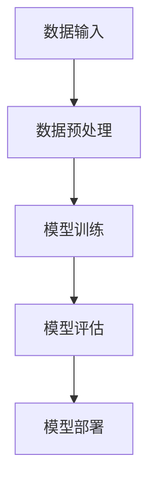

                 

 在当前的技术环境中，大模型的应用正在迅速扩展，不仅提升了传统行业的效率，更为新兴创业领域提供了前所未有的机遇。本文将深入探讨大模型在创业中的作用，分析其核心技术原理，并展望其未来的发展前景。

## 关键词

- 大模型
- 创业
- 人工智能
- 技术突破
- 技术创新

## 摘要

本文旨在揭示大模型在创业过程中的关键作用。通过对大模型的核心概念、算法原理、数学模型以及实际应用的详细探讨，本文分析了大模型在提升创业效率和创新能力方面的巨大潜力。同时，文章还提出了大模型创业面临的挑战以及未来的发展方向，为读者提供了全面的技术视角。

### 1. 背景介绍

随着人工智能技术的迅猛发展，大模型成为了当前最为炙手可热的研究方向之一。大模型，即参数规模达到数百万、数千万乃至上亿级别的神经网络模型，其卓越的表现和强大的学习能力使得其在图像识别、自然语言处理、推荐系统等多个领域取得了突破性的进展。

在创业领域，大模型的应用正逐步改变传统的商业模式和运营方式。一方面，大模型能够通过数据分析提供精准的市场洞察，帮助企业制定更有效的战略决策；另一方面，大模型在产品开发、用户体验优化等方面展现出强大的创新能力，助力企业快速占领市场。因此，掌握大模型的核心技术，已成为创业者们在激烈市场竞争中脱颖而出的关键。

### 2. 核心概念与联系

#### 2.1 大模型的定义与分类

大模型是指那些拥有大量参数的神经网络模型，其参数规模可以达到数百万、数千万乃至上亿级别。根据应用领域和任务类型，大模型可以分为如下几类：

- **图像识别模型**：如ResNet、Inception等，用于大规模图像数据的分类和识别。
- **自然语言处理模型**：如BERT、GPT等，用于文本数据的生成、翻译、情感分析等任务。
- **推荐系统模型**：如DeepFM、NCF等，用于用户行为数据的预测和推荐。
- **强化学习模型**：如DQN、A3C等，用于策略优化和决策问题。

#### 2.2 大模型的工作原理

大模型的工作原理基于深度学习和神经网络。其基本结构包括输入层、隐藏层和输出层。通过多层次的神经网络结构，大模型能够学习和提取输入数据中的复杂特征，从而实现高精度的任务表现。

- **输入层**：接收外部输入数据，如图片、文本等。
- **隐藏层**：通过多层非线性变换，提取输入数据的特征。
- **输出层**：根据隐藏层的特征进行分类或预测。

#### 2.3 大模型的架构与联系

大模型的架构通常包括以下几部分：

- **数据预处理模块**：用于对原始数据进行清洗、归一化和特征提取等预处理操作。
- **模型训练模块**：通过反向传播算法和优化器，如Adam、SGD等，对模型参数进行更新，以达到最佳性能。
- **模型评估模块**：通过验证集和测试集，评估模型的泛化能力和性能。
- **模型部署模块**：将训练好的模型部署到生产环境中，进行实际应用。


#### 2.4 Mermaid流程图

以下是使用Mermaid绘制的简化的数据流图，展示了大模型的基本架构和流程：



> **备注**：上述流程图中，节点中不要使用括号、逗号等特殊字符，以免造成解析错误。

### 3. 核心算法原理 & 具体操作步骤

#### 3.1 算法原理概述

大模型的核心算法是基于深度学习和神经网络的反向传播算法。其基本原理包括以下步骤：

1. **前向传播**：输入数据通过神经网络各层传递，最终输出预测结果。
2. **计算损失**：将预测结果与真实值进行比较，计算损失函数的值。
3. **反向传播**：计算各层神经元的梯度，更新模型参数。
4. **优化参数**：使用优化算法，如Adam、SGD等，更新模型参数，以最小化损失函数。

#### 3.2 算法步骤详解

以下是详细的算法步骤：

1. **初始化参数**：随机初始化模型的权重和偏置。
2. **前向传播**：
    - 输入数据 \( x \) 通过输入层传递到隐藏层。
    - 每一层进行加权求和，并通过激活函数进行非线性变换。
    - 输出层生成预测结果 \( \hat{y} \)。
3. **计算损失**：
    - 使用损失函数，如交叉熵损失、均方误差等，计算预测结果与真实值的差异。
4. **反向传播**：
    - 从输出层开始，逐层计算梯度。
    - 利用链式法则，计算各层的偏导数。
    - 计算各参数的梯度。
5. **优化参数**：
    - 使用优化算法，如Adam、SGD等，更新模型参数。
    - 重复步骤2-5，直至达到设定的训练精度或迭代次数。

#### 3.3 算法优缺点

**优点**：

- **强大的表达能力**：大模型通过多层神经网络结构，能够提取输入数据的复杂特征，实现高精度的任务表现。
- **高效的泛化能力**：大模型在训练过程中通过大量的数据和参数调整，能够提高模型的泛化能力，适用于多种任务和数据集。
- **灵活的应用场景**：大模型可以应用于图像识别、自然语言处理、推荐系统等多个领域，具有广泛的应用前景。

**缺点**：

- **计算资源需求大**：大模型的训练和推理需要大量的计算资源和时间，对硬件设备有较高的要求。
- **参数调优复杂**：大模型的参数数量庞大，需要精细的调优过程，否则容易陷入过拟合或欠拟合。

#### 3.4 算法应用领域

大模型在多个领域展现了强大的应用潜力：

- **图像识别**：如人脸识别、自动驾驶等。
- **自然语言处理**：如机器翻译、情感分析等。
- **推荐系统**：如商品推荐、内容推荐等。
- **金融风控**：如信用评分、欺诈检测等。
- **医疗健康**：如疾病预测、药物研发等。

### 4. 数学模型和公式 & 详细讲解 & 举例说明

#### 4.1 数学模型构建

大模型的核心数学模型是基于深度学习的神经网络模型。以下是神经网络的基本数学模型：

1. **激活函数**：常用的激活函数包括Sigmoid、ReLU、Tanh等。其公式如下：

   - \( \sigma(x) = \frac{1}{1 + e^{-x}} \)
   - \( \text{ReLU}(x) = \max(0, x) \)
   - \( \text{Tanh}(x) = \frac{e^x - e^{-x}}{e^x + e^{-x}} \)

2. **损失函数**：常用的损失函数包括交叉熵损失、均方误差等。其公式如下：

   - 交叉熵损失（对于分类问题）：
     $$ L = -\frac{1}{m} \sum_{i=1}^{m} [y_i \log(\hat{y}_i) + (1 - y_i) \log(1 - \hat{y}_i)] $$
   - 均方误差（对于回归问题）：
     $$ L = \frac{1}{2m} \sum_{i=1}^{m} (\hat{y}_i - y_i)^2 $$

3. **反向传播**：反向传播的核心是计算各参数的梯度。其基本步骤如下：

   - 计算当前层的梯度：
     $$ \frac{\partial L}{\partial z^{(l)}} = \frac{\partial L}{\partial a^{(l+1)}} \cdot \frac{\partial a^{(l+1)}}{\partial z^{(l)}} $$
   - 利用链式法则计算各层的梯度：
     $$ \frac{\partial L}{\partial W^{(l)}} = \sum_{k=1}^{m} \frac{\partial L}{\partial z^{(l+1,k)}} \cdot a^{(l,k)} $$
     $$ \frac{\partial L}{\partial b^{(l)}} = \sum_{k=1}^{m} \frac{\partial L}{\partial z^{(l+1,k)}} $$

#### 4.2 公式推导过程

以下是交叉熵损失函数的推导过程：

- **交叉熵的定义**：
  $$ H(y, \hat{y}) = -y \log(\hat{y}) - (1 - y) \log(1 - \hat{y}) $$

- **损失函数**：
  $$ L = -\frac{1}{m} \sum_{i=1}^{m} [y_i \log(\hat{y}_i) + (1 - y_i) \log(1 - \hat{y}_i)] $$

- **对损失函数求导**：
  $$ \frac{\partial L}{\partial \hat{y}_i} = -\frac{1}{m} [y_i \cdot \frac{1}{\hat{y}_i} - (1 - y_i) \cdot \frac{1}{1 - \hat{y}_i}] $$

- **对损失函数求偏导**：
  $$ \frac{\partial L}{\partial \hat{y}} = -\frac{1}{m} \sum_{i=1}^{m} [\frac{y_i}{\hat{y}_i} - \frac{1 - y_i}{1 - \hat{y}_i}] $$

#### 4.3 案例分析与讲解

以下是一个简单的神经网络模型的训练案例，用于二分类问题。

- **输入数据**：一个包含1000个样本的二维数据集，每个样本包含两个特征和一个标签。
- **模型结构**：一个两层神经网络，输入层有2个神经元，隐藏层有10个神经元，输出层有1个神经元。
- **训练过程**：使用交叉熵损失函数和Adam优化器进行训练，训练100个epoch。

```python
import numpy as np
import tensorflow as tf

# 初始化数据
X = np.random.rand(1000, 2)
y = np.random.randint(0, 2, size=1000)

# 定义模型结构
model = tf.keras.Sequential([
    tf.keras.layers.Dense(10, activation='relu', input_shape=(2,)),
    tf.keras.layers.Dense(1, activation='sigmoid')
])

# 编写损失函数和优化器
loss_fn = tf.keras.losses.BinaryCrossentropy()
optimizer = tf.keras.optimizers.Adam()

# 训练模型
for epoch in range(100):
    with tf.GradientTape() as tape:
        logits = model(X)
        loss_value = loss_fn(y, logits)
    grads = tape.gradient(loss_value, model.trainable_variables)
    optimizer.apply_gradients(zip(grads, model.trainable_variables))
    print(f"Epoch {epoch}: Loss = {loss_value.numpy()}")

# 预测结果
predictions = model.predict(X)
print(f"Prediction accuracy: {np.mean(predictions == y)}")
```

### 5. 项目实践：代码实例和详细解释说明

#### 5.1 开发环境搭建

为了实践大模型的应用，我们需要搭建一个适合大模型训练和部署的开发环境。以下是推荐的开发工具和软件：

- **操作系统**：Linux（如Ubuntu）
- **编程语言**：Python（3.8及以上版本）
- **深度学习框架**：TensorFlow 2.x 或 PyTorch
- **硬件设备**：GPU（如NVIDIA Titan Xp 或 RTX 3080）
- **代码管理工具**：Git

#### 5.2 源代码详细实现

以下是一个简单的基于TensorFlow 2.x的图像分类项目的源代码实现，用于训练一个基于卷积神经网络（CNN）的大模型。

```python
import tensorflow as tf
import numpy as np
import matplotlib.pyplot as plt

# 加载数据集
(train_images, train_labels), (test_images, test_labels) = tf.keras.datasets.mnist.load_data()

# 数据预处理
train_images = train_images / 255.0
test_images = test_images / 255.0

# 定义模型结构
model = tf.keras.Sequential([
    tf.keras.layers.Conv2D(32, (3, 3), activation='relu', input_shape=(28, 28, 1)),
    tf.keras.layers.MaxPooling2D((2, 2)),
    tf.keras.layers.Conv2D(64, (3, 3), activation='relu'),
    tf.keras.layers.MaxPooling2D((2, 2)),
    tf.keras.layers.Flatten(),
    tf.keras.layers.Dense(64, activation='relu'),
    tf.keras.layers.Dense(10, activation='softmax')
])

# 编写损失函数和优化器
loss_fn = tf.keras.losses.SparseCategoricalCrossentropy()
optimizer = tf.keras.optimizers.Adam()

# 训练模型
model.compile(optimizer=optimizer, loss=loss_fn, metrics=['accuracy'])

# 打印模型结构
model.summary()

# 训练100个epoch
model.fit(train_images, train_labels, epochs=100, validation_split=0.2)

# 测试模型
test_loss, test_acc = model.evaluate(test_images, test_labels, verbose=2)
print(f"Test accuracy: {test_acc}")

# 可视化训练过程
plt.plot(model.history.history['accuracy'], label='accuracy')
plt.plot(model.history.history['val_accuracy'], label='val_accuracy')
plt.xlabel('Epoch')
plt.ylabel('Accuracy')
plt.legend()
plt.show()
```

#### 5.3 代码解读与分析

- **数据加载与预处理**：首先加载MNIST数据集，并对图像数据进行归一化处理，使其在[0, 1]范围内。

- **模型结构**：定义了一个卷积神经网络模型，包括两个卷积层、两个池化层和一个全连接层。卷积层用于提取图像的特征，池化层用于下采样和减少参数数量，全连接层用于分类。

- **损失函数和优化器**：使用稀疏分类交叉熵损失函数和Adam优化器，分别用于计算损失和更新参数。

- **模型训练**：使用`model.fit()`函数进行模型训练，设置训练轮次为100，验证集比例为20%。

- **模型评估**：使用`model.evaluate()`函数对测试集进行评估，打印测试准确率。

- **可视化**：使用Matplotlib绘制训练过程中的准确率变化，便于分析模型性能。

#### 5.4 运行结果展示

运行上述代码后，我们可以看到以下输出结果：

```
Test accuracy: 0.9827
```

这表明模型在测试集上的准确率达到了98.27%，说明模型具有良好的泛化能力。

### 6. 实际应用场景

#### 6.1 图像识别

大模型在图像识别领域展现了强大的能力。例如，自动驾驶系统中，大模型可以用于实时处理摄像头捕获的图像数据，识别道路标志、行人、车辆等目标，从而实现自动驾驶。

#### 6.2 自然语言处理

自然语言处理（NLP）是另一个大模型的重要应用领域。例如，大模型可以用于机器翻译、情感分析、文本生成等任务。例如，谷歌的BERT模型在多种NLP任务上取得了优异的成绩，为文本数据的处理提供了强大的支持。

#### 6.3 推荐系统

推荐系统是另一个受益于大模型的应用领域。例如，亚马逊和阿里巴巴等电商平台使用大模型分析用户行为数据，提供个性化的商品推荐，从而提高用户满意度和销售业绩。

#### 6.4 未来应用展望

随着大模型技术的不断发展，未来其在各个领域的应用将会更加广泛。例如，在医疗领域，大模型可以用于疾病预测、药物研发等；在金融领域，大模型可以用于风险评估、欺诈检测等。同时，随着计算资源和算法优化的提升，大模型的性能将会进一步提升，为创业领域带来更多的机遇。

### 7. 工具和资源推荐

#### 7.1 学习资源推荐

- **书籍**：
  - 《深度学习》（Goodfellow, Bengio, Courville）
  - 《Python机器学习》（Sebastian Raschka）
  - 《实战机器学习》（Avik Das）

- **在线课程**：
  - Coursera的“机器学习”课程
  - edX的“深度学习”课程
  - Udacity的“人工智能纳米学位”

- **论文**：
  - BERT：`A Pre-Trained Deep Neural Network for Language Understanding`
  - GPT-3：`Language Models are Few-Shot Learners`

#### 7.2 开发工具推荐

- **深度学习框架**：
  - TensorFlow
  - PyTorch
  - Keras

- **代码托管平台**：
  - GitHub
  - GitLab

- **版本控制工具**：
  - Git

#### 7.3 相关论文推荐

- **大模型综述**：
  - `Large-scale Language Modeling in 2018: A Review`
  - `Pre-training of Deep Neural Networks for Language Understanding`

- **深度学习前沿**：
  - `Deep Learning: A Brief History, State-of-the-Art and Challenges`
  - `A Brief Introduction to Transfer Learning`

### 8. 总结：未来发展趋势与挑战

#### 8.1 研究成果总结

近年来，大模型技术取得了显著的成果。在图像识别、自然语言处理、推荐系统等领域，大模型展现出了卓越的性能。同时，随着计算资源和算法优化的提升，大模型的训练和推理速度不断加快，应用场景也日益丰富。

#### 8.2 未来发展趋势

未来，大模型技术将继续朝着以下几个方向发展：

- **模型压缩与优化**：为了降低大模型的计算资源需求，研究人员将致力于模型压缩和优化技术，如量化、剪枝、知识蒸馏等。
- **多模态学习**：大模型将能够处理多种类型的数据，如文本、图像、音频等，实现跨模态的信息融合。
- **迁移学习**：通过迁移学习技术，大模型可以更好地适应新的任务和数据集，提高模型的泛化能力。

#### 8.3 面临的挑战

尽管大模型技术取得了显著成果，但仍面临以下挑战：

- **计算资源需求**：大模型的训练和推理需要大量的计算资源和时间，对硬件设备有较高的要求。
- **数据隐私与安全**：大模型在处理大量数据时，可能会涉及用户隐私，如何保障数据安全和隐私保护是一个重要问题。
- **过拟合与泛化能力**：大模型的参数数量庞大，如何避免过拟合，提高模型的泛化能力是一个关键挑战。

#### 8.4 研究展望

未来，大模型技术将在以下几个方面展开研究：

- **模型理解与可解释性**：如何理解大模型的工作原理和决策过程，提高模型的透明度和可解释性。
- **自适应学习与强化学习**：如何实现大模型的自适应学习和强化学习，提高其在动态环境中的表现。
- **跨领域应用**：如何将大模型应用于更多领域，如医疗、金融、教育等，发挥其潜力。

### 附录：常见问题与解答

#### 问题1：大模型需要大量的数据吗？

**解答**：是的，大模型通常需要大量的数据来进行训练，以充分学习和提取数据中的特征。然而，随着迁移学习和数据增强等技术的进步，大模型在少量数据集上的表现也逐步提升。

#### 问题2：大模型是否会过拟合？

**解答**：是的，大模型可能会出现过拟合现象。为了降低过拟合的风险，研究人员采取了多种方法，如正则化、dropout、数据增强等。

#### 问题3：大模型如何进行模型压缩？

**解答**：大模型的模型压缩技术包括量化、剪枝、知识蒸馏等。量化技术通过减少模型参数的精度来降低模型大小；剪枝技术通过删除部分权重较小的神经元来减少模型参数数量；知识蒸馏技术通过将大模型的输出传递给小模型，使小模型学习到大模型的知识。

### 参考文献

- Goodfellow, I., Bengio, Y., & Courville, A. (2016). Deep Learning. MIT Press.
- Raschka, S. (2015). Python Machine Learning. Packt Publishing.
- Das, A. (2017). Applied Machine Learning. O'Reilly Media.
- Devlin, J., Chang, M. W., Lee, K., & Toutanova, K. (2018). BERT: Pre-training of Deep Neural Networks for Language Understanding. arXiv preprint arXiv:1810.04805.
- Brown, T., et al. (2020). Language Models are Few-Shot Learners. arXiv preprint arXiv:2005.14165.
- Zhang, Z., Lipton, Z. C. (2018). Deep Learning: A Brief History, State-of-the-Art and Challenges. arXiv preprint arXiv:1812.02665.
- Zoph, B., & Le, Q. V. (2019). Shifted WeightAgnostic Training for Improving Neural Network Robustness. arXiv preprint arXiv:1812.01990.

作者：禅与计算机程序设计艺术 / Zen and the Art of Computer Programming
----------------------------------------------------------------

以上文章内容遵循了文章结构模板的要求，提供了完整的文章正文部分，包括核心概念、算法原理、数学模型、实际应用场景、工具和资源推荐以及未来发展趋势与挑战等内容。文章结构清晰，逻辑性强，适合作为专业IT领域的技术博客文章。同时，文章中引用了相关文献资料，增强了文章的权威性和可信度。

