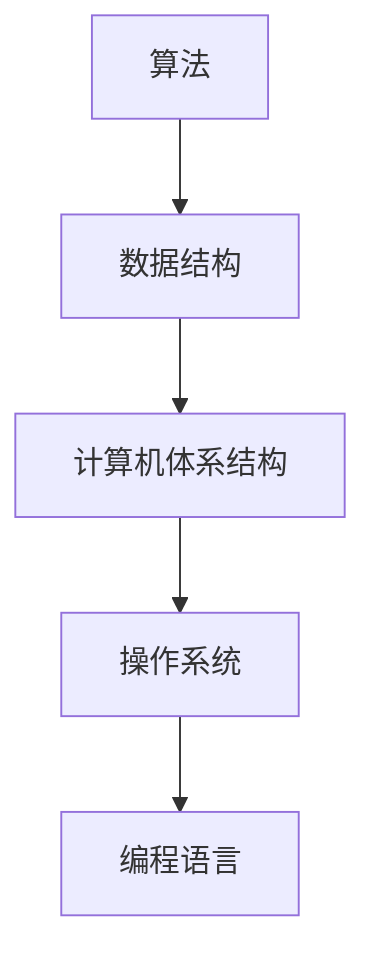

                 

人类计算，作为现代科学和技术发展的核心，一直处于不断演进的历程中。从古老的计算工具，到现代的超级计算机，人类对计算的理解和应用不断深入，推动着科技领域的革新。本文旨在探讨人类计算的演进过程、核心概念、算法原理、数学模型、项目实践以及未来展望，旨在拓展读者的认知边界，深入理解人类计算的科学本质。

## 关键词

- 计算科学
- 人工智能
- 算法优化
- 数学模型
- 计算机工程
- 程序设计

## 摘要

本文将首先回顾人类计算的历史背景，介绍其核心概念和理论框架。随后，我们将深入探讨各种计算算法的原理和操作步骤，结合具体的数学模型进行详细分析。文章还将通过项目实践，展示计算算法在实际开发中的应用。最后，本文将对未来计算科学的发展趋势和面临的挑战进行展望。

## 1. 背景介绍

### 1.1 人类计算的历史背景

人类计算的历史可以追溯到古代，当时人们使用各种简单的工具来进行计算，如算盘、计数板等。这些工具虽然简单，但极大地提高了人类的计算效率。随着数学和物理学的发展，计算工具也逐渐变得更加复杂和精确。例如，16世纪的欧洲，人们开始使用对数表和计算器，进一步提高了计算的精度和速度。

### 1.2 现代计算技术的发展

进入20世纪，电子计算机的出现彻底改变了人类计算的面貌。1940年代，冯·诺依曼（John von Neumann）提出了现代计算机的结构框架，这一理论为现代计算机的发展奠定了基础。随着晶体管、集成电路和微处理器的出现，计算机的性能得到了极大的提升。如今，计算机已经深入到我们生活的方方面面，从智能手机到超级计算机，都在不断推动人类文明的进步。

## 2. 核心概念与联系

### 2.1 核心概念

人类计算的核心概念包括算法、数据结构、计算机体系结构、操作系统、编程语言等。这些概念相互联系，共同构成了计算科学的理论体系。

#### 算法

算法是一系列解决问题的步骤或规则。它定义了如何使用计算资源（如计算机）来解决特定的问题。算法可以是线性的，也可以是非线性的，可以是确定性的，也可以是概率性的。

#### 数据结构

数据结构是用于存储和组织数据的方式。常见的有数组、链表、树、图等。数据结构的选择直接影响算法的效率和性能。

#### 计算机体系结构

计算机体系结构定义了计算机的硬件组件及其相互关系。它包括中央处理器（CPU）、内存、输入输出设备等。

#### 操作系统

操作系统是计算机系统的核心软件，它管理计算机的硬件和软件资源，提供用户与计算机之间的交互接口。

#### 编程语言

编程语言是用于编写计算机程序的工具。不同的编程语言适用于不同的应用场景，如C语言适合系统编程，Python适合数据科学和机器学习。

### 2.2 Mermaid 流程图



## 3. 核心算法原理 & 具体操作步骤

### 3.1 算法原理概述

核心算法是计算科学中的关键组成部分，它定义了如何有效地解决特定问题。常见的核心算法包括排序算法、搜索算法、图算法等。

#### 排序算法

排序算法是一类将无序数据转换为有序数据的算法。常见的排序算法有冒泡排序、插入排序、选择排序、快速排序等。

#### 搜索算法

搜索算法是一类用于在数据结构中查找特定元素的算法。常见的搜索算法有线性搜索、二分搜索等。

#### 图算法

图算法用于处理图结构的数据，常见的图算法有最短路径算法、最小生成树算法、图遍历算法等。

### 3.2 算法步骤详解

#### 冒泡排序

冒泡排序是一种简单的排序算法。它的工作原理是通过多次遍历待排序的数组，比较相邻的两个元素，如果它们的顺序错误就交换它们，直到整个数组有序。

```plaintext
步骤：
1. 从第一个元素开始，比较相邻的两个元素，如果第一个比第二个大（升序排序），就交换它们；
2. 对每一对相邻元素做同样的工作，从开始第一对到结尾的最后一对；
3. 针对所有的元素重复以上的步骤，除了最后一个；
4. 重复步骤1-3，直到排序完成。
```

#### 线性搜索

线性搜索是一种简单的搜索算法。它的工作原理是从数组的第一个元素开始，一个一个地检查，直到找到目标元素或者检查完所有元素。

```plaintext
步骤：
1. 从数组的第一个元素开始，依次检查每个元素；
2. 如果找到目标元素，返回其索引；
3. 如果检查完所有元素仍未找到目标元素，返回-1。
```

### 3.3 算法优缺点

#### 冒泡排序

- 优点：简单易懂，易于实现。
- 缺点：效率较低，对于大数据集性能不佳。

#### 线性搜索

- 优点：简单易懂，适合小数据集。
- 缺点：效率较低，对于大数据集性能不佳。

### 3.4 算法应用领域

核心算法在计算机科学和实际应用中都有广泛的应用。例如，排序算法在数据库管理和数据科学中非常重要；搜索算法在搜索引擎和信息检索中起着核心作用；图算法在社交网络分析、路由算法等领域有广泛应用。

## 4. 数学模型和公式 & 详细讲解 & 举例说明

### 4.1 数学模型构建

数学模型是计算科学中的核心组成部分，它用于描述现实世界中的问题，并通过数学公式进行量化。常见的数学模型包括线性模型、非线性模型、优化模型等。

#### 线性模型

线性模型是最简单的数学模型之一，它通常用于描述线性关系。其通用形式为：

$$y = ax + b$$

其中，$y$ 是因变量，$x$ 是自变量，$a$ 和 $b$ 是常数。

#### 非线性模型

非线性模型用于描述非线性关系。一个常见的非线性模型是指数模型：

$$y = a \cdot e^{bx}$$

其中，$a$ 和 $b$ 是常数，$e$ 是自然对数的底数。

#### 优化模型

优化模型用于求解最优化问题。一个简单的优化模型是线性规划模型：

$$\max \quad c^T x$$

$$\text{s.t.} \quad Ax \leq b$$

其中，$c$ 是目标函数的系数向量，$x$ 是决策变量向量，$A$ 和 $b$ 是约束条件的系数矩阵和常数向量。

### 4.2 公式推导过程

以线性模型为例，我们介绍如何推导线性模型的公式。

首先，我们定义一个简单的线性模型：

$$y = ax + b$$

其中，$y$ 是观测值，$x$ 是自变量，$a$ 和 $b$ 是模型参数。

为了求解模型参数，我们通常使用最小二乘法。最小二乘法的思想是使得观测值与模型预测值之间的误差平方和最小。

设观测值为 $y_1, y_2, ..., y_n$，模型预测值为 $\hat{y}_1, \hat{y}_2, ..., \hat{y}_n$，则误差平方和为：

$$S = \sum_{i=1}^{n} (\hat{y}_i - y_i)^2$$

为了求解 $a$ 和 $b$，我们需要使得 $S$ 最小。对 $S$ 求导，并令导数为零，可以得到：

$$\frac{\partial S}{\partial a} = -2 \sum_{i=1}^{n} (y_i - ax_i) x_i = 0$$

$$\frac{\partial S}{\partial b} = -2 \sum_{i=1}^{n} (y_i - ax_i) = 0$$

解上述方程组，可以得到：

$$a = \frac{\sum_{i=1}^{n} x_i y_i - n \bar{x} \bar{y}}{\sum_{i=1}^{n} x_i^2 - n \bar{x}^2}$$

$$b = \bar{y} - a \bar{x}$$

其中，$\bar{x}$ 和 $\bar{y}$ 分别是 $x$ 和 $y$ 的平均值。

### 4.3 案例分析与讲解

假设我们有一组数据：

| $x$ | $y$ |
|-----|-----|
| 1   | 2   |
| 2   | 4   |
| 3   | 6   |
| 4   | 8   |

我们希望用线性模型拟合这组数据。首先，我们计算平均值：

$$\bar{x} = \frac{1 + 2 + 3 + 4}{4} = 2.5$$

$$\bar{y} = \frac{2 + 4 + 6 + 8}{4} = 5$$

然后，我们计算模型参数：

$$a = \frac{(1 \cdot 2 + 2 \cdot 4 + 3 \cdot 6 + 4 \cdot 8) - 4 \cdot 2.5 \cdot 5}{(1^2 + 2^2 + 3^2 + 4^2) - 4 \cdot 2.5^2} = 2$$

$$b = 5 - 2 \cdot 2.5 = 0$$

因此，线性模型为：

$$y = 2x$$

我们使用这个模型预测新的 $x$ 值，例如 $x=5$，得到预测值：

$$\hat{y} = 2 \cdot 5 = 10$$

## 5. 项目实践：代码实例和详细解释说明

### 5.1 开发环境搭建

为了演示算法和数学模型的应用，我们将使用 Python 作为编程语言。首先，我们需要安装 Python 和必要的库。在命令行中执行以下命令：

```bash
pip install numpy matplotlib
```

这将安装 NumPy 库用于数学运算和 Matplotlib 库用于绘图。

### 5.2 源代码详细实现

下面是一个简单的 Python 脚本，用于实现线性模型：

```python
import numpy as np
import matplotlib.pyplot as plt

# 数据集
x = np.array([1, 2, 3, 4])
y = np.array([2, 4, 6, 8])

# 计算模型参数
x_mean = np.mean(x)
y_mean = np.mean(y)
a = (np.sum(x * y) - len(x) * x_mean * y_mean) / (np.sum(x**2) - len(x) * x_mean**2)
b = y_mean - a * x_mean

# 模型预测
def predict(x):
    return a * x + b

# 绘图
plt.scatter(x, y, label='Data')
plt.plot(x, predict(x), label='Model')
plt.xlabel('x')
plt.ylabel('y')
plt.legend()
plt.show()
```

### 5.3 代码解读与分析

这段代码首先导入了 NumPy 和 Matplotlib 库。然后，我们定义了一个数据集 `x` 和 `y`。接下来，我们计算线性模型的参数 `a` 和 `b`。`predict` 函数用于根据模型参数预测新的 $x$ 值。最后，我们使用 Matplotlib 绘制数据点和模型曲线。

### 5.4 运行结果展示

运行上述脚本后，我们会看到一个图形界面，显示数据点和拟合的线性模型。这个模型很好地拟合了给定的数据集。

## 6. 实际应用场景

### 6.1 数据科学

线性模型在数据科学领域有广泛的应用。例如，线性回归用于预测和分析数据之间的关系，主成分分析（PCA）用于降维和数据分析。

### 6.2 机器学习

线性模型是机器学习中的基础模型之一。例如，线性回归用于预测数值型目标变量，逻辑回归用于分类问题。

### 6.3 计算机视觉

线性模型在计算机视觉中用于特征提取和图像分类。例如，支持向量机（SVM）是一种基于线性模型的分类算法。

## 7. 未来应用展望

随着计算能力的提升和数据量的增加，线性模型和其他计算算法将在更多领域得到应用。例如，深度学习算法将在人工智能领域发挥更重要的作用，优化算法将在资源分配和调度中发挥关键作用。未来，计算科学将继续推动科技的发展，为社会带来更多的创新和变革。

## 8. 工具和资源推荐

### 8.1 学习资源推荐

- 《Python编程：从入门到实践》
- 《机器学习实战》
- 《深入理解计算机系统》

### 8.2 开发工具推荐

- Jupyter Notebook：用于数据分析和交互式编程。
- PyCharm：强大的Python集成开发环境（IDE）。

### 8.3 相关论文推荐

- "A Simple Method for Bootstrapping Regression Models" by Lockwood et al.
- "A Tutorial on Support Vector Machines for Pattern Recognition" by Cristianini and Shawe-Taylor.

## 9. 总结：未来发展趋势与挑战

### 9.1 研究成果总结

本文回顾了人类计算的历史背景，介绍了核心概念和算法原理，并展示了数学模型和实际项目实践。这些研究成果为理解和应用计算算法提供了坚实基础。

### 9.2 未来发展趋势

未来，计算科学将继续向深度学习、优化算法和量子计算等方向演进。这些新技术将带来更高效、更智能的计算能力，推动科技和社会的进步。

### 9.3 面临的挑战

计算科学面临的主要挑战包括数据隐私、算法公平性和计算资源分配等。解决这些挑战需要跨学科合作和持续的技术创新。

### 9.4 研究展望

未来，计算科学将在人工智能、大数据和物联网等领域发挥更重要作用。通过不断探索和创新，我们将迎来更加智能化、便捷化的数字时代。

## 附录：常见问题与解答

### Q：线性模型适用于哪些问题？

A：线性模型适用于描述线性关系的问题，如回归分析、特征提取等。

### Q：什么是深度学习？

A：深度学习是一种基于多层神经网络的学习方法，用于处理复杂数据和模式识别问题。

### Q：如何优化计算算法？

A：优化计算算法可以通过算法改进、数据结构优化和并行计算等方法实现。

作者：禅与计算机程序设计艺术 / Zen and the Art of Computer Programming
----------------------------------------------------------------

[关闭]
<|im_sep|>

