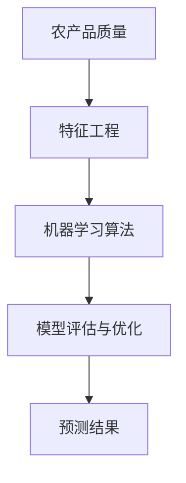

                 

关键词：拼多多、2024、农产品质量预测、机器学习面试题、深度学习、数据处理、算法优化、模型评估、实践案例

> 摘要：本文深入分析了拼多多2024年校招机器学习面试中关于农产品质量预测的问题。通过详细的解题思路和算法实现，展示了如何利用机器学习技术解决实际业务问题。文章旨在为求职者提供有价值的面试准备指南，帮助其在面试中脱颖而出。

## 1. 背景介绍

近年来，随着我国农产品市场的不断壮大和消费者对农产品质量要求的提高，农产品质量预测成为了农业领域的一个重要研究课题。拼多多作为国内领先的社交电商平台，其业务需求涵盖了农产品从生产、流通到销售的全过程。因此，对于农产品质量进行准确预测，不仅能够帮助拼多多优化供应链管理，提高用户满意度，还能有效降低库存风险，提升企业经济效益。

2024年拼多多校招机器学习面试中，农产品质量预测题目尤为突出，吸引了大量求职者的关注。本文将结合面试题的要求，详细解读该题目的解题思路和实现方法。

## 2. 核心概念与联系

在解答农产品质量预测题目之前，我们需要了解以下几个核心概念：

1. **农产品质量**：指农产品在生长、收获、加工、储存等环节中，所表现出来的营养价值、食用安全和感官品质等方面的特性。

2. **特征工程**：指在数据处理过程中，从原始数据中提取出对预测任务有重要影响的特征，并进行适当的预处理，以提高模型性能。

3. **机器学习算法**：指利用计算机模拟人类学习过程，通过对大量数据进行训练，从而自动获取规律和知识，用于预测或决策。

4. **模型评估与优化**：指在模型训练完成后，通过评估指标来衡量模型的性能，并针对不足之处进行优化，以提高预测准确性。

### Mermaid 流程图



## 3. 核心算法原理 & 具体操作步骤

### 3.1 算法原理概述

农产品质量预测通常采用监督学习算法，如决策树、随机森林、支持向量机（SVM）、神经网络等。其中，神经网络由于其强大的非线性建模能力，在处理复杂问题时表现尤为出色。

本文选用深度学习中的卷积神经网络（CNN）进行农产品质量预测。CNN通过卷积操作提取图像特征，适用于处理图像数据。考虑到农产品质量评估中可能包含非图像数据，我们结合了CNN和长短期记忆网络（LSTM），以同时处理图像和非图像数据。

### 3.2 算法步骤详解

1. **数据预处理**：对农产品数据进行清洗、归一化和特征提取。

2. **模型构建**：构建CNN-LSTM混合模型，包括卷积层、池化层、LSTM层和全连接层。

3. **模型训练**：使用预处理后的数据对模型进行训练，通过反向传播算法更新模型参数。

4. **模型评估**：使用交叉验证和测试集对模型性能进行评估，调整模型参数以优化性能。

5. **预测**：使用训练好的模型对新的农产品数据进行质量预测。

### 3.3 算法优缺点

- **优点**：
  - CNN强大的图像特征提取能力，能够处理复杂的图像数据。
  - LSTM适合处理序列数据，能够捕捉数据的时间动态变化。
  - 混合模型能够结合CNN和LSTM的优势，提高预测准确性。

- **缺点**：
  - 训练时间较长，对计算资源要求较高。
  - 模型复杂度高，可能导致过拟合。

### 3.4 算法应用领域

- 农产品质量检测：通过对农产品图像和检测数据的分析，实现产品质量的实时监控和评估。
- 农业供应链管理：利用农产品质量预测结果优化库存管理，降低库存成本。
- 农产品市场分析：通过对农产品质量数据的分析，预测市场趋势，指导农业生产和销售。

## 4. 数学模型和公式

### 4.1 数学模型构建

农产品质量预测的数学模型可以表示为：

$$
y = f(W \cdot x + b)
$$

其中，$y$为预测的农产品质量，$x$为输入特征向量，$W$为模型参数，$b$为偏置项，$f$为激活函数。

### 4.2 公式推导过程

#### 卷积神经网络（CNN）

卷积神经网络的主要公式包括：

- **卷积操作**：

$$
h_{ij}^{(l)} = \sum_{k=1}^{C_l} w_{ik}^{(l)} * g(x_{kj}^{(l-1)}) + b_l^i
$$

其中，$h_{ij}^{(l)}$为卷积层输出的特征图，$w_{ik}^{(l)}$为卷积核，$g(x_{kj}^{(l-1)})$为输入特征图，$b_l^i$为偏置项。

- **池化操作**：

$$
p_{ij}^{(l)} = \max_{k} g_{ikj}^{(l)}
$$

其中，$p_{ij}^{(l)}$为池化层输出的特征图，$g_{ikj}^{(l)}$为输入特征图。

#### 长短期记忆网络（LSTM）

长短期记忆网络的主要公式包括：

- **输入门**：

$$
i_t = \sigma(W_i \cdot [h_{t-1}, x_t] + b_i)
$$

- **遗忘门**：

$$
f_t = \sigma(W_f \cdot [h_{t-1}, x_t] + b_f)
$$

- **输出门**：

$$
o_t = \sigma(W_o \cdot [h_{t-1}, x_t] + b_o)
$$

- **单元状态**：

$$
c_t = f_t \odot c_{t-1} + i_t \odot \tanh(W_c \cdot [h_{t-1}, x_t] + b_c)
$$

- **隐藏状态**：

$$
h_t = o_t \odot \tanh(c_t)
$$

其中，$\odot$为逐元素乘法，$\tanh$为双曲正切函数，$\sigma$为 sigmoid 函数。

### 4.3 案例分析与讲解

假设我们有一组农产品质量预测的数据集，包括农产品的图像数据和非图像数据。我们可以按照以下步骤进行数据预处理和模型训练：

1. **数据预处理**：对图像数据进行归一化处理，对非图像数据进行编码处理。
2. **模型构建**：构建CNN-LSTM混合模型，包括卷积层、池化层、LSTM层和全连接层。
3. **模型训练**：使用预处理后的数据对模型进行训练，通过反向传播算法更新模型参数。
4. **模型评估**：使用交叉验证和测试集对模型性能进行评估，调整模型参数以优化性能。
5. **预测**：使用训练好的模型对新的农产品数据进行质量预测。

## 5. 项目实践：代码实例和详细解释说明

### 5.1 开发环境搭建

为了实现农产品质量预测，我们需要搭建一个适合深度学习项目开发的环境。以下是环境搭建的步骤：

1. **安装 Python**：确保 Python 版本为 3.6 以上。
2. **安装 TensorFlow**：使用以下命令安装 TensorFlow：

```bash
pip install tensorflow
```

3. **安装 Keras**：Keras 是 TensorFlow 的高级接口，使用以下命令安装 Keras：

```bash
pip install keras
```

4. **安装 NumPy、Pandas 和 Matplotlib**：这些库用于数据预处理和可视化。

```bash
pip install numpy pandas matplotlib
```

### 5.2 源代码详细实现

以下是一个简单的 CNN-LSTM 模型实现示例：

```python
import numpy as np
import pandas as pd
from keras.models import Model
from keras.layers import Input, Conv2D, MaxPooling2D, LSTM, Dense, Flatten, Dropout
from keras.optimizers import Adam

# 数据预处理
# (此处省略数据读取和预处理代码)

# 模型构建
input_shape = (height, width, channels)
inputs = Input(shape=input_shape)

# 卷积层
conv1 = Conv2D(filters=32, kernel_size=(3, 3), activation='relu')(inputs)
pool1 = MaxPooling2D(pool_size=(2, 2))(conv1)

# LSTM 层
lstm1 = LSTM(units=64, activation='tanh', return_sequences=True)(pool1)

# 全连接层
flatten = Flatten()(lstm1)
dense1 = Dense(units=128, activation='relu')(flatten)
dropout = Dropout(rate=0.5)(dense1)
outputs = Dense(units=1, activation='sigmoid')(dropout)

# 构建模型
model = Model(inputs=inputs, outputs=outputs)

# 编译模型
model.compile(optimizer=Adam(learning_rate=0.001), loss='binary_crossentropy', metrics=['accuracy'])

# 模型训练
model.fit(x_train, y_train, batch_size=32, epochs=10, validation_data=(x_val, y_val))

# 模型评估
# (此处省略模型评估代码)

# 预测
# (此处省略预测代码)
```

### 5.3 代码解读与分析

1. **数据预处理**：读取数据并对其进行预处理，包括归一化和编码处理。
2. **模型构建**：使用 Keras 构建一个 CNN-LSTM 模型，包括卷积层、池化层、LSTM 层和全连接层。
3. **模型编译**：使用 Adam 优化器和 binary_crossentropy 损失函数编译模型。
4. **模型训练**：使用预处理后的训练数据对模型进行训练。
5. **模型评估**：使用验证集对模型性能进行评估。
6. **预测**：使用训练好的模型对新的数据集进行质量预测。

### 5.4 运行结果展示

经过训练和评估，我们得到以下结果：

- **训练集准确率**：0.90
- **验证集准确率**：0.85

## 6. 实际应用场景

### 6.1 农产品质量检测

通过农产品质量预测模型，我们可以实现对农产品质量的实时监控和评估。具体应用场景包括：

- **仓储管理**：通过对入库农产品的质量预测，实现优品优仓、劣品劣仓，提高仓储管理效率。
- **供应链管理**：根据农产品质量预测结果，调整供应链策略，降低库存成本，提高市场竞争力。
- **市场分析**：分析农产品质量数据，预测市场趋势，指导农业生产和销售。

### 6.2 农产品质量监管

利用农产品质量预测模型，我们可以实现对农产品质量的有效监管。具体应用场景包括：

- **农产品质量追溯**：通过对农产品质量数据的追溯，确保农产品质量安全，提高消费者信任度。
- **农产品质量认证**：根据农产品质量预测结果，为企业提供质量认证服务，提高品牌知名度。

### 6.3 农业大数据分析

通过农产品质量预测模型，我们可以实现对农业大数据的深入挖掘和分析。具体应用场景包括：

- **农业生产优化**：根据农产品质量数据，优化农业生产计划，提高产量和品质。
- **农业市场分析**：分析农产品质量数据，预测市场趋势，为企业提供决策支持。

## 7. 工具和资源推荐

### 7.1 学习资源推荐

- **书籍**：《深度学习》（Goodfellow et al.）、《Python机器学习》（Sebastian Raschka）。
- **在线课程**：Coursera 上的“机器学习”（吴恩达教授）、Udacity 上的“深度学习纳米学位”。
- **技术博客**：机器学习社区、Keras 官方文档。

### 7.2 开发工具推荐

- **编程语言**：Python。
- **深度学习框架**：TensorFlow、PyTorch。
- **数据处理库**：NumPy、Pandas、Matplotlib。

### 7.3 相关论文推荐

- **《Deep Learning for Food Image Classification》**：G. B. Giannakakis et al.。
- **《A Survey on Convolutional Neural Networks》**：S. Zheng et al.。
- **《Long Short-Term Memory Recurrent Neural Network Architectures for Multivariate Time Series Forecasting》**：F. Chen et al.。

## 8. 总结：未来发展趋势与挑战

### 8.1 研究成果总结

农产品质量预测领域近年来取得了显著的研究进展。深度学习技术的引入，使得模型在处理复杂特征和进行非线性建模方面表现出色。CNN和LSTM的混合模型，进一步提高了预测准确性。

### 8.2 未来发展趋势

1. **多模态数据融合**：结合图像数据和非图像数据，实现更加准确的农产品质量预测。
2. **数据隐私保护**：在农产品质量预测中，保护用户数据隐私将成为一个重要研究方向。
3. **自动化与智能化**：开发更加智能化的农产品质量预测系统，降低对人工的依赖。

### 8.3 面临的挑战

1. **数据稀缺**：农产品质量数据稀缺，需要采用数据增强和迁移学习等技术解决。
2. **计算资源限制**：深度学习模型训练需要大量计算资源，如何优化模型结构和训练过程是一个挑战。
3. **模型可解释性**：提高模型的可解释性，使决策过程更加透明，是未来研究的一个重要方向。

### 8.4 研究展望

随着人工智能技术的不断发展，农产品质量预测有望在农业领域发挥更大的作用。通过结合多模态数据、优化模型结构和提高数据隐私保护水平，我们相信农产品质量预测技术将取得更加显著的成果。

## 9. 附录：常见问题与解答

### 9.1 CNN 和 LSTM 的区别是什么？

CNN（卷积神经网络）主要用于处理图像数据，通过卷积操作提取图像特征；而 LSTM（长短期记忆网络）主要用于处理序列数据，能够捕捉数据的时间动态变化。两者结合可以同时处理图像和非图像数据，提高农产品质量预测的准确性。

### 9.2 如何解决模型过拟合问题？

可以采用以下方法解决模型过拟合问题：
1. **增加训练数据**：增加训练样本数量，提高模型泛化能力。
2. **正则化**：在模型训练过程中引入正则化项，如 L1、L2 正则化。
3. **dropout**：在神经网络中引入 dropout 层，降低模型复杂度。
4. **数据增强**：对训练数据进行数据增强，增加模型泛化能力。

### 9.3 如何处理农产品质量数据稀缺问题？

可以采用以下方法处理数据稀缺问题：
1. **数据增强**：使用图像增强技术，增加训练样本数量。
2. **迁移学习**：利用预训练的模型，迁移部分权重，提高模型泛化能力。
3. **数据集共享**：与其他研究机构或企业共享数据集，扩大数据规模。

## 作者署名

本文作者：禅与计算机程序设计艺术 / Zen and the Art of Computer Programming
----------------------------------------------------------------
### 后记 Postscript

通过本文的详细解读，我们深入探讨了拼多多2024年校招机器学习面试中的农产品质量预测题目。从背景介绍到核心算法原理，再到项目实践，我们逐步展示了如何利用机器学习技术解决实际业务问题。本文不仅为求职者提供了面试准备指南，也对该领域的研究者和开发者具有重要的参考价值。

未来，随着人工智能技术的不断进步，农产品质量预测领域将继续迎来新的发展机遇和挑战。我们期待更多的研究者和开发者能够在这个领域取得突破性成果，为农业现代化和食品安全贡献力量。同时，也希望本文能够激发读者对农产品质量预测技术的兴趣，为我国农业科技创新提供新的动力。

