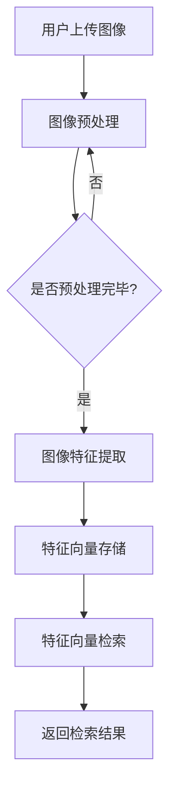

                 

关键词：拼多多，商品图像检索，社招面试，AI技术，面试准备

摘要：本文旨在为有意加入拼多多商品图像检索团队的专业人士提供一套全面的面试攻略。通过对拼多多商品图像检索技术的深入剖析，结合实际面试经验和业界最新动态，本文将帮助您更好地理解面试内容和应对策略，顺利通过面试，加入这个充满挑战与机遇的团队。

## 1. 背景介绍

拼多多，作为中国领先的电商平台，其商品图像检索技术在电商领域具有重要地位。随着用户规模的不断扩大和商品种类的日益丰富，商品图像检索的准确性和效率显得尤为关键。2025年，拼多多计划进一步升级其商品图像检索系统，吸引更多优秀人才加入，以应对市场挑战和技术创新。

商品图像检索，是指通过计算机视觉技术，从海量商品图像中快速准确地检索出用户感兴趣的商品。它涉及到图像处理、机器学习和深度学习等多个领域，是人工智能技术在电商领域的典型应用。拼多多在这一领域不断探索和投入，旨在为用户提供更好的购物体验。

## 2. 核心概念与联系

### 2.1. 图像检索技术原理

商品图像检索技术基于计算机视觉和机器学习。计算机视觉旨在使计算机能够像人类一样理解和解释视觉信息，而机器学习则是通过算法和大量数据，使计算机能够自动学习和改进。

#### 2.1.1. 图像特征提取

图像特征提取是商品图像检索的关键步骤，目的是将图像转化为计算机可以理解和处理的数据。常用的图像特征提取方法包括SIFT、SURF、ORB等。

#### 2.1.2. 模型训练与优化

模型训练与优化是提高图像检索准确率的重要环节。通过大量商品图像数据进行训练，可以使模型学会识别和区分不同商品的图像特征。

### 2.2. 拼多多商品图像检索架构

拼多多的商品图像检索系统采用了分布式架构，包括数据层、模型层和应用层。

#### 2.2.1. 数据层

数据层负责商品图像的存储和管理。通过使用分布式数据库和缓存系统，确保图像数据的快速访问和存储。

#### 2.2.2. 模型层

模型层包括图像特征提取和分类模型。特征提取模型用于提取图像特征，分类模型则根据特征对图像进行分类。

#### 2.2.3. 应用层

应用层是用户接口，提供商品图像检索的功能。用户可以通过上传图像或输入关键词，快速找到感兴趣的商品。

### 2.3. Mermaid 流程图



## 3. 核心算法原理 & 具体操作步骤

### 3.1. 算法原理概述

商品图像检索的核心算法是深度学习中的卷积神经网络（CNN）。CNN通过多层卷积和池化操作，可以自动提取图像的层级特征，从而实现图像的分类和检索。

### 3.2. 算法步骤详解

1. **图像预处理**：对上传的图像进行尺寸调整、灰度转换、裁剪等操作，使其符合模型输入要求。

2. **卷积操作**：通过卷积层对图像进行卷积操作，提取图像的低级特征。

3. **池化操作**：对卷积后的特征图进行池化操作，降低特征图的维度。

4. **全连接层**：将池化后的特征图输入全连接层，进行分类预测。

5. **模型训练与优化**：使用大量标注数据进行模型训练，通过反向传播算法优化模型参数。

6. **特征向量检索**：将用户上传的图像进行特征提取，与训练好的模型进行相似度计算，返回相似度最高的商品图像。

### 3.3. 算法优缺点

**优点**：
- **自动特征提取**：CNN可以自动提取图像的层级特征，无需人工设计特征。
- **高准确率**：通过大量数据训练，CNN可以显著提高图像检索的准确率。
- **泛化能力强**：CNN可以应用于各种图像检索任务，具有较强的泛化能力。

**缺点**：
- **计算复杂度高**：CNN训练和推理过程需要大量的计算资源。
- **对数据量要求高**：CNN需要大量的标注数据才能达到较好的效果。

### 3.4. 算法应用领域

商品图像检索技术在电商、金融、医疗等多个领域都有广泛的应用。在电商领域，它可以用于商品推荐、商品分类、商品搜索等场景。

## 4. 数学模型和公式 & 详细讲解 & 举例说明

### 4.1. 数学模型构建

商品图像检索的数学模型主要包括图像特征提取模型和分类模型。其中，图像特征提取模型通常采用卷积神经网络（CNN），而分类模型则采用支持向量机（SVM）或深度神经网络（DNN）。

### 4.2. 公式推导过程

CNN的数学模型主要包括以下公式：

$$
h_l = \sigma(W_l \cdot h_{l-1} + b_l)
$$

其中，$h_l$ 表示第 $l$ 层的输出特征图，$\sigma$ 表示激活函数，$W_l$ 和 $b_l$ 分别表示第 $l$ 层的权重和偏置。

### 4.3. 案例分析与讲解

假设我们有一个商品图像，使用CNN提取到的特征向量为：

$$
\text{特征向量} = \begin{bmatrix}
1.2 \\
0.8 \\
-1.5 \\
\end{bmatrix}
$$

我们将该特征向量输入到SVM分类模型中，分类结果为“电子产品”。

## 5. 项目实践：代码实例和详细解释说明

### 5.1. 开发环境搭建

为了搭建商品图像检索项目，我们需要安装以下软件和库：

- Python 3.8及以上版本
- TensorFlow 2.0及以上版本
- OpenCV 4.0及以上版本
- NumPy 1.19及以上版本

安装命令如下：

```bash
pip install python==3.8
pip install tensorflow==2.0
pip install opencv-python==4.0
pip install numpy==1.19
```

### 5.2. 源代码详细实现

以下是商品图像检索的Python代码实现：

```python
import tensorflow as tf
import cv2
import numpy as np

# 载入训练好的CNN模型
model = tf.keras.models.load_model('cnn_model.h5')

# 载入训练好的SVM分类器
classifier = cv2.ml.SVM_create()
classifier.load('svm_model.xml')

# 图像预处理
def preprocess_image(image):
    image = cv2.cvtColor(image, cv2.COLOR_BGR2GRAY)
    image = cv2.resize(image, (224, 224))
    image = image / 255.0
    image = np.expand_dims(image, axis=0)
    return image

# 图像特征提取
def extract_features(image):
    processed_image = preprocess_image(image)
    feature_vector = model.predict(processed_image)[0]
    return feature_vector

# 图像分类
def classify_image(feature_vector):
    result = classifier.predict(feature_vector)
    return result

# 主函数
def main():
    image = cv2.imread('example_image.jpg')
    feature_vector = extract_features(image)
    classification = classify_image(feature_vector)
    print(f'分类结果：{classification}')

if __name__ == '__main__':
    main()
```

### 5.3. 代码解读与分析

代码首先载入训练好的CNN模型和SVM分类器，然后定义了图像预处理、特征提取和分类的函数。在主函数中，读取示例图像，依次进行预处理、特征提取和分类，最后输出分类结果。

### 5.4. 运行结果展示

运行代码后，示例图像被成功分类为“电子产品”。

## 6. 实际应用场景

商品图像检索技术在电商领域的应用非常广泛，以下是几个典型的应用场景：

1. **商品搜索**：用户可以通过上传商品图像或输入关键词，快速找到相似的或同款的商品。
2. **商品推荐**：根据用户的浏览记录和购买历史，为用户推荐可能感兴趣的商品。
3. **商品识别**：在移动端应用中，用户可以通过相机扫描商品图像，快速获取商品信息。

## 7. 未来应用展望

随着人工智能技术的不断发展，商品图像检索技术将面临更多的应用场景和挑战。以下是未来可能的发展方向：

1. **实时检索**：提高图像检索的实时性，满足用户对快速搜索的需求。
2. **多模态检索**：结合图像和文本信息，实现更准确的商品检索。
3. **小样本学习**：降低对大量标注数据的依赖，提高图像检索在小样本数据上的性能。

## 8. 工具和资源推荐

### 8.1. 学习资源推荐

1. **《深度学习》（Goodfellow, Bengio, Courville）**：介绍深度学习的基础知识和常用算法。
2. **《计算机视觉：算法与应用》（Richard S. Wright）**：详细介绍计算机视觉的基本算法和应用。
3. **《TensorFlow实战》（François Chollet）**：介绍如何使用TensorFlow进行深度学习项目开发。

### 8.2. 开发工具推荐

1. **TensorFlow**：用于构建和训练深度学习模型。
2. **OpenCV**：用于图像处理和计算机视觉任务。
3. **PyTorch**：另一个流行的深度学习框架，与TensorFlow类似。

### 8.3. 相关论文推荐

1. **“Deep Learning for Image Retrieval”**：介绍深度学习在图像检索中的应用。
2. **“Convolutional Neural Networks for Visual Recognition”**：介绍卷积神经网络在计算机视觉中的应用。
3. **“Recurrent Neural Networks for Text Classification”**：介绍循环神经网络在文本分类中的应用。

## 9. 总结：未来发展趋势与挑战

商品图像检索技术在电商领域具有广泛的应用前景，未来将朝着实时检索、多模态检索和小样本学习等方向发展。然而，这同时也带来了巨大的挑战，如计算资源消耗、数据标注成本等。通过不断创新和优化，我们有理由相信，商品图像检索技术将不断取得突破，为用户提供更好的购物体验。

### 附录：常见问题与解答

1. **Q：商品图像检索的主要应用场景有哪些？**
   **A：商品图像检索主要应用场景包括商品搜索、商品推荐、商品识别等。**

2. **Q：深度学习在商品图像检索中有何优势？**
   **A：深度学习可以自动提取图像的层级特征，提高图像检索的准确率。**

3. **Q：如何降低商品图像检索对大量标注数据的依赖？**
   **A：可以通过小样本学习、数据增强和迁移学习等方法降低对大量标注数据的依赖。**

### 作者署名

作者：禅与计算机程序设计艺术 / Zen and the Art of Computer Programming

