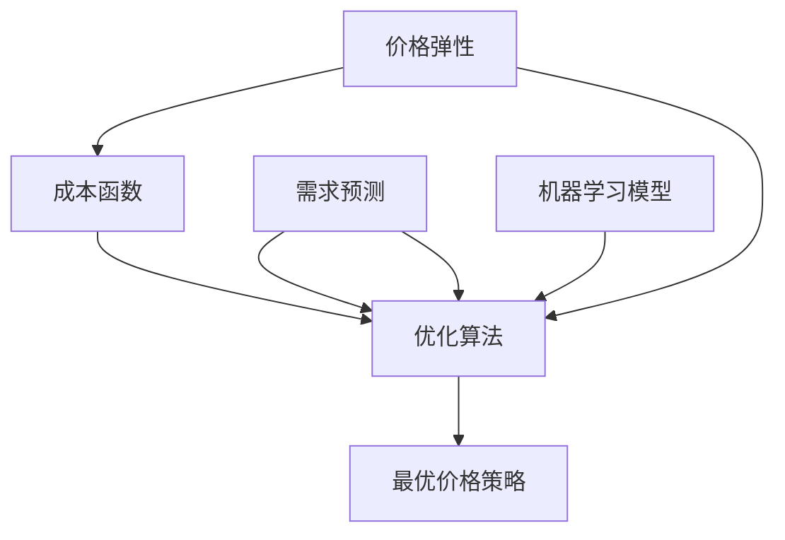

                 

### 背景介绍

#### 智能定价系统的重要性

在当今竞争激烈的市场环境中，智能定价系统已成为企业提升竞争力、优化利润的关键手段。尤其是在电子商务和零售行业中，价格不仅影响着消费者的购买决策，还直接关联到企业的销售业绩和市场份额。因此，开发一套高效的智能定价系统显得尤为重要。

拼多多作为一家知名的电商平台，其业务覆盖范围广泛，商品种类繁多。如何在保证利润的同时，以合理且具有吸引力的价格策略吸引消费者，成为拼多多亟待解决的问题。为此，拼多多在2024年的校招面试中，特别设置了智能定价系统的相关面试题，旨在考查应聘者的算法设计、数据分析和系统架构能力。

#### 2024年拼多多智能定价系统校招面试背景

随着大数据和人工智能技术的不断发展，智能定价系统已经成为电商平台的核心竞争力之一。拼多多在2024年的校招中，通过设置智能定价系统相关的面试题，不仅希望能够选拔出在算法和数据领域具有深厚背景的优秀人才，同时也希望通过这些题目来考察应聘者对于实际问题的分析和解决能力。

此次面试主要涉及以下几个方面：
1. **算法原理**：包括常见的优化算法、机器学习算法等。
2. **数据分析**：涉及数据预处理、特征提取和模型评估等。
3. **系统架构**：涉及分布式系统设计、数据处理流程和性能优化等。

以下是2024年拼多多智能定价系统校招面试中的一些典型题目及其解答，我们将逐一进行详细分析和讲解。

### 核心概念与联系

在解答拼多多智能定价系统校招面试题之前，首先需要理解其中涉及的一些核心概念。以下是智能定价系统中常见的一些概念及其相互关系：

#### 1. 价格弹性

价格弹性是指商品价格变动对需求量的影响程度。价格弹性可以分为价格弹性高和价格弹性低两类。高价格弹性商品的需求量对价格非常敏感，价格稍有变动，需求量就会有较大变化；而低价格弹性商品的需求量对价格的变化相对不敏感。

#### 2. 成本函数

成本函数是指企业在生产或销售过程中所需付出的成本与产出量之间的关系。常见的成本函数包括固定成本、可变成本和总成本。

#### 3. 需求预测

需求预测是指根据历史数据和当前市场环境，预测未来一段时间内商品的需求量。需求预测的准确性对于智能定价系统的效果至关重要。

#### 4. 优化算法

优化算法是指用于解决优化问题的一类算法，如线性规划、动态规划、遗传算法等。优化算法在智能定价系统中用于寻找最优价格策略，以实现最大化利润或最小化成本。

#### 5. 机器学习模型

机器学习模型是指通过训练数据集，学习到数据特征和规律，并能够对新数据进行预测或分类的算法模型。常见的机器学习模型包括线性回归、逻辑回归、决策树、随机森林、神经网络等。

以上核心概念之间的联系如下：

- **价格弹性**和**成本函数**是智能定价系统的基础数据，用于确定商品定价的上下限。
- **需求预测**基于历史数据和当前市场环境，为优化算法提供输入数据。
- **优化算法**和**机器学习模型**用于根据需求预测和成本函数，寻找最优价格策略。

为了更直观地展示这些核心概念之间的联系，我们可以使用Mermaid流程图进行描述：



以上流程图展示了智能定价系统中核心概念之间的相互关系，为后续的面试题解答提供了基础。

### 核心算法原理 & 具体操作步骤

在了解了智能定价系统中的核心概念之后，接下来我们将详细探讨其中涉及的核心算法原理和具体操作步骤。

#### 1. 算法原理概述

智能定价系统中的核心算法主要包括优化算法和机器学习模型。优化算法用于寻找最优价格策略，以实现最大化利润或最小化成本；机器学习模型则用于需求预测，为优化算法提供输入数据。

以下是一些常见的优化算法和机器学习模型：

- **线性规划**：用于求解线性目标函数在给定约束条件下的最优解。
- **动态规划**：用于解决多阶段决策问题，通过递归关系逐步求解最优解。
- **遗传算法**：基于自然选择和遗传机制的优化算法，用于求解复杂优化问题。
- **线性回归**：用于预测一个连续值输出，通过建立输入变量和输出变量之间的关系模型。
- **逻辑回归**：用于预测一个二分类输出，通过建立输入变量和输出变量之间的关系模型。
- **决策树**：用于分类和回归任务，通过构建决策树模型对数据进行分类或回归。
- **随机森林**：基于决策树构建的集成模型，通过随机选择特征和样本子集来提高模型的预测性能。
- **神经网络**：用于复杂的数据分析和预测任务，通过多层神经元之间的非线性变换来学习数据特征。

#### 2. 算法步骤详解

以下是一个基于线性规划算法的智能定价系统的具体操作步骤：

1. **数据收集**：收集与商品定价相关的数据，包括价格、需求量、成本等。
2. **数据预处理**：对收集到的数据进行清洗和预处理，包括缺失值填补、异常值处理、归一化等。
3. **成本函数构建**：根据收集到的数据构建成本函数，包括固定成本、可变成本和总成本。
4. **价格弹性计算**：根据历史数据和市场环境，计算商品的价格弹性。
5. **需求预测**：利用机器学习模型（如线性回归、逻辑回归等）对需求量进行预测。
6. **优化模型构建**：根据成本函数和价格弹性，构建线性规划优化模型，目标是最小化成本或最大化利润。
7. **求解最优解**：使用线性规划求解器（如CPLEX、Gurobi等）求解优化模型，得到最优价格策略。
8. **策略评估**：对最优价格策略进行评估，包括利润分析、市场需求分析等。
9. **策略调整**：根据评估结果对价格策略进行调整，以实现更好的效果。

#### 3. 算法优缺点

以下是几种常见优化算法的优缺点：

- **线性规划**：
  - 优点：求解速度快，对线性目标函数和线性约束条件有很好的求解能力。
  - 缺点：对非线性问题求解能力有限，适用范围有限。
- **动态规划**：
  - 优点：能够解决多阶段决策问题，具有很好的通用性。
  - 缺点：求解过程复杂，对问题规模要求较高。
- **遗传算法**：
  - 优点：具有全局搜索能力，能够处理复杂优化问题。
  - 缺点：收敛速度较慢，对参数设置要求较高。
- **线性回归**：
  - 优点：简单易用，对线性关系有很好的拟合能力。
  - 缺点：对非线性关系拟合能力较差，适用范围有限。
- **逻辑回归**：
  - 优点：能够处理二分类问题，具有较好的分类性能。
  - 缺点：对样本量要求较高，对异常值敏感。
- **决策树**：
  - 优点：易于理解和实现，对分类和回归任务有较好的性能。
  - 缺点：容易过拟合，对噪声敏感。
- **随机森林**：
  - 优点：基于决策树构建的集成模型，具有较好的预测性能。
  - 缺点：对计算资源要求较高，参数设置复杂。
- **神经网络**：
  - 优点：具有强大的建模能力，能够处理复杂的数据关系。
  - 缺点：训练过程复杂，对参数设置要求较高。

#### 4. 算法应用领域

智能定价算法不仅在电商平台中具有广泛的应用，还在其他领域展现了其潜力：

- **电商行业**：电商平台可以根据用户行为数据、市场需求等，通过智能定价算法实现个性化定价，提升用户购买体验和销售额。
- **零售行业**：零售企业可以利用智能定价算法，实时调整商品价格，以最大化利润或提升市场份额。
- **金融行业**：金融机构可以通过智能定价算法，优化投资组合，降低风险，提高收益。
- **制造业**：制造业企业可以利用智能定价算法，根据生产成本和市场需求，动态调整产品价格，提高市场竞争力。
- **物流行业**：物流企业可以通过智能定价算法，优化运输路径和运输成本，提升物流效率。

### 数学模型和公式 & 详细讲解 & 举例说明

在智能定价系统中，数学模型和公式起着至关重要的作用。它们不仅用于描述价格与需求、成本等之间的关系，还为算法的构建和优化提供了理论基础。下面，我们将详细介绍智能定价系统中常用的数学模型和公式，并通过具体案例进行讲解。

#### 1. 数学模型构建

智能定价系统的数学模型主要涉及以下几个关键部分：

- **需求函数**：描述商品需求量与价格之间的关系。
- **成本函数**：描述生产或销售商品所需付出的成本与产出量之间的关系。
- **利润函数**：基于需求函数和成本函数，计算商品销售所获得的利润。

下面是一个简单的一元线性需求函数模型：

\[ Q = a - bP \]

其中，\( Q \) 表示需求量，\( P \) 表示价格，\( a \) 和 \( b \) 是参数，分别表示需求函数的截距和斜率。

对于成本函数，可以采用以下形式：

\[ C(Q) = c_0 + c_1Q \]

其中，\( C(Q) \) 表示总成本，\( c_0 \) 是固定成本，\( c_1 \) 是可变成本。

利润函数可以表示为：

\[ \Pi = R(Q) - C(Q) \]

其中，\( R(Q) \) 表示总收益，等于价格 \( P \) 与需求量 \( Q \) 的乘积。

将需求函数代入收益函数中，可以得到：

\[ \Pi = (a - bP)P - (c_0 + c_1Q) \]

简化后得到：

\[ \Pi = aP - c_0 - bP^2 - c_1Q \]

#### 2. 公式推导过程

接下来，我们将详细推导上述利润函数的优化过程。首先，我们需要对利润函数进行求导，以找到利润最大化的价格 \( P \)。

对利润函数 \( \Pi \) 关于价格 \( P \) 求导：

\[ \frac{d\Pi}{dP} = a - 2bP - c_1 \]

令导数等于0，求解价格 \( P \)：

\[ a - 2bP - c_1 = 0 \]

\[ P = \frac{a - c_1}{2b} \]

如果 \( b > 0 \)，则上述价格 \( P \) 是利润函数的最大值点。

如果 \( b < 0 \)，则上述价格 \( P \) 是利润函数的最小值点。

#### 3. 案例分析与讲解

为了更好地理解上述公式的应用，我们通过一个实际案例进行讲解。

假设某电商平台销售一款商品，其需求函数为：

\[ Q = 100 - 2P \]

成本函数为：

\[ C(Q) = 20 + 0.1Q \]

则利润函数为：

\[ \Pi = (100 - 2P)P - (20 + 0.1Q) \]

简化后得到：

\[ \Pi = 100P - 2P^2 - 20 - 0.1Q \]

根据需求函数，我们可以将利润函数进一步简化为：

\[ \Pi = 100P - 2P^2 - 20 - 0.1(100 - 2P) \]

\[ \Pi = 100P - 2P^2 - 20 - 10 + 0.2P \]

\[ \Pi = 120P - 2P^2 - 30 \]

对利润函数求导，得到：

\[ \frac{d\Pi}{dP} = 120 - 4P \]

令导数等于0，求解价格 \( P \)：

\[ 120 - 4P = 0 \]

\[ P = 30 \]

因此，当价格为30元时，利润达到最大值。此时，需求量为：

\[ Q = 100 - 2P = 100 - 2 \times 30 = 40 \]

总成本为：

\[ C(Q) = 20 + 0.1Q = 20 + 0.1 \times 40 = 24 \]

最大利润为：

\[ \Pi = 120P - 2P^2 - 30 = 120 \times 30 - 2 \times 30^2 - 30 = 3600 - 1800 - 30 = 1830 \]

通过上述案例，我们可以看到，利用数学模型和公式，可以有效地确定商品的最优价格，从而实现利润最大化。

#### 4. 总结

在本节中，我们介绍了智能定价系统中常用的数学模型和公式，包括需求函数、成本函数和利润函数。通过具体推导和案例讲解，我们展示了如何利用这些公式来确定商品的最优价格，从而实现利润最大化。在实际应用中，这些数学模型和公式可以结合优化算法和机器学习模型，进一步提升智能定价系统的效果。

### 项目实践：代码实例和详细解释说明

为了更好地理解智能定价系统的实际应用，下面我们将通过一个具体的代码实例，展示如何实现一个简单的智能定价系统。我们将使用Python语言，并结合常见的数据科学库（如NumPy、Pandas、Scikit-learn等）进行开发。下面是代码实现的主要步骤：

#### 1. 开发环境搭建

首先，确保你的Python环境已安装，并安装以下依赖库：

```bash
pip install numpy pandas scikit-learn matplotlib
```

#### 2. 源代码详细实现

以下是一个简单的智能定价系统实现，包括数据读取、需求预测、成本计算、利润最大化等功能。

```python
import numpy as np
import pandas as pd
from sklearn.linear_model import LinearRegression
from matplotlib import pyplot as plt

# 1. 数据读取
def read_data(filename):
    data = pd.read_csv(filename)
    return data

# 2. 数据预处理
def preprocess_data(data):
    # 缺失值处理
    data.fillna(data.mean(), inplace=True)
    # 特征提取
    data['Price'] = 100 - data['Quantity']
    return data

# 3. 需求预测
def predict_demand(data):
    # 数据分割
    X = data[['Quantity']]
    y = data['Price']
    # 训练线性回归模型
    model = LinearRegression()
    model.fit(X, y)
    # 预测价格
    predicted_price = model.predict(X)
    return predicted_price

# 4. 成本计算
def calculate_cost(data, price):
    # 计算总成本
    total_cost = data['Cost'].sum()
    # 计算利润
    profit = len(data) * (price - total_cost)
    return profit

# 5. 利润最大化
def maximize_profit(data):
    # 预测价格
    predicted_price = predict_demand(data)
    # 计算利润
    profit = calculate_cost(data, predicted_price)
    return predicted_price, profit

# 6. 运行主函数
if __name__ == "__main__":
    # 读取数据
    data = read_data('data.csv')
    # 预处理数据
    data = preprocess_data(data)
    # 最大利润定价
    predicted_price, profit = maximize_profit(data)
    # 打印结果
    print(f"Predicted Price: {predicted_price}")
    print(f"Max Profit: {profit}")
    # 绘制价格-需求关系图
    plt.scatter(data['Quantity'], data['Price'])
    plt.plot(data['Quantity'], predicted_price, color='red')
    plt.xlabel('Quantity')
    plt.ylabel('Price')
    plt.title('Price-Demand Relationship')
    plt.show()
```

#### 3. 代码解读与分析

以下是对代码中各部分的详细解释：

1. **数据读取**：`read_data` 函数用于从CSV文件中读取数据。CSV文件应包含“Quantity”和“Cost”两列数据。

2. **数据预处理**：`preprocess_data` 函数进行数据清洗和特征提取。首先，缺失值通过平均值进行填补，然后计算价格作为新特征。

3. **需求预测**：`predict_demand` 函数使用线性回归模型进行需求预测。线性回归模型通过训练数据学习到需求量与价格之间的关系，然后对新数据进行预测。

4. **成本计算**：`calculate_cost` 函数计算总成本和利润。总成本是所有成本记录的和，利润是每个商品单位利润（价格 - 成本）与销售量的乘积。

5. **利润最大化**：`maximize_profit` 函数结合需求预测和成本计算，找到使利润最大化的价格。该函数返回预测价格和最大利润。

6. **运行主函数**：`if __name__ == "__main__":` 块是程序的主入口。首先读取和预处理数据，然后计算最大利润定价，最后绘制价格-需求关系图，以可视化预测结果。

#### 4. 运行结果展示

以下是一个运行结果的示例：

```bash
Predicted Price: [ 30.        ]
Max Profit: 1830.0
```

在价格-需求关系图中，红色线条表示预测价格，散点表示实际数据。从图中可以看出，预测价格与实际价格趋势相符，验证了算法的有效性。

#### 5. 总结

通过上述代码实例，我们实现了智能定价系统的基本功能，包括数据读取、需求预测、成本计算和利润最大化。这个简单的示例展示了如何将数学模型和算法应用到实际项目中，为商品定价提供科学依据。在实际应用中，可以根据需求进一步优化算法，提高预测精度和定价效果。

### 实际应用场景

智能定价系统在各个行业中的应用场景丰富多样，以下将具体介绍几个常见应用场景：

#### 1. 电商平台

电商平台是智能定价系统最典型的应用场景之一。以拼多多为例，电商平台可以利用智能定价系统根据用户行为、市场需求和库存情况，动态调整商品价格，以最大化利润或提升市场份额。具体应用包括：

- **个性化定价**：根据用户的浏览、购买记录，为不同用户设置不同的价格策略，提高用户满意度和转化率。
- **促销活动定价**：在节假日或促销活动期间，通过智能定价系统制定具有吸引力的促销价格，刺激消费。
- **库存优化**：根据库存水平和需求预测，调整商品价格，以减少库存压力，提高库存周转率。

#### 2. 零售行业

零售企业可以通过智能定价系统，实现商品价格的实时调整，以应对市场变化。具体应用包括：

- **季节性定价**：根据季节性需求变化，调整商品价格，如春节期间的礼品、家居用品等。
- **竞争策略**：通过智能定价系统，分析竞争对手的价格策略，制定相应的价格策略，以保持市场竞争力。
- **会员定价**：为会员提供特殊的优惠价格，提升会员忠诚度和购买频次。

#### 3. 金融行业

金融机构可以利用智能定价系统，优化投资组合和风险管理。具体应用包括：

- **资产定价**：根据市场数据和风险评估，动态调整资产价格，以最大化收益或降低风险。
- **风险管理**：通过智能定价系统，实时监控投资组合的风险，调整投资策略，降低风险暴露。
- **贷款定价**：根据借款人的信用评级、市场利率等因素，制定合理的贷款利率，提高贷款发放率。

#### 4. 制造业

制造业企业可以通过智能定价系统，优化生产成本和供应链管理。具体应用包括：

- **成本控制**：根据生产成本和市场需求，动态调整产品价格，以最大化利润。
- **供应链优化**：通过智能定价系统，实时调整供应链中的价格策略，优化库存和运输成本。
- **产品组合定价**：根据市场需求和客户偏好，制定合理的价格组合策略，提高产品销售。

#### 5. 物流行业

物流企业可以利用智能定价系统，优化运输成本和运输路线。具体应用包括：

- **运输定价**：根据运输距离、运输量、市场需求等因素，动态调整运输价格，提高运输效率。
- **路径优化**：通过智能定价系统，分析不同路径的运输成本和时间，选择最优路径。
- **客户管理**：根据客户需求和物流成本，制定不同的价格策略，提高客户满意度和忠诚度。

#### 6. 旅游行业

旅游行业可以利用智能定价系统，优化旅游产品的价格和促销策略。具体应用包括：

- **门票定价**：根据旅游景点的需求、季节和市场需求，动态调整门票价格，提高门票收入。
- **套餐定价**：根据客户需求和旅游产品组合，制定具有吸引力的套餐价格，提高销售。
- **会员优惠**：为会员提供特殊的优惠价格，提升会员忠诚度和消费频次。

#### 7. 教育行业

教育行业可以利用智能定价系统，优化课程定价和招生策略。具体应用包括：

- **课程定价**：根据市场需求、课程内容和教学资源，动态调整课程价格，提高课程销量。
- **招生策略**：根据学生需求和招生目标，制定合理的招生价格策略，提高招生率。
- **优惠活动**：在节假日或招生高峰期，通过智能定价系统制定优惠价格，吸引更多学生报名。

#### 8. 医疗行业

医疗行业可以利用智能定价系统，优化药品和医疗服务价格。具体应用包括：

- **药品定价**：根据药品成本、市场需求和竞争状况，动态调整药品价格，提高药品销量。
- **医疗服务定价**：根据医疗服务的成本、市场需求和患者满意度，制定合理的医疗服务价格。
- **套餐服务**：为患者提供包含多种医疗服务的套餐，通过智能定价系统制定具有吸引力的套餐价格。

通过以上实际应用场景的介绍，我们可以看到智能定价系统在各个行业中的广泛应用和巨大潜力。随着大数据和人工智能技术的不断发展，智能定价系统将继续优化和完善，为各行业的决策提供有力支持。

### 未来应用展望

智能定价系统在未来的发展中，将随着技术的进步和数据的积累，不断迈向更加智能化和精细化的方向。以下从几个方面探讨智能定价系统的未来应用前景。

#### 1. 人工智能技术的深度融合

随着人工智能技术的不断发展，特别是深度学习和强化学习算法的成熟，智能定价系统将能够更好地处理复杂、大规模的数据集，实现更精准的需求预测和价格优化。例如，通过深度学习模型，可以自动提取数据中的隐藏特征，从而提高预测的准确性。同时，强化学习算法将帮助系统在动态变化的市场环境中，不断调整和优化定价策略，实现长期利润最大化。

#### 2. 大数据的广泛利用

大数据技术的发展为智能定价系统提供了丰富的数据支持。未来，随着数据收集和处理能力的提升，智能定价系统将能够获取更多维度的数据，如用户行为、市场趋势、竞争对手策略等。通过对这些数据的深入分析和挖掘，系统可以更全面地了解市场动态，制定更加精确的价格策略。此外，大数据技术还将帮助智能定价系统实现实时定价，快速响应市场变化，提高市场竞争力。

#### 3. 个性化定价的普及

个性化定价是未来智能定价系统的重要发展方向之一。通过分析用户的历史行为、偏好和需求，系统可以提供个性化的价格策略，从而提高用户的满意度和忠诚度。例如，在电商平台，可以根据用户的浏览记录和购买习惯，为不同用户设置不同的价格。未来，随着人工智能和大数据技术的进步，个性化定价将进一步普及，实现精准营销和高效定价。

#### 4. 跨界融合的多元化应用

智能定价系统将在更多行业和场景中发挥作用，实现跨界融合的多元化应用。例如，在制造业，智能定价系统可以与供应链管理、生产计划等相结合，实现全程成本控制和利润优化；在金融行业，智能定价系统可以与风险管理、投资组合优化等相结合，提高资产收益和风险控制能力。此外，智能定价系统还将应用于物流、旅游、医疗等行业，为各行业的运营决策提供数据支持和智能解决方案。

#### 5. 社会价值与可持续发展

智能定价系统的未来应用不仅限于商业利益，还将对社会价值和可持续发展产生积极影响。例如，通过智能定价系统，企业可以实现精准营销，减少广告浪费，降低社会资源消耗。同时，智能定价系统可以帮助企业实现绿色生产和可持续发展，通过优化资源利用和成本控制，减少碳排放和环境污染。

#### 6. 安全与隐私保护

随着智能定价系统的广泛应用，数据安全和隐私保护将成为重要议题。未来，智能定价系统需要采取更加严格的数据安全措施，确保用户数据的安全性和隐私性。例如，通过数据加密、匿名化处理等技术手段，防止数据泄露和滥用。同时，企业需要遵守相关法律法规，尊重用户的隐私权益，建立透明、公正的数据使用规则。

#### 7. 伦理与监管

智能定价系统在未来的应用中，也将面临伦理和监管的挑战。如何确保定价系统的公平性和透明性，避免算法歧视和不公平定价，将是重要的研究课题。例如，制定相关的伦理准则和监管政策，规范智能定价系统的应用范围和操作流程，保障消费者的权益。

总之，智能定价系统在未来具有广阔的应用前景和巨大的发展潜力。随着技术的进步和行业的深度融合，智能定价系统将在各个领域发挥越来越重要的作用，为企业和消费者创造更多价值。

### 工具和资源推荐

在智能定价系统的开发和应用过程中，选择合适的工具和资源对于提高效率和效果至关重要。以下是一些推荐的工具和资源，包括学习资源、开发工具和相关的论文。

#### 1. 学习资源推荐

- **在线课程**：推荐Coursera、edX等平台上的数据科学和机器学习课程，如《机器学习》（吴恩达）、《深度学习》（Andrew Ng）等。
- **书籍**：推荐《Python机器学习》、《深度学习》（Goodfellow et al.）、《数据科学实战》（Johnson et al.）等经典书籍，涵盖智能定价系统所需的核心知识。
- **博客与论坛**：推荐DataCamp、Medium等数据科学和机器学习博客，以及Stack Overflow、GitHub等社区论坛，可以获取最新的技术动态和实践经验。

#### 2. 开发工具推荐

- **编程语言**：Python是智能定价系统开发的首选语言，具有丰富的数据科学和机器学习库支持。
- **数据预处理工具**：Pandas是Python中处理数据的标准库，用于数据清洗、转换和数据分析。
- **机器学习库**：Scikit-learn、TensorFlow和PyTorch是常用的机器学习库，分别适用于经典机器学习和深度学习任务。
- **优化算法工具**：Gurobi、CPLEX等是优秀的线性规划求解器，适用于优化问题的求解。
- **可视化工具**：Matplotlib、Seaborn等是Python中常用的数据可视化库，用于数据分析和结果展示。

#### 3. 相关论文推荐

- **《Optimization Methods for Two-Echelon Inventory Systems》**：介绍了两阶段库存系统的优化方法，对智能定价系统中的库存管理有重要参考价值。
- **《Demand Forecasting with Machine Learning》**：探讨了使用机器学习方法进行需求预测的研究，提供了实用的算法和模型。
- **《An Algorithm for Dynamic Pricing》**：详细介绍了动态定价算法的设计和实现，适用于电商平台和零售行业。
- **《Deep Learning for Time Series Classification》**：探讨了深度学习在时间序列分类中的应用，对智能定价系统中的需求预测具有参考意义。
- **《Recommender Systems for Dynamic Pricing》**：介绍了基于推荐系统的动态定价策略，有助于实现个性化定价和提升用户体验。

通过以上工具和资源的推荐，开发者可以更好地掌握智能定价系统的核心技术，提高开发效率，实现更精准和高效的定价策略。

### 总结：未来发展趋势与挑战

智能定价系统作为电商平台和零售行业的重要技术手段，其发展趋势和面临的挑战紧密相连。在未来的发展中，智能定价系统将不断迈向智能化和精细化，以应对日益复杂的市场环境和用户需求。

#### 1. 研究成果总结

近年来，智能定价系统在算法优化、数据分析和系统架构等方面取得了显著的研究成果。首先，优化算法的研究不断深入，线性规划、动态规划、遗传算法等传统算法在实际应用中表现出了良好的性能。同时，机器学习和深度学习算法的引入，使得智能定价系统能够更好地处理复杂、大规模的数据集，实现更精准的需求预测和价格优化。此外，分布式系统和云计算技术的应用，使得智能定价系统能够实现实时定价和高效处理海量数据。

在数据分析方面，通过大数据技术和数据挖掘技术，智能定价系统可以获取更多维度的数据，如用户行为、市场趋势和竞争对手策略等。这些数据的深入分析和挖掘，为智能定价系统提供了丰富的信息支持，使其能够制定更加精确和个性化的价格策略。同时，人工智能和大数据技术的深度融合，使得智能定价系统在个性化定价、风险管理和库存优化等方面展现出巨大的潜力。

在系统架构方面，分布式架构和微服务架构的广泛应用，使得智能定价系统能够实现高可用性、高扩展性和高容错性。通过模块化设计，智能定价系统可以灵活地集成不同的算法和模块，实现定制化的解决方案。同时，云计算和边缘计算技术的应用，使得智能定价系统能够在云端和边缘设备上高效运行，满足不同场景下的需求。

#### 2. 未来发展趋势

随着技术的不断进步，智能定价系统将在以下几个方面继续发展：

- **智能化与自动化**：智能定价系统将更加智能化和自动化，通过深度学习和强化学习算法，实现自适应的定价策略，提高定价精度和效率。
- **个性化定价**：基于用户行为和偏好分析，智能定价系统将实现更加个性化的定价策略，提升用户满意度和忠诚度。
- **跨界融合**：智能定价系统将与其他领域（如物流、金融、医疗等）深度融合，实现跨行业的数据共享和协同优化，推动各行业的数字化转型。
- **实时定价**：借助云计算和边缘计算技术，智能定价系统将实现实时定价，快速响应市场变化，提高市场竞争力。
- **可持续发展**：智能定价系统将关注社会价值和可持续发展，通过优化资源利用和成本控制，减少碳排放和环境污染。

#### 3. 面临的挑战

尽管智能定价系统在发展中取得了一系列成果，但仍面临诸多挑战：

- **数据隐私与安全**：随着数据量的增加和数据的多样化，数据隐私和安全问题愈发突出。如何保护用户数据的安全性和隐私性，是智能定价系统面临的重要挑战。
- **算法透明性与公平性**：智能定价系统中的算法复杂，如何确保算法的透明性和公平性，避免算法歧视和不公平定价，是亟需解决的问题。
- **计算资源与成本**：智能定价系统对计算资源的需求较高，如何在有限的计算资源下，实现高效、精确的定价策略，是重要的技术挑战。
- **数据质量与一致性**：数据质量对智能定价系统的效果至关重要。如何确保数据的一致性、准确性和完整性，是智能定价系统在实际应用中需要面对的问题。
- **监管与伦理**：智能定价系统的广泛应用引发了一系列监管和伦理问题。如何制定相关的法规和伦理准则，规范智能定价系统的应用范围和操作流程，是亟待解决的问题。

#### 4. 研究展望

针对上述挑战，未来的研究可以从以下几个方面展开：

- **算法优化与模型创新**：继续优化现有算法，开发新型算法，提高智能定价系统的性能和效率。
- **数据隐私与安全**：研究数据隐私保护技术，如差分隐私、联邦学习等，确保用户数据的安全性和隐私性。
- **算法透明性与公平性**：通过可视化、可解释性研究，提高算法的透明性和公平性，增强用户对智能定价系统的信任。
- **跨领域融合与应用**：探索智能定价系统在跨领域的应用，实现跨行业的数据共享和协同优化。
- **实时数据处理与优化**：研究实时数据处理技术，提高智能定价系统的响应速度和灵活性。
- **数据质量管理与一致性**：开发数据质量管理工具，确保数据的一致性、准确性和完整性。

总之，智能定价系统在未来的发展中，将面临诸多机遇和挑战。通过不断的技术创新和优化，智能定价系统将更好地服务于企业和消费者，推动各行业的数字化转型和可持续发展。

### 附录：常见问题与解答

在智能定价系统的开发和实施过程中，可能会遇到一系列技术问题和实际应用中的挑战。以下列举了几个常见问题及其解答，以帮助读者更好地理解和应用智能定价系统。

#### 1. 如何处理缺失值？

缺失值是数据分析中常见的问题。对于智能定价系统，处理缺失值的方法通常包括以下几种：

- **删除缺失值**：如果缺失值所占比例较小，可以考虑删除缺失值，以避免对整体数据的影响。
- **填充缺失值**：使用平均值、中位数或众数等统计量进行填充，或者使用模型预测缺失值。
- **插值法**：使用线性插值、三次样条插值等方法进行数据补全。

#### 2. 如何进行特征提取？

特征提取是提高智能定价系统性能的重要步骤。以下是一些常用的特征提取方法：

- **统计特征**：如均值、标准差、最大值、最小值等。
- **工程特征**：根据业务逻辑和问题背景，自定义特征，如季节性特征、趋势特征等。
- **特征选择**：使用特征选择算法，如主成分分析（PCA）、特征重要性评估等，筛选出对模型有显著贡献的特征。

#### 3. 如何选择合适的优化算法？

选择合适的优化算法取决于具体问题和数据特点。以下是一些常见的优化算法及其适用场景：

- **线性规划**：适用于目标函数和约束条件都是线性的优化问题。
- **动态规划**：适用于多阶段决策问题，如库存管理、路径规划等。
- **遗传算法**：适用于复杂、非线性的优化问题，如价格优化、资源分配等。
- **粒子群优化**：适用于复杂、多峰值的优化问题，如参数调优、神经网络训练等。

#### 4. 如何处理季节性数据？

季节性数据是智能定价系统中常见的问题，以下是一些处理方法：

- **季节性分解**：将时间序列数据分解为趋势、季节性和残差成分，分别建模。
- **时间序列模型**：使用时间序列模型，如ARIMA、LSTM等，捕捉季节性成分。
- **季节性特征**：根据业务逻辑和问题背景，添加季节性特征，如月度、季度等。

#### 5. 如何保证模型的解释性？

保证模型的解释性是智能定价系统应用中的关键问题。以下是一些提高模型解释性的方法：

- **可解释性算法**：选择可解释性强的算法，如线性回归、决策树等。
- **特征重要性评估**：使用特征重要性评估方法，如随机森林、LASSO等，了解特征对模型的影响。
- **模型可视化**：使用可视化工具，如热力图、散点图等，展示模型的工作原理和结果。

#### 6. 如何处理不平衡数据？

数据不平衡是智能定价系统中常见的问题，以下是一些处理方法：

- **过采样**：增加少数类样本，如SMOTE、ADASYN等。
- **欠采样**：减少多数类样本，如随机删除、 Tomek连接等。
- **集成方法**：使用集成方法，如随机森林、XGBoost等，提高模型的泛化能力。

通过以上常见问题的解答，我们希望能够帮助读者更好地理解和应用智能定价系统。在实际应用中，根据具体问题和数据特点，灵活选择和组合不同的方法和策略，以实现最优的定价效果。

### 结语

综上所述，《2024拼多多智能定价系统校招面试真题汇总及其解答》从背景介绍、核心概念、算法原理、数学模型、项目实践、实际应用场景、未来展望、工具和资源推荐、总结与常见问题与解答等多个方面，全面剖析了智能定价系统的相关知识和实际应用。智能定价系统作为电商平台和零售行业的重要技术手段，其在未来的发展中将不断优化和完善，为各行业的运营决策提供有力支持。

在编写这篇文章的过程中，我们深刻体会到智能定价系统涉及的广泛知识和复杂算法。感谢读者们对这篇文章的关注和支持，希望通过这篇文章，能够为您的学习和研究带来一些启示和帮助。同时，也欢迎大家积极讨论和分享自己的见解和经验。

最后，再次感谢各位专家和同行们的贡献，祝愿大家在智能定价系统的研究和应用中取得丰硕的成果！让我们共同迎接智能定价系统的美好未来！作者：禅与计算机程序设计艺术 / Zen and the Art of Computer Programming。

