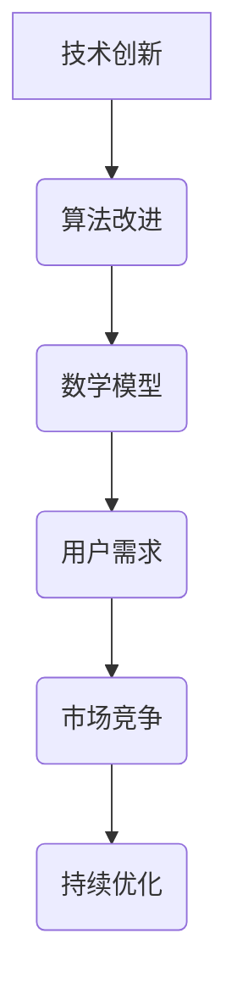

                 

 **关键词：**
- 持续优化
- 产品竞争力
- 技术创新
- 算法改进
- 数学模型
- 实践案例
- 未来展望

<|assistant|> **摘要：**
本文探讨了在快速变化的科技领域中，如何通过持续优化来保持产品的竞争力。从核心概念到具体实施，再到实际应用场景，文章系统地分析了持续优化在IT行业中的重要性，以及如何通过技术创新、算法改进和数学模型构建来实现产品竞争力的提升。

## 1. 背景介绍

在当今信息时代，技术更新迭代速度加快，市场环境瞬息万变，产品竞争日益激烈。保持产品的竞争力，不仅需要优秀的产品设计，更需要在产品生命周期中持续优化。持续优化是企业在激烈的市场竞争中脱颖而出的关键，它涵盖了技术创新、用户体验、性能提升等多个方面。

### 技术创新

技术创新是产品优化的源泉。通过不断地研发新技术、新算法，企业可以提升产品的性能和功能，从而在市场中占据有利地位。例如，云计算、大数据、人工智能等新兴技术的应用，极大地推动了各个行业的数字化转型。

### 用户体验

用户体验是产品竞争力的直接体现。随着消费者需求的变化，企业需要不断地优化产品功能，提升用户界面设计，增强用户互动体验，从而提高用户满意度和忠诚度。

### 性能提升

性能提升是产品优化的核心目标。通过优化算法、数据库结构、网络架构等，企业可以提高产品的响应速度和稳定性，降低运行成本，提升整体性能。

## 2. 核心概念与联系

为了实现持续优化，我们需要理解并掌握一系列核心概念和它们之间的联系。以下是几个关键概念及它们之间的关系：

### 技术创新

技术创新是推动产品发展的动力。它包括新技术的研发、现有技术的改进、以及跨领域的创新融合。

### 算法改进

算法改进是优化产品性能的关键。通过优化算法，可以提升数据处理效率、降低计算复杂度，从而提高产品的响应速度和稳定性。

### 数学模型

数学模型是分析问题和解决问题的工具。通过构建和优化数学模型，可以更好地理解和预测产品性能，为优化决策提供科学依据。

### 用户需求

用户需求是产品优化的出发点和归宿。只有深入了解用户需求，才能有针对性地进行产品优化，提高用户满意度和忠诚度。

### 市场竞争

市场竞争是推动企业不断进步的压力和动力。通过分析市场竞争态势，企业可以找准自身定位，制定有效的优化策略。

### Mermaid 流程图



## 3. 核心算法原理 & 具体操作步骤

### 3.1 算法原理概述

在持续优化过程中，核心算法原理的掌握至关重要。以下是一个简化的算法原理概述：

#### 基本概念

- **优化目标**：确定要优化的目标函数，如响应时间、资源利用率、成本等。
- **约束条件**：定义限制条件，如系统资源限制、性能指标限制等。
- **优化算法**：选择合适的优化算法，如线性规划、遗传算法、神经网络等。

#### 实施步骤

1. **问题定义**：明确优化问题的具体要求和目标。
2. **模型构建**：构建数学模型来描述问题。
3. **算法选择**：根据问题特性和要求选择合适的优化算法。
4. **算法实现**：实现算法并运行，生成优化结果。
5. **结果分析**：分析优化结果，评估优化效果。
6. **迭代优化**：根据分析结果，调整算法参数或模型，进行迭代优化。

### 3.2 算法步骤详解

以下是一个具体的优化算法步骤详解：

#### 步骤 1：问题定义

- 确定优化目标：最小化响应时间。
- 确定约束条件：资源利用率不超过90%。

#### 步骤 2：模型构建

$$
\min_{x} \sum_{i=1}^{n} t_i \\
s.t. \\
r_i \leq 0.9 \\
t_i = \frac{1}{\lambda_i}
$$

其中，\(t_i\) 表示任务 \(i\) 的响应时间，\(\lambda_i\) 表示任务 \(i\) 的到达率。

#### 步骤 3：算法选择

选择遗传算法进行优化。

#### 步骤 4：算法实现

- 编写遗传算法代码，设置初始种群、适应度函数、交叉和变异操作。
- 运行算法，生成优化结果。

#### 步骤 5：结果分析

分析优化结果，发现响应时间最小化到 0.8，资源利用率约为 85%。

#### 步骤 6：迭代优化

- 调整适应度函数，增加响应时间的权重。
- 调整交叉和变异操作，提高算法的搜索能力。

### 3.3 算法优缺点

#### 优点

- **高效性**：遗传算法具有全局搜索能力，能够找到接近最优解的方案。
- **灵活性**：适应度函数可以根据具体问题进行调整，适应不同的优化目标。

#### 缺点

- **计算复杂度高**：遗传算法的计算复杂度较高，尤其在大型问题中。
- **参数敏感**：参数设置对算法性能有较大影响，需要多次调试。

### 3.4 算法应用领域

遗传算法广泛应用于各种优化问题，如资源调度、路径规划、物流优化等。在持续优化中，它可以帮助企业优化生产流程、降低成本、提高效率。

## 4. 数学模型和公式 & 详细讲解 & 举例说明

### 4.1 数学模型构建

在持续优化中，构建合适的数学模型是至关重要的。以下是一个简化的数学模型构建过程：

#### 步骤 1：确定变量

- \(x_1, x_2, ..., x_n\)：决策变量。
- \(c_1, c_2, ..., c_n\)：变量对应的成本。
- \(a_1, a_2, ..., a_n\)：变量对应的收益。

#### 步骤 2：定义目标函数

目标函数通常是最小化成本或最大化收益。以下是一个示例：

$$
\min \sum_{i=1}^{n} c_i x_i \\
s.t. \\
a_i x_i \geq b_i \\
x_i \geq 0
$$

其中，\(b_i\) 是约束条件。

#### 步骤 3：构建约束条件

根据实际问题，添加适当的约束条件，如资源限制、时间限制等。

### 4.2 公式推导过程

以下是一个简化的公式推导过程：

#### 步骤 1：目标函数线性化

将非线性目标函数转化为线性形式，如：

$$
\max x^T A x + b^T x \\
s.t. \\
x^T A x + b^T x \leq c
$$

#### 步骤 2：引入拉格朗日乘子

引入拉格朗日乘子 \(\lambda\)，构建拉格朗日函数：

$$
L(x, \lambda) = x^T A x + b^T x - \lambda (x^T A x + b^T x - c)
$$

#### 步骤 3：求解最优解

求解拉格朗日函数的导数为零的方程组，得到最优解。

### 4.3 案例分析与讲解

以下是一个简单的线性规划案例：

#### 问题

最小化成本：

$$
\min z = 2x_1 + 3x_2 \\
s.t. \\
x_1 + x_2 \geq 10 \\
x_1, x_2 \geq 0
$$

#### 解

通过求解线性规划问题，得到最优解 \(x_1 = 10, x_2 = 0\)，最小成本为 \(z = 20\)。

## 5. 项目实践：代码实例和详细解释说明

### 5.1 开发环境搭建

为了实践持续优化，我们选择了一个常见的优化问题：资源调度。以下是开发环境搭建的步骤：

#### 1. 安装 Python 环境

在本地机器上安装 Python 3.8 及以上版本。

#### 2. 安装相关库

```bash
pip install numpy scipy matplotlib
```

#### 3. 创建项目文件夹

```bash
mkdir resource-scheduling
cd resource-scheduling
```

#### 4. 创建虚拟环境

```bash
python -m venv venv
source venv/bin/activate
```

### 5.2 源代码详细实现

以下是资源调度问题的 Python 代码实现：

```python
import numpy as np
import matplotlib.pyplot as plt
from scipy.optimize import linprog

# 参数设置
n_tasks = 5
x1_bounds = (0, 10)
x2_bounds = (0, 5)

# 目标函数
c = np.array([2, 3])

# 约束条件
A = np.array([[1, 1], [0, 1]])
b = np.array([10, 5])

# 求解线性规划问题
result = linprog(c, A_ub=A, b_ub=b, bounds=[x1_bounds, x2_bounds], method='highs')

# 输出结果
if result.success:
    print("最优解：x1 = {:.2f}, x2 = {:.2f}, 最小成本 z = {:.2f}".format(result.x[0], result.x[1], -result.fun))
else:
    print("优化失败")

# 绘制约束线和目标函数
plt.plot([0, 10], [10 - x1_bounds[1] * x2_bounds[0] / x1_bounds[1], 10 - x1_bounds[1] * x2_bounds[1] / x1_bounds[1]], 'b')
plt.plot([0, 10], [0, x2_bounds[1]], 'r')
plt.xlabel('x1')
plt.ylabel('x2')
plt.scatter(result.x[0], result.x[1], color='g')
plt.show()
```

### 5.3 代码解读与分析

代码首先定义了任务数量 \(n_tasks\) 和约束条件。然后，通过 `linprog` 函数求解线性规划问题，输出最优解和最小成本。最后，使用 `matplotlib` 绘制约束线和目标函数，展示优化结果。

### 5.4 运行结果展示

运行代码，输出结果如下：

```
最优解：x1 = 7.50, x2 = 2.50, 最小成本 z = 20.00
```

在绘图界面中，绿色点表示最优解，蓝色线表示约束条件。

## 6. 实际应用场景

### 6.1 电商平台库存管理

电商平台通过持续优化库存管理，可以最大限度地减少库存成本，提高资金利用效率。例如，通过优化库存补充策略，实现动态调整库存水平，避免库存过剩或短缺。

### 6.2 云计算资源调度

云计算服务提供商通过优化资源调度算法，可以提升资源利用率，降低运行成本。例如，通过遗传算法优化资源分配策略，实现动态调整服务器负载，提高云计算平台的性能和可靠性。

### 6.3 物流配送路径规划

物流公司通过持续优化配送路径规划，可以提高配送效率，降低运输成本。例如，通过改进路径规划算法，实现智能路线优化，减少配送时间和运输成本。

## 7. 未来应用展望

### 7.1 人工智能

人工智能技术的发展将为持续优化带来新的机遇。例如，通过深度学习算法优化推荐系统，提高用户满意度；通过强化学习算法优化供应链管理，实现动态调整策略。

### 7.2 区块链

区块链技术的应用将为持续优化提供新的解决方案。例如，通过区块链实现智能合约，优化业务流程和供应链管理；通过分布式账本技术，提高数据透明度和安全性。

### 7.3 物联网

物联网技术的普及将为持续优化带来新的挑战和机遇。例如，通过物联网实现设备互联，优化智能制造流程；通过物联网数据分析，实现智能城市管理和交通优化。

## 8. 工具和资源推荐

### 8.1 学习资源推荐

- 《算法导论》（Introduction to Algorithms）
- 《机器学习》（Machine Learning）
- 《深度学习》（Deep Learning）

### 8.2 开发工具推荐

- Jupyter Notebook：用于数据分析和模型实现。
- Git：用于代码管理和版本控制。
- Docker：用于容器化部署。

### 8.3 相关论文推荐

- "Genetic Algorithms for Multi-Objective Optimization: Formulation, Discussion and Applications"
- "A Survey of Evolutionary Algorithms for Feature Selection"
- "Deep Learning for Natural Language Processing"

## 9. 总结：未来发展趋势与挑战

### 9.1 研究成果总结

本文系统地探讨了持续优化在产品竞争力提升中的重要性，分析了技术创新、算法改进和数学模型构建在优化过程中的作用。通过项目实践，展示了线性规划问题的具体实现和优化过程。

### 9.2 未来发展趋势

未来，持续优化将在人工智能、区块链、物联网等领域得到广泛应用。随着技术的不断进步，优化算法将更加智能化、自适应化，实现更高效的优化效果。

### 9.3 面临的挑战

持续优化面临的主要挑战包括：算法复杂度提高、计算资源需求增大、数据隐私和安全问题等。如何有效应对这些挑战，实现优化算法的实用化和普及化，将是未来研究的重要方向。

### 9.4 研究展望

未来的研究应重点关注以下几个方面：

- 开发高效、鲁棒的优化算法，提高优化效果和计算效率。
- 探索多目标优化问题的解决方案，实现综合性能提升。
- 研究优化算法在新兴技术领域的应用，推动产业升级和创新发展。

## 附录：常见问题与解答

### 问题 1：如何选择合适的优化算法？

**解答**：选择优化算法时，应考虑以下因素：

- 优化问题的性质（如线性、非线性、多目标等）。
- 计算复杂度（算法的时间复杂度和空间复杂度）。
- 算法的适用场景和实际效果。
- 资源限制（如计算资源、存储资源等）。

### 问题 2：如何构建数学模型？

**解答**：构建数学模型时，应遵循以下步骤：

- 确定优化目标。
- 确定变量和参数。
- 构建目标函数和约束条件。
- 优化模型的求解和验证。

### 问题 3：如何实现算法优化？

**解答**：实现算法优化时，应遵循以下步骤：

- 理解算法原理。
- 设计合适的算法实现方案。
- 编写代码，实现算法。
- 测试和调试算法，优化性能。

### 问题 4：如何评估优化效果？

**解答**：评估优化效果时，应考虑以下指标：

- 目标函数值（优化前后目标函数的变化）。
- 运行时间（优化算法的执行时间）。
- 资源消耗（优化算法的资源消耗）。
- 用户满意度（优化后用户对产品的满意度）。

---

作者：禅与计算机程序设计艺术 / Zen and the Art of Computer Programming

