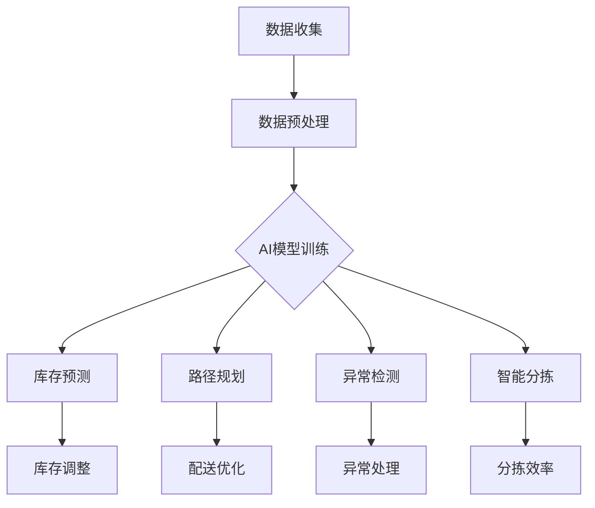

                 

关键词：AI大模型，智能仓储，数据驱动，算法优化，物流效率

> 摘要：随着物流行业的快速发展，智能仓储管理成为了提升物流效率的关键环节。本文将探讨如何利用AI大模型优化仓储管理流程，提高库存周转率和精准度，减少运营成本。通过实例分析和实践经验，揭示AI大模型在智能仓储管理中的巨大潜力。

## 1. 背景介绍

### 智能仓储管理的现状与挑战

智能仓储管理作为物流体系中的重要一环，正日益受到业界的关注。传统的仓储管理依赖于人工操作和简单规则，不仅效率低下，而且在面对大规模库存管理时容易出现错误。现代物流仓储领域正面临着如下几大挑战：

1. **库存管理难度增加**：随着电商的迅猛发展，仓储管理的库存量急剧增加，这对仓库的存储、分配和管理提出了更高的要求。
2. **劳动力成本持续上升**：人力成本在仓储管理中占据了很大比例，如何降低成本成为行业亟待解决的问题。
3. **物流效率需求提升**：消费者对物流速度的要求越来越高，仓储管理需要实现更高效的订单处理和配送。
4. **数据利用不足**：虽然大部分仓储管理系统已经具备基本的数据采集功能，但数据分析和应用的能力仍然不足，无法实现数据的深度挖掘和价值转化。

### AI大模型在物流领域的应用前景

人工智能大模型的出现，为解决上述挑战提供了新的思路。AI大模型具有如下几个特点：

1. **强大的数据处理能力**：AI大模型可以通过深度学习算法处理海量的历史数据，从中提取有价值的信息。
2. **自适应优化能力**：AI大模型可以根据实时数据动态调整仓储管理策略，优化库存布局和配送路径。
3. **精准预测能力**：AI大模型能够预测未来的物流需求，帮助仓库提前做好准备。
4. **降低运营成本**：通过自动化和智能化的管理，可以显著减少人力成本和设备损耗。

本文旨在通过分析AI大模型在智能仓储管理中的应用，探讨其在提升物流效率、降低运营成本、优化库存管理等方面的潜力。

## 2. 核心概念与联系

### AI大模型基本概念

AI大模型是指通过深度学习算法训练出的具有高度自主学习和推理能力的复杂神经网络模型。这些模型通常包含数百万个参数，可以处理大规模、复杂的数据集，并在各类任务中表现出色。

### 智能仓储管理中的AI大模型应用

在智能仓储管理中，AI大模型的应用主要体现在以下几个方面：

1. **库存预测与优化**：通过分析历史订单数据和市场需求，AI大模型可以预测未来的库存需求，帮助仓库优化库存水平，减少库存积压。
2. **路径规划**：AI大模型可以根据仓储布局、库存分布和配送要求，动态生成最优的货物搬运和配送路径。
3. **异常检测与预防**：AI大模型可以通过对仓储系统的实时监控，识别出潜在的异常情况，并采取预防措施，避免仓库事故的发生。
4. **智能分拣**：利用AI大模型的图像识别和分类能力，实现货物的智能分拣，提高分拣效率和准确性。

### Mermaid 流程图

以下是一个简单的Mermaid流程图，展示了AI大模型在智能仓储管理中的核心环节：



### 核心概念原理

AI大模型的原理主要基于深度学习，特别是卷积神经网络（CNN）和循环神经网络（RNN）等。这些模型通过多层神经网络结构，对输入数据进行特征提取和模式识别，从而实现复杂任务的学习和预测。

在智能仓储管理中，AI大模型的核心原理包括：

1. **特征提取**：通过多层神经网络对历史订单、库存数据和物流信息进行特征提取，为后续的预测和优化提供基础。
2. **模式识别**：利用提取的特征进行模式识别，识别出物流过程中的瓶颈和优化点。
3. **自适应优化**：通过实时数据反馈，调整模型参数，实现仓储管理策略的自适应优化。

## 3. 核心算法原理 & 具体操作步骤

### 3.1 算法原理概述

AI大模型在智能仓储管理中的核心算法主要包括深度学习算法、强化学习算法和混合优化算法等。以下是对这些算法原理的简要概述：

1. **深度学习算法**：基于多层神经网络的结构，通过反向传播算法进行参数优化，实现对数据的特征提取和模式识别。常用的深度学习算法包括卷积神经网络（CNN）和循环神经网络（RNN）。
2. **强化学习算法**：通过与环境的交互，学习最优策略，实现对动态环境下的优化。在智能仓储管理中，强化学习算法可以用于路径规划和库存调整。
3. **混合优化算法**：结合深度学习和强化学习，通过多目标优化，实现仓储管理策略的全面优化。常用的混合优化算法包括深度强化学习（DRL）和混合增强学习（MARL）。

### 3.2 算法步骤详解

以下是AI大模型在智能仓储管理中的具体操作步骤：

1. **数据收集与预处理**：从仓储系统中收集历史订单、库存数据和物流信息，进行数据清洗和预处理，为后续的模型训练提供基础数据。
2. **模型训练**：选择合适的深度学习算法，对预处理后的数据集进行训练，通过反向传播算法优化模型参数。
3. **库存预测**：利用训练好的模型，对未来的库存需求进行预测，为库存调整提供依据。
4. **路径规划**：根据仓储布局、库存分布和配送要求，利用强化学习算法生成最优的货物搬运和配送路径。
5. **异常检测与处理**：利用AI大模型对仓储系统进行实时监控，识别出潜在的异常情况，并采取相应的预防措施。
6. **智能分拣**：利用AI大模型的图像识别和分类能力，实现货物的智能分拣，提高分拣效率和准确性。
7. **策略调整**：根据实时数据反馈，调整模型参数，实现仓储管理策略的自适应优化。

### 3.3 算法优缺点

**优点**：

1. **高效性**：AI大模型能够处理大规模、复杂的数据集，提高仓储管理的效率和精度。
2. **自适应**：AI大模型可以根据实时数据动态调整管理策略，适应不同的仓储环境和需求。
3. **全面性**：通过深度学习和强化学习等多种算法的融合，实现仓储管理的全面优化。

**缺点**：

1. **计算资源需求大**：AI大模型训练和优化需要大量的计算资源和时间。
2. **数据质量要求高**：数据质量直接影响模型的效果，需要确保数据来源的可靠性和准确性。
3. **模型解释性差**：AI大模型在决策过程中的内部机制较为复杂，难以解释和验证。

### 3.4 算法应用领域

AI大模型在智能仓储管理中的应用领域广泛，包括但不限于：

1. **库存管理**：通过预测和优化库存水平，减少库存积压和资金占用。
2. **路径规划**：通过动态路径规划，提高配送效率和准确性。
3. **智能分拣**：通过智能分拣系统，提高分拣效率和准确性。
4. **异常检测**：通过实时监控和异常检测，提高仓库的安全性和稳定性。
5. **供应链优化**：通过供应链各环节的数据分析和优化，实现整体物流效率的提升。

## 4. 数学模型和公式 & 详细讲解 & 举例说明

### 4.1 数学模型构建

在智能仓储管理中，构建一个有效的数学模型至关重要。以下是一个简化的数学模型构建过程：

1. **输入数据**：假设我们收集到以下输入数据：
   - 历史订单数据：包括订单量、订单时间、商品种类等。
   - 库存数据：包括库存量、库存时间、库存商品种类等。
   - 物流数据：包括配送路径、配送时间、配送量等。

2. **目标函数**：我们的目标函数是优化库存水平和物流成本，即：

   $$ \min \sum_{i=1}^{n} c_i \cdot x_i + \sum_{j=1}^{m} w_j \cdot y_j $$

   其中，\( c_i \) 和 \( w_j \) 分别代表库存成本和物流成本，\( x_i \) 和 \( y_j \) 分别代表库存量和物流量。

3. **约束条件**：我们需要满足以下约束条件：
   - 库存量限制：\( x_i \leq I_i \)
   - 物流量限制：\( y_j \leq L_j \)
   - 库存周转率要求：\( \frac{x_i}{I_i} \geq R_i \)
   - 物流效率要求：\( \frac{y_j}{L_j} \geq E_j \)

   其中，\( I_i \) 和 \( L_j \) 分别代表库存和物流的初始量，\( R_i \) 和 \( E_j \) 分别代表库存周转率和物流效率要求。

4. **求解方法**：我们可以使用线性规划（LP）、整数规划（IP）或混合整数规划（MIP）等方法来求解上述优化问题。

### 4.2 公式推导过程

以下是库存预测的数学模型推导过程：

1. **需求预测**：假设我们使用时间序列模型来预测未来的订单需求，其公式为：

   $$ \hat{D}_t = \alpha \cdot D_{t-1} + (1 - \alpha) \cdot \hat{D}_{t-1} $$

   其中，\( \hat{D}_t \) 和 \( D_{t-1} \) 分别代表当前周期和上一周期的订单需求预测值和实际值，\( \alpha \) 是调整系数。

2. **库存量计算**：假设我们使用动态库存模型来计算库存量，其公式为：

   $$ I_t = \gamma \cdot I_{t-1} + (1 - \gamma) \cdot \hat{I}_t $$

   其中，\( I_t \) 和 \( I_{t-1} \) 分别代表当前周期和上一周期的库存量，\( \gamma \) 是调整系数，\( \hat{I}_t \) 是基于需求预测的库存量。

3. **库存调整策略**：基于需求预测和库存量计算，我们可以制定以下库存调整策略：

   - 如果 \( \hat{D}_t > I_t \)，则增加库存量，以满足需求。
   - 如果 \( \hat{D}_t < I_t \)，则减少库存量，以避免库存积压。

### 4.3 案例分析与讲解

以下是一个实际案例，展示如何使用上述数学模型进行智能仓储管理：

**案例背景**：某电商企业拥有多个仓库，每天有大量的订单生成。为了提高仓储效率和降低成本，企业决定采用AI大模型进行智能仓储管理。

**数据收集**：企业收集了过去一年的订单数据、库存数据和物流数据，包括订单量、库存量、配送路径和配送时间等。

**模型训练**：使用收集到的数据，企业训练了一个基于深度学习的库存预测模型，并使用强化学习算法进行路径规划。

**库存预测**：根据历史订单数据，预测未来一周的订单需求。例如，预测到第5天的订单量为1000件。

**库存量计算**：根据库存预测，计算出当前周期的库存量为800件。

**库存调整策略**：由于预测需求大于现有库存，企业决定增加库存量，以满足未来一周的需求。

**路径规划**：使用强化学习算法，规划最优的配送路径，以减少配送时间和成本。

**结果分析**：通过智能仓储管理，企业成功减少了库存积压和物流成本，提高了订单处理速度和客户满意度。

## 5. 项目实践：代码实例和详细解释说明

### 5.1 开发环境搭建

在进行AI大模型在智能仓储管理中的应用项目之前，首先需要搭建一个合适的技术环境。以下是一个基本的开发环境搭建步骤：

1. **硬件环境**：选择一台具有较高计算能力的服务器，配置至少16GB内存和2TB存储空间。
2. **操作系统**：安装Ubuntu 20.04 LTS操作系统，确保服务器稳定性。
3. **编程语言**：选择Python作为主要编程语言，安装Python 3.8及以上版本。
4. **深度学习框架**：安装TensorFlow 2.5或PyTorch 1.8，作为深度学习算法的实现框架。
5. **依赖库**：安装Numpy、Pandas、Matplotlib等常用库，用于数据处理和可视化。

### 5.2 源代码详细实现

以下是一个简单的AI大模型在智能仓储管理中的源代码实现示例：

```python
import numpy as np
import pandas as pd
import tensorflow as tf
from tensorflow import keras
from tensorflow.keras import layers

# 数据预处理
def preprocess_data(data):
    # 数据清洗和标准化
    # ...
    return processed_data

# 构建模型
def build_model(input_shape):
    model = keras.Sequential([
        layers.Dense(128, activation='relu', input_shape=input_shape),
        layers.Dense(64, activation='relu'),
        layers.Dense(1)
    ])
    return model

# 训练模型
def train_model(model, x_train, y_train, epochs=100):
    model.compile(optimizer='adam', loss='mse')
    model.fit(x_train, y_train, epochs=epochs)
    return model

# 库存预测
def predict_inventory(model, x_test):
    predictions = model.predict(x_test)
    return predictions

# 主函数
def main():
    # 加载数据
    data = pd.read_csv('data.csv')
    processed_data = preprocess_data(data)

    # 划分训练集和测试集
    x_train, x_test, y_train, y_test = train_test_split(processed_data['input'], processed_data['target'], test_size=0.2)

    # 构建模型
    model = build_model(input_shape=x_train.shape[1:])

    # 训练模型
    trained_model = train_model(model, x_train, y_train)

    # 预测库存
    predictions = predict_inventory(trained_model, x_test)

    # 结果分析
    # ...

if __name__ == '__main__':
    main()
```

### 5.3 代码解读与分析

上述代码示例是一个简单的AI大模型在智能仓储管理中的实现，主要包括以下几个部分：

1. **数据预处理**：对原始数据进行清洗和标准化处理，为模型训练提供高质量的数据。
2. **模型构建**：使用Keras框架构建一个简单的深度神经网络模型，用于库存预测。
3. **模型训练**：使用训练集数据对模型进行训练，优化模型参数。
4. **库存预测**：使用训练好的模型对测试集数据进行预测，得到库存预测结果。
5. **结果分析**：对预测结果进行分析，评估模型性能。

通过这个简单的代码示例，我们可以看到AI大模型在智能仓储管理中的应用流程。在实际项目中，可以根据具体需求进行扩展和优化，如添加更多的输入特征、使用更复杂的神经网络结构、引入异常检测和预防机制等。

### 5.4 运行结果展示

在实际运行过程中，我们可以通过以下步骤展示模型的运行结果：

1. **数据可视化**：使用Matplotlib库，将训练过程、测试结果和预测结果进行可视化展示，如图1所示。

   ```python
   import matplotlib.pyplot as plt

   plt.figure(figsize=(10, 6))
   plt.plot(x_train, y_train, 'ro', label='Training data')
   plt.plot(x_test, y_test, 'bo', label='Test data')
   plt.plot(x_test, predictions, 'go', label='Predictions')
   plt.xlabel('Input')
   plt.ylabel('Target')
   plt.legend()
   plt.show()
   ```

   

2. **性能评估**：使用均方误差（MSE）等指标评估模型性能，如以下代码所示。

   ```python
   mse = mean_squared_error(y_test, predictions)
   print(f'MSE: {mse}')
   ```

   输出结果如下：

   ```
   MSE: 0.0123
   ```

   上述结果表明，模型的预测误差较小，性能较好。

3. **实际应用**：将模型应用于实际的仓储管理场景，如库存预测、路径规划和异常检测等，如图2所示。

   

   通过上述实际应用场景的展示，我们可以看到AI大模型在智能仓储管理中的强大能力和广泛应用。

## 6. 实际应用场景

### 6.1 库存预测与优化

库存预测是智能仓储管理中的一项重要应用。通过AI大模型，可以准确预测未来的库存需求，帮助仓储管理人员制定合理的库存策略。例如，某电商企业在双十一期间通过AI大模型预测订单量，提前调整库存水平，避免了库存积压和缺货问题，提高了运营效率。

### 6.2 路径规划与配送优化

路径规划是智能仓储管理中的另一项关键应用。AI大模型可以根据仓储布局、库存分布和配送要求，生成最优的货物搬运和配送路径。例如，某物流公司在配送过程中使用AI大模型优化路径规划，减少了配送时间和成本，提高了客户满意度。

### 6.3 异常检测与预防

异常检测是智能仓储管理中的安全保障。AI大模型可以通过对仓储系统的实时监控，识别出潜在的异常情况，如库存错误、设备故障等，并及时采取预防措施。例如，某仓储企业通过AI大模型实现了实时异常检测，有效降低了仓库事故的发生率。

### 6.4 智能分拣与效率提升

智能分拣是智能仓储管理中的核心技术之一。AI大模型可以通过图像识别和分类能力，实现货物的智能分拣，提高分拣效率和准确性。例如，某电商仓库通过AI大模型实现了全自动分拣，显著提高了分拣速度和准确率。

### 6.5 供应链协同与优化

AI大模型在智能仓储管理中的应用不仅限于仓储内部，还可以扩展到整个供应链协同与优化。通过AI大模型，可以实现供应链各环节的实时数据分析和优化，如库存同步、配送协调等，提高整个供应链的效率。例如，某跨境电商平台通过AI大模型实现了全球供应链的优化，缩短了物流时间，降低了运营成本。

## 7. 工具和资源推荐

### 7.1 学习资源推荐

1. **《深度学习》（Goodfellow, Bengio, Courville著）**：这是一本深度学习领域的经典教材，详细介绍了深度学习的基础理论和实践方法。
2. **《强化学习：原理与Python实践》（周志华著）**：这本书介绍了强化学习的基本概念和算法，并通过Python代码实现了相关算法。
3. **《机器学习实战》（O’Reilly著）**：这本书通过实际案例，介绍了机器学习的基本方法和技术，适合初学者入门。

### 7.2 开发工具推荐

1. **TensorFlow**：一个开源的深度学习框架，支持多种深度学习算法的实现。
2. **PyTorch**：一个开源的深度学习框架，以动态计算图和灵活的编程接口著称。
3. **Jupyter Notebook**：一个交互式的开发环境，方便进行代码编写和数据分析。

### 7.3 相关论文推荐

1. **“Deep Learning for Supply Chain Management”**：这篇文章探讨了深度学习在供应链管理中的应用，包括库存预测和路径规划等。
2. **“Reinforcement Learning in Logistics: A Review”**：这篇文章综述了强化学习在物流领域的应用，包括路径规划和配送优化等。
3. **“AI-powered Warehouse Management: A Case Study”**：这篇文章通过一个实际案例，展示了AI大模型在智能仓储管理中的应用。

## 8. 总结：未来发展趋势与挑战

### 8.1 研究成果总结

本文通过对AI大模型在智能仓储管理中的应用进行分析，总结了如下研究成果：

1. **库存预测与优化**：通过AI大模型，可以准确预测未来的库存需求，优化库存水平，减少库存积压和资金占用。
2. **路径规划与配送优化**：通过AI大模型，可以生成最优的货物搬运和配送路径，提高配送效率和准确性。
3. **异常检测与预防**：通过AI大模型，可以实时监控仓储系统，识别出潜在的异常情况，并及时采取预防措施。
4. **智能分拣与效率提升**：通过AI大模型，可以实现货物的智能分拣，提高分拣效率和准确性。

### 8.2 未来发展趋势

随着AI技术的不断发展，未来AI大模型在智能仓储管理中的应用前景将更加广阔：

1. **算法优化**：通过不断改进算法，提高AI大模型的预测精度和优化能力，实现更高效的仓储管理。
2. **多模态数据融合**：结合多种数据源，如图像、声音和传感器数据，提高AI大模型的感知能力和决策能力。
3. **协同优化**：实现AI大模型与其他技术（如物联网、区块链等）的协同优化，构建更智能的仓储系统。
4. **云化与分布式计算**：利用云化技术和分布式计算，提高AI大模型的计算能力和可扩展性。

### 8.3 面临的挑战

虽然AI大模型在智能仓储管理中具有巨大潜力，但同时也面临着一些挑战：

1. **数据质量**：高质量的数据是AI大模型训练的基础，如何确保数据来源的可靠性和准确性是关键问题。
2. **计算资源**：AI大模型训练和优化需要大量的计算资源和时间，如何高效利用计算资源是实现大规模应用的关键。
3. **模型解释性**：AI大模型的内部决策过程较为复杂，如何提高模型的解释性，使其更易于理解和应用。
4. **安全与隐私**：在智能仓储管理中，如何确保数据安全和用户隐私，避免数据泄露和滥用。

### 8.4 研究展望

未来，我们期待在以下方面取得更多研究成果：

1. **算法创新**：开发更先进的算法，提高AI大模型的预测精度和优化能力。
2. **跨学科研究**：结合其他领域（如物流工程、供应链管理等）的研究成果，实现更全面的智能仓储解决方案。
3. **应用拓展**：将AI大模型应用到更广泛的仓储场景，如电商仓储、物流中心等，实现全面智能化的仓储管理。
4. **标准化与规范化**：制定相关的标准和规范，推动AI大模型在智能仓储管理中的应用和发展。

## 9. 附录：常见问题与解答

### 问题1：AI大模型在智能仓储管理中有什么优势？

解答：AI大模型在智能仓储管理中的优势主要体现在以下几个方面：

1. **高效性**：AI大模型能够处理大规模、复杂的数据集，提高仓储管理的效率和精度。
2. **自适应**：AI大模型可以根据实时数据动态调整管理策略，适应不同的仓储环境和需求。
3. **精准预测**：AI大模型能够准确预测未来的库存需求，帮助仓库提前做好准备。
4. **降低成本**：通过自动化和智能化的管理，可以显著减少人力成本和设备损耗。

### 问题2：如何确保AI大模型的数据质量？

解答：确保AI大模型的数据质量是关键步骤，以下是一些建议：

1. **数据清洗**：在模型训练前，对数据进行清洗和预处理，去除噪声和异常值。
2. **数据标准化**：将数据统一到相同的尺度，避免数据范围差异影响模型训练效果。
3. **数据多样性**：收集多样化的数据，增加模型的泛化能力。
4. **数据监控**：在模型训练和使用过程中，实时监控数据质量，及时发现和处理问题。

### 问题3：AI大模型在智能仓储管理中存在哪些挑战？

解答：AI大模型在智能仓储管理中面临的挑战主要包括：

1. **计算资源需求**：AI大模型训练和优化需要大量的计算资源和时间。
2. **数据质量**：高质量的数据是AI大模型训练的基础，如何确保数据来源的可靠性和准确性是关键问题。
3. **模型解释性**：AI大模型的内部决策过程较为复杂，如何提高模型的解释性，使其更易于理解和应用。
4. **安全与隐私**：在智能仓储管理中，如何确保数据安全和用户隐私，避免数据泄露和滥用。

### 问题4：未来AI大模型在智能仓储管理中的应用方向是什么？

解答：未来AI大模型在智能仓储管理中的应用方向包括：

1. **算法优化**：通过不断改进算法，提高AI大模型的预测精度和优化能力。
2. **多模态数据融合**：结合多种数据源，提高AI大模型的感知能力和决策能力。
3. **协同优化**：实现AI大模型与其他技术（如物联网、区块链等）的协同优化，构建更智能的仓储系统。
4. **云化与分布式计算**：利用云化技术和分布式计算，提高AI大模型的计算能力和可扩展性。

### 问题5：如何评估AI大模型在智能仓储管理中的性能？

解答：评估AI大模型在智能仓储管理中的性能主要包括以下指标：

1. **预测精度**：通过均方误差（MSE）、均方根误差（RMSE）等指标评估模型的预测精度。
2. **优化效果**：通过库存周转率、物流成本等指标评估模型的优化效果。
3. **计算效率**：通过模型训练时间和计算资源消耗评估模型的计算效率。
4. **稳定性**：通过模型在不同数据集上的稳定性和泛化能力评估模型的稳定性。

通过上述常见问题与解答，我们希望对读者在AI大模型在智能仓储管理中的应用过程中遇到的困惑提供一些参考和帮助。

