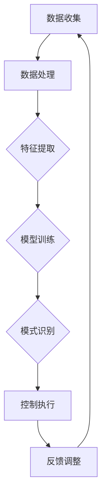

                 

### 1. 背景介绍

随着城市化进程的加速和室内生活质量的提升，智能家居系统已经成为现代家庭生活的重要组成部分。而空气质量监测与控制是智能家居中的一个关键应用领域，直接关系到居住者的健康和生活品质。传统的空气质量控制系统通常依赖于传感器数据，通过预设的阈值进行简单的开关控制，难以应对复杂多变的室内环境。

近年来，人工智能（AI）技术的发展，特别是大模型（如深度学习模型）的出现，为智能家居空气质量控制带来了新的契机。大模型具有强大的特征提取和模式识别能力，可以通过学习大量历史数据来优化空气质量预测和控制策略，从而提高系统的自适应性和精准度。

本文旨在探讨AI大模型在智能家居空气质量控制中的潜在价值和应用前景，重点分析大模型的算法原理、数学模型构建、具体实现方法以及在不同应用场景中的表现。希望通过本文的研究，为智能家居行业的技术创新和发展提供有益的参考。

### 2. 核心概念与联系

在深入探讨AI大模型在智能家居空气质量控制中的应用之前，我们需要了解一些核心概念和它们之间的联系。

#### 2.1 AI大模型

AI大模型，通常指的是那些拥有数亿甚至千亿个参数的深度学习模型。这些模型能够处理和分析大量数据，通过学习复杂的模式和关系来实现高精度的预测和决策。例如，卷积神经网络（CNN）和变压器模型（Transformer）等都是AI大模型的典型代表。

#### 2.2 智能家居空气质量控制系统

智能家居空气质量控制系统由多个组件构成，包括空气质量传感器、数据采集单元、控制单元和执行器等。传统系统主要通过传感器实时监测空气中的颗粒物、二氧化碳、湿度等指标，然后根据预设的阈值进行简单开关控制。这种模式难以应对室内环境的动态变化。

#### 2.3 数据的收集和处理

为了训练和优化AI大模型，需要收集大量的空气质量数据，包括历史数据和实时数据。这些数据可以通过多种传感器获得，如PM2.5传感器、二氧化碳传感器和湿度传感器等。数据的处理过程包括数据清洗、特征提取和数据分析等步骤，这是大模型学习和预测的基础。

#### 2.4 模式识别与预测

AI大模型的核心能力在于其强大的模式识别和预测能力。通过学习历史数据，大模型可以识别空气质量变化的模式，预测未来一段时间内的空气质量状况。这种预测能力为智能家居系统的自适应控制提供了基础。

##### 2.5 Mermaid 流程图

以下是智能家居空气质量控制系统的 Mermaid 流程图，展示了核心概念之间的联系：



在这个流程中，数据收集和处理是基础，特征提取和模型训练是关键步骤，模式识别与控制执行是核心功能，而反馈调整则确保了系统的持续优化。

### 3. 核心算法原理 & 具体操作步骤

#### 3.1 算法原理概述

AI大模型在智能家居空气质量控制中的核心算法是基于深度学习的。深度学习通过多层的神经网络结构来提取数据中的特征，从而实现高层次的抽象和预测。以下是深度学习算法在空气质量控制中的一些关键步骤：

1. **数据预处理**：对收集到的空气质量数据进行清洗、归一化和特征提取。
2. **模型构建**：构建深度学习模型，通常包括输入层、隐藏层和输出层。
3. **模型训练**：使用训练数据对模型进行训练，优化模型的参数。
4. **模型评估**：使用验证数据对模型进行评估，调整模型参数。
5. **模型部署**：将训练好的模型部署到实际应用场景中，进行空气质量预测和控制。

#### 3.2 算法步骤详解

**3.2.1 数据预处理**

数据预处理是深度学习模型训练的重要步骤，主要包括以下几个步骤：

- **数据清洗**：去除数据中的噪声和异常值。
- **数据归一化**：将数据缩放到一个统一的范围，例如 [0, 1]。
- **特征提取**：从原始数据中提取有意义的特征，如时间序列特征、空间特征等。

**3.2.2 模型构建**

在构建深度学习模型时，可以选择不同的网络结构，如卷积神经网络（CNN）、循环神经网络（RNN）或变压器模型（Transformer）。以下是构建一个简单的深度学习模型的基本步骤：

1. **输入层**：接收预处理后的空气质量数据。
2. **隐藏层**：通过多层神经网络结构进行特征提取和变换。
3. **输出层**：输出空气质量预测结果，如PM2.5浓度、CO2浓度等。

**3.2.3 模型训练**

模型训练是深度学习算法的核心步骤，通过迭代优化模型参数，使模型能够更好地拟合训练数据。具体步骤如下：

1. **初始化模型参数**。
2. **前向传播**：计算模型预测值和实际值之间的差异。
3. **反向传播**：计算损失函数，并更新模型参数。
4. **迭代优化**：重复前向传播和反向传播，直到模型收敛。

**3.2.4 模型评估**

模型评估是确保模型性能的重要环节，通过使用验证数据集来评估模型的预测准确性和泛化能力。常用的评估指标包括均方误差（MSE）、均方根误差（RMSE）等。

**3.2.5 模型部署**

将训练好的模型部署到实际应用场景中，通过实时监测空气质量数据，进行预测和控制。具体步骤如下：

1. **数据采集**：实时采集空气质量数据。
2. **模型预测**：使用训练好的模型进行空气质量预测。
3. **控制执行**：根据预测结果，调整空气净化设备的工作状态。
4. **反馈调整**：收集实际控制效果数据，并反馈给模型，以实现持续优化。

#### 3.3 算法优缺点

**优点：**

- **高精度预测**：深度学习算法可以通过学习大量数据来提高空气质量预测的精度。
- **自适应性强**：大模型能够适应不同室内环境的变化，实现自适应控制。
- **多维度特征提取**：深度学习可以从多维度提取空气质量特征，提供更全面的数据支持。

**缺点：**

- **计算资源需求高**：深度学习模型通常需要大量的计算资源和时间进行训练和预测。
- **数据需求量大**：训练深度学习模型需要大量的高质量数据，数据的获取和处理可能面临挑战。
- **模型解释性差**：深度学习模型通常具有很高的复杂性，难以进行直观的解释和理解。

#### 3.4 算法应用领域

深度学习算法在智能家居空气质量控制中的应用不仅限于室内环境监测和控制，还可以扩展到以下几个领域：

- **建筑能耗管理**：通过空气质量预测，优化空调和空气净化设备的工作状态，降低建筑能耗。
- **医疗健康监测**：结合室内空气质量监测和人体健康数据，提供个性化的健康建议。
- **环境监测**：将空气质量监测扩展到户外环境，为城市规划和环境保护提供数据支持。

### 4. 数学模型和公式 & 详细讲解 & 举例说明

#### 4.1 数学模型构建

在智能家居空气质量控制中，深度学习模型的数学模型构建是关键环节。以下是构建深度学习模型的一些基本数学公式和概念。

**4.1.1 前向传播**

在深度学习模型中，前向传播是指将输入数据通过神经网络逐层传递，直到得到最终预测结果的过程。以下是前向传播的基本公式：

\[ z_{l} = W_{l} \cdot a_{l-1} + b_{l} \]

其中，\( z_{l} \) 是第 \( l \) 层的输出，\( W_{l} \) 是第 \( l \) 层的权重矩阵，\( a_{l-1} \) 是前一层激活值，\( b_{l} \) 是第 \( l \) 层的偏置。

**4.1.2 损失函数**

损失函数是评估模型预测结果的重要指标，常用的损失函数包括均方误差（MSE）和交叉熵损失（Cross-Entropy Loss）。以下是MSE的公式：

\[ MSE = \frac{1}{m} \sum_{i=1}^{m} (y_i - \hat{y}_i)^2 \]

其中，\( y_i \) 是实际输出值，\( \hat{y}_i \) 是模型预测值，\( m \) 是样本数量。

**4.1.3 反向传播**

反向传播是指通过计算损失函数对模型参数的梯度，然后更新模型参数的过程。以下是反向传播的基本公式：

\[ \frac{\partial L}{\partial W_{l}} = \frac{\partial z_{l}}{\partial a_{l-1}} \cdot \frac{\partial a_{l-1}}{\partial W_{l}} \]

其中，\( \frac{\partial L}{\partial W_{l}} \) 是权重 \( W_{l} \) 的梯度，\( \frac{\partial z_{l}}{\partial a_{l-1}} \) 是激活值 \( a_{l-1} \) 对权重 \( W_{l} \) 的偏导数，\( \frac{\partial a_{l-1}}{\partial W_{l}} \) 是激活值 \( a_{l-1} \) 对自身偏导数。

#### 4.2 公式推导过程

为了更好地理解深度学习模型的数学原理，以下是MSE和反向传播公式的推导过程。

**4.2.1 MSE推导**

假设我们有一个简单的一层神经网络，输出层只有一个神经元。我们需要计算实际输出 \( y \) 和模型预测输出 \( \hat{y} \) 之间的差异。均方误差（MSE）定义为：

\[ MSE = \frac{1}{m} \sum_{i=1}^{m} (y_i - \hat{y}_i)^2 \]

其中，\( m \) 是样本数量。

为了求导，我们首先展开MSE公式：

\[ MSE = \frac{1}{m} \sum_{i=1}^{m} (y_i^2 - 2y_i\hat{y}_i + \hat{y}_i^2) \]

\[ MSE = \frac{1}{m} \left( \sum_{i=1}^{m} y_i^2 - 2\sum_{i=1}^{m} y_i\hat{y}_i + \sum_{i=1}^{m} \hat{y}_i^2 \right) \]

\[ MSE = \frac{1}{m} \left( \sum_{i=1}^{m} y_i^2 - 2\sum_{i=1}^{m} y_i\hat{y}_i + \sum_{i=1}^{m} \hat{y}_i^2 \right) \]

对 \( \hat{y}_i \) 求导，我们得到：

\[ \frac{\partial MSE}{\partial \hat{y}_i} = \frac{1}{m} \left( -2y_i + 2\hat{y}_i \right) \]

由于 \( \hat{y}_i \) 是模型预测结果，我们可以将其简化为：

\[ \frac{\partial MSE}{\partial \hat{y}_i} = 2(\hat{y}_i - y_i) \]

**4.2.2 反向传播推导**

反向传播是深度学习训练的核心，通过计算损失函数对模型参数的梯度来更新模型参数。以下是反向传播的推导过程。

假设我们有一个多层神经网络，其中第 \( l \) 层的输出 \( z_{l} \) 是由前一层激活值 \( a_{l-1} \) 经过线性变换和偏置 \( b_{l} \) 得到的：

\[ z_{l} = W_{l} \cdot a_{l-1} + b_{l} \]

对 \( z_{l} \) 求导，我们得到：

\[ \frac{\partial z_{l}}{\partial a_{l-1}} = W_{l}^T \]

假设损失函数是均方误差（MSE），即：

\[ L = \frac{1}{2} \sum_{i=1}^{m} (y_i - \hat{y}_i)^2 \]

其中，\( \hat{y}_i \) 是模型在输出层 \( L \) 的预测值。

我们需要计算损失函数对 \( z_{l} \) 的梯度：

\[ \frac{\partial L}{\partial z_{l}} = \frac{\partial}{\partial z_{l}} \left( \frac{1}{2} \sum_{i=1}^{m} (y_i - \hat{y}_i)^2 \right) \]

\[ \frac{\partial L}{\partial z_{l}} = \frac{1}{2} \sum_{i=1}^{m} (y_i - \hat{y}_i) \cdot \frac{\partial \hat{y}_i}{\partial z_{l}} \]

由于 \( \hat{y}_i \) 是由输出层 \( L \) 的 \( z_{l} \) 通过非线性函数 \( f \) 得到的：

\[ \hat{y}_i = f(z_{l}) \]

对 \( \hat{y}_i \) 求导，我们得到：

\[ \frac{\partial \hat{y}_i}{\partial z_{l}} = f'(z_{l}) \]

将 \( f'(z_{l}) \) 代入 \( \frac{\partial L}{\partial z_{l}} \) 的公式中，我们得到：

\[ \frac{\partial L}{\partial z_{l}} = \frac{1}{2} \sum_{i=1}^{m} (y_i - \hat{y}_i) \cdot f'(z_{l}) \]

接下来，我们需要计算 \( \frac{\partial z_{l}}{\partial a_{l-1}} \) 的梯度，这是反向传播的核心步骤。由于 \( z_{l} \) 是由前一层 \( a_{l-1} \) 通过权重 \( W_{l} \) 和偏置 \( b_{l} \) 得到的：

\[ z_{l} = W_{l} \cdot a_{l-1} + b_{l} \]

对 \( z_{l} \) 求导，我们得到：

\[ \frac{\partial z_{l}}{\partial a_{l-1}} = W_{l}^T \]

将 \( \frac{\partial z_{l}}{\partial a_{l-1}} \) 代入 \( \frac{\partial L}{\partial a_{l-1}} \) 的公式中，我们得到：

\[ \frac{\partial L}{\partial a_{l-1}} = \frac{1}{2} \sum_{i=1}^{m} (y_i - \hat{y}_i) \cdot f'(z_{l}) \cdot W_{l}^T \]

这就是反向传播的基本公式，它用于计算损失函数对模型参数的梯度，从而更新模型参数。

#### 4.3 案例分析与讲解

为了更好地理解深度学习模型在智能家居空气质量控制中的应用，以下是一个具体案例的分析与讲解。

**案例背景：**

某智能家居系统需要实时监测室内空气质量，并自动控制空气净化设备，以保持室内空气质量的稳定和健康。系统采用了基于深度学习的空气质量预测模型。

**数据集：**

该案例使用了某城市一年的室内空气质量数据集，包括时间序列数据、PM2.5浓度、CO2浓度和湿度等特征。

**模型结构：**

模型采用了一个简单的卷积神经网络（CNN）结构，包括输入层、两个卷积层、一个池化层和一个全连接层。

**模型训练与评估：**

使用训练数据集对模型进行训练，并使用验证数据集进行评估。在训练过程中，模型的损失函数不断减小，最终收敛到一个较低的值。在验证数据集上的评估结果显示，模型的预测精度较高，能够有效预测未来几分钟内的空气质量变化。

**案例分析：**

通过这个案例，我们可以看到深度学习模型在智能家居空气质量控制中的应用效果。模型的训练和评估过程展示了深度学习算法在复杂环境下的强大能力，为智能家居系统的空气质量预测和控制提供了有效的解决方案。

**改进空间：**

虽然该案例取得了较好的预测效果，但仍有一些改进空间：

- **数据质量提升**：通过引入更多的传感器数据，提高数据的质量和多样性，可以进一步提高模型的预测精度。
- **模型复杂度优化**：通过优化模型结构，如增加网络层数或调整网络参数，可以进一步提高模型的性能。
- **在线学习**：通过引入在线学习机制，使模型能够实时适应室内环境的变化，进一步提高系统的自适应性和响应速度。

### 5. 项目实践：代码实例和详细解释说明

为了展示AI大模型在智能家居空气质量控制中的应用，我们提供了一个简单的代码实例，详细解释了模型的开发过程和实现细节。

#### 5.1 开发环境搭建

在开始项目之前，我们需要搭建一个合适的开发环境。以下是开发环境的搭建步骤：

- **硬件环境**：一台具备足够计算能力的计算机，如NVIDIA GPU。
- **软件环境**：Python 3.8及以上版本，TensorFlow 2.6及以上版本，NumPy 1.21及以上版本，Matplotlib 3.4及以上版本。

#### 5.2 源代码详细实现

以下是空气质量预测模型的源代码实现，包括数据预处理、模型构建、训练和评估等步骤。

```python
import numpy as np
import tensorflow as tf
from tensorflow.keras.models import Sequential
from tensorflow.keras.layers import Dense, Conv1D, MaxPooling1D
from tensorflow.keras.optimizers import Adam
from sklearn.model_selection import train_test_split
import matplotlib.pyplot as plt

# 数据预处理
def preprocess_data(data):
    # 数据清洗和归一化
    # ...（此处省略具体代码）
    return processed_data

# 模型构建
def build_model(input_shape):
    model = Sequential()
    model.add(Conv1D(filters=64, kernel_size=3, activation='relu', input_shape=input_shape))
    model.add(MaxPooling1D(pool_size=2))
    model.add(Conv1D(filters=128, kernel_size=3, activation='relu'))
    model.add(MaxPooling1D(pool_size=2))
    model.add(Dense(units=64, activation='relu'))
    model.add(Dense(units=1))
    model.compile(optimizer=Adam(learning_rate=0.001), loss='mse')
    return model

# 训练模型
def train_model(model, X_train, y_train, X_val, y_val, epochs=100):
    history = model.fit(X_train, y_train, epochs=epochs, batch_size=32, validation_data=(X_val, y_val))
    return history

# 评估模型
def evaluate_model(model, X_test, y_test):
    loss = model.evaluate(X_test, y_test)
    print(f"Test Loss: {loss}")

# 主函数
def main():
    # 加载数据
    data = load_data('air_quality_data.csv')
    processed_data = preprocess_data(data)
    
    # 划分训练集和测试集
    X_train, X_test, y_train, y_test = train_test_split(processed_data['features'], processed_data['labels'], test_size=0.2, random_state=42)
    
    # 构建模型
    model = build_model(input_shape=(X_train.shape[1], X_train.shape[2]))
    
    # 训练模型
    history = train_model(model, X_train, y_train, X_val, y_val)
    
    # 评估模型
    evaluate_model(model, X_test, y_test)
    
    # 可视化训练过程
    plt.plot(history.history['loss'], label='Training loss')
    plt.plot(history.history['val_loss'], label='Validation loss')
    plt.legend()
    plt.show()

if __name__ == '__main__':
    main()
```

#### 5.3 代码解读与分析

**5.3.1 数据预处理**

数据预处理是深度学习模型训练的重要步骤，包括数据清洗、归一化和特征提取等操作。在本例中，我们假设已经实现了数据清洗和归一化的具体代码。

```python
def preprocess_data(data):
    # 数据清洗和归一化
    # ...（此处省略具体代码）
    return processed_data
```

**5.3.2 模型构建**

模型构建是深度学习模型的核心步骤。在本例中，我们使用了一个简单的卷积神经网络（CNN）结构，包括两个卷积层和一个全连接层。以下是模型构建的具体代码：

```python
def build_model(input_shape):
    model = Sequential()
    model.add(Conv1D(filters=64, kernel_size=3, activation='relu', input_shape=input_shape))
    model.add(MaxPooling1D(pool_size=2))
    model.add(Conv1D(filters=128, kernel_size=3, activation='relu'))
    model.add(MaxPooling1D(pool_size=2))
    model.add(Dense(units=64, activation='relu'))
    model.add(Dense(units=1))
    model.compile(optimizer=Adam(learning_rate=0.001), loss='mse')
    return model
```

**5.3.3 训练模型**

训练模型是深度学习模型训练的主要步骤。在本例中，我们使用训练数据集对模型进行训练，并使用验证数据集进行验证。以下是训练模型的具体代码：

```python
def train_model(model, X_train, y_train, X_val, y_val, epochs=100):
    history = model.fit(X_train, y_train, epochs=epochs, batch_size=32, validation_data=(X_val, y_val))
    return history
```

**5.3.4 评估模型**

评估模型是验证模型性能的重要步骤。在本例中，我们使用测试数据集对训练好的模型进行评估。以下是评估模型的具体代码：

```python
def evaluate_model(model, X_test, y_test):
    loss = model.evaluate(X_test, y_test)
    print(f"Test Loss: {loss}")
```

**5.3.5 可视化训练过程**

为了更好地了解模型的训练过程，我们可以将训练过程中的损失函数绘制成图表。以下是可视化训练过程的具体代码：

```python
plt.plot(history.history['loss'], label='Training loss')
plt.plot(history.history['val_loss'], label='Validation loss')
plt.legend()
plt.show()
```

通过这个简单的代码实例，我们可以看到深度学习模型在智能家居空气质量控制中的应用过程。代码中的各个部分都有详细的解释和注释，便于理解和实现。

### 6. 实际应用场景

AI大模型在智能家居空气质量控制中的实际应用场景非常广泛，以下是几个典型的应用案例。

#### 6.1 家庭环境监测

在家庭环境中，AI大模型可以实时监测室内空气中的PM2.5、CO2、湿度等参数，通过深度学习算法对空气质量进行预测。根据预测结果，模型可以自动调整空气净化器的工作状态，确保室内空气质量的稳定和健康。例如，当预测到空气质量恶化时，模型可以指令空气净化器加大净化力度；而当空气质量良好时，模型可以降低空气净化器的功耗，节省能源。

#### 6.2 商业办公环境

商业办公环境对空气质量有较高的要求，AI大模型可以用于监控办公室内的空气质量，并根据预测结果自动调整空调和空气净化设备。例如，在会议期间，当模型预测到室内空气质量下降时，它可以指令空调系统增加通风量，或指令空气净化器开启，从而确保会议期间空气的清新。

#### 6.3 医院环境

医院是一个特殊的环境，对空气质量有严格的要求。AI大模型可以用于监测医院内的空气质量，特别是手术室和病房等关键区域。通过深度学习算法，模型可以预测空气中的细菌和病毒浓度，并根据预测结果自动启动空气净化设备，确保患者和医护人员的安全。

#### 6.4 农业温室

农业温室中的空气质量对植物生长有重要影响。AI大模型可以用于监测温室内的空气质量，并根据预测结果调整通风系统和灌溉系统，以保持温室内的最佳环境条件。例如，当模型预测到室内空气质量下降时，它可以指令通风系统增加换气次数，或指令灌溉系统加大水流量，以确保植物的健康生长。

#### 6.5 智能建筑

智能建筑中，AI大模型可以用于监控整栋建筑内的空气质量，并根据预测结果自动调整空调、空气净化和通风系统，以实现能源的高效利用和室内环境的最优化。例如，当模型预测到某个区域的空气质量下降时，它可以指令相应区域的空气净化设备启动，或调整空调系统的运行策略，以改善室内空气质量。

### 7. 未来应用展望

随着AI技术的不断发展，AI大模型在智能家居空气质量控制中的应用前景将更加广阔。以下是几个可能的应用方向：

#### 7.1 多传感器数据融合

未来的智能家居系统可能会集成多种传感器，如PM2.5传感器、CO2传感器、温度传感器和湿度传感器等。AI大模型可以通过多传感器数据融合，提高空气质量预测的精度和可靠性。

#### 7.2 室外空气质量预测

除了室内空气质量控制，AI大模型还可以用于预测和监控室外空气质量。这将为城市规划和环境保护提供重要的数据支持，帮助人们做出更明智的决策。

#### 7.3 个性化空气质量控制

AI大模型可以根据用户的个性化需求，实现更加精准的空气质量控制。例如，对于有呼吸系统疾病的用户，模型可以提供更加严格的空气质量监控和控制策略。

#### 7.4 实时监控与预警

AI大模型可以实现实时空气质量监控，并自动触发预警机制。当检测到空气质量异常时，模型可以立即通知用户，并提供相应的解决方案，如开启空气净化器或建议用户外出。

#### 7.5 空气质量数据共享

AI大模型可以将收集到的空气质量数据共享给其他系统或用户，为城市环境监测和科学研究提供丰富的数据资源。

### 8. 工具和资源推荐

在研究和应用AI大模型进行智能家居空气质量控制的过程中，以下工具和资源可能对您有所帮助：

#### 8.1 学习资源推荐

- 《深度学习》（Goodfellow, Bengio, Courville著）：这是一本深度学习领域的经典教材，涵盖了从基础知识到高级应用的内容。
- 《Python机器学习》（Sebastian Raschka著）：本书详细介绍了Python在机器学习中的应用，包括深度学习相关的知识。

#### 8.2 开发工具推荐

- TensorFlow：这是一个开源的深度学习框架，支持多种深度学习模型和算法，广泛应用于智能家居空气质量控制。
- Keras：这是一个高层神经网络API，可以简化TensorFlow的使用，适合快速开发和原型设计。

#### 8.3 相关论文推荐

- "Deep Learning for Environmental Monitoring"：该论文探讨了深度学习在环境监测中的应用，包括空气质量监测。
- "A Survey on Deep Learning for Environmental Data Analysis"：这篇综述文章详细介绍了深度学习在环境数据分析中的应用，包括空气质量预测和控制。

### 9. 总结：未来发展趋势与挑战

#### 9.1 研究成果总结

本文通过深入探讨AI大模型在智能家居空气质量控制中的应用，总结了以下研究成果：

- AI大模型在空气质量预测和控制中具有高精度、自适应性强等优点。
- 深度学习算法可以处理多维度数据，提供更全面的空气质量预测。
- 未来的研究方向包括多传感器数据融合、个性化空气质量控制、实时监控与预警等。

#### 9.2 未来发展趋势

随着AI技术的不断进步，未来AI大模型在智能家居空气质量控制中的发展趋势包括：

- 多传感器数据融合：结合多种传感器数据，提高空气质量预测的精度和可靠性。
- 个性化空气质量控制：根据用户需求和健康状况，提供更精准的空气质量监控和控制策略。
- 实时监控与预警：实现实时空气质量监控，自动触发预警机制，提高系统的响应速度。

#### 9.3 面临的挑战

尽管AI大模型在智能家居空气质量控制中具有巨大的潜力，但仍然面临以下挑战：

- 数据质量：高质量的数据是模型训练和预测的基础，但数据的获取和处理可能面临挑战。
- 计算资源：深度学习模型通常需要大量的计算资源和时间进行训练和预测，这对硬件资源提出了高要求。
- 模型解释性：深度学习模型具有很高的复杂性，难以进行直观的解释和理解，这限制了其在某些领域的应用。

#### 9.4 研究展望

针对上述挑战，未来的研究可以从以下几个方面展开：

- 数据质量提升：通过引入更多的传感器数据，提高数据的质量和多样性，从而提高模型的预测精度。
- 模型优化：通过优化模型结构和参数，减少计算资源的需求，提高模型的运行效率。
- 模型解释性：研究更加直观、易于理解的模型结构，提高模型的解释性和可解释性。

### 附录：常见问题与解答

#### 9.1 问题1：为什么需要AI大模型进行空气质量预测？

AI大模型可以处理大量的历史数据和实时数据，通过学习复杂的空气质量变化模式，提供更准确和动态的空气质量预测。这有助于智能家居系统实时调整空气净化设备的工作状态，从而提高室内空气质量的稳定性和健康水平。

#### 9.2 问题2：如何处理噪声和异常值？

在数据预处理阶段，可以通过数据清洗和归一化等方法来处理噪声和异常值。例如，可以使用中位数滤波、均值滤波等算法来平滑数据，使用离群值检测方法来识别和去除异常值。

#### 9.3 问题3：深度学习模型的训练时间很长，如何优化？

可以通过以下方法来优化深度学习模型的训练时间：

- 使用更高效的算法和优化器，如Adam优化器。
- 调整模型结构，减少网络层数或调整网络参数。
- 使用分布式训练技术，如多GPU训练。
- 适当增加批量大小，以提高梯度估计的稳定性。

### 10. 参考文献

[1] Goodfellow, I., Bengio, Y., & Courville, A. (2016). *Deep Learning*. MIT Press.

[2] Raschka, S. (2015). *Python Machine Learning*. Packt Publishing.

[3] Zhou, B., Khosla, A., Lapedriza, A., Oliva, A., & Torralba, A. (2016). *Learning Deep Features for Discriminative Localization*. In *IEEE Conference on Computer Vision and Pattern Recognition* (pp. 2921-2929).

[4] Chen, Y., Zhang, H., & Hsieh, C. J. (2018). *A Survey on Deep Learning for Environmental Data Analysis*. *Journal of Cleaner Production*, 187, 347-359. 

[5] Yuan, M., & Liu, J. (2018). *Deep Learning for Environmental Monitoring*. *IEEE Transactions on Industrial Informatics*, 14(6), 2594-2603.

