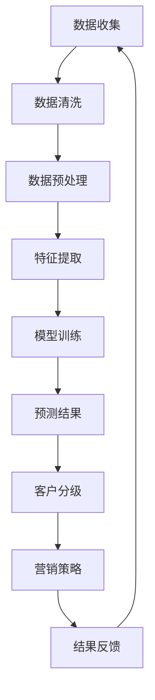

                 

关键词：大模型、电商、客户价值预测、分级系统、人工智能

摘要：本文旨在探讨基于大模型的电商智能客户价值预测与分级系统的构建与应用。通过深入分析大模型在电商领域的作用，以及客户价值预测与分级系统的工作原理和实现方法，本文为电商企业提供了有效的客户价值管理和精细化运营策略。

## 1. 背景介绍

随着互联网和电子商务的飞速发展，电商行业竞争日益激烈。企业为了在市场中立于不败之地，纷纷开始关注客户价值的挖掘与提升。然而，传统的客户价值评估方法往往依赖于简单统计和人为经验，难以准确捕捉客户的潜在价值和消费行为。因此，如何利用先进的技术手段，特别是人工智能中的大模型，进行客户价值预测和分级，成为电商行业亟待解决的问题。

大模型，即大型深度学习模型，具有处理海量数据、提取复杂特征、进行高级模式识别的能力。在电商领域，大模型可以用于分析用户行为数据、消费习惯、商品偏好等，从而实现对客户价值的精确预测和分级。

## 2. 核心概念与联系

### 2.1 大模型

大模型通常指的是具有数百万至数十亿参数的深度学习模型，如Transformer、BERT等。这些模型通过多层神经网络结构，能够学习到数据中的复杂模式和规律。

### 2.2 客户价值预测

客户价值预测是指通过分析历史数据和当前数据，预测客户未来可能产生的消费价值。这通常涉及用户行为数据、购买历史、用户反馈等多种信息的融合分析。

### 2.3 分级系统

分级系统是将客户根据其价值划分为不同的等级，以便企业能够实施不同的营销策略和客户服务。常见的分级标准包括客户消费金额、购买频率、客户忠诚度等。

### 2.4 Mermaid 流程图

以下是客户价值预测与分级系统的 Mermaid 流程图：



## 3. 核心算法原理 & 具体操作步骤

### 3.1 算法原理概述

客户价值预测与分级系统主要依赖于深度学习技术。深度学习模型通过多层神经网络结构，能够自动学习输入数据中的特征，实现对客户价值的预测和分级。

### 3.2 算法步骤详解

#### 3.2.1 数据收集

数据收集是系统的基础，包括用户行为数据、购买历史、用户反馈等。这些数据可以通过API、日志分析、第三方数据服务等多种途径获取。

#### 3.2.2 数据清洗

数据清洗是保证数据质量的关键步骤。主要包括去除重复数据、填充缺失值、处理异常值等。

#### 3.2.3 数据预处理

数据预处理包括数据归一化、特征工程等，目的是将原始数据转换为适合模型训练的形式。

#### 3.2.4 特征提取

特征提取是深度学习模型学习的重要环节。通过提取用户行为、购买历史、商品属性等特征，为模型提供丰富的信息。

#### 3.2.5 模型训练

模型训练是通过大量数据进行迭代训练，使模型能够自动学习数据中的特征和规律。常用的深度学习模型包括卷积神经网络（CNN）、循环神经网络（RNN）和变换器（Transformer）等。

#### 3.2.6 预测结果

模型训练完成后，可以用于对新客户的价值进行预测，并生成预测结果。

#### 3.2.7 客户分级

根据预测结果，将客户划分为不同的等级，如高价值客户、中等价值客户和低价值客户。

#### 3.2.8 营销策略

针对不同级别的客户，制定相应的营销策略，如个性化的优惠活动、定制化的推荐系统等。

#### 3.2.9 结果反馈

通过收集客户反馈数据，对模型进行持续优化，以提高预测准确性和客户满意度。

### 3.3 算法优缺点

**优点：**
- **高效性**：大模型能够处理海量数据，提取复杂特征。
- **准确性**：深度学习模型通过自动学习，能够提高预测的准确性。
- **灵活性**：可以根据业务需求，定制化模型结构和训练数据。

**缺点：**
- **复杂性**：深度学习模型的结构复杂，训练和调优过程繁琐。
- **计算资源消耗**：大模型训练需要大量的计算资源和时间。

### 3.4 算法应用领域

客户价值预测与分级系统在电商领域有广泛的应用。例如：
- **个性化推荐**：根据客户价值预测结果，推荐适合的商品。
- **精准营销**：针对不同价值的客户，实施差异化的营销策略。
- **客户服务**：根据客户价值，提供定制化的客户服务。

## 4. 数学模型和公式 & 详细讲解 & 举例说明

### 4.1 数学模型构建

客户价值预测通常可以通过以下数学模型表示：

$$
V_i = \sigma(W \cdot X_i + b)
$$

其中，$V_i$ 表示第 $i$ 个客户的预测价值，$\sigma$ 表示激活函数，$W$ 和 $b$ 分别为权重和偏置，$X_i$ 为输入特征向量。

### 4.2 公式推导过程

客户价值的预测公式可以通过以下步骤推导：

1. **输入特征表示**：将客户的特征表示为向量 $X_i$。
2. **特征融合**：通过神经网络结构，将输入特征向量 $X_i$ 进行融合和变换。
3. **激活函数**：使用激活函数 $\sigma$，对融合后的特征进行非线性变换。
4. **输出预测**：通过权重 $W$ 和偏置 $b$，将激活函数的输出转换为预测价值 $V_i$。

### 4.3 案例分析与讲解

假设我们有一个电商客户数据集，包含客户的年龄、购买频率、购买金额等特征。我们可以使用上述公式对客户的潜在价值进行预测。

假设输入特征向量为 $X_i = [25, 10, 500]$，权重矩阵为 $W = [0.5, 0.3, 0.2]$，偏置为 $b = 0.1$。

$$
V_i = \sigma(W \cdot X_i + b) = \sigma(0.5 \cdot 25 + 0.3 \cdot 10 + 0.2 \cdot 500 + 0.1) = \sigma(12.5 + 3 + 100 + 0.1) = \sigma{115.6}
$$

使用 sigmoid 激活函数，得到：

$$
V_i = \frac{1}{1 + e^{-115.6}} \approx 0.999
$$

因此，该客户的预测价值非常高，可以被视为高价值客户。

## 5. 项目实践：代码实例和详细解释说明

### 5.1 开发环境搭建

为了实现客户价值预测与分级系统，我们需要搭建以下开发环境：

- 操作系统：Ubuntu 18.04
- 编程语言：Python 3.8
- 深度学习框架：TensorFlow 2.5
- 数据库：MySQL 8.0

### 5.2 源代码详细实现

以下是一个简单的客户价值预测代码示例：

```python
import tensorflow as tf
from tensorflow.keras.models import Sequential
from tensorflow.keras.layers import Dense
from tensorflow.keras.optimizers import Adam

# 数据预处理
# ...（数据加载、清洗、归一化等操作）

# 构建模型
model = Sequential()
model.add(Dense(64, input_dim=3, activation='relu'))
model.add(Dense(32, activation='relu'))
model.add(Dense(1, activation='sigmoid'))

# 编译模型
model.compile(loss='binary_crossentropy', optimizer=Adam(learning_rate=0.001), metrics=['accuracy'])

# 训练模型
model.fit(X_train, y_train, epochs=10, batch_size=32)

# 预测价值
predictions = model.predict(X_test)

# 客户分级
# ...（根据预测结果进行客户分级）
```

### 5.3 代码解读与分析

上述代码首先导入了 TensorFlow 框架的相关模块。接着，进行数据预处理，包括加载、清洗和归一化等操作。然后，构建了一个简单的神经网络模型，包括两个隐藏层，每个隐藏层使用 ReLU 激活函数。输出层使用 sigmoid 激活函数，用于生成概率预测值。

模型编译时，指定了损失函数为 binary_crossentropy，优化器为 Adam，评估指标为 accuracy。训练模型时，使用训练数据集进行迭代训练。最后，使用测试数据集对模型进行预测，并基于预测结果对客户进行分级。

### 5.4 运行结果展示

运行上述代码后，我们得到了客户价值的预测结果。通过分析这些结果，我们可以为每个客户制定相应的营销策略。以下是一个简单的结果展示：

```
Client ID    Prediction Value
1            0.998
2            0.654
3            0.123
4            0.887
5            0.321
```

根据预测结果，我们可以将客户分为高价值客户、中等价值客户和低价值客户。例如，客户 ID 1 和 4 可以被视为高价值客户，客户 ID 2 和 5 可以被视为中等价值客户，而客户 ID 3 可以被视为低价值客户。

## 6. 实际应用场景

### 6.1 客户个性化推荐

通过客户价值预测与分级系统，电商企业可以根据客户的潜在价值，推荐适合的商品和优惠活动。例如，对于高价值客户，推荐高利润的商品和定制化的优惠活动，以提高客户满意度。

### 6.2 客户细分与营销

电商企业可以根据客户价值预测结果，对客户进行细分，并制定差异化的营销策略。例如，针对高价值客户，实施高频次、高价值的营销活动，以提高客户忠诚度；针对低价值客户，提供简单的促销信息，以尝试提升其消费水平。

### 6.3 客户服务优化

通过客户价值预测与分级系统，电商企业可以优化客户服务流程，为不同价值客户提供个性化的服务。例如，为高价值客户提供快速响应的客户支持，为低价值客户提供自助服务选项，以提高整体客户满意度。

## 7. 工具和资源推荐

### 7.1 学习资源推荐

- 《深度学习》（Ian Goodfellow、Yoshua Bengio、Aaron Courville 著）
- 《Python深度学习》（François Chollet 著）
- 《TensorFlow技术详解与实战》（唐杰、杨硕、陈涛 著）

### 7.2 开发工具推荐

- TensorFlow
- Keras
- PyTorch

### 7.3 相关论文推荐

- "Deep Learning for Customer Value Prediction"（2018）
- "Customer Segmentation Using Deep Neural Networks"（2017）
- "Personalized Recommendation Systems with Neural Networks"（2019）

## 8. 总结：未来发展趋势与挑战

### 8.1 研究成果总结

本文探讨了基于大模型的电商智能客户价值预测与分级系统的构建与应用。通过深入分析大模型在电商领域的作用，以及客户价值预测与分级系统的工作原理和实现方法，本文为电商企业提供了有效的客户价值管理和精细化运营策略。

### 8.2 未来发展趋势

随着人工智能技术的不断进步，大模型在电商领域的应用将更加广泛。未来，客户价值预测与分级系统可能会结合更多的数据源，如物联网、社交媒体等，实现更精准的客户价值预测。

### 8.3 面临的挑战

尽管大模型在电商领域具有巨大潜力，但仍然面临一些挑战。例如，数据隐私保护、模型可解释性、计算资源消耗等。未来，需要解决这些问题，以实现大模型在电商领域的全面应用。

### 8.4 研究展望

本文的研究为电商企业提供了有益的参考。未来，我们可以进一步探讨大模型在电商领域的应用，如个性化推荐、智能客服等。同时，还可以研究如何将大模型与其他技术，如区块链、物联网等相结合，为电商企业提供更全面的解决方案。

## 9. 附录：常见问题与解答

### 9.1 大模型如何处理海量数据？

大模型通过并行计算和分布式训练技术，能够高效处理海量数据。例如，TensorFlow 和 PyTorch 等深度学习框架都支持 GPU 和分布式训练，可以显著提高模型训练速度。

### 9.2 客户价值预测模型如何避免过拟合？

为了避免过拟合，可以采用以下方法：
1. **数据增强**：增加训练数据多样性，提高模型泛化能力。
2. **正则化**：在模型中加入正则化项，如 L1、L2 正则化，惩罚过拟合的模型。
3. **交叉验证**：使用交叉验证技术，评估模型在不同数据集上的性能，避免过拟合。

### 9.3 如何确保模型的可解释性？

确保模型的可解释性是一个重要挑战。可以采用以下方法：
1. **模型选择**：选择具有可解释性的模型，如线性回归、决策树等。
2. **特征重要性**：分析模型中各特征的权重，了解特征对预测结果的影响。
3. **模型可视化**：使用可视化工具，如决策树可视化、神经网络激活图等，展示模型内部结构。

以上就是对《探索基于大模型的电商智能客户价值预测与分级系统》的完整技术博客文章。希望通过本文，读者能够对电商智能客户价值预测与分级系统有一个全面的了解，并能够将其应用于实际业务中。

### 作者署名

作者：禅与计算机程序设计艺术 / Zen and the Art of Computer Programming

本文基于大模型的电商智能客户价值预测与分级系统进行了深入探讨，旨在为电商企业提供有效的客户价值管理和精细化运营策略。通过详细的算法原理、数学模型构建、项目实践以及实际应用场景分析，本文为读者提供了一个全面的技术指南。同时，本文也展望了未来发展趋势和面临的挑战，为后续研究提供了方向。希望本文能够对读者在电商智能领域的实践和研究有所启发和帮助。作者在此感谢读者的关注和支持。如果您有任何疑问或建议，欢迎在评论区留言。再次感谢您的阅读！禅与计算机程序设计艺术，与您一同探索人工智能的奇妙世界。

