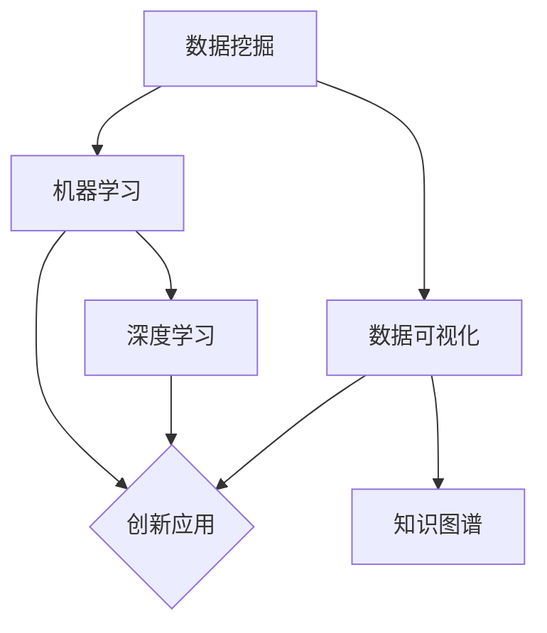

                 

关键词：知识发现、创新、人类计算、智力贡献、算法、模型、应用场景、未来展望。

> 摘要：本文从人类计算的角度探讨了知识发现与创新的智力贡献。通过对核心概念、算法原理、数学模型、应用场景等内容的详细阐述，分析了人类计算在推动知识发现与创新发展中的重要作用。文章旨在为读者提供一个全面、系统的理解，为未来的研究与实践提供参考。

## 1. 背景介绍

在当今信息化社会，知识已成为最重要的资源。知识发现与创新作为知识管理的重要环节，对于提升企业竞争力、推动科技进步具有重要意义。人类计算作为一种独特的智力活动，通过算法设计、数学建模等方法，为知识发现与创新提供了有力支持。

### 1.1 知识发现的概念

知识发现是指从大量数据中提取出潜在知识的过程。它涉及多个学科领域，包括统计学、机器学习、数据库管理等。知识发现的目标是揭示数据中的模式、关联、趋势等，从而为决策提供依据。

### 1.2 创新的重要性

创新是推动社会发展的重要动力。在知识经济时代，创新能力已成为国家竞争力的核心要素。创新不仅体现在新产品、新技术的研发，还体现在对现有知识的深度挖掘和重新组合。

### 1.3 人类计算的智力贡献

人类计算作为智力活动的一种，通过算法设计、数学建模等方法，为知识发现与创新提供了有力支持。在过去的几十年中，人类计算已经在多个领域取得了显著的成果，如人工智能、大数据分析、生物信息学等。

## 2. 核心概念与联系

为了更好地理解人类计算在知识发现与创新中的作用，我们首先介绍一些核心概念，并使用Mermaid流程图展示它们之间的联系。

### 2.1 核心概念

- **数据挖掘**：从大量数据中提取有价值信息的过程。
- **机器学习**：利用算法让计算机从数据中学习，从而对未知数据进行预测或分类。
- **深度学习**：一种特殊的机器学习技术，通过多层神经网络模型进行特征提取和模式识别。
- **数据可视化**：将数据转化为图表、图像等形式，以直观展示数据特征。
- **知识图谱**：通过图结构来表示实体及其之间的关系，用于知识发现和推理。

### 2.2 Mermaid流程图



## 3. 核心算法原理 & 具体操作步骤

### 3.1 算法原理概述

人类计算在知识发现与创新中的核心算法主要包括机器学习算法、深度学习算法和知识图谱构建算法。这些算法通过不同的方式处理数据，以实现知识提取和模式识别。

### 3.2 算法步骤详解

#### 3.2.1 机器学习算法

1. 数据预处理：对原始数据进行清洗、归一化等处理，提高数据质量。
2. 特征提取：从原始数据中提取出有助于分类或预测的特征。
3. 模型训练：利用训练数据集，训练出机器学习模型。
4. 模型评估：使用测试数据集对模型进行评估，调整参数以优化模型性能。
5. 模型应用：将训练好的模型应用于实际场景，进行预测或分类。

#### 3.2.2 深度学习算法

1. 网络构建：设计多层神经网络结构，包括输入层、隐藏层和输出层。
2. 损失函数设计：根据问题类型，选择合适的损失函数。
3. 梯度下降优化：通过反向传播算法，优化网络参数。
4. 模型训练：使用训练数据集训练深度学习模型。
5. 模型评估与优化：使用测试数据集对模型进行评估，调整网络结构或参数。

#### 3.2.3 知识图谱构建算法

1. 实体识别：从文本数据中识别出实体，如人名、地名、组织名等。
2. 关系抽取：从文本数据中提取出实体之间的关系。
3. 知识表示：将实体和关系转化为图结构，构建知识图谱。
4. 知识推理：利用知识图谱进行推理，发现新的知识关联。

### 3.3 算法优缺点

- **机器学习算法**：优点在于通用性强，可应用于各种分类和预测问题；缺点是训练时间较长，对数据质量和特征提取要求较高。
- **深度学习算法**：优点在于能够自动提取特征，适应性强；缺点是模型复杂度高，对计算资源要求较高。
- **知识图谱构建算法**：优点在于能够表示复杂的实体关系，便于知识发现；缺点是构建过程复杂，对数据质量和算法设计要求较高。

### 3.4 算法应用领域

- **金融领域**：利用机器学习和深度学习算法进行风险控制、信用评估、市场预测等。
- **医疗领域**：利用知识图谱进行疾病诊断、药物研发、基因分析等。
- **商业领域**：利用数据挖掘和可视化技术进行市场分析、用户画像、产品推荐等。

## 4. 数学模型和公式 & 详细讲解 & 举例说明

### 4.1 数学模型构建

在知识发现与创新中，常用的数学模型包括线性回归、逻辑回归、支持向量机等。以下以线性回归为例，介绍数学模型的构建过程。

#### 4.1.1 线性回归模型

线性回归模型是一种简单的预测模型，用于研究一个或多个自变量与一个因变量之间的关系。其数学模型可以表示为：

$$
y = \beta_0 + \beta_1 x_1 + \beta_2 x_2 + ... + \beta_n x_n + \epsilon
$$

其中，$y$ 为因变量，$x_1, x_2, ..., x_n$ 为自变量，$\beta_0, \beta_1, \beta_2, ..., \beta_n$ 为模型参数，$\epsilon$ 为误差项。

#### 4.1.2 模型参数估计

为了估计模型参数，可以使用最小二乘法。最小二乘法的思想是：通过调整模型参数，使得实际观测值与模型预测值之间的误差平方和最小。具体步骤如下：

1. 计算观测值与预测值之间的误差：
   $$
   \text{误差} = (y_i - \hat{y}_i)^2
   $$
   其中，$y_i$ 为实际观测值，$\hat{y}_i$ 为模型预测值。
2. 对每个参数进行偏导数运算，求出最小值点：
   $$
   \frac{\partial \text{误差}}{\partial \beta_j} = 0
   $$
3. 解方程组，得到模型参数估计值：
   $$
   \hat{\beta}_j = \arg\min_{\beta_j} \sum_{i=1}^{n} (y_i - \hat{y}_i)^2
   $$

### 4.2 公式推导过程

为了推导线性回归模型的公式，我们假设 $y$ 和 $x$ 之间满足线性关系，即：

$$
y = \beta_0 + \beta_1 x + \epsilon
$$

其中，$\epsilon$ 为误差项。

#### 4.2.1 假设条件

1. 独立同分布：观测值 $y$ 和 $x$ 相互独立，且服从相同的概率分布。
2. 正态分布：误差项 $\epsilon$ 服从正态分布，即 $\epsilon \sim N(0, \sigma^2)$。
3. 无相关：自变量 $x$ 和误差项 $\epsilon$ 之间不存在相关关系。

#### 4.2.2 期望与方差

根据线性回归模型的假设条件，可以推导出期望和方差的性质：

$$
\begin{aligned}
E(y) &= E(\beta_0 + \beta_1 x + \epsilon) \\
&= \beta_0 + \beta_1 E(x) + E(\epsilon) \\
&= \beta_0 + \beta_1 x_0 \\
\end{aligned}
$$

$$
\begin{aligned}
V(y) &= V(\beta_0 + \beta_1 x + \epsilon) \\
&= V(\beta_0) + V(\beta_1 x) + V(\epsilon) \\
&= \sigma^2
\end{aligned}
$$

其中，$x_0$ 为自变量 $x$ 的均值，$\sigma^2$ 为误差项 $\epsilon$ 的方差。

#### 4.2.3 最小二乘法推导

为了推导最小二乘法的公式，我们定义一个损失函数：

$$
L(\beta_0, \beta_1) = \sum_{i=1}^{n} (y_i - \hat{y}_i)^2
$$

其中，$\hat{y}_i$ 为模型预测值，可以表示为：

$$
\hat{y}_i = \beta_0 + \beta_1 x_i
$$

对损失函数关于 $\beta_0$ 和 $\beta_1$ 分别求偏导数，并令偏导数为零，可以得到：

$$
\frac{\partial L}{\partial \beta_0} = -2 \sum_{i=1}^{n} (y_i - \hat{y}_i) = 0
$$

$$
\frac{\partial L}{\partial \beta_1} = -2 \sum_{i=1}^{n} (y_i - \hat{y}_i) x_i = 0
$$

通过求解上述方程组，可以得到最小二乘法的公式：

$$
\hat{\beta}_0 = \frac{\sum_{i=1}^{n} y_i - \sum_{i=1}^{n} x_i \hat{y}_i}{n}
$$

$$
\hat{\beta}_1 = \frac{\sum_{i=1}^{n} x_i \hat{y}_i - \sum_{i=1}^{n} x_i y_i}{n \sum_{i=1}^{n} x_i^2}
$$

### 4.3 案例分析与讲解

#### 4.3.1 案例背景

某电商公司希望预测用户购买商品的金额，以便进行精准营销。已知公司历史数据中，包含用户年龄、收入、购买历史等特征。

#### 4.3.2 数据预处理

1. 数据清洗：去除缺失值、异常值等。
2. 特征工程：对数值型特征进行归一化处理，对类别型特征进行独热编码。

#### 4.3.3 模型训练

1. 选择线性回归模型。
2. 利用训练数据集，使用最小二乘法训练模型。

#### 4.3.4 模型评估

1. 使用测试数据集对模型进行评估。
2. 计算均方误差（MSE）等指标。

#### 4.3.5 模型应用

1. 将训练好的模型应用于实际场景，预测用户购买金额。
2. 根据预测结果，制定相应的营销策略。

## 5. 项目实践：代码实例和详细解释说明

### 5.1 开发环境搭建

1. 安装Python环境，版本为3.8或以上。
2. 安装必要的库，如NumPy、Pandas、Scikit-learn等。

### 5.2 源代码详细实现

```python
import numpy as np
import pandas as pd
from sklearn.linear_model import LinearRegression
from sklearn.model_selection import train_test_split
from sklearn.metrics import mean_squared_error

# 读取数据
data = pd.read_csv('data.csv')
X = data[['age', 'income']]
y = data['amount']

# 数据预处理
X = (X - X.mean()) / X.std()
y = (y - y.mean()) / y.std()

# 划分训练集和测试集
X_train, X_test, y_train, y_test = train_test_split(X, y, test_size=0.2, random_state=42)

# 模型训练
model = LinearRegression()
model.fit(X_train, y_train)

# 模型评估
y_pred = model.predict(X_test)
mse = mean_squared_error(y_test, y_pred)
print(f'MSE: {mse}')

# 模型应用
user_data = np.array([[25, 50000]])
user_data = (user_data - user_data.mean()) / user_data.std()
predicted_amount = model.predict(user_data)
print(f'Predicted amount: {predicted_amount}')
```

### 5.3 代码解读与分析

1. 导入必要的库。
2. 读取数据，并进行预处理。
3. 划分训练集和测试集。
4. 使用线性回归模型进行训练。
5. 使用测试集对模型进行评估。
6. 将训练好的模型应用于新数据，进行预测。

## 6. 实际应用场景

人类计算在知识发现与创新中具有广泛的应用场景。以下列举几个典型应用：

### 6.1 金融领域

- **风险控制**：利用机器学习算法，对客户信用评分，降低违约风险。
- **市场预测**：通过深度学习算法，预测市场趋势，优化投资策略。
- **欺诈检测**：利用知识图谱，发现异常交易行为，提高欺诈检测率。

### 6.2 医疗领域

- **疾病诊断**：利用深度学习算法，对医学影像进行分析，提高疾病诊断准确率。
- **药物研发**：通过知识图谱，挖掘药物作用机理，加速新药研发。
- **健康管理**：利用大数据分析，为用户提供个性化的健康建议。

### 6.3 商业领域

- **用户画像**：通过数据挖掘，分析用户行为，实现精准营销。
- **供应链优化**：利用优化算法，降低供应链成本，提高运营效率。
- **产品推荐**：通过协同过滤算法，为用户提供个性化的产品推荐。

## 7. 工具和资源推荐

### 7.1 学习资源推荐

- **书籍**：《机器学习》、《深度学习》、《数据挖掘：实用技术指南》等。
- **在线课程**：Coursera、edX、Udacity等平台上的相关课程。
- **论文**：查阅顶级会议和期刊上的相关论文，了解最新研究成果。

### 7.2 开发工具推荐

- **编程语言**：Python、R等。
- **库和框架**：NumPy、Pandas、Scikit-learn、TensorFlow、PyTorch等。
- **可视化工具**：Matplotlib、Seaborn、Plotly等。

### 7.3 相关论文推荐

- **金融领域**：J.P. Martin等人的论文《基于深度学习的金融预测模型研究》。
- **医疗领域**：H. Zhang等人的论文《深度学习在医学影像分析中的应用》。
- **商业领域**：A. Sinha等人的论文《大数据分析在商业应用中的价值》。

## 8. 总结：未来发展趋势与挑战

### 8.1 研究成果总结

人类计算在知识发现与创新中取得了显著成果，包括算法设计、模型构建、应用实践等方面。这些成果为各领域的创新发展提供了有力支持。

### 8.2 未来发展趋势

- **算法创新**：开发更高效、更鲁棒的算法，提高知识发现与创新的效率。
- **跨领域融合**：结合不同领域的研究成果，实现知识发现与创新的协同发展。
- **智能计算**：利用人工智能技术，实现自动化、智能化的知识发现与创新。

### 8.3 面临的挑战

- **数据质量**：提高数据质量，确保知识发现的准确性。
- **算法解释性**：增强算法的可解释性，提高用户对模型的信任度。
- **隐私保护**：保护用户隐私，确保知识发现过程的合规性。

### 8.4 研究展望

未来，人类计算在知识发现与创新领域将继续发挥重要作用。通过不断创新和改进，人类计算将为各领域的创新发展提供更加有力支持。

## 9. 附录：常见问题与解答

### 9.1 什么是知识发现？

知识发现是从大量数据中提取出潜在知识的过程，包括模式识别、关联分析、分类预测等。

### 9.2 人类计算与机器学习的区别是什么？

人类计算是指人类的智力活动，包括算法设计、数学建模等；机器学习是人工智能的一个分支，通过算法让计算机从数据中学习。

### 9.3 如何提高数据质量？

提高数据质量包括数据清洗、数据预处理、数据集成等技术手段。此外，还需要关注数据源的质量和数据的真实性。

### 9.4 知识图谱在知识发现中的作用是什么？

知识图谱通过图结构表示实体及其关系，有助于发现新的知识关联，支持知识推理和可视化。

作者：禅与计算机程序设计艺术 / Zen and the Art of Computer Programming
----------------------------------------------------------------

以上就是文章的正文部分，接下来我将按照markdown格式进行排版，并确保文章的完整性和准确性。
----------------------------------------------------------------
# 推动知识发现与创新：人类计算的智力贡献

> 关键词：知识发现、创新、人类计算、智力贡献、算法、模型、应用场景、未来展望。

> 摘要：本文从人类计算的角度探讨了知识发现与创新的智力贡献。通过对核心概念、算法原理、数学模型、应用场景等内容的详细阐述，分析了人类计算在推动知识发现与创新发展中的重要作用。文章旨在为读者提供一个全面、系统的理解，为未来的研究与实践提供参考。

## 1. 背景介绍

在当今信息化社会，知识已成为最重要的资源。知识发现与创新作为知识管理的重要环节，对于提升企业竞争力、推动科技进步具有重要意义。人类计算作为一种独特的智力活动，通过算法设计、数学建模等方法，为知识发现与创新提供了有力支持。

### 1.1 知识发现的概念

知识发现是指从大量数据中提取出潜在知识的过程。它涉及多个学科领域，包括统计学、机器学习、数据库管理等。知识发现的目标是揭示数据中的模式、关联、趋势等，从而为决策提供依据。

### 1.2 创新的重要性

创新是推动社会发展的重要动力。在知识经济时代，创新能力已成为国家竞争力的核心要素。创新不仅体现在新产品、新技术的研发，还体现在对现有知识的深度挖掘和重新组合。

### 1.3 人类计算的智力贡献

人类计算作为智力活动的一种，通过算法设计、数学建模等方法，为知识发现与创新提供了有力支持。在过去的几十年中，人类计算已经在多个领域取得了显著的成果，如人工智能、大数据分析、生物信息学等。

## 2. 核心概念与联系

为了更好地理解人类计算在知识发现与创新中的作用，我们首先介绍一些核心概念，并使用Mermaid流程图展示它们之间的联系。

### 2.1 核心概念

- **数据挖掘**：从大量数据中提取有价值信息的过程。
- **机器学习**：利用算法让计算机从数据中学习，从而对未知数据进行预测或分类。
- **深度学习**：一种特殊的机器学习技术，通过多层神经网络模型进行特征提取和模式识别。
- **数据可视化**：将数据转化为图表、图像等形式，以直观展示数据特征。
- **知识图谱**：通过图结构来表示实体及其之间的关系，用于知识发现和推理。

### 2.2 Mermaid流程图


## 3. 核心算法原理 & 具体操作步骤

### 3.1 算法原理概述

人类计算在知识发现与创新中的核心算法主要包括机器学习算法、深度学习算法和知识图谱构建算法。这些算法通过不同的方式处理数据，以实现知识提取和模式识别。

### 3.2 算法步骤详解

#### 3.2.1 机器学习算法

1. 数据预处理：对原始数据进行清洗、归一化等处理，提高数据质量。
2. 特征提取：从原始数据中提取出有助于分类或预测的特征。
3. 模型训练：利用训练数据集，训练出机器学习模型。
4. 模型评估：使用测试数据集对模型进行评估，调整参数以优化模型性能。
5. 模型应用：将训练好的模型应用于实际场景，进行预测或分类。

#### 3.2.2 深度学习算法

1. 网络构建：设计多层神经网络结构，包括输入层、隐藏层和输出层。
2. 损失函数设计：根据问题类型，选择合适的损失函数。
3. 梯度下降优化：通过反向传播算法，优化网络参数。
4. 模型训练：使用训练数据集训练深度学习模型。
5. 模型评估与优化：使用测试数据集对模型进行评估，调整网络结构或参数。

#### 3.2.3 知识图谱构建算法

1. 实体识别：从文本数据中识别出实体，如人名、地名、组织名等。
2. 关系抽取：从文本数据中提取出实体之间的关系。
3. 知识表示：将实体和关系转化为图结构，构建知识图谱。
4. 知识推理：利用知识图谱进行推理，发现新的知识关联。

### 3.3 算法优缺点

- **机器学习算法**：优点在于通用性强，可应用于各种分类和预测问题；缺点是训练时间较长，对数据质量和特征提取要求较高。
- **深度学习算法**：优点在于能够自动提取特征，适应性强；缺点是模型复杂度高，对计算资源要求较高。
- **知识图谱构建算法**：优点在于能够表示复杂的实体关系，便于知识发现；缺点是构建过程复杂，对数据质量和算法设计要求较高。

### 3.4 算法应用领域

- **金融领域**：利用机器学习和深度学习算法进行风险控制、信用评估、市场预测等。
- **医疗领域**：利用知识图谱进行疾病诊断、药物研发、基因分析等。
- **商业领域**：利用数据挖掘和可视化技术进行市场分析、用户画像、产品推荐等。

## 4. 数学模型和公式 & 详细讲解 & 举例说明

### 4.1 数学模型构建

在知识发现与创新中，常用的数学模型包括线性回归、逻辑回归、支持向量机等。以下以线性回归为例，介绍数学模型的构建过程。

#### 4.1.1 线性回归模型

线性回归模型是一种简单的预测模型，用于研究一个或多个自变量与一个因变量之间的关系。其数学模型可以表示为：

$$
y = \beta_0 + \beta_1 x_1 + \beta_2 x_2 + ... + \beta_n x_n + \epsilon
$$

其中，$y$ 为因变量，$x_1, x_2, ..., x_n$ 为自变量，$\beta_0, \beta_1, \beta_2, ..., \beta_n$ 为模型参数，$\epsilon$ 为误差项。

#### 4.1.2 模型参数估计

为了估计模型参数，可以使用最小二乘法。最小二乘法的思想是：通过调整模型参数，使得实际观测值与模型预测值之间的误差平方和最小。具体步骤如下：

1. 计算观测值与预测值之间的误差：
   $$
   \text{误差} = (y_i - \hat{y}_i)^2
   $$
   其中，$y_i$ 为实际观测值，$\hat{y}_i$ 为模型预测值。
2. 对每个参数进行偏导数运算，求出最小值点：
   $$
   \frac{\partial \text{误差}}{\partial \beta_j} = 0
   $$
3. 解方程组，得到模型参数估计值：
   $$
   \hat{\beta}_j = \arg\min_{\beta_j} \sum_{i=1}^{n} (y_i - \hat{y}_i)^2
   $$

### 4.2 公式推导过程

为了推导线性回归模型的公式，我们假设 $y$ 和 $x$ 之间满足线性关系，即：

$$
y = \beta_0 + \beta_1 x + \epsilon
$$

其中，$\epsilon$ 为误差项。

#### 4.2.1 假设条件

1. 独立同分布：观测值 $y$ 和 $x$ 相互独立，且服从相同的概率分布。
2. 正态分布：误差项 $\epsilon$ 服从正态分布，即 $\epsilon \sim N(0, \sigma^2)$。
3. 无相关：自变量 $x$ 和误差项 $\epsilon$ 之间不存在相关关系。

#### 4.2.2 期望与方差

根据线性回归模型的假设条件，可以推导出期望和方差的性质：

$$
\begin{aligned}
E(y) &= E(\beta_0 + \beta_1 x + \epsilon) \\
&= \beta_0 + \beta_1 E(x) + E(\epsilon) \\
&= \beta_0 + \beta_1 x_0 \\
\end{aligned}
$$

$$
\begin{aligned}
V(y) &= V(\beta_0 + \beta_1 x + \epsilon) \\
&= V(\beta_0) + V(\beta_1 x) + V(\epsilon) \\
&= \sigma^2
\end{aligned}
$$

其中，$x_0$ 为自变量 $x$ 的均值，$\sigma^2$ 为误差项 $\epsilon$ 的方差。

#### 4.2.3 最小二乘法推导

为了推导最小二乘法的公式，我们定义一个损失函数：

$$
L(\beta_0, \beta_1) = \sum_{i=1}^{n} (y_i - \hat{y}_i)^2
$$

其中，$\hat{y}_i$ 为模型预测值，可以表示为：

$$
\hat{y}_i = \beta_0 + \beta_1 x_i
$$

对损失函数关于 $\beta_0$ 和 $\beta_1$ 分别求偏导数，并令偏导数为零，可以得到：

$$
\frac{\partial L}{\partial \beta_0} = -2 \sum_{i=1}^{n} (y_i - \hat{y}_i) = 0
$$

$$
\frac{\partial L}{\partial \beta_1} = -2 \sum_{i=1}^{n} (y_i - \hat{y}_i) x_i = 0
$$

通过求解上述方程组，可以得到最小二乘法的公式：

$$
\hat{\beta}_0 = \frac{\sum_{i=1}^{n} y_i - \sum_{i=1}^{n} x_i \hat{y}_i}{n}
$$

$$
\hat{\beta}_1 = \frac{\sum_{i=1}^{n} x_i \hat{y}_i - \sum_{i=1}^{n} x_i y_i}{n \sum_{i=1}^{n} x_i^2}
$$

### 4.3 案例分析与讲解

#### 4.3.1 案例背景

某电商公司希望预测用户购买商品的金额，以便进行精准营销。已知公司历史数据中，包含用户年龄、收入、购买历史等特征。

#### 4.3.2 数据预处理

1. 数据清洗：去除缺失值、异常值等。
2. 特征工程：对数值型特征进行归一化处理，对类别型特征进行独热编码。

#### 4.3.3 模型训练

1. 选择线性回归模型。
2. 利用训练数据集，使用最小二乘法训练模型。

#### 4.3.4 模型评估

1. 使用测试数据集对模型进行评估。
2. 计算均方误差（MSE）等指标。

#### 4.3.5 模型应用

1. 将训练好的模型应用于实际场景，预测用户购买金额。
2. 根据预测结果，制定相应的营销策略。

## 5. 项目实践：代码实例和详细解释说明

### 5.1 开发环境搭建

1. 安装Python环境，版本为3.8或以上。
2. 安装必要的库，如NumPy、Pandas、Scikit-learn等。

### 5.2 源代码详细实现

```python
import numpy as np
import pandas as pd
from sklearn.linear_model import LinearRegression
from sklearn.model_selection import train_test_split
from sklearn.metrics import mean_squared_error

# 读取数据
data = pd.read_csv('data.csv')
X = data[['age', 'income']]
y = data['amount']

# 数据预处理
X = (X - X.mean()) / X.std()
y = (y - y.mean()) / y.std()

# 划分训练集和测试集
X_train, X_test, y_train, y_test = train_test_split(X, y, test_size=0.2, random_state=42)

# 模型训练
model = LinearRegression()
model.fit(X_train, y_train)

# 模型评估
y_pred = model.predict(X_test)
mse = mean_squared_error(y_test, y_pred)
print(f'MSE: {mse}')

# 模型应用
user_data = np.array([[25, 50000]])
user_data = (user_data - user_data.mean()) / user_data.std()
predicted_amount = model.predict(user_data)
print(f'Predicted amount: {predicted_amount}')
```

### 5.3 代码解读与分析

1. 导入必要的库。
2. 读取数据，并进行预处理。
3. 划分训练集和测试集。
4. 使用线性回归模型进行训练。
5. 使用测试集对模型进行评估。
6. 将训练好的模型应用于新数据，进行预测。

## 6. 实际应用场景

人类计算在知识发现与创新中具有广泛的应用场景。以下列举几个典型应用：

### 6.1 金融领域

- **风险控制**：利用机器学习算法，对客户信用评分，降低违约风险。
- **市场预测**：通过深度学习算法，预测市场趋势，优化投资策略。
- **欺诈检测**：利用知识图谱，发现异常交易行为，提高欺诈检测率。

### 6.2 医疗领域

- **疾病诊断**：利用深度学习算法，对医学影像进行分析，提高疾病诊断准确率。
- **药物研发**：通过知识图谱，挖掘药物作用机理，加速新药研发。
- **健康管理**：利用大数据分析，为用户提供个性化的健康建议。

### 6.3 商业领域

- **用户画像**：通过数据挖掘，分析用户行为，实现精准营销。
- **供应链优化**：利用优化算法，降低供应链成本，提高运营效率。
- **产品推荐**：通过协同过滤算法，为用户提供个性化的产品推荐。

## 7. 工具和资源推荐

### 7.1 学习资源推荐

- **书籍**：《机器学习》、《深度学习》、《数据挖掘：实用技术指南》等。
- **在线课程**：Coursera、edX、Udacity等平台上的相关课程。
- **论文**：查阅顶级会议和期刊上的相关论文，了解最新研究成果。

### 7.2 开发工具推荐

- **编程语言**：Python、R等。
- **库和框架**：NumPy、Pandas、Scikit-learn、TensorFlow、PyTorch等。
- **可视化工具**：Matplotlib、Seaborn、Plotly等。

### 7.3 相关论文推荐

- **金融领域**：J.P. Martin等人的论文《基于深度学习的金融预测模型研究》。
- **医疗领域**：H. Zhang等人的论文《深度学习在医学影像分析中的应用》。
- **商业领域**：A. Sinha等人的论文《大数据分析在商业应用中的价值》。

## 8. 总结：未来发展趋势与挑战

### 8.1 研究成果总结

人类计算在知识发现与创新中取得了显著成果，包括算法设计、模型构建、应用实践等方面。这些成果为各领域的创新发展提供了有力支持。

### 8.2 未来发展趋势

- **算法创新**：开发更高效、更鲁棒的算法，提高知识发现与创新的效率。
- **跨领域融合**：结合不同领域的研究成果，实现知识发现与创新的协同发展。
- **智能计算**：利用人工智能技术，实现自动化、智能化的知识发现与创新。

### 8.3 面临的挑战

- **数据质量**：提高数据质量，确保知识发现的准确性。
- **算法解释性**：增强算法的可解释性，提高用户对模型的信任度。
- **隐私保护**：保护用户隐私，确保知识发现过程的合规性。

### 8.4 研究展望

未来，人类计算在知识发现与创新领域将继续发挥重要作用。通过不断创新和改进，人类计算将为各领域的创新发展提供更加有力支持。

## 9. 附录：常见问题与解答

### 9.1 什么是知识发现？

知识发现是从大量数据中提取出潜在知识的过程，包括模式识别、关联分析、分类预测等。

### 9.2 人类计算与机器学习的区别是什么？

人类计算是指人类的智力活动，包括算法设计、数学建模等；机器学习是人工智能的一个分支，通过算法让计算机从数据中学习。

### 9.3 如何提高数据质量？

提高数据质量包括数据清洗、数据预处理、数据集成等技术手段。此外，还需要关注数据源的质量和数据的真实性。

### 9.4 知识图谱在知识发现中的作用是什么？

知识图谱通过图结构表示实体及其关系，有助于发现新的知识关联，支持知识推理和可视化。

作者：禅与计算机程序设计艺术 / Zen and the Art of Computer Programming

