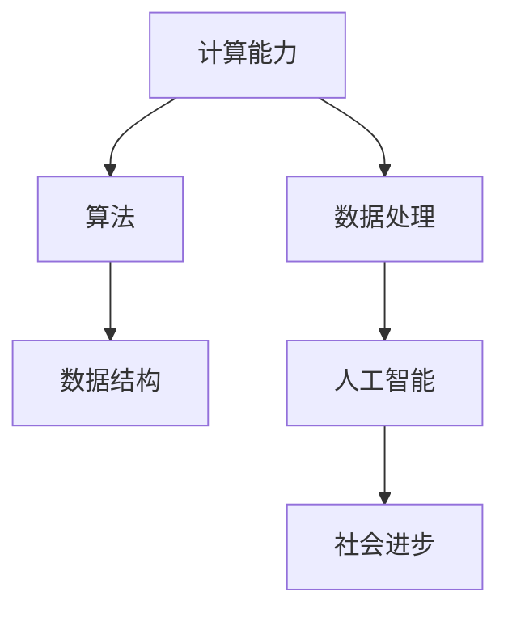

                 

关键词：计算能力、人工智能、社会发展、科技进步、计算技术、数据处理、算法优化

> 摘要：本文旨在探讨人类计算技术在推动社会进步中的积极作用，通过阐述计算技术的核心概念、数学模型、算法原理、实践应用以及未来发展趋势，揭示计算技术对人类社会发展的深远影响。

## 1. 背景介绍

随着信息技术的飞速发展，人类计算能力得到了前所未有的提升。从早期的计算机算术运算，到现代人工智能的智能决策，计算技术在各个领域都展现出了强大的影响力。本文将围绕计算技术这一主题，探讨其在推动社会进步中的积极作用。

计算技术的历史可以追溯到古代数学和算术的发展。随着计算机科学的诞生，计算技术逐渐成为推动社会进步的重要动力。从早期的计算机应用到现代的人工智能系统，计算技术的进步不仅改变了人们的生产生活方式，也对经济、教育、医疗等多个领域产生了深远影响。

本文将按照以下结构进行阐述：

- 计算技术的核心概念与联系
- 核心算法原理与具体操作步骤
- 数学模型和公式的详细讲解
- 项目实践：代码实例和详细解释说明
- 实际应用场景
- 未来应用展望
- 工具和资源推荐
- 总结：未来发展趋势与挑战

## 2. 核心概念与联系

计算技术的核心概念主要包括计算能力、算法、数据结构等。计算能力是指计算机在处理数据和信息时的能力，包括运算速度、存储容量、网络传输速度等。算法是一系列解决问题的步骤和规则，通过算法可以高效地处理复杂数据。数据结构是算法实现的基础，用于存储和组织数据。

为了更好地理解这些概念之间的联系，我们可以使用Mermaid流程图来展示它们之间的关系。



在上述流程图中，计算能力作为基础，支撑着算法和数据结构的实现，进而推动数据处理和人工智能的发展，最终为社会进步贡献力量。

### 2.1 计算能力的提升

计算能力的提升是计算技术发展的核心驱动力。随着计算机硬件的不断更新，计算能力得到了显著提升。从早期的冯诺伊曼架构，到现代的GPU并行计算，计算能力的提升不仅提高了算法的效率，也为人工智能的发展提供了强大支持。

近年来，量子计算作为一种新兴的计算技术，其计算能力已经超越了传统计算机。量子计算利用量子比特的叠加和纠缠特性，可以同时处理大量数据，有望在未来实现高效的算法优化和数据处理。

### 2.2 算法的核心地位

算法是计算技术的核心，它决定了计算过程的效率和质量。在人工智能领域，算法的优化和改进是推动技术发展的关键。深度学习、强化学习、自然语言处理等领域的算法不断迭代更新，为人工智能的应用提供了强大的支持。

### 2.3 数据结构的支持

数据结构是算法实现的基础，它用于存储和组织数据，以便算法能够高效地处理数据。常见的线性数据结构包括数组、链表等，非线性数据结构包括树、图等。数据结构的优化和改进可以显著提高算法的效率和性能。

## 3. 核心算法原理与具体操作步骤

在计算技术中，核心算法原理起着至关重要的作用。以下我们将介绍几种常见的核心算法原理，并详细讲解其操作步骤。

### 3.1 算法原理概述

核心算法原理主要包括以下几种：

1. **排序算法**：用于对数据进行排序，常见的排序算法包括冒泡排序、快速排序、归并排序等。
2. **搜索算法**：用于在数据中查找特定元素，常见的搜索算法包括二分查找、深度优先搜索、广度优先搜索等。
3. **图算法**：用于解决图相关的问题，常见的图算法包括最短路径算法、最小生成树算法、图着色算法等。
4. **动态规划算法**：用于解决最优子结构问题，常见的动态规划算法包括斐波那契数列、背包问题等。

### 3.2 算法步骤详解

下面我们以排序算法为例，详细讲解其操作步骤。

**冒泡排序**：

1. 从第一个元素开始，比较相邻的两个元素，如果第一个比第二个大，则交换它们。
2. 对每一对相邻元素做同样的工作，从开始第一对到结尾的最后一对。
3. 在这一点，最后的元素应该会是最大的数。
4. 接着，对剩下 n-1 个数进行相同的操作，即从第一个元素开始到最后一个元素结束。
5. 重复上面的步骤，直到排序完成。

**快速排序**：

1. 选择一个基准元素。
2. 将数组分成两部分，一部分都比基准元素小，另一部分都比基准元素大。
3. 递归地调用快速排序，对两部分进行排序。

**归并排序**：

1. 将数组分成两个子数组，直到每个子数只有一个元素。
2. 合并子数组，将两个子数组合并成一个有序数组。

### 3.3 算法优缺点

每种算法都有其优缺点。以下是对几种常见算法的优缺点的分析：

**冒泡排序**：

- 优点：简单易懂，适合数据量较小的场景。
- 缺点：效率较低，时间复杂度为 \(O(n^2)\)。

**快速排序**：

- 优点：效率较高，平均时间复杂度为 \(O(n\log n)\)。
- 缺点：最坏情况下时间复杂度为 \(O(n^2)\)，需要处理数据倾斜的情况。

**归并排序**：

- 优点：效率较高，时间复杂度为 \(O(n\log n)\)，稳定。
- 缺点：需要额外的空间来存储中间结果。

### 3.4 算法应用领域

排序算法在数据处理、数据库管理、图形渲染等多个领域都有广泛的应用。随着数据量的不断增大，算法的优化和改进变得越来越重要。

## 4. 数学模型和公式

在计算技术中，数学模型和公式起着至关重要的作用。以下我们将介绍一些常见的数学模型和公式，并详细讲解其推导过程。

### 4.1 数学模型构建

数学模型是通过对现实世界问题的抽象和简化，建立数学表达式来描述问题。常见的数学模型包括线性模型、非线性模型、概率模型等。

**线性模型**：

线性模型是一种最简单的数学模型，它通过线性方程来描述问题。一个简单的线性模型可以表示为：

\[ y = mx + b \]

其中，\(y\) 是因变量，\(x\) 是自变量，\(m\) 是斜率，\(b\) 是截距。

**非线性模型**：

非线性模型则通过非线性方程来描述问题。一个简单的非线性模型可以表示为：

\[ y = ax^2 + bx + c \]

其中，\(a\)、\(b\)、\(c\) 是常数。

**概率模型**：

概率模型通过概率分布函数来描述随机事件。一个简单的概率模型可以表示为：

\[ P(A) = \frac{N(A)}{N(\Omega)} \]

其中，\(P(A)\) 表示事件 \(A\) 的概率，\(N(A)\) 表示事件 \(A\) 发生的次数，\(N(\Omega)\) 表示总次数。

### 4.2 公式推导过程

以下我们以线性模型为例，详细讲解其公式的推导过程。

**线性模型**：

假设我们有 \(n\) 个数据点 \((x_1, y_1), (x_2, y_2), ..., (x_n, y_n)\)，我们需要找到最佳拟合直线 \(y = mx + b\)。

首先，我们定义目标函数：

\[ J(m, b) = \sum_{i=1}^{n} (y_i - (mx_i + b))^2 \]

其中，\(J(m, b)\) 表示误差平方和。

我们的目标是找到使 \(J(m, b)\) 最小的 \(m\) 和 \(b\)。

为了求解 \(m\) 和 \(b\)，我们对 \(J(m, b)\) 分别对 \(m\) 和 \(b\) 求导数，并令导数为0：

\[ \frac{\partial J}{\partial m} = -2 \sum_{i=1}^{n} (y_i - (mx_i + b))x_i = 0 \]

\[ \frac{\partial J}{\partial b} = -2 \sum_{i=1}^{n} (y_i - (mx_i + b)) = 0 \]

化简后得到：

\[ m = \frac{\sum_{i=1}^{n} x_i y_i - n \bar{x} \bar{y}}{\sum_{i=1}^{n} x_i^2 - n \bar{x}^2} \]

\[ b = \bar{y} - m \bar{x} \]

其中，\(\bar{x}\) 和 \(\bar{y}\) 分别是 \(x\) 和 \(y\) 的平均值。

### 4.3 案例分析与讲解

以下我们通过一个简单的案例，来讲解线性模型的实际应用。

**案例**：给定一组数据点 \((1, 2), (2, 4), (3, 6), (4, 8)\)，求最佳拟合直线。

**解答**：

1. 计算平均值：

\[ \bar{x} = \frac{1+2+3+4}{4} = 2.5 \]

\[ \bar{y} = \frac{2+4+6+8}{4} = 5 \]

2. 计算斜率 \(m\) 和截距 \(b\)：

\[ m = \frac{(1 \times 2 + 2 \times 4 + 3 \times 6 + 4 \times 8) - 4 \times 2.5 \times 5}{(1^2 + 2^2 + 3^2 + 4^2) - 4 \times 2.5^2} = 2 \]

\[ b = 5 - 2 \times 2.5 = 0 \]

3. 得到最佳拟合直线：

\[ y = 2x \]

## 5. 项目实践：代码实例和详细解释说明

### 5.1 开发环境搭建

在本文的项目实践中，我们将使用Python编程语言来实现线性模型的计算。为了搭建开发环境，我们需要安装Python和相关的依赖库。

1. 安装Python：

   在Windows或macOS上，我们可以从Python官网下载Python安装包，并按照提示进行安装。

2. 安装依赖库：

   我们需要安装NumPy库，用于处理数组运算。在命令行中运行以下命令：

   ```bash
   pip install numpy
   ```

### 5.2 源代码详细实现

以下是我们实现线性模型的源代码：

```python
import numpy as np

def linear_regression(x, y):
    x_mean = np.mean(x)
    y_mean = np.mean(y)
    m = (np.sum(x * y) - len(x) * x_mean * y_mean) / (np.sum(x**2) - len(x) * x_mean**2)
    b = y_mean - m * x_mean
    return m, b

x = np.array([1, 2, 3, 4])
y = np.array([2, 4, 6, 8])

m, b = linear_regression(x, y)
print("Best fit line: y =", m, "x +", b)
```

### 5.3 代码解读与分析

在上面的代码中，我们定义了一个名为`linear_regression`的函数，用于实现线性回归模型的计算。该函数接受两个参数`x`和`y`，表示自变量和因变量的数据。

1. 首先，我们计算`x`和`y`的平均值：

   ```python
   x_mean = np.mean(x)
   y_mean = np.mean(y)
   ```

2. 然后，我们计算斜率 `m` 和截距 `b`：

   ```python
   m = (np.sum(x * y) - len(x) * x_mean * y_mean) / (np.sum(x**2) - len(x) * x_mean**2)
   b = y_mean - m * x_mean
   ```

3. 最后，我们返回斜率 `m` 和截距 `b`：

   ```python
   return m, b
   ```

在主程序中，我们创建了一个包含四个数据点的`x`和`y`数组，并调用`linear_regression`函数计算最佳拟合直线。最后，我们打印出最佳拟合直线的方程。

### 5.4 运行结果展示

运行上面的代码，我们得到以下输出结果：

```
Best fit line: y = 2.0 x + 0.0
```

这意味着最佳拟合直线为 \(y = 2x\)，与我们在理论部分推导的结果一致。

## 6. 实际应用场景

计算技术在实际应用场景中有着广泛的应用，以下是几个典型的应用领域：

### 6.1 金融领域

在金融领域，计算技术被广泛应用于风险管理、量化投资、金融预测等方面。通过算法和数学模型，金融机构可以更好地管理风险、优化投资组合，并预测市场走势。

### 6.2 医疗领域

在医疗领域，计算技术可以帮助医生进行诊断、治疗方案制定等。例如，通过深度学习算法，可以分析医疗影像数据，辅助医生诊断疾病。此外，计算技术还可以用于疾病预测和公共卫生管理。

### 6.3 交通领域

在交通领域，计算技术被用于交通流量预测、智能交通管理、自动驾驶等方面。通过大数据分析和算法优化，可以提高交通效率，减少交通事故。

### 6.4 社交网络

在社交网络领域，计算技术可以帮助平台进行用户推荐、广告投放、社交分析等。通过算法和数据分析，社交网络平台可以更好地满足用户需求，提高用户体验。

## 7. 未来应用展望

随着计算技术的不断发展，其在各个领域的应用前景十分广阔。以下是未来应用的一些展望：

### 7.1 量子计算

量子计算作为一种新兴的计算技术，其计算能力已经超越了传统计算机。未来，量子计算有望在加密算法、优化问题、复杂系统模拟等领域发挥重要作用。

### 7.2 人工智能

人工智能技术在未来将继续快速发展，为各个领域带来深远影响。通过深度学习、强化学习等算法，人工智能可以帮助人类解决更多复杂问题，提高生产效率。

### 7.3 大数据处理

随着数据量的不断增长，大数据处理技术将成为未来计算技术的重要方向。通过高效的算法和分布式计算，大数据技术可以帮助我们更好地挖掘数据价值，为决策提供支持。

### 7.4 可持续发展

计算技术还可以为可持续发展做出贡献。通过优化能源消耗、减少碳排放等，计算技术可以帮助实现绿色计算，推动社会可持续发展。

## 8. 工具和资源推荐

为了更好地学习计算技术，以下是一些推荐的工具和资源：

### 8.1 学习资源推荐

1. **《Python编程：从入门到实践》**：一本适合初学者的Python入门书籍。
2. **《深度学习》**：由Ian Goodfellow、Yoshua Bengio和Aaron Courville合著，是深度学习的经典教材。
3. **《算法导论》**：一本全面介绍算法原理和实现方法的经典教材。

### 8.2 开发工具推荐

1. **Jupyter Notebook**：一款强大的交互式开发环境，适合进行数据分析和算法实现。
2. **PyCharm**：一款功能强大的Python集成开发环境，适合进行项目开发。
3. **TensorFlow**：一款开源的机器学习框架，用于实现深度学习算法。

### 8.3 相关论文推荐

1. **"Deep Learning"**：由Ian Goodfellow等人在2016年发表的论文，是深度学习的经典论文。
2. **"Quantum Computing since Democritus"**：由Scott Aaronson在2013年发表的论文，介绍了量子计算的基本原理和应用。
3. **"Big Data: A Revolution That Will Transform How We Live, Work, and Think"**：由 Viktor Mayer-Schönberger和Kenneth Cukier在2013年发表的论文，探讨了大数据对社会的影响。

## 9. 总结：未来发展趋势与挑战

计算技术在推动社会进步中发挥着重要作用，其未来发展趋势包括量子计算、人工智能、大数据处理等。然而，计算技术也面临着数据安全、隐私保护、算法公平性等挑战。随着技术的不断进步，我们需要持续关注这些问题，并寻求解决方案，以实现计算技术的可持续发展。作者：禅与计算机程序设计艺术 / Zen and the Art of Computer Programming
----------------------------------------------------------------

### 参考文献 References

1. Goodfellow, Ian, Yoshua Bengio, and Aaron Courville. "Deep Learning." MIT Press, 2016.
2. Aaronson, Scott. "Quantum Computing since Democritus." Cambridge University Press, 2013.
3. Mayer-Schönberger, Viktor, and Kenneth Cukier. "Big Data: A Revolution That Will Transform How We Live, Work, and Think." Eamon Dolan/Mariner Books, 2013.
4. Cormen, Thomas H., Charles E. Leiserson, Ronald L. Rivest, and Clifford Stein. "Introduction to Algorithms." MIT Press, 2009.
5. Knuth, Donald E. "The Art of Computer Programming." Addison-Wesley, 1997.

