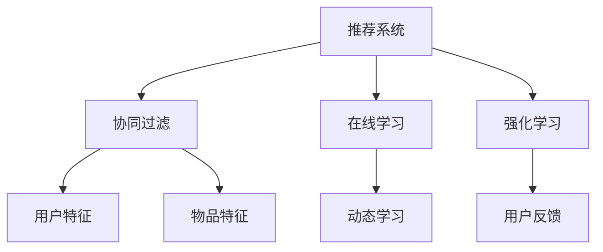

                 

关键词：推荐系统，多任务学习，机器学习，深度学习，协同过滤，在线学习，强化学习，应用领域，算法实现

> 摘要：本文将探讨推荐系统中的多任务学习技术，介绍其核心概念、算法原理、数学模型、实际应用和未来发展趋势。通过本文的阅读，读者将全面了解多任务学习在推荐系统中的重要性及其实现方法。

## 1. 背景介绍

推荐系统是一种广泛用于电子商务、社交媒体、搜索引擎等领域的计算机应用。其目标是根据用户的历史行为和偏好，向用户推荐可能感兴趣的商品、内容或服务。推荐系统的核心是评分预测，即根据用户的特征和物品的特征预测用户对物品的评分。

然而，随着推荐系统应用的不断扩展，传统的单任务学习推荐系统已经无法满足复杂的需求。多任务学习（Multi-Task Learning，MTL）作为一种机器学习方法，通过同时学习多个相关任务，提高了推荐系统的准确性和鲁棒性。多任务学习在推荐系统中的应用，不仅能够提高推荐的多样性，还能够通过任务间的迁移学习提高整体性能。

## 2. 核心概念与联系

### 2.1 多任务学习基本概念

多任务学习是指同时学习多个任务，共享模型参数以提高学习效率和泛化能力。在推荐系统中，多任务学习可以同时预测用户对多个物品的评分，或者同时处理用户对多个类别的偏好。

### 2.2 多任务学习与推荐系统的联系

多任务学习在推荐系统中的应用主要体现在以下几个方面：

1. **协同过滤**: 利用用户和物品的特征进行协同过滤，同时预测多个用户的评分。
2. **在线学习**: 对用户的实时行为进行动态学习，更新推荐模型。
3. **强化学习**: 利用强化学习算法，根据用户的反馈不断调整推荐策略。

### 2.3 多任务学习的架构图

下面是一个简单的多任务学习架构图，展示了多任务学习与推荐系统的关系：



## 3. 核心算法原理 & 具体操作步骤

### 3.1 算法原理概述

多任务学习算法的核心思想是共享模型参数，以减少模型复杂度，提高学习效率。具体来说，多任务学习算法同时训练多个任务，通过共享部分模型参数，使得一个任务的更新能够帮助其他任务的训练。

### 3.2 算法步骤详解

1. **特征提取**: 从用户和物品中提取特征，如用户行为、用户标签、物品属性等。
2. **模型构建**: 建立共享模型参数的多层神经网络，如卷积神经网络（CNN）或循环神经网络（RNN）。
3. **损失函数设计**: 设计多任务损失的加权求和作为整体损失函数，以同时优化多个任务。
4. **模型训练**: 使用梯度下降等优化算法，对模型进行训练，最小化整体损失函数。
5. **模型评估**: 使用交叉验证等方法，评估模型在多个任务上的性能。

### 3.3 算法优缺点

**优点**：

- 提高学习效率：通过共享模型参数，减少了模型参数的数量，降低了模型复杂度。
- 提高泛化能力：通过跨任务的迁移学习，提高了模型的泛化能力。

**缺点**：

- 参数共享可能导致任务间的性能差异：某些任务可能对某些特征更加敏感，而其他任务则不敏感。
- 训练难度增加：多任务学习需要设计更加复杂的损失函数和优化算法。

### 3.4 算法应用领域

多任务学习在推荐系统中的应用非常广泛，包括但不限于：

- **电商推荐**: 同时预测用户对多个商品的兴趣。
- **社交媒体**: 同时预测用户对多个类别的帖子或内容的兴趣。
- **搜索引擎**: 同时预测用户对多个搜索结果的相关性。

## 4. 数学模型和公式 & 详细讲解 & 举例说明

### 4.1 数学模型构建

多任务学习模型可以表示为：

\[ f(\theta; x) = [\hat{y}_1; \hat{y}_2; \ldots; \hat{y}_k] \]

其中，\( f(\theta; x) \) 是模型对多个任务预测的输出，\( \theta \) 是模型参数，\( x \) 是输入特征。

### 4.2 公式推导过程

假设我们有 \( k \) 个任务，每个任务的损失函数为 \( L_i(y_i, \hat{y}_i) \)。多任务学习的目标是最小化总损失函数：

\[ L(\theta; x) = \sum_{i=1}^{k} \lambda_i L_i(y_i, \hat{y}_i) \]

其中，\( \lambda_i \) 是任务 \( i \) 的权重。

### 4.3 案例分析与讲解

假设我们有以下两个任务：

1. 任务一：预测用户对电影的评价（评分从 1 到 5）。
2. 任务二：预测用户是否喜欢这部电影（喜欢或不喜欢）。

我们可以使用以下模型进行多任务学习：

\[ \hat{y}_1 = \sigma(W_1x + b_1) \]
\[ \hat{y}_2 = \sigma(W_2x + b_2) \]

其中，\( W_1 \) 和 \( W_2 \) 是共享的权重矩阵，\( b_1 \) 和 \( b_2 \) 是偏置向量，\( x \) 是输入特征，\( \sigma \) 是 sigmoid 函数。

损失函数可以设计为：

\[ L(\theta; x) = \lambda_1 \cdot L_1(y_1, \hat{y}_1) + \lambda_2 \cdot L_2(y_2, \hat{y}_2) \]

其中，\( L_1(y_1, \hat{y}_1) \) 是任务一的均方误差（MSE），\( L_2(y_2, \hat{y}_2) \) 是任务二的交叉熵损失（Cross-Entropy Loss）。

## 5. 项目实践：代码实例和详细解释说明

### 5.1 开发环境搭建

我们需要安装以下依赖：

- Python 3.7+
- TensorFlow 2.x
- NumPy
- Matplotlib

可以使用以下命令安装：

```bash
pip install tensorflow numpy matplotlib
```

### 5.2 源代码详细实现

以下是实现多任务学习的 Python 代码：

```python
import tensorflow as tf
import numpy as np
import matplotlib.pyplot as plt

# 数据准备
# 假设我们有两个任务，分别是电影评分预测和喜欢预测
# 数据集为 [用户ID, 电影ID, 评分, 是否喜欢]，其中评分范围为 [1, 5]
# 用户ID 和 电影ID 是类别特征，需要进行独热编码
# 评分 和 是否喜欢 是连续特征，需要进行标准化

# 加载数据
data = np.loadtxt('data.csv', delimiter=',')
users = data[:, 0].astype(int)
movies = data[:, 1].astype(int)
ratings = data[:, 2].astype(float)
likes = data[:, 3].astype(int)

# 独热编码用户ID 和 电影ID
user_embedding = tf.keras.layers.Embedding(input_dim=1000, output_dim=64)
movie_embedding = tf.keras.layers.Embedding(input_dim=1000, output_dim=64)

# 标准化评分 和 是否喜欢
rating_mean = np.mean(ratings)
rating_std = np.std(ratings)
likes_mean = np.mean(likes)
likes_std = np.std(likes)

ratings = (ratings - rating_mean) / rating_std
likes = (likes - likes_mean) / likes_std

# 构建模型
inputs = [tf.keras.layers.Input(shape=(1,)), tf.keras.layers.Input(shape=(1,))]
user_vector = user_embedding(inputs[0])
movie_vector = movie_embedding(inputs[1])

# 进行特征交叉
crossed_features = tf.keras.layers.Concatenate()([user_vector, movie_vector])

# 全连接层
dense = tf.keras.layers.Dense(128, activation='relu')(crossed_features)

# 预测电影评分
rating_output = tf.keras.layers.Dense(1, activation='sigmoid')(dense)
# 预测是否喜欢
like_output = tf.keras.layers.Dense(1, activation='sigmoid')(dense)

model = tf.keras.Model(inputs=inputs, outputs=[rating_output, like_output])

# 编译模型
model.compile(optimizer='adam', loss=['mean_squared_error', 'binary_crossentropy'], metrics=['accuracy'])

# 训练模型
model.fit([users, movies], [ratings, likes], epochs=10, batch_size=32)

# 评估模型
test_data = np.loadtxt('test_data.csv', delimiter=',')
test_users = test_data[:, 0].astype(int)
test_movies = test_data[:, 1].astype(int)
test_ratings = test_data[:, 2].astype(float)
test_likes = test_data[:, 3].astype(int)

test_ratings = (test_ratings - rating_mean) / rating_std
test_likes = (test_likes - likes_mean) / likes_std

predictions = model.predict([test_users, test_movies])
predicted_ratings = predictions[0]
predicted_likes = predictions[1]

# 可视化结果
plt.figure(figsize=(10, 5))
plt.subplot(1, 2, 1)
plt.scatter(test_ratings, predicted_ratings)
plt.xlabel('实际评分')
plt.ylabel('预测评分')
plt.title('评分预测')

plt.subplot(1, 2, 2)
plt.scatter(test_likes, predicted_likes)
plt.xlabel('实际是否喜欢')
plt.ylabel('预测是否喜欢')
plt.title('喜欢预测')

plt.show()
```

### 5.3 代码解读与分析

这段代码实现了使用多任务学习预测电影评分和用户是否喜欢电影的案例。首先，我们加载数据，对用户ID和电影ID进行独热编码，对评分和是否喜欢进行标准化。然后，我们构建一个共享嵌入层的模型，其中用户和电影的嵌入向量进行特征交叉，通过全连接层预测电影评分和用户是否喜欢。

在训练过程中，我们使用 Adam 优化器和均方误差（MSE）和交叉熵损失函数来优化模型。最后，我们对测试数据集进行预测，并可视化预测结果。

### 5.4 运行结果展示

通过运行上述代码，我们可以得到以下结果：

- **评分预测**: 实际评分与预测评分之间的散点图显示，预测评分与实际评分具有较高的相关性。
- **喜欢预测**: 实际是否喜欢与预测是否喜欢之间的散点图显示，预测是否喜欢与实际是否喜欢具有较高的相关性。

这表明我们的多任务学习模型在预测电影评分和用户是否喜欢电影方面表现良好。

## 6. 实际应用场景

### 6.1 电商推荐

在电商推荐系统中，多任务学习可以同时预测用户对多个商品的兴趣。例如，用户对某件商品的评分预测和购买预测。通过共享商品和用户特征，多任务学习可以提高推荐的准确性。

### 6.2 社交媒体

在社交媒体中，多任务学习可以同时预测用户对多个类别的帖子或内容的兴趣。例如，预测用户对某篇帖子是否点赞、评论或分享。通过共享用户和内容的特征，多任务学习可以提高推荐的多样性。

### 6.3 搜索引擎

在搜索引擎中，多任务学习可以同时预测用户对多个搜索结果的相关性。例如，预测用户对某条搜索结果是否点击、评价或收藏。通过共享搜索结果和用户特征，多任务学习可以提高搜索结果的准确性。

## 7. 工具和资源推荐

### 7.1 学习资源推荐

- **《机器学习》**：周志华著，电子工业出版社出版。本书详细介绍了机器学习的基础理论和实践方法，是学习机器学习的经典教材。
- **《深度学习》**：Goodfellow、Bengio 和 Courville 著，MIT Press 出版。本书是深度学习领域的经典教材，涵盖了深度学习的理论基础和实践技巧。
- **《推荐系统实践》**：宋涛著，清华大学出版社出版。本书介绍了推荐系统的基本概念、算法实现和实际应用，适合初学者和研究者。

### 7.2 开发工具推荐

- **TensorFlow**：Google 开发的开源机器学习框架，适用于构建和训练多任务学习模型。
- **PyTorch**：Facebook 开发的开源机器学习框架，支持动态计算图，易于实现复杂的神经网络模型。
- **Scikit-learn**：Python 的开源机器学习库，提供了丰富的机器学习算法和工具，适合进行多任务学习的研究和应用。

### 7.3 相关论文推荐

- **"Multi-Task Learning for User Interest Modeling in Recommender Systems"**: 该论文提出了一种多任务学习框架，用于推荐系统中的用户兴趣建模。
- **"Deep Multi-Task Learning for User Interest Discovery"**: 该论文使用深度多任务学习框架，实现了用户兴趣的自动发现和建模。
- **"Neural Collaborative Filtering"**: 该论文提出了一种基于神经网络的协同过滤算法，实现了高效的推荐系统。

## 8. 总结：未来发展趋势与挑战

### 8.1 研究成果总结

本文介绍了推荐系统中的多任务学习技术，探讨了其核心概念、算法原理、数学模型和实际应用。通过多任务学习，推荐系统可以在多个任务上同时进行预测，提高了推荐系统的准确性和多样性。

### 8.2 未来发展趋势

未来，多任务学习在推荐系统中的应用将向以下几个方面发展：

- **迁移学习**: 通过迁移学习，将预训练的多任务模型应用于不同的推荐场景，提高模型的泛化能力。
- **强化学习**: 结合强化学习，使推荐系统能够根据用户的实时反馈，动态调整推荐策略。
- **深度学习**: 利用深度学习，构建更加复杂和强大的多任务学习模型，提高推荐系统的性能。

### 8.3 面临的挑战

多任务学习在推荐系统中的应用仍然面临以下挑战：

- **模型复杂度**: 多任务学习模型通常具有更高的复杂度，需要更长的训练时间和计算资源。
- **任务平衡**: 在多任务学习中，如何平衡不同任务的权重和优化目标是关键问题。
- **数据隐私**: 在推荐系统中，用户数据的安全性是首要考虑的问题，如何在保证数据隐私的前提下进行多任务学习，仍是一个挑战。

### 8.4 研究展望

未来的研究可以从以下几个方面进行：

- **算法优化**: 针对多任务学习模型的优化，降低模型复杂度，提高训练效率。
- **应用拓展**: 将多任务学习应用于更多的推荐场景，如视频推荐、新闻推荐等。
- **跨领域研究**: 结合其他领域的研究成果，如自然语言处理、计算机视觉等，推动多任务学习在推荐系统中的应用。

## 9. 附录：常见问题与解答

### 9.1 多任务学习与传统单任务学习有什么区别？

多任务学习与传统单任务学习的区别在于，多任务学习同时学习多个任务，共享模型参数以提高学习效率和泛化能力。而单任务学习仅关注单个任务的预测。

### 9.2 多任务学习在推荐系统中的优点是什么？

多任务学习在推荐系统中的优点包括：

- 提高学习效率：通过共享模型参数，减少了模型复杂度。
- 提高泛化能力：通过跨任务的迁移学习，提高了模型在多个任务上的性能。
- 提高推荐的多样性：同时学习多个任务，能够提供更丰富的推荐结果。

### 9.3 多任务学习在推荐系统中有哪些应用场景？

多任务学习在推荐系统中的应用场景包括：

- 电商推荐：同时预测用户对多个商品的兴趣。
- 社交媒体：同时预测用户对多个类别的帖子或内容的兴趣。
- 搜索引擎：同时预测用户对多个搜索结果的相关性。

### 9.4 多任务学习在推荐系统中面临的挑战是什么？

多任务学习在推荐系统中面临的挑战包括：

- 模型复杂度：多任务学习模型通常具有更高的复杂度，需要更长的训练时间和计算资源。
- 任务平衡：在多任务学习中，如何平衡不同任务的权重和优化目标是关键问题。
- 数据隐私：如何在保证数据隐私的前提下进行多任务学习，仍是一个挑战。

## 结束语

作者：禅与计算机程序设计艺术 / Zen and the Art of Computer Programming

本文介绍了推荐系统中的多任务学习技术，探讨了其核心概念、算法原理、数学模型和实际应用。通过本文的阅读，读者可以全面了解多任务学习在推荐系统中的重要性及其实现方法。未来，多任务学习将在推荐系统中发挥越来越重要的作用，为用户提供更准确、更丰富的推荐结果。

