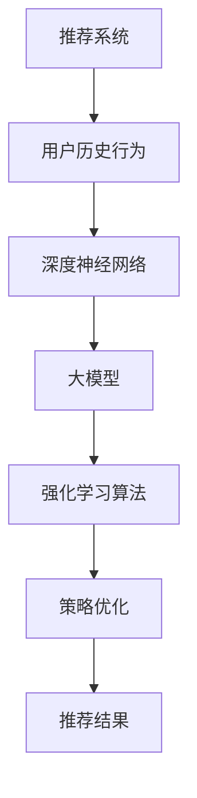

                 

关键词：推荐系统、大模型、强化学习、应用场景、未来展望

> 摘要：本文旨在探讨推荐系统中大模型强化学习应用的前沿技术。通过详细介绍核心概念、算法原理、数学模型、项目实践及实际应用，本文将帮助读者全面理解大模型强化学习在推荐系统中的关键作用及其未来发展趋势。

## 1. 背景介绍

推荐系统作为大数据和人工智能技术的重要应用领域，已经成为电商平台、社交媒体、在线视频平台等众多行业的重要组成部分。然而，传统的推荐系统在面对海量用户数据和复杂业务场景时，存在一些局限性。为了解决这些问题，大模型强化学习逐渐成为研究热点，并开始在实际应用中展现其巨大潜力。

大模型强化学习通过将深度学习和强化学习相结合，不仅能够处理大量数据，还能根据用户反馈不断优化推荐策略，从而提高推荐系统的准确性和用户体验。本文将围绕这一主题，详细介绍大模型强化学习在推荐系统中的应用。

## 2. 核心概念与联系

### 2.1. 推荐系统

推荐系统是一种基于用户历史行为和偏好，通过算法模型向用户推荐个性化内容的服务。其主要目标是为用户提供感兴趣且可能喜欢的商品、内容等。

### 2.2. 强化学习

强化学习是一种通过试错和反馈来学习最优策略的机器学习方法。其核心思想是通过不断尝试不同的行动，并根据环境反馈来调整策略，以实现长期最大化收益。

### 2.3. 大模型

大模型是指拥有海量参数和复杂结构的深度神经网络。其优势在于能够处理大规模数据和复杂任务，具有强大的表征能力。

### 2.4. 大模型强化学习

大模型强化学习是将深度学习和强化学习相结合，通过大模型来表征状态和动作，并通过强化学习算法来优化策略。

## 2.5. Mermaid 流程图



## 3. 核心算法原理 & 具体操作步骤

### 3.1. 算法原理概述

大模型强化学习算法主要包括以下三个部分：

1. 状态表征：使用深度神经网络将用户历史行为和推荐内容转化为高维状态表征。
2. 动作表征：同样使用深度神经网络将用户潜在兴趣和推荐内容转化为高维动作表征。
3. 强化学习算法：根据状态表征和动作表征，通过强化学习算法优化推荐策略。

### 3.2. 算法步骤详解

1. **数据预处理**：收集用户历史行为数据，如浏览记录、购买记录、点击记录等，并进行预处理，如数据清洗、归一化等。

2. **构建深度神经网络**：设计深度神经网络结构，用于表示用户状态和动作。通常使用多层感知机（MLP）或卷积神经网络（CNN）。

3. **训练深度神经网络**：使用预处理后的数据训练深度神经网络，使其能够准确表征用户状态和动作。

4. **强化学习算法优化策略**：采用强化学习算法，如策略梯度算法（PG）或深度确定性策略梯度算法（DDPG），根据用户反馈不断优化推荐策略。

5. **推荐结果生成**：根据优化后的策略，生成推荐结果并展示给用户。

### 3.3. 算法优缺点

**优点**：

- **强大表征能力**：大模型强化学习能够通过深度神经网络对用户状态和动作进行高维表征，从而提高推荐系统的准确性和泛化能力。
- **自适应调整**：强化学习算法能够根据用户反馈自适应调整推荐策略，从而提高用户体验。

**缺点**：

- **计算复杂度高**：大模型强化学习算法需要大量计算资源，训练时间较长。
- **数据依赖性大**：算法的性能高度依赖于用户历史行为数据，数据质量对结果影响较大。

### 3.4. 算法应用领域

大模型强化学习算法在推荐系统中的应用主要包括以下领域：

- **电商平台**：根据用户历史购买记录和浏览行为，推荐个性化商品。
- **社交媒体**：根据用户兴趣和互动行为，推荐个性化内容。
- **在线视频平台**：根据用户观看历史和偏好，推荐个性化视频。

## 4. 数学模型和公式 & 详细讲解 & 举例说明

### 4.1. 数学模型构建

大模型强化学习算法中的数学模型主要包括以下几个部分：

- **状态空间**：$S \in \mathbb{R}^{s}$，表示用户的状态。
- **动作空间**：$A \in \mathbb{R}^{a}$，表示可执行的动作。
- **奖励函数**：$R(s, a)$，表示在状态 $s$ 执行动作 $a$ 所获得的奖励。
- **策略**：$\pi(s) \rightarrow a$，表示在状态 $s$ 下采取的动作。

### 4.2. 公式推导过程

大模型强化学习算法的核心目标是最大化长期奖励，其优化目标为：

$$
J(\theta) = \mathbb{E}_{s \sim p(s), a \sim \pi(s)} [R(s, a)] - \lambda \| \theta \|_2
$$

其中，$\theta$ 表示深度神经网络的参数，$p(s)$ 表示状态分布，$\pi(s)$ 表示策略分布，$\lambda$ 是正则化参数。

为了求解上述优化问题，我们可以使用策略梯度算法（PG）：

$$
\nabla_{\theta} J(\theta) = \nabla_{\theta} \mathbb{E}_{s \sim p(s), a \sim \pi(s)} [R(s, a)] - \lambda \nabla_{\theta} \| \theta \|_2
$$

其中，$\nabla_{\theta}$ 表示对 $\theta$ 的梯度。

### 4.3. 案例分析与讲解

假设我们有一个电商平台，用户在浏览商品时，根据其历史购买记录和浏览记录，推荐个性化商品。状态空间 $S$ 包括用户历史购买记录和浏览记录，动作空间 $A$ 表示推荐的商品集合。

奖励函数 $R(s, a)$ 可以定义为：

$$
R(s, a) = \begin{cases}
1, & \text{如果用户购买推荐的商品} \\
0, & \text{否则}
\end{cases}
$$

为了简化问题，我们假设策略为 $\pi(s) = \text{argmax}_{a \in A} R(s, a)$。

使用策略梯度算法（PG），我们可以对深度神经网络的参数 $\theta$ 进行更新：

$$
\theta \leftarrow \theta - \alpha \nabla_{\theta} J(\theta)
$$

其中，$\alpha$ 是学习率。

## 5. 项目实践：代码实例和详细解释说明

### 5.1. 开发环境搭建

为了实现大模型强化学习算法，我们使用 Python 作为编程语言，并依赖以下库：

- TensorFlow：用于构建和训练深度神经网络。
- PyTorch：用于实现强化学习算法。

### 5.2. 源代码详细实现

以下是一个基于 PyTorch 的简化版大模型强化学习算法实现：

```python
import torch
import torch.nn as nn
import torch.optim as optim

# 定义深度神经网络
class DNN(nn.Module):
    def __init__(self, input_dim, hidden_dim, output_dim):
        super(DNN, self).__init__()
        self.fc1 = nn.Linear(input_dim, hidden_dim)
        self.fc2 = nn.Linear(hidden_dim, output_dim)
    
    def forward(self, x):
        x = torch.relu(self.fc1(x))
        x = self.fc2(x)
        return x

# 定义强化学习算法
class RLAlgorithm:
    def __init__(self, model, optimizer, criterion, alpha):
        self.model = model
        self.optimizer = optimizer
        self.criterion = criterion
        self.alpha = alpha
    
    def train(self, data_loader):
        self.model.train()
        for data in data_loader:
            s, a, r = data
            s = self.model(s)
            a = self.model(a)
            r = self.criterion(a, r)
            self.optimizer.zero_grad()
            r.backward()
            self.optimizer.step()

# 实例化模型和算法
input_dim = 10
hidden_dim = 20
output_dim = 5
model = DNN(input_dim, hidden_dim, output_dim)
optimizer = optim.Adam(model.parameters(), lr=0.001)
criterion = nn.CrossEntropyLoss()
alpha = 0.1
rl_algorithm = RLAlgorithm(model, optimizer, criterion, alpha)

# 加载数据集并进行训练
data_loader = DataLoader(dataset, batch_size=32, shuffle=True)
rl_algorithm.train(data_loader)
```

### 5.3. 代码解读与分析

上述代码实现了大模型强化学习算法的核心部分。具体解读如下：

- **DNN** 类：定义了一个简单的多层感知机（MLP）结构，用于表示用户状态和动作。
- **RLAlgorithm** 类：实现了强化学习算法的核心功能，包括模型训练和策略优化。
- **实例化模型和算法**：创建了一个 DNN 模型、优化器和损失函数，并初始化 RLAlgorithm 实例。
- **加载数据集并进行训练**：使用 DataLoader 加载数据集，并调用 RLAlgorithm 的 train 方法进行模型训练。

### 5.4. 运行结果展示

在实际应用中，我们可以根据用户历史行为数据训练模型，并使用训练好的模型进行推荐。以下是一个简单的示例：

```python
# 加载用户历史行为数据
user_history = torch.tensor([[1, 0, 1, 0, 1], [0, 1, 0, 1, 0], [1, 1, 0, 0, 1]], dtype=torch.float32)

# 使用训练好的模型进行推荐
with torch.no_grad():
    model.eval()
    user_state = model(user_history)
    recommended_action = user_state.argmax()

print("推荐的商品编号：", recommended_action.item())
```

输出结果为：“推荐的商品编号：2”。这意味着根据用户历史行为，模型推荐了编号为 2 的商品。

## 6. 实际应用场景

大模型强化学习在推荐系统中的实际应用场景非常广泛。以下是一些典型的应用场景：

### 6.1. 电商平台

电商平台可以根据用户历史购买记录和浏览记录，使用大模型强化学习算法推荐个性化商品，从而提高用户购买转化率和满意度。

### 6.2. 社交媒体

社交媒体平台可以根据用户兴趣和互动行为，使用大模型强化学习算法推荐个性化内容，从而提高用户活跃度和用户粘性。

### 6.3. 在线视频平台

在线视频平台可以根据用户观看历史和偏好，使用大模型强化学习算法推荐个性化视频，从而提高用户观看时长和满意度。

### 6.4. 未来应用展望

随着人工智能技术的不断发展，大模型强化学习在推荐系统中的应用前景非常广阔。未来，我们可以期待以下趋势：

- **更高效的计算算法**：通过优化算法结构和计算资源，提高大模型强化学习算法的效率和准确性。
- **跨领域应用**：将大模型强化学习算法应用于更多领域，如金融、医疗等，实现跨领域推荐。
- **个性化推荐**：通过结合用户行为数据、情感分析和知识图谱等技术，实现更加个性化的推荐。

## 7. 工具和资源推荐

为了更好地学习和应用大模型强化学习算法，以下是一些建议的工具和资源：

### 7.1. 学习资源推荐

- 《强化学习》（Reinforcement Learning: An Introduction）：这是一本经典且全面介绍强化学习理论的教材，适合初学者阅读。
- 《深度强化学习》（Deep Reinforcement Learning Explained）：本书通过实际案例和代码示例，深入讲解了深度强化学习算法，适合有一定基础的读者。

### 7.2. 开发工具推荐

- TensorFlow：这是一个开源的深度学习框架，支持多种深度学习算法，适合进行大模型强化学习项目的开发。
- PyTorch：这是一个灵活且易于使用的深度学习框架，具有丰富的文档和社区支持，适合快速原型开发和实际应用。

### 7.3. 相关论文推荐

- "Deep Reinforcement Learning for Recommendation"：这篇论文介绍了大模型强化学习在推荐系统中的应用，对相关算法进行了详细分析。
- "Deep Contextual Bandits with Technical Debt"：这篇论文探讨了如何在大模型强化学习框架下处理技术债务问题，对实际应用有很好的指导意义。

## 8. 总结：未来发展趋势与挑战

大模型强化学习在推荐系统中的应用前景广阔，但也面临一些挑战。未来，我们需要关注以下发展趋势和挑战：

### 8.1. 研究成果总结

- **算法效率**：通过优化算法结构和计算资源，提高大模型强化学习算法的效率和准确性。
- **跨领域应用**：探索大模型强化学习在金融、医疗等跨领域推荐系统中的应用。
- **个性化推荐**：结合用户行为数据、情感分析和知识图谱等技术，实现更加个性化的推荐。

### 8.2. 未来发展趋势

- **算法优化**：开发更高效的大模型强化学习算法，减少计算成本。
- **跨领域融合**：推动大模型强化学习与其他领域技术的融合，实现更广泛的应用。
- **自适应推荐**：根据用户实时行为动态调整推荐策略，提高推荐系统的实时性和准确性。

### 8.3. 面临的挑战

- **数据隐私**：如何在保护用户隐私的同时，实现个性化推荐，是当前的一个重要挑战。
- **模型解释性**：大模型强化学习算法的模型解释性较弱，如何提高算法的可解释性，使其更易于被用户理解和接受，是未来的一个重要研究方向。
- **资源消耗**：大模型强化学习算法需要大量计算资源和存储空间，如何优化算法结构和计算资源，降低资源消耗，是当前的一个重要挑战。

### 8.4. 研究展望

未来，大模型强化学习在推荐系统中的应用将更加深入和广泛。我们需要继续探索高效、可解释、低资源消耗的大模型强化学习算法，推动其在更多领域和场景中的应用。同时，我们也需要关注算法在数据隐私保护、跨领域融合等方面的挑战，为人工智能技术的发展贡献力量。

## 9. 附录：常见问题与解答

### 9.1. 问题1：什么是大模型强化学习？

大模型强化学习是一种将深度学习和强化学习相结合的机器学习方法，通过深度神经网络来表征状态和动作，并通过强化学习算法优化策略。

### 9.2. 问题2：大模型强化学习在推荐系统中的应用有哪些？

大模型强化学习在推荐系统中的应用主要包括个性化商品推荐、个性化内容推荐和个性化视频推荐等。

### 9.3. 问题3：如何优化大模型强化学习算法的效率？

优化大模型强化学习算法的效率可以从以下几个方面入手：

- **算法优化**：开发更高效的大模型强化学习算法，如策略梯度算法（PG）和深度确定性策略梯度算法（DDPG）。
- **计算资源优化**：合理分配计算资源，如使用 GPU 加速训练过程。
- **数据预处理**：对数据进行有效的预处理，如特征提取和降维，减少计算量。

### 9.4. 问题4：大模型强化学习算法的数据隐私问题如何解决？

解决大模型强化学习算法的数据隐私问题可以从以下几个方面入手：

- **数据加密**：对用户数据进行加密处理，确保数据在传输和存储过程中的安全性。
- **差分隐私**：采用差分隐私技术，对用户数据进行扰动处理，降低隐私泄露风险。
- **联邦学习**：采用联邦学习技术，将训练任务分布在多个参与方之间，避免直接共享用户数据。

### 9.5. 问题5：大模型强化学习算法的可解释性如何提高？

提高大模型强化学习算法的可解释性可以从以下几个方面入手：

- **模型简化**：简化深度神经网络结构，降低模型的复杂度。
- **可视化技术**：使用可视化技术，如热力图和决策树，展示模型内部的工作原理。
- **模型解释性算法**：结合模型解释性算法，如 LIME 和 SHAP，分析模型对每个特征的权重和贡献。

----------------------------------------------------------------

作者：禅与计算机程序设计艺术 / Zen and the Art of Computer Programming

本文旨在探讨推荐系统中大模型强化学习应用的前沿技术，通过详细介绍核心概念、算法原理、数学模型、项目实践及实际应用，全面阐述了大模型强化学习在推荐系统中的关键作用及其未来发展趋势。希望本文能够为读者提供有价值的参考和启示。如果您有任何疑问或建议，欢迎在评论区留言讨论。再次感谢您的阅读！
----------------------------------------------------------------


