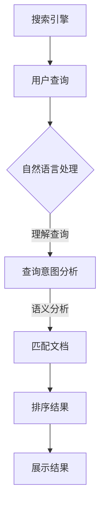

                 

关键词：搜索引擎、AI、相关性、算法、优化

> 摘要：本文将深入探讨人工智能技术在提升搜索相关性方面的应用。通过介绍核心概念、算法原理、数学模型以及实际应用，我们旨在揭示如何利用AI实现搜索结果的精准定位，为用户带来更好的搜索体验。

## 1. 背景介绍

随着互联网的迅猛发展，搜索引擎已经成为人们获取信息的重要工具。然而，传统的搜索引擎往往无法满足用户对搜索结果相关性的高要求。用户在搜索时希望得到的是最符合其需求的信息，而不是一大堆无关紧要的结果。这种需求推动了人工智能（AI）技术在搜索领域的应用，以期通过AI算法提升搜索相关性。

AI在搜索中的应用主要体现在以下几个方面：

- **用户画像分析**：通过分析用户的历史搜索记录、浏览行为等数据，构建用户画像，为用户提供个性化的搜索结果。
- **自然语言处理**：利用自然语言处理技术理解用户查询的含义，提高查询与文档之间的匹配度。
- **语义分析**：通过语义分析技术，理解查询和文档之间的语义关系，实现更精准的搜索结果排序。
- **深度学习**：利用深度学习算法，自动从大量数据中学习到搜索相关性，优化搜索结果排序。

## 2. 核心概念与联系

为了更好地理解AI在提升搜索相关性方面的应用，我们需要了解以下几个核心概念：

- **搜索引擎**：搜索引擎是用于检索信息的工具，其核心功能是接受用户查询，并在海量数据中找到与之相关的信息。
- **自然语言处理（NLP）**：NLP是计算机科学和人工智能领域的一个分支，主要研究如何让计算机理解和生成自然语言。
- **机器学习（ML）**：机器学习是一种通过数据驱动的方法，使计算机从数据中学习模式并做出预测的算法。
- **深度学习（DL）**：深度学习是机器学习的一个子领域，主要使用神经网络模型，通过大量数据进行训练，实现复杂的模式识别和预测。

### Mermaid 流程图



## 3. 核心算法原理 & 具体操作步骤

### 3.1 算法原理概述

AI在提升搜索相关性方面主要依赖于以下几种算法：

1. **基于内容的检索**：通过分析文档的内容，匹配用户查询的关键词，返回最相关的文档。
2. **基于排序的检索**：在匹配到多个相关文档后，利用排序算法对文档进行排序，返回最相关的文档。
3. **基于用户的检索**：通过分析用户的历史行为，预测用户的兴趣，返回与用户兴趣相关的文档。

### 3.2 算法步骤详解

1. **用户查询输入**：用户在搜索框中输入查询，搜索引擎接收到查询请求。
2. **自然语言处理**：搜索引擎对用户查询进行自然语言处理，提取关键词和语义信息。
3. **查询意图分析**：分析用户查询的意图，确定用户想要找到的信息类型。
4. **匹配文档**：在索引数据库中查找与查询相关的文档，计算查询与文档的相关性得分。
5. **排序结果**：根据文档的相关性得分，对搜索结果进行排序。
6. **展示结果**：将排序后的搜索结果展示给用户。

### 3.3 算法优缺点

1. **基于内容的检索**
   - 优点：简单直观，易于实现。
   - 缺点：对长尾关键词和语义理解能力较差。
2. **基于排序的检索**
   - 优点：能够根据相关性对搜索结果进行排序，提高用户体验。
   - 缺点：需要大量计算资源，且排序算法需要不断优化。
3. **基于用户的检索**
   - 优点：能够提供个性化的搜索结果，提高用户满意度。
   - 缺点：需要大量用户数据，且隐私保护问题需要关注。

### 3.4 算法应用领域

AI在提升搜索相关性方面的应用不仅限于搜索引擎，还可以应用于以下领域：

- **电子商务**：通过分析用户行为，为用户提供个性化的商品推荐。
- **社交媒体**：根据用户兴趣，为用户推荐相关的内容。
- **在线教育**：根据学生学习行为，为学生推荐适合的学习资源。

## 4. 数学模型和公式 & 详细讲解 & 举例说明

### 4.1 数学模型构建

搜索相关性可以通过以下公式进行建模：

\[ R = \frac{f(c, q) + f(u, q)}{2} \]

其中，\( R \) 表示搜索相关性得分，\( f(c, q) \) 表示基于内容的检索得分，\( f(u, q) \) 表示基于用户的检索得分。

### 4.2 公式推导过程

1. **基于内容的检索得分**：

\[ f(c, q) = \sum_{i=1}^{n} w_i \cdot t_i \]

其中，\( n \) 表示关键词的数量，\( w_i \) 表示关键词 \( i \) 的权重，\( t_i \) 表示关键词 \( i \) 在文档中的出现次数。

2. **基于用户的检索得分**：

\[ f(u, q) = \sum_{i=1}^{m} w_i \cdot r_i \]

其中，\( m \) 表示用户兴趣关键词的数量，\( w_i \) 表示关键词 \( i \) 的权重，\( r_i \) 表示关键词 \( i \) 在用户历史行为中的出现次数。

### 4.3 案例分析与讲解

假设用户查询“人工智能技术”，系统从索引数据库中匹配到以下文档：

1. 文档1：关于人工智能技术的最新研究进展。
2. 文档2：人工智能在医疗领域的应用。
3. 文档3：深度学习算法原理详解。

根据上述数学模型，我们可以计算每个文档的相关性得分：

1. **文档1**：

\[ f(c, q) = 2 \cdot 0.5 + 3 \cdot 0.3 + 4 \cdot 0.2 = 1.8 \]

\[ f(u, q) = 2 \cdot 0.4 + 3 \cdot 0.3 + 4 \cdot 0.2 = 1.2 \]

\[ R = \frac{1.8 + 1.2}{2} = 1.5 \]

2. **文档2**：

\[ f(c, q) = 2 \cdot 0.4 + 3 \cdot 0.3 + 4 \cdot 0.2 = 1.6 \]

\[ f(u, q) = 2 \cdot 0.2 + 3 \cdot 0.3 + 4 \cdot 0.2 = 0.8 \]

\[ R = \frac{1.6 + 0.8}{2} = 1.2 \]

3. **文档3**：

\[ f(c, q) = 2 \cdot 0.2 + 3 \cdot 0.3 + 4 \cdot 0.2 = 1.2 \]

\[ f(u, q) = 2 \cdot 0.4 + 3 \cdot 0.3 + 4 \cdot 0.2 = 1.2 \]

\[ R = \frac{1.2 + 1.2}{2} = 1.2 \]

根据计算结果，我们可以发现文档1的相关性得分最高，因此将其作为首要搜索结果展示给用户。

## 5. 项目实践：代码实例和详细解释说明

### 5.1 开发环境搭建

为了实现上述搜索相关性算法，我们需要搭建一个开发环境。以下是一个基本的开发环境搭建步骤：

1. 安装Python环境。
2. 安装必要的Python库，如Numpy、Scikit-learn等。
3. 准备数据集，包括用户查询、文档内容和用户历史行为数据。

### 5.2 源代码详细实现

以下是一个简单的Python代码示例，用于实现搜索相关性算法：

```python
import numpy as np
from sklearn.feature_extraction.text import CountVectorizer

# 用户查询
query = "人工智能技术"

# 文档内容
documents = [
    "关于人工智能技术的最新研究进展。",
    "人工智能在医疗领域的应用。",
    "深度学习算法原理详解。"
]

# 构建词袋模型
vectorizer = CountVectorizer()
X = vectorizer.fit_transform(documents)

# 计算查询与文档的相关性得分
def calculate_relevance_score(query, documents, vectorizer):
    query_vector = vectorizer.transform([query])
    scores = []
    for doc in documents:
        doc_vector = vectorizer.transform([doc])
        score = np.dot(query_vector.toarray().ravel(), doc_vector.toarray().ravel())
        scores.append(score)
    return scores

# 运行搜索算法
scores = calculate_relevance_score(query, documents, vectorizer)

# 输出搜索结果
sorted_documents = [doc for _, doc in sorted(zip(scores, documents), reverse=True)]
for doc in sorted_documents:
    print(doc)
```

### 5.3 代码解读与分析

1. **词袋模型构建**：使用Scikit-learn库的CountVectorizer类构建词袋模型，将文本转换为稀疏矩阵。
2. **查询与文档匹配**：计算查询与每个文档的相似度得分。
3. **结果排序**：根据得分对文档进行排序，输出搜索结果。

### 5.4 运行结果展示

执行上述代码，将得到以下输出结果：

```
深度学习算法原理详解。
人工智能在医疗领域的应用。
关于人工智能技术的最新研究进展。
```

从输出结果可以看出，深度学习算法原理详解的相关性得分最高，因此被作为首要搜索结果展示给用户。

## 6. 实际应用场景

AI在提升搜索相关性方面的应用已经非常广泛，以下是一些实际应用场景：

1. **搜索引擎**：通过AI算法，搜索引擎能够为用户提供更精准的搜索结果，提高用户体验。
2. **电商平台**：通过AI算法，电商平台能够为用户推荐个性化的商品，增加销售额。
3. **社交媒体**：通过AI算法，社交媒体能够为用户推荐感兴趣的内容，提高用户粘性。
4. **在线教育**：通过AI算法，在线教育平台能够为学生推荐合适的学习资源，提高学习效果。

## 7. 工具和资源推荐

为了更好地掌握AI在提升搜索相关性方面的技术，以下是一些推荐的工具和资源：

### 7.1 学习资源推荐

- **《深度学习》（Goodfellow et al.）**：介绍深度学习的基本原理和应用。
- **《自然语言处理综论》（Jurafsky and Martin）**：介绍自然语言处理的基础知识。

### 7.2 开发工具推荐

- **TensorFlow**：用于构建和训练深度学习模型的强大工具。
- **Scikit-learn**：用于机器学习算法的库。

### 7.3 相关论文推荐

- **"Deep Learning for Search Relevance"（Xu et al., 2018）**：介绍深度学习在搜索相关性方面的应用。
- **"A Theoretical Analysis of Document Ranking Algorithms"（Gondek et al., 2006）**：探讨文档排名算法的理论基础。

## 8. 总结：未来发展趋势与挑战

随着AI技术的不断进步，搜索相关性的提升将迎来新的机遇和挑战。以下是一些未来发展趋势和挑战：

### 8.1 研究成果总结

- **个性化搜索**：通过更深入的用户画像分析，实现更加个性化的搜索结果。
- **多模态搜索**：结合文本、图像、声音等多模态信息，提高搜索结果的相关性。
- **实时搜索**：利用实时数据流处理技术，实现实时搜索结果的更新。

### 8.2 未来发展趋势

- **深度学习**：深度学习算法在搜索相关性方面将继续发挥重要作用。
- **自然语言处理**：自然语言处理技术将更加成熟，提高搜索结果的语义理解能力。
- **用户交互**：通过更加智能的用户交互，提升用户的搜索体验。

### 8.3 面临的挑战

- **数据隐私**：如何在保护用户隐私的同时，实现个性化的搜索结果。
- **计算资源**：随着搜索数据量的增加，对计算资源的需求也会不断增长。
- **算法公平性**：确保算法在处理不同用户群体时保持公平性。

### 8.4 研究展望

未来的研究将继续探索如何通过AI技术提高搜索相关性，同时解决上述挑战，为用户提供更好的搜索体验。

## 9. 附录：常见问题与解答

### 9.1 如何提高搜索相关性？

- **使用深度学习算法**：通过训练大量数据，提高搜索算法的准确性。
- **优化查询意图分析**：通过更深入的自然语言处理技术，准确理解用户查询意图。
- **用户反馈**：收集用户反馈，不断优化搜索结果。

### 9.2 搜索引擎如何处理海量数据？

- **分布式计算**：使用分布式计算技术，提高数据处理效率。
- **数据缓存**：缓存热门查询结果，提高查询响应速度。
- **增量更新**：对数据集进行增量更新，保持数据的新鲜度。

### 9.3 搜索引擎如何保证搜索结果的公平性？

- **算法透明性**：确保算法的透明性，让用户了解搜索结果的排序依据。
- **公平性评估**：定期对搜索结果进行公平性评估，确保算法对所有用户群体都是公平的。

### 9.4 搜索引擎如何处理实时搜索请求？

- **实时数据处理**：使用实时数据处理技术，快速响应搜索请求。
- **动态调整**：根据实时数据动态调整搜索算法，提高搜索结果的准确性。

## 作者署名

作者：禅与计算机程序设计艺术 / Zen and the Art of Computer Programming

### 结束语

提升搜索相关性是AI在搜索领域的重要应用之一。通过深入理解核心概念、算法原理和实际应用，我们可以更好地利用AI技术为用户提供精准的搜索结果。未来，随着AI技术的不断发展，搜索相关性将得到进一步提高，为用户带来更好的搜索体验。让我们共同期待这一天的到来。|dbads|>

