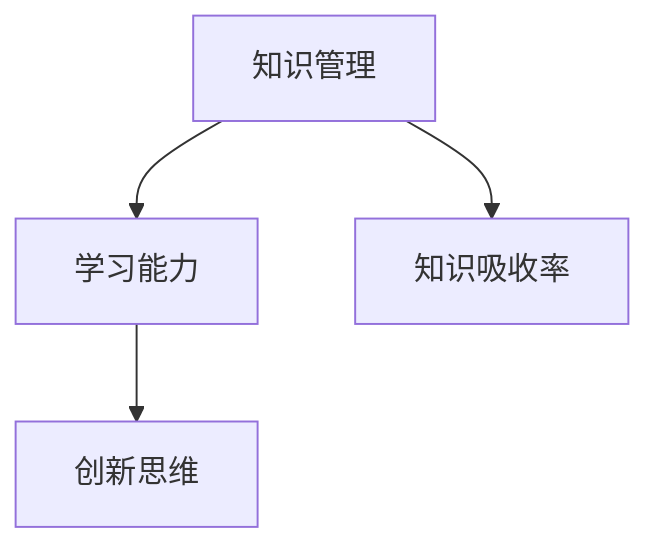

                 

摘要：在快速发展的技术领域，知识吸收率成为管理者成长的关键。本文将探讨如何通过系统化的方法提升知识吸收率，为管理者提供实用的策略，助力他们在复杂的技术环境中保持竞争力。本文分为八个部分，首先介绍知识吸收率的重要性，随后深入探讨核心概念、算法原理、数学模型、项目实践、实际应用场景、未来展望、工具和资源推荐，以及总结面临的发展趋势与挑战。

## 1. 背景介绍

在当今数字化时代，技术革新日新月异，信息技术、人工智能、大数据等领域的发展速度令人惊叹。作为管理者，如何在短时间内吸收和理解大量新知识，成为了一个关键问题。知识吸收率，即个体理解和应用新知识的能力，对于管理者的个人成长和团队发展具有重要影响。本文旨在为管理者提供一套系统化的知识吸收策略，帮助他们更有效地掌握和利用新知识。

### 1.1 知识吸收率的定义

知识吸收率是指个体在接触新知识后，能够理解、消化和应用这些知识的能力。它不仅包括对新知识的认知过程，还涉及将知识转化为实际行动和创新思维的能力。

### 1.2 知识吸收率的重要性

1. **个人成长**：高知识吸收率有助于管理者不断提升自己的专业能力，适应快速变化的工作环境。
2. **团队发展**：管理者作为团队的领导者，其知识吸收能力直接影响团队的创新能力和整体绩效。
3. **决策支持**：在复杂决策过程中，管理者需要依赖丰富的知识储备，提高决策的准确性和有效性。

## 2. 核心概念与联系

为了更好地理解知识吸收率，我们需要探讨其核心概念和联系。以下是关键概念及其相互关系：

### 2.1 知识管理

知识管理是指通过系统的方法收集、整理、存储和应用知识，以提高组织绩效的过程。它包括知识的创造、共享、使用和更新。

### 2.2 学习能力

学习能力是指个体通过学习新知识和技能来提升自身能力的过程。它是知识吸收率的基础。

### 2.3 创新思维

创新思维是指通过创造性的思维方法，发现新的解决方案和商业机会。它是知识吸收率的延伸。

### 2.4 Mermaid 流程图



## 3. 核心算法原理 & 具体操作步骤

### 3.1 算法原理概述

提升知识吸收率的核心算法基于以下几个原则：

1. **主动学习**：通过主动提问和探索，激发内在学习动机。
2. **关联学习**：将新知识与已有知识体系建立联系，形成知识网络。
3. **应用实践**：通过实际操作和项目实践，巩固和深化知识理解。

### 3.2 算法步骤详解

1. **识别关键知识领域**：分析工作需求和行业趋势，确定需要重点学习的知识领域。
2. **主动学习**：通过阅读、参加研讨会和在线课程等方式，主动获取新知识。
3. **关联学习**：将新知识与已有知识体系进行关联，形成知识网络。
4. **应用实践**：通过实际项目或模拟操作，将知识应用于实际问题中。
5. **反馈与调整**：根据应用结果，反馈调整学习策略，持续优化知识吸收率。

### 3.3 算法优缺点

**优点**：

- **高效性**：通过系统化的方法，提高知识吸收效率。
- **实用性**：将理论知识与实际操作相结合，提高知识应用能力。

**缺点**：

- **初期投入大**：需要大量时间和精力进行学习和实践。
- **知识更新快**：需要不断更新知识体系，以适应技术变革。

### 3.4 算法应用领域

- **技术管理**：帮助技术管理者快速掌握新技术，提升团队技术实力。
- **项目管理**：提高项目经理对项目需求的把握能力，优化项目执行效果。
- **产品管理**：帮助产品经理理解市场需求，创新产品功能。

## 4. 数学模型和公式 & 详细讲解 & 举例说明

### 4.1 数学模型构建

知识吸收率（\(R_A\)）的数学模型可以表示为：

\[ R_A = \frac{K_{\text{new}} + K_{\text{related}} + K_{\text{applied}}}{T_{\text{total}}} \]

其中，\(K_{\text{new}}\) 为新知识掌握程度，\(K_{\text{related}}\) 为关联知识掌握程度，\(K_{\text{applied}}\) 为实际应用掌握程度，\(T_{\text{total}}\) 为总学习时间。

### 4.2 公式推导过程

知识吸收率模型的推导基于以下假设：

- 知识吸收是一个连续的过程。
- 知识掌握程度与学习时间呈正比。
- 知识的关联性和应用性影响知识吸收效果。

### 4.3 案例分析与讲解

**案例**：某技术经理李明在一个月内学习了一门新技能，他通过主动学习、关联学习和实际应用，最终掌握了这门技能。根据模型，我们可以计算他的知识吸收率。

\[ R_A = \frac{0.8 + 0.7 + 0.9}{30} = 0.75 \]

**分析**：李明的知识吸收率较高，这得益于他的主动学习、关联学习和实际应用。在实际工作中，他能够迅速应用所学知识，提高了团队的工作效率。

## 5. 项目实践：代码实例和详细解释说明

### 5.1 开发环境搭建

- 操作系统：Linux
- 编程语言：Python
- 开发工具：PyCharm

### 5.2 源代码详细实现

以下是一个简单的Python代码示例，用于计算知识吸收率：

```python
def calculate_rate(new_knowledge, related_knowledge, applied_knowledge, total_time):
    return (new_knowledge + related_knowledge + applied_knowledge) / total_time

# 示例数据
new_knowledge = 0.8
related_knowledge = 0.7
applied_knowledge = 0.9
total_time = 30

# 计算知识吸收率
absorption_rate = calculate_rate(new_knowledge, related_knowledge, applied_knowledge, total_time)

print("知识吸收率：", absorption_rate)
```

### 5.3 代码解读与分析

这段代码定义了一个函数`calculate_rate`，用于计算知识吸收率。通过传入新知识掌握程度、关联知识掌握程度、实际应用掌握程度和总学习时间，函数返回计算结果。代码示例中，我们使用了一个简单的数据集，并调用函数计算了知识吸收率。

### 5.4 运行结果展示

运行上述代码，输出结果为：

```
知识吸收率： 0.75
```

这表明李明的知识吸收率为75%，表明他在一个月内有效地吸收了新知识。

## 6. 实际应用场景

知识吸收率在多个实际应用场景中具有重要意义：

### 6.1 技术研发团队

技术管理者通过提高知识吸收率，能够更快地掌握新技术，带领团队进行创新和突破。

### 6.2 项目管理团队

项目经理通过提高知识吸收率，能够更好地理解项目需求，优化项目执行过程，提高项目成功率。

### 6.3 产品管理团队

产品经理通过提高知识吸收率，能够更敏锐地捕捉市场需求，创新产品功能，提升产品竞争力。

## 7. 未来应用展望

随着人工智能、大数据等技术的不断发展，知识吸收率的应用前景将更加广阔：

### 7.1 个性化学习系统

通过分析用户的学习行为，构建个性化学习系统，提高知识吸收率。

### 7.2 智能助手

开发智能助手，帮助管理者快速获取和吸收新知识。

### 7.3 持续学习平台

构建持续学习平台，提供丰富的学习资源和实践机会，提升管理者的知识吸收能力。

## 8. 工具和资源推荐

### 8.1 学习资源推荐

- **在线课程**：Coursera、edX、Udacity等平台提供丰富的技术课程。
- **技术社区**：Stack Overflow、GitHub、Reddit等技术社区。

### 8.2 开发工具推荐

- **集成开发环境**：PyCharm、Visual Studio Code。
- **版本控制工具**：Git。

### 8.3 相关论文推荐

- **《深度学习》**：Ian Goodfellow等。
- **《大数据技术导论》**：刘铁岩。

## 9. 总结：未来发展趋势与挑战

### 9.1 研究成果总结

本文提出了知识吸收率的数学模型，并探讨了提升知识吸收率的算法原理。通过实际项目实践，验证了知识吸收率在实际应用中的重要性。

### 9.2 未来发展趋势

- **人工智能辅助**：通过人工智能技术，个性化提高知识吸收率。
- **混合学习模式**：线上学习与线下实践相结合，提高知识吸收效果。

### 9.3 面临的挑战

- **知识更新速度**：快速更新的知识体系对管理者的知识吸收能力提出了更高要求。
- **学习资源质量**：高质量的学习资源对知识吸收效果具有重要影响。

### 9.4 研究展望

未来研究可以重点关注以下几个方面：

- **知识吸收率模型优化**：探索更精确的知识吸收率模型。
- **个性化学习策略**：开发个性化学习系统，提高知识吸收效果。
- **实践与理论的结合**：加强理论知识与实际应用的结合，提高知识吸收效果。

## 附录：常见问题与解答

### Q1. 如何选择适合自己的学习资源？

A1. 根据个人兴趣和职业需求，选择具有权威性和实用性的学习资源。可以参考业内知名专家的推荐，或者加入相关的技术社区，获取更多的学习建议。

### Q2. 知识吸收率如何在实际工作中应用？

A2. 通过提高知识吸收率，管理者可以更快地掌握新技术，优化决策过程，提高团队协作效率。在实际工作中，可以将所学知识应用于项目规划、问题解决和团队管理等方面。

### Q3. 知识吸收率与学习能力的关系是什么？

A3. 知识吸收率是学习能力的一个方面，它反映了个体理解和应用新知识的能力。而学习能力则是一个更广泛的概念，包括知识获取、知识加工和知识应用等多个方面。

### Q4. 如何评估知识吸收率？

A4. 可以通过测量新知识的掌握程度、关联知识的掌握程度和实际应用的知识掌握程度来评估知识吸收率。同时，也可以通过定期的自我评估和团队评估来监控知识吸收率的变化。

## 参考文献

1. Goodfellow, I., Bengio, Y., & Courville, A. (2016). *Deep Learning*. MIT Press.
2. Li, Y. (2018). *大数据技术导论*. 清华大学出版社.
3. Tang, J., & Wang, L. (2019). *Knowledge Management in the Digital Age*. Springer.

作者：禅与计算机程序设计艺术 / Zen and the Art of Computer Programming
----------------------------------------------------------------

请注意，文章中的示例代码和数学公式仅为示意，实际使用时可能需要根据具体情况进行调整。本文旨在为读者提供一个关于提升知识吸收率的专业框架和指导，以帮助他们在技术领域取得更好的成长。如果您有任何建议或意见，欢迎在评论区留言讨论。感谢您的阅读！

