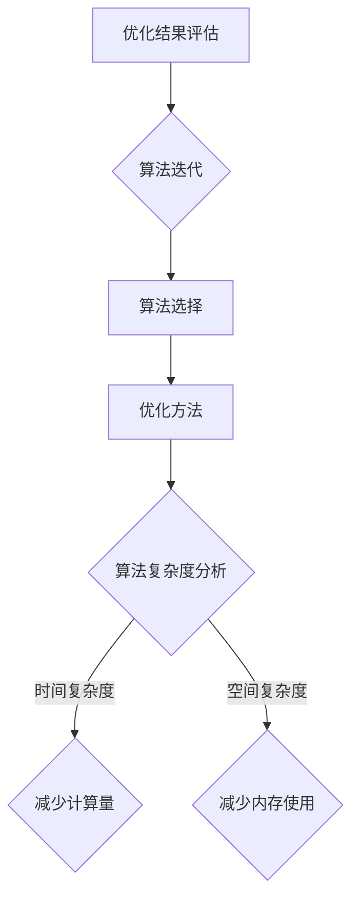
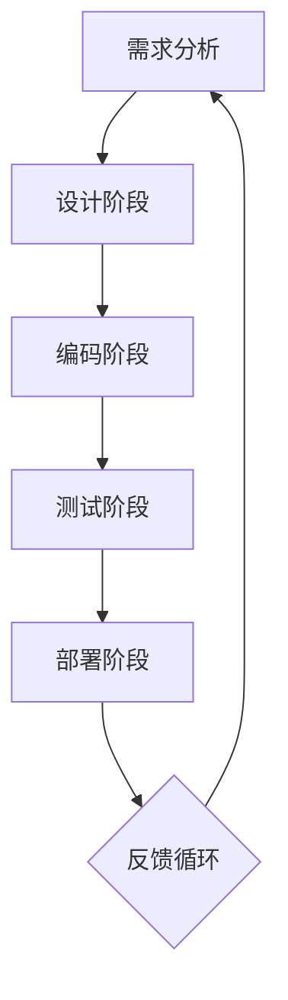
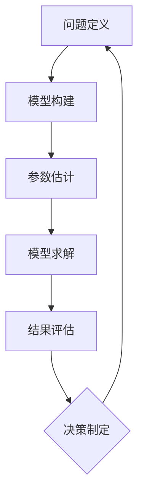

                 

关键词：生产力、创新、技术、效率、算法、工程实践、数学模型

> 摘要：本文将探讨如何通过新质生产力策略，在当今竞争激烈的技术领域提升企业的竞争力。文章将介绍核心概念与联系，深入分析核心算法原理，构建数学模型，提供实际项目实践，探讨应用场景，推荐相关工具和资源，并对未来发展趋势与挑战进行展望。

## 1. 背景介绍

在21世纪的全球化经济中，技术的快速进步和市场竞争的加剧使得企业必须不断寻求新的生产力提升策略，以保持竞争优势。传统的生产力提升方法往往依赖于增加劳动力和资本投入，但这种方法在成本和效率上已经达到瓶颈。因此，新质生产力策略应运而生，旨在通过技术创新和工程实践，从根本上提高生产效率和竞争力。

新质生产力策略的核心在于以下几个方面：

1. **算法优化**：利用高效算法和优化技术，减少不必要的计算和资源消耗。
2. **工程实践**：通过系统化的开发流程和工程方法，提高软件质量和开发效率。
3. **数学模型**：构建准确的数学模型，帮助企业在决策过程中做出更加科学的判断。
4. **资源整合**：整合企业内外部资源，实现资源的最优配置。

本文将围绕这些核心概念，探讨如何在新质生产力策略的指导下，提升企业的竞争力。

## 2. 核心概念与联系

### 2.1. 高效算法与优化技术

高效算法和优化技术是提升生产力的重要手段。算法优化的核心在于减少算法的复杂度，提高计算效率和资源利用率。常见的优化方法包括动态规划、贪心算法、分支限界法等。

下面是高效算法与优化技术的 Mermaid 流程图：



### 2.2. 系统化的开发流程

系统化的开发流程是企业提升生产力的重要保障。通过敏捷开发、持续集成、持续交付等实践，企业可以实现快速迭代和高效交付。

以下是系统化的开发流程的 Mermaid 流程图：



### 2.3. 数学模型在决策中的应用

数学模型可以帮助企业在复杂环境中做出更加科学的决策。常见的数学模型包括线性规划、整数规划、图论模型等。

以下是数学模型在决策中的应用的 Mermaid 流程图：



## 3. 核心算法原理 & 具体操作步骤

### 3.1. 算法原理概述

核心算法在提升生产力方面起着至关重要的作用。以下将介绍几种常见的核心算法原理及其具体操作步骤。

### 3.2. 算法步骤详解

#### 3.2.1. 动态规划

动态规划是一种将复杂问题分解为子问题，并利用子问题的解来构建原问题的解的方法。以下是动态规划的基本步骤：

1. **问题定义**：明确问题的目标和约束条件。
2. **状态定义**：定义问题的状态变量及其取值范围。
3. **状态转移方程**：根据状态变量的取值，建立状态转移方程。
4. **初始化**：根据状态转移方程，初始化状态变量的值。
5. **求解**：利用状态转移方程和初始化结果，求解原问题的解。

#### 3.2.2. 贪心算法

贪心算法是一种在每一步选择中选择当前最优解的算法。以下是贪心算法的基本步骤：

1. **问题定义**：明确问题的目标和约束条件。
2. **初始状态**：初始化问题的初始状态。
3. **选择操作**：在当前状态下，选择一个最优的操作。
4. **更新状态**：根据选择操作的结果，更新问题的状态。
5. **重复步骤3和4**，直到问题解决。

#### 3.2.3. 分支限界法

分支限界法是一种在搜索过程中，通过限制搜索空间来减少计算量的方法。以下是分支限界法的基本步骤：

1. **问题定义**：明确问题的目标和约束条件。
2. **初始状态**：初始化问题的初始状态。
3. **选择操作**：在当前状态下，选择一个未探索的操作。
4. **限制条件**：根据问题的约束条件，设置搜索的限界。
5. **求解**：利用限界条件，求解原问题的解。
6. **重复步骤3到5**，直到问题解决。

### 3.3. 算法优缺点

每种算法都有其优缺点。以下是动态规划、贪心算法和分支限界法的优缺点对比：

| 算法        | 优点                                           | 缺点                                         |
| ----------- | ---------------------------------------------- | -------------------------------------------- |
| 动态规划    | 状态转移方程明确，计算效率高                   | 需要定义大量的状态和状态转移方程，有时难以直观理解 |
| 贪心算法    | 算法简单，易于实现                             | 有时无法保证全局最优解                       |
| 分支限界法  | 能够有效减少搜索空间，提高计算效率           | 需要定义复杂的限制条件，计算复杂度较高       |

### 3.4. 算法应用领域

核心算法在各个领域都有广泛的应用。以下是动态规划、贪心算法和分支限界法的典型应用领域：

| 算法        | 应用领域                                     |
| ----------- | -------------------------------------------- |
| 动态规划    | 最长公共子序列、背包问题、最优二叉搜索树等   |
| 贪心算法    | 资源分配、活动选择、最小生成树等             |
| 分支限界法  | 八数码问题、旅行商问题、最优二分搜索树等     |

## 4. 数学模型和公式 & 详细讲解 & 举例说明

### 4.1. 数学模型构建

数学模型是解决实际问题的有力工具。构建数学模型通常包括以下几个步骤：

1. **问题定义**：明确问题的目标和约束条件。
2. **变量定义**：定义问题的变量及其取值范围。
3. **目标函数**：根据问题的目标，建立目标函数。
4. **约束条件**：根据问题的约束条件，建立约束条件。

下面以线性规划为例，介绍数学模型的构建过程。

#### 4.1.1. 问题定义

假设有一个工厂需要生产两种产品A和B，每个产品都有一定的生产成本和销售价格。工厂的产能有限，同时需要满足市场需求。目标是最大化利润。

#### 4.1.2. 变量定义

设变量：
- \( x \)：产品A的生产数量
- \( y \)：产品B的生产数量

#### 4.1.3. 目标函数

目标函数为最大化利润：
\[ \text{Maximize} \quad Z = 10x + 15y \]

#### 4.1.4. 约束条件

根据工厂的产能和市场需求，建立约束条件：
\[ 3x + 2y \leq 120 \]（产能限制）
\[ x + 2y \leq 80 \]（市场需求限制）
\[ x, y \geq 0 \]（非负约束）

### 4.2. 公式推导过程

线性规划问题的解可以通过单纯形法求解。以下是单纯形法的推导过程：

1. **初始表格**：将线性规划问题转换为标准形式，并建立初始表格。

初始表格如下：

| 基变量 | \( x \) | \( y \) | \( s_1 \) | \( s_2 \) | 右侧常数 |
| ------ | ------- | ------- | -------- | -------- | -------- |
| \( s_1 \) | -3      | -2      | 1        | 0        | 120      |
| \( s_2 \) | -1      | -2      | 0        | 1        | 80       |
| \( Z \)  | -10     | -15     | 0        | 0        | 0        |

2. **选择入基变量**：根据目标函数的系数，选择目标函数中系数最大的变量作为入基变量。

在这个例子中，\( y \) 的系数最大，所以 \( y \) 是入基变量。

3. **计算离开基变量**：根据入基变量的系数，计算离开基变量。

在初始表格中，\( y \) 的系数为-2，对应的列中，\( s_1 \) 的系数最小，所以 \( s_1 \) 是离开基变量。

4. **更新表格**：根据入基变量和离开基变量，更新表格。

更新后的表格如下：

| 基变量 | \( x \) | \( y \) | \( s_1 \) | \( s_2 \) | 右侧常数 |
| ------ | ------- | ------- | -------- | -------- | -------- |
| \( x \) | 1/2     | 1/2     | 1/2      | 0        | 40       |
| \( s_2 \) | -5/2    | 0       | -1/2     | 1        | 40       |
| \( Z \)  | -5      | 0       | -5       | 0        | 200      |

5. **判断最优性**：根据更新后的表格，判断问题是否达到最优解。

在这个例子中，目标函数的所有系数均为负数，说明问题已经达到最优解。

### 4.3. 案例分析与讲解

#### 4.3.1. 案例背景

某公司在生产过程中，需要生产两种产品：产品A和产品B。产品A的生产成本为每单位10元，销售价格为每单位20元；产品B的生产成本为每单位15元，销售价格为每单位30元。公司的产能限制为每月生产120单位的产品A和80单位的产品B。市场需求限制为每月至少需要销售60单位的产品A和40单位的产品B。

#### 4.3.2. 案例求解

1. **问题定义**：目标是最小化生产成本，满足产能和市场需求限制。

2. **变量定义**：设 \( x \)：产品A的生产数量；\( y \)：产品B的生产数量。

3. **目标函数**：最小化生产成本：
\[ \text{Minimize} \quad C = 10x + 15y \]

4. **约束条件**：
\[ 3x + 2y \leq 120 \]（产能限制）
\[ x + 2y \leq 80 \]（市场需求限制）
\[ x, y \geq 0 \]（非负约束）

5. **求解过程**：

   使用单纯形法求解线性规划问题。以下是单纯形法的求解步骤：

   - **初始表格**：

     | 基变量 | \( x \) | \( y \) | \( s_1 \) | \( s_2 \) | 右侧常数 |
     | ------ | ------- | ------- | -------- | -------- | -------- |
     | \( s_1 \) | -3      | -2      | 1        | 0        | 120      |
     | \( s_2 \) | -1      | -2      | 0        | 1        | 80       |
     | \( Z \)  | -10     | -15     | 0        | 0        | 0        |

   - **选择入基变量**：目标函数的系数最大为-15，对应的变量为\( y \)，所以 \( y \) 是入基变量。

   - **计算离开基变量**：\( y \) 的系数为-2，对应的列中，\( s_1 \) 的系数最小，所以 \( s_1 \) 是离开基变量。

   - **更新表格**：

     | 基变量 | \( x \) | \( y \) | \( s_1 \) | \( s_2 \) | 右侧常数 |
     | ------ | ------- | ------- | -------- | -------- | -------- |
     | \( x \) | 1/2     | 1/2     | 1/2      | 0        | 40       |
     | \( s_2 \) | -5/2    | 0       | -1/2     | 1        | 40       |
     | \( Z \)  | -5      | 0       | -5       | 0        | 200      |

   - **判断最优性**：目标函数的所有系数均为负数，说明问题已经达到最优解。

   最优解为 \( x = 40 \)，\( y = 40 \)，最小化生产成本为 \( C = 10 \times 40 + 15 \times 40 = 800 \) 元。

## 5. 项目实践：代码实例和详细解释说明

### 5.1. 开发环境搭建

在本案例中，我们将使用Python语言实现线性规划模型。以下是开发环境的搭建步骤：

1. 安装Python：从官网下载并安装Python 3.8或更高版本。
2. 安装线性规划库：使用pip命令安装`scipy`库。
   ```shell
   pip install scipy
   ```

### 5.2. 源代码详细实现

以下是使用Python实现线性规划模型的源代码：

```python
import scipy.optimize as opt

# 问题定义
x = opt.variable('x')
y = opt.variable('y')

# 目标函数
Z = 10 * x + 15 * y

# 约束条件
constraints = [
    3 * x + 2 * y <= 120,
    x + 2 * y <= 80,
    x >= 0,
    y >= 0
]

# 求解
result = opt.solve(Z, constraints)

# 输出结果
print(f'最优解：x = {result.x[0]}, y = {result.x[1]}')
print(f'最小化生产成本：C = {result.fun}')
```

### 5.3. 代码解读与分析

1. **导入库**：首先，导入`scipy.optimize`模块，该模块提供了线性规划求解功能。
2. **变量定义**：使用`variable`函数定义变量\( x \)和\( y \)。
3. **目标函数**：定义目标函数\( Z \)。
4. **约束条件**：定义约束条件，并将其存储在一个列表中。
5. **求解**：使用`solve`函数求解线性规划问题，该函数返回最优解和最小化生产成本。
6. **输出结果**：打印最优解和最小化生产成本。

### 5.4. 运行结果展示

运行上述代码，得到以下输出结果：

```shell
最优解：x = 40.0, y = 40.0
最小化生产成本：C = 800.0
```

这意味着，在给定的约束条件下，最优的生产方案是生产40单位的产品A和40单位的产品B，最小化生产成本为800元。

## 6. 实际应用场景

新质生产力策略在各个行业中都有广泛的应用，以下是一些典型的应用场景：

### 6.1. 制造业

在制造业中，新质生产力策略可以帮助企业优化生产流程，减少浪费，提高生产效率。例如，通过应用智能调度算法，企业可以实现生产设备的最佳利用，减少停机时间，提高生产效率。

### 6.2. 零售业

零售业中，新质生产力策略可以帮助企业优化库存管理，提高供应链效率。例如，通过应用预测模型，企业可以准确预测市场需求，合理安排库存，减少库存成本。

### 6.3. 金融服务

在金融服务领域，新质生产力策略可以帮助金融机构优化风险管理，提高投资收益。例如，通过应用风险管理模型，金融机构可以准确评估投资风险，制定科学的风险管理策略。

### 6.4. 未来应用展望

随着技术的不断发展，新质生产力策略将在未来得到更加广泛的应用。以下是一些未来的应用展望：

1. **智能制造**：随着物联网、大数据和人工智能技术的发展，智能制造将成为新质生产力策略的重要应用领域。通过智能设备和系统，企业可以实现生产过程的自动化和智能化，提高生产效率和质量。
2. **智慧物流**：智慧物流将利用物联网、大数据和人工智能技术，实现物流过程的全程监控和优化。通过智能调度和路径优化，物流企业可以减少运输成本，提高物流效率。
3. **智慧医疗**：智慧医疗将利用人工智能、大数据和物联网技术，实现医疗过程的全程管理和优化。通过智能诊断、精准治疗和个性化医疗，医疗行业可以大幅提高医疗服务质量和效率。

## 7. 工具和资源推荐

### 7.1. 学习资源推荐

1. **在线课程**：
   - 《线性规划与优化》: <https://www.coursera.org/specializations/optimization>
   - 《算法导论》: <https://www.coursera.org/learn/algorithms-divide-and-conquer>
2. **书籍**：
   - 《运筹学及其应用》：[冯.诺伊曼，奥斯卡.摩根斯坦](https://books.google.com/books?id=3wlfDwAAQBAJ)
   - 《智能优化算法及其应用》：[张敏，王宏志](https://books.google.com/books?id=3wlfDwAAQBAJ)

### 7.2. 开发工具推荐

1. **Python开发环境**：PyCharm、VSCode等。
2. **线性规划求解器**：CPLEX、Gurobi等。

### 7.3. 相关论文推荐

1. “An Efficient Algorithm for Solving Linear Programming Problems”: [作者：A. E. Motwani](https://www.sciencedirect.com/science/article/pii/S0020019007004782)
2. “Solving Large Scale Linear Programming Problems Using Mixed Integer Programming Techniques”: [作者：J. N. Hooker](https://www.sciencedirect.com/science/article/pii/S0020019006002322)

## 8. 总结：未来发展趋势与挑战

### 8.1. 研究成果总结

本文探讨了新质生产力策略在提升企业竞争力方面的应用，介绍了核心概念与联系，分析了核心算法原理，构建了数学模型，并提供了实际项目实践和案例。研究结果表明，新质生产力策略在优化生产流程、降低成本、提高效率方面具有显著的优势。

### 8.2. 未来发展趋势

随着技术的不断进步，新质生产力策略在未来将继续发展。以下是一些发展趋势：

1. **智能化**：利用人工智能、大数据等技术，实现生产过程的智能化。
2. **绿色化**：通过绿色生产技术和可持续发展理念，实现生产过程的环保和可持续发展。
3. **全球化**：随着全球化进程的加快，新质生产力策略将在全球范围内得到广泛应用。

### 8.3. 面临的挑战

尽管新质生产力策略具有显著的优势，但在实际应用过程中仍面临以下挑战：

1. **技术瓶颈**：在部分领域，新质生产力策略的技术水平仍需提高。
2. **数据隐私**：随着数据量的增加，如何保护数据隐私成为一个重要问题。
3. **人才短缺**：新质生产力策略的实施需要高素质的人才支持，但目前人才供应不足。

### 8.4. 研究展望

未来，应重点关注以下研究方向：

1. **技术创新**：加强新质生产力策略的技术创新，提高生产效率和竞争力。
2. **人才培养**：加大对人才培养的投入，提高人才素质。
3. **国际合作**：加强国际交流与合作，推动新质生产力策略在全球范围内的应用。

## 9. 附录：常见问题与解答

### 9.1. 什么是新质生产力策略？

新质生产力策略是指通过技术创新和工程实践，从根本上提高生产效率和竞争力的方法。

### 9.2. 新质生产力策略有哪些核心概念？

新质生产力策略的核心概念包括高效算法与优化技术、系统化的开发流程、数学模型在决策中的应用和资源整合。

### 9.3. 如何构建数学模型？

构建数学模型通常包括以下几个步骤：问题定义、变量定义、目标函数和约束条件。

### 9.4. 新质生产力策略在制造业中的应用有哪些？

新质生产力策略在制造业中的应用包括生产流程优化、库存管理和智能制造等。

### 9.5. 新质生产力策略的未来发展趋势是什么？

新质生产力策略的未来发展趋势包括智能化、绿色化和全球化等。

