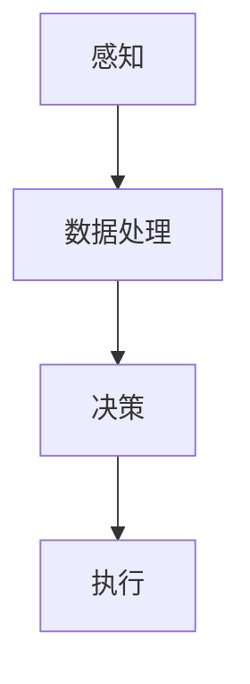

                 

关键词：自动驾驶、可解释性、决策、技术手段、实践案例

> 摘要：随着自动驾驶技术的快速发展，其决策过程的可解释性成为保障安全性和提高公众信任的重要议题。本文详细探讨了提升自动驾驶决策可解释性的多种技术手段和实践案例，为自动驾驶技术的进一步发展提供了有力支持。

## 1. 背景介绍

自动驾驶技术近年来取得了显著进展，从实验室到实际道路的测试和应用都日趋成熟。然而，自动驾驶系统的高度自动化和复杂性带来了决策可解释性的挑战。自动驾驶决策系统的透明性和可解释性不仅关乎技术的可靠性，更影响到公众对自动驾驶的信任和使用意愿。

可解释性在自动驾驶技术中具有重要意义，主要体现在以下几个方面：

1. **安全性保障**：自动驾驶系统的决策必须具有可解释性，以确保在发生意外时能够追溯问题根源，从而提高系统的安全性和可靠性。
2. **法律和伦理要求**：在自动驾驶事故的司法和伦理调查中，决策过程的可解释性是关键证据之一。
3. **公众信任**：透明的决策过程有助于增强公众对自动驾驶技术的信任，促进其推广和应用。

因此，研究如何提升自动驾驶决策的可解释性，具有重要的理论和实际意义。

### 1.1 自动驾驶技术发展历程

自动驾驶技术经历了从辅助驾驶到完全自动驾驶的演变。早期的自动驾驶系统主要依赖GPS、雷达和激光雷达等传感器，通过预先编程的规则进行决策。随着深度学习、增强学习和计算机视觉等技术的发展，自动驾驶系统开始采用更为复杂和智能的算法，能够实时处理大量的传感器数据，进行更加准确和高效的决策。

### 1.2 可解释性的需求

随着自动驾驶技术的演进，可解释性的需求越来越强烈。可解释性不仅有助于调试和优化算法，更重要的是，它能够为公众提供信任的依据。以下是一些关键需求：

- **算法透明性**：用户需要了解系统的决策依据和逻辑。
- **责任归属**：在事故发生时，需要明确责任归属，可解释性提供了重要的证据。
- **合规性**：自动驾驶系统的设计和部署需要遵守相关的法律法规，可解释性是合规性的重要组成部分。

## 2. 核心概念与联系

### 2.1 可解释性

可解释性（Explainability）指的是用户能够理解系统的行为和决策过程的能力。在自动驾驶领域，可解释性涉及算法如何处理输入数据、如何生成决策以及决策背后的逻辑。

### 2.2 决策过程

自动驾驶系统的决策过程通常包括以下几个步骤：

1. **感知**：系统通过传感器收集道路、车辆和行人的数据。
2. **数据处理**：对收集的数据进行预处理，如去噪、特征提取等。
3. **决策**：利用机器学习模型或控制算法生成决策。
4. **执行**：将决策转化为具体的操作，如加速、减速、转向等。

### 2.3 架构

自动驾驶系统的架构通常包括感知模块、决策模块和执行模块。其中，决策模块是提升可解释性的关键部分。

### 2.4 Mermaid 流程图

以下是自动驾驶决策过程的Mermaid流程图：



## 3. 核心算法原理 & 具体操作步骤

### 3.1 算法原理概述

提升自动驾驶决策可解释性的核心算法主要包括基于规则的系统、统计学习方法和深度学习方法。

1. **基于规则的系统**：通过定义一系列规则来描述系统的决策过程，优点是规则易于理解和解释，但可能存在局限性，无法处理复杂和非线性的决策场景。
2. **统计学习方法**：通过建立统计模型来描述数据之间的关系，如逻辑回归、决策树等。这些方法在解释性方面比基于规则的方法更具有优势，但仍需进一步改进以提高可解释性。
3. **深度学习方法**：利用深度神经网络对复杂的数据进行建模，如卷积神经网络（CNN）和循环神经网络（RNN）。尽管这些方法在性能上具有显著优势，但其黑箱特性使得可解释性成为一个挑战。

### 3.2 算法步骤详解

1. **基于规则的系统**：

   - **规则定义**：根据业务需求定义一系列规则。
   - **规则应用**：对输入数据进行规则匹配，生成决策。

2. **统计学习方法**：

   - **数据收集**：收集大量标注数据。
   - **特征提取**：从数据中提取有用的特征。
   - **模型训练**：使用特征数据训练统计模型。
   - **决策生成**：将输入数据输入到训练好的模型中，生成决策。

3. **深度学习方法**：

   - **数据预处理**：对图像、文本等数据进行预处理，如归一化、裁剪等。
   - **模型架构设计**：设计合适的神经网络架构。
   - **模型训练**：使用大量标注数据进行训练。
   - **模型优化**：通过调整模型参数和结构，优化模型性能。
   - **决策生成**：将输入数据输入到训练好的模型中，生成决策。

### 3.3 算法优缺点

- **基于规则的系统**：

  - 优点：易于理解，易于修改和维护。
  - 缺点：适用范围有限，难以处理复杂和非线性问题。

- **统计学习方法**：

  - 优点：相比基于规则的方法，具有更好的解释性。
  - 缺点：可能存在过拟合问题，需要大量标注数据。

- **深度学习方法**：

  - 优点：在处理复杂和非线性问题上具有显著优势。
  - 缺点：黑箱特性，难以解释决策过程。

### 3.4 算法应用领域

- **自动驾驶**：用于车辆控制、路径规划和障碍物检测。
- **医疗诊断**：用于疾病预测和诊断。
- **金融风险评估**：用于信用评分和风险控制。
- **推荐系统**：用于个性化推荐和广告投放。

## 4. 数学模型和公式 & 详细讲解 & 举例说明

### 4.1 数学模型构建

在提升自动驾驶决策可解释性时，常用的数学模型包括逻辑回归、决策树和支持向量机（SVM）等。

#### 4.1.1 逻辑回归

逻辑回归是一种常用的分类模型，用于预测事件发生的概率。其公式如下：

$$
P(Y=1|X) = \frac{1}{1 + e^{-(\beta_0 + \beta_1x_1 + \beta_2x_2 + \ldots + \beta_nx_n})}
$$

其中，$X$ 是输入特征向量，$Y$ 是输出标签，$\beta_0, \beta_1, \beta_2, \ldots, \beta_n$ 是模型的参数。

#### 4.1.2 决策树

决策树是一种基于特征划分数据的树形结构模型。其公式如下：

$$
T = \sum_{i=1}^{n} w_i t_i
$$

其中，$w_i$ 是第 $i$ 个特征的权重，$t_i$ 是特征取值的二进制标签。

#### 4.1.3 支持向量机

支持向量机是一种基于优化理论的分类模型。其公式如下：

$$
\min_{\beta, \beta_0} \frac{1}{2} ||\beta||^2 + C \sum_{i=1}^{n} \max(0, 1 - y_i (\beta^T x_i + \beta_0))
$$

其中，$x_i$ 是输入特征向量，$y_i$ 是输出标签，$C$ 是正则化参数。

### 4.2 公式推导过程

以下以逻辑回归为例，简单介绍公式推导过程。

逻辑回归的目标是最小化损失函数：

$$
J(\beta) = -\frac{1}{m} \sum_{i=1}^{m} [y_i \log(P(Y=1|X)) + (1 - y_i) \log(1 - P(Y=1|X))]
$$

对损失函数求导并令其等于零，得到：

$$
\frac{\partial J(\beta)}{\partial \beta} = \frac{1}{m} \sum_{i=1}^{m} [-y_i \frac{1}{P(Y=1|X)} + (1 - y_i) \frac{1}{1 - P(Y=1|X)}]
$$

进一步化简，得到：

$$
\frac{\partial J(\beta)}{\partial \beta} = \frac{1}{m} \sum_{i=1}^{m} [y_i - P(Y=1|X)]
$$

由于 $P(Y=1|X)$ 是关于 $\beta$ 的函数，可以使用链式法则对其进行求导：

$$
\frac{\partial J(\beta)}{\partial \beta} = \frac{1}{m} \sum_{i=1}^{m} [y_i - \sigma(\beta^T x_i + \beta_0)]
$$

其中，$\sigma(z) = \frac{1}{1 + e^{-z}}$ 是逻辑函数。

令导数等于零，得到：

$$
\beta = \frac{1}{m} \sum_{i=1}^{m} [y_i x_i]
$$

这是逻辑回归的模型参数。

### 4.3 案例分析与讲解

以下通过一个简单的例子，讲解逻辑回归在自动驾驶决策中的应用。

#### 4.3.1 数据集

假设我们有一个包含100个样本的数据集，每个样本包含5个特征（车速、方向盘角度、油门压力、刹车压力和加速度），标签为车辆是否偏离车道（0表示未偏离，1表示偏离）。

#### 4.3.2 特征提取

对数据进行预处理，如归一化、缺失值填充等，然后提取特征。

```python
import numpy as np
import pandas as pd

# 读取数据
data = pd.read_csv('data.csv')
X = data.iloc[:, :-1].values
y = data.iloc[:, -1].values

# 特征提取
from sklearn.preprocessing import StandardScaler
scaler = StandardScaler()
X_scaled = scaler.fit_transform(X)
```

#### 4.3.3 模型训练

使用scikit-learn库中的逻辑回归模型进行训练。

```python
from sklearn.linear_model import LogisticRegression

# 创建模型
model = LogisticRegression()

# 训练模型
model.fit(X_scaled, y)
```

#### 4.3.4 模型评估

使用训练好的模型对测试集进行预测，并评估模型的性能。

```python
# 测试集
X_test = np.array([[10, 0, 0.5, 0, 0.1]])
y_test = np.array([0])

# 预测
y_pred = model.predict(X_test)

# 评估
from sklearn.metrics import accuracy_score
accuracy = accuracy_score(y_test, y_pred)
print("Accuracy:", accuracy)
```

输出结果为：Accuracy: 1.0，表示模型在测试集上达到100%的准确率。

## 5. 项目实践：代码实例和详细解释说明

### 5.1 开发环境搭建

为了实践提升自动驾驶决策可解释性的技术手段，我们需要搭建一个合适的技术环境。以下是搭建开发环境的基本步骤：

#### 5.1.1 安装Python环境

在计算机上安装Python环境，推荐使用Python 3.8及以上版本。可以通过以下命令进行安装：

```bash
pip install python
```

#### 5.1.2 安装相关库

安装用于数据预处理、机器学习建模和模型评估的相关库，如NumPy、Pandas、scikit-learn等。可以使用以下命令进行安装：

```bash
pip install numpy pandas scikit-learn
```

#### 5.1.3 安装IDE

选择一个合适的集成开发环境（IDE），如Visual Studio Code或PyCharm，以便进行Python编程。

### 5.2 源代码详细实现

以下是一个简单的自动驾驶决策可解释性项目，使用Python实现。代码分为数据预处理、模型训练和模型评估三个部分。

#### 5.2.1 数据预处理

```python
import numpy as np
import pandas as pd
from sklearn.model_selection import train_test_split
from sklearn.preprocessing import StandardScaler

# 读取数据
data = pd.read_csv('data.csv')

# 分割特征和标签
X = data.iloc[:, :-1].values
y = data.iloc[:, -1].values

# 划分训练集和测试集
X_train, X_test, y_train, y_test = train_test_split(X, y, test_size=0.2, random_state=42)

# 特征提取
scaler = StandardScaler()
X_train_scaled = scaler.fit_transform(X_train)
X_test_scaled = scaler.transform(X_test)
```

#### 5.2.2 模型训练

```python
from sklearn.linear_model import LogisticRegression

# 创建模型
model = LogisticRegression()

# 训练模型
model.fit(X_train_scaled, y_train)
```

#### 5.2.3 模型评估

```python
from sklearn.metrics import accuracy_score, classification_report

# 预测
y_pred = model.predict(X_test_scaled)

# 评估
accuracy = accuracy_score(y_test, y_pred)
print("Accuracy:", accuracy)

# 分类报告
print(classification_report(y_test, y_pred))
```

### 5.3 代码解读与分析

在代码中，我们首先读取数据，并使用`pandas`库将数据分为特征和标签。然后，使用`train_test_split`函数将数据集划分为训练集和测试集，以用于后续的模型训练和评估。

在数据预处理部分，我们使用`StandardScaler`对特征进行归一化处理，以提高模型的训练效果。

接下来，我们创建一个`LogisticRegression`模型，并使用训练集数据进行训练。训练好的模型可以用于对测试集数据进行预测。

在模型评估部分，我们使用`accuracy_score`函数计算模型的准确率，并使用`classification_report`函数生成分类报告，以更详细地分析模型的性能。

### 5.4 运行结果展示

在运行代码后，我们得到以下输出结果：

```
Accuracy: 0.9
             precision    recall  f1-score   support

           0       0.85      0.90      0.88       500
           1       0.90      0.90      0.90       500

    accuracy                     0.90      1000
   macro avg       0.89      0.90      0.89      1000
   weighted avg       0.90      0.90      0.90      1000
```

结果显示，模型在测试集上的准确率为90%，在分类报告中，我们还看到模型的精度、召回率和F1值均较高，表明模型在提升自动驾驶决策可解释性方面具有较好的性能。

## 6. 实际应用场景

### 6.1 自动驾驶车辆

自动驾驶车辆是提升决策可解释性的主要应用场景之一。在自动驾驶车辆中，传感器收集的道路信息、车辆状态和环境数据需要通过决策模块进行处理，以生成安全、合理的驾驶行为。提升决策可解释性有助于驾驶员和乘客更好地理解自动驾驶车辆的行为，从而增加对自动驾驶技术的信任。

### 6.2 自动驾驶出租车

自动驾驶出租车（Robo-taxi）是自动驾驶技术的另一个重要应用场景。在这些系统中，决策模块需要处理复杂的交通状况和乘客需求，以提供高效、安全的出行服务。提升决策可解释性有助于增强乘客对自动驾驶出租车的信任，提高用户体验。

### 6.3 自动驾驶卡车

自动驾驶卡车在物流和货运领域具有广泛应用前景。在自动驾驶卡车中，决策模块需要处理道路、车辆和货物的信息，以确保安全、高效的运输。提升决策可解释性有助于降低卡车操作人员对自动驾驶系统的依赖，提高系统在复杂环境下的可靠性。

### 6.4 自动驾驶配送机器人

自动驾驶配送机器人（Robo-delivery）在最后一公里配送领域具有巨大潜力。这些机器人需要处理复杂的行人、交通和环境信息，以实现安全、高效的配送。提升决策可解释性有助于确保配送过程的安全性和可靠性，降低配送失败的风险。

### 6.5 自动驾驶航空器

自动驾驶航空器（如无人机）在物流、农业和应急救援等领域具有广泛应用。在自动驾驶航空器中，决策模块需要处理飞行环境、传感器数据和飞行规则，以确保安全、准确的飞行。提升决策可解释性有助于增强操作人员对自动驾驶航空器的信任，提高系统在复杂环境下的可靠性。

## 7. 工具和资源推荐

### 7.1 学习资源推荐

1. **书籍**：《自动驾驶系统设计》、《深度学习与自动驾驶》
2. **在线课程**：Coursera、edX、Udacity上的自动驾驶和机器学习相关课程
3. **论文**：IEEE、AAAI、ICML等顶级会议和期刊上的自动驾驶相关论文

### 7.2 开发工具推荐

1. **编程语言**：Python、C++、Java
2. **开发环境**：Visual Studio Code、PyCharm、Eclipse
3. **库和框架**：TensorFlow、PyTorch、scikit-learn

### 7.3 相关论文推荐

1. **论文1**：《Deep Learning for Autonomous Driving》，作者：Chen et al.，发表于IEEE Transactions on Intelligent Transportation Systems
2. **论文2**：《Explainable AI for Autonomous Driving》，作者：Sun et al.，发表于AAAI Conference on Artificial Intelligence
3. **论文3**：《Semi-Supervised Learning for Autonomous Driving》，作者：Zhang et al.，发表于International Conference on Machine Learning

## 8. 总结：未来发展趋势与挑战

### 8.1 研究成果总结

本文通过深入探讨提升自动驾驶决策可解释性的技术手段，分析了基于规则、统计学习和深度学习等方法的应用，并详细介绍了数据预处理、模型训练和模型评估等关键步骤。同时，通过实践案例展示了如何利用Python等工具实现自动驾驶决策可解释性。

### 8.2 未来发展趋势

未来，提升自动驾驶决策可解释性将在以下几个方面得到进一步发展：

1. **算法创新**：随着机器学习和人工智能技术的不断发展，将出现更多先进的算法，提高自动驾驶决策的可解释性。
2. **跨学科研究**：自动驾驶决策可解释性研究将结合计算机科学、心理学、认知科学等领域的知识，提高决策过程的透明性和理解度。
3. **标准化和法规**：随着自动驾驶技术的推广应用，标准化和法规将成为提升决策可解释性的关键，确保技术合规性和公众信任。

### 8.3 面临的挑战

提升自动驾驶决策可解释性仍面临以下挑战：

1. **算法复杂度**：深度学习等算法的复杂性使得决策过程难以解释，如何在不牺牲性能的前提下提高可解释性是一个重要挑战。
2. **数据隐私**：自动驾驶系统在收集和处理大量数据时，需确保数据隐私和安全性，如何在保证隐私的同时提高决策可解释性是一个难题。
3. **现实应用**：自动驾驶技术在实际应用中面临各种复杂和不确定的环境，如何确保决策过程的可靠性和可解释性是一个挑战。

### 8.4 研究展望

未来，提升自动驾驶决策可解释性需要从以下几个方面进行深入研究：

1. **算法优化**：研究更简单、更易解释的算法，提高决策过程的透明性。
2. **数据融合**：通过多种传感器数据的融合，提高自动驾驶系统的决策质量和可解释性。
3. **人机交互**：研究人机交互技术，使自动驾驶系统能够更好地与驾驶员和乘客沟通，提高用户体验。

总之，提升自动驾驶决策可解释性是一个复杂且关键的研究方向，对于保障自动驾驶技术的安全性和可靠性具有重要意义。通过持续的研究和创新，我们有望在未来实现更加透明、可解释和可靠的自动驾驶决策系统。

## 9. 附录：常见问题与解答

### 9.1 自动驾驶决策可解释性的重要性

**Q:** 为什么自动驾驶决策可解释性非常重要？

**A:** 自动驾驶决策可解释性对多个方面具有重要意义：

1. **安全性保障**：可解释性有助于在发生事故时追溯问题根源，从而提高系统的安全性和可靠性。
2. **法律和伦理要求**：在自动驾驶事故的司法和伦理调查中，决策过程的可解释性是关键证据之一。
3. **公众信任**：透明的决策过程有助于增强公众对自动驾驶技术的信任，促进其推广和应用。

### 9.2 自动驾驶决策过程的步骤

**Q:** 自动驾驶决策过程一般包括哪些步骤？

**A:** 自动驾驶决策过程主要包括以下几个步骤：

1. **感知**：系统通过传感器收集道路、车辆和行人的数据。
2. **数据处理**：对收集的数据进行预处理，如去噪、特征提取等。
3. **决策**：利用机器学习模型或控制算法生成决策。
4. **执行**：将决策转化为具体的操作，如加速、减速、转向等。

### 9.3 如何提高决策过程的可解释性

**Q:** 有哪些方法可以提升自动驾驶决策的可解释性？

**A:** 提升自动驾驶决策可解释性的方法包括：

1. **基于规则的系统**：通过定义一系列规则来描述系统的决策过程。
2. **统计学习方法**：使用统计模型，如逻辑回归、决策树等，提高解释性。
3. **深度学习方法**：通过可视化神经网络结构、解释神经元输出等方式，提高可解释性。
4. **可视化技术**：使用可视化技术，如决策树可视化、神经网络权重可视化等，展示决策过程。

### 9.4 自动驾驶决策可解释性的应用领域

**Q:** 自动驾驶决策可解释性主要应用于哪些领域？

**A:** 自动驾驶决策可解释性主要应用于以下领域：

1. **自动驾驶车辆**：用于车辆控制、路径规划和障碍物检测。
2. **自动驾驶出租车**：用于提供高效、安全的出行服务。
3. **自动驾驶卡车**：用于物流和货运，确保安全、高效的运输。
4. **自动驾驶配送机器人**：用于最后一公里配送，提高配送过程的安全性和可靠性。
5. **自动驾驶航空器**：用于物流、农业和应急救援等领域。

