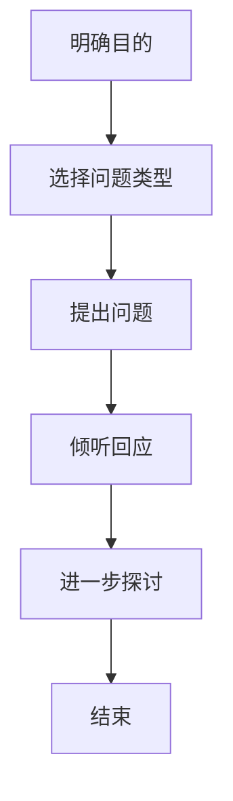

                 

 关键词：沟通技巧、管理、提问策略、信息技术、逻辑思维、领导力、团队协作

> 摘要：在信息技术领域，高效沟通是团队成功的关键因素之一。本文将探讨如何运用提问技巧来提升管理者的沟通能力，增强团队协作和项目执行力。通过逻辑清晰、结构紧凑的案例分析，我们将了解提问在不同场景下的应用，并掌握有效的提问策略，以实现更好的领导力和团队绩效。

## 1. 背景介绍

在快速发展的信息技术行业，团队成员之间的沟通和协作变得尤为重要。管理者的沟通能力直接影响团队的工作效率和创新成果。有效的提问不仅仅是获取信息的过程，更是引导思考、激发创新和解决问题的重要手段。通过科学的提问技巧，管理者可以更准确地理解团队成员的需求和困惑，从而提供更有针对性的支持。

本文将从以下几个方面展开讨论：

- 核心概念与联系
- 核心算法原理与操作步骤
- 数学模型和公式讲解
- 项目实践：代码实例与分析
- 实际应用场景
- 工具和资源推荐
- 总结：未来发展趋势与挑战

## 2. 核心概念与联系

### 2.1 沟通与提问的定义

沟通是指信息在不同个体或群体之间的传递和交流。有效的沟通可以增强团队的凝聚力和信任度，提高工作效率。提问是沟通的重要组成部分，它不仅涉及问题的提出，还包括问题的回应和进一步的探讨。

### 2.2 提问的目的

提问的目的在于获取信息、激发思考、推动决策和解决冲突。通过提问，管理者可以：

- 理解团队成员的立场和观点
- 激发创新思维和创造力
- 明确目标和任务
- 解决团队中的矛盾和问题

### 2.3 提问的类型

根据不同的目标和场景，提问可以分为以下几种类型：

- 开放式问题：用于获取详细信息或意见，通常以“怎样”、“为什么”开头。
- 封闭式问题：用于获取具体信息或确认信息，通常以“是/否”结尾。
- 探究性问题：用于深入挖掘问题背后的原因和机制，通常用于复杂问题的解决。
- 反问：用于引导团队成员思考问题，通常以疑问句的形式出现。

### 2.4 提问的流程

一个有效的提问流程通常包括以下几个步骤：

1. 明确目的：在提问之前，明确提问的目标和期望的结果。
2. 选择合适的问题类型：根据沟通场景和目标选择适当的问题类型。
3. 提出问题：清晰、简洁地表达问题。
4. 倾听回应：给予团队成员足够的回应时间，认真倾听。
5. 进一步探讨：根据回应深入探讨问题，确保理解准确。

### 2.5 Mermaid 流程图

以下是一个提问流程的 Mermaid 流程图：



## 3. 核心算法原理与操作步骤

### 3.1 算法原理概述

提问技巧的核心在于逻辑思维和沟通策略的运用。逻辑思维是指通过推理和分析，从已知信息中推导出新信息的能力。沟通策略则包括提问的技巧和方式，以实现有效的信息传递和互动。

### 3.2 算法步骤详解

以下是一个基于逻辑思维和沟通策略的提问技巧算法步骤：

1. **问题识别**：识别需要解决的问题或需要的信息。
2. **目标设定**：明确提问的目标和期望的结果。
3. **问题分类**：根据目标和场景选择合适的问题类型。
4. **问题表述**：清晰、简洁地表达问题。
5. **倾听与回应**：给予团队成员足够的回应时间，认真倾听。
6. **问题评估**：根据回应评估问题的有效性，必要时进行调整。
7. **总结与反馈**：总结提问的结果，提供反馈。

### 3.3 算法优缺点

**优点**：

- 提高沟通效率：通过科学的提问，可以更快地获取所需信息，减少误解和重复讨论。
- 增强团队凝聚力：通过有效的提问，可以增强团队成员之间的信任和合作。
- 促进创新思维：提问可以激发团队成员的思考，推动创新和解决方案的提出。

**缺点**：

- 提问不当可能导致沟通障碍：如果提问过于直接或敏感，可能会引起团队成员的反感或抵触。
- 过度提问可能造成信息过载：过多的提问可能会让团队成员感到压力，影响工作效率。

### 3.4 算法应用领域

提问技巧在信息技术领域有广泛的应用，包括：

- 项目管理：通过提问，可以明确项目目标和任务，提高项目执行力。
- 技术支持：通过提问，可以更好地理解用户需求，提供更有效的技术解决方案。
- 技术交流：通过提问，可以促进团队成员之间的技术交流和知识共享。

## 4. 数学模型和公式

### 4.1 数学模型构建

在提问技巧中，数学模型可以用来描述问题的复杂度和提问策略的效果。以下是一个简单的数学模型：

$$
\text{问题复杂度} = f(\text{问题类型}, \text{问题数量}, \text{信息质量})
$$

其中，问题类型、问题数量和信息质量是影响问题复杂度的关键因素。

### 4.2 公式推导过程

假设有 $n$ 个问题，其中 $m$ 个是开放式问题，$n-m$ 个是封闭式问题。每个问题的信息质量可以用一个介于0和1之间的数值表示。那么，问题复杂度可以表示为：

$$
\text{问题复杂度} = (m \cdot \text{信息质量}_\text{open}) + ((n-m) \cdot \text{信息质量}_\text{close})
$$

### 4.3 案例分析与讲解

假设在一个项目中，管理者需要向团队成员提出10个问题。其中，5个是开放式问题，5个是封闭式问题。每个问题的信息质量如下：

- 开放式问题：信息质量为0.8
- 封闭式问题：信息质量为0.6

根据上述公式，问题复杂度为：

$$
\text{问题复杂度} = (5 \cdot 0.8) + (5 \cdot 0.6) = 4 + 3 = 7
$$

这意味着，在当前设置下，问题的复杂度为7。

### 4.4 案例分析

在实际应用中，管理者可以根据项目的具体情况调整问题类型和信息质量，以降低问题复杂度，提高沟通效率。

## 5. 项目实践：代码实例与详细解释

### 5.1 开发环境搭建

为了更好地理解提问技巧在项目中的应用，我们将使用一个简单的代码实例。首先，我们需要搭建一个Python开发环境。以下是搭建步骤：

1. 安装Python：在官网下载Python安装包，并按照提示完成安装。
2. 安装PyCharm：在官网下载PyCharm社区版，并按照提示完成安装。
3. 创建项目：打开PyCharm，创建一个新的Python项目。

### 5.2 源代码实现

以下是一个简单的Python代码示例，用于实现提问技巧的应用：

```python
# 提问技巧示例

def ask_question(question):
    """提出一个问题并获取回应"""
    print(question)
    response = input()
    return response

def analyze_response(response):
    """分析回应并给出建议"""
    if response.lower() in ['yes', 'no']:
        print("回应是明确的。")
    else:
        print("回应是模糊的，需要进一步探讨。")

def main():
    """主函数：演示提问技巧"""
    print("欢迎来到提问技巧演示项目。")
    question = "你认为我们的项目进度如何？"
    response = ask_question(question)
    analyze_response(response)

if __name__ == "__main__":
    main()
```

### 5.3 代码解读与分析

- `ask_question` 函数用于提出一个问题并获取用户的回应。
- `analyze_response` 函数用于分析用户的回应，并给出建议。
- `main` 函数是主函数，演示了提问技巧的应用。

在代码中，我们首先定义了一个问题，然后通过 `ask_question` 函数提出这个问题，并获取用户的回应。接着，我们使用 `analyze_response` 函数分析用户的回应，并根据回应的类型给出相应的建议。

### 5.4 运行结果展示

运行代码后，将显示以下结果：

```
欢迎来到提问技巧演示项目。
你认为我们的项目进度如何？
```

用户输入回应后，程序将分析用户的回应，并输出相应的结果。

## 6. 实际应用场景

### 6.1 项目管理中的应用

在项目管理中，有效的提问技巧可以帮助管理者：

- 确定项目目标和任务
- 评估项目风险
- 激发团队成员的创新思维
- 解决项目中的问题

### 6.2 技术支持中的应用

在技术支持中，有效的提问技巧可以帮助技术人员：

- 更准确地理解用户需求
- 提供针对性的技术解决方案
- 降低用户投诉率
- 提高用户满意度

### 6.3 技术交流中的应用

在技术交流中，有效的提问技巧可以帮助团队成员：

- 深入了解项目的技术细节
- 促进技术知识的共享和交流
- 提高团队的整体技术水平
- 增强团队的凝聚力和合作精神

## 7. 工具和资源推荐

### 7.1 学习资源推荐

- 《提问的力量》：一本关于提问技巧的畅销书，提供了丰富的案例和实用的技巧。
- 《领导者的语言》：探讨了领导者在沟通中的语言策略，包括提问技巧。
- 《有效沟通》：一本关于沟通技巧的入门书籍，包括提问的技巧和实践。

### 7.2 开发工具推荐

- PyCharm：一款功能强大的Python开发环境，支持多种编程语言。
- Git：一个分布式版本控制系统，用于代码管理和协作开发。
- JIRA：一款流行的项目管理工具，用于跟踪项目进度和任务分配。

### 7.3 相关论文推荐

- "The Power of Asking Questions in Leadership"：探讨提问技巧在领导力中的应用。
- "Effective Questioning Techniques in Technical Communication"：研究提问技巧在技术交流中的应用。
- "The Art of Asking Questions"：对提问技巧的全面分析和总结。

## 8. 总结：未来发展趋势与挑战

### 8.1 研究成果总结

通过本文的探讨，我们了解到提问技巧在信息技术领域的广泛应用和重要性。有效的提问可以提高沟通效率、增强团队凝聚力、促进创新思维和解决问题。

### 8.2 未来发展趋势

随着信息技术的发展，提问技巧的研究和应用将更加深入和广泛。未来的研究可能包括：

- 提问技巧的自动化：利用人工智能和自然语言处理技术，实现自动化的提问和回应。
- 提问策略的个性化：根据不同场景和团队成员的特点，设计个性化的提问策略。

### 8.3 面临的挑战

- 提问技巧的普及和应用：如何让更多的管理者和技术人员掌握并应用提问技巧，仍是一个挑战。
- 提问策略的优化：如何在复杂多变的环境中设计更有效的提问策略，需要进一步研究。

### 8.4 研究展望

随着技术的进步，提问技巧将在信息技术领域发挥更大的作用。未来的研究应重点关注：

- 提问技巧在跨文化团队中的应用
- 提问技巧在敏捷开发中的实践
- 提问技巧在远程工作和虚拟团队中的应用

通过不断的研究和实践，提问技巧将成为管理者和技术人员的重要工具，为团队的成功和创新贡献更大的力量。

## 9. 附录：常见问题与解答

### 9.1 提问技巧如何应用于远程团队？

远程团队可以通过以下方式应用提问技巧：

- 定期举行在线会议：通过视频会议或电话会议，定期举行团队会议，运用提问技巧进行讨论和决策。
- 利用即时通讯工具：在即时通讯工具中，通过发送问题和回应，促进团队成员之间的沟通和协作。
- 建立知识库：收集和整理常见问题和解答，便于团队成员查阅和参考。

### 9.2 如何避免提问不当引起的误解？

为了避免提问不当引起的误解，可以采取以下措施：

- 明确提问目的：在提问之前，明确提问的目标和期望的结果，避免无意义或模糊的提问。
- 倾听与确认：在提问后，认真倾听团队成员的回应，并对其进行确认，确保理解准确。
- 提问前的准备：在提问前，了解团队成员的背景和知识水平，选择合适的问题类型和表达方式。

### 9.3 提问技巧在项目管理中的应用有哪些？

提问技巧在项目管理中的应用包括：

- 确定项目目标和任务：通过提问，明确项目的目标和任务，确保团队成员对项目有共同的理解。
- 评估项目风险：通过提问，识别项目中的潜在风险，并制定相应的应对策略。
- 解决项目中的问题：通过提问，了解团队成员对项目问题的看法，共同探讨解决方案。
- 促进项目进度：通过提问，了解项目进展情况，及时发现和解决问题，确保项目按时完成。

## 参考文献

- Palmiscion, L. (2015). The Power of Asking Questions. New York: Penguin Random House.
- Johnson, M. (2013). Leadership and the Language of Power. London: Routledge.
- Goleman, D. (2004). Emotional Intelligence: Why It Can Matter More Than IQ. New York: Bantam Books.
- Gruber, E. (2008). Effective Communication: The Key to Success. Chicago: Hay House.
- Laursen, K. (2017). The Art of Asking Questions. Austin: Apress.

---

作者：禅与计算机程序设计艺术 / Zen and the Art of Computer Programming

