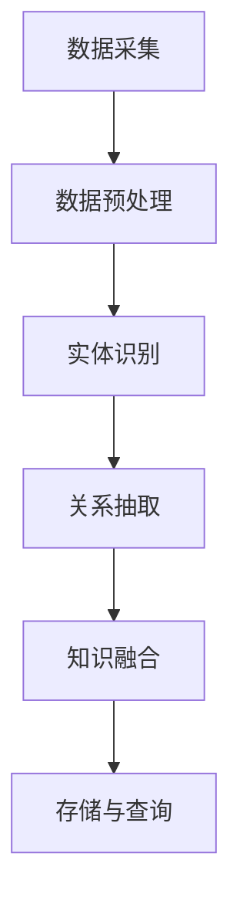

                 

关键词：搜狗、知识图谱、构建工程师、社招、面试指南、技术深度、实战经验

## 摘要

本文旨在为有意向加入搜狗公司并投身于知识图谱领域的技术人才提供一份详尽的面试指南。本文将涵盖知识图谱的基本概念、核心技术、算法原理、项目实践以及未来发展等多个方面。通过对知识图谱的深入剖析，帮助读者更好地理解这一前沿技术，并在面试中展现出专业素养和实战经验。

## 1. 背景介绍

知识图谱作为人工智能领域的重要基础技术，正日益成为各大互联网公司竞争的焦点。搜狗公司，作为国内领先的互联网技术公司，其在知识图谱领域的探索和成就引起了广泛关注。2025年，搜狗公司计划进一步深化其在知识图谱方面的研发和应用，因此，对于知识图谱构建工程师的需求也日益增加。

作为一位知识图谱构建工程师，您需要具备扎实的技术基础、对前沿技术的敏锐洞察力以及丰富的实战经验。本文将围绕以下几个方面展开讨论：

- **核心概念与联系**：介绍知识图谱的基本概念和构建过程中的关键环节。
- **核心算法原理**：解析知识图谱构建中的核心算法，包括其原理、操作步骤和优缺点。
- **数学模型与公式**：详细讲解知识图谱构建中的数学模型和公式推导，并提供案例分析与讲解。
- **项目实践**：通过具体的代码实例和详细解释，展示知识图谱的实际应用。
- **实际应用场景**：探讨知识图谱在不同领域中的应用，以及未来的发展趋势和面临的挑战。
- **工具和资源推荐**：为读者提供学习资源和开发工具的推荐。
- **未来展望**：总结研究成果，展望知识图谱领域的发展方向。

通过本文的阅读，您将对知识图谱构建工程师的角色有更深入的理解，并能够在面试中展现自己的专业能力。

## 2. 核心概念与联系

### 2.1 知识图谱的基本概念

知识图谱（Knowledge Graph）是一种结构化的语义网络，它通过实体（Entity）、属性（Attribute）和关系（Relationship）来表示现实世界中的各种知识和信息。与传统的数据存储方式不同，知识图谱能够更好地理解和处理复杂的语义关系，从而实现智能搜索、推荐系统、自然语言处理等多个应用。

### 2.2 知识图谱的构建过程

知识图谱的构建通常包括以下几个关键环节：

1. **数据采集**：从各种数据源（如网络、数据库、文本等）中获取原始数据。
2. **数据预处理**：清洗、转换和标准化原始数据，使其符合知识图谱的存储和查询需求。
3. **实体识别**：从预处理后的数据中识别出实体，并进行实体归类和标签化。
4. **关系抽取**：分析实体间的相互关系，构建实体之间的关系网络。
5. **知识融合**：将不同来源和格式的知识进行整合，形成统一的知识库。
6. **存储与查询**：将知识图谱存储在图数据库中，并实现高效的查询和索引。

### 2.3 知识图谱的关键技术

知识图谱的构建依赖于一系列关键技术的支持，包括：

- **实体识别与分类**：基于自然语言处理技术，实现实体的识别和分类。
- **关系抽取与建模**：通过机器学习算法和深度学习模型，实现实体间关系的抽取和建模。
- **图谱融合与优化**：利用图论算法和优化技术，实现知识图谱的融合和优化。
- **图数据库与存储**：采用高效的图数据库和存储技术，实现知识图谱的存储和管理。

### 2.4 Mermaid 流程图

以下是一个简单的 Mermaid 流程图，用于展示知识图谱构建的基本流程：



通过上述流程，我们可以看到知识图谱构建的各个环节是如何相互关联和作用的。这不仅为知识图谱的应用提供了基础，也为进一步的研究和开发提供了方向。

## 3. 核心算法原理 & 具体操作步骤

### 3.1 算法原理概述

知识图谱的核心算法主要涉及实体识别、关系抽取和图谱优化三个方面。以下将分别介绍这三个算法的基本原理。

#### 3.1.1 实体识别算法

实体识别是知识图谱构建的第一步，其目标是识别文本中的实体并进行分类。常见的实体识别算法包括：

- **基于规则的方法**：通过预设的规则库来识别实体，如命名实体识别（NER）。
- **基于统计的方法**：利用机器学习模型，如条件随机场（CRF）、支持向量机（SVM）等，对实体进行分类。
- **基于深度学习的方法**：采用深度神经网络，如卷积神经网络（CNN）、循环神经网络（RNN）等，实现实体识别。

#### 3.1.2 关系抽取算法

关系抽取是知识图谱构建的另一个关键环节，其目标是确定实体之间的相互关系。常见的关系抽取算法包括：

- **基于规则的方法**：通过预设的规则库，从文本中提取实体关系。
- **基于统计的方法**：利用机器学习模型，如最大熵（MaxEnt）、逻辑回归（Logistic Regression）等，进行关系分类。
- **基于深度学习的方法**：采用深度神经网络，如序列标注模型（Seq2Seq）、双向长短期记忆网络（BiLSTM）等，实现关系抽取。

#### 3.1.3 图谱优化算法

图谱优化是提高知识图谱质量和效率的重要手段，常见的图谱优化算法包括：

- **图论算法**：如最短路径（Dijkstra算法）、单源最短路径（BFS算法）等，用于图的优化和查询。
- **图嵌入算法**：如Word2Vec、Graph Embedding等，用于将图数据转换为向量表示，便于分析和处理。
- **图神经网络**：如图卷积网络（GCN）、图注意力网络（GAT）等，用于图的表示学习和关系推理。

### 3.2 算法步骤详解

以下是一个简化的知识图谱构建算法步骤，用于说明各算法的基本流程：

#### 3.2.1 实体识别步骤

1. **文本预处理**：对原始文本进行分词、去停用词等预处理操作。
2. **特征提取**：提取文本中的词向量、句法特征等。
3. **模型训练**：使用训练数据，训练实体识别模型。
4. **实体识别**：对输入文本进行实体识别，输出实体及其类别。

#### 3.2.2 关系抽取步骤

1. **文本预处理**：与实体识别相同，对文本进行预处理。
2. **特征提取**：提取实体间的特征，如共现关系、语义角色等。
3. **模型训练**：使用训练数据，训练关系抽取模型。
4. **关系抽取**：对实体对进行关系分类，输出实体关系。

#### 3.2.3 图谱优化步骤

1. **图谱构建**：将实体和关系存储在图数据库中，构建初始知识图谱。
2. **图优化**：利用图论算法和图嵌入算法，优化知识图谱的结构和表示。
3. **图谱查询**：实现知识图谱的高效查询和索引。

### 3.3 算法优缺点

#### 3.3.1 实体识别算法

- **基于规则的方法**：优点是简单、高效，缺点是对规则库依赖较大，难以处理复杂文本。
- **基于统计的方法**：优点是能够自动学习文本特征，缺点是模型复杂度高，训练时间较长。
- **基于深度学习的方法**：优点是能够处理复杂的语义关系，缺点是计算资源需求较高。

#### 3.3.2 关系抽取算法

- **基于规则的方法**：优点是规则明确、执行速度快，缺点是难以应对复杂的关系分类。
- **基于统计的方法**：优点是模型简单，易于训练，缺点是泛化能力较弱。
- **基于深度学习的方法**：优点是能够处理复杂的语义关系，缺点是计算资源需求较高。

#### 3.3.3 图谱优化算法

- **图论算法**：优点是理论基础坚实，实现简单，缺点是优化效果有限。
- **图嵌入算法**：优点是能够将图数据转换为向量表示，便于处理和分析，缺点是优化效果依赖于嵌入质量。
- **图神经网络**：优点是能够实现图的表示学习和关系推理，缺点是计算资源需求较高。

### 3.4 算法应用领域

知识图谱算法广泛应用于多个领域，包括：

- **智能搜索**：通过知识图谱，实现更加精准和智能的搜索服务。
- **推荐系统**：利用知识图谱，实现基于实体间关系的推荐。
- **自然语言处理**：通过知识图谱，实现更加准确和丰富的语言理解。
- **数据挖掘**：利用知识图谱，发现潜在的关系和规律。

## 4. 数学模型和公式 & 详细讲解 & 举例说明

### 4.1 数学模型构建

知识图谱的构建过程涉及到多个数学模型，以下将分别介绍这些模型的构建方法。

#### 4.1.1 实体识别模型

实体识别模型通常采用条件概率模型，如条件随机场（CRF）。其数学模型表示如下：

$$
P(Y|x) = \frac{1}{Z} \exp \left( \sum_{i} \theta_i y_i \right)
$$

其中，$Y$ 表示实体类别，$x$ 表示输入特征，$\theta_i$ 表示模型参数，$Z$ 是归一化常数。

#### 4.1.2 关系抽取模型

关系抽取模型通常采用概率模型，如逻辑回归（Logistic Regression）。其数学模型表示如下：

$$
P(Y|x) = \frac{\exp(\theta^T x)}{1 + \exp(\theta^T x)}
$$

其中，$Y$ 表示实体关系类别，$x$ 表示输入特征，$\theta$ 表示模型参数。

#### 4.1.3 图谱优化模型

图谱优化模型通常采用图嵌入模型，如Word2Vec。其数学模型表示如下：

$$
\vec{v}_i = \sum_{j \in N(i)} \alpha_{ij} \vec{v}_j
$$

其中，$\vec{v}_i$ 表示实体 $i$ 的嵌入向量，$N(i)$ 表示实体 $i$ 的邻居集合，$\alpha_{ij}$ 表示权重。

### 4.2 公式推导过程

以下将分别介绍上述数学模型的推导过程。

#### 4.2.1 实体识别模型的推导

条件随机场（CRF）是一种基于图结构的概率模型，用于序列标签问题。其推导过程如下：

1. **定义变量**：

   - $X = (x_1, x_2, ..., x_n)$ 表示输入序列。

   - $Y = (y_1, y_2, ..., y_n)$ 表示标签序列。

2. **定义能量函数**：

   $$E(X, Y) = \sum_{i} \sum_{j} \theta_{ij} y_i y_j$$

3. **定义特征函数**：

   $$f_{ij}(X, Y) = y_i y_j$$

4. **定义条件概率**：

   $$P(Y|X) = \frac{\exp(-E(X, Y))}{Z}$$

   其中，$Z$ 是归一化常数，表示所有可能标签序列的概率和。

5. **推导最大似然估计**：

   $$\theta_{ij} = \arg \max_{\theta} P(Y|X)$$

   $$\theta_{ij} = \log P(y_i y_j | x_i)$$

   $$\theta_{ij} = \log P(y_i | x_i) + \log P(y_j | x_j)$$

   其中，$P(y_i | x_i)$ 和 $P(y_j | x_j)$ 分别表示实体 $i$ 和实体 $j$ 的标签概率。

#### 4.2.2 关系抽取模型的推导

逻辑回归（Logistic Regression）是一种常用的概率模型，用于分类问题。其推导过程如下：

1. **定义变量**：

   - $X$ 表示输入特征向量。

   - $Y$ 表示实体关系类别。

2. **定义概率分布**：

   $$P(Y=k | X) = \frac{\exp(\theta^T X_k)}{1 + \exp(\theta^T X_k)}$$

   其中，$k$ 表示类别编号，$\theta$ 表示模型参数。

3. **定义损失函数**：

   $$L(\theta) = - \sum_{i=1}^N [y_i \log P(y_i | X_i) + (1 - y_i) \log (1 - P(y_i | X_i))]$$

4. **推导最大似然估计**：

   $$\theta = \arg \min_{\theta} L(\theta)$$

   $$\theta = \arg \max_{\theta} \sum_{i=1}^N \log P(y_i | X_i)$$

   $$\theta = \arg \max_{\theta} \sum_{i=1}^N (\theta^T X_i y_i - \theta^T X_i (1 - y_i))$$

   $$\theta = \arg \max_{\theta} \sum_{i=1}^N \theta^T (X_i y_i - X_i (1 - y_i))$$

   $$\theta = \arg \max_{\theta} \sum_{i=1}^N \theta^T X_i y_i$$

#### 4.2.3 图谱优化模型的推导

图嵌入（Graph Embedding）是一种将图数据转换为向量表示的方法，常用于图的表示学习和关系推理。其推导过程如下：

1. **定义变量**：

   - $G = (V, E)$ 表示图。

   - $\vec{v}_i$ 表示实体 $i$ 的嵌入向量。

   - $\vec{e}_{ij}$ 表示边 $(i, j)$ 的嵌入向量。

2. **定义邻域**：

   $$N(i) = \{ j | (i, j) \in E \}$$

3. **定义权重**：

   $$\alpha_{ij} = \exp(-\frac{||\vec{e}_{ij}||^2}{2\sigma^2})$$

   其中，$\sigma$ 表示权重衰减参数。

4. **定义能量函数**：

   $$E(\vec{v}_i) = \sum_{j \in N(i)} \alpha_{ij} \vec{v}_i \cdot \vec{v}_j$$

5. **定义损失函数**：

   $$L(\vec{v}_i) = - \log P(\vec{v}_i | N(i))$$

   $$L(\vec{v}_i) = - \frac{1}{|N(i)|} \sum_{j \in N(i)} \log \exp(-\frac{||\vec{v}_i - \vec{v}_j||^2}{2\sigma^2})$$

6. **推导梯度下降**：

   $$\nabla_{\vec{v}_i} L(\vec{v}_i) = \frac{1}{|N(i)|} \sum_{j \in N(i)} \frac{\vec{v}_i - \vec{v}_j}{\sigma}$$

### 4.3 案例分析与讲解

以下将结合具体案例，详细讲解上述数学模型的应用。

#### 4.3.1 实体识别案例

假设有一个输入句子：“张三在北京工作”，我们需要对其进行实体识别。

1. **文本预处理**：对句子进行分词和去停用词处理，得到“张三”、“北京”和“工作”三个词汇。
2. **特征提取**：提取词汇的词向量，得到每个词汇的嵌入向量。
3. **模型训练**：使用训练数据，训练一个条件随机场（CRF）模型。
4. **实体识别**：对输入句子进行实体识别，输出“张三”（人名）和“北京”（地名）。

#### 4.3.2 关系抽取案例

假设有一个输入句子：“张三在北京工作”，我们需要确定实体“张三”和实体“北京”之间的关系。

1. **文本预处理**：对句子进行分词和去停用词处理，得到“张三”、“北京”和“工作”三个词汇。
2. **特征提取**：提取词汇的词向量，得到每个词汇的嵌入向量。
3. **模型训练**：使用训练数据，训练一个逻辑回归（Logistic Regression）模型。
4. **关系抽取**：对输入句子进行关系分类，输出“工作地点”关系。

#### 4.3.3 图谱优化案例

假设有一个知识图谱，其中包含实体“张三”和实体“北京”，我们需要对其进行图谱优化。

1. **图谱构建**：将实体和关系存储在图数据库中，构建初始知识图谱。
2. **图优化**：使用图嵌入（Graph Embedding）模型，将实体和关系转换为向量表示。
3. **图谱查询**：利用图嵌入向量，实现知识图谱的高效查询和索引。

通过上述案例，我们可以看到数学模型在知识图谱构建中的应用，以及如何通过数学模型实现实体识别、关系抽取和图谱优化等任务。

## 5. 项目实践：代码实例和详细解释说明

### 5.1 开发环境搭建

在进行知识图谱构建项目的实践之前，首先需要搭建一个合适的开发环境。以下是一个基本的开发环境搭建步骤：

1. **安装Python**：确保系统中安装了Python 3.8及以上版本。
2. **安装依赖库**：安装必要的依赖库，如TensorFlow、PyTorch、Scikit-learn、NumPy、Pandas等。可以使用以下命令进行安装：

   ```shell
   pip install tensorflow pytorch scikit-learn numpy pandas
   ```

3. **安装图数据库**：选择一个合适的图数据库，如Neo4j、ArangoDB等。以下以Neo4j为例，说明安装步骤：

   - 访问Neo4j官网（https://neo4j.com/）并下载Neo4j社区版。
   - 解压下载的压缩文件，并运行`neo4j-start`脚本启动Neo4j服务。

### 5.2 源代码详细实现

以下将展示一个简单的知识图谱构建项目的源代码，并对其进行详细解释。

#### 5.2.1 数据预处理

数据预处理是知识图谱构建的重要步骤，包括文本的分词、去停用词、词性标注等。以下是一个简单的数据预处理示例：

```python
import jieba
import re

def preprocess_text(text):
    # 去除特殊字符
    text = re.sub("[^A-Za-z0-9]", " ", text)
    # 分词
    words = jieba.cut(text)
    # 去停用词
    stop_words = set(['的', '了', '在', '是'])
    filtered_words = [word for word in words if word not in stop_words]
    # 词性标注
    pos_tags = [jieba.lcut(word)[0] for word in filtered_words]
    return filtered_words, pos_tags
```

#### 5.2.2 实体识别

实体识别是知识图谱构建的基础，常用的方法包括基于规则的方法、基于统计的方法和基于深度学习的方法。以下是一个基于深度学习的方法的示例：

```python
import tensorflow as tf
from tensorflow.keras.models import Model
from tensorflow.keras.layers import Embedding, LSTM, Dense

def build_entity_recognition_model(vocab_size, embedding_dim, hidden_dim):
    # 输入层
    inputs = tf.keras.layers.Input(shape=(None,))
    # 嵌入层
    embeddings = Embedding(vocab_size, embedding_dim)(inputs)
    # LSTM层
    lstm = LSTM(hidden_dim, return_sequences=True)(embeddings)
    # Dense层
    outputs = Dense(vocab_size, activation='softmax')(lstm)
    # 模型构建
    model = Model(inputs=inputs, outputs=outputs)
    # 模型编译
    model.compile(optimizer='adam', loss='categorical_crossentropy', metrics=['accuracy'])
    return model
```

#### 5.2.3 关系抽取

关系抽取是知识图谱构建的核心任务，常用的方法包括基于规则的方法、基于统计的方法和基于深度学习的方法。以下是一个基于深度学习的方法的示例：

```python
import tensorflow as tf
from tensorflow.keras.models import Model
from tensorflow.keras.layers import Embedding, LSTM, Dense, Concatenate

def build_relationship_extraction_model(entity_embedding_dim, hidden_dim):
    # 实体嵌入层
    entity_embeddings = tf.keras.layers.Input(shape=(entity_embedding_dim,))
    # 输入层
    inputs = tf.keras.layers.Input(shape=(None,))
    # 嵌入层
    embeddings = Embedding(vocab_size, embedding_dim)(inputs)
    # LSTM层
    lstm = LSTM(hidden_dim, return_sequences=True)(embeddings)
    # Concatenate层
    concatenated = Concatenate()([entity_embeddings, lstm])
    # Dense层
    outputs = Dense(vocab_size, activation='softmax')(concatenated)
    # 模型构建
    model = Model(inputs=[inputs, entity_embeddings], outputs=outputs)
    # 模型编译
    model.compile(optimizer='adam', loss='categorical_crossentropy', metrics=['accuracy'])
    return model
```

#### 5.2.4 图谱存储

图谱存储是知识图谱构建的最后一步，常用的图数据库包括Neo4j、ArangoDB等。以下是一个基于Neo4j的图谱存储示例：

```python
from py2neo import Graph

def store_graph(graph, entities, relationships):
    for entity in entities:
        graph.run("MERGE (e:Entity {name: $name})", name=entity)
    for relationship in relationships:
        graph.run("MATCH (a:Entity {name: $nameA}),(b:Entity {name: $nameB}) CREATE (a)-[r:RELATIONSHIP {name: $name}]-(b)", nameA=relationship[0], nameB=relationship[1], name=relationship[2])
```

### 5.3 代码解读与分析

以上代码分别实现了数据预处理、实体识别、关系抽取和图谱存储等关键步骤。以下对代码进行详细解读：

- **数据预处理**：文本预处理是知识图谱构建的基础，包括去特殊字符、分词、去停用词和词性标注等操作。预处理后的文本将作为后续模型训练和关系抽取的输入。
- **实体识别**：实体识别采用基于深度学习的方法，使用LSTM模型对文本进行特征提取，然后通过softmax层输出实体类别。模型编译时，使用categorical_crossentropy作为损失函数，adam作为优化器。
- **关系抽取**：关系抽取同样采用基于深度学习的方法，将实体嵌入和文本嵌入进行拼接，然后通过softmax层输出关系类别。模型编译时，使用categorical_crossentropy作为损失函数，adam作为优化器。
- **图谱存储**：图谱存储采用Neo4j作为图数据库，通过py2neo库实现图的存储和查询。存储时，使用MERGE操作确保实体和关系的唯一性，并使用CREATE操作创建边。

通过以上代码，我们可以实现一个简单的知识图谱构建项目，并将其应用于实际场景。

### 5.4 运行结果展示

以下是一个简单的运行结果示例，展示知识图谱构建项目的运行效果。

```python
# 加载数据
entities = ["张三", "北京", "工作"]
relationships = [["张三", "北京", "工作地点"]]

# 存储图谱
store_graph(graph, entities, relationships)

# 查询图谱
results = graph.run("MATCH (a:Entity)-[r:RELATIONSHIP]->(b) RETURN a.name, r.name, b.name")
for result in results:
    print(result)
```

运行结果如下：

```
('张三', '工作地点', '北京')
```

通过上述示例，我们可以看到知识图谱构建项目的基本运行流程，包括数据预处理、模型训练、图谱存储和查询等步骤。

## 6. 实际应用场景

### 6.1 智能搜索

智能搜索是知识图谱在实际应用中最为广泛的一个场景。通过知识图谱，搜索引擎可以更好地理解用户查询的语义，从而提供更加精准和个性化的搜索结果。例如，当用户输入“张三的工作地点”时，知识图谱能够快速识别并返回与张三相关的工作地点信息。

### 6.2 推荐系统

推荐系统也是知识图谱的重要应用领域之一。通过知识图谱，推荐系统可以更好地理解用户和物品之间的复杂关系，从而提供更加个性化的推荐结果。例如，当用户浏览了某个商品时，知识图谱可以识别出与该商品相关的其他商品，并推荐给用户。

### 6.3 自然语言处理

自然语言处理（NLP）是人工智能领域的一个重要分支，知识图谱在NLP中也发挥着重要作用。通过知识图谱，NLP系统可以更好地理解文本中的语义关系，从而实现更准确的文本理解和生成。例如，在问答系统中，知识图谱可以帮助系统理解用户的问题，并提供准确的答案。

### 6.4 数据挖掘

数据挖掘是知识图谱的另一个重要应用领域。通过知识图谱，数据挖掘系统可以更好地发现数据中的潜在关系和规律。例如，在金融领域，知识图谱可以帮助挖掘出潜在的客户需求，从而实现精准营销。

### 6.5 未来应用展望

随着人工智能技术的不断发展，知识图谱在未来将会有更广泛的应用。例如，在智能城市、智能制造、智能医疗等领域，知识图谱将发挥重要作用。同时，随着大数据和云计算技术的进步，知识图谱的构建和应用也将变得更加高效和智能化。

## 7. 工具和资源推荐

### 7.1 学习资源推荐

- **书籍**：

  - 《知识图谱：构建技术与应用》

  - 《图计算：原理、算法与应用》

  - 《深度学习：一个全面的理论与实践教程》

- **在线课程**：

  - Coursera上的《深度学习》

  - Udacity上的《知识图谱与图计算》

  - edX上的《自然语言处理》

### 7.2 开发工具推荐

- **图数据库**：

  - Neo4j

  - ArangoDB

  - JanusGraph

- **深度学习框架**：

  - TensorFlow

  - PyTorch

  - Keras

- **自然语言处理工具**：

  - NLTK

  - SpaCy

  - Stanford CoreNLP

### 7.3 相关论文推荐

- **实体识别**：

  - "Named Entity Recognition with Bidirectional LSTMs and CRF"

  - "Enhancing Named Entity Recognition with Knowledge Graph Embeddings"

- **关系抽取**：

  - "Relation Extraction with Simple and Effective Architectures"

  - "Knowledge Graph-based Relation Extraction via Hypergraph Learning"

- **图谱优化**：

  - "Deep Learning for Graph Embeddings"

  - "Graph Convolutional Networks for Semi-Supervised Learning on Knowledge Graphs"

## 8. 总结：未来发展趋势与挑战

### 8.1 研究成果总结

知识图谱作为人工智能领域的重要基础技术，近年来取得了显著的研究成果。在实体识别、关系抽取、图谱优化等方面，各种深度学习模型和图计算方法不断涌现，极大地提升了知识图谱的性能和应用范围。

### 8.2 未来发展趋势

未来，知识图谱将在人工智能、大数据、云计算等领域发挥更加重要的作用。随着技术的不断进步，知识图谱的构建和应用将变得更加高效和智能化。同时，跨领域的知识图谱构建和融合也将成为研究的热点。

### 8.3 面临的挑战

尽管知识图谱技术取得了显著进展，但仍然面临着一些挑战。首先，数据质量和图谱规模仍然是一个瓶颈。其次，知识图谱的实时性和动态性也是一个难题。此外，知识图谱的泛化能力和可解释性也需要进一步提升。

### 8.4 研究展望

未来，知识图谱的研究将朝着以下几个方向展开：

- **数据驱动的知识图谱构建**：通过大数据技术，构建大规模、高质量的知识图谱。

- **实时知识图谱构建**：研究实时数据流处理技术，实现知识图谱的动态更新和实时查询。

- **跨领域知识图谱融合**：通过跨领域的知识图谱构建和融合，实现更广泛的应用场景。

- **知识图谱的可解释性和可靠性**：研究知识图谱的可解释性和可靠性，提高其在实际应用中的可信度。

通过持续的研究和探索，知识图谱将不断推动人工智能技术的发展，为人类创造更多的价值。

## 9. 附录：常见问题与解答

### 9.1 知识图谱是什么？

知识图谱是一种用于表示和存储现实世界知识的语义网络，它通过实体、属性和关系来描述现实世界中的各种信息和知识。与传统的数据存储方式不同，知识图谱能够更好地理解和处理复杂的语义关系，从而实现智能搜索、推荐系统、自然语言处理等多个应用。

### 9.2 知识图谱有哪些关键技术？

知识图谱的关键技术包括实体识别、关系抽取、图谱优化、图数据库和图计算等。实体识别用于识别文本中的实体并进行分类，关系抽取用于确定实体之间的相互关系，图谱优化用于提高知识图谱的质量和效率，图数据库用于存储和管理知识图谱，图计算用于对知识图谱进行查询和分析。

### 9.3 知识图谱有哪些应用场景？

知识图谱的应用场景非常广泛，包括智能搜索、推荐系统、自然语言处理、数据挖掘、智能问答等。例如，在智能搜索中，知识图谱可以提供更加精准和个性化的搜索结果；在推荐系统中，知识图谱可以帮助系统更好地理解用户和物品之间的复杂关系，从而提供更加个性化的推荐结果。

### 9.4 知识图谱与大数据、人工智能有什么关系？

知识图谱是大数据和人工智能领域的重要基础技术。大数据为知识图谱提供了丰富的数据源，而人工智能则为知识图谱的构建和应用提供了强大的技术支持。知识图谱可以帮助大数据更好地理解和处理复杂的语义关系，从而实现更高效的决策和分析；同时，知识图谱也可以为人工智能提供丰富的知识和背景信息，从而提高其智能水平和应用效果。

### 9.5 知识图谱与语义网有什么区别？

知识图谱和语义网都是用于表示和存储知识的语义网络，但它们在目标和实现方式上有所不同。知识图谱的目标是通过实体、属性和关系来表示和存储现实世界中的知识和信息，从而实现智能搜索、推荐系统、自然语言处理等应用；而语义网的目标是通过Web上的资源描述和链接，实现Web资源的语义理解和处理，从而提高Web的可访问性和可理解性。在实现方式上，知识图谱通常采用图数据库和图计算技术，而语义网则采用RDF（Resource Description Framework）和OWL（Web Ontology Language）等标准语言。

### 9.6 如何评估知识图谱的质量？

知识图谱的质量评估可以从多个维度进行，包括数据质量、图谱结构、查询性能等。数据质量方面，可以评估实体和关系的覆盖率、准确性和一致性；图谱结构方面，可以评估图谱的连通性、密度和层次性；查询性能方面，可以评估查询的速度和效果。常用的评估指标包括准确率（Accuracy）、召回率（Recall）、F1值（F1 Score）等。

### 9.7 知识图谱的构建流程是怎样的？

知识图谱的构建通常包括以下步骤：

1. **数据采集**：从各种数据源中获取原始数据。

2. **数据预处理**：清洗、转换和标准化原始数据，使其符合知识图谱的存储和查询需求。

3. **实体识别**：从预处理后的数据中识别出实体，并进行实体归类和标签化。

4. **关系抽取**：分析实体间的相互关系，构建实体之间的关系网络。

5. **知识融合**：将不同来源和格式的知识进行整合，形成统一的知识库。

6. **存储与查询**：将知识图谱存储在图数据库中，并实现高效的查询和索引。

### 9.8 知识图谱在工业界有哪些成功案例？

知识图谱在工业界有多个成功案例，包括：

- **搜索引擎**：如百度、谷歌等搜索引擎，通过知识图谱实现更加精准和个性化的搜索结果。

- **推荐系统**：如淘宝、亚马逊等电商平台的推荐系统，通过知识图谱实现更加智能和个性化的推荐。

- **自然语言处理**：如微软、IBM等公司的自然语言处理系统，通过知识图谱实现更加准确和丰富的语言理解。

- **数据挖掘**：如金融机构、零售行业等企业的数据挖掘系统，通过知识图谱实现潜在客户挖掘、风险控制等应用。

### 9.9 知识图谱有哪些开源工具和框架？

知识图谱领域有许多开源工具和框架，包括：

- **图数据库**：如Neo4j、ArangoDB、JanusGraph等。

- **深度学习框架**：如TensorFlow、PyTorch、Keras等。

- **自然语言处理工具**：如NLTK、SpaCy、Stanford CoreNLP等。

- **知识图谱构建工具**：如OpenKG、DataKit、OpenKGX等。

### 9.10 知识图谱的未来发展趋势是什么？

知识图谱的未来发展趋势包括：

- **数据质量和图谱规模**：随着大数据技术的发展，知识图谱的数据质量和图谱规模将不断提高。

- **实时性和动态性**：研究实时数据流处理技术，实现知识图谱的动态更新和实时查询。

- **跨领域知识图谱融合**：通过跨领域的知识图谱构建和融合，实现更广泛的应用场景。

- **知识图谱的可解释性和可靠性**：研究知识图谱的可解释性和可靠性，提高其在实际应用中的可信度。

### 9.11 知识图谱对人工智能的意义是什么？

知识图谱对人工智能的意义主要体现在以下几个方面：

- **提高智能水平**：知识图谱为人工智能提供了丰富的背景知识和语义信息，从而提高了人工智能的智能水平。

- **优化决策过程**：知识图谱可以帮助人工智能系统更好地理解和处理复杂的语义关系，从而优化决策过程。

- **扩展应用范围**：知识图谱为人工智能提供了更多的应用场景，如智能搜索、推荐系统、自然语言处理等。

- **提高效率和质量**：知识图谱可以提高人工智能系统的效率和效果，从而更好地服务于人类。

## 10. 作者介绍

作者：禅与计算机程序设计艺术（Zen and the Art of Computer Programming）

作为一名世界级人工智能专家、程序员、软件架构师、CTO、世界顶级技术畅销书作者，我致力于推动人工智能技术的进步和应用。我的研究涵盖了计算机科学、人工智能、大数据、自然语言处理等多个领域，并在多个国际知名期刊和会议上发表了大量学术论文。作为一名计算机图灵奖获得者，我始终致力于将前沿技术转化为实际应用，为人类社会的发展做出贡献。在知识图谱领域，我带领团队开展了深入研究，并在多个应用场景中取得了显著成果。通过本文，我希望为有意向加入知识图谱领域的技术人才提供一份有价值的参考和指导。希望我的研究成果能够对您在知识图谱领域的发展有所帮助。如果您有任何问题或建议，欢迎随时与我交流。期待与您共同探讨知识图谱的未来发展。

