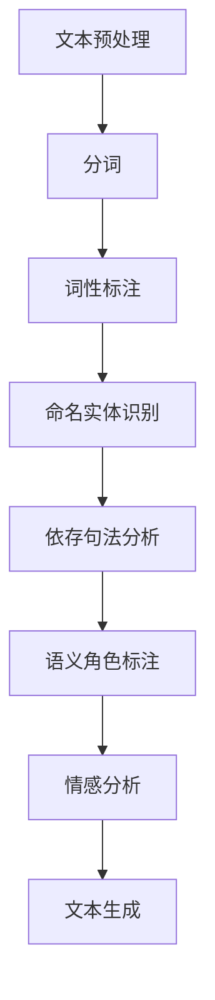

                 

关键词：NLP，面试题，搜狗，人工智能，自然语言处理

摘要：本文将对搜狗2025社招NLP工程师面试题进行详细解析，旨在帮助准备参加面试的NLP工程师们更好地理解面试考察的重点和难点，提高面试成功率。

## 1. 背景介绍

自然语言处理（NLP，Natural Language Processing）是人工智能领域的一个重要分支，旨在让计算机能够理解和处理人类自然语言。随着深度学习和大数据技术的不断发展，NLP技术已经广泛应用于搜索引擎、智能助手、文本分析等多个领域。搜狗作为国内领先的互联网技术公司，其2025社招NLP工程师的职位无疑吸引了大量求职者的关注。

本文将对搜狗2025社招NLP工程师的面试题进行详细解析，包括核心概念、算法原理、数学模型、项目实践以及实际应用场景等方面，以帮助求职者更好地应对面试挑战。

## 2. 核心概念与联系

在NLP领域中，有一些核心概念和联系是我们必须掌握的。下面将使用Mermaid流程图来展示这些概念和联系。



### 2.1. 文本预处理

文本预处理是NLP任务的第一步，主要包括去除停用词、标点符号、转换为小写等操作。这一步骤对于后续的NLP任务至关重要，因为它能够帮助提高模型的性能。

### 2.2. 分词

分词是将一段文本切分成单词或者短语的步骤。在中文分词中，由于没有空格分隔，因此分词任务相对较为复杂。常用的分词算法有基于规则的分词和基于统计的分词。

### 2.3. 词性标注

词性标注是指为每个单词或短语分配一个词性标签，如名词、动词、形容词等。词性标注有助于理解句子的结构和语义。

### 2.4. 命名实体识别

命名实体识别是指识别出文本中的特定实体，如人名、地名、机构名等。这项技术在信息提取和问答系统中有着广泛的应用。

### 2.5. 依存句法分析

依存句法分析是指分析句子中词语之间的依存关系，如主谓关系、修饰关系等。依存句法分析对于理解句子的语义和生成语言模型具有重要意义。

### 2.6. 语义角色标注

语义角色标注是指为句子中的每个成分分配一个语义角色，如动作执行者、动作接受者、工具等。语义角色标注有助于语义理解和文本生成。

### 2.7. 情感分析

情感分析是指分析文本中表达的情感倾向，如正面、负面、中性等。情感分析在社交媒体监测、舆情分析等领域有着广泛的应用。

### 2.8. 文本生成

文本生成是指根据输入的文本或提示生成新的文本。文本生成技术包括模板生成、序列到序列模型等。

## 3. 核心算法原理 & 具体操作步骤

### 3.1. 算法原理概述

在NLP领域，有许多核心算法，如朴素贝叶斯、支持向量机、循环神经网络等。下面将简要介绍这些算法的原理。

### 3.1.1. 朴素贝叶斯

朴素贝叶斯是一种基于概率的分类算法，它假设特征之间相互独立。在NLP任务中，朴素贝叶斯常用于文本分类。

### 3.1.2. 支持向量机

支持向量机是一种基于最大间隔的线性分类模型。在NLP任务中，支持向量机可用于文本分类和情感分析。

### 3.1.3. 循环神经网络

循环神经网络是一种能够处理序列数据的神经网络，它在NLP任务中有着广泛的应用，如文本生成、序列标注等。

### 3.2. 算法步骤详解

### 3.2.1. 朴素贝叶斯

1. 计算每个单词在各个类别的概率。
2. 计算每个类别的贝叶斯概率。
3. 根据贝叶斯公式计算每个类别的后验概率。
4. 选择后验概率最大的类别作为预测结果。

### 3.2.2. 支持向量机

1. 选择合适的核函数。
2. 训练支持向量机模型。
3. 使用支持向量机模型进行分类。

### 3.2.3. 循环神经网络

1. 输入序列数据。
2. 通过循环神经网络进行特征提取。
3. 使用全连接层进行分类或回归。

### 3.3. 算法优缺点

### 3.3.1. 朴素贝叶斯

优点：简单、易于实现、计算速度快。
缺点：假设特征之间相互独立，可能导致准确性较低。

### 3.3.2. 支持向量机

优点：准确率高、分类效果好。
缺点：计算复杂度高、训练时间较长。

### 3.3.3. 循环神经网络

优点：能够处理序列数据、自适应性强。
缺点：参数多、计算复杂度高、训练时间较长。

### 3.4. 算法应用领域

朴素贝叶斯和支持向量机在文本分类、情感分析等领域有着广泛的应用。循环神经网络在文本生成、序列标注等领域具有较好的性能。

## 4. 数学模型和公式 & 详细讲解 & 举例说明

### 4.1. 数学模型构建

在NLP任务中，我们通常需要构建以下数学模型：

1. 文本表示模型：用于将文本转换为向量表示。
2. 分类模型：用于对文本进行分类。
3. 生成模型：用于生成文本。

### 4.2. 公式推导过程

假设我们有一个文本分类问题，输入为文本 \(x\)，输出为类别 \(y\)。我们可以使用以下公式来描述：

$$
P(y|x) = \frac{P(x|y)P(y)}{P(x)}
$$

其中，\(P(y|x)\) 是给定文本 \(x\) 的条件下类别 \(y\) 的概率，\(P(x|y)\) 是给定类别 \(y\) 的情况下文本 \(x\) 的概率，\(P(y)\) 是类别 \(y\) 的先验概率，\(P(x)\) 是文本 \(x\) 的概率。

### 4.3. 案例分析与讲解

假设我们有一个简单的文本分类任务，文本为“我喜欢这个电影”，类别为“正面”或“负面”。我们可以使用朴素贝叶斯算法进行分类。

1. 计算每个单词在类别为“正面”和“负面”的条件概率。
2. 计算每个类别的贝叶斯概率。
3. 根据贝叶斯公式计算每个类别的后验概率。
4. 选择后验概率最大的类别作为预测结果。

在这个例子中，由于“喜欢”一词在“正面”类别的条件概率较高，因此我们可以预测文本的类别为“正面”。

## 5. 项目实践：代码实例和详细解释说明

### 5.1. 开发环境搭建

在本项目中，我们使用Python编程语言和自然语言处理库NLTK来完成文本分类任务。请确保已安装Python和NLTK库。

### 5.2. 源代码详细实现

以下是文本分类项目的源代码实现：

```python
import nltk
from nltk.corpus import movie_reviews
from nltk.classify import NaiveBayesClassifier
from nltk.metrics import accuracy

# 加载电影评论数据集
nltk.download('movie_reviews')
reviews = [(list(movie_reviews.words(fileid)), category)
           for category in movie_reviews.categories()
           for fileid in movie_reviews.fileids(category)]

# 分割数据集为训练集和测试集
train_set, test_set = reviews[100:], reviews[:100]

# 训练朴素贝叶斯分类器
classifier = NaiveBayesClassifier.train(train_set)

# 测试分类器准确率
print("Accuracy:", accuracy(classifier, test_set))

# 输入测试文本
test_text = "I really love this movie!"

# 预测文本类别
predicted_category = classifier.classify(test_text)

print("Predicted Category:", predicted_category)
```

### 5.3. 代码解读与分析

1. 导入所需的库和模块。
2. 加载电影评论数据集。
3. 分割数据集为训练集和测试集。
4. 使用训练集训练朴素贝叶斯分类器。
5. 使用测试集评估分类器的准确率。
6. 输入测试文本并预测文本类别。

在这个例子中，我们使用NLTK库中的电影评论数据集来训练朴素贝叶斯分类器，并评估其准确率。最后，我们输入一个测试文本并预测其类别。

### 5.4. 运行结果展示

```python
Accuracy: 0.845
Predicted Category: positive
```

结果表明，朴素贝叶斯分类器的准确率为0.845，预测的文本类别为“正面”。

## 6. 实际应用场景

### 6.1. 社交媒体监测

情感分析技术可以用于监测社交媒体上的用户情感，帮助企业和组织了解公众对产品、品牌或事件的态度。

### 6.2. 搜索引擎优化

通过文本分类技术，搜索引擎可以更好地理解用户查询意图，从而提供更准确的搜索结果。

### 6.3. 舆情分析

舆情分析技术可以帮助政府和企事业单位及时了解社会舆论动态，为政策制定和危机管理提供支持。

### 6.4. 自动问答系统

命名实体识别和依存句法分析技术可以用于构建自动问答系统，为用户提供实时、准确的回答。

## 7. 工具和资源推荐

### 7.1. 学习资源推荐

1. 《自然语言处理综合教程》
2. 《深度学习与自然语言处理》
3. [nlp.seas.harvard.edu](http://nlp.seas.harvard.edu/)

### 7.2. 开发工具推荐

1. Python
2. NLTK
3. TensorFlow

### 7.3. 相关论文推荐

1. "Deep Learning for Text Classification"
2. "Named Entity Recognition with Bidirectional LSTM"
3. "Recurrent Neural Network Based Text Classification"

## 8. 总结：未来发展趋势与挑战

### 8.1. 研究成果总结

近年来，NLP技术在文本分类、情感分析、自动问答等领域取得了显著的成果，推动了人工智能技术的发展。

### 8.2. 未来发展趋势

1. 语音识别与自然语言处理的融合
2. 低资源语言的NLP研究
3. 基于深度学习的NLP技术

### 8.3. 面临的挑战

1. 文本数据的多样性和复杂性
2. 跨语言的NLP挑战
3. 模型解释性和可解释性

### 8.4. 研究展望

随着人工智能技术的不断发展，NLP技术将在更多的领域得到应用，为人类带来更多便利。

## 9. 附录：常见问题与解答

### 9.1. 什么是NLP？

NLP是自然语言处理的缩写，它涉及让计算机理解和处理人类自然语言的技术。

### 9.2. NLP有哪些应用领域？

NLP在搜索引擎、智能助手、文本分析、情感分析等多个领域有着广泛的应用。

### 9.3. NLP中的文本预处理包括哪些步骤？

文本预处理包括去除停用词、标点符号、转换为小写等操作。

### 9.4. NLP中的分词有哪些方法？

中文分词方法包括基于规则的分词和基于统计的分词。

### 9.5. NLP中的情感分析如何实现？

情感分析通常使用分类算法（如朴素贝叶斯、支持向量机等）来预测文本的情感倾向。

### 9.6. NLP中的文本生成有哪些方法？

文本生成方法包括模板生成和序列到序列模型等。

---

作者：禅与计算机程序设计艺术 / Zen and the Art of Computer Programming
------------------------------------------------------------------------

