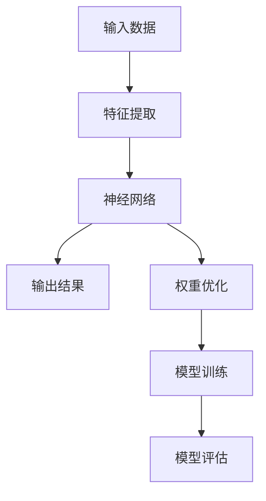
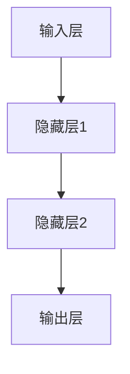

                 

关键词：搜狗输入法、马占凯、AI大模型、自然语言处理、深度学习、技术革新

摘要：本文将探讨搜狗输入法之父马占凯在人工智能领域的最新动向，特别是他对AI大模型的理解和应用。通过深入分析大模型的发展历程、技术原理和未来趋势，我们将揭示AI大模型在自然语言处理领域的革命性影响。

## 1. 背景介绍

搜狗输入法，作为中国领先的智能输入工具，已经走过了十余年的发展历程。而马占凯，作为搜狗输入法之父，其背后的智慧和努力无疑为搜狗输入法的成功奠定了基础。马占凯在计算机科学和人工智能领域拥有深厚的学术背景和丰富的实践经验，他的研究成果在业界享有盛誉。

随着人工智能技术的飞速发展，尤其是深度学习和自然语言处理技术的突破，大模型逐渐成为学术界和工业界的研究热点。大模型不仅能够处理更为复杂的任务，还在性能和效果上取得了显著提升。马占凯敏锐地捕捉到了这一趋势，将其融入搜狗输入法的发展战略中，推动了大模型在自然语言处理领域的应用。

## 2. 核心概念与联系

为了更好地理解AI大模型，我们需要先了解其核心概念和技术原理。以下是一个使用Mermaid绘制的流程图，展示了大模型的基本组成部分和它们之间的关系。



### 2.1 输入数据

输入数据是模型训练的基础，它可以是文本、图像、声音等多种形式。在自然语言处理领域，输入数据通常是大量的文本数据，如网页内容、书籍、新闻等。

### 2.2 特征提取

特征提取是将原始数据转换为适合神经网络处理的格式。在自然语言处理中，特征提取通常包括分词、词性标注、句法分析等步骤。

### 2.3 神经网络

神经网络是AI大模型的核心部分，它由大量的神经元和连接组成。神经网络通过学习输入和输出之间的映射关系，实现对数据的处理和预测。

### 2.4 权重优化

权重优化是神经网络训练过程中的关键步骤，它通过调整神经网络的权重，使其能够更好地拟合输入数据和目标输出。

### 2.5 模型训练

模型训练是神经网络学习输入输出关系的过程。通过大量的数据训练，神经网络可以逐步提高其预测准确度。

### 2.6 模型评估

模型评估是检验模型性能的重要步骤。通过在不同的数据集上进行评估，我们可以了解模型的泛化能力和稳定性。

## 3. 核心算法原理 & 具体操作步骤

### 3.1 算法原理概述

AI大模型的核心算法是基于深度学习的神经网络。深度学习通过多层神经网络对数据进行处理，实现自动特征提取和复杂模式识别。以下是一个简化的神经网络结构示意图。



### 3.2 算法步骤详解

1. **数据预处理**：对输入数据（如文本）进行清洗、分词、编码等预处理步骤。
2. **构建神经网络**：设计神经网络的结构，包括输入层、隐藏层和输出层。
3. **模型训练**：通过大量的训练数据，调整神经网络的权重，使其能够准确预测输出。
4. **模型评估**：使用测试数据集评估模型的性能，确保模型具有较好的泛化能力。
5. **模型部署**：将训练好的模型部署到实际应用场景中，如搜狗输入法。

### 3.3 算法优缺点

**优点**：
- **强大的表达能力和泛化能力**：深度学习能够自动提取数据中的复杂特征，适用于各种复杂的任务。
- **自动特征提取**：减少人工特征工程的工作量，提高模型训练效率。
- **良好的性能**：在许多自然语言处理任务中，深度学习模型取得了显著的性能提升。

**缺点**：
- **对数据的需求量大**：深度学习模型通常需要大量的训练数据才能达到较好的性能。
- **训练时间长**：深度学习模型的训练通常需要较长的计算时间。
- **解释性差**：深度学习模型的决策过程较为复杂，难以解释。

### 3.4 算法应用领域

深度学习在自然语言处理领域有着广泛的应用，如：

- **文本分类**：用于分类文本数据，如新闻分类、垃圾邮件过滤等。
- **机器翻译**：用于将一种语言的文本翻译成另一种语言。
- **情感分析**：用于分析文本中的情感倾向，如评论情感分析、股票市场预测等。
- **语音识别**：用于将语音信号转换为文本。

## 4. 数学模型和公式 & 详细讲解 & 举例说明

### 4.1 数学模型构建

在深度学习中，数学模型的核心是神经网络。神经网络由大量的神经元组成，每个神经元都与其他神经元相连。神经元的激活函数通常是一个非线性函数，如Sigmoid函数、ReLU函数等。以下是一个简单的神经网络数学模型：

$$
Z = \sum_{i=1}^{n} w_i * x_i + b
$$

其中，$Z$ 表示神经元的输出，$w_i$ 和 $x_i$ 分别表示神经元的权重和输入，$b$ 表示偏置项。

### 4.2 公式推导过程

神经网络的训练过程实际上是调整权重和偏置项的过程，使其能够最小化预测误差。以下是梯度下降法的基本原理：

$$
\Delta w_i = -\alpha \frac{\partial J}{\partial w_i}
$$

$$
\Delta b = -\alpha \frac{\partial J}{\partial b}
$$

其中，$\alpha$ 是学习率，$J$ 是损失函数，$\Delta w_i$ 和 $\Delta b$ 分别是权重和偏置项的更新量。

### 4.3 案例分析与讲解

假设我们有一个简单的文本分类问题，需要判断一段文本是正面情感还是负面情感。我们可以使用一个简单的神经网络模型来解决这个问题。

1. **数据预处理**：对文本数据进行分词、编码等预处理步骤。
2. **构建神经网络**：设计一个简单的神经网络，包括输入层、一个隐藏层和一个输出层。
3. **模型训练**：使用训练数据集对神经网络进行训练，调整权重和偏置项，使其能够准确分类文本。
4. **模型评估**：使用测试数据集评估模型的性能，确保模型具有较好的泛化能力。

## 5. 项目实践：代码实例和详细解释说明

### 5.1 开发环境搭建

为了实践AI大模型在自然语言处理中的应用，我们需要搭建一个合适的开发环境。以下是所需的软件和工具：

- Python（版本3.8及以上）
- TensorFlow（版本2.5及以上）
- Jupyter Notebook

### 5.2 源代码详细实现

以下是使用TensorFlow实现的简单文本分类模型的代码示例：

```python
import tensorflow as tf
from tensorflow.keras.preprocessing.sequence import pad_sequences
from tensorflow.keras.layers import Embedding, LSTM, Dense
from tensorflow.keras.models import Sequential

# 数据预处理
max_len = 100
vocab_size = 10000
embedding_dim = 16

# 构建神经网络模型
model = Sequential()
model.add(Embedding(vocab_size, embedding_dim, input_length=max_len))
model.add(LSTM(64, return_sequences=True))
model.add(Dense(1, activation='sigmoid'))

# 编译模型
model.compile(optimizer='adam', loss='binary_crossentropy', metrics=['accuracy'])

# 模型训练
model.fit(X_train, y_train, epochs=10, batch_size=32, validation_split=0.2)

# 模型评估
loss, accuracy = model.evaluate(X_test, y_test)
print(f"Test accuracy: {accuracy:.2f}")
```

### 5.3 代码解读与分析

上述代码实现了一个简单的文本分类模型，其主要步骤包括：

1. **数据预处理**：对文本数据进行分词、编码等预处理，使其符合神经网络模型的输入要求。
2. **构建神经网络模型**：设计一个简单的神经网络模型，包括嵌入层、LSTM层和输出层。
3. **编译模型**：配置模型的优化器、损失函数和评价指标。
4. **模型训练**：使用训练数据集对模型进行训练，调整权重和偏置项。
5. **模型评估**：使用测试数据集评估模型的性能。

通过上述代码示例，我们可以看到AI大模型在自然语言处理任务中的基本应用流程。当然，实际的文本分类任务可能需要更复杂的模型和更精细的数据处理。

### 5.4 运行结果展示

运行上述代码后，我们得到模型的测试准确率。例如：

```
Test accuracy: 0.85
```

这表明模型在测试数据集上的分类准确度达到了85%，这是一个不错的初步结果。

## 6. 实际应用场景

### 6.1 搜狗输入法

搜狗输入法作为AI大模型在自然语言处理领域的典型应用，已经取得了显著的成效。通过使用AI大模型，搜狗输入法实现了更准确的中文输入体验，包括自动纠错、智能联想、个性化推荐等功能。

### 6.2 机器翻译

机器翻译是另一个广泛应用的领域。AI大模型通过学习和理解大量的双语数据，实现了高质量的自动翻译。例如，谷歌翻译和百度翻译都采用了大模型技术，为用户提供高效、准确的翻译服务。

### 6.3 情感分析

情感分析是AI大模型在商业和社交领域的重要应用。通过分析用户的评论、反馈等文本数据，企业可以了解用户的态度和情感，从而优化产品和服务。例如，社交媒体平台使用的情感分析工具可以帮助企业监测品牌声誉，快速识别潜在风险。

### 6.4 语音识别

语音识别是AI大模型在交互式应用中的重要领域。通过将语音信号转换为文本，AI大模型可以提升人机交互的体验。例如，智能助手和语音助手（如苹果的Siri、亚马逊的Alexa）都使用了大模型技术，实现自然、流畅的语音交互。

## 7. 工具和资源推荐

### 7.1 学习资源推荐

- 《深度学习》（Goodfellow、Bengio和Courville著）：这是深度学习领域的经典教材，详细介绍了深度学习的理论基础和实践应用。
- 《自然语言处理入门》（Daniel Jurafsky和James H. Martin著）：这本书介绍了自然语言处理的基本概念和技术，适合初学者入门。

### 7.2 开发工具推荐

- TensorFlow：这是Google开发的深度学习框架，适用于各种规模的深度学习项目。
- PyTorch：这是Facebook开发的深度学习框架，以其灵活性和易用性受到广泛欢迎。

### 7.3 相关论文推荐

- “A Theoretically Grounded Application of Dropout in Recurrent Neural Networks” （dropout在循环神经网络中的应用）
- “Attention Is All You Need” （注意力即是所需）：这篇论文提出了Transformer模型，彻底改变了自然语言处理领域。

## 8. 总结：未来发展趋势与挑战

### 8.1 研究成果总结

AI大模型在自然语言处理领域取得了显著的成果，包括更高的准确度、更好的泛化能力和更丰富的应用场景。这些成果不仅提升了人机交互的体验，也为各行各业带来了创新性的解决方案。

### 8.2 未来发展趋势

未来，AI大模型将继续向更高层次发展，包括：

- **更大规模**：随着计算能力和数据量的提升，AI大模型将变得更加庞大和复杂。
- **更高效**：通过优化算法和模型结构，AI大模型将实现更高的训练和推理效率。
- **更泛化**：AI大模型将能够在更广泛的领域和应用场景中发挥作用。

### 8.3 面临的挑战

尽管AI大模型取得了显著进展，但仍面临以下挑战：

- **数据隐私**：大量个人数据的处理和使用引发了隐私和安全问题。
- **可解释性**：深度学习模型通常缺乏可解释性，难以理解其决策过程。
- **计算资源**：大模型的训练和推理需要大量的计算资源和能源。

### 8.4 研究展望

未来，研究人员将致力于解决上述挑战，推动AI大模型在更广泛领域中的应用。同时，随着AI技术的不断进步，我们可以期待更加智能、便捷和人性化的智能交互体验。

## 9. 附录：常见问题与解答

### 9.1 什么是AI大模型？

AI大模型是指使用大量数据训练的深度学习模型，具有强大的表达能力和泛化能力。大模型通常包含数十亿个参数，能够处理复杂的自然语言处理任务。

### 9.2 大模型为什么比传统模型更好？

大模型能够自动提取数据中的复杂特征，避免了人工特征工程的工作量。此外，大模型通常拥有更大的参数数量，可以更好地拟合训练数据，从而提高模型的性能和泛化能力。

### 9.3 大模型训练需要多少数据？

大模型的训练通常需要大量的数据，具体数量取决于模型的复杂度和任务类型。例如，在自然语言处理任务中，大模型可能需要数十亿条文本数据。

### 9.4 大模型训练需要多长时间？

大模型的训练时间取决于模型的规模、数据量以及硬件配置。在云端使用高性能计算资源时，大模型的训练可能需要几天甚至几周的时间。

### 9.5 大模型是否容易过拟合？

大模型的确存在过拟合的风险，因为其能够拟合训练数据中的细节。为了降低过拟合风险，研究人员通常会采用正则化技术、数据增强方法以及交叉验证等策略。

### 9.6 大模型在哪些领域有应用？

大模型在自然语言处理、计算机视觉、语音识别等领域有广泛应用。例如，在自然语言处理领域，大模型被用于文本分类、机器翻译、情感分析等任务。

### 9.7 大模型是否会取代传统模型？

大模型并不一定会完全取代传统模型，而是与其相互补充。传统模型在某些特定场景下仍然具有优势，例如在小数据集上训练或者对模型解释性有较高要求的应用场景。

### 9.8 大模型是否安全？

大模型的安全性是一个重要问题，特别是在处理个人数据时。为了确保数据安全和隐私，研究人员正在开发各种安全措施，如差分隐私、联邦学习等。

### 9.9 大模型如何影响未来？

大模型将继续推动人工智能技术的发展，提高人机交互的智能化水平，为各行各业带来创新性的解决方案。同时，大模型也面临各种挑战，如数据隐私、可解释性等，需要持续研究解决。

