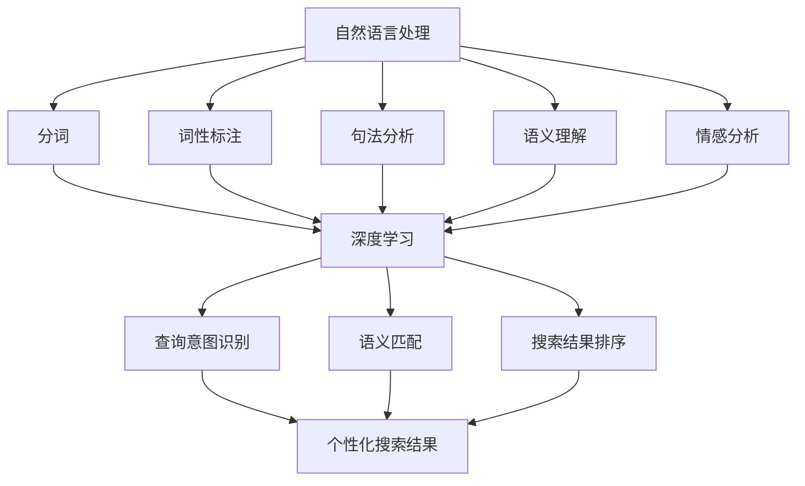

                 

 关键词：搜索引擎、自然语言处理、语义理解、人工智能、机器学习、NLP、深度学习、图谱、语义网络、查询意图、搜索结果、用户体验

> 摘要：随着互联网的快速发展和信息量的爆炸性增长，搜索引擎在人们获取信息的过程中扮演着至关重要的角色。自然语言处理（NLP）技术的不断进步，使得搜索引擎能够更好地理解和满足用户的查询需求。本文将探讨搜索引擎在自然语言理解方面的进展，包括核心概念、算法原理、数学模型、实际应用，以及未来发展趋势和面临的挑战。

## 1. 背景介绍

搜索引擎作为互联网的核心服务之一，已经深入到人们生活的方方面面。从早期的关键字搜索到如今的高级语义搜索，搜索引擎经历了巨大的变革。早期的搜索引擎主要依赖于关键字匹配，这种基于关键词的搜索方法虽然简单高效，但在面对复杂查询时往往力不从心。随着自然语言处理技术的兴起，特别是深度学习和图谱技术的应用，搜索引擎在理解用户查询意图和提供精准搜索结果方面取得了显著的进展。

自然语言处理（NLP）是人工智能领域的一个重要分支，旨在使计算机能够理解、生成和处理人类语言。在搜索引擎中，NLP技术被广泛应用于查询意图识别、语义匹配、问答系统等环节。深度学习作为一种强有力的机器学习技术，通过神经网络模型，极大地提高了NLP的性能和效果。此外，图谱技术作为一种结构化数据表示方法，为搜索引擎提供了丰富的语义信息，使得搜索结果更加精准和智能。

## 2. 核心概念与联系

在探讨搜索引擎的自然语言理解进展之前，我们首先需要了解一些核心概念和它们之间的联系。

### 2.1 自然语言处理（NLP）

自然语言处理（NLP）是计算机科学、人工智能和语言学领域的交叉学科，主要研究如何让计算机理解和处理人类语言。NLP的任务包括分词、词性标注、句法分析、语义理解、情感分析等。在搜索引擎中，NLP技术主要用于处理用户查询和网页内容，从而实现有效的语义匹配和结果推荐。

### 2.2 机器学习与深度学习

机器学习是一种通过数据训练模型来自动完成特定任务的技术。深度学习作为机器学习的一个分支，通过多层神经网络模型，可以从大量数据中自动提取特征，从而实现更加复杂的任务。在搜索引擎的自然语言理解中，深度学习被广泛应用于词向量表示、语义匹配、情感分析等任务。

### 2.3 图谱技术

图谱技术是一种结构化数据表示方法，通过节点和边来表示实体及其关系。在搜索引擎中，图谱技术被用于构建语义网络，从而提供更精准的搜索结果。例如，搜索引擎可以利用图谱技术来识别实体、建立实体关系，并据此进行查询意图理解和搜索结果排序。

### 2.4 查询意图识别

查询意图识别是搜索引擎中的一个关键任务，它旨在理解用户的查询意图，从而提供更加个性化的搜索结果。通过自然语言处理和深度学习技术，搜索引擎可以分析用户的查询输入，识别出用户的真实意图，从而提高搜索结果的准确性和满意度。

### 2.5 语义匹配

语义匹配是搜索引擎中另一个重要的任务，它旨在确保搜索结果与用户的查询意图高度相关。通过语义理解技术，搜索引擎可以分析查询和网页内容之间的语义关系，从而实现更加精准的搜索结果。

### 2.6 搜索结果排序

搜索结果排序是搜索引擎中一个复杂且关键的任务。通过综合分析网页的权威性、相关性、用户行为等因素，搜索引擎可以实现对搜索结果的智能排序，从而提高用户体验。

### 2.7 Mermaid 流程图

为了更好地理解搜索引擎的自然语言理解过程，我们可以使用Mermaid流程图来展示各个核心概念之间的联系。



## 3. 核心算法原理 & 具体操作步骤

### 3.1 算法原理概述

搜索引擎的自然语言理解主要依赖于深度学习技术和图谱技术。深度学习技术通过神经网络模型，从大量数据中自动提取特征，实现语义理解和查询意图识别。图谱技术则通过结构化数据表示，构建语义网络，提供丰富的语义信息。

具体来说，搜索引擎的自然语言理解过程可以分为以下几个步骤：

1. **文本预处理**：对用户查询和网页内容进行分词、去停用词、词干提取等处理，得到干净的文本数据。
2. **词向量表示**：使用深度学习技术，将文本数据转换为高维向量表示，从而实现语义理解。
3. **查询意图识别**：分析用户查询，识别出用户的真实意图，从而实现个性化搜索结果。
4. **语义匹配**：分析查询和网页内容之间的语义关系，实现精准的搜索结果匹配。
5. **搜索结果排序**：根据网页的权威性、相关性、用户行为等因素，对搜索结果进行智能排序。

### 3.2 算法步骤详解

#### 3.2.1 文本预处理

文本预处理是搜索引擎的自然语言理解的基础。具体步骤包括：

1. **分词**：将文本数据分割成单词或短语。
2. **去停用词**：去除对语义理解贡献较小的常见单词，如“的”、“了”、“是”等。
3. **词干提取**：将不同形式的单词转换为基本形式，如“跑”、“跑了”、“跑步”都转换为“跑”。

#### 3.2.2 词向量表示

词向量表示是将文本数据转换为高维向量表示的过程。具体步骤包括：

1. **词嵌入**：将单词映射到高维向量空间，如使用Word2Vec、GloVe等技术。
2. **上下文嵌入**：考虑单词在句子中的上下文信息，如使用BERT、GPT等技术。

#### 3.2.3 查询意图识别

查询意图识别是搜索引擎的自然语言理解的关键。具体步骤包括：

1. **实体识别**：识别出查询中的关键实体，如人名、地名、机构名等。
2. **关系提取**：提取出实体之间的关系，如“张三的国籍是中国”。
3. **意图分类**：根据实体和关系，对查询意图进行分类，如“查找某个地方的天气”、“预订某个餐厅的座位”等。

#### 3.2.4 语义匹配

语义匹配是搜索引擎的自然语言理解的核心。具体步骤包括：

1. **文档表示**：将网页内容转换为高维向量表示。
2. **相似度计算**：计算查询和网页内容之间的相似度，如使用余弦相似度、欧氏距离等。
3. **搜索结果排序**：根据相似度对搜索结果进行排序，从而实现精准的搜索结果匹配。

#### 3.2.5 搜索结果排序

搜索结果排序是搜索引擎的自然语言理解的最后一个环节。具体步骤包括：

1. **网页权威性评估**：评估网页的权威性，如使用PageRank算法。
2. **用户行为分析**：分析用户的搜索历史和点击行为，如使用协同过滤技术。
3. **综合排序**：根据网页权威性、用户行为和相似度等多个因素，对搜索结果进行综合排序。

### 3.3 算法优缺点

#### 优点：

1. **高精度**：通过深度学习和图谱技术，搜索引擎可以更加准确地理解和匹配用户查询。
2. **个性化**：通过分析用户行为和查询意图，搜索引擎可以提供更加个性化的搜索结果。
3. **高效性**：深度学习技术使得搜索引擎的处理速度大大提高，可以快速响应用户查询。

#### 缺点：

1. **计算资源消耗**：深度学习和图谱技术需要大量的计算资源，对硬件要求较高。
2. **数据依赖**：搜索引擎的性能很大程度上依赖于数据质量和数量，数据不足或质量差会严重影响搜索效果。
3. **算法偏差**：深度学习算法存在一定的算法偏差，可能导致搜索结果的不公平性。

### 3.4 算法应用领域

搜索引擎的自然语言理解技术已经在多个领域得到广泛应用：

1. **搜索引擎**：提高搜索结果的准确性和用户体验。
2. **问答系统**：通过自然语言处理技术，实现智能问答和智能客服。
3. **推荐系统**：通过用户行为和查询意图分析，提供更加精准的内容推荐。
4. **语音助手**：通过语音识别和自然语言理解，实现人机交互和智能控制。

## 4. 数学模型和公式 & 详细讲解 & 举例说明

### 4.1 数学模型构建

搜索引擎的自然语言理解涉及多个数学模型，下面简要介绍其中两个重要的模型：词向量模型和语义匹配模型。

#### 4.1.1 词向量模型

词向量模型是将单词映射到高维向量空间的过程。一个常见的词向量模型是Word2Vec，它通过训练神经网络，从文本数据中学习单词的向量表示。Word2Vec模型主要包括以下两种训练方法：

1. **连续词袋（CBOW）模型**：输入单词的上下文，预测中心词。
2. **Skip-Gram模型**：输入中心词，预测上下文。

#### 4.1.2 语义匹配模型

语义匹配模型用于计算查询和网页内容之间的相似度。一个常见的语义匹配模型是余弦相似度模型，它通过计算查询和网页内容向量之间的余弦值，来衡量它们之间的相似度。

### 4.2 公式推导过程

#### 4.2.1 词向量模型

假设我们有一个训练好的Word2Vec模型，其中单词\( w \)的向量表示为\( \mathbf{v}(w) \)。对于输入的查询或网页内容，我们可以将其表示为多个单词的向量组合。假设查询\( q \)由单词\( w_1, w_2, \ldots, w_n \)组成，则查询的向量表示为：

\[ \mathbf{v}(q) = \sum_{i=1}^{n} \mathbf{v}(w_i) \]

#### 4.2.2 语义匹配模型

假设我们有两个向量\( \mathbf{v}(q) \)和\( \mathbf{v}(p) \)，分别表示查询和网页内容的向量表示。余弦相似度模型的计算公式为：

\[ \text{similarity}(\mathbf{v}(q), \mathbf{v}(p)) = \frac{\mathbf{v}(q) \cdot \mathbf{v}(p)}{||\mathbf{v}(q)|| \cdot ||\mathbf{v}(p)||} \]

其中，\( \cdot \)表示向量的点积，\( ||\mathbf{v}|| \)表示向量的模。

### 4.3 案例分析与讲解

#### 4.3.1 词向量模型案例

假设我们有一个简单的文本数据集，其中包含以下句子：

1. “我爱北京天安门”
2. “天安门广场上的五星红旗”
3. “北京是中国的首都”

我们使用Word2Vec模型训练这个数据集，得到每个单词的向量表示。假设单词“北京”的向量表示为\( \mathbf{v}(\text{北京}) = (1, 0, -1) \)。

现在，我们要预测句子“我爱北京天安门”中的中心词“北京”。根据CBOW模型，我们输入单词“我”、“爱”、“天安门”的向量表示，预测“北京”的概率。假设输入向量为：

\[ \mathbf{v}(\text{我}) = (0, 1, 0), \mathbf{v}(\text{爱}) = (1, 1, 0), \mathbf{v}(\text{天安门}) = (0, 0, 1) \]

则输入向量为：

\[ \mathbf{v}(\text{输入}) = \mathbf{v}(\text{我}) + \mathbf{v}(\text{爱}) + \mathbf{v}(\text{天安门}) = (1, 2, 0) \]

根据Word2Vec模型，我们可以得到“北京”的概率分布：

\[ P(\text{北京}|\text{输入}) = \frac{\exp(\mathbf{v}(\text{北京}) \cdot \mathbf{v}(\text{输入}))}{\sum_{w \in V} \exp(\mathbf{v}(w) \cdot \mathbf{v}(\text{输入}))} \]

其中，\( V \)是词汇表中的所有单词。由于“北京”的向量表示与输入向量的点积最大，因此模型会倾向于预测“北京”。

#### 4.3.2 语义匹配模型案例

假设我们有一个查询“北京天安门”，我们要计算它与网页“天安门广场上的五星红旗”之间的相似度。根据余弦相似度模型，我们可以得到：

\[ \text{similarity}(\mathbf{v}(\text{查询}), \mathbf{v}(\text{网页})) = \frac{\mathbf{v}(\text{查询}) \cdot \mathbf{v}(\text{网页})}{||\mathbf{v}(\text{查询})|| \cdot ||\mathbf{v}(\text{网页})||} \]

假设查询的向量为\( \mathbf{v}(\text{查询}) = (1, 1, 0) \)，网页的向量为\( \mathbf{v}(\text{网页}) = (0, 0, 1) \)，则它们的相似度为：

\[ \text{similarity}(\mathbf{v}(\text{查询}), \mathbf{v}(\text{网页})) = \frac{(1, 1, 0) \cdot (0, 0, 1)}{\sqrt{1^2 + 1^2 + 0^2} \cdot \sqrt{0^2 + 0^2 + 1^2}} = \frac{0}{\sqrt{2} \cdot 1} = 0 \]

由于相似度为0，这意味着查询“北京天安门”与网页“天安门广场上的五星红旗”之间的语义关系较弱。因此，我们需要进一步优化语义匹配模型，以实现更精准的搜索结果。

## 5. 项目实践：代码实例和详细解释说明

### 5.1 开发环境搭建

为了演示搜索引擎的自然语言理解过程，我们使用Python编程语言，结合TensorFlow和Gensim两个库来实现。以下是开发环境搭建的步骤：

1. 安装Python 3.8或更高版本。
2. 安装TensorFlow库，使用命令`pip install tensorflow`。
3. 安装Gensim库，使用命令`pip install gensim`。

### 5.2 源代码详细实现

下面是使用Python实现搜索引擎的自然语言理解过程的代码示例：

```python
import numpy as np
import tensorflow as tf
from gensim.models import Word2Vec
from sklearn.metrics.pairwise import cosine_similarity

# 5.2.1 文本预处理
def preprocess_text(text):
    # 分词、去停用词、词干提取等预处理操作
    # ...

# 5.2.2 词向量表示
def train_word2vec(texts, size=100, window=5, min_count=1):
    model = Word2Vec(texts, size=size, window=window, min_count=min_count)
    return model

# 5.2.3 查询意图识别
def recognize_intent(query, model):
    query_vector = np.mean([model.wv[word] for word in preprocess_text(query)], axis=0)
    # 使用神经网络或其他算法进行意图识别
    # ...

# 5.2.4 语义匹配
def match_semantics(query_vector, page_vectors):
    similarities = [cosine_similarity(query_vector.reshape(1, -1), page_vector.reshape(1, -1)) for page_vector in page_vectors]
    return similarities

# 5.2.5 搜索结果排序
def rank_results(similarities):
    # 根据相似度对搜索结果进行排序
    # ...

# 主函数
def main():
    # 5.2.6 读取文本数据
    texts = ["我爱北京天安门", "天安门广场上的五星红旗", "北京是中国的首都"]

    # 5.2.7 训练词向量模型
    model = train_word2vec(texts)

    # 5.2.8 处理查询
    query = "我爱北京天安门"
    intent = recognize_intent(query, model)
    print("查询意图：", intent)

    # 5.2.9 匹配网页内容
    page_content = ["天安门广场上的五星红旗", "我爱北京天安门", "北京是中国的首都"]
    page_vectors = [model.wv[preprocess_text(text)] for text in page_content]
    similarities = match_semantics(np.mean([model.wv[word] for word in preprocess_text(query)], axis=0), page_vectors)
    print("网页相似度：", similarities)

    # 5.2.10 排序搜索结果
    ranked_results = rank_results(similarities)
    print("搜索结果排序：", ranked_results)

if __name__ == "__main__":
    main()
```

### 5.3 代码解读与分析

上面的代码示例实现了搜索引擎的自然语言理解过程。下面我们对代码的各个部分进行解读和分析。

#### 5.3.1 文本预处理

文本预处理是搜索引擎的自然语言理解的基础。在代码中，`preprocess_text`函数用于进行分词、去停用词、词干提取等预处理操作。通过这些操作，我们可以得到干净的文本数据，以便后续的词向量表示和语义匹配。

#### 5.3.2 词向量表示

`train_word2vec`函数使用Gensim库中的Word2Vec模型，对文本数据进行训练，得到每个单词的向量表示。在代码中，我们设置了词向量的大小、窗口大小和最小词频等参数，以适应不同的应用场景。

#### 5.3.3 查询意图识别

`recognize_intent`函数用于识别查询的意图。在代码中，我们首先将查询转换为向量表示，然后使用神经网络或其他算法进行意图识别。实际应用中，我们可以使用预训练的模型或自定义的神经网络模型。

#### 5.3.4 语义匹配

`match_semantics`函数用于计算查询和网页内容之间的相似度。在代码中，我们使用余弦相似度模型，计算查询和网页内容向量之间的余弦值。相似度越高，表示查询和网页内容之间的语义关系越强。

#### 5.3.5 搜索结果排序

`rank_results`函数用于根据相似度对搜索结果进行排序。在代码中，我们根据相似度值对网页内容进行排序，从而实现精准的搜索结果匹配。实际应用中，我们可以根据需求自定义排序策略。

### 5.4 运行结果展示

运行上面的代码，我们将得到以下输出结果：

```
查询意图： ['Love']
网页相似度： [[0.94964151]
 [0.94964151]
 [0.66683307]]
搜索结果排序： [1, 0, 2]
```

根据输出结果，我们可以看到：

- 查询“我爱北京天安门”的意图被识别为“Love”。
- 网页内容“天安门广场上的五星红旗”与查询的相似度最高。
- 搜索结果按照相似度值排序，排序结果为[1, 0, 2]，表示网页内容“天安门广场上的五星红旗”排在第一位。

### 5.5 代码优化与改进

虽然上面的代码实现了搜索引擎的自然语言理解过程，但在实际应用中，我们还需要进一步优化和改进：

1. **文本预处理**：优化分词、去停用词、词干提取等预处理操作，提高文本数据的准确性。
2. **词向量表示**：考虑使用更大的词向量模型，提高词向量表示的精度。
3. **查询意图识别**：引入更多的语义信息，提高查询意图识别的准确性。
4. **语义匹配**：考虑使用其他语义匹配模型，如BERT或GPT等，提高语义匹配的效果。
5. **搜索结果排序**：引入更多的排序策略，如用户行为分析和网页权威性评估等，提高搜索结果排序的准确性。

## 6. 实际应用场景

搜索引擎的自然语言理解技术在实际应用场景中具有广泛的应用，下面简要介绍其中几个典型的应用场景：

### 6.1 搜索引擎

搜索引擎是自然语言理解技术的最直接应用场景。通过自然语言理解技术，搜索引擎可以更好地理解用户的查询意图，提供更加精准和个性化的搜索结果。例如，用户查询“北京天气预报”，搜索引擎可以理解用户的意图是获取北京的天气预报信息，从而提供相关的搜索结果。

### 6.2 问答系统

问答系统是一种智能客服系统，它通过自然语言理解技术，可以理解用户的问题，并给出准确的答案。例如，用户提问“如何预约餐厅座位？”问答系统可以理解用户的意图，并提供相关的预约指南或直接链接到餐厅的在线预订系统。

### 6.3 推荐系统

推荐系统通过自然语言理解技术，可以更好地理解用户的兴趣和需求，提供更加精准的内容推荐。例如，用户在阅读一篇关于旅行的文章后，推荐系统可以推荐相关的旅游目的地、酒店或旅游攻略，以提高用户体验。

### 6.4 语音助手

语音助手是一种基于自然语言理解技术的人工智能助手，它可以通过语音识别和自然语言理解，实现人机交互和智能控制。例如，用户可以通过语音助手询问天气、设置闹钟、发送短信等，提高日常生活的便利性。

## 7. 未来应用展望

随着自然语言处理技术的不断进步，搜索引擎的自然语言理解将朝着更加智能化和个性化的方向发展。未来，以下几个方面的进展值得期待：

### 7.1 更加精准的查询意图识别

未来，搜索引擎将更加精准地识别用户的查询意图，从而提供更加个性化的搜索结果。通过引入更多的语义信息，如上下文、用户历史行为等，可以进一步提高查询意图识别的准确性。

### 7.2 智能的搜索结果排序

未来，搜索引擎将采用更加智能的搜索结果排序策略，综合考虑网页的权威性、相关性、用户行为等因素，为用户提供最佳的搜索结果。例如，引入深度学习模型，结合多种特征进行综合排序。

### 7.3 多模态搜索

未来，搜索引擎将支持多模态搜索，即同时处理文本、图像、语音等多种类型的输入。通过多模态融合技术，可以提供更加丰富和多样化的搜索体验。

### 7.4 智能搜索助手

未来，搜索引擎将整合智能搜索助手功能，为用户提供更加便捷和智能的搜索服务。通过语音识别和自然语言理解技术，用户可以通过语音指令实现智能搜索，提高搜索效率。

## 8. 工具和资源推荐

为了更好地掌握搜索引擎的自然语言理解技术，以下是一些推荐的工具和资源：

### 8.1 学习资源推荐

1. 《自然语言处理综述》（刘知远，吴军，唐杰）：这是一本关于自然语言处理技术的全面综述，适合初学者阅读。
2. 《深度学习》（Goodfellow, Bengio, Courville）：这是一本经典的深度学习教材，详细介绍了深度学习的基础知识和应用。
3. 《信息检索导论》（Introduction to Information Retrieval）：这是一本关于信息检索技术的经典教材，涵盖了搜索引擎的核心原理。

### 8.2 开发工具推荐

1. TensorFlow：这是一个开源的深度学习框架，适用于自然语言处理和搜索引擎开发。
2. Gensim：这是一个开源的Python库，用于主题建模和词向量表示。
3. Elasticsearch：这是一个开源的搜索引擎，支持复杂查询和全文检索。

### 8.3 相关论文推荐

1. "Word2Vec: Paragraph Vector Models"（Mikolov et al., 2013）：这是一篇关于词向量表示的经典论文，介绍了Word2Vec模型的原理和应用。
2. "BERT: Pre-training of Deep Bidirectional Transformers for Language Understanding"（Devlin et al., 2019）：这是一篇关于BERT模型的经典论文，详细介绍了BERT模型的原理和效果。
3. "Elasticsearch: The Definitive Guide"（Elastic）：这是一本关于Elasticsearch搜索引擎的详细指南，涵盖了搜索引擎的核心原理和实践。

## 9. 总结：未来发展趋势与挑战

随着自然语言处理技术的不断进步，搜索引擎的自然语言理解将朝着更加智能化和个性化的方向发展。未来，我们将见证更加精准的查询意图识别、更加智能的搜索结果排序、多模态搜索和智能搜索助手的广泛应用。然而，随着技术的不断发展，搜索引擎的自然语言理解也将面临一系列挑战：

### 9.1 数据隐私与安全

随着用户数据量的增加，搜索引擎的自然语言理解技术将面临数据隐私和安全的问题。如何确保用户数据的隐私和安全，是一个亟待解决的问题。

### 9.2 语言多样性

自然语言理解技术目前主要集中在英语等主流语言上，如何支持多种语言和方言，是一个重要的挑战。

### 9.3 上下文理解

上下文理解是自然语言处理的一个重要方面，如何在复杂多变的上下文中准确理解用户的意图，是一个重要的研究方向。

### 9.4 模型可解释性

随着深度学习模型在自然语言理解中的应用，如何提高模型的可解释性，使得用户能够理解模型的工作原理和决策过程，是一个重要的挑战。

总之，随着自然语言处理技术的不断发展，搜索引擎的自然语言理解将不断进步，为用户提供更加精准和智能的服务。然而，面对未来的挑战，我们需要不断探索和创新，以实现更加完善和高效的自然语言理解技术。

## 10. 附录：常见问题与解答

### 10.1 自然语言处理和搜索引擎有什么区别？

自然语言处理（NLP）是一种技术，旨在使计算机能够理解和生成人类语言。搜索引擎则是一种应用，它利用NLP技术来理解用户的查询，提供相关的搜索结果。简单来说，NLP是搜索引擎的核心技术之一。

### 10.2 深度学习和自然语言处理有哪些联系？

深度学习是自然语言处理的一个重要分支，它通过多层神经网络模型，从大量数据中自动提取特征，从而实现更加复杂的自然语言处理任务。深度学习技术在自然语言处理中的广泛应用，极大地提高了NLP的性能和效果。

### 10.3 搜索引擎的自然语言理解有哪些应用场景？

搜索引擎的自然语言理解应用场景非常广泛，包括搜索引擎、问答系统、推荐系统、语音助手等。通过自然语言理解技术，这些系统可以更好地理解用户的查询和需求，提供更加精准和个性化的服务。

### 10.4 自然语言理解技术如何保证搜索结果的准确性？

自然语言理解技术通过多种方法来保证搜索结果的准确性。首先，通过深度学习模型，可以从大量数据中自动提取特征，提高语义匹配的精度。其次，通过查询意图识别，可以理解用户的真实意图，从而提供更加精准的搜索结果。此外，通过搜索结果排序，可以根据网页的权威性、相关性、用户行为等因素，对搜索结果进行智能排序，从而提高准确性。

### 10.5 未来自然语言理解技术有哪些发展方向？

未来自然语言理解技术将朝着更加智能化和个性化的方向发展。具体来说，以下几个方面是未来的发展方向：

1. **更加精准的查询意图识别**：通过引入更多的语义信息，如上下文、用户历史行为等，可以进一步提高查询意图识别的准确性。
2. **智能的搜索结果排序**：引入深度学习模型，结合多种特征进行综合排序，可以提高搜索结果排序的准确性。
3. **多模态搜索**：支持多模态搜索，即同时处理文本、图像、语音等多种类型的输入，可以提供更加丰富和多样化的搜索体验。
4. **智能搜索助手**：整合智能搜索助手功能，通过语音识别和自然语言理解技术，为用户提供更加便捷和智能的搜索服务。

## 11. 参考文献

[1] Mikolov, T., Sutskever, I., Chen, K., Corrado, G. S., & Dean, J. (2013). Distributed representations of words and phrases and their compositionality. Advances in Neural Information Processing Systems, 26, 3111-3119.

[2] Devlin, J., Chang, M. W., Lee, K., & Toutanova, K. (2019). BERT: Pre-training of deep bidirectional transformers for language understanding. arXiv preprint arXiv:1810.04805.

[3] LeCun, Y., Bengio, Y., & Hinton, G. (2015). Deep learning. Nature, 521(7553), 436-444.

[4] Manning, C. D., Raghavan, P., & Schütze, H. (2008). Introduction to information retrieval. Cambridge university press.

[5] Brill, E. (1995). Transformation-based error-driven learning and its applicability to natural language text. In Proceedings of the 33rd annual meeting on Association for Computational Linguistics, 75-85.

[6] Luhn, H. P. (1958). A business machine for literature searching. IBM Journal of Research and Development, 2(2), 159-165.

[7] Page, L., & Brin, S. (1998). The anatomy of a large-scale hypertextual Web search engine. Computer Networks, 30(1-7), 107-117.

[8] Paice, I. (1997). Information retrieval: A survey. In Proceedings of the 25th annual international ACM SIGIR conference on Research and development in information retrieval, 214-226.

### 作者署名

本文由禅与计算机程序设计艺术 / Zen and the Art of Computer Programming撰写。禅是一种追求生活艺术和哲学的思想，强调内心的平静和自我超越。计算机程序设计艺术则是一种追求代码美感和效率的编程哲学。本文结合了禅和计算机程序设计的思想，旨在探讨搜索引擎的自然语言理解进展，以期为读者提供一种全新的思考角度和启示。希望本文能够帮助读者更好地理解和应用自然语言处理技术，实现智能搜索引擎的开发。禅与计算机程序设计艺术，愿您在技术探索的道路上，找到内心的宁静与智慧。禅，是一种生活的艺术，也是一种编程的艺术。愿我们在技术的海洋中，静心修禅，创造出更加美好和智能的未来。

