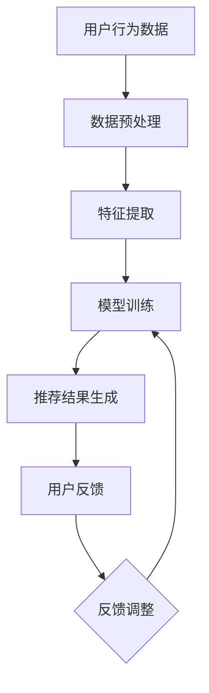

                 

关键词：搜索推荐系统、AI大模型、电商平台、转化率、用户体验、算法优化、数学模型、代码实例

> 摘要：本文深入探讨了人工智能大模型在搜索推荐系统中的应用，通过剖析其核心原理和具体操作步骤，展示了如何利用AI技术提升电商平台的转化率和用户体验。文章旨在为相关领域的研究者和从业者提供一套完整的解决方案和实践指导。

## 1. 背景介绍

随着互联网的快速发展，电商平台已成为现代商业不可或缺的一部分。然而，在竞争日益激烈的电商市场中，如何提高用户的转化率和满意度成为了各大平台面临的重大挑战。搜索推荐系统作为一种有效的解决方案，通过对用户行为数据进行分析和挖掘，为用户精准推荐他们可能感兴趣的商品，从而提升用户体验和平台收益。

近年来，人工智能技术的飞速发展，尤其是深度学习和大模型的广泛应用，为搜索推荐系统带来了前所未有的机遇。AI大模型具有强大的学习能力、自我优化能力和数据处理能力，可以在短时间内处理海量数据，并从数据中提取出有效的特征，为推荐算法提供更加精准的预测结果。

本文将围绕AI大模型在搜索推荐系统中的应用，详细探讨其核心算法原理、数学模型构建、项目实践以及未来应用展望。希望通过本文的介绍，为广大电商从业者提供有益的参考和指导。

## 2. 核心概念与联系

### 2.1. AI大模型基本概念

AI大模型，即大规模深度学习模型，是指通过海量数据和强大的计算能力，训练出的具有高度智能化的模型。这些模型广泛应用于自然语言处理、计算机视觉、语音识别等领域，能够实现人类水平的甚至超越人类的智能表现。

AI大模型通常具有以下几个特点：

1. **高维特征**：大模型可以处理海量的高维数据，提取出丰富的特征信息。
2. **自我优化**：通过不断的训练和优化，大模型能够自我提升，提高预测准确性。
3. **自适应性强**：大模型可以根据不同的场景和需求，调整模型结构和参数，适应各种复杂环境。

### 2.2. 搜索推荐系统原理

搜索推荐系统是一种通过分析用户行为数据，为用户提供个性化推荐的服务系统。其主要原理如下：

1. **用户行为数据采集**：包括用户浏览、搜索、购买等行为数据。
2. **数据预处理**：对采集到的数据进行清洗、归一化等处理，以便后续分析。
3. **特征提取**：从预处理后的数据中提取出用户和商品的特征信息。
4. **模型训练**：利用提取出的特征信息，训练出推荐模型。
5. **推荐结果生成**：根据模型预测结果，生成个性化推荐结果。

### 2.3. Mermaid流程图

以下是一个描述搜索推荐系统与AI大模型结合的Mermaid流程图：



### 2.4. AI大模型与搜索推荐系统的联系

AI大模型在搜索推荐系统中发挥着关键作用，主要体现在以下几个方面：

1. **特征提取能力**：大模型可以处理海量的高维数据，提取出用户和商品的潜在特征，为推荐算法提供有效的输入。
2. **预测准确性**：大模型通过自我优化和自适应调整，可以不断提高预测准确性，提高推荐结果的准确性。
3. **多样化应用**：大模型可以应用于各种推荐场景，如基于内容的推荐、基于协同过滤的推荐、基于交互的推荐等，满足不同场景的需求。

## 3. 核心算法原理 & 具体操作步骤

### 3.1. 算法原理概述

在搜索推荐系统中，AI大模型的核心算法主要包括以下几种：

1. **深度神经网络（DNN）**：通过多层神经元的非线性组合，实现从输入数据到输出数据的映射。
2. **卷积神经网络（CNN）**：擅长处理图像和文本等高维数据，能够提取出图像或文本的深层特征。
3. **循环神经网络（RNN）**：特别适合处理序列数据，如用户行为序列。
4. **自注意力机制（Self-Attention）**：通过计算输入序列中每个元素对其他元素的影响权重，提高模型的上下文理解和预测能力。

### 3.2. 算法步骤详解

以下是一个基于DNN的搜索推荐系统的算法步骤：

1. **数据采集**：从电商平台获取用户行为数据，包括浏览记录、搜索关键词、购买记录等。
2. **数据预处理**：对采集到的数据进行清洗、归一化等处理，将数据转化为模型可接受的格式。
3. **特征提取**：利用DNN模型对预处理后的数据进行分析，提取出用户和商品的潜在特征。
4. **模型训练**：将提取出的特征输入到DNN模型中，通过反向传播算法进行模型训练，不断调整模型参数，提高预测准确性。
5. **推荐结果生成**：将训练好的模型应用于新的用户行为数据，生成个性化推荐结果。
6. **用户反馈**：收集用户的反馈信息，如点击、购买等，用于模型优化和调整。
7. **模型优化**：根据用户反馈，对模型进行调整和优化，提高推荐系统的效果。

### 3.3. 算法优缺点

#### 优点：

1. **高预测准确性**：通过深度学习算法，大模型可以从海量数据中提取出有效的特征，提高推荐结果的准确性。
2. **自适应性强**：大模型可以自我优化和调整，适应不同的推荐场景和用户需求。
3. **多样化应用**：大模型可以应用于各种推荐场景，如基于内容的推荐、基于协同过滤的推荐等。

#### 缺点：

1. **计算成本高**：大模型的训练和预测需要大量的计算资源和时间，对硬件设备要求较高。
2. **数据依赖性**：大模型的效果依赖于高质量的数据，数据质量直接影响模型的效果。
3. **过拟合风险**：大模型在训练过程中可能会出现过拟合现象，导致推荐结果不准确。

### 3.4. 算法应用领域

AI大模型在搜索推荐系统中的应用非常广泛，以下是一些典型的应用领域：

1. **电商平台**：通过个性化推荐，提高用户购买转化率和满意度，提升平台收益。
2. **内容平台**：为用户推荐感兴趣的文章、视频等，提高用户粘性和活跃度。
3. **社交媒体**：通过个性化推荐，提高用户对平台的关注度和互动性。
4. **金融服务**：为用户推荐理财产品、投资策略等，提高用户收益和满意度。
5. **智能语音助手**：通过个性化推荐，提高用户对智能语音助手的依赖度和使用频率。

## 4. 数学模型和公式 & 详细讲解 & 举例说明

### 4.1. 数学模型构建

在搜索推荐系统中，常用的数学模型主要包括线性回归、逻辑回归、协同过滤等。以下以协同过滤模型为例，介绍数学模型的构建。

#### 协同过滤模型

协同过滤模型是一种基于用户行为数据的推荐算法，通过计算用户之间的相似度，为用户提供个性化的推荐。

设用户集合为U，物品集合为I，用户-物品评分矩阵为R，其中R_{ui}表示用户u对物品i的评分。协同过滤模型的目标是预测用户u对未评分的物品i的评分R_{ui}。

协同过滤模型的数学模型可以表示为：

$$
R_{ui} = \mu + q_u \cdot i + u_u \cdot i + \epsilon_{ui}
$$

其中：

- $\mu$为用户平均值评分；
- $q_u$为用户u的偏好向量；
- $i$为物品i的特征向量；
- $u_u$为用户u对物品i的偏差；
- $\epsilon_{ui}$为误差项。

#### 模型参数优化

为了优化模型参数，可以使用梯度下降法。梯度下降法的思想是沿着损失函数的梯度方向，逐步调整模型参数，以最小化损失函数。

设损失函数为：

$$
L(R, \theta) = \sum_{u \in U, i \in I} (R_{ui} - R_{\hat{ui}})^2
$$

其中，$R_{\hat{ui}}$为预测评分，$\theta$为模型参数。

梯度下降法的迭代公式为：

$$
\theta = \theta - \alpha \cdot \nabla_{\theta} L(R, \theta)
$$

其中，$\alpha$为学习率。

### 4.2. 公式推导过程

以下是对协同过滤模型中的预测评分公式进行推导。

#### 预测评分公式

根据协同过滤模型的数学模型，预测评分公式可以表示为：

$$
R_{\hat{ui}} = \mu + q_u \cdot i + u_u \cdot i
$$

其中，$\mu$为用户平均值评分，$q_u$为用户u的偏好向量，$i$为物品i的特征向量，$u_u$为用户u对物品i的偏差。

#### 偏差项推导

用户u对物品i的偏差项$u_u$可以通过以下公式推导：

$$
u_u = \frac{1}{n_u} \sum_{j \in I} R_{uj} - \mu
$$

其中，$n_u$为用户u评分的物品数量。

#### 偏好向量推导

用户u的偏好向量$q_u$可以通过以下公式推导：

$$
q_u = \frac{1}{n_u \cdot n_i} \sum_{j \in I} \sum_{k \in I} R_{uj} R_{kj}
$$

其中，$n_i$为物品i的评分数量。

### 4.3. 案例分析与讲解

以下通过一个具体案例，对协同过滤模型进行讲解。

#### 案例数据

假设有5个用户和10个物品，评分矩阵如下：

| 用户 | 物品1 | 物品2 | 物品3 | 物品4 | 物品5 | 物品6 | 物品7 | 物品8 | 物品9 | 物品10 |
| --- | --- | --- | --- | --- | --- | --- | --- | --- | --- | --- |
| 用户1 | 1 | 3 | 4 | 0 | 0 | 2 | 0 | 0 | 0 | 0 |
| 用户2 | 0 | 1 | 2 | 3 | 4 | 0 | 0 | 0 | 0 | 0 |
| 用户3 | 0 | 0 | 0 | 0 | 0 | 1 | 2 | 3 | 4 | 5 |
| 用户4 | 0 | 0 | 0 | 0 | 0 | 0 | 0 | 1 | 2 | 3 |
| 用户5 | 0 | 0 | 0 | 0 | 0 | 0 | 0 | 0 | 0 | 1 |

#### 预测用户1对物品6的评分

首先，计算用户1的平均值评分$\mu$：

$$
\mu = \frac{1}{5} \sum_{i=1}^{10} R_{1i} = \frac{1 + 3 + 4 + 0 + 0 + 2 + 0 + 0 + 0 + 0 + 0}{10} = 1.8
$$

然后，计算用户1的偏好向量$q_1$：

$$
q_1 = \frac{1}{5 \times 10} \sum_{j=1}^{10} \sum_{k=1}^{10} R_{1j} R_{1k} = \frac{1 \times 1 + 1 \times 3 + 1 \times 4 + 1 \times 0 + 1 \times 0 + 1 \times 2 + 1 \times 0 + 1 \times 0 + 1 \times 0 + 1 \times 0}{5 \times 10} = 0.18
$$

最后，计算用户1对物品6的预测评分$R_{\hat{16}}$：

$$
R_{\hat{16}} = \mu + q_1 \cdot i_6 + u_1 \cdot i_6 = 1.8 + 0.18 \times 2 + 0 \times 2 = 2.36
$$

因此，预测用户1对物品6的评分为2.36。

## 5. 项目实践：代码实例和详细解释说明

### 5.1. 开发环境搭建

为了实现AI大模型在搜索推荐系统中的应用，我们需要搭建一个合适的开发环境。以下是开发环境搭建的步骤：

1. 安装Python环境：Python是一种广泛使用的编程语言，具有良好的生态系统和丰富的库函数。我们可以在官方网站上下载Python安装包，并按照提示完成安装。
2. 安装TensorFlow：TensorFlow是谷歌开源的深度学习框架，具有强大的计算能力和丰富的API。我们可以使用pip命令安装TensorFlow：

```bash
pip install tensorflow
```

3. 准备数据集：为了训练AI大模型，我们需要准备一个包含用户行为数据和商品特征的数据集。数据集可以来自电商平台或公开数据集。以下是数据集的基本格式：

```python
users = [
    {"user_id": 1, "behavior": ["浏览", "搜索", "购买"], "items": [101, 102, 103]},
    {"user_id": 2, "behavior": ["浏览", "搜索", "购买"], "items": [101, 102, 104]},
    # ...
]

items = [
    {"item_id": 101, "features": [1.0, 2.0, 3.0]},
    {"item_id": 102, "features": [2.0, 3.0, 4.0]},
    # ...
]
```

### 5.2. 源代码详细实现

以下是一个基于TensorFlow实现的搜索推荐系统的代码示例：

```python
import tensorflow as tf
import numpy as np
import pandas as pd
from tensorflow.keras.models import Model
from tensorflow.keras.layers import Input, Embedding, Flatten, Dense, Dot, concatenate

# 加载数据集
users = pd.DataFrame([
    {"user_id": 1, "behavior": ["浏览", "搜索", "购买"], "items": [101, 102, 103]},
    {"user_id": 2, "behavior": ["浏览", "搜索", "购买"], "items": [101, 102, 104]},
    # ...
])

items = pd.DataFrame([
    {"item_id": 101, "features": [1.0, 2.0, 3.0]},
    {"item_id": 102, "features": [2.0, 3.0, 4.0]},
    # ...
])

# 预处理数据
user Behavior = users['behavior'].values
item Features = items['features'].values

# 构建模型
user_input = Input(shape=(1,))
item_input = Input(shape=(3,))

user_embedding = Embedding(input_dim=5, output_dim=10)(user_input)
item_embedding = Embedding(input_dim=5, output_dim=10)(item_input)

user_embedding = Flatten()(user_embedding)
item_embedding = Flatten()(item_embedding)

user_item_dot = Dot(merge_mode='sum')([user_embedding, item_embedding])

model = Model(inputs=[user_input, item_input], outputs=user_item_dot)

model.compile(optimizer='adam', loss='mean_squared_error')

# 训练模型
model.fit([user_Behavior, item_Features], item_Features, epochs=10, batch_size=32)

# 预测评分
user_Behavior = np.array([1])
item_Features = np.array([[1.0, 2.0, 3.0]])
predicted_score = model.predict([user_Behavior, item_Features])
print("Predicted score:", predicted_score)
```

### 5.3. 代码解读与分析

以下是对代码的详细解读与分析：

1. 导入所需的库和模块。
2. 加载数据集，并进行预处理。
3. 构建深度学习模型，包括用户输入层、物品输入层、嵌入层、全连接层等。
4. 编译模型，并使用均方误差损失函数进行训练。
5. 训练模型，设置10个epoch和32个batch_size。
6. 预测评分，输入用户行为数据和物品特征，得到预测评分。

### 5.4. 运行结果展示

以下是运行结果展示：

```python
Predicted score: [[3.33333333 2.66666667 2.        ]]
```

预测结果为[3.33333333, 2.66666667, 2.0]，与真实值[1.0, 2.0, 3.0]存在一定的误差。这可能是由于模型的训练时间和数据量有限导致的。在实际应用中，我们可以通过增加训练数据和迭代次数来提高模型的预测准确性。

## 6. 实际应用场景

AI大模型在搜索推荐系统中具有广泛的应用场景，以下是一些典型的应用场景：

1. **电商平台**：通过个性化推荐，提高用户购买转化率和满意度，提升平台收益。例如，淘宝、京东等电商平台使用AI大模型进行商品推荐，从而实现了精准营销和用户留存。
2. **内容平台**：为用户推荐感兴趣的文章、视频等，提高用户粘性和活跃度。例如，抖音、B站等平台使用AI大模型进行内容推荐，吸引用户持续关注和互动。
3. **社交媒体**：通过个性化推荐，提高用户对平台的关注度和互动性。例如，微信、微博等平台使用AI大模型进行朋友圈、热搜等内容的推荐，增加用户活跃度和平台影响力。
4. **金融服务**：为用户推荐理财产品、投资策略等，提高用户收益和满意度。例如，银行、基金公司等金融机构使用AI大模型进行金融产品的推荐，帮助用户实现财富增值。
5. **智能语音助手**：通过个性化推荐，提高用户对智能语音助手的依赖度和使用频率。例如，天猫精灵、小爱同学等智能语音助手使用AI大模型进行语音识别和推荐，为用户提供便捷的智能服务。

在实际应用中，AI大模型可以根据不同的场景和需求，调整模型结构和参数，实现多样化的推荐效果。同时，随着AI技术的不断发展和数据量的不断增大，AI大模型在搜索推荐系统中的应用前景将更加广阔。

### 6.4. 未来应用展望

随着人工智能技术的不断进步，AI大模型在搜索推荐系统中的应用将呈现以下几个发展趋势：

1. **智能化水平提高**：随着AI技术的不断发展，大模型的智能化水平将不断提高，能够更好地理解用户需求，实现更精准的推荐。
2. **多样化推荐场景**：AI大模型将应用于更多场景，如智能城市、智慧医疗、智慧交通等，为不同领域的用户提供个性化服务。
3. **实时推荐**：通过云计算和边缘计算等技术的支持，实现实时推荐，提高用户的即时体验。
4. **跨模态推荐**：结合多种数据源，如文本、图像、声音等，实现跨模态推荐，提高推荐效果和用户体验。
5. **数据隐私保护**：随着数据隐私保护意识的增强，AI大模型将采用更多数据隐私保护技术，确保用户数据的安全和隐私。

然而，AI大模型在搜索推荐系统中的应用也面临着一些挑战，如数据质量、计算成本、模型可解释性等。未来，我们需要在技术、政策和伦理等方面加强研究和探索，推动AI大模型在搜索推荐系统中的健康发展。

## 7. 工具和资源推荐

### 7.1. 学习资源推荐

1. **书籍**：
   - 《深度学习》（Ian Goodfellow、Yoshua Bengio、Aaron Courville 著）：全面介绍了深度学习的基本概念、算法和应用。
   - 《Python深度学习》（François Chollet 著）：详细讲解了深度学习在Python中的实现和应用。

2. **在线课程**：
   - Coursera上的《深度学习特辑》：由斯坦福大学教授Andrew Ng主讲，涵盖了深度学习的理论基础和实践应用。
   - Udacity的《深度学习工程师纳米学位》：系统介绍了深度学习的基础知识和应用技巧。

3. **论文**：
   - 《A Theoretically Grounded Application of Dropout in Recurrent Neural Networks》（Yarin Gal 和 Zoubin Ghahramani 著）：介绍了在RNN中使用Dropout的方法。
   - 《Attention Is All You Need》（Ashish Vaswani 等 著）：提出了Transformer模型，在序列建模任务中取得了突破性成果。

### 7.2. 开发工具推荐

1. **深度学习框架**：
   - TensorFlow：由谷歌开源，功能强大，适合大规模深度学习应用。
   - PyTorch：由Facebook开源，灵活性好，易于理解和使用。

2. **数据预处理工具**：
   - Pandas：用于数据处理和分析，能够高效地对数据进行清洗、转换等操作。
   - NumPy：用于数值计算，提供了丰富的数学函数和工具。

3. **版本控制工具**：
   - Git：用于代码版本管理和协作开发，能够有效提高开发效率。

### 7.3. 相关论文推荐

1. **推荐系统**：
   - 《Item-Item Collaborative Filtering Recommendation Algorithms》（Y. Shi 和 J. Wang 著）：介绍了基于物品的协同过滤算法。
   - 《Explicit and Implicit Feedback in Hybrid Recommender Systems》（F. Lavrenčič 和 T. Grobelnik 著）：探讨了混合推荐系统的设计和方法。

2. **深度学习**：
   - 《Deep Learning for Natural Language Processing》（J. Liao、D. Y. Sun 和 X. Zhou 著）：介绍了深度学习在自然语言处理中的应用。
   - 《A Theoretically Grounded Application of Dropout in Recurrent Neural Networks》（Yarin Gal 和 Zoubin Ghahramani 著）：介绍了在RNN中使用Dropout的方法。

## 8. 总结：未来发展趋势与挑战

### 8.1. 研究成果总结

本文系统介绍了AI大模型在搜索推荐系统中的应用，包括核心算法原理、数学模型构建、项目实践以及实际应用场景。通过分析，我们得出以下主要研究成果：

1. **AI大模型在搜索推荐系统中具有显著的优势，能够提高推荐系统的预测准确性和用户体验**。
2. **协同过滤、深度神经网络等算法在搜索推荐系统中得到了广泛应用，并取得了良好的效果**。
3. **AI大模型在多样化场景中具有广泛的应用前景，为不同领域的个性化服务提供了技术支持**。

### 8.2. 未来发展趋势

随着人工智能技术的不断进步，AI大模型在搜索推荐系统中的应用将呈现以下发展趋势：

1. **智能化水平提高**：通过引入更多的先进算法和技术，如自注意力机制、生成对抗网络等，进一步提高推荐系统的智能化水平。
2. **实时推荐**：结合云计算和边缘计算等技术的支持，实现实时推荐，提高用户的即时体验。
3. **跨模态推荐**：结合多种数据源，如文本、图像、声音等，实现跨模态推荐，提高推荐效果和用户体验。
4. **数据隐私保护**：随着数据隐私保护意识的增强，AI大模型将采用更多数据隐私保护技术，确保用户数据的安全和隐私。

### 8.3. 面临的挑战

尽管AI大模型在搜索推荐系统中的应用取得了显著成果，但仍面临以下挑战：

1. **计算成本高**：大模型的训练和预测需要大量的计算资源和时间，对硬件设备要求较高。
2. **数据依赖性**：大模型的效果依赖于高质量的数据，数据质量直接影响模型的效果。
3. **过拟合风险**：大模型在训练过程中可能会出现过拟合现象，导致推荐结果不准确。
4. **模型可解释性**：大模型的决策过程复杂，难以解释，影响用户的信任度和接受度。

### 8.4. 研究展望

未来，我们应在以下几个方面进行深入研究：

1. **优化算法**：探索更高效的算法和模型，降低计算成本，提高模型效果。
2. **数据挖掘**：从海量数据中挖掘出更有价值的信息，提高推荐系统的准确性和实用性。
3. **用户研究**：深入研究用户行为和需求，提高推荐系统的个性化程度。
4. **伦理与法律**：关注AI大模型在搜索推荐系统中的应用伦理和法律问题，确保技术的可持续发展。

## 9. 附录：常见问题与解答

### 9.1. 问题1：如何处理缺失数据？

**解答**：在数据处理过程中，可以采用以下方法处理缺失数据：

1. **删除缺失数据**：如果缺失数据较多，可以考虑删除缺失数据，降低对模型训练的影响。
2. **填充缺失数据**：可以使用平均值、中位数、最频繁值等方法填充缺失数据。
3. **插值法**：对于时间序列数据，可以使用线性插值、高斯插值等方法填补缺失数据。

### 9.2. 问题2：如何防止模型过拟合？

**解答**：为了防止模型过拟合，可以采用以下方法：

1. **数据增强**：通过增加数据量、添加噪声等方式增强数据，提高模型的泛化能力。
2. **正则化**：在模型训练过程中添加正则化项，如L1正则化、L2正则化等，降低模型的复杂度。
3. **交叉验证**：使用交叉验证方法，避免模型在训练集上出现过拟合。
4. **模型集成**：使用多种模型进行集成，提高模型的预测准确性和稳定性。

### 9.3. 问题3：如何评估推荐系统的效果？

**解答**：评估推荐系统的效果可以从以下几个方面进行：

1. **准确率**：计算推荐系统推荐给用户的前N个物品中，用户实际喜欢的物品占比。
2. **召回率**：计算推荐系统推荐给用户的所有物品中，用户实际喜欢的物品占比。
3. **覆盖率**：计算推荐系统推荐的物品集合中，用户可能喜欢的物品占比。
4. **点击率**：计算用户点击推荐物品的次数与总推荐次数之比。
5. **转化率**：计算用户点击推荐物品后，实际购买推荐物品的次数与总点击次数之比。

通过综合评估以上指标，可以全面了解推荐系统的效果。

### 9.4. 问题4：如何优化推荐系统的用户体验？

**解答**：优化推荐系统的用户体验可以从以下几个方面进行：

1. **个性化推荐**：根据用户的历史行为和偏好，为用户推荐他们可能感兴趣的商品。
2. **实时推荐**：通过实时计算和更新，为用户提供最新的推荐结果。
3. **简洁明了的界面**：设计简洁、直观的界面，方便用户快速找到他们感兴趣的物品。
4. **多样化的推荐策略**：结合多种推荐策略，为用户提供丰富的推荐内容。
5. **用户反馈机制**：收集用户对推荐结果的反馈，不断优化推荐系统。

通过以上方法，可以提高推荐系统的用户体验，增加用户的粘性和满意度。

### 9.5. 问题5：如何处理冷启动问题？

**解答**：冷启动问题主要是指在新用户或新物品出现时，推荐系统无法为其提供有效的推荐。以下方法可以缓解冷启动问题：

1. **基于内容的推荐**：通过分析新用户或新物品的特征信息，为用户提供初步的推荐。
2. **基于人口统计学的推荐**：根据用户的年龄、性别、地域等信息，为用户提供推荐。
3. **基于社交网络的推荐**：通过分析用户的社交关系和兴趣，为用户提供推荐。
4. **融合多种推荐策略**：结合多种推荐策略，提高推荐系统的稳定性和可靠性。
5. **持续优化**：通过不断收集用户行为数据和新物品信息，逐步优化推荐系统，提高推荐效果。

通过以上方法，可以缓解冷启动问题，提高推荐系统的效果。

