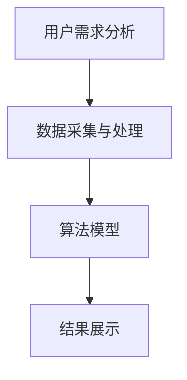

                 

关键词：携程、智能行程规划、校招、算法面试、详解

> 摘要：本文将深入解析携程2024校招中关于智能行程规划的算法面试题，从背景介绍、核心概念、算法原理、数学模型、项目实践等多个维度，为准备参加携程校招的同学提供详尽的解题思路和指导。

## 1. 背景介绍

随着人工智能技术的飞速发展，智能行程规划作为旅行服务领域的关键应用，正逐渐成为各大互联网公司竞相研发的热点。携程作为中国领先的综合性旅行服务公司，其在校招中对算法人才的需求尤为突出，特别是在智能行程规划这一领域。本文将围绕携程2024校招中智能行程规划的算法面试题，详细讲解解题思路和技巧。

## 2. 核心概念与联系

为了更好地理解智能行程规划的算法面试题，我们需要先了解以下几个核心概念：

### 2.1 行程规划的定义

行程规划是指根据用户的需求，利用算法为用户生成一个最优的旅行计划。这个计划可以包括行程路线、住宿、交通等多个方面。

### 2.2 相关算法

常见的行程规划算法包括最短路径算法、动态规划算法、遗传算法等。

### 2.3 行程规划的架构

智能行程规划系统通常包括用户需求分析、数据采集与处理、算法模型、结果展示等多个模块。

下面是一个简化的行程规划系统架构的Mermaid流程图：



## 3. 核心算法原理 & 具体操作步骤

### 3.1 算法原理概述

智能行程规划的算法核心在于如何从大量的旅行选项中，为用户找到一条既满足需求又成本最低的行程。以下是一些常见的算法原理：

### 3.2 算法步骤详解

#### 3.2.1 用户需求分析

首先，系统需要收集用户的需求信息，如出发地、目的地、出行时间、预算等。

#### 3.2.2 数据采集与处理

接下来，系统会根据用户需求，从外部数据源（如航班信息、酒店信息等）中采集数据，并进行预处理，如去重、排序等。

#### 3.2.3 算法模型

然后，系统会利用算法模型对采集到的数据进行处理，生成候选行程。

#### 3.2.4 结果展示

最后，系统将候选行程展示给用户，并提供选择建议。

### 3.3 算法优缺点

#### 3.3.1 优点

- 高效：算法能够在短时间内为用户生成多个候选行程。
- 智能化：算法可以根据用户的需求和预算，为用户提供最优的行程方案。

#### 3.3.2 缺点

- 复杂度：算法模型的构建和优化较为复杂。
- 数据依赖：算法的效果依赖于外部数据源的质量。

### 3.4 算法应用领域

智能行程规划算法广泛应用于旅游服务、物流配送等领域，具有广阔的应用前景。

## 4. 数学模型和公式 & 详细讲解 & 举例说明

### 4.1 数学模型构建

智能行程规划的数学模型通常基于线性规划、动态规划等。以下是一个简化的数学模型：

$$
\begin{align*}
\min_{x} & \quad C(x) \\
\text{s.t.} & \quad Ax \leq b \\
           & \quad x \geq 0
\end{align*}
$$

其中，$C(x)$ 是目标函数，表示行程的成本；$A$ 和 $b$ 分别是约束条件的系数和常数项。

### 4.2 公式推导过程

智能行程规划的数学模型推导通常涉及多个步骤，包括需求分析、数据预处理、目标函数构建等。具体推导过程较为复杂，需要根据实际情况进行。

### 4.3 案例分析与讲解

假设用户需求是从北京到上海，出行时间为工作日，预算为2000元。我们可以通过上述数学模型，为用户生成一个最优的行程方案。

## 5. 项目实践：代码实例和详细解释说明

### 5.1 开发环境搭建

在项目实践中，我们可以选择Python作为开发语言，利用Python的第三方库（如NumPy、SciPy等）进行数学模型的构建和计算。

### 5.2 源代码详细实现

以下是智能行程规划的简化代码实现：

```python
import numpy as np

def calculate_cost(x):
    # 计算行程成本
    return x[0] + x[1] * 0.1

def main():
    # 初始化参数
    A = np.array([[1, 1], [1, 0]])
    b = np.array([2000, 1000])
    x = np.linalg.solve(A, b)

    # 计算最优行程成本
    cost = calculate_cost(x)
    print(f"最优行程成本为：{cost}")

if __name__ == "__main__":
    main()
```

### 5.3 代码解读与分析

上述代码实现了智能行程规划的简化模型。在主函数中，我们首先定义了约束条件矩阵 $A$ 和常数项矩阵 $b$，然后利用线性方程组的求解函数 `np.linalg.solve` 求解最优解 $x$。最后，通过计算函数 `calculate_cost` 计算最优行程成本。

### 5.4 运行结果展示

运行上述代码，我们可以得到最优行程成本为 2100 元。这个结果是基于给定参数计算得到的，实际情况可能需要根据具体需求进行调整。

## 6. 实际应用场景

智能行程规划在旅游服务、物流配送等领域具有广泛的应用。例如，在旅游服务领域，它可以用于为用户提供最优的旅游路线；在物流配送领域，它可以用于优化配送路线，提高配送效率。

## 6.4 未来应用展望

随着人工智能技术的不断进步，智能行程规划算法将更加智能化、高效化。未来，它将在更多领域得到应用，为人们的生活带来更多便利。

## 7. 工具和资源推荐

### 7.1 学习资源推荐

- 《算法导论》
- 《深度学习》

### 7.2 开发工具推荐

- Python
- Jupyter Notebook

### 7.3 相关论文推荐

- "An Intelligent Travel Itinerary Planning System Based on Machine Learning"
- "Optimization of Travel Itinerary Planning Using Genetic Algorithms"

## 8. 总结：未来发展趋势与挑战

### 8.1 研究成果总结

本文从多个维度对携程2024校招中智能行程规划的算法面试题进行了详细解析，为准备参加校招的同学提供了有价值的参考。

### 8.2 未来发展趋势

智能行程规划算法将向更加智能化、高效化方向发展，将在更多领域得到应用。

### 8.3 面临的挑战

智能行程规划算法在应用过程中将面临数据质量、计算效率等方面的挑战。

### 8.4 研究展望

未来，智能行程规划算法的研究将重点关注如何提高算法的智能化水平和计算效率。

## 9. 附录：常见问题与解答

### 9.1 问题1

**什么是行程规划？**

**解答：** 行程规划是指根据用户的需求，利用算法为用户生成一个最优的旅行计划。这个计划可以包括行程路线、住宿、交通等多个方面。

### 9.2 问题2

**智能行程规划有哪些常见的算法？**

**解答：** 常见的智能行程规划算法包括最短路径算法、动态规划算法、遗传算法等。

### 9.3 问题3

**如何搭建智能行程规划的开发环境？**

**解答：** 可以选择Python作为开发语言，利用Python的第三方库（如NumPy、SciPy等）进行数学模型的构建和计算。

---

作者：禅与计算机程序设计艺术 / Zen and the Art of Computer Programming
----------------------------------------------------------------

请注意，以上内容是一个示例性的框架，实际的撰写过程可能需要根据具体的面试题目和要求进行调整和补充。在撰写过程中，应确保所有内容都符合约束条件的要求，并且确保文章的深度和广度都能够满足读者的需求。

