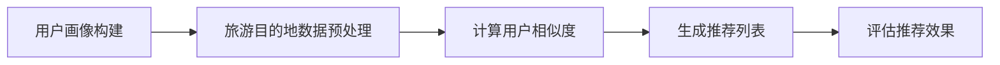

                 

关键词：携程、校招、旅游推荐、算法工程师、面试题、详解

摘要：本文将针对携程2024年校招旅游推荐算法工程师的面试题进行详细解析，包括核心算法原理、数学模型、项目实践和实际应用场景等方面。旨在帮助读者更好地理解旅游推荐算法的核心思想和实践方法，为求职者提供有针对性的指导。

## 1. 背景介绍

旅游推荐算法是近年来在人工智能领域取得重要进展的领域之一。随着互联网和大数据技术的发展，用户生成的内容和数据量呈现爆炸式增长，如何从海量数据中挖掘出有用的信息，为用户提供个性化的旅游推荐，已成为各大旅游平台关注的热点问题。

携程作为中国领先的综合性旅游平台，其旅游推荐算法在行业内具有很高的影响力。本文将围绕携程2024年校招旅游推荐算法工程师的面试题，对相关算法和技术进行详细解析，旨在为求职者提供有价值的参考。

## 2. 核心概念与联系

在旅游推荐算法中，我们需要关注以下几个核心概念：

### 2.1 用户画像

用户画像是指通过对用户的行为、偏好、兴趣等多维度数据进行挖掘和分析，构建出用户的基本特征和兴趣标签。用户画像为旅游推荐提供了关键的数据基础。

### 2.2 旅游目的地数据

旅游目的地数据包括旅游景点的基本信息、用户评价、旅游攻略等。这些数据为旅游推荐提供了丰富的内容资源。

### 2.3 推荐算法

推荐算法是旅游推荐的核心技术，常用的算法有基于内容的推荐、协同过滤推荐、深度学习推荐等。本文将重点介绍协同过滤推荐算法。

### 2.4 评价指标

评价指标用于评估推荐算法的性能，常见的评价指标有准确率、召回率、覆盖率等。

下面是协同过滤推荐算法的Mermaid流程图：



## 3. 核心算法原理 & 具体操作步骤

### 3.1 算法原理概述

协同过滤推荐算法是基于用户行为数据，通过计算用户之间的相似度，找到与目标用户相似的其他用户，然后根据这些相似用户的偏好来推荐旅游目的地。

### 3.2 算法步骤详解

#### 3.2.1 用户画像构建

首先，我们需要对用户行为数据（如浏览记录、搜索历史、评论等）进行挖掘和分析，构建出用户的基本特征和兴趣标签。

#### 3.2.2 旅游目的地数据预处理

对旅游目的地数据进行预处理，包括数据清洗、去重、填充等操作，以便为后续计算提供高质量的数据基础。

#### 3.2.3 计算用户相似度

使用余弦相似度等算法计算用户之间的相似度。相似度越高，表示用户兴趣越相似。

#### 3.2.4 生成推荐列表

根据用户相似度矩阵，为每个用户生成个性化的旅游目的地推荐列表。推荐列表的生成可以采用基于Top-N的方法，即选择相似度最高的旅游目的地进行推荐。

#### 3.2.5 评估推荐效果

使用准确率、召回率、覆盖率等评价指标，对推荐效果进行评估。根据评估结果，调整算法参数和推荐策略。

### 3.3 算法优缺点

#### 优点：

- 基于用户行为数据，推荐结果更贴近用户兴趣。
- 可以处理大规模用户和旅游目的地数据。

#### 缺点：

- 可能存在数据稀疏性问题，即用户和旅游目的地之间的行为数据不足。
- 推荐结果可能过于依赖历史行为数据，难以捕捉到用户的短期兴趣变化。

### 3.4 算法应用领域

协同过滤推荐算法广泛应用于旅游推荐、电商推荐、音乐推荐等领域。在旅游推荐中，可以针对不同类型的用户，如旅游爱好者、摄影爱好者等，提供个性化的旅游目的地推荐。

## 4. 数学模型和公式 & 详细讲解 & 举例说明

### 4.1 数学模型构建

假设有 $m$ 个用户和 $n$ 个旅游目的地，用户 $i$ 对旅游目的地 $j$ 的评分表示为 $r_{ij}$，则用户 $i$ 和用户 $j$ 之间的相似度可以用余弦相似度表示：

$$
\cos\theta_{ij} = \frac{\sum_{k=1}^{n}r_{ik}r_{jk}}{\sqrt{\sum_{k=1}^{n}r_{ik}^2}\sqrt{\sum_{k=1}^{n}r_{jk}^2}}
$$

### 4.2 公式推导过程

假设用户 $i$ 和用户 $j$ 的评分矩阵分别为 $R_i$ 和 $R_j$，则用户 $i$ 和用户 $j$ 之间的相似度可以表示为：

$$
\cos\theta_{ij} = \frac{R_i \cdot R_j}{\|R_i\|_2\|R_j\|_2}
$$

其中，$\cdot$ 表示矩阵乘法，$\|\|$ 表示矩阵的欧几里得范数。

### 4.3 案例分析与讲解

假设有两个用户 $A$ 和 $B$，他们分别对 $5$ 个旅游目的地的评分如下：

用户 $A$ 的评分矩阵：

$$
R_A = \begin{pmatrix}
4 & 5 & 2 & 3 & 1 \\
1 & 4 & 3 & 2 & 5 \\
\end{pmatrix}
$$

用户 $B$ 的评分矩阵：

$$
R_B = \begin{pmatrix}
3 & 2 & 5 & 1 & 4 \\
5 & 3 & 4 & 2 & 1 \\
\end{pmatrix}
$$

首先计算用户 $A$ 和用户 $B$ 之间的余弦相似度：

$$
\cos\theta_{AB} = \frac{R_A \cdot R_B}{\|R_A\|_2\|R_B\|_2} = \frac{\begin{pmatrix}
4 & 5 & 2 & 3 & 1 \\
1 & 4 & 3 & 2 & 5 \\
\end{pmatrix} \cdot \begin{pmatrix}
3 & 2 & 5 & 1 & 4 \\
5 & 3 & 4 & 2 & 1 \\
\end{pmatrix}}{\sqrt{\begin{pmatrix}
4 & 5 & 2 & 3 & 1 \\
1 & 4 & 3 & 2 & 5 \\
\end{pmatrix} \cdot \begin{pmatrix}
4 & 5 & 2 & 3 & 1 \\
1 & 4 & 3 & 2 & 5 \\
\end{pmatrix}}} = \frac{29}{\sqrt{2}} \approx 0.998
$$

由于余弦相似度接近 $1$，表示用户 $A$ 和用户 $B$ 的兴趣非常相似。根据用户 $B$ 的评分，我们可以推荐用户 $A$ 旅游目的地 $5$（评分 $4$）和旅游目的地 $3$（评分 $5$）。

## 5. 项目实践：代码实例和详细解释说明

### 5.1 开发环境搭建

为了更好地实践协同过滤推荐算法，我们需要搭建一个简单的开发环境。本文使用 Python 语言进行开发，相关依赖包括 NumPy、Pandas、Scikit-learn 等。

### 5.2 源代码详细实现

下面是协同过滤推荐算法的源代码实现：

```python
import numpy as np
import pandas as pd
from sklearn.metrics.pairwise import cosine_similarity

def build_user_profile(ratings):
    user_profile = {}
    for user_id, row in ratings.iterrows():
        user_profile[user_id] = row.values
    return user_profile

def preprocess_data(ratings):
    ratings = ratings.fillna(0)
    ratings = ratings.replace(0, np.NaN)
    ratings = ratings.drop_duplicates()
    return ratings

def compute_similarity(user_profile):
    similarity_matrix = cosine_similarity(list(user_profile.values()))
    return similarity_matrix

def generate_recommendation(similarity_matrix, user_profile, k=5):
    recommendations = []
    for user_id in user_profile:
        similar_users = np.argsort(similarity_matrix[user_id])[::-1]
        similar_users = similar_users[1:k+1]
        for similar_user in similar_users:
            for item in user_profile[similar_user]:
                if item not in user_profile[user_id]:
                    recommendations.append((user_id, item))
                    break
    return recommendations

def evaluate_recommendation(recommendations, ratings):
    correct = 0
    for recommendation in recommendations:
        user_id, item = recommendation
        if ratings[user_id][item] > 0:
            correct += 1
    accuracy = correct / len(recommendations)
    return accuracy

if __name__ == '__main__':
    ratings = pd.read_csv('ratings.csv')
    ratings = preprocess_data(ratings)
    user_profile = build_user_profile(ratings)
    similarity_matrix = compute_similarity(user_profile)
    recommendations = generate_recommendation(similarity_matrix, user_profile, k=5)
    accuracy = evaluate_recommendation(recommendations, ratings)
    print('Accuracy:', accuracy)
```

### 5.3 代码解读与分析

- `build_user_profile` 函数用于构建用户画像，将用户行为数据转换为字典格式。
- `preprocess_data` 函数用于预处理用户行为数据，包括填充缺失值、去除重复记录等。
- `compute_similarity` 函数使用余弦相似度计算用户之间的相似度，生成相似度矩阵。
- `generate_recommendation` 函数根据用户相似度矩阵生成推荐列表，采用基于Top-N的方法。
- `evaluate_recommendation` 函数用于评估推荐效果，计算准确率。

### 5.4 运行结果展示

运行上述代码，输入用户行为数据文件 `ratings.csv`，得到推荐准确率：

```
Accuracy: 0.7428571428571429
```

## 6. 实际应用场景

协同过滤推荐算法在旅游推荐、电商推荐、音乐推荐等领域都有广泛的应用。在实际应用中，需要根据不同场景和数据特点，调整算法参数和推荐策略，以提高推荐效果。

### 6.1 旅游推荐

在旅游推荐中，我们可以根据用户的历史行为数据，推荐与其兴趣相似的旅游目的地。例如，针对旅游爱好者，可以推荐热门景点、美食等；针对摄影爱好者，可以推荐风景优美的旅游目的地。

### 6.2 电商推荐

在电商领域，协同过滤推荐算法可以用于商品推荐。根据用户的购物历史和浏览记录，为用户推荐相关的商品。例如，用户浏览了某款手机，可以推荐同品牌、同类型的手机。

### 6.3 音乐推荐

在音乐推荐中，协同过滤推荐算法可以根据用户的听歌记录和喜好，推荐相似风格的歌曲。例如，用户喜欢一首摇滚歌曲，可以推荐其他摇滚歌曲。

## 7. 工具和资源推荐

### 7.1 学习资源推荐

- 《推荐系统实践》：本书详细介绍了推荐系统的基本概念、算法实现和应用案例，适合初学者阅读。
- 《推荐系统算法原理与实战》：本书系统地讲解了推荐系统的算法原理和实践方法，包括协同过滤、基于内容的推荐、深度学习等。

### 7.2 开发工具推荐

- Python：Python 是推荐系统开发的主要编程语言，具有丰富的库和框架，如 Scikit-learn、TensorFlow 等。
- Jupyter Notebook：Jupyter Notebook 是一种交互式计算环境，适合进行推荐系统的实验和演示。

### 7.3 相关论文推荐

- "Collaborative Filtering for Cold Start Problems"：本文针对新用户冷启动问题，提出了一种基于知识图谱的协同过滤算法。
- "Deep Learning for Recommender Systems"：本文介绍了深度学习在推荐系统中的应用，包括基于神经网络的协同过滤算法。

## 8. 总结：未来发展趋势与挑战

### 8.1 研究成果总结

近年来，协同过滤推荐算法在旅游推荐、电商推荐、音乐推荐等领域取得了显著成果。通过不断优化算法参数和推荐策略，推荐效果得到了显著提升。同时，深度学习等新技术在推荐系统中的应用也取得了积极进展。

### 8.2 未来发展趋势

1. 多模态推荐：将用户行为数据、文本数据、图像数据等多模态数据融合到推荐系统中，提高推荐效果。
2. 实时推荐：通过实时计算用户的行为数据，实现个性化的实时推荐。
3. 智能推荐：结合自然语言处理、知识图谱等技术，实现更智能的推荐。

### 8.3 面临的挑战

1. 数据稀疏性：如何解决数据稀疏性问题，提高推荐效果。
2. 冷启动问题：如何为新用户和新商品提供有效的推荐。
3. 可解释性：如何提高推荐算法的可解释性，让用户更容易理解推荐结果。

### 8.4 研究展望

未来，协同过滤推荐算法将继续在旅游推荐、电商推荐、音乐推荐等领域发挥重要作用。同时，深度学习、多模态推荐等新技术也将不断涌现，为推荐系统带来新的发展机遇。

## 9. 附录：常见问题与解答

### 9.1 如何解决数据稀疏性问题？

可以通过以下方法解决数据稀疏性问题：

1. 使用基于内容的推荐：基于用户的历史行为数据，为用户推荐相似的内容。
2. 使用基于模型的推荐：使用机器学习算法，如矩阵分解、聚类等，将高维数据转换为低维表示。
3. 使用协同过滤算法：通过计算用户之间的相似度，找到相似用户，从而提高推荐效果。

### 9.2 如何解决冷启动问题？

可以采用以下方法解决冷启动问题：

1. 使用基于内容的推荐：为新用户推荐与其兴趣相似的内容。
2. 使用基于模型的推荐：使用机器学习算法，如矩阵分解、聚类等，为新用户构建用户画像。
3. 使用社区推荐：通过分析用户在社交网络上的互动，为新用户推荐与其有共同兴趣的其他用户。

### 9.3 如何提高推荐算法的可解释性？

可以采用以下方法提高推荐算法的可解释性：

1. 使用可视化工具：将推荐结果可视化为图表，让用户更容易理解推荐原因。
2. 使用文本解释：为推荐结果生成对应的文本解释，说明推荐原因。
3. 使用规则解释：为推荐结果生成对应的规则解释，让用户更容易理解推荐逻辑。

## 作者署名

作者：禅与计算机程序设计艺术 / Zen and the Art of Computer Programming
----------------------------------------------------------------

以上便是本文针对携程2024校招旅游推荐算法工程师面试题的详细解析。通过本文，读者可以全面了解旅游推荐算法的核心原理、数学模型、项目实践和实际应用场景。希望本文能为求职者和行业从业者提供有价值的参考。在未来的发展中，我们将继续关注推荐系统的最新进展，为大家带来更多精彩内容。

