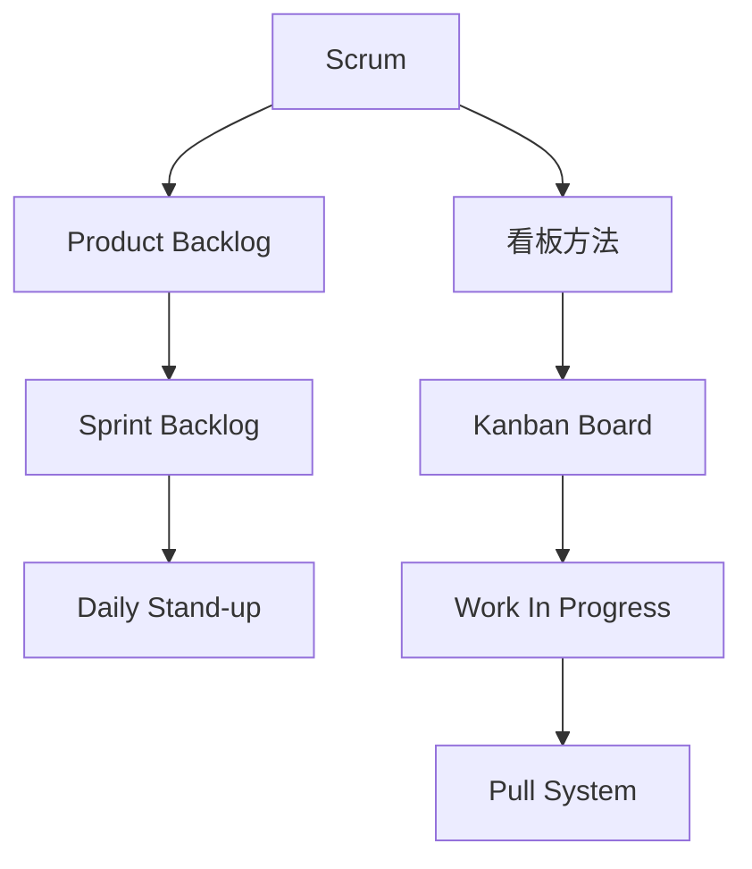

                 

 **关键词**：敏捷开发，Scrum，看板方法，软件项目管理，团队协作

**摘要**：本文旨在探讨敏捷开发中的Scrum和看板方法，这两种方法在软件项目管理中扮演着重要的角色。通过深入分析它们的核心理念、操作步骤、优缺点以及应用领域，帮助读者更好地理解和应用这些方法，以提高项目管理和团队协作的效率。

## 1. 背景介绍

### 敏捷开发的起源与发展

敏捷开发（Agile Development）起源于20世纪90年代末，是对传统瀑布模型（Waterfall Model）的一种反思和改进。传统瀑布模型强调严格按照预定的计划进行，但在面对复杂和不断变化的需求时，往往显得力不从心。敏捷开发则主张以人为核心，强调快速反馈和持续迭代，通过灵活应对变化来提高软件开发的效率和产品质量。

### Scrum与看板方法的提出

Scrum和看板方法是敏捷开发的两大重要实践。Scrum由Ken Schwaber和Jeff Sutherland在2001年提出，强调通过短期迭代（Sprint）和每日站立会议（Daily Stand-up）来提高团队的协作效率和项目的透明度。看板方法则起源于日本丰田汽车公司的精益生产（Lean Manufacturing）理念，由Kanban creator David Anderson在1990年代末提出，通过可视化和限制在进度中的工作项（Work In Progress, WIP）数量，来优化流程和减少浪费。

## 2. 核心概念与联系

### 核心概念

#### Scrum

- **Sprint**：Scrum的基本工作单元，通常是2-4周，团队在Sprint期间集中精力完成预定的任务。
- **Product Backlog**：产品负责人（Product Owner）维护的待办事项列表，记录了产品的所有需求。
- **Sprint Backlog**：团队在Sprint期间需要完成的工作项列表，从Product Backlog中选取并分配给团队成员。
- **Daily Stand-up**：每天早晨举行的简短会议，团队成员分享当天的工作计划和遇到的问题。

#### 看板方法

- **Kanban Board**：看板板，用于可视化管理工作流程，通常包括三个区域：To Do，Doing，Done。
- **Work In Progress (WIP)**：在进度中的工作项数量，用于限制工作流程中的并发任务数量。
- **Pull System**：团队根据工作流程的能力和容量来领取任务，而不是一次性分配所有任务。

### Mermaid 流程图



## 3. 核心算法原理 & 具体操作步骤

### 3.1 算法原理概述

#### Scrum

Scrum的核心在于通过短周期迭代（Sprint）来不断调整和优化产品的开发过程。每个Sprint都是一个完整的项目周期，从规划、开发到验收和评估。Scrum强调团队的自我管理，通过Daily Stand-up来确保团队成员之间的沟通和协调。

#### 看板方法

看板方法的核心在于通过可视化和限制WIP数量来优化工作流程。团队在Kanban Board上追踪每个工作项的状态，通过Pull System来确保工作流程的连续性和效率。

### 3.2 算法步骤详解

#### Scrum

1. **产品规划**：产品负责人维护Product Backlog，确定产品的优先级和需求。
2. **Sprint规划**：团队从Product Backlog中选取任务，形成Sprint Backlog。
3. **Sprint开发**：团队在Sprint期间集中精力完成Sprint Backlog中的任务。
4. **每日站立会议**：团队在每天早晨举行Daily Stand-up，分享工作进展和问题。
5. **Sprint评审**：在Sprint结束时，团队演示完成的任务，收集反馈并更新Product Backlog。
6. **Sprint回顾**：团队回顾Sprint过程中的表现，找出改进点。

#### 看板方法

1. **初始化Kanban Board**：定义三个区域：To Do，Doing，Done。
2. **确定WIP限制**：根据团队的工作能力和流程，设定每个区域的WIP数量。
3. **任务分配**：团队成员从To Do区域领取任务，开始工作。
4. **任务进展**：任务状态在Kanban Board上实时更新。
5. **任务完成**：任务完成并移动到Done区域。
6. **持续优化**：团队定期回顾和调整工作流程和WIP限制。

### 3.3 算法优缺点

#### Scrum

**优点**：
- 强调团队协作和自我管理。
- 通过短周期迭代快速调整和优化。
- 提高项目的透明度和可预测性。

**缺点**：
- 对团队的要求较高，需要团队成员具备较高的自我管理能力和沟通技巧。
- 初始规划时间较长。

#### 看板方法

**优点**：
- 灵活性高，适合应对变化的需求。
- 通过可视化和限制WIP来优化流程。
- 简单易行，易于理解和实施。

**缺点**：
- 对WIP的限制可能导致资源浪费。
- 可能导致团队成员之间的依赖性增加。

### 3.4 算法应用领域

Scrum和看板方法广泛应用于软件开发、IT项目管理、制造业等领域。它们在复杂、多变的环境中表现出色，可以帮助团队提高工作效率和产品质量。

## 4. 数学模型和公式 & 详细讲解 & 举例说明

### 4.1 数学模型构建

Scrum和看板方法中的数学模型主要涉及迭代周期、工作量和资源分配等。以下是一个简单的数学模型：

#### Scrum

- **迭代周期（T）**：T = Sprint长度
- **工作量（W）**：W = Sprint Backlog中任务的总工作量
- **资源（R）**：R = 团队成员的总数量

#### 看板方法

- **WIP限制（L）**：L = 各区域WIP数量的最小值
- **流程效率（E）**：E = 完成的工作量 / 流程中的总时间

### 4.2 公式推导过程

#### Scrum

- **迭代周期（T）**：T = Sprint长度
- **工作量（W）**：W = Sprint Backlog中任务的总工作量
- **资源（R）**：R = 团队成员的总数量

#### 看板方法

- **WIP限制（L）**：L = 各区域WIP数量的最小值
- **流程效率（E）**：E = 完成的工作量 / 流程中的总时间

### 4.3 案例分析与讲解

#### Scrum案例

假设一个团队使用Scrum方法开发一个项目，项目包含10个任务，总工作量为100个点。团队决定每个Sprint长度为2周。在第一个Sprint中，团队完成了5个任务，总工作量为50个点。

- **迭代周期（T）**：T = 2周
- **工作量（W）**：W = 100个点
- **资源（R）**：R = 5人

#### 看板方法案例

假设一个团队使用看板方法开发一个项目，项目包含5个工作区，每个区域的WIP限制为2个任务。在第一周，团队完成了3个任务，总工作量为30个点。

- **WIP限制（L）**：L = 2个任务
- **流程效率（E）**：E = 3个任务 / 7天 = 0.429

## 5. 项目实践：代码实例和详细解释说明

### 5.1 开发环境搭建

在本节中，我们将使用Git和GitHub来管理代码，使用Jenkins进行自动化构建和测试。以下是一个基本的开发环境搭建步骤：

1. 安装Git：在终端中运行 `sudo apt-get install git`（对于Ubuntu系统）或 `brew install git`（对于MacOS系统）。
2. 创建GitHub账户并创建一个新仓库。
3. 配置Git：在终端中运行 `git config --global user.name "your_name"` 和 `git config --global user.email "your_email@example.com"`。
4. 安装Jenkins：在终端中运行 `sudo apt-get install jenkins`（对于Ubuntu系统）或 `brew install jenkins`（对于MacOS系统）。

### 5.2 源代码详细实现

在本节中，我们将使用Java编写一个简单的Web服务，用于处理用户请求并返回响应。以下是一个简单的代码实现：

```java
import java.io.*;
import javax.servlet.*;
import javax.servlet.http.*;

public class MyServlet extends HttpServlet {
    public void doGet(HttpServletRequest request, HttpServletResponse response) throws ServletException, IOException {
        response.setContentType("text/html");
        PrintWriter out = response.getWriter();
        out.println("<html><body>");
        out.println("Hello, World!");
        out.println("</body></html>");
    }
}
```

### 5.3 代码解读与分析

在上面的代码中，我们定义了一个名为`MyServlet`的类，该类继承自`HttpServlet`类。`doGet`方法是处理GET请求的入口点，它设置响应的内容类型为HTML，并写入一段简单的HTML代码。

### 5.4 运行结果展示

通过使用Jenkins，我们可以自动化构建和测试Web服务。在Jenkins中配置一个简单的构建步骤，运行以下命令：

```bash
mvn clean install
```

构建成功后，我们可以在浏览器中访问Web服务，例如 `http://localhost:8080/MyServlet`，看到返回的HTML页面。

## 6. 实际应用场景

### 6.1 软件开发

Scrum和看板方法广泛应用于软件开发项目，帮助团队更好地管理项目进度、提高代码质量和用户体验。

### 6.2 IT项目管理

在IT项目管理中，Scrum和看板方法可以帮助项目经理更好地控制项目风险、提高项目透明度和团队协作效率。

### 6.3 制造业

看板方法在制造业中也有广泛的应用，通过优化生产流程和减少浪费，提高生产效率和产品质量。

## 7. 工具和资源推荐

### 7.1 学习资源推荐

- 《Scrum精髓：团队、产品经理与实践者指南》
- 《Kanban：从实践到原则》
- 《敏捷软件开发：原则、模式与实践》

### 7.2 开发工具推荐

- Git：版本控制工具
- GitHub：代码托管平台
- Jenkins：自动化构建和测试工具

### 7.3 相关论文推荐

- 《Scrum：The Art of Doing Twice the Work in Half the Time》
- 《Kanban Method: From Philosophy to Methodology to Tools》
- 《Agile Project Management with Scrum》

## 8. 总结：未来发展趋势与挑战

### 8.1 研究成果总结

Scrum和看板方法在过去几十年中取得了显著的成果，广泛应用于各个行业。通过不断的研究和实践，这些方法在优化项目管理和团队协作方面发挥了重要作用。

### 8.2 未来发展趋势

未来，Scrum和看板方法将继续演进，更注重人工智能和机器学习的应用，以实现自动化和智能化的项目管理。

### 8.3 面临的挑战

在快速变化的市场环境中，Scrum和看板方法需要不断适应新的技术和需求，以保持其有效性。

### 8.4 研究展望

未来，研究应关注如何将Scrum和看板方法与人工智能和大数据技术相结合，以实现更高效的项目管理和团队协作。

## 9. 附录：常见问题与解答

### 9.1 Scrum和看板方法有什么区别？

Scrum和看板方法都是敏捷开发的实践，但侧重点不同。Scrum更注重短期迭代和自我管理，而看板方法更注重流程优化和可视化。

### 9.2 如何选择Scrum或看板方法？

根据项目的特点和团队的需求来选择。如果项目需求变化频繁，看板方法可能更适合；如果需要更严格的规划和控制，Scrum可能更适合。

### 9.3 敏捷开发是否适用于所有项目？

敏捷开发适用于大多数项目，特别是那些需求变化频繁、客户反馈重要的项目。但对于一些需求明确、周期较长的项目，传统开发方法可能更适用。作者：禅与计算机程序设计艺术 / Zen and the Art of Computer Programming。----------------------------------------------------------------

<|im_sep|>---

以上是关于《敏捷开发方法：Scrum与看板方法》的文章，如果您有任何问题或需要进一步讨论，请随时告诉我。我在这里帮助您了解和应用这些敏捷开发的方法。

