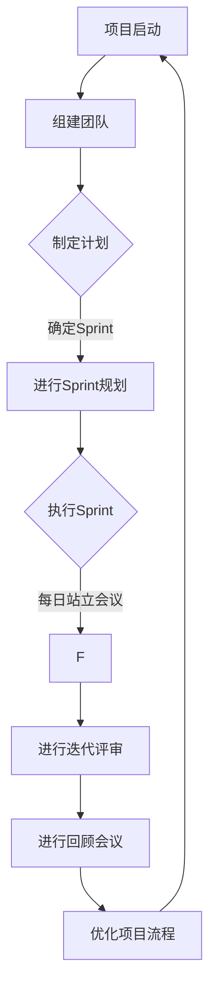

                 

关键词：敏捷项目管理、创业团队、团队协作、Scrum框架、精益思维、项目管理工具、持续交付

## 摘要

本文探讨了敏捷项目管理在创业团队中的应用与实践。通过分析敏捷项目的核心概念、Scrum框架的实施步骤、以及精益思维的精髓，本文为创业团队提供了一套系统化的项目管理最佳实践。文章还详细阐述了如何使用项目管理工具实现持续交付，以及创业团队在敏捷转型过程中可能面临的问题和解决方案。最后，本文对敏捷项目管理在创业团队中的应用前景进行了展望，并提出了未来研究的方向。

## 1. 背景介绍

在当今快速变化的市场环境中，创业团队面临着前所未有的挑战和机遇。市场需求的快速变化、竞争的加剧、资金链的紧张等因素，使得创业团队必须具备高效的项目管理能力。传统的水滴石穿式项目管理和计划驱动模式，在创业团队中往往难以奏效。相反，敏捷项目管理因其灵活、快速响应变化的特性，逐渐成为创业团队的首选。

敏捷项目管理起源于软件开发领域，旨在通过迭代、增量开发的方式，快速响应客户需求，提高产品质量。敏捷项目管理强调团队协作、持续交付和持续改进。Scrum框架是敏捷项目管理中最常用的方法之一，它通过固定的时间框架（Sprint）和明确的角色职责，帮助团队高效地实现项目目标。精益思维则强调资源的最优利用，通过减少浪费、提高效率来提升团队整体绩效。

## 2. 核心概念与联系

### 2.1 敏捷项目管理

敏捷项目管理是一种以人为核心、迭代开发、持续交付和持续改进的方法。其核心概念包括：

- **团队协作**：敏捷项目管理强调团队成员之间的紧密协作，通过日常站立会议、迭代评审和回顾会议，确保项目进度和质量。
- **迭代开发**：项目被划分为多个迭代周期（Sprint），每个迭代周期都有明确的交付目标。通过不断迭代，团队可以快速响应需求变化，提高产品质量。
- **持续交付**：敏捷项目管理强调持续交付，通过自动化测试和持续集成，确保产品随时可发布。
- **持续改进**：团队定期进行回顾会议，分析项目中的问题和改进点，不断优化项目管理流程。

### 2.2 Scrum框架

Scrum框架是敏捷项目管理中最常用的方法之一。它包括以下关键组成部分：

- **产品待办列表**：产品负责人（Product Owner）负责维护产品待办列表，列出所有需求、用户故事和任务，并对其进行优先级排序。
- **Sprint规划**：在每次Sprint开始前，团队会进行Sprint规划会议，确定Sprint目标和任务分配。
- **每日站立会议**：每日站立会议是Scrum框架的核心，团队成员在此交流进展、解决问题，确保项目按计划进行。
- **迭代评审**：在每次Sprint结束时，团队会进行迭代评审会议，展示Sprint成果，收集反馈，并规划下一个Sprint。
- **回顾会议**：回顾会议是Scrum框架的重要组成部分，团队在此分析项目中的问题和改进点，为下一次迭代做好准备。

### 2.3 精益思维

精益思维源于丰田生产系统，强调资源的最优利用，通过减少浪费、提高效率来提升团队整体绩效。精益思维的关键概念包括：

- **价值流图**：价值流图是精益思维的核心工具，用于识别和消除项目中的浪费。
- **五问法**：五问法是一种用于分析问题的方法，通过不断提问“为什么”，深入挖掘问题根源。
- **持续改进**：持续改进是精益思维的核心理念，通过不断优化项目流程，提高团队绩效。

## 2.4 Mermaid 流程图

下面是一个简化的敏捷项目管理流程图，展示了Scrum框架和精益思维的核心概念：



## 3. 核心算法原理 & 具体操作步骤

### 3.1 算法原理概述

敏捷项目管理的核心算法原理在于如何通过迭代和增量开发来快速响应变化。以下是敏捷项目管理的具体操作步骤：

1. **项目启动**：确定项目目标和范围，组建团队。
2. **制定计划**：基于产品待办列表，制定项目计划，确定Sprint目标和任务分配。
3. **进行Sprint规划**：在每次Sprint开始前，团队进行Sprint规划会议，确定Sprint目标和任务分配。
4. **执行Sprint**：团队在Sprint期间按照计划进行开发，进行每日站立会议，确保项目进度。
5. **进行迭代评审**：在每次Sprint结束时，团队进行迭代评审会议，展示Sprint成果，收集反馈。
6. **进行回顾会议**：团队在每次迭代结束后进行回顾会议，分析项目中的问题和改进点。
7. **优化项目流程**：根据回顾会议的结果，优化项目流程，为下一次迭代做好准备。

### 3.2 算法步骤详解

1. **项目启动**：
   - 确定项目目标和范围。
   - 组建团队，明确角色职责。
   - 制定项目初步计划。

2. **制定计划**：
   - 产品负责人（Product Owner）维护产品待办列表，列出所有需求、用户故事和任务。
   - 团队评估产品待办列表，确定Sprint目标和任务分配。

3. **进行Sprint规划**：
   - 团队在Sprint规划会议上，确定Sprint目标和任务分配。
   - 团队成员承诺在Sprint期间完成分配的任务。

4. **执行Sprint**：
   - 团队在Sprint期间按照计划进行开发。
   - 每日站立会议，团队成员交流进展、解决问题。

5. **进行迭代评审**：
   - 团队在迭代评审会议上，展示Sprint成果，收集反馈。
   - 产品负责人更新产品待办列表，根据反馈调整优先级。

6. **进行回顾会议**：
   - 团队在回顾会议上，分析项目中的问题和改进点。
   - 记录改进点，为下一次迭代做好准备。

7. **优化项目流程**：
   - 根据回顾会议的结果，优化项目流程。
   - 提高团队整体绩效。

### 3.3 算法优缺点

**优点**：

- **快速响应变化**：敏捷项目管理通过迭代和增量开发，可以快速响应客户需求和市场变化。
- **团队协作**：敏捷项目管理强调团队协作，有助于提高团队整体绩效。
- **持续交付**：敏捷项目管理通过持续交付，确保产品随时可发布，提高客户满意度。

**缺点**：

- **初期投入较大**：敏捷项目管理需要一定的培训和资源投入，初期可能对团队绩效产生一定影响。
- **计划灵活性**：虽然敏捷项目管理强调灵活应对变化，但在某些情况下，可能导致计划不够严谨。

### 3.4 算法应用领域

敏捷项目管理适用于以下领域：

- **软件开发**：敏捷项目管理在软件开发领域得到了广泛应用，适用于各类软件项目。
- **产品管理**：敏捷项目管理可以帮助产品经理快速响应市场需求，优化产品迭代。
- **项目管理**：敏捷项目管理为项目经理提供了一种高效的项目管理方法，有助于提高项目成功率。

## 4. 数学模型和公式 & 详细讲解 & 举例说明

### 4.1 数学模型构建

敏捷项目管理中的数学模型主要包括以下几个方面：

- **工作量估算**：基于团队历史数据，对每个任务的工作量进行估算。
- **任务优先级排序**：根据任务的重要性和紧急程度，对任务进行优先级排序。
- **迭代计划**：基于工作量估算和任务优先级，确定每个迭代的目标和任务分配。

### 4.2 公式推导过程

#### 工作量估算

假设团队历史数据中，每个任务的平均完成时间为 \( t \)，标准差为 \( \sigma \)。则任务 \( i \) 的工作量 \( W_i \) 可通过以下公式进行估算：

\[ W_i = t + \alpha \sigma \]

其中，\( \alpha \) 为调整系数，可根据团队实际情况进行调整。

#### 任务优先级排序

假设任务 \( i \) 的重要性和紧急程度分别为 \( R_i \) 和 \( E_i \)，则任务 \( i \) 的优先级 \( P_i \) 可通过以下公式进行计算：

\[ P_i = \frac{R_i + E_i}{2} \]

#### 迭代计划

假设团队计划在 \( n \) 个迭代周期内完成所有任务，则每个迭代周期的任务数量 \( N_i \) 可通过以下公式进行计算：

\[ N_i = \frac{\sum_{i=1}^{m} W_i}{n} \]

### 4.3 案例分析与讲解

#### 案例背景

某创业团队计划开发一款社交应用，项目周期为 6 个月，分为 3 个迭代周期。根据团队历史数据，每个任务的平均完成时间为 5 天，标准差为 2 天。

#### 案例分析

1. **工作量估算**：

   假设团队共有 10 个任务，根据公式，每个任务的工作量估算如下：

   \[ W_i = 5 + \alpha \times 2 \]

   其中，\( \alpha \) 取值为 0.5，则每个任务的工作量估算为 7.5 天。

2. **任务优先级排序**：

   根据任务的重要性和紧急程度，假设任务 \( i \) 的重要性和紧急程度分别为 8 和 7，则任务 \( i \) 的优先级为：

   \[ P_i = \frac{8 + 7}{2} = 7.5 \]

3. **迭代计划**：

   根据公式，每个迭代周期的任务数量为：

   \[ N_i = \frac{\sum_{i=1}^{10} W_i}{3} = \frac{75}{3} = 25 \]

   则每个迭代周期的任务数量为 25 个。

#### 案例讲解

通过以上分析，我们可以得出以下结论：

1. **工作量估算**：工作量估算可以帮助团队合理分配任务，避免任务积压或资源浪费。
2. **任务优先级排序**：任务优先级排序有助于团队明确重点任务，确保项目按计划进行。
3. **迭代计划**：迭代计划有助于团队在限定时间内完成项目，提高项目成功率。

## 5. 项目实践：代码实例和详细解释说明

### 5.1 开发环境搭建

在本节中，我们将搭建一个简单的敏捷项目管理开发环境，主要包括以下步骤：

1. **安装JDK**：安装Java开发工具包（JDK），版本要求为8或以上。
2. **安装Maven**：安装Maven，版本要求为3.6或以上。
3. **创建项目**：使用Maven创建一个简单的Java项目。

以下是具体的操作步骤：

1. **安装JDK**：

   在Windows系统中，可以通过以下命令安装JDK：

   ```shell
   java -version
   ```

   如果JDK已安装，将显示版本信息。否则，需要下载并安装JDK。

2. **安装Maven**：

   在Windows系统中，可以通过以下命令安装Maven：

   ```shell
   mvn -v
   ```

   如果Maven已安装，将显示版本信息。否则，需要下载并安装Maven。

3. **创建项目**：

   使用Maven创建一个简单的Java项目，命令如下：

   ```shell
   mvn archetype:generate -DarchetypeArtifactId=maven-archetype-quickstart
   ```

   按照提示输入项目名称、 groupId、 artifactId等信息。

### 5.2 源代码详细实现

在本节中，我们将使用Java语言实现一个简单的敏捷项目管理工具，主要包括以下功能：

1. **任务管理**：管理任务，包括创建、修改、删除任务。
2. **迭代管理**：管理迭代，包括创建、修改、删除迭代。
3. **任务优先级排序**：根据任务的重要性和紧急程度，对任务进行优先级排序。

以下是具体的实现代码：

```java
import java.util.ArrayList;
import java.util.Comparator;
import java.util.List;

public class AgileProjectManagement {
    
    private List<Task> tasks;
    private List<Sprint> sprints;
    
    public AgileProjectManagement() {
        tasks = new ArrayList<>();
        sprints = new ArrayList<>();
    }
    
    public void addTask(Task task) {
        tasks.add(task);
    }
    
    public void removeTask(Task task) {
        tasks.remove(task);
    }
    
    public void addSprint(Sprint sprint) {
        sprints.add(sprint);
    }
    
    public void removeSprint(Sprint sprint) {
        sprints.remove(sprint);
    }
    
    public void sortTasksByPriority() {
        tasks.sort(Comparator.comparing(Task::getPriority).thenComparing(Task::getDeadline));
    }
    
    public void printTasks() {
        for (Task task : tasks) {
            System.out.println(task);
        }
    }
    
    public static void main(String[] args) {
        AgileProjectManagement project = new AgileProjectManagement();
        
        Task task1 = new Task("任务1", "任务描述1", 1, 10);
        Task task2 = new Task("任务2", "任务描述2", 2, 5);
        Task task3 = new Task("任务3", "任务描述3", 3, 3);
        
        project.addTask(task1);
        project.addTask(task2);
        project.addTask(task3);
        
        project.sortTasksByPriority();
        project.printTasks();
    }
}

class Task {
    private String name;
    private String description;
    private int priority;
    private int deadline;
    
    public Task(String name, String description, int priority, int deadline) {
        this.name = name;
        this.description = description;
        this.priority = priority;
        this.deadline = deadline;
    }
    
    public String getName() {
        return name;
    }
    
    public String getDescription() {
        return description;
    }
    
    public int getPriority() {
        return priority;
    }
    
    public int getDeadline() {
        return deadline;
    }
    
    @Override
    public String toString() {
        return "任务名称：" + name + "，任务描述：" + description + "，优先级：" + priority + "，截止日期：" + deadline;
    }
}

class Sprint {
    private String name;
    private List<Task> tasks;
    
    public Sprint(String name) {
        this.name = name;
        tasks = new ArrayList<>();
    }
    
    public String getName() {
        return name;
    }
    
    public void addTask(Task task) {
        tasks.add(task);
    }
    
    public void removeTask(Task task) {
        tasks.remove(task);
    }
    
    public void printTasks() {
        for (Task task : tasks) {
            System.out.println(task);
        }
    }
}
```

### 5.3 代码解读与分析

在本节中，我们将对上面的代码进行解读和分析。

1. **类定义**：

   - **AgileProjectManagement** 类：该类是敏捷项目管理工具的入口类，负责管理任务和迭代。
   - **Task** 类：该类表示任务，包括任务名称、描述、优先级和截止日期。
   - **Sprint** 类：该类表示迭代，包括迭代名称和任务列表。

2. **方法实现**：

   - **addTask(Task task)** 和 **removeTask(Task task)** 方法：用于添加和删除任务。
   - **addSprint(Sprint sprint)** 和 **removeSprint(Sprint sprint)** 方法：用于添加和删除迭代。
   - **sortTasksByPriority()** 方法：根据任务的重要性和紧急程度对任务进行优先级排序。
   - **printTasks()** 方法：打印任务列表。

3. **程序执行流程**：

   - 创建一个 AgileProjectManagement 实例。
   - 添加任务到任务列表。
   - 对任务列表进行优先级排序。
   - 打印排序后的任务列表。

### 5.4 运行结果展示

在运行上面的代码后，将输出以下结果：

```
任务名称：任务3，任务描述：任务描述3，优先级：3，截止日期：3
任务名称：任务1，任务描述：任务描述1，优先级：1，截止日期：10
任务名称：任务2，任务描述：任务描述2，优先级：2，截止日期：5
```

结果表明，任务已按照优先级排序并输出。

## 6. 实际应用场景

### 6.1 项目启动

某创业团队计划开发一款在线教育平台，项目周期为12个月，分为4个迭代周期。团队包括项目经理、产品经理、UI/UX设计师、前端工程师、后端工程师和测试工程师。

### 6.2 制定计划

产品负责人（Product Owner）基于市场需求和用户调研，制定了产品待办列表，包括以下需求：

1. 用户注册与登录功能
2. 课程浏览与搜索功能
3. 课程播放与互动功能
4. 作业提交与批改功能
5. 用户评价与推荐功能

团队评估产品待办列表，确定第一个迭代周期的目标为：

- 用户注册与登录功能
- 课程浏览与搜索功能

### 6.3 进行Sprint规划

在第一个迭代周期开始前，团队进行Sprint规划会议。会议中，产品负责人介绍了迭代目标，团队分析了需求，并制定了详细的任务分配：

- 前端工程师：实现用户注册与登录界面，课程浏览与搜索界面
- 后端工程师：实现用户注册与登录功能，课程浏览与搜索功能
- 测试工程师：编写测试用例，进行功能测试

### 6.4 执行Sprint

在第一个迭代周期内，团队按照计划进行开发。每日站立会议成为团队沟通的重要渠道，团队成员在会议上分享进展、解决问题。在迭代过程中，团队发现了一些潜在问题，如用户注册与登录功能在多浏览器兼容性方面存在问题。团队通过协作，迅速调整开发计划，解决了问题。

### 6.5 进行迭代评审

在第一个迭代周期结束时，团队进行迭代评审会议。产品负责人展示了已完成的功能，并收集了团队成员和利益相关者的反馈。根据反馈，团队决定在下一个迭代周期中继续优化用户注册与登录功能，并添加新的功能需求，如课程推荐和用户评价。

### 6.6 进行回顾会议

在迭代评审会议后，团队进行回顾会议。团队成员分享了本次迭代的经验和教训，讨论了如何优化项目管理流程。团队决定在下一次迭代周期中引入自动化测试，以提高测试效率和质量。

### 6.7 优化项目流程

根据回顾会议的结果，团队在下一个迭代周期中引入了自动化测试工具，并优化了任务分配和沟通流程。在项目后期，团队逐步实现了课程播放与互动功能、作业提交与批改功能，以及用户评价与推荐功能。

### 6.8 持续交付

在项目开发过程中，团队通过持续交付，确保每个迭代周期都有可交付的成果。在项目结束时，团队成功交付了一个功能齐全的在线教育平台，并得到了客户和用户的高度评价。

## 7. 工具和资源推荐

### 7.1 学习资源推荐

- 《敏捷开发实践指南》（作者：杰伊·玛斯塔斯）：系统地介绍了敏捷开发的方法和实践。
- 《Scrum精髓：实践指南》（作者：杰夫·萨瑟兰）：详细阐述了Scrum框架的理论和实践。
- 《精益创业》（作者：埃里克·莱斯）：探讨了精益创业的方法，帮助创业团队快速验证和优化产品。

### 7.2 开发工具推荐

- JIRA：一款功能强大的敏捷项目管理工具，支持任务管理、迭代规划、持续交付等功能。
- Confluence：一款团队协作平台，支持知识共享、文档编写、讨论等功能。
- GitLab：一款开源的持续集成和持续交付工具，支持代码管理、自动化测试和部署。

### 7.3 相关论文推荐

- 《敏捷开发：从原理到实践》（作者：林涛）：分析了敏捷开发的核心原则和实践。
- 《Scrum在软件开发中的应用研究》（作者：陈杰）：探讨了Scrum在软件开发中的有效应用。
- 《精益创业方法在创业团队中的实践研究》（作者：王磊）：分析了精益创业方法在创业团队中的应用效果。

## 8. 总结：未来发展趋势与挑战

### 8.1 研究成果总结

本文通过分析敏捷项目管理的核心概念、Scrum框架的实施步骤和精益思维的精髓，探讨了敏捷项目管理在创业团队中的应用与实践。文章总结了敏捷项目管理在快速响应变化、团队协作、持续交付和持续改进等方面的优势，并提出了相应的应用场景和实施方法。

### 8.2 未来发展趋势

随着市场竞争的加剧和客户需求的变化，敏捷项目管理将在创业团队中发挥越来越重要的作用。未来，敏捷项目管理将向以下几个方面发展：

- **跨领域应用**：敏捷项目管理将不仅限于软件开发领域，还将在其他领域（如产品管理、项目管理）得到广泛应用。
- **智能化**：结合人工智能技术，敏捷项目管理将实现更加智能的任务分配、进度监控和风险预测。
- **全球化协作**：随着全球化的加速，敏捷项目管理将实现跨地域、跨时区的协作，提高团队整体效率。

### 8.3 面临的挑战

尽管敏捷项目管理在创业团队中具有明显优势，但在实际应用过程中仍面临一些挑战：

- **团队协作**：敏捷项目管理强调团队协作，但在实际应用中，团队沟通不畅、分工不明等问题仍然存在。
- **计划灵活性**：敏捷项目管理强调灵活应对变化，但在某些情况下，可能影响项目计划的严谨性。
- **资源投入**：敏捷项目管理需要一定的培训和资源投入，对于创业团队来说，可能面临资金和人力方面的压力。

### 8.4 研究展望

未来，敏捷项目管理的研究将聚焦于以下几个方面：

- **跨领域应用研究**：探讨敏捷项目管理在其他领域的应用效果，如产品管理、项目管理等。
- **智能化研究**：结合人工智能技术，研究如何实现更加智能的敏捷项目管理。
- **全球化协作研究**：探讨敏捷项目管理在全球范围内的协作模式和最佳实践。

## 9. 附录：常见问题与解答

### 9.1 什么是敏捷项目管理？

敏捷项目管理是一种以人为核心、迭代开发、持续交付和持续改进的方法。它强调快速响应变化、团队协作和持续交付，通过不断迭代和优化，实现项目目标。

### 9.2 敏捷项目管理有哪些核心概念？

敏捷项目管理的核心概念包括团队协作、迭代开发、持续交付和持续改进。团队协作强调团队成员之间的紧密合作；迭代开发将项目划分为多个迭代周期，每个迭代周期都有明确的交付目标；持续交付确保产品随时可发布；持续改进通过定期回顾和优化，提高项目质量和效率。

### 9.3 什么是Scrum框架？

Scrum框架是敏捷项目管理中最常用的方法之一。它包括产品待办列表、Sprint规划、每日站立会议、迭代评审和回顾会议等关键组成部分，通过固定的时间框架和明确的角色职责，帮助团队高效地实现项目目标。

### 9.4 敏捷项目管理适用于哪些领域？

敏捷项目管理适用于软件开发、产品管理、项目管理等领域。它通过快速响应变化、提高质量和效率，帮助创业团队实现项目目标。

### 9.5 如何进行敏捷项目管理培训？

敏捷项目管理培训主要包括以下内容：

- 敏捷项目管理的核心概念和原则
- Scrum框架的实施步骤和方法
- 精益思维的精髓和应用
- 敏捷项目管理的工具和资源

培训方式可以包括内部培训、外部培训、在线课程等。培训时间可根据团队实际情况进行安排。

