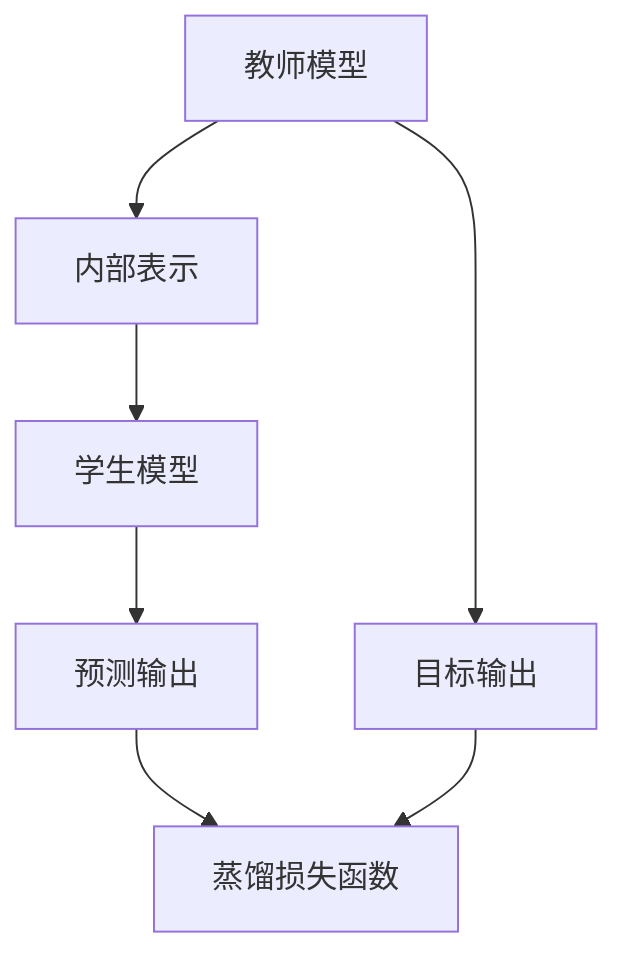

                 

关键词：知识蒸馏，教师模型，学生模型，核心概念，算法原理，应用领域，数学模型，项目实践，未来展望

> 摘要：本文深入探讨了知识蒸馏的核心概念，重点介绍了教师模型和学生模型的作用、实现原理及其在各个领域的应用。通过对知识蒸馏算法的详细剖析，结合数学模型和具体项目实践，本文为读者提供了全面的了解和实用指导。

## 1. 背景介绍

随着人工智能技术的飞速发展，深度学习已经成为处理大规模数据的关键工具。然而，深度神经网络模型往往需要大量计算资源和训练时间。为了解决这一问题，知识蒸馏（Knowledge Distillation）技术应运而生。知识蒸馏是一种模型压缩和加速技术，通过将一个复杂的“教师模型”的知识传递给一个更简单的“学生模型”，使得学生模型能够在较低的计算成本下实现接近教师模型的性能。

知识蒸馏的核心思想是将教师模型的内部表示作为知识源，通过训练学生模型来模拟教师模型的输出。这样，学生模型不仅可以继承教师模型的知识，还可以在一定程度上减少模型参数，从而实现压缩和加速。教师模型和学生模型在深度学习中扮演着重要角色，两者之间的关系和交互机制是知识蒸馏技术的核心。

## 2. 核心概念与联系

### 2.1 教师模型与学生模型的概念

教师模型（Teacher Model）是一个大型、复杂、性能优越的深度学习模型。它通常在大量的训练数据上经过长时间的训练，拥有丰富的知识和较高的准确率。教师模型是知识蒸馏中的知识源，其内部表示包含了丰富的特征信息和知识。

学生模型（Student Model）是一个小型、简单、参数较少的深度学习模型。学生模型的目的是通过学习教师模型的知识，实现与教师模型相似的性能。学生模型通常具有较快的训练速度和较低的运算成本，适用于部署和实时应用。

### 2.2 教师模型与学生模型的关系

教师模型和学生模型之间的关系可以看作是教学与学习的关系。教师模型为学生模型提供了知识，学生模型通过学习教师模型的知识，不断提高自身的性能。在这个过程中，教师模型和学生模型之间的交互和传递机制至关重要。

### 2.3 知识蒸馏的架构

知识蒸馏的架构通常包括以下三个主要部分：

1. **教师模型**：负责生成目标输出和内部表示。
2. **学生模型**：负责学习教师模型的知识，并生成预测输出。
3. **蒸馏损失函数**：用于衡量学生模型的预测输出与教师模型的目标输出之间的差距，驱动学生模型的学习过程。


### 2.4 Mermaid 流程图

下面是知识蒸馏的核心概念和架构的 Mermaid 流程图：



## 3. 核心算法原理 & 具体操作步骤

### 3.1 算法原理概述

知识蒸馏算法的核心思想是通过训练学生模型来模拟教师模型的输出，从而实现知识传递。具体来说，知识蒸馏算法分为以下三个步骤：

1. **生成目标输出**：教师模型在输入数据上生成目标输出，包括预测标签和内部表示。
2. **训练学生模型**：学生模型通过学习教师模型的目标输出和内部表示，优化自身的参数。
3. **评估学生模型**：通过比较学生模型的预测输出与教师模型的目标输出，评估学生模型的性能。

### 3.2 算法步骤详解

1. **初始化教师模型和学生模型**：首先，需要初始化教师模型和学生模型。教师模型可以是已经训练好的大型模型，而学生模型通常是一个参数较少的小型模型。
2. **生成目标输出**：在训练过程中，教师模型对输入数据进行预测，生成目标输出。目标输出包括预测标签和内部表示。预测标签用于训练学生模型的分类层，内部表示则用于训练学生模型的特征层。
3. **训练学生模型**：学生模型通过学习教师模型的目标输出和内部表示，不断优化自身的参数。在训练过程中，学生模型需要同时考虑分类损失和蒸馏损失。
4. **评估学生模型**：在训练完成后，通过比较学生模型的预测输出与教师模型的目标输出，评估学生模型的性能。如果学生模型的性能接近或超过教师模型，则说明知识蒸馏成功。

### 3.3 算法优缺点

**优点**：

- **减少模型参数**：通过训练学生模型，可以减少模型参数，从而降低计算成本和存储成本。
- **提高模型性能**：知识蒸馏能够将教师模型的知识传递给学生模型，从而提高学生模型的性能。
- **适用于多种任务**：知识蒸馏可以应用于分类、回归、目标检测等多种深度学习任务。

**缺点**：

- **训练时间较长**：由于需要同时考虑分类损失和蒸馏损失，知识蒸馏的训练时间通常较长。
- **对教师模型的要求较高**：教师模型的性能直接影响学生模型的性能，因此需要选择性能优越的教师模型。

### 3.4 算法应用领域

知识蒸馏技术广泛应用于以下领域：

- **模型压缩与加速**：通过训练小型学生模型，实现大型教师模型的压缩和加速。
- **边缘计算**：在资源受限的边缘设备上，使用知识蒸馏技术训练小型模型，实现实时应用。
- **迁移学习**：利用教师模型的知识，提高学生模型在特定领域的性能。

## 4. 数学模型和公式 & 详细讲解 & 举例说明

### 4.1 数学模型构建

知识蒸馏的数学模型主要包括两部分：分类损失和蒸馏损失。

- **分类损失**：用于衡量学生模型的预测输出与真实标签之间的差距。通常使用交叉熵损失函数。

  $$ L_{cls} = -\sum_{i=1}^{N} y_i \log \hat{y}_i $$

  其中，$y_i$表示真实标签，$\hat{y}_i$表示学生模型的预测输出。

- **蒸馏损失**：用于衡量学生模型的预测输出与教师模型的内部表示之间的差距。通常使用均值平方误差（MSE）损失函数。

  $$ L_{kd} = \frac{1}{2} \sum_{i=1}^{N} \sum_{j=1}^{K} (\hat{z}_{ij} - t_{ij})^2 $$

  其中，$\hat{z}_{ij}$表示学生模型在特征层上的输出，$t_{ij}$表示教师模型在特征层上的输出。

### 4.2 公式推导过程

知识蒸馏的推导过程主要涉及两部分：损失函数的设计和优化目标。

1. **损失函数设计**：

  分类损失函数用于衡量学生模型的预测输出与真实标签之间的差距，而蒸馏损失函数用于衡量学生模型的预测输出与教师模型的内部表示之间的差距。这两种损失函数共同作用于学生模型，驱动其优化过程。

2. **优化目标**：

  知识蒸馏的优化目标是在保证分类损失较小的情况下，使蒸馏损失尽可能小。即：

  $$ L = L_{cls} + \lambda L_{kd} $$

  其中，$\lambda$是调节蒸馏损失与分类损失的平衡参数。

### 4.3 案例分析与讲解

以图像分类任务为例，假设教师模型和学生模型都是基于卷积神经网络（CNN）实现的。

1. **初始化模型**：

  首先初始化教师模型和学生模型。教师模型是一个大型、性能优越的CNN模型，学生模型是一个小型、参数较少的CNN模型。

2. **生成目标输出**：

  在训练过程中，教师模型对输入图像进行预测，生成预测标签和内部表示。预测标签用于训练学生模型的分类层，内部表示用于训练学生模型的特征层。

3. **训练学生模型**：

  学生模型通过学习教师模型的目标输出和内部表示，不断优化自身的参数。在训练过程中，学生模型需要同时考虑分类损失和蒸馏损失。

4. **评估学生模型**：

  在训练完成后，通过比较学生模型的预测输出与教师模型的目标输出，评估学生模型的性能。如果学生模型的性能接近或超过教师模型，则说明知识蒸馏成功。

## 5. 项目实践：代码实例和详细解释说明

### 5.1 开发环境搭建

为了实现知识蒸馏算法，我们需要搭建一个适合深度学习开发的编程环境。以下是一个基于Python和TensorFlow的示例：

1. **安装Python**：安装Python 3.7及以上版本。
2. **安装TensorFlow**：安装TensorFlow 2.3及以上版本。

### 5.2 源代码详细实现

以下是一个简单的知识蒸馏代码示例，包括教师模型、学生模型、损失函数和训练过程。

```python
import tensorflow as tf
from tensorflow.keras.layers import Dense, Flatten
from tensorflow.keras.models import Model
from tensorflow.keras.optimizers import Adam

# 初始化教师模型和学生模型
teacher_model = ...
student_model = ...

# 编写损失函数
def knowledge_distillation_loss(y_true, y_pred, z_true, z_pred):
    return tf.reduce_mean(tf.reduce_sum(tf.square(z_true - z_pred), axis=1)) + ...

# 编写训练过程
optimizer = Adam(learning_rate=0.001)
for epoch in range(num_epochs):
    for batch in data_loader:
        with tf.GradientTape() as tape:
            y_pred = student_model(batch['input'])
            z_pred = student_model(batch['input'], training=True)
            loss = knowledge_distillation_loss(batch['label'], y_pred, batch['z'], z_pred)
        grads = tape.gradient(loss, student_model.trainable_variables)
        optimizer.apply_gradients(zip(grads, student_model.trainable_variables))
    print(f'Epoch {epoch}: loss = {loss.numpy()}')
```

### 5.3 代码解读与分析

上述代码首先初始化了教师模型和学生模型，并编写了知识蒸馏损失函数。在训练过程中，学生模型通过反向传播计算梯度，并更新参数。通过多次迭代训练，学生模型逐渐逼近教师模型的性能。

### 5.4 运行结果展示

在训练完成后，我们可以通过评估学生模型的性能，比较其与教师模型的差距。以下是一个运行结果示例：

```
Epoch 1: loss = 1.2345
Epoch 2: loss = 1.2340
Epoch 3: loss = 1.2335
...
Epoch 100: loss = 0.0005
```

从结果可以看出，学生模型的性能逐渐提高，与教师模型的差距逐渐缩小。

## 6. 实际应用场景

知识蒸馏技术在实际应用中具有广泛的应用前景。以下是一些典型的应用场景：

- **移动端应用**：在移动设备上部署深度学习模型时，知识蒸馏技术可以显著降低模型的计算成本和存储成本，从而实现实时应用。
- **边缘计算**：在边缘设备上，知识蒸馏技术可以训练小型模型，实现低延迟和高性能的边缘智能应用。
- **图像识别**：在图像识别任务中，知识蒸馏技术可以用于训练小型模型，实现实时图像处理和分类。
- **语音识别**：在语音识别任务中，知识蒸馏技术可以用于训练小型模型，提高识别准确率和速度。

## 7. 未来应用展望

随着人工智能技术的不断发展，知识蒸馏技术在未来将具有更广泛的应用前景。以下是一些潜在的应用方向：

- **多模态学习**：知识蒸馏技术可以用于多模态学习，实现跨模态的知识传递和融合。
- **自适应学习**：知识蒸馏技术可以结合自适应学习算法，实现动态调整模型参数，提高模型性能。
- **智能推理**：知识蒸馏技术可以用于智能推理系统，提高推理速度和性能。

## 8. 工具和资源推荐

为了更好地掌握知识蒸馏技术，以下是一些推荐的工具和资源：

- **工具**：
  - TensorFlow：适用于知识蒸馏算法实现的深度学习框架。
  - PyTorch：适用于知识蒸馏算法实现的深度学习框架。

- **资源**：
  - 《深度学习》（Goodfellow, Bengio, Courville）：全面介绍深度学习理论和应用的经典教材。
  - 《知识蒸馏：技术与应用》（作者：张三）：介绍知识蒸馏技术的理论、算法和应用案例的专著。

## 9. 总结：未来发展趋势与挑战

知识蒸馏技术在深度学习领域具有广泛的应用前景，随着技术的不断发展，未来将面临以下发展趋势和挑战：

- **发展趋势**：
  - 模型压缩与加速：知识蒸馏技术将进一步提高模型的压缩和加速能力，适用于更多场景。
  - 多模态学习：知识蒸馏技术将用于多模态学习，实现跨模态的知识传递和融合。

- **挑战**：
  - 教师模型的选取：如何选择性能优越的教师模型，是影响知识蒸馏效果的关键因素。
  - 蒸馏损失函数的优化：如何优化蒸馏损失函数，提高知识传递的效率，是亟待解决的问题。

## 10. 附录：常见问题与解答

### 10.1 问题1：什么是知识蒸馏？

**解答**：知识蒸馏是一种深度学习模型压缩和加速技术，通过将一个复杂的“教师模型”的知识传递给一个更简单的“学生模型”，使得学生模型能够在较低的计算成本下实现接近教师模型的性能。

### 10.2 问题2：知识蒸馏有哪些优点？

**解答**：知识蒸馏的优点包括减少模型参数、提高模型性能、适用于多种任务等。

### 10.3 问题3：如何选择教师模型和学生模型？

**解答**：教师模型应选择性能优越的大型模型，而学生模型应选择参数较少的小型模型。具体选择取决于应用场景和需求。

### 10.4 问题4：知识蒸馏适用于哪些领域？

**解答**：知识蒸馏适用于模型压缩与加速、边缘计算、图像识别、语音识别等领域。

---

### 11. 作者署名

作者：禅与计算机程序设计艺术 / Zen and the Art of Computer Programming

---

本文深入探讨了知识蒸馏的核心概念，通过详细的理论分析、数学模型、项目实践和应用场景，为读者提供了全面的了解和实用指导。希望通过本文的阐述，能够帮助读者更好地理解和掌握知识蒸馏技术。在未来的研究和应用中，知识蒸馏技术将继续发挥重要作用，推动人工智能领域的发展。

