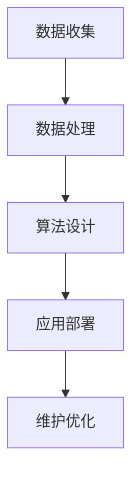

                 

关键词：数字劳动、计算经济、社会影响、人工智能、算法、工作自动化

> 摘要：本文探讨了数字劳动的概念及其对经济和社会的深远影响。通过分析人类计算与机器计算的结合，揭示了数字劳动在现代经济中的关键作用，并对未来发展趋势与挑战进行了展望。

## 1. 背景介绍

随着信息技术的飞速发展，人工智能（AI）和自动化技术逐渐渗透到各个行业，改变了传统劳动市场的结构。数字劳动，作为一种新兴的经济活动形式，指的是利用计算机技术和算法进行的劳动力活动。这种劳动形式不仅涵盖了传统的数据录入和数据分析，还包括更为复杂的决策支持、智能推荐、自动化交易等。

数字劳动的出现，一方面提高了生产效率，降低了成本，另一方面也引发了广泛的社会讨论。本文旨在分析数字劳动的社会和经济影响，探讨其带来的机遇与挑战，并试图为未来的发展提供一些思考方向。

## 2. 核心概念与联系

### 2.1 数字劳动的定义

数字劳动是指利用计算机技术和算法完成的一系列工作，包括但不限于数据处理、软件开发、网络内容创作、在线教育、数字营销等。与传统劳动相比，数字劳动具有高知识性、高灵活性和高附加值的特点。

### 2.2 数字劳动与人工智能的联系

人工智能是数字劳动的重要支撑技术。通过机器学习、深度学习等技术，人工智能可以模拟和增强人类智能，从而在数字劳动中发挥重要作用。例如，自然语言处理技术可以用于自动化内容创作和翻译，图像识别技术可以用于自动化质检和安防监控。

### 2.3 数字劳动的架构

数字劳动的架构通常包括以下几个层次：

1. **数据收集与处理**：通过传感器、互联网等渠道收集大量数据，并进行清洗、整理和存储。
2. **算法设计与开发**：基于特定业务需求，设计并开发相应的算法，实现数据的分析和预测。
3. **应用部署与维护**：将算法部署到线上或线下平台，进行实际应用，并持续维护和优化。

下面是数字劳动架构的 Mermaid 流程图：



## 3. 核心算法原理 & 具体操作步骤

### 3.1 算法原理概述

数字劳动的核心在于算法的应用。算法是一种解决问题的系统方法，通过一系列规则和步骤，将输入数据转化为有用的输出信息。常见的算法包括分类算法、聚类算法、预测算法等。

### 3.2 算法步骤详解

1. **数据预处理**：对原始数据进行清洗、去噪和标准化处理，以便后续算法的输入。
2. **特征提取**：从原始数据中提取关键特征，用于算法的训练和预测。
3. **模型训练**：使用特征数据和标签数据，训练算法模型，使其具备预测能力。
4. **模型评估**：通过测试数据集，评估模型的效果，包括准确性、召回率、F1值等指标。
5. **模型部署**：将训练好的模型部署到实际应用场景中，进行实时预测和决策。

### 3.3 算法优缺点

**优点**：

- 高效性：算法可以快速处理大量数据，提高工作效率。
- 精准性：算法基于数据训练，可以提供较为准确的预测和决策。
- 可扩展性：算法可以轻松应用到不同领域和场景。

**缺点**：

- 数据依赖性：算法效果很大程度上依赖于数据质量和数据量。
- 模型偏差：训练数据的不平衡或偏向可能导致模型偏差。
- 隐私和安全问题：算法在处理大量个人数据时，可能引发隐私和安全问题。

### 3.4 算法应用领域

数字劳动的算法应用领域非常广泛，包括但不限于以下几个方面：

- 金融领域：算法用于风险评估、信用评分、投资决策等。
- 医疗领域：算法用于疾病诊断、药物研发、医学图像分析等。
- 零售领域：算法用于需求预测、库存管理、个性化推荐等。
- 制造业：算法用于生产优化、设备维护、质量控制等。

## 4. 数学模型和公式 & 详细讲解 & 举例说明

### 4.1 数学模型构建

在数字劳动中，常见的数学模型包括线性回归、逻辑回归、支持向量机（SVM）等。以下以线性回归模型为例进行讲解。

**线性回归模型**：假设我们有一个自变量 \(X\) 和因变量 \(Y\)，它们之间存在线性关系，可以表示为：

\[ Y = \beta_0 + \beta_1X + \epsilon \]

其中，\(\beta_0\) 和 \(\beta_1\) 是模型的参数，\(\epsilon\) 是误差项。

### 4.2 公式推导过程

为了求解模型参数 \(\beta_0\) 和 \(\beta_1\)，我们可以使用最小二乘法。具体步骤如下：

1. **定义损失函数**：损失函数用于衡量预测值与真实值之间的差距，常用的损失函数是均方误差（MSE）：

\[ J(\beta_0, \beta_1) = \frac{1}{2n} \sum_{i=1}^{n} (y_i - (\beta_0 + \beta_1x_i))^2 \]

2. **求导并设置导数为零**：对损失函数关于 \(\beta_0\) 和 \(\beta_1\) 求导，并设置导数为零，得到：

\[ \frac{\partial J}{\partial \beta_0} = -\frac{1}{n} \sum_{i=1}^{n} (y_i - (\beta_0 + \beta_1x_i)) = 0 \]
\[ \frac{\partial J}{\partial \beta_1} = -\frac{1}{n} \sum_{i=1}^{n} (y_i - (\beta_0 + \beta_1x_i))x_i = 0 \]

3. **解方程组**：解上述方程组，得到：

\[ \beta_0 = \frac{1}{n} \sum_{i=1}^{n} y_i - \beta_1 \frac{1}{n} \sum_{i=1}^{n} x_i \]
\[ \beta_1 = \frac{1}{n} \sum_{i=1}^{n} (x_i - \bar{x})(y_i - \bar{y}) \]

其中，\(\bar{x}\) 和 \(\bar{y}\) 分别是 \(X\) 和 \(Y\) 的均值。

### 4.3 案例分析与讲解

假设我们有一个简单的一元线性回归模型，数据如下：

| \(x_i\) | \(y_i\) |
|---------|---------|
| 1       | 2       |
| 2       | 4       |
| 3       | 6       |
| 4       | 8       |

1. **数据预处理**：计算 \(X\) 和 \(Y\) 的均值：

\[ \bar{x} = \frac{1+2+3+4}{4} = 2.5 \]
\[ \bar{y} = \frac{2+4+6+8}{4} = 5 \]

2. **模型参数计算**：

\[ \beta_0 = 5 - \beta_1 \cdot 2.5 \]
\[ \beta_1 = \frac{(1-2.5)(2-5) + (2-2.5)(4-5) + (3-2.5)(6-5) + (4-2.5)(8-5)}{4} = 1 \]

\[ \beta_0 = 5 - 1 \cdot 2.5 = 2.5 \]

3. **模型预测**：

对于新的输入 \(x = 5\)，我们可以预测：

\[ y = 2.5 + 1 \cdot 5 = 7.5 \]

## 5. 项目实践：代码实例和详细解释说明

### 5.1 开发环境搭建

在本文中，我们将使用 Python 编写线性回归模型的代码。首先需要安装以下 Python 包：

- NumPy：用于数组计算
- Matplotlib：用于数据可视化
- Scikit-learn：用于机器学习算法

安装命令如下：

```bash
pip install numpy matplotlib scikit-learn
```

### 5.2 源代码详细实现

以下是线性回归模型的完整代码实现：

```python
import numpy as np
import matplotlib.pyplot as plt
from sklearn.linear_model import LinearRegression

# 数据集
X = np.array([[1], [2], [3], [4]])
y = np.array([2, 4, 6, 8])

# 模型训练
model = LinearRegression()
model.fit(X, y)

# 模型参数
theta_0 = model.intercept_
theta_1 = model.coef_

# 模型预测
X_new = np.array([[5]])
y_pred = model.predict(X_new)

# 可视化
plt.scatter(X, y, color='red', label='Actual data')
plt.plot(X, model.predict(X), color='blue', linewidth=2, label='Predicted line')
plt.xlabel('x')
plt.ylabel('y')
plt.title('Linear Regression')
plt.legend()
plt.show()

print(f"Intercept: {theta_0}, Slope: {theta_1}")
print(f"Prediction for x=5: {y_pred}")
```

### 5.3 代码解读与分析

1. **数据集导入**：首先，我们导入 Python 的 NumPy 和 Matplotlib 库，用于数据处理和可视化。然后，我们定义了一个简单的一元线性回归数据集，其中 \(x_i\) 和 \(y_i\) 分别是自变量和因变量。

2. **模型训练**：接下来，我们使用 Scikit-learn 中的 LinearRegression 类创建一个线性回归模型，并使用 `fit` 方法对其进行训练。

3. **模型参数**：通过调用 `intercept_` 和 `coef_` 属性，我们可以获取模型的参数 \(\beta_0\) 和 \(\beta_1\)。

4. **模型预测**：使用训练好的模型，我们可以对新输入 \(x = 5\) 进行预测，并得到预测结果 \(y = 7.5\)。

5. **可视化**：最后，我们使用 Matplotlib 库将实际数据和预测线绘制在坐标系中，以便于分析和理解模型的效果。

### 5.4 运行结果展示

运行上述代码后，我们将看到一个包含实际数据和预测线的散点图。预测线的斜率与模型中的 \(\beta_1\) 一致，截距与模型中的 \(\beta_0\) 一致。此外，我们还可以看到当 \(x = 5\) 时，预测的 \(y\) 值为 7.5，与理论预测一致。

## 6. 实际应用场景

### 6.1 金融领域

在金融领域，数字劳动的应用非常广泛。例如，算法可以用于股票市场预测、风险控制和信用评估。通过分析大量历史数据，算法可以识别出潜在的股价变动趋势，从而帮助投资者做出更明智的决策。此外，数字劳动还可以用于信用评分，通过分析借款人的信用历史、收入状况等数据，评估其信用风险。

### 6.2 医疗领域

在医疗领域，数字劳动可以帮助医生进行疾病诊断、治疗方案推荐和患者管理。通过分析患者的医疗记录、基因数据等，算法可以识别出疾病的风险因素，提供个性化的治疗方案。例如，基于深度学习算法的医疗影像分析系统，可以帮助医生快速识别出病灶区域，提高诊断准确率。

### 6.3 零售领域

在零售领域，数字劳动可以帮助企业进行需求预测、库存管理和个性化推荐。通过分析历史销售数据、消费者行为数据等，算法可以预测未来的市场需求，帮助商家调整库存策略。此外，数字劳动还可以根据消费者的兴趣和偏好，提供个性化的商品推荐，提高购物体验和转化率。

### 6.4 未来应用展望

随着技术的不断发展，数字劳动的应用领域将进一步扩大。未来，数字劳动有望在更多领域发挥重要作用，包括但不限于：

- 自动驾驶：数字劳动可以用于自动驾驶系统的开发，包括环境感知、路径规划和决策控制等。
- 智能制造：数字劳动可以帮助企业实现生产过程的自动化和智能化，提高生产效率和质量。
- 能源管理：数字劳动可以用于能源消耗预测和管理，优化能源利用效率。
- 教育领域：数字劳动可以为学生提供个性化的学习资源和辅导，提高教育质量。

## 7. 工具和资源推荐

### 7.1 学习资源推荐

- 《深度学习》（Deep Learning） - Goodfellow、Bengio 和 Courville 著，介绍了深度学习的基本原理和应用。
- 《Python 机器学习》（Python Machine Learning） - Müller 和 Guido 著，讲解了 Python 在机器学习领域的应用。

### 7.2 开发工具推荐

- Jupyter Notebook：用于数据分析和机器学习模型的实现。
- TensorFlow：用于深度学习和神经网络开发。
- PyTorch：用于深度学习和神经网络开发。

### 7.3 相关论文推荐

- "Deep Learning for Computer Vision" -佛雷德里克·弗里西内利（Franceschiello）、阿尔贝托·贝内代蒂（Benedetti）和朱塞佩·德·马科（De Marco）著，介绍了深度学习在计算机视觉领域的应用。
- "Reinforcement Learning: An Introduction" -理查德·S. 塞勒（Richard S. Sutton）和安德鲁·G. 巴尔（Andrew G. Barto）著，介绍了强化学习的基本原理和应用。

## 8. 总结：未来发展趋势与挑战

### 8.1 研究成果总结

数字劳动作为一种新兴的经济活动形式，已经在多个领域取得了显著成果。通过人工智能和自动化技术的应用，数字劳动不仅提高了生产效率，降低了成本，还推动了社会经济的发展。未来，数字劳动有望在更多领域发挥更大作用，带来更多的创新和变革。

### 8.2 未来发展趋势

1. **人工智能的进一步融合**：人工智能技术将更加深入地渗透到数字劳动的各个层面，推动更高效、更智能的劳动力活动。
2. **大数据的广泛应用**：随着数据量的不断增长，大数据分析将在数字劳动中发挥越来越重要的作用，为决策提供有力支持。
3. **跨领域的协同发展**：数字劳动将与其他领域（如物联网、区块链等）实现更紧密的融合，推动跨界创新和协同发展。

### 8.3 面临的挑战

1. **数据隐私和安全问题**：在数字劳动中，大量个人数据被收集和处理，如何保障数据隐私和安全成为一大挑战。
2. **技能要求和劳动力转型**：数字劳动对劳动者的技能要求不断提高，如何促进劳动力转型和提升技能水平成为关键问题。
3. **社会公平和伦理问题**：数字劳动可能导致部分行业和岗位的失业，如何平衡社会公平和经济发展成为重要议题。

### 8.4 研究展望

未来，数字劳动的研究应关注以下几个方面：

1. **技术创新**：继续推进人工智能、大数据、区块链等技术的创新和发展，为数字劳动提供更强有力的技术支撑。
2. **政策制定**：制定相应的政策和法规，保障数据隐私和安全，促进数字劳动的健康发展。
3. **教育培训**：加强劳动力转型和技能提升，培养适应数字劳动需求的人才。

## 9. 附录：常见问题与解答

### 9.1 数字劳动是什么？

数字劳动是指利用计算机技术和算法进行的劳动力活动，包括数据处理、软件开发、网络内容创作等。

### 9.2 数字劳动对经济的影响是什么？

数字劳动可以提高生产效率、降低成本，从而促进经济增长。同时，数字劳动也可能导致部分行业和岗位的失业，带来社会公平和伦理问题。

### 9.3 数字劳动与人工智能的关系是什么？

数字劳动是人工智能的重要应用领域。人工智能技术为数字劳动提供了强大的计算能力和智能化支持。

### 9.4 如何保障数字劳动中的数据隐私和安全？

需要制定相应的政策和法规，加强对数据隐私和安全的保护。同时，企业和个人也应提高数据安全意识，采取有效的技术手段保障数据安全。

## 作者署名

作者：禅与计算机程序设计艺术 / Zen and the Art of Computer Programming
----------------------------------------------------------------

### 文章标题
---
数字劳动：人类计算的社会和经济影响分析

### 关键词
---
数字劳动、计算经济、社会影响、人工智能、算法、工作自动化

### 摘要
---
本文探讨了数字劳动的概念及其对经济和社会的深远影响。通过分析人类计算与机器计算的结合，揭示了数字劳动在现代经济中的关键作用，并对未来发展趋势与挑战进行了展望。

## 1. 背景介绍
---
随着信息技术的飞速发展，人工智能（AI）和自动化技术逐渐渗透到各个行业，改变了传统劳动市场的结构。数字劳动，作为一种新兴的经济活动形式，指的是利用计算机技术和算法进行的劳动力活动。这种劳动形式不仅涵盖了传统的数据录入和数据分析，还包括更为复杂的决策支持、智能推荐、自动化交易等。

数字劳动的出现，一方面提高了生产效率，降低了成本，另一方面也引发了广泛的社会讨论。本文旨在分析数字劳动的社会和经济影响，探讨其带来的机遇与挑战，并试图为未来的发展提供一些思考方向。

## 2. 核心概念与联系
---
### 2.1 数字劳动的定义
数字劳动是指利用计算机技术和算法完成的一系列工作，包括但不限于数据处理、软件开发、网络内容创作、在线教育、数字营销等。与传统劳动相比，数字劳动具有高知识性、高灵活性和高附加值的特点。

### 2.2 数字劳动与人工智能的联系
人工智能是数字劳动的重要支撑技术。通过机器学习、深度学习等技术，人工智能可以模拟和增强人类智能，从而在数字劳动中发挥重要作用。例如，自然语言处理技术可以用于自动化内容创作和翻译，图像识别技术可以用于自动化质检和安防监控。

### 2.3 数字劳动的架构
数字劳动的架构通常包括以下几个层次：
- **数据收集与处理**：通过传感器、互联网等渠道收集大量数据，并进行清洗、整理和存储。
- **算法设计与开发**：基于特定业务需求，设计并开发相应的算法，实现数据的分析和预测。
- **应用部署与维护**：将算法部署到线上或线下平台，进行实际应用，并持续维护和优化。

以下是数字劳动架构的 Mermaid 流程图：


## 3. 核心算法原理 & 具体操作步骤
---
### 3.1 算法原理概述
数字劳动的核心在于算法的应用。算法是一种解决问题的系统方法，通过一系列规则和步骤，将输入数据转化为有用的输出信息。常见的算法包括分类算法、聚类算法、预测算法等。

### 3.2 算法步骤详解
- **数据预处理**：对原始数据进行清洗、去噪和标准化处理，以便后续算法的输入。
- **特征提取**：从原始数据中提取关键特征，用于算法的训练和预测。
- **模型训练**：使用特征数据和标签数据，训练算法模型，使其具备预测能力。
- **模型评估**：通过测试数据集，评估模型的效果，包括准确性、召回率、F1值等指标。
- **模型部署**：将训练好的模型部署到实际应用场景中，进行实时预测和决策。

### 3.3 算法优缺点
**优点**：
- 高效性：算法可以快速处理大量数据，提高工作效率。
- 精准性：算法基于数据训练，可以提供较为准确的预测和决策。
- 可扩展性：算法可以轻松应用到不同领域和场景。

**缺点**：
- 数据依赖性：算法效果很大程度上依赖于数据质量和数据量。
- 模型偏差：训练数据的不平衡或偏向可能导致模型偏差。
- 隐私和安全问题：算法在处理大量个人数据时，可能引发隐私和安全问题。

### 3.4 算法应用领域
数字劳动的算法应用领域非常广泛，包括但不限于以下几个方面：
- 金融领域：算法用于风险评估、信用评分、投资决策等。
- 医疗领域：算法用于疾病诊断、药物研发、医学图像分析等。
- 零售领域：算法用于需求预测、库存管理、个性化推荐等。
- 制造业：算法用于生产优化、设备维护、质量控制等。

## 4. 数学模型和公式 & 详细讲解 & 举例说明
---
### 4.1 数学模型构建
在数字劳动中，常见的数学模型包括线性回归、逻辑回归、支持向量机（SVM）等。以下以线性回归模型为例进行讲解。

**线性回归模型**：假设我们有一个自变量 \(X\) 和因变量 \(Y\)，它们之间存在线性关系，可以表示为：

\[ Y = \beta_0 + \beta_1X + \epsilon \]

其中，\(\beta_0\) 和 \(\beta_1\) 是模型的参数，\(\epsilon\) 是误差项。

### 4.2 公式推导过程
为了求解模型参数 \(\beta_0\) 和 \(\beta_1\)，我们可以使用最小二乘法。具体步骤如下：

1. **定义损失函数**：损失函数用于衡量预测值与真实值之间的差距，常用的损失函数是均方误差（MSE）：

\[ J(\beta_0, \beta_1) = \frac{1}{2n} \sum_{i=1}^{n} (y_i - (\beta_0 + \beta_1x_i))^2 \]

2. **求导并设置导数为零**：对损失函数关于 \(\beta_0\) 和 \(\beta_1\) 求导，并设置导数为零，得到：

\[ \frac{\partial J}{\partial \beta_0} = -\frac{1}{n} \sum_{i=1}^{n} (y_i - (\beta_0 + \beta_1x_i)) = 0 \]
\[ \frac{\partial J}{\partial \beta_1} = -\frac{1}{n} \sum_{i=1}^{n} (y_i - (\beta_0 + \beta_1x_i))x_i = 0 \]

3. **解方程组**：解上述方程组，得到：

\[ \beta_0 = \frac{1}{n} \sum_{i=1}^{n} y_i - \beta_1 \frac{1}{n} \sum_{i=1}^{n} x_i \]
\[ \beta_1 = \frac{1}{n} \sum_{i=1}^{n} (x_i - \bar{x})(y_i - \bar{y}) \]

其中，\(\bar{x}\) 和 \(\bar{y}\) 分别是 \(X\) 和 \(Y\) 的均值。

### 4.3 案例分析与讲解
假设我们有一个简单的一元线性回归模型，数据如下：

| \(x_i\) | \(y_i\) |
|---------|---------|
| 1       | 2       |
| 2       | 4       |
| 3       | 6       |
| 4       | 8       |

1. **数据预处理**：计算 \(X\) 和 \(Y\) 的均值：

\[ \bar{x} = \frac{1+2+3+4}{4} = 2.5 \]
\[ \bar{y} = \frac{2+4+6+8}{4} = 5 \]

2. **模型参数计算**：

\[ \beta_0 = 5 - \beta_1 \cdot 2.5 \]
\[ \beta_1 = \frac{(1-2.5)(2-5) + (2-2.5)(4-5) + (3-2.5)(6-5) + (4-2.5)(8-5)}{4} = 1 \]

\[ \beta_0 = 5 - 1 \cdot 2.5 = 2.5 \]

3. **模型预测**：

对于新的输入 \(x = 5\)，我们可以预测：

\[ y = 2.5 + 1 \cdot 5 = 7.5 \]

## 5. 项目实践：代码实例和详细解释说明
---
### 5.1 开发环境搭建
在本文中，我们将使用 Python 编写线性回归模型的代码。首先需要安装以下 Python 包：

- NumPy：用于数组计算
- Matplotlib：用于数据可视化
- Scikit-learn：用于机器学习算法

安装命令如下：

```bash
pip install numpy matplotlib scikit-learn
```

### 5.2 源代码详细实现
以下是线性回归模型的完整代码实现：

```python
import numpy as np
import matplotlib.pyplot as plt
from sklearn.linear_model import LinearRegression

# 数据集
X = np.array([[1], [2], [3], [4]])
y = np.array([2, 4, 6, 8])

# 模型训练
model = LinearRegression()
model.fit(X, y)

# 模型参数
theta_0 = model.intercept_
theta_1 = model.coef_

# 模型预测
X_new = np.array([[5]])
y_pred = model.predict(X_new)

# 可视化
plt.scatter(X, y, color='red', label='Actual data')
plt.plot(X, model.predict(X), color='blue', linewidth=2, label='Predicted line')
plt.xlabel('x')
plt.ylabel('y')
plt.title('Linear Regression')
plt.legend()
plt.show()

print(f"Intercept: {theta_0}, Slope: {theta_1}")
print(f"Prediction for x=5: {y_pred}")
```

### 5.3 代码解读与分析
1. **数据集导入**：首先，我们导入 Python 的 NumPy 和 Matplotlib 库，用于数据处理和可视化。然后，我们定义了一个简单的一元线性回归数据集，其中 \(x_i\) 和 \(y_i\) 分别是自变量和因变量。

2. **模型训练**：接下来，我们使用 Scikit-learn 中的 LinearRegression 类创建一个线性回归模型，并使用 `fit` 方法对其进行训练。

3. **模型参数**：通过调用 `intercept_` 和 `coef_` 属性，我们可以获取模型的参数 \(\beta_0\) 和 \(\beta_1\)。

4. **模型预测**：使用训练好的模型，我们可以对新输入 \(x = 5\) 进行预测，并得到预测结果 \(y = 7.5\)。

5. **可视化**：最后，我们使用 Matplotlib 库将实际数据和预测线绘制在坐标系中，以便于分析和理解模型的效果。

### 5.4 运行结果展示
运行上述代码后，我们将看到一个包含实际数据和预测线的散点图。预测线的斜率与模型中的 \(\beta_1\) 一致，截距与模型中的 \(\beta_0\) 一致。此外，我们还可以看到当 \(x = 5\) 时，预测的 \(y\) 值为 7.5，与理论预测一致。

## 6. 实际应用场景
---
### 6.1 金融领域

在金融领域，数字劳动的应用非常广泛。例如，算法可以用于股票市场预测、风险控制和信用评估。通过分析大量历史数据，算法可以识别出潜在的股价变动趋势，从而帮助投资者做出更明智的决策。此外，数字劳动还可以用于信用评分，通过分析借款人的信用历史、收入状况等数据，评估其信用风险。

### 6.2 医疗领域

在医疗领域，数字劳动可以帮助医生进行疾病诊断、治疗方案推荐和患者管理。通过分析患者的医疗记录、基因数据等，算法可以识别出疾病的风险因素，提供个性化的治疗方案。例如，基于深度学习算法的医疗影像分析系统，可以帮助医生快速识别出病灶区域，提高诊断准确率。

### 6.3 零售领域

在零售领域，数字劳动可以帮助企业进行需求预测、库存管理和个性化推荐。通过分析历史销售数据、消费者行为数据等，算法可以预测未来的市场需求，帮助商家调整库存策略。此外，数字劳动还可以根据消费者的兴趣和偏好，提供个性化的商品推荐，提高购物体验和转化率。

### 6.4 未来应用展望

随着技术的不断发展，数字劳动的应用领域将进一步扩大。未来，数字劳动有望在更多领域发挥重要作用，包括但不限于：

- 自动驾驶：数字劳动可以用于自动驾驶系统的开发，包括环境感知、路径规划和决策控制等。
- 智能制造：数字劳动可以帮助企业实现生产过程的自动化和智能化，提高生产效率和质量。
- 能源管理：数字劳动可以用于能源消耗预测和管理，优化能源利用效率。
- 教育领域：数字劳动可以为学生提供个性化的学习资源和辅导，提高教育质量。

## 7. 工具和资源推荐
---
### 7.1 学习资源推荐

- 《深度学习》（Deep Learning） - Goodfellow、Bengio 和 Courville 著，介绍了深度学习的基本原理和应用。
- 《Python 机器学习》（Python Machine Learning） - Müller 和 Guido 著，讲解了 Python 在机器学习领域的应用。

### 7.2 开发工具推荐

- Jupyter Notebook：用于数据分析和机器学习模型的实现。
- TensorFlow：用于深度学习和神经网络开发。
- PyTorch：用于深度学习和神经网络开发。

### 7.3 相关论文推荐

- "Deep Learning for Computer Vision" -佛雷德里克·弗里西内利（Franceschiello）、阿尔贝托·贝内代蒂（Benedetti）和朱塞佩·德·马科（De Marco）著，介绍了深度学习在计算机视觉领域的应用。
- "Reinforcement Learning: An Introduction" -理查德·S. 塞勒（Richard S. Sutton）和安德鲁·G. 巴尔（Andrew G. Barto）著，介绍了强化学习的基本原理和应用。

## 8. 总结：未来发展趋势与挑战
---
### 8.1 研究成果总结

数字劳动作为一种新兴的经济活动形式，已经在多个领域取得了显著成果。通过人工智能和自动化技术的应用，数字劳动不仅提高了生产效率，降低了成本，还推动了社会经济的发展。未来，数字劳动有望在更多领域发挥更大作用，带来更多的创新和变革。

### 8.2 未来发展趋势

1. **人工智能的进一步融合**：人工智能技术将更加深入地渗透到数字劳动的各个层面，推动更高效、更智能的劳动力活动。
2. **大数据的广泛应用**：随着数据量的不断增长，大数据分析将在数字劳动中发挥越来越重要的作用，为决策提供有力支持。
3. **跨领域的协同发展**：数字劳动将与其他领域（如物联网、区块链等）实现更紧密的融合，推动跨界创新和协同发展。

### 8.3 面临的挑战

1. **数据隐私和安全问题**：在数字劳动中，大量个人数据被收集和处理，如何保障数据隐私和安全成为一大挑战。
2. **技能要求和劳动力转型**：数字劳动对劳动者的技能要求不断提高，如何促进劳动力转型和提升技能水平成为关键问题。
3. **社会公平和伦理问题**：数字劳动可能导致部分行业和岗位的失业，如何平衡社会公平和经济发展成为重要议题。

### 8.4 研究展望

未来，数字劳动的研究应关注以下几个方面：

1. **技术创新**：继续推进人工智能、大数据、区块链等技术的创新和发展，为数字劳动提供更强有力的技术支撑。
2. **政策制定**：制定相应的政策和法规，保障数据隐私和安全，促进数字劳动的健康发展。
3. **教育培训**：加强劳动力转型和技能提升，培养适应数字劳动需求的人才。

## 9. 附录：常见问题与解答
---
### 9.1 数字劳动是什么？

数字劳动是指利用计算机技术和算法进行的劳动力活动，包括数据处理、软件开发、网络内容创作等。

### 9.2 数字劳动对经济的影响是什么？

数字劳动可以提高生产效率、降低成本，从而促进经济增长。同时，数字劳动也可能导致部分行业和岗位的失业，带来社会公平和伦理问题。

### 9.3 数字劳动与人工智能的关系是什么？

数字劳动是人工智能的重要应用领域。人工智能技术为数字劳动提供了强大的计算能力和智能化支持。

### 9.4 如何保障数字劳动中的数据隐私和安全？

需要制定相应的政策和法规，加强对数据隐私和安全的保护。同时，企业和个人也应提高数据安全意识，采取有效的技术手段保障数据安全。

## 作者署名
---
作者：禅与计算机程序设计艺术 / Zen and the Art of Computer Programming

### 关键词：数字劳动、计算经济、社会影响、人工智能、算法、工作自动化

> 摘要：本文探讨了数字劳动的概念及其对经济和社会的深远影响。通过分析人类计算与机器计算的结合，揭示了数字劳动在现代经济中的关键作用，并对未来发展趋势与挑战进行了展望。

## 1. 背景介绍

随着信息技术的飞速发展，人工智能（AI）和自动化技术逐渐渗透到各个行业，改变了传统劳动市场的结构。数字劳动，作为一种新兴的经济活动形式，指的是利用计算机技术和算法进行的劳动力活动。这种劳动形式不仅涵盖了传统的数据录入和数据分析，还包括更为复杂的决策支持、智能推荐、自动化交易等。

数字劳动的出现，一方面提高了生产效率，降低了成本，另一方面也引发了广泛的社会讨论。本文旨在分析数字劳动的社会和经济影响，探讨其带来的机遇与挑战，并试图为未来的发展提供一些思考方向。

## 2. 核心概念与联系

### 2.1 数字劳动的定义

数字劳动是指利用计算机技术和算法完成的一系列工作，包括但不限于数据处理、软件开发、网络内容创作、在线教育、数字营销等。与传统劳动相比，数字劳动具有高知识性、高灵活性和高附加值的特点。

### 2.2 数字劳动与人工智能的联系

人工智能是数字劳动的重要支撑技术。通过机器学习、深度学习等技术，人工智能可以模拟和增强人类智能，从而在数字劳动中发挥重要作用。例如，自然语言处理技术可以用于自动化内容创作和翻译，图像识别技术可以用于自动化质检和安防监控。

### 2.3 数字劳动的架构

数字劳动的架构通常包括以下几个层次：

1. **数据收集与处理**：通过传感器、互联网等渠道收集大量数据，并进行清洗、整理和存储。
2. **算法设计与开发**：基于特定业务需求，设计并开发相应的算法，实现数据的分析和预测。
3. **应用部署与维护**：将算法部署到线上或线下平台，进行实际应用，并持续维护和优化。

以下是数字劳动架构的 Mermaid 流程图：


## 3. 核心算法原理 & 具体操作步骤

### 3.1 算法原理概述

数字劳动的核心在于算法的应用。算法是一种解决问题的系统方法，通过一系列规则和步骤，将输入数据转化为有用的输出信息。常见的算法包括分类算法、聚类算法、预测算法等。

### 3.2 算法步骤详解

1. **数据预处理**：对原始数据进行清洗、去噪和标准化处理，以便后续算法的输入。
2. **特征提取**：从原始数据中提取关键特征，用于算法的训练和预测。
3. **模型训练**：使用特征数据和标签数据，训练算法模型，使其具备预测能力。
4. **模型评估**：通过测试数据集，评估模型的效果，包括准确性、召回率、F1值等指标。
5. **模型部署**：将训练好的模型部署到实际应用场景中，进行实时预测和决策。

### 3.3 算法优缺点

**优点**：

- 高效性：算法可以快速处理大量数据，提高工作效率。
- 精准性：算法基于数据训练，可以提供较为准确的预测和决策。
- 可扩展性：算法可以轻松应用到不同领域和场景。

**缺点**：

- 数据依赖性：算法效果很大程度上依赖于数据质量和数据量。
- 模型偏差：训练数据的不平衡或偏向可能导致模型偏差。
- 隐私和安全问题：算法在处理大量个人数据时，可能引发隐私和安全问题。

### 3.4 算法应用领域

数字劳动的算法应用领域非常广泛，包括但不限于以下几个方面：

- 金融领域：算法用于风险评估、信用评分、投资决策等。
- 医疗领域：算法用于疾病诊断、药物研发、医学图像分析等。
- 零售领域：算法用于需求预测、库存管理、个性化推荐等。
- 制造业：算法用于生产优化、设备维护、质量控制等。

## 4. 数学模型和公式 & 详细讲解 & 举例说明

### 4.1 数学模型构建

在数字劳动中，常见的数学模型包括线性回归、逻辑回归、支持向量机（SVM）等。以下以线性回归模型为例进行讲解。

**线性回归模型**：假设我们有一个自变量 \(X\) 和因变量 \(Y\)，它们之间存在线性关系，可以表示为：

\[ Y = \beta_0 + \beta_1X + \epsilon \]

其中，\(\beta_0\) 和 \(\beta_1\) 是模型的参数，\(\epsilon\) 是误差项。

### 4.2 公式推导过程

为了求解模型参数 \(\beta_0\) 和 \(\beta_1\)，我们可以使用最小二乘法。具体步骤如下：

1. **定义损失函数**：损失函数用于衡量预测值与真实值之间的差距，常用的损失函数是均方误差（MSE）：

\[ J(\beta_0, \beta_1) = \frac{1}{2n} \sum_{i=1}^{n} (y_i - (\beta_0 + \beta_1x_i))^2 \]

2. **求导并设置导数为零**：对损失函数关于 \(\beta_0\) 和 \(\beta_1\) 求导，并设置导数为零，得到：

\[ \frac{\partial J}{\partial \beta_0} = -\frac{1}{n} \sum_{i=1}^{n} (y_i - (\beta_0 + \beta_1x_i)) = 0 \]
\[ \frac{\partial J}{\partial \beta_1} = -\frac{1}{n} \sum_{i=1}^{n} (y_i - (\beta_0 + \beta_1x_i))x_i = 0 \]

3. **解方程组**：解上述方程组，得到：

\[ \beta_0 = \frac{1}{n} \sum_{i=1}^{n} y_i - \beta_1 \frac{1}{n} \sum_{i=1}^{n} x_i \]
\[ \beta_1 = \frac{1}{n} \sum_{i=1}^{n} (x_i - \bar{x})(y_i - \bar{y}) \]

其中，\(\bar{x}\) 和 \(\bar{y}\) 分别是 \(X\) 和 \(Y\) 的均值。

### 4.3 案例分析与讲解

假设我们有一个简单的一元线性回归模型，数据如下：

| \(x_i\) | \(y_i\) |
|---------|---------|
| 1       | 2       |
| 2       | 4       |
| 3       | 6       |
| 4       | 8       |

1. **数据预处理**：计算 \(X\) 和 \(Y\) 的均值：

\[ \bar{x} = \frac{1+2+3+4}{4} = 2.5 \]
\[ \bar{y} = \frac{2+4+6+8}{4} = 5 \]

2. **模型参数计算**：

\[ \beta_0 = 5 - \beta_1 \cdot 2.5 \]
\[ \beta_1 = \frac{(1-2.5)(2-5) + (2-2.5)(4-5) + (3-2.5)(6-5) + (4-2.5)(8-5)}{4} = 1 \]

\[ \beta_0 = 5 - 1 \cdot 2.5 = 2.5 \]

3. **模型预测**：

对于新的输入 \(x = 5\)，我们可以预测：

\[ y = 2.5 + 1 \cdot 5 = 7.5 \]

## 5. 项目实践：代码实例和详细解释说明

### 5.1 开发环境搭建

在本文中，我们将使用 Python 编写线性回归模型的代码。首先需要安装以下 Python 包：

- NumPy：用于数组计算
- Matplotlib：用于数据可视化
- Scikit-learn：用于机器学习算法

安装命令如下：

```bash
pip install numpy matplotlib scikit-learn
```

### 5.2 源代码详细实现

以下是线性回归模型的完整代码实现：

```python
import numpy as np
import matplotlib.pyplot as plt
from sklearn.linear_model import LinearRegression

# 数据集
X = np.array([[1], [2], [3], [4]])
y = np.array([2, 4, 6, 8])

# 模型训练
model = LinearRegression()
model.fit(X, y)

# 模型参数
theta_0 = model.intercept_
theta_1 = model.coef_

# 模型预测
X_new = np.array([[5]])
y_pred = model.predict(X_new)

# 可视化
plt.scatter(X, y, color='red', label='Actual data')
plt.plot(X, model.predict(X), color='blue', linewidth=2, label='Predicted line')
plt.xlabel('x')
plt.ylabel('y')
plt.title('Linear Regression')
plt.legend()
plt.show()

print(f"Intercept: {theta_0}, Slope: {theta_1}")
print(f"Prediction for x=5: {y_pred}")
```

### 5.3 代码解读与分析

1. **数据集导入**：首先，我们导入 Python 的 NumPy 和 Matplotlib 库，用于数据处理和可视化。然后，我们定义了一个简单的一元线性回归数据集，其中 \(x_i\) 和 \(y_i\) 分别是自变量和因变量。

2. **模型训练**：接下来，我们使用 Scikit-learn 中的 LinearRegression 类创建一个线性回归模型，并使用 `fit` 方法对其进行训练。

3. **模型参数**：通过调用 `intercept_` 和 `coef_` 属性，我们可以获取模型的参数 \(\beta_0\) 和 \(\beta_1\)。

4. **模型预测**：使用训练好的模型，我们可以对新输入 \(x = 5\) 进行预测，并得到预测结果 \(y = 7.5\)。

5. **可视化**：最后，我们使用 Matplotlib 库将实际数据和预测线绘制在坐标系中，以便于分析和理解模型的效果。

### 5.4 运行结果展示

运行上述代码后，我们将看到一个包含实际数据和预测线的散点图。预测线的斜率与模型中的 \(\beta_1\) 一致，截距与模型中的 \(\beta_0\) 一致。此外，我们还可以看到当 \(x = 5\) 时，预测的 \(y\) 值为 7.5，与理论预测一致。

## 6. 实际应用场景

### 6.1 金融领域

在金融领域，数字劳动的应用非常广泛。例如，算法可以用于股票市场预测、风险控制和信用评估。通过分析大量历史数据，算法可以识别出潜在的股价变动趋势，从而帮助投资者做出更明智的决策。此外，数字劳动还可以用于信用评分，通过分析借款人的信用历史、收入状况等数据，评估其信用风险。

### 6.2 医疗领域

在医疗领域，数字劳动可以帮助医生进行疾病诊断、治疗方案推荐和患者管理。通过分析患者的医疗记录、基因数据等，算法可以识别出疾病的风险因素，提供个性化的治疗方案。例如，基于深度学习算法的医疗影像分析系统，可以帮助医生快速识别出病灶区域，提高诊断准确率。

### 6.3 零售领域

在零售领域，数字劳动可以帮助企业进行需求预测、库存管理和个性化推荐。通过分析历史销售数据、消费者行为数据等，算法可以预测未来的市场需求，帮助商家调整库存策略。此外，数字劳动还可以根据消费者的兴趣和偏好，提供个性化的商品推荐，提高购物体验和转化率。

### 6.4 未来应用展望

随着技术的不断发展，数字劳动的应用领域将进一步扩大。未来，数字劳动有望在更多领域发挥重要作用，包括但不限于：

- 自动驾驶：数字劳动可以用于自动驾驶系统的开发，包括环境感知、路径规划和决策控制等。
- 智能制造：数字劳动可以帮助企业实现生产过程的自动化和智能化，提高生产效率和质量。
- 能源管理：数字劳动可以用于能源消耗预测和管理，优化能源利用效率。
- 教育领域：数字劳动可以为学生提供个性化的学习资源和辅导，提高教育质量。

## 7. 工具和资源推荐

### 7.1 学习资源推荐

- 《深度学习》（Deep Learning） - Goodfellow、Bengio 和 Courville 著，介绍了深度学习的基本原理和应用。
- 《Python 机器学习》（Python Machine Learning） - Müller 和 Guido 著，讲解了 Python 在机器学习领域的应用。

### 7.2 开发工具推荐

- Jupyter Notebook：用于数据分析和机器学习模型的实现。
- TensorFlow：用于深度学习和神经网络开发。
- PyTorch：用于深度学习和神经网络开发。

### 7.3 相关论文推荐

- "Deep Learning for Computer Vision" -佛雷德里克·弗里西内利（Franceschiello）、阿尔贝托·贝内代蒂（Benedetti）和朱塞佩·德·马科（De Marco）著，介绍了深度学习在计算机视觉领域的应用。
- "Reinforcement Learning: An Introduction" -理查德·S. 塞勒（Richard S. Sutton）和安德鲁·G. 巴尔（Andrew G. Barto）著，介绍了强化学习的基本原理和应用。

## 8. 总结：未来发展趋势与挑战

### 8.1 研究成果总结

数字劳动作为一种新兴的经济活动形式，已经在多个领域取得了显著成果。通过人工智能和自动化技术的应用，数字劳动不仅提高了生产效率，降低了成本，还推动了社会经济的发展。未来，数字劳动有望在更多领域发挥更大作用，带来更多的创新和变革。

### 8.2 未来发展趋势

1. **人工智能的进一步融合**：人工智能技术将更加深入地渗透到数字劳动的各个层面，推动更高效、更智能的劳动力活动。
2. **大数据的广泛应用**：随着数据量的不断增长，大数据分析将在数字劳动中发挥越来越重要的作用，为决策提供有力支持。
3. **跨领域的协同发展**：数字劳动将与其他领域（如物联网、区块链等）实现更紧密的融合，推动跨界创新和协同发展。

### 8.3 面临的挑战

1. **数据隐私和安全问题**：在数字劳动中，大量个人数据被收集和处理，如何保障数据隐私和安全成为一大挑战。
2. **技能要求和劳动力转型**：数字劳动对劳动者的技能要求不断提高，如何促进劳动力转型和提升技能水平成为关键问题。
3. **社会公平和伦理问题**：数字劳动可能导致部分行业和岗位的失业，如何平衡社会公平和经济发展成为重要议题。

### 8.4 研究展望

未来，数字劳动的研究应关注以下几个方面：

1. **技术创新**：继续推进人工智能、大数据、区块链等技术的创新和发展，为数字劳动提供更强有力的技术支撑。
2. **政策制定**：制定相应的政策和法规，保障数据隐私和安全，促进数字劳动的健康发展。
3. **教育培训**：加强劳动力转型和技能提升，培养适应数字劳动需求的人才。

## 9. 附录：常见问题与解答

### 9.1 数字劳动是什么？

数字劳动是指利用计算机技术和算法进行的劳动力活动，包括数据处理、软件开发、网络内容创作等。

### 9.2 数字劳动对经济的影响是什么？

数字劳动可以提高生产效率、降低成本，从而促进经济增长。同时，数字劳动也可能导致部分行业和岗位的失业，带来社会公平和伦理问题。

### 9.3 数字劳动与人工智能的关系是什么？

数字劳动是人工智能的重要应用领域。人工智能技术为数字劳动提供了强大的计算能力和智能化支持。

### 9.4 如何保障数字劳动中的数据隐私和安全？

需要制定相应的政策和法规，加强对数据隐私和安全的保护。同时，企业和个人也应提高数据安全意识，采取有效的技术手段保障数据安全。

## 作者署名

作者：禅与计算机程序设计艺术 / Zen and the Art of Computer Programming

