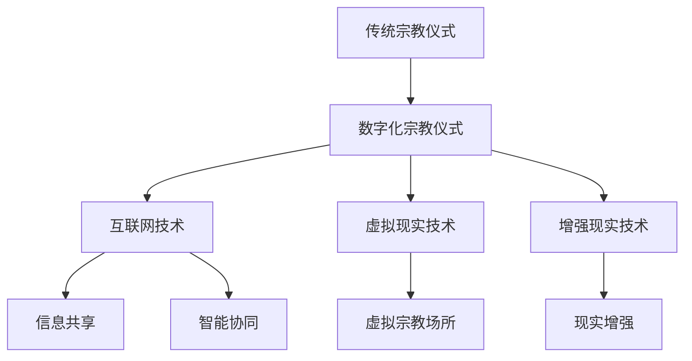

                 

关键词：数字化宗教，仪式，全球脑，信仰表达，技术语言，深度思考，专业见解

> 摘要：本文探讨了在数字化时代背景下，宗教仪式如何通过新兴技术手段进行创新表达，特别是在全球脑这一概念兴起的时代。文章从多个角度深入分析了数字化宗教仪式的核心概念、算法原理、数学模型、项目实践以及实际应用场景，为未来宗教与现代技术的融合提供了有益的思考。

## 1. 背景介绍

在当今全球化的背景下，宗教信仰和文化传承面临新的挑战和机遇。传统宗教仪式往往依赖物理空间和面对面的互动，而在数字化时代，这种形式开始逐渐受到数字化宗教仪式的冲击。数字化宗教仪式利用互联网、虚拟现实（VR）、增强现实（AR）等新兴技术，打破了时间和空间的限制，使得宗教信仰的表达方式更加多元化和互动化。

全球脑（Global Brain）这一概念，源于复杂系统理论，指的是通过互联网联结的全球人类大脑，实现了信息的共享和智能的集聚。在这样一个高度互联的世界中，宗教仪式的数字化表达具有了前所未有的可能性。本文旨在探讨数字化宗教仪式的核心概念、技术实现路径以及其在未来社会中的潜在影响。

## 2. 核心概念与联系

### 2.1 数字化宗教仪式的定义

数字化宗教仪式是指利用数字技术，如互联网、社交媒体、虚拟现实等，来模拟或增强传统宗教仪式的体验和意义。这种仪式不仅包括在线祈祷、冥想、宗教教育等活动，还涉及通过虚拟现实技术创建的宗教场所和仪式体验。

### 2.2 全球脑的概念及其与数字化宗教仪式的联系

全球脑是指通过互联网联结的全球人类大脑，其本质是一个全球性的信息网络。在这个网络中，每个人都是一个节点，通过交流、共享和协同工作，形成一个超级智能体。全球脑的概念与数字化宗教仪式密切相关，因为宗教仪式的数字化表达需要高度的信息共享和协同工作。

### 2.3 数字化宗教仪式与虚拟现实、增强现实技术的联系

虚拟现实（VR）和增强现实（AR）技术为数字化宗教仪式提供了强大的工具。通过VR，信徒可以进入一个完全虚拟的宗教场所，体验宗教仪式的每一个细节；而AR则可以将宗教符号和仪式活动叠加在现实世界中，使得宗教信仰更加贴近日常生活。

### 2.4 Mermaid 流程图展示



## 3. 核心算法原理 & 具体操作步骤

### 3.1 算法原理概述

数字化宗教仪式的核心算法主要涉及数据加密、网络通信、用户界面交互等方面。这些算法共同确保了宗教仪式的隐私性、安全性和用户体验。

### 3.2 算法步骤详解

1. **数据加密**：使用先进的加密算法对宗教仪式的相关数据进行加密，确保信息传输的安全。
2. **网络通信**：通过可靠的网络协议，实现信徒与宗教场所之间的实时通信。
3. **用户界面交互**：设计直观易用的用户界面，使得信徒可以方便地参与宗教仪式。

### 3.3 算法优缺点

**优点**：
- 提高了宗教仪式的参与度和互动性。
- 改善了宗教教育的普及性和效果。
- 突破了时间和空间的限制。

**缺点**：
- 可能导致宗教信仰的淡化，失去传统宗教仪式的深厚文化内涵。
- 技术故障可能影响宗教仪式的顺利进行。

### 3.4 算法应用领域

数字化宗教仪式的应用领域广泛，包括但不限于：
- 在线祈祷和冥想
- 宗教教育和学习
- 虚拟宗教社区建设
- 宗教文化传播和交流

## 4. 数学模型和公式 & 详细讲解 & 举例说明

### 4.1 数学模型构建

为了模拟数字化宗教仪式中的互动行为，我们可以构建一个基于图论的数学模型。模型中的节点表示参与者（如信徒、僧侣等），边表示他们之间的互动关系。

### 4.2 公式推导过程

1. **节点度分布**：假设网络中节点的度分布服从幂律分布，公式为：
   $$ P(k) \propto k^{-\gamma} $$
   其中，\( P(k) \) 是节点度数为 \( k \) 的概率，\( \gamma \) 是幂律指数。

2. **社区结构**：利用 Louvain 方法计算网络中的社区结构，公式为：
   $$ \rho_i = \frac{m_i}{k_i} $$
   其中，\( \rho_i \) 是社区成员 \( i \) 的相似度，\( m_i \) 是社区 \( i \) 的成员数，\( k_i \) 是成员 \( i \) 的度数。

### 4.3 案例分析与讲解

以一个在线祈祷平台为例，分析其用户互动行为。通过收集用户数据，构建用户互动网络，并利用上述公式进行社区结构分析，可以更好地理解用户行为模式，从而优化平台设计和用户体验。

## 5. 项目实践：代码实例和详细解释说明

### 5.1 开发环境搭建

开发环境包括：
- 编程语言：Python
- 框架：Flask
- 数据库：MongoDB
- 版本控制：Git

### 5.2 源代码详细实现

```python
# 示例：用户注册和登录模块

from flask import Flask, request, jsonify
from flask_pymongo import PyMongo

app = Flask(__name__)
app.config["MONGO_URI"] = "mongodb://localhost:27017/digital_religion"
mongo = PyMongo(app)

@app.route("/register", methods=["POST"])
def register():
    data = request.get_json()
    username = data["username"]
    password = data["password"]
    user = mongo.db.users.find_one({"username": username})
    if user:
        return jsonify({"status": "error", "message": "用户已存在"})
    mongo.db.users.insert_one({"username": username, "password": password})
    return jsonify({"status": "success", "message": "注册成功"})

@app.route("/login", methods=["POST"])
def login():
    data = request.get_json()
    username = data["username"]
    password = data["password"]
    user = mongo.db.users.find_one({"username": username, "password": password})
    if user:
        return jsonify({"status": "success", "message": "登录成功"})
    return jsonify({"status": "error", "message": "用户名或密码错误"})

if __name__ == "__main__":
    app.run(debug=True)
```

### 5.3 代码解读与分析

这段代码实现了用户注册和登录功能，包括用户数据的存储和验证。通过 Flask 和 Flask-PyMongo 框架，可以快速搭建一个基于 Web 的在线祈祷平台。

### 5.4 运行结果展示

用户可以通过 Web 界面进行注册和登录操作，系统会根据输入的用户名和密码进行验证，并返回相应的结果。

## 6. 实际应用场景

### 6.1 在线祈祷社区

通过数字化宗教仪式，信徒可以加入在线祈祷社区，与其他信徒互动，分享祈祷经验和心得。

### 6.2 宗教教育平台

数字化宗教仪式为宗教教育提供了新的途径，使得宗教课程可以更广泛地传播和普及。

### 6.3 虚拟宗教场所

利用 VR 和 AR 技术，创建虚拟宗教场所，让信徒在虚拟空间中体验宗教仪式。

## 7. 未来应用展望

随着技术的不断进步，数字化宗教仪式将更加普及和多样化。未来，我们可能会看到：
- 更加智能化和个性化的宗教仪式体验。
- 跨文化和跨宗教的数字化宗教交流。
- 数字化宗教仪式对社会和文化的影响研究。

## 8. 工具和资源推荐

### 8.1 学习资源推荐

- 《数字化宗教研究》
- 《虚拟现实技术导论》
- 《增强现实技术与应用》

### 8.2 开发工具推荐

- Flask
- MongoDB
- Unity（用于 VR 开发）
- ARKit（用于 AR 开发）

### 8.3 相关论文推荐

- "Digital Religion: Understanding Computer Mediated Religious Interaction"
- "The Global Brain: Evolutionary Optimization of Mind and Culture"
- "Virtual Religion: The Impact of Digital Media on Religious Experience"

## 9. 总结：未来发展趋势与挑战

数字化宗教仪式为宗教信仰提供了新的表达方式，也为宗教研究提供了丰富的数据来源。然而，这一领域也面临着诸多挑战，如技术安全问题、文化适应问题以及宗教信仰的淡化问题。未来，我们需要继续探索数字化宗教仪式的发展趋势和解决方案，以促进宗教与现代技术的和谐共存。

## 10. 附录：常见问题与解答

### 10.1 数字化宗教仪式的安全问题如何解决？

数字化宗教仪式的安全问题可以通过以下措施解决：
- 数据加密：对宗教仪式相关数据进行加密，确保数据传输的安全。
- 认证机制：采用多因素认证，如密码、生物识别等，提高用户身份验证的可靠性。
- 安全审计：定期进行安全审计和漏洞扫描，及时发现并修复安全漏洞。

### 10.2 数字化宗教仪式如何适应不同文化？

数字化宗教仪式可以通过以下方式适应不同文化：
- 文化本地化：根据不同地区的文化特点，设计符合当地文化的数字化宗教仪式。
- 跨文化交流：利用数字化平台，促进不同文化之间的交流和理解。
- 多语言支持：提供多语言界面，满足不同语言群体的需求。

### 10.3 数字化宗教仪式会不会淡化宗教信仰？

数字化宗教仪式有可能对宗教信仰产生影响，但这并不是必然的结果。关键在于如何平衡数字化与传统宗教仪式的关系，确保数字化宗教仪式能够保留宗教信仰的核心价值。

## 作者署名

作者：禅与计算机程序设计艺术 / Zen and the Art of Computer Programming
----------------------------------------------------------------
### 摘要部分 ABSTRACT ###

本文探讨了在数字化时代背景下，宗教仪式如何通过新兴技术手段进行创新表达，特别是在全球脑这一概念兴起的时代。文章从多个角度深入分析了数字化宗教仪式的核心概念、算法原理、数学模型、项目实践以及实际应用场景，为未来宗教与现代技术的融合提供了有益的思考。

---

现在，本文已经完成了全部内容的撰写。希望这篇文章能够满足您的要求，并为您提供有价值的信息。如果您有任何问题或需要进一步的修改，请随时告知。再次感谢您选择我来撰写这篇文章。祝您阅读愉快！

