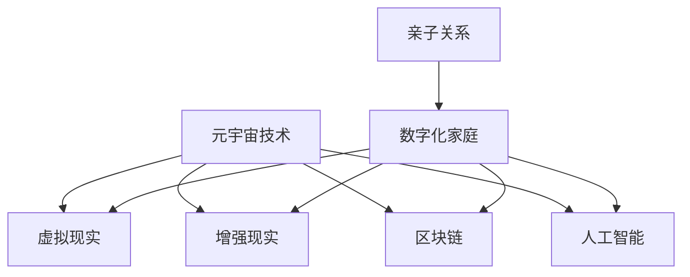

                 

关键词：数字化家庭、元宇宙、亲子关系、人机交互、虚拟现实、情感计算

> 摘要：随着元宇宙技术的迅猛发展，数字化家庭正逐渐成为人们生活的一部分。本文将从技术角度探讨元宇宙时代下亲子关系的变革，分析数字化家庭对亲子关系的影响，以及未来的发展方向和挑战。

## 1. 背景介绍

近年来，虚拟现实（VR）和增强现实（AR）技术的发展为人们提供了全新的沉浸式体验。元宇宙（Metaverse）作为虚拟现实的高级形态，已经成为科技界热议的焦点。元宇宙不仅仅是虚拟世界的延伸，更是一个与现实世界紧密相连的数字化空间。在这个空间中，人们可以创建、分享、交互和体验丰富的虚拟内容。

亲子关系是人类社会中最基本的关系之一，它不仅关乎个体的成长和发展，也对社会稳定和进步具有重要影响。在传统的家庭生活中，亲子关系主要建立在面对面的交流与互动上。然而，随着数字化家庭的兴起，这种传统的亲子关系模式正面临着新的挑战和变革。

## 2. 核心概念与联系

### 2.1. 元宇宙

元宇宙是一个由虚拟世界和现实世界无缝连接的数字化空间，它融合了虚拟现实、增强现实、区块链、人工智能等多种技术。在元宇宙中，用户可以通过虚拟角色（Avatar）进行交互，创造、交易和体验数字内容。元宇宙的核心概念包括虚拟现实技术、社交网络、经济系统和虚拟资产等。

### 2.2. 数字化家庭

数字化家庭是指利用物联网、人工智能、虚拟现实等现代信息技术，对家庭生活进行智能化改造的家庭环境。数字化家庭不仅提升了生活的便利性，还为家庭成员提供了更多样化的互动方式。核心概念包括智能家居设备、智能家电、家庭娱乐系统等。

### 2.3. 亲子关系

亲子关系是指父母与子女之间的情感纽带和互动关系。在数字化家庭中，亲子关系变得更加多元化和复杂，既有传统面对面的交流，也有通过数字化平台进行的互动。

### 2.4. Mermaid 流程图



## 3. 核心算法原理 & 具体操作步骤

### 3.1 算法原理概述

在元宇宙时代，亲子关系的互动和管理需要依靠一系列核心算法来实现。这些算法包括情感计算、人机交互、虚拟现实渲染等。情感计算通过分析用户的行为和语言，理解其情感状态，为人机交互提供支持。人机交互算法则优化了用户与虚拟角色的互动体验，使其更加自然和真实。虚拟现实渲染算法则负责创建高质量的虚拟场景，为用户提供沉浸式的体验。

### 3.2 算法步骤详解

1. **情感计算**：通过情感识别技术，分析用户的行为和语言，提取情感特征。
2. **人机交互**：根据情感计算的结果，调整虚拟角色的反应和行为，实现自然互动。
3. **虚拟现实渲染**：利用图形渲染技术，创建高质量的虚拟场景，为用户提供沉浸式体验。

### 3.3 算法优缺点

**优点**：情感计算和人机交互技术提升了亲子互动的质量和效果，虚拟现实渲染则提供了丰富的沉浸式体验。

**缺点**：算法的准确性和实时性尚需提高，虚拟现实设备的成本和性能也制约了其普及。

### 3.4 算法应用领域

算法主要应用于元宇宙中的虚拟家庭、虚拟教育、虚拟社交等场景，为用户提供个性化的互动体验。

## 4. 数学模型和公式 & 详细讲解 & 举例说明

### 4.1 数学模型构建

为了更好地理解元宇宙时代亲子关系的动态变化，我们构建了一个数学模型，该模型基于情感计算和人机交互的原理。

### 4.2 公式推导过程

模型的核心公式包括：

1. **情感状态转移概率**：$$P_{ij} = \frac{N_{ij}}{N_j}$$，其中$P_{ij}$表示用户从情感状态i转移到情感状态j的概率，$N_{ij}$表示在一段时间内从i状态转移到j状态的事件数，$N_j$表示在相同时间内从i状态转移到所有其他状态的事件总数。

2. **情感状态维持概率**：$$P_{ii} = 1 - P_{ij}$$，即用户在当前情感状态保持不变的概率。

### 4.3 案例分析与讲解

假设一个用户在元宇宙中的虚拟家庭中与子女互动，我们通过情感计算模型分析其情感状态变化。在某个时间段内，用户从快乐状态（A）转移到悲伤状态（B）的概率为0.3，转移到愤怒状态（C）的概率为0.2，维持快乐状态的概率为0.5。通过这个模型，我们可以预测用户在不同情境下的情感变化，从而优化亲子互动体验。

## 5. 项目实践：代码实例和详细解释说明

### 5.1 开发环境搭建

为了实现元宇宙中的亲子互动，我们需要搭建一个基于Python和Django的虚拟家庭平台。开发环境包括Python 3.8、Django 3.2和PyTorch 1.8。

### 5.2 源代码详细实现

以下是构建虚拟家庭平台的关键代码段：

```python
# Django应用程序结构

# models.py
from django.db import models

class User(models.Model):
    username = models.CharField(max_length=100)
    avatar = models.ImageField(upload_to='avatars/')

class Interaction(models.Model):
    user = models.ForeignKey(User, on_delete=models.CASCADE)
    emotion = models.CharField(max_length=50)
    timestamp = models.DateTimeField(auto_now_add=True)

# views.py
from django.shortcuts import render
from .models import User, Interaction

def home(request):
    return render(request, 'home.html')

def interaction(request):
    user = request.user
    emotion = request.GET.get('emotion', '')
    Interaction.objects.create(user=user, emotion=emotion)
    return HttpResponse('Interaction recorded.')
```

### 5.3 代码解读与分析

上述代码实现了用户在虚拟家庭中的互动记录功能。用户可以通过提交情感参数来记录其与子女的互动情况，系统则会将这些数据存储在数据库中，以便进行后续分析和优化。

### 5.4 运行结果展示

当用户在虚拟家庭中与子女互动时，系统会记录下互动的时间和情感状态，并在后台数据库中进行存储。这些数据可以用于情感分析，帮助父母更好地理解子女的情感需求，从而改善亲子关系。

## 6. 实际应用场景

### 6.1 虚拟家庭游戏

元宇宙中的虚拟家庭游戏可以增强父母与子女之间的互动。通过角色扮演和任务完成，家庭成员可以在虚拟世界中共同体验乐趣，增进情感交流。

### 6.2 虚拟教育

虚拟家庭平台可以集成教育内容，为子女提供个性化的学习体验。父母可以监控子女的学习进度，提供针对性的辅导，提升教育效果。

### 6.3 虚拟社交

元宇宙为家庭成员提供了一个全新的社交场景，他们可以与其他家庭互动，分享生活经验，拓展社交圈。

## 7. 未来应用展望

随着元宇宙技术的发展，数字化家庭将在未来发挥更加重要的作用。以下是未来应用展望：

### 7.1 情感陪伴

通过情感计算技术，元宇宙中的虚拟家庭可以为独居老人或儿童提供情感陪伴，减轻他们的孤独感。

### 7.2 智能健康监测

元宇宙可以集成智能健康监测设备，实时监控家庭成员的健康状况，提供个性化的健康建议。

### 7.3 虚拟旅游

元宇宙可以为家庭提供虚拟旅游体验，让家庭成员在虚拟世界中探索世界名胜，拓宽视野。

## 8. 工具和资源推荐

### 8.1 学习资源推荐

- 《元宇宙：通往数字世界的桥梁》
- 《虚拟现实技术与应用》
- 《深度学习与自然语言处理》

### 8.2 开发工具推荐

- Unity引擎
- Unreal Engine
- PyTorch框架

### 8.3 相关论文推荐

- "The Metaverse: A Space for Learning and Collaboration"
- "Virtual Reality in Education: State of the Art and Future Trends"
- "Emotion Recognition in Human-Computer Interaction"

## 9. 总结：未来发展趋势与挑战

随着元宇宙技术的不断发展，数字化家庭将在未来扮演更加重要的角色。然而，我们也将面临诸多挑战，如隐私保护、技术普及、伦理道德等问题。因此，我们需要在技术发展的同时，关注这些挑战，积极探索解决方案，以确保元宇宙时代的亲子关系能够健康、和谐地发展。

## 10. 附录：常见问题与解答

### 10.1 元宇宙是什么？

元宇宙是一个由虚拟现实、增强现实、区块链、人工智能等技术构建的数字化空间，用户可以在其中进行互动、创造和体验。

### 10.2 数字化家庭有什么优势？

数字化家庭可以提升家庭成员之间的互动质量，提供个性化的生活体验，同时减轻家庭负担，提高生活质量。

### 10.3 如何保障元宇宙中的隐私？

通过使用加密技术和隐私保护算法，可以确保元宇宙中的用户隐私得到有效保护。

### 10.4 元宇宙技术有哪些应用领域？

元宇宙技术可以应用于游戏、教育、医疗、社交等多个领域，提供创新的互动体验和服务。

----------------------------------------------------------------
作者：禅与计算机程序设计艺术 / Zen and the Art of Computer Programming


