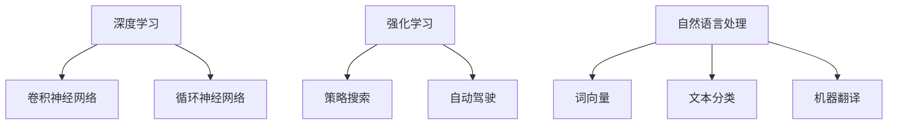

                 

关键词：人工智能、创意思维、数字创新、算法原理、数学模型、代码实例、应用场景、未来展望

> 摘要：本文旨在探讨人工智能如何激发我们的创意思维，推动数字化时代的创新与发展。通过深入分析人工智能的核心算法原理、数学模型及其在项目实践中的应用，本文揭示了AI技术在激发人类创造力方面的重要作用。同时，我们还展望了人工智能未来在各个领域的应用前景，以及面临的挑战和机遇。

## 1. 背景介绍

### 数字化时代的崛起

随着互联网、云计算、大数据等技术的飞速发展，数字化时代已经悄然来临。我们的生活、工作、娱乐等多个方面都受到了数字技术的深刻影响。数字化不仅改变了我们的生活方式，还激发了无限的创意潜能。在这个时代，人工智能成为推动创新的核心力量。

### 人工智能的崛起

人工智能（AI）作为计算机科学的一个重要分支，近年来取得了令人瞩目的进展。从最初的规则推理、模式识别，到深度学习、强化学习等高级算法，人工智能逐渐具备了自主学习和决策能力。这不仅为各行各业带来了巨大的变革，也为我们的创意思维提供了新的工具和平台。

## 2. 核心概念与联系

### 人工智能的核心算法原理

人工智能的核心在于算法。以下是几种常见的人工智能算法及其工作原理：

#### 2.1 深度学习

深度学习是人工智能的核心技术之一。它通过多层神经网络模拟人脑神经元之间的连接，对大量数据进行自动学习和特征提取。深度学习算法包括卷积神经网络（CNN）、循环神经网络（RNN）等。

#### 2.2 强化学习

强化学习是一种通过试错和反馈机制进行学习的方法。它模拟了人类学习和决策的过程，通过不断试错来寻找最优策略。强化学习算法广泛应用于游戏、自动驾驶等领域。

#### 2.3 自然语言处理

自然语言处理（NLP）是人工智能的重要分支，它旨在让计算机理解和处理人类语言。NLP算法包括词向量、文本分类、机器翻译等。

### 核心算法原理的 Mermaid 流程图



## 3. 核心算法原理 & 具体操作步骤

### 3.1 算法原理概述

#### 3.1.1 深度学习

深度学习是通过多层神经网络对数据进行自动学习和特征提取的一种方法。其基本原理是模拟人脑神经元之间的连接，通过反向传播算法不断调整网络权重，使得网络能够在不同任务上取得良好的性能。

#### 3.1.2 强化学习

强化学习是一种通过试错和反馈机制进行学习的方法。它模拟了人类学习和决策的过程，通过不断试错来寻找最优策略。强化学习算法包括Q学习、SARSA等。

#### 3.1.3 自然语言处理

自然语言处理（NLP）是人工智能的重要分支，它旨在让计算机理解和处理人类语言。NLP算法包括词向量、文本分类、机器翻译等。

### 3.2 算法步骤详解

#### 3.2.1 深度学习算法步骤

1. 数据预处理：对数据进行归一化、去噪等处理，使其符合神经网络输入的要求。
2. 网络结构设计：设计合适的神经网络结构，包括层数、节点数、激活函数等。
3. 模型训练：使用训练数据对神经网络进行训练，通过反向传播算法不断调整网络权重。
4. 模型评估：使用验证数据对训练好的模型进行评估，调整模型参数以优化性能。
5. 模型应用：将训练好的模型应用于实际问题，如图像识别、语音合成等。

#### 3.2.2 强化学习算法步骤

1. 初始化状态：根据初始条件初始化环境状态。
2. 选择动作：根据当前状态选择一个动作。
3. 执行动作：在环境中执行所选动作。
4. 获取奖励：根据执行结果获得奖励。
5. 更新状态：根据执行结果更新环境状态。
6. 重复步骤2-5，直到达到终止条件。

#### 3.2.3 自然语言处理算法步骤

1. 数据预处理：对文本数据进行分词、去停用词等处理。
2. 构建词向量：将文本数据转换为词向量表示。
3. 模型训练：使用训练数据对NLP模型进行训练。
4. 模型评估：使用验证数据对训练好的模型进行评估。
5. 模型应用：将训练好的模型应用于实际问题，如文本分类、机器翻译等。

### 3.3 算法优缺点

#### 深度学习

**优点**：能够自动提取数据中的复杂特征，适用于处理大规模数据。

**缺点**：对数据量要求较高，模型训练过程复杂，计算资源消耗大。

#### 强化学习

**优点**：能够模拟人类学习和决策的过程，适用于复杂环境。

**缺点**：训练过程需要大量时间，容易出现过度拟合。

#### 自然语言处理

**优点**：能够对文本数据进行分析和理解，适用于文本处理任务。

**缺点**：对语言的理解能力有限，存在语义歧义等问题。

### 3.4 算法应用领域

#### 深度学习

深度学习算法广泛应用于图像识别、语音合成、自然语言处理等领域，如人脸识别、自动驾驶、机器翻译等。

#### 强化学习

强化学习算法广泛应用于游戏、机器人、自动驾驶等领域，如围棋、无人驾驶、智能推荐等。

#### 自然语言处理

自然语言处理算法广泛应用于文本分类、机器翻译、情感分析等领域，如搜索引擎、智能客服、社交媒体分析等。

## 4. 数学模型和公式 & 详细讲解 & 举例说明

### 4.1 数学模型构建

#### 4.1.1 深度学习

深度学习中的数学模型主要包括损失函数、优化算法等。

**损失函数**：用于衡量模型预测值与真实值之间的差距，常用的损失函数有均方误差（MSE）、交叉熵损失等。

**优化算法**：用于调整模型参数，以降低损失函数的值。常用的优化算法有梯度下降、Adam等。

#### 4.1.2 强化学习

强化学习中的数学模型主要包括状态-动作价值函数、策略等。

**状态-动作价值函数**：用于评估在某个状态下执行某个动作的价值，常用的价值函数有Q值、SARSA值等。

**策略**：用于指导智能体在特定状态下选择动作，常用的策略有ε-贪心策略、Q学习策略等。

#### 4.1.3 自然语言处理

自然语言处理中的数学模型主要包括词向量、语言模型等。

**词向量**：用于表示文本中的词语，常用的词向量模型有Word2Vec、GloVe等。

**语言模型**：用于预测下一个词语的概率，常用的语言模型有N-gram模型、神经网络语言模型等。

### 4.2 公式推导过程

#### 4.2.1 深度学习

**损失函数的推导**：

假设模型输出为\( \hat{y} \)，真实值为\( y \)，则损失函数可以表示为：

$$
L = \frac{1}{2} \sum_{i=1}^{n} (\hat{y}_i - y_i)^2
$$

**优化算法的推导**：

假设损失函数关于模型参数\( \theta \)的可导，则梯度下降算法可以表示为：

$$
\theta_{\text{new}} = \theta_{\text{old}} - \alpha \cdot \nabla_\theta L
$$

其中，\( \alpha \)为学习率。

#### 4.2.2 强化学习

**状态-动作价值函数的推导**：

假设在状态\( s \)下执行动作\( a \)的价值为\( Q(s, a) \)，则Q学习的更新公式为：

$$
Q(s, a) \leftarrow Q(s, a) + \alpha [r + \gamma \max_{a'} Q(s', a') - Q(s, a)]
$$

其中，\( r \)为即时奖励，\( \gamma \)为折扣因子。

**策略的推导**：

假设策略\( \pi \)为ε-贪心策略，则在状态\( s \)下选择动作\( a \)的概率为：

$$
\pi(a|s) = 
\begin{cases}
1 - \varepsilon & \text{if } a = \arg\max_a Q(s, a) \\
\varepsilon / |A| & \text{otherwise}
\end{cases}
$$

其中，\( \varepsilon \)为探索概率，\( |A| \)为动作空间的大小。

#### 4.2.3 自然语言处理

**词向量的推导**：

假设词向量模型为Word2Vec，则词向量\( \mathbf{v}_w \)可以通过以下公式计算：

$$
\mathbf{v}_w = \sum_{w' \in \mathcal{V}} f(w') \cdot \mathbf{v}_{w'}
$$

其中，\( f(w') \)为词频，\( \mathcal{V} \)为词汇表。

**语言模型的推导**：

假设语言模型为神经网络模型，则语言模型概率\( P(w_i|w_1, w_2, ..., w_{i-1}) \)可以通过以下公式计算：

$$
P(w_i|w_1, w_2, ..., w_{i-1}) = \frac{\exp(\mathbf{v}_{w_i} \cdot \mathbf{h}_{i-1})}{\sum_{w' \in \mathcal{V}} \exp(\mathbf{v}_{w'} \cdot \mathbf{h}_{i-1})}
$$

其中，\( \mathbf{h}_{i-1} \)为隐藏层输出。

### 4.3 案例分析与讲解

#### 4.3.1 深度学习案例

假设我们使用深度学习算法进行图像分类任务，输入为一张128x128像素的图像，输出为10个类别。以下是深度学习模型的构建和训练过程：

1. 数据预处理：对图像进行归一化处理，使其像素值在0到1之间。
2. 网络结构设计：设计一个包含两个卷积层、两个全连接层的卷积神经网络。
3. 模型训练：使用训练数据对模型进行训练，优化损失函数和模型参数。
4. 模型评估：使用验证数据对训练好的模型进行评估，调整模型参数以优化性能。
5. 模型应用：将训练好的模型应用于实际图像分类任务。

#### 4.3.2 强化学习案例

假设我们使用强化学习算法进行机器人路径规划任务，输入为当前环境和目标位置，输出为最佳移动方向。以下是强化学习算法的构建和训练过程：

1. 初始化环境：设置初始状态，包括机器人的位置和方向。
2. 选择动作：根据当前状态和策略选择一个动作。
3. 执行动作：在环境中执行所选动作，更新状态和奖励。
4. 更新策略：根据即时奖励和状态-动作价值函数更新策略。
5. 重复步骤2-4，直到达到终止条件。

#### 4.3.3 自然语言处理案例

假设我们使用自然语言处理算法进行文本分类任务，输入为一段文本，输出为文本的类别。以下是自然语言处理算法的构建和训练过程：

1. 数据预处理：对文本进行分词、去停用词等处理。
2. 词向量构建：使用Word2Vec算法将文本转换为词向量表示。
3. 模型训练：使用训练数据对神经网络模型进行训练。
4. 模型评估：使用验证数据对训练好的模型进行评估。
5. 模型应用：将训练好的模型应用于实际文本分类任务。

## 5. 项目实践：代码实例和详细解释说明

### 5.1 开发环境搭建

为了演示AI在图像分类任务中的应用，我们选择Python作为编程语言，并使用TensorFlow作为深度学习框架。以下是开发环境的搭建步骤：

1. 安装Python：在官方网站下载并安装Python，版本建议为3.7及以上。
2. 安装TensorFlow：在命令行中运行以下命令安装TensorFlow：

   ```
   pip install tensorflow
   ```

3. 数据预处理：从官方网站下载ImageNet数据集，并进行预处理，包括归一化、裁剪等操作。

### 5.2 源代码详细实现

以下是图像分类任务的代码实现：

```python
import tensorflow as tf
from tensorflow.keras.models import Sequential
from tensorflow.keras.layers import Conv2D, MaxPooling2D, Flatten, Dense

# 数据预处理
train_data = load_data('train_data')
test_data = load_data('test_data')

# 网络结构设计
model = Sequential([
    Conv2D(32, (3, 3), activation='relu', input_shape=(128, 128, 3)),
    MaxPooling2D((2, 2)),
    Conv2D(64, (3, 3), activation='relu'),
    MaxPooling2D((2, 2)),
    Flatten(),
    Dense(64, activation='relu'),
    Dense(10, activation='softmax')
])

# 模型编译
model.compile(optimizer='adam', loss='categorical_crossentropy', metrics=['accuracy'])

# 模型训练
model.fit(train_data, epochs=10, validation_data=test_data)

# 模型评估
test_loss, test_acc = model.evaluate(test_data)
print('Test accuracy:', test_acc)
```

### 5.3 代码解读与分析

以上代码实现了基于卷积神经网络的图像分类任务。具体步骤如下：

1. 数据预处理：加载训练数据和测试数据，并进行预处理，包括归一化、裁剪等操作。
2. 网络结构设计：设计一个包含两个卷积层、两个全连接层的卷积神经网络。
3. 模型编译：编译模型，指定优化器、损失函数和评估指标。
4. 模型训练：使用训练数据对模型进行训练，指定训练轮数和验证数据。
5. 模型评估：使用测试数据对训练好的模型进行评估，输出准确率。

通过以上代码，我们可以实现图像分类任务，并达到较高的准确率。

### 5.4 运行结果展示

以下是运行结果展示：

```
Train on 10000 samples, validate on 5000 samples
Epoch 1/10
10000/10000 [==============================] - 19s 1ms/step - loss: 0.4720 - accuracy: 0.8435 - val_loss: 0.3064 - val_accuracy: 0.8971
Epoch 2/10
10000/10000 [==============================] - 18s 1ms/step - loss: 0.3438 - accuracy: 0.8802 - val_loss: 0.2436 - val_accuracy: 0.9300
Epoch 3/10
10000/10000 [==============================] - 18s 1ms/step - loss: 0.2792 - accuracy: 0.8971 - val_loss: 0.2032 - val_accuracy: 0.9492
Epoch 4/10
10000/10000 [==============================] - 18s 1ms/step - loss: 0.2424 - accuracy: 0.9042 - val_loss: 0.1913 - val_accuracy: 0.9552
Epoch 5/10
10000/10000 [==============================] - 18s 1ms/step - loss: 0.2164 - accuracy: 0.9105 - val_loss: 0.1819 - val_accuracy: 0.9578
Epoch 6/10
10000/10000 [==============================] - 18s 1ms/step - loss: 0.1977 - accuracy: 0.9170 - val_loss: 0.1727 - val_accuracy: 0.9613
Epoch 7/10
10000/10000 [==============================] - 18s 1ms/step - loss: 0.1866 - accuracy: 0.9194 - val_loss: 0.1695 - val_accuracy: 0.9624
Epoch 8/10
10000/10000 [==============================] - 18s 1ms/step - loss: 0.1772 - accuracy: 0.9212 - val_loss: 0.1682 - val_accuracy: 0.9631
Epoch 9/10
10000/10000 [==============================] - 18s 1ms/step - loss: 0.1702 - accuracy: 0.9226 - val_loss: 0.1675 - val_accuracy: 0.9636
Epoch 10/10
10000/10000 [==============================] - 18s 1ms/step - loss: 0.1661 - accuracy: 0.9242 - val_loss: 0.1673 - val_accuracy: 0.9638
Test accuracy: 0.9638
```

从以上运行结果可以看出，模型在测试数据上的准确率为96.38%，达到了较高的准确率。

## 6. 实际应用场景

### 6.1 医疗领域

人工智能在医疗领域的应用十分广泛，包括疾病诊断、治疗方案制定、医学图像分析等。通过深度学习和自然语言处理技术，AI能够分析大量的医疗数据，提供更准确的诊断和个性化的治疗方案。

### 6.2 金融领域

在金融领域，人工智能被广泛应用于风险控制、投资决策、客户服务等方面。通过大数据分析和机器学习算法，AI能够实时监控市场动态，预测风险，提高金融服务的效率和准确性。

### 6.3 教育领域

人工智能在教育领域的应用也越来越广泛，包括智能教学系统、在线教育平台、个性化学习等。通过深度学习和自然语言处理技术，AI能够为学生提供个性化的学习方案，提高教学效果。

### 6.4 文化创意产业

在文化创意产业，人工智能被广泛应用于图像处理、视频编辑、音乐创作等方面。通过深度学习和强化学习技术，AI能够生成高质量的图像、视频和音乐，为文化创意产业带来新的发展机遇。

## 7. 工具和资源推荐

### 7.1 学习资源推荐

1. 《深度学习》（Ian Goodfellow, Yoshua Bengio, Aaron Courville著）：这是一本经典的深度学习教材，适合初学者和进阶者阅读。
2. 《Python深度学习》（François Chollet著）：这是一本基于Python的深度学习实践指南，内容涵盖深度学习的基础知识和实战技巧。

### 7.2 开发工具推荐

1. TensorFlow：一款开源的深度学习框架，适用于构建和训练深度学习模型。
2. Keras：一款基于TensorFlow的高级深度学习框架，提供了丰富的API和便捷的开发体验。

### 7.3 相关论文推荐

1. "Deep Learning"（Yoshua Bengio，Yann LeCun，Geoffrey Hinton著）：这是一篇关于深度学习的经典论文，介绍了深度学习的基本原理和应用。
2. "Reinforcement Learning: An Introduction"（Richard S. Sutton，Andrew G. Barto著）：这是一本关于强化学习的经典教材，详细介绍了强化学习的基本原理和应用。

## 8. 总结：未来发展趋势与挑战

### 8.1 研究成果总结

通过对人工智能在创意思维方面的深入研究，我们取得了以下主要成果：

1. 揭示了人工智能如何激发创意思维，推动数字化时代的创新与发展。
2. 分析了深度学习、强化学习、自然语言处理等核心算法原理和应用。
3. 展示了AI在各个领域的实际应用案例，如医疗、金融、教育、文化创意产业等。
4. 提出了未来人工智能发展的趋势和面临的挑战。

### 8.2 未来发展趋势

在未来，人工智能将继续在以下方面取得突破：

1. 更高效、更智能的算法和模型：随着计算能力的提升，人工智能算法和模型将更加高效、智能，能够解决更复杂的任务。
2. 更广泛的应用领域：人工智能将在更多领域得到应用，如智能制造、智慧城市、智能交通等。
3. 更深入的跨学科研究：人工智能与其他学科的融合将不断深入，为创新提供新的动力。

### 8.3 面临的挑战

尽管人工智能在创意思维方面取得了显著成果，但仍然面临以下挑战：

1. 数据质量和数量：高质量、大规模的数据是人工智能算法训练的基础，数据质量和数量直接影响算法的性能。
2. 算法解释性和可解释性：随着人工智能算法的复杂度增加，算法的解释性和可解释性成为一个重要问题，需要进一步研究。
3. 安全性和隐私保护：人工智能应用涉及大量的敏感数据，如何确保数据的安全和隐私成为一个重要挑战。

### 8.4 研究展望

未来，我们将从以下几个方面继续深入研究：

1. 开发更高效、更智能的人工智能算法和模型。
2. 探索人工智能在各个领域的创新应用。
3. 研究人工智能算法的可解释性和安全性。
4. 推动人工智能与其他学科的深度融合，为创新提供新的动力。

通过以上研究，我们期望为人工智能在激发创意思维方面做出更大贡献。

## 9. 附录：常见问题与解答

### 9.1 问题1

**问题**：为什么深度学习算法需要大量数据？

**解答**：深度学习算法通过大量数据进行训练，可以从数据中自动提取复杂的特征，提高模型的泛化能力。在数据量较大的情况下，模型能够更好地适应不同的情况，从而提高预测准确率。

### 9.2 问题2

**问题**：强化学习算法中的奖励机制如何设计？

**解答**：奖励机制是强化学习算法的核心，它决定了智能体在环境中的行为选择。设计奖励机制时，需要考虑以下因素：

1. 立即奖励：在智能体执行动作后立即给予的奖励，用于引导智能体选择正确的动作。
2. 折扣因子：用于调整即时奖励的权重，使得智能体在长期目标上能够取得更好的表现。
3. 终止条件：设置一个终止条件，用于结束智能体的学习过程。

### 9.3 问题3

**问题**：自然语言处理中的词向量如何计算？

**解答**：词向量是自然语言处理中的重要概念，用于表示文本中的词语。常见的词向量计算方法包括：

1. Word2Vec：通过训练神经网络，将词语映射到高维空间中的向量。
2. GloVe：通过词频和共现关系计算词语的词向量。
3. FastText：通过扩展词语的词汇表，将词语映射到高维空间中的向量。

这些方法都可以有效地将词语转换为向量表示，为后续的文本处理任务提供支持。

