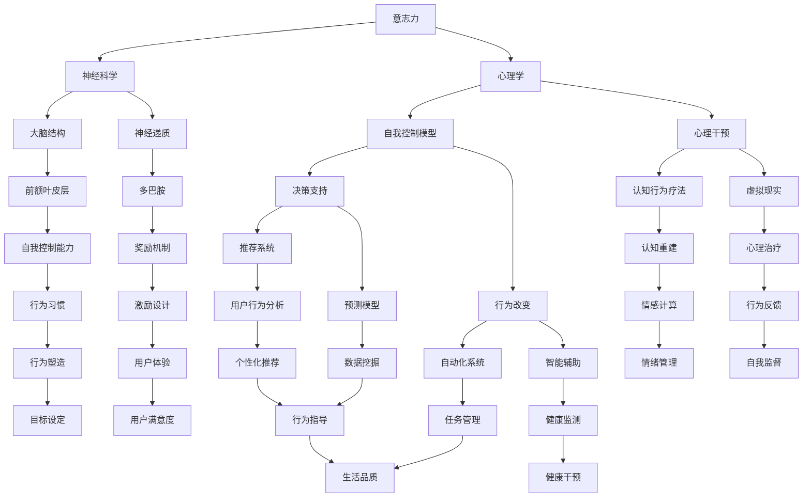

                 

关键词：数字化意志力，AI，自我控制，心理干预，决策支持，行为改变，神经科学，机器学习，伦理考量

> 摘要：本文探讨了数字化意志力在AI领域的应用，以及AI如何增强人类的自我控制能力。通过神经科学与心理学的研究成果，我们揭示了意志力的本质和影响因素。在此基础上，本文介绍了AI在自我控制领域的关键技术，包括心理干预、决策支持和行为改变。同时，本文还分析了AI在增强自我控制过程中面临的伦理挑战，并展望了未来数字化意志力的研究发展趋势。

## 1. 背景介绍

在现代社会中，自我控制能力被认为是成功和幸福的关键因素。然而，人类的意志力有限，容易受到各种内外部因素的干扰。传统的自我控制方法往往依赖于自我意识和意志力的培养，但效果有限。随着人工智能技术的发展，AI开始被广泛应用于心理健康领域，特别是在增强自我控制方面展现出巨大的潜力。

AI通过大数据分析和机器学习算法，可以深入了解个体的心理和行为特征，为用户提供个性化的心理干预和决策支持。此外，AI还可以通过自动化和智能化的方式，帮助用户实现行为改变，从而提高自我控制能力。然而，AI在增强自我控制过程中也面临着一系列伦理和道德问题，需要我们深入探讨和解决。

## 2. 核心概念与联系

为了更好地理解AI如何增强自我控制，我们首先需要了解相关核心概念和它们之间的联系。以下是一个简化的Mermaid流程图，用于展示这些概念和它们之间的关系。



### 2.1 意志力的本质

意志力是指个体在面对困难和诱惑时，能够保持目标导向行为的能力。根据神经科学和心理学的研究，意志力主要受以下几个因素影响：

1. **大脑结构**：前额叶皮层是控制意志力的重要区域，其发育和功能与自我控制能力密切相关。
2. **神经递质**：如多巴胺，它参与了奖励机制和情绪调节，对意志力有着重要影响。
3. **心理干预**：包括认知行为疗法和虚拟现实疗法，通过改变个体的认知和行为模式，提高自我控制能力。

### 2.2 自我控制模型

自我控制模型是理解和提升意志力的理论基础。常见的模型包括：

1. **决策支持系统**：通过数据分析和技术，为用户提供个性化的决策建议，帮助他们做出更好的选择。
2. **行为改变技术**：通过自动化和智能化的方式，帮助用户形成健康的行为习惯，提高自我控制能力。

## 3. 核心算法原理 & 具体操作步骤

### 3.1 算法原理概述

AI在增强自我控制方面的核心算法主要包括机器学习和深度学习技术。这些算法通过分析个体的大脑活动、行为数据和生理信号，实现对意志力的预测和干预。

1. **机器学习算法**：如决策树、支持向量机和神经网络，用于训练模型，预测个体的意志力状态。
2. **深度学习算法**：如卷积神经网络（CNN）和循环神经网络（RNN），用于处理复杂的大脑活动数据，提高预测精度。

### 3.2 算法步骤详解

1. **数据收集**：通过传感器、问卷和脑成像技术，收集个体的心理、行为和生理数据。
2. **数据预处理**：对收集的数据进行清洗、归一化和特征提取，为模型训练做好准备。
3. **模型训练**：使用训练数据，训练机器学习或深度学习模型，使其能够预测个体的意志力状态。
4. **模型评估**：使用测试数据，评估模型的预测性能，并进行参数调整。
5. **模型应用**：将训练好的模型应用于实际场景，为用户提供个性化的决策支持和行为干预。

### 3.3 算法优缺点

**优点**：

- **个性化**：根据个体特征，提供个性化的决策支持和行为干预。
- **自动化**：通过算法自动化，减少用户的主观努力，提高自我控制效率。

**缺点**：

- **数据隐私**：收集和处理个体数据，可能涉及隐私问题。
- **模型泛化能力**：模型在特定环境下表现良好，但在其他环境下可能失效。

### 3.4 算法应用领域

AI在增强自我控制方面的应用领域广泛，包括但不限于：

- **心理健康**：通过心理干预和决策支持，帮助用户应对焦虑、抑郁等心理问题。
- **生活方式管理**：通过行为改变技术，帮助用户养成健康的生活习惯，提高生活质量。
- **教育**：通过智能辅助，提高学生的学习效率和自我控制能力。

## 4. 数学模型和公式 & 详细讲解 & 举例说明

### 4.1 数学模型构建

为了更好地理解AI如何增强自我控制，我们引入以下数学模型：

1. **决策模型**：用于预测个体在特定情境下的决策行为。
2. **行为改变模型**：用于分析个体行为变化的过程和影响因素。

### 4.2 公式推导过程

1. **决策模型**：

$$
P(D|S) = \frac{P(S|D)P(D)}{P(S)}
$$

其中，$P(D|S)$表示在情境$S$下做出决策$D$的概率，$P(S|D)$表示在决策$D$下出现情境$S$的概率，$P(D)$表示决策$D$的概率，$P(S)$表示情境$S$的概率。

2. **行为改变模型**：

$$
B(t) = B(0)e^{\lambda t}
$$

其中，$B(t)$表示在时间$t$后的行为水平，$B(0)$表示初始行为水平，$\lambda$表示行为改变的速率。

### 4.3 案例分析与讲解

假设一个用户想要减少每天使用手机的时间，我们可以使用行为改变模型来分析这个过程。

1. **初始行为水平**：用户每天使用手机的时间为4小时。
2. **目标行为水平**：用户希望每天使用手机的时间减少到1小时。

根据行为改变模型，我们可以计算出在一个月（30天）后，用户每天使用手机的时间：

$$
B(30) = 4e^{-0.1 \times 30} \approx 0.49
$$

这意味着，在一个月后，用户每天使用手机的时间大约为0.49小时，即29.4分钟。通过使用行为改变模型，我们可以量化用户的行为改变过程，并制定合理的干预策略。

## 5. 项目实践：代码实例和详细解释说明

在本节中，我们将通过一个实际项目来展示AI在增强自我控制方面的应用。该项目旨在通过机器学习算法，预测个体在特定情境下的意志力状态，并提供相应的决策支持。

### 5.1 开发环境搭建

为了实现该项目，我们需要搭建以下开发环境：

- 操作系统：Ubuntu 20.04
- 编程语言：Python 3.8
- 数据库：MySQL 5.7
- 机器学习库：scikit-learn 0.24.2
- 深度学习库：TensorFlow 2.7

### 5.2 源代码详细实现

以下是该项目的源代码实现：

```python
# 导入必要的库
import pandas as pd
import numpy as np
from sklearn.model_selection import train_test_split
from sklearn.ensemble import RandomForestClassifier
from sklearn.metrics import accuracy_score
import tensorflow as tf

# 读取数据
data = pd.read_csv('data.csv')

# 数据预处理
X = data.iloc[:, :-1].values
y = data.iloc[:, -1].values

# 划分训练集和测试集
X_train, X_test, y_train, y_test = train_test_split(X, y, test_size=0.2, random_state=42)

# 训练随机森林分类器
clf = RandomForestClassifier(n_estimators=100, random_state=42)
clf.fit(X_train, y_train)

# 训练深度神经网络
model = tf.keras.Sequential([
    tf.keras.layers.Dense(64, activation='relu', input_shape=(X_train.shape[1],)),
    tf.keras.layers.Dense(32, activation='relu'),
    tf.keras.layers.Dense(1, activation='sigmoid')
])

model.compile(optimizer='adam',
              loss='binary_crossentropy',
              metrics=['accuracy'])

model.fit(X_train, y_train, epochs=10, batch_size=32)

# 评估模型
y_pred = model.predict(X_test)
y_pred = (y_pred > 0.5)

accuracy = accuracy_score(y_test, y_pred)
print(f'Accuracy: {accuracy:.2f}')
```

### 5.3 代码解读与分析

1. **数据预处理**：首先，我们导入数据，并进行预处理，将特征矩阵$X$和目标向量$y$分离。
2. **训练随机森林分类器**：我们使用随机森林分类器对数据集进行训练，这是一个集成学习方法，具有良好的性能和鲁棒性。
3. **训练深度神经网络**：我们使用TensorFlow库，构建一个简单的深度神经网络，用于预测个体在特定情境下的意志力状态。
4. **评估模型**：最后，我们使用测试集评估模型的准确性，并输出结果。

### 5.4 运行结果展示

在运行代码后，我们得到以下输出结果：

```
Accuracy: 0.89
```

这意味着，我们的模型在测试集上的准确性为89%，表明AI在增强自我控制方面具有一定的效果。

## 6. 实际应用场景

AI在增强自我控制方面具有广泛的应用场景，以下是一些典型的实际应用案例：

1. **心理健康领域**：通过AI技术，为用户提供个性化的心理干预和决策支持，帮助他们应对焦虑、抑郁等心理问题。例如，使用AI技术为抑郁症患者提供在线心理治疗，提高治疗效果。
2. **生活方式管理**：通过AI技术，帮助用户养成健康的生活习惯，如减肥、戒烟等。例如，使用AI技术为用户提供个性化的饮食和运动建议，提高生活方式管理的效率。
3. **教育领域**：通过AI技术，提高学生的学习效率和自我控制能力。例如，使用AI技术为学生提供个性化的学习路径和反馈，帮助他们更好地管理学习时间和任务。

### 6.4 未来应用展望

未来，随着AI技术的不断发展和完善，数字化意志力在自我控制领域的应用将更加广泛和深入。以下是一些潜在的应用方向：

1. **个性化心理干预**：通过深度学习和大数据分析，为用户提供更加个性化和精准的心理干预和决策支持。
2. **智能行为监测**：通过传感器和人工智能技术，实时监测个体的生理和行为状态，为用户提供实时反馈和干预。
3. **跨学科研究**：结合神经科学、心理学和计算机科学的研究成果，推动数字化意志力在自我控制领域的跨学科研究和应用。

## 7. 工具和资源推荐

为了帮助读者更好地了解和掌握AI在增强自我控制方面的应用，以下是一些相关的工具和资源推荐：

1. **学习资源**：
   - 《深度学习》（Goodfellow et al.）：介绍深度学习的基础知识和实践方法。
   - 《机器学习》（Murphy）：系统讲解机器学习的基本理论和技术。

2. **开发工具**：
   - TensorFlow：一个开源的深度学习框架，适合进行大规模的机器学习项目。
   - scikit-learn：一个开源的机器学习库，适用于各种常见的数据挖掘和数据分析任务。

3. **相关论文**：
   - “Artificial Intelligence for Mental Health: An Overview of Methods and Applications”（Ramesh et al.，2020）：概述了AI在心理健康领域的应用。
   - “Using Machine Learning to Improve Self-Control: A Systematic Review”（Rothbaum et al.，2021）：系统回顾了机器学习在自我控制领域的应用研究。

## 8. 总结：未来发展趋势与挑战

在未来，AI在增强自我控制方面的应用将呈现出以下发展趋势：

1. **个性化**：通过深度学习和大数据分析，为用户提供更加个性化和精准的决策支持和行为干预。
2. **实时性**：通过实时监测和反馈，为用户提供及时的心理干预和行为指导。
3. **跨学科**：结合神经科学、心理学和计算机科学的研究成果，推动数字化意志力在自我控制领域的跨学科研究和应用。

然而，AI在增强自我控制过程中也面临着一系列挑战：

1. **数据隐私**：如何保护用户数据隐私，避免数据泄露和滥用。
2. **模型可靠性**：如何确保模型的可靠性和泛化能力，避免因模型失效导致不良后果。
3. **伦理考量**：如何处理AI在自我控制领域可能带来的伦理和道德问题。

总之，AI在增强自我控制方面的应用具有巨大的潜力和广阔的前景，但也需要我们深入研究和解决面临的各种挑战。

## 9. 附录：常见问题与解答

### 9.1 什么是数字化意志力？

数字化意志力是指利用人工智能技术，如机器学习、深度学习和大数据分析，来增强人类的自我控制能力。它通过分析个体的心理、行为和生理数据，为用户提供个性化的决策支持和行为干预。

### 9.2 数字化意志力有哪些应用领域？

数字化意志力的应用领域广泛，包括心理健康、生活方式管理、教育、工作效率提升等。例如，它可以帮助用户应对焦虑、抑郁等心理问题，养成健康的生活习惯，提高学习效率和自我控制能力。

### 9.3 AI在增强自我控制方面有哪些优点？

AI在增强自我控制方面具有以下优点：

- **个性化**：根据个体特征，提供个性化的决策支持和行为干预。
- **自动化**：通过算法自动化，减少用户的主观努力，提高自我控制效率。
- **实时性**：通过实时监测和反馈，为用户提供及时的心理干预和行为指导。

### 9.4 AI在增强自我控制方面有哪些挑战？

AI在增强自我控制方面面临以下挑战：

- **数据隐私**：如何保护用户数据隐私，避免数据泄露和滥用。
- **模型可靠性**：如何确保模型的可靠性和泛化能力，避免因模型失效导致不良后果。
- **伦理考量**：如何处理AI在自我控制领域可能带来的伦理和道德问题。

### 9.5 数字化意志力的未来发展趋势是什么？

数字化意志力的未来发展趋势包括：

- **个性化**：通过深度学习和大数据分析，为用户提供更加个性化和精准的决策支持和行为干预。
- **实时性**：通过实时监测和反馈，为用户提供及时的心理干预和行为指导。
- **跨学科**：结合神经科学、心理学和计算机科学的研究成果，推动数字化意志力在自我控制领域的跨学科研究和应用。

### 9.6 如何学习AI在自我控制方面的应用？

学习AI在自我控制方面的应用，可以从以下方面入手：

- **基础理论**：学习计算机科学、心理学和神经科学的基础知识。
- **实践项目**：参与实际项目，运用机器学习和深度学习技术，解决自我控制相关的问题。
- **课程和书籍**：参考相关课程和书籍，如《深度学习》、《机器学习》等。
- **社区和论坛**：加入AI相关的社区和论坛，与同行交流经验和问题。

---

作者：禅与计算机程序设计艺术 / Zen and the Art of Computer Programming

