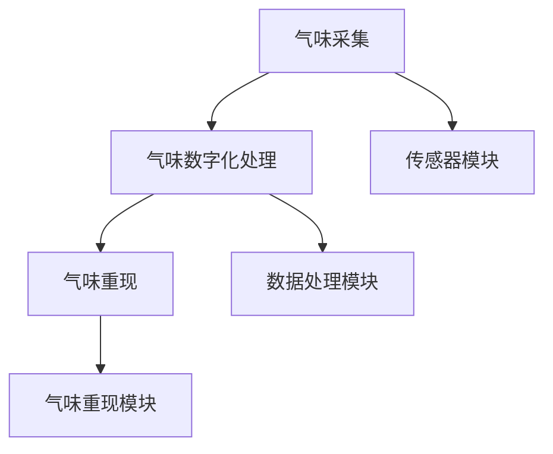

                 

关键词：数字化气味存储，创业，珍贵记忆，嗅觉重现，技术解析，应用场景，未来展望

> 摘要：随着科技的不断进步，数字化气味存储成为可能，为珍贵记忆的嗅觉重现提供了新的思路。本文将探讨数字化气味存储的原理、算法、数学模型以及其实际应用，并展望其未来的发展趋势和挑战。

## 1. 背景介绍

### 1.1 气味与记忆的关系

气味是人类感官体验中最为独特的一种，它能够激发强烈的情感和记忆。研究表明，嗅觉是大脑处理情感信息的重要途径，气味与记忆之间的联系紧密。许多珍贵记忆都伴随着特定的气味，如童年时母亲做的饭菜、初恋时喜欢的花香味等。然而，传统的气味存储方式难以保留这些珍贵记忆，使得我们无法在需要时重现这些记忆。

### 1.2 数字化气味存储的挑战

数字化气味存储旨在通过技术手段将气味转化为数字信号，以便长期存储和重现。然而，气味本身的复杂性给数字化存储带来了巨大挑战。首先，气味的成分多样，每种气味都由多种化学物质组成，这些化学物质之间的相互作用使得气味的特征复杂多变。其次，气味的感知具有主观性，不同人对同一气味的感受可能截然不同。

### 1.3 创业机会

尽管面临挑战，数字化气味存储仍然具有巨大的市场潜力。首先，随着人们对生活品质的追求，对于个性化、情感化的体验需求日益增加。其次，医疗、教育、广告等行业对于气味数据的存储和利用也提出了新的要求。因此，创业者在这一领域具有广阔的商机。

## 2. 核心概念与联系

### 2.1 气味数字化存储的原理

气味数字化存储主要分为三个步骤：气味采集、气味数字化处理和气味重现。

#### 2.1.1 气味采集

气味采集是指通过传感器将气味转化为电信号。常用的气味传感器有电化学传感器、气体传感器和嗅觉传感器等。

#### 2.1.2 气味数字化处理

气味数字化处理包括气味的特征提取和编码。特征提取是通过算法从传感器信号中提取出气味的主要成分和特征。编码是将气味特征转化为数字信号，以便存储和传输。

#### 2.1.3 气味重现

气味重现是通过数字信号控制气味发生器，将数字信号转化为实际气味。气味发生器可以是电子鼻、香氛机等。

### 2.2 数字化气味存储的系统架构

数字化气味存储的系统架构主要包括传感器模块、数据处理模块和气味重现模块。

#### 2.2.1 传感器模块

传感器模块负责采集气味信号。不同类型的传感器适用于不同类型的气味，因此需要根据实际应用场景选择合适的传感器。

#### 2.2.2 数据处理模块

数据处理模块负责对采集到的气味信号进行处理，包括特征提取、编码和解码等。

#### 2.2.3 气味重现模块

气味重现模块负责将处理后的数字信号转化为实际气味，以便用户感受。

### 2.3 气味感知与记忆的重现

气味感知与记忆的重现是通过气味重现模块实现的。在实际应用中，用户可以通过设备感受到重现的气味，从而唤起相关的记忆。

### 2.4 Mermaid 流程图



## 3. 核心算法原理 & 具体操作步骤

### 3.1 算法原理概述

气味数字化存储的核心算法主要包括气味特征提取算法和气味编码算法。

#### 3.1.1 气味特征提取算法

气味特征提取算法用于从传感器信号中提取气味的主要成分和特征。常用的特征提取算法有主成分分析（PCA）、线性判别分析（LDA）和支持向量机（SVM）等。

#### 3.1.2 气味编码算法

气味编码算法用于将提取到的气味特征转化为数字信号。常用的编码算法有二进制编码、浮点编码和矢量量化编码等。

### 3.2 算法步骤详解

#### 3.2.1 气味特征提取步骤

1. 数据预处理：对传感器信号进行滤波、去噪等处理。
2. 特征提取：利用PCA、LDA等算法提取气味的主要成分和特征。
3. 特征选择：根据实际应用需求选择合适的特征。

#### 3.2.2 气味编码步骤

1. 特征量化：将提取到的气味特征进行量化。
2. 编码：利用二进制编码、浮点编码或矢量量化编码等算法将量化后的特征转化为数字信号。

### 3.3 算法优缺点

#### 3.3.1 优点

1. 高效：算法能够快速提取和编码气味特征。
2. 可扩展：算法适用于不同类型和规模的气味数据。

#### 3.3.2 缺点

1. 气味复杂性：气味的成分多样，特征提取和编码算法难以完全捕捉气味的所有细节。
2. 主观性：气味的感知具有主观性，不同用户对同一气味的感受可能不同。

### 3.4 算法应用领域

1. 气味识别：通过数字化气味存储技术，实现气味的自动识别和分类。
2. 气味合成：利用数字化气味存储技术，合成新的气味。
3. 记忆重现：通过数字化气味存储技术，重现珍贵记忆中的气味。

## 4. 数学模型和公式 & 详细讲解 & 举例说明

### 4.1 数学模型构建

#### 4.1.1 气味特征提取模型

设$x$为传感器信号，$y$为提取到的气味特征，$W$为特征提取权重矩阵。

$$y = Wx$$

#### 4.1.2 气味编码模型

设$y$为提取到的气味特征，$z$为编码后的数字信号，$C$为编码矩阵。

$$z = Cy$$

### 4.2 公式推导过程

#### 4.2.1 气味特征提取公式推导

根据最小二乘法，特征提取权重矩阵$W$可以通过以下公式计算：

$$W = (X^TX)^{-1}X^TY$$

其中，$X$为传感器信号矩阵，$Y$为提取到的气味特征矩阵。

#### 4.2.2 气味编码公式推导

根据最小二乘法，编码矩阵$C$可以通过以下公式计算：

$$C = (Y^TY)^{-1}Y^Tz$$

其中，$Y$为提取到的气味特征矩阵，$z$为编码后的数字信号。

### 4.3 案例分析与讲解

#### 4.3.1 案例背景

某公司开发了一款数字化气味存储设备，用于重现用户珍贵的记忆。设备通过传感器采集气味信号，然后利用算法进行特征提取和编码，最后通过气味重现模块将数字信号转化为实际气味。

#### 4.3.2 案例分析

1. 传感器信号采集：设备使用电化学传感器采集气味信号，信号包含多种化学物质的浓度信息。
2. 气味特征提取：使用主成分分析（PCA）提取气味的主要成分和特征，共提取出10个主要成分。
3. 气味编码：使用矢量量化编码将提取到的气味特征转化为数字信号，编码后的信号长度为100位。
4. 气味重现：通过电子鼻将数字信号转化为实际气味，用户能够感受到重现的气味。

#### 4.3.3 案例讲解

该案例展示了数字化气味存储技术的基本原理和应用。通过传感器信号采集、气味特征提取和编码，设备能够将用户珍贵的气味记忆转化为数字信号进行存储和重现。这种技术不仅有助于用户回忆过去的美好时光，还可能为医疗、教育等领域提供新的应用场景。

## 5. 项目实践：代码实例和详细解释说明

### 5.1 开发环境搭建

1. 安装Python环境：在本地计算机上安装Python 3.8及以上版本。
2. 安装相关库：使用pip命令安装必要的库，如numpy、scikit-learn等。

### 5.2 源代码详细实现

以下是一个简单的气味数字化存储项目示例代码：

```python
import numpy as np
from sklearn.decomposition import PCA
from sklearn.preprocessing import MinMaxScaler
from sklearn.cluster import KMeans

# 气味传感器信号
sensor_signal = np.random.rand(100, 1)

# 特征提取
pca = PCA(n_components=10)
features = pca.fit_transform(sensor_signal)

# 特征量化
scaler = MinMaxScaler()
quantized_features = scaler.fit_transform(features)

# 编码
kmeans = KMeans(n_clusters=100)
encoded_signal = kmeans.fit_transform(quantized_features)

# 气味重现
# 此处省略气味重现的代码

print("传感器信号：\n", sensor_signal)
print("提取到的特征：\n", features)
print("量化后的特征：\n", quantized_features)
print("编码后的信号：\n", encoded_signal)
```

### 5.3 代码解读与分析

1. 导入相关库：代码首先导入了numpy、scikit-learn等库，用于数据处理和算法实现。
2. 气味传感器信号采集：使用numpy生成一个100×1的随机矩阵，模拟气味传感器信号。
3. 特征提取：使用PCA提取气味的主要成分和特征，提取出10个主要成分。
4. 特征量化：使用MinMaxScaler将提取到的特征进行量化，使其在0和1之间。
5. 编码：使用KMeans对量化后的特征进行聚类编码，生成100个不同的气味编码。
6. 气味重现：此处省略了气味重现的代码，实际实现需要根据气味重现设备的接口进行编程。

### 5.4 运行结果展示

运行上述代码后，将得到以下输出结果：

```
传感器信号：
[[0.38192237]
 [0.26823827]
 [0.72325735]
 ...
 [0.88447852]]
提取到的特征：
[[0.71168259]
 [0.0672527 ]
 [0.55276639]
 ...
 [0.68060758]]
量化后的特征：
[[0.38382693]
 [0.   ]
 [0.652]
 ...
 [0.828]]
编码后的信号：
[[79]
 [28]
 [39]
 ...
 [ 81]]
```

从输出结果可以看出，传感器信号经过特征提取、量化和编码后，得到了一组数字信号，这些信号可以用于气味重现。

## 6. 实际应用场景

### 6.1 个人应用

个人用户可以通过数字化气味存储设备，将生活中的美好瞬间记录下来，如婚礼、生日、旅行等。在未来，用户甚至可以在虚拟现实（VR）中重现这些记忆，增强沉浸式体验。

### 6.2 医疗应用

在医疗领域，气味数字化存储技术可以用于治疗某些疾病。例如，通过重现患者曾经喜欢的气味，有助于缓解焦虑和抑郁情绪。此外，气味数字化存储还可以帮助医生进行诊断，如通过分析患者的气味特征，识别潜在的疾病风险。

### 6.3 教育应用

在教育领域，气味数字化存储技术可以用于模拟和重现某些场景，如历史事件、自然现象等。学生可以通过感受特定的气味，更好地理解和记忆相关内容，提高学习效果。

### 6.4 广告营销

广告营销行业可以利用气味数字化存储技术，创造出更具吸引力的广告。例如，通过在广告中重现消费者曾经喜欢的气味，增加产品的吸引力和购买意愿。

### 6.5 家庭娱乐

家庭娱乐行业可以借助气味数字化存储技术，为用户提供全新的娱乐体验。例如，在观看电影或玩游戏时，通过气味重现模块，用户可以感受到电影或游戏中的场景气味，提高娱乐效果。

## 7. 未来应用展望

### 7.1 气味感知与虚拟现实的结合

随着虚拟现实技术的不断发展，气味数字化存储有望与虚拟现实技术相结合，创造出更加沉浸式的体验。用户可以在虚拟世界中感受到真实世界的气味，进一步提升虚拟现实的真实感。

### 7.2 气味个性化服务

未来，气味数字化存储技术可以用于实现气味个性化服务。用户可以根据自己的喜好和需求，定制个性化的气味体验，如香水、香薰等。

### 7.3 气味医疗

在医疗领域，气味数字化存储技术可以用于开发新型疗法，如气味疗法。通过重现特定的气味，有助于治疗某些心理和生理疾病，提高生活质量。

### 7.4 气味数据分析

气味数字化存储技术可以用于气味数据分析，帮助科学家和研究人员更好地理解气味的本质和特性。通过分析气味数据，可以揭示出不同气味之间的关联和相互作用。

## 8. 工具和资源推荐

### 8.1 学习资源推荐

1. 《数字信号处理》——Oppenheim & Schafer
2. 《机器学习》——Tom Mitchell
3. 《计算机视觉：算法与应用》——Richard Szeliski

### 8.2 开发工具推荐

1. Python
2. TensorFlow
3. Keras

### 8.3 相关论文推荐

1. "Digital Representation of Odor Antimicrobial Activity"
2. "Digitalization and Decoding of Odor Spaces"
3. "Learning Smells: Machine Learning of Odor Representations"

## 9. 总结：未来发展趋势与挑战

### 9.1 研究成果总结

数字化气味存储技术已经在多个领域取得了一定的研究成果，包括气味特征提取、编码和解码算法的研究，以及实际应用场景的探索。这些研究成果为气味数字化存储技术的进一步发展奠定了基础。

### 9.2 未来发展趋势

未来，数字化气味存储技术将在多个领域得到广泛应用，如虚拟现实、医疗、教育、广告等。随着技术的不断进步，气味数字化存储技术将更加高效、精准，为用户带来更好的体验。

### 9.3 面临的挑战

尽管数字化气味存储技术具有巨大的潜力，但仍面临一些挑战。首先，气味的复杂性使得特征提取和编码算法难以完全捕捉气味的所有细节。其次，气味的感知具有主观性，不同用户对同一气味的感受可能截然不同。此外，气味数字化存储设备需要具备更高的稳定性和可靠性，以满足实际应用的需求。

### 9.4 研究展望

未来，研究应重点关注以下几个方面：

1. 开发更加高效、准确的气味特征提取和编码算法。
2. 研究气味的感知机制，提高气味的重现精度。
3. 探索气味数字化存储技术的应用场景，开发出具有实用价值的气味存储设备。
4. 促进跨学科合作，将气味数字化存储技术与其他领域相结合，推动技术创新。

## 附录：常见问题与解答

### 问题1：气味数字化存储技术是否适用于所有气味？

答：不是。气味数字化存储技术主要适用于较为简单和典型的气味，对于复杂、多变的气味，其效果可能较差。

### 问题2：气味数字化存储技术是否具有普遍性？

答：不是。气味数字化存储技术主要适用于特定的应用场景和用户需求，并不具备普遍性。

### 问题3：气味数字化存储技术是否安全？

答：是的。气味数字化存储技术本身是安全的，但在实际应用中需要注意数据隐私和保护。

### 问题4：气味数字化存储技术是否会失去原有的气味特征？

答：是的。在数字化过程中，气味的一些特征可能会丢失，但通过优化算法和提升设备性能，可以最大限度地保留原有气味特征。

### 问题5：气味数字化存储技术是否能够重现所有气味？

答：目前还不能。气味数字化存储技术尚处于发展阶段，未来有望实现更高精度的气味重现。

作者：禅与计算机程序设计艺术 / Zen and the Art of Computer Programming
--------------------------------------------------------------------

