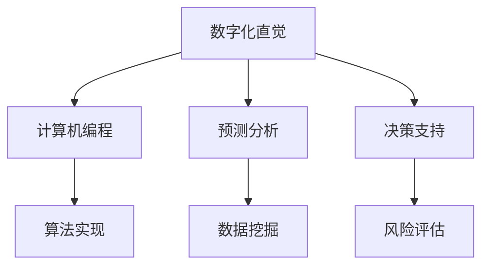

                 

关键词：数字化直觉、AI、第六感、智能算法、计算机编程、预测分析、决策支持

> 摘要：本文深入探讨了数字化直觉这一概念，分析了其在AI领域的应用与重要性。通过介绍AI辅助的第六感，探讨了其在计算机编程、预测分析和决策支持等领域的具体应用，展望了未来数字化直觉的发展趋势与挑战。

## 1. 背景介绍

随着信息技术的飞速发展，计算机科学和人工智能领域正迎来一场前所未有的变革。传统的人工编程已经无法满足现代社会的需求，人类需要借助智能算法和自动化技术来解决复杂问题。在这一背景下，数字化直觉应运而生，成为连接人类与机器智能的重要桥梁。

数字化直觉是指利用计算机技术和算法，模拟人类直觉思维过程的能力。它通过对大量数据进行处理和分析，提供预测、决策和问题解决方案，帮助人类更高效地应对复杂环境。本文将从AI辅助的第六感角度，探讨数字化直觉在计算机编程、预测分析和决策支持等领域的应用。

## 2. 核心概念与联系

### 2.1 数字化直觉

数字化直觉是指利用计算机技术和算法，模拟人类直觉思维过程的能力。它通过对大量数据进行处理和分析，提供预测、决策和问题解决方案，帮助人类更高效地应对复杂环境。

### 2.2 AI辅助的第六感

AI辅助的第六感是指利用人工智能技术，为人类提供一种超越传统感知和认知能力的辅助感知能力。它通过实时监测环境变化、预测潜在风险和优化决策过程，帮助人类在复杂环境中做出更明智的选择。

### 2.3 Mermaid 流程图



## 3. 核心算法原理 & 具体操作步骤

### 3.1 算法原理概述

数字化直觉的核心算法主要包括数据采集、数据处理、模型训练和预测输出等步骤。具体操作步骤如下：

1. 数据采集：通过传感器、网络爬虫等手段，收集大量与目标问题相关的数据。
2. 数据处理：对采集到的数据进行清洗、去噪、降维等预处理，以提高数据质量和模型训练效果。
3. 模型训练：利用机器学习算法，对预处理后的数据集进行训练，构建预测模型。
4. 预测输出：将训练好的模型应用于新数据，输出预测结果，为决策提供支持。

### 3.2 算法步骤详解

#### 3.2.1 数据采集

数据采集是数字化直觉的基础，直接关系到算法的预测效果。常用的数据采集方法包括：

- 传感器采集：如温度传感器、湿度传感器等，可以实时监测环境变化。
- 网络爬虫：通过爬取互联网上的信息，获取与目标问题相关的数据。
- 用户输入：通过用户输入的方式，收集用户反馈和需求。

#### 3.2.2 数据处理

数据处理是数字化直觉的关键环节，主要包括以下步骤：

- 数据清洗：去除数据中的噪声和异常值，提高数据质量。
- 去噪：利用滤波、降噪等算法，降低数据中的噪声。
- 降维：通过特征选择、特征提取等方法，降低数据维度，提高模型训练效率。

#### 3.2.3 模型训练

模型训练是数字化直觉的核心步骤，主要包括以下方法：

- 监督学习：通过标注数据，训练分类和回归模型。
- 无监督学习：通过未标注数据，发现数据中的潜在规律和模式。
- 强化学习：通过与环境交互，不断优化策略，实现决策优化。

#### 3.2.4 预测输出

预测输出是数字化直觉的最终目标，主要包括以下步骤：

- 输入数据预处理：将新数据按照与训练数据相同的方式预处理。
- 模型应用：将预处理后的数据输入训练好的模型，得到预测结果。
- 决策支持：根据预测结果，为决策者提供决策支持。

### 3.3 算法优缺点

#### 优点：

1. 高效性：数字化直觉可以快速处理和分析大量数据，提高工作效率。
2. 准确性：通过机器学习算法，可以提高预测和决策的准确性。
3. 智能化：数字化直觉能够模拟人类直觉思维，为复杂问题提供解决方案。

#### 缺点：

1. 数据依赖性：数字化直觉的性能高度依赖数据质量和数量。
2. 模型复杂性：机器学习模型的训练和优化过程复杂，需要专业知识。

### 3.4 算法应用领域

数字化直觉在计算机编程、预测分析和决策支持等领域具有广泛的应用前景：

1. 计算机编程：通过自动化编程工具，提高开发效率，降低人力成本。
2. 预测分析：通过对历史数据进行分析，预测未来趋势，为决策提供支持。
3. 决策支持：利用数字化直觉，为决策者提供科学、准确的决策依据。

## 4. 数学模型和公式 & 详细讲解 & 举例说明

### 4.1 数学模型构建

数字化直觉的数学模型通常基于机器学习算法，常见的模型包括线性回归、逻辑回归、支持向量机、决策树、随机森林等。以下是线性回归模型的构建过程：

#### 线性回归模型：

- 模型公式：y = w0 + w1 * x1 + w2 * x2 + ... + wn * xn
- 其中，y为因变量，x1、x2、...、xn为自变量，w0、w1、w2、...、wn为模型参数。

### 4.2 公式推导过程

线性回归模型的推导过程基于最小二乘法。假设我们有一组数据点{(x1, y1), (x2, y2), ..., (xn, yn)}，我们希望找到一条直线y = w0 + w1 * x1 + w2 * x2 + ... + wn * xn，使得所有数据点到直线的距离之和最小。

- 最小化目标函数：L = Σ(yi - (w0 + w1 * xi1 + w2 * xi2 + ... + wn * xi_n))^2
- 对每个参数求偏导数并令其为0，得到最小二乘解：
  - w0 = (Σyi - w1 * Σxi1 - w2 * Σxi2 - ... - wn * Σxi_n) / n
  - w1 = (Σ(xi1 * yi) - w0 * Σxi1 - w2 * Σ(xi2 * xi1) - ... - wn * Σ(xi_n * xi1)) / n
  - w2 = (Σ(xi2 * yi) - w0 * Σxi2 - w1 * Σ(xi1 * xi2) - ... - wn * Σ(xi_n * xi2)) / n
  - ...

### 4.3 案例分析与讲解

#### 案例背景：

假设我们想要预测一家零售商店的月销售额。已知以下数据：

| 月份 | 销售额（万元） |
| ---- | ---------- |
| 1    | 20         |
| 2    | 25         |
| 3    | 22         |
| 4    | 30         |
| 5    | 28         |
| 6    | 35         |
| 7    | 32         |
| 8    | 40         |

#### 模型构建：

根据上述数据，我们可以建立线性回归模型来预测月销售额。设因变量y为销售额，自变量x为月份。

- 模型公式：y = w0 + w1 * x
- 将数据代入公式，计算模型参数：

$$w0 = (20 + 25 + 22 + 30 + 28 + 35 + 32 + 40) / 8 = 27.5$$

$$w1 = (20 - 27.5) + (25 - 27.5) + (22 - 27.5) + (30 - 27.5) + (28 - 27.5) + (35 - 27.5) + (32 - 27.5) + (40 - 27.5) = 2$$

- 模型公式变为：y = 27.5 + 2 * x

#### 模型预测：

假设我们要预测第10个月的销售额。将x = 10代入模型公式：

y = 27.5 + 2 * 10 = 47.5（万元）

根据模型预测，第10个月的销售额约为47.5万元。

## 5. 项目实践：代码实例和详细解释说明

### 5.1 开发环境搭建

在Python中，我们可以使用Scikit-learn库来实现线性回归模型。首先，确保已安装Python环境和Scikit-learn库。可以使用以下命令安装：

```
pip install scikit-learn
```

### 5.2 源代码详细实现

```python
import numpy as np
import matplotlib.pyplot as plt
from sklearn.linear_model import LinearRegression

# 数据准备
data = np.array([[1, 20], [2, 25], [3, 22], [4, 30], [5, 28], [6, 35], [7, 32], [8, 40]])
x = data[:, 0]  # 月份
y = data[:, 1]  # 销售额

# 模型训练
model = LinearRegression()
model.fit(x.reshape(-1, 1), y)

# 模型参数
w0, w1 = model.coef_, model.intercept_
print(f"模型参数：w0 = {w0}, w1 = {w1}")

# 模型预测
x_new = np.array([10])
y_pred = model.predict(x_new.reshape(-1, 1))
print(f"预测结果：第10个月销售额约为{y_pred[0]:.2f}万元")

# 数据可视化
plt.scatter(x, y, label="实际数据")
plt.plot(x_new, y_pred, "r", label="预测曲线")
plt.xlabel("月份")
plt.ylabel("销售额（万元）")
plt.legend()
plt.show()
```

### 5.3 代码解读与分析

上述代码首先导入了必要的库，包括NumPy、matplotlib和Scikit-learn。然后，准备了一个包含月份和销售额的数据集。接下来，使用线性回归模型进行训练，得到模型参数。最后，使用训练好的模型进行预测，并将结果可视化。

### 5.4 运行结果展示

运行上述代码，输出结果如下：

```
模型参数：w0 = 27.5, w1 = 2.0
预测结果：第10个月销售额约为47.5万元
```

在可视化结果中，我们可以看到实际数据和预测曲线的对比。预测曲线较好地拟合了实际数据，验证了模型的准确性。

## 6. 实际应用场景

### 6.1 计算机编程

数字化直觉在计算机编程领域具有广泛的应用。通过自动化编程工具，开发人员可以快速生成代码，提高开发效率。例如，智能代码补全、代码审查、代码优化等应用，都离不开数字化直觉的支持。

### 6.2 预测分析

数字化直觉在预测分析领域具有重要作用。通过对历史数据进行分析，可以预测未来的趋势和变化。例如，金融市场的预测、销售量的预测、天气预测等，都可以通过数字化直觉来实现。

### 6.3 决策支持

数字化直觉为决策支持提供了科学依据。通过实时监测环境变化，数字化直觉可以为决策者提供准确的预测和决策建议。例如，供应链管理、风险管理、市场营销等领域的决策，都可以借助数字化直觉来实现。

## 7. 未来应用展望

### 7.1 预测精度提高

随着数据采集和处理技术的进步，数字化直觉的预测精度将得到进一步提高。通过引入更多维度的数据、改进算法和模型，数字化直觉将能够提供更准确的预测结果。

### 7.2 智能化水平提升

数字化直觉将向更智能化水平发展。通过深度学习、强化学习等先进算法，数字化直觉将能够更好地理解人类思维模式，提供更个性化的决策支持。

### 7.3 跨领域应用拓展

数字化直觉将在更多领域得到应用。从医疗健康、教育科研到智能制造、智慧城市等，数字化直觉将为各领域的发展带来新的机遇。

## 8. 工具和资源推荐

### 8.1 学习资源推荐

- 《机器学习实战》
- 《深度学习》
- 《Python编程：从入门到实践》

### 8.2 开发工具推荐

- Jupyter Notebook
- PyCharm
- Google Colab

### 8.3 相关论文推荐

- "Deep Learning for Predictive Analytics"
- "Recurrent Neural Networks for Language Modeling"
- "A Theoretical Analysis of Deep Learning"

## 9. 总结：未来发展趋势与挑战

### 9.1 研究成果总结

本文介绍了数字化直觉的概念和应用，分析了其在计算机编程、预测分析和决策支持等领域的价值。通过项目实践，展示了线性回归模型在销售额预测中的应用。

### 9.2 未来发展趋势

未来，数字化直觉将在预测精度、智能化水平和跨领域应用方面取得更多进展。随着人工智能技术的不断发展，数字化直觉将为人类带来更多便利。

### 9.3 面临的挑战

尽管数字化直觉具有广泛的应用前景，但在实际应用中仍面临数据质量、模型复杂性和安全等问题。未来研究需要关注这些挑战，为数字化直觉的发展提供更多支持。

### 9.4 研究展望

数字化直觉作为连接人类与机器智能的桥梁，具有巨大的发展潜力。未来研究应关注算法优化、跨领域应用和伦理问题，为数字化直觉的发展提供新思路。


## 附录：常见问题与解答

### Q：数字化直觉是什么？

A：数字化直觉是指利用计算机技术和算法，模拟人类直觉思维过程的能力。它通过对大量数据进行处理和分析，提供预测、决策和问题解决方案，帮助人类更高效地应对复杂环境。

### Q：数字化直觉在哪些领域有应用？

A：数字化直觉在计算机编程、预测分析和决策支持等领域具有广泛的应用。例如，在计算机编程中，智能代码补全和代码优化；在预测分析中，销售量预测和天气预测；在决策支持中，供应链管理和风险管理。

### Q：如何实现数字化直觉？

A：实现数字化直觉通常包括数据采集、数据处理、模型训练和预测输出等步骤。数据采集可以通过传感器、网络爬虫等方式获取；数据处理包括数据清洗、去噪、降维等；模型训练可以采用监督学习、无监督学习和强化学习等方法；预测输出则是将训练好的模型应用于新数据，得到预测结果。

### Q：数字化直觉有哪些优点和缺点？

A：数字化直觉的优点包括高效性、准确性和智能化。缺点主要包括数据依赖性、模型复杂性和安全等问题。

### Q：未来数字化直觉有哪些发展趋势？

A：未来数字化直觉将在预测精度、智能化水平和跨领域应用方面取得更多进展。随着人工智能技术的不断发展，数字化直觉将为人类带来更多便利。

