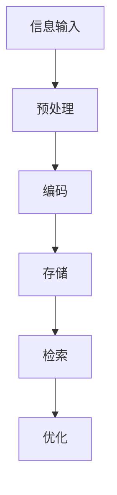

                 

关键词：人工智能，数字化记忆，人类回忆，深度学习，神经网络，信息存储，数据挖掘，认知科学，记忆增强。

> 摘要：本文将探讨人工智能技术在辅助人类回忆方面的潜力。通过对当前数字化记忆技术的发展现状和核心算法原理的深入分析，本文旨在揭示AI在人类记忆增强方面的应用前景，并提出未来的发展趋势与面临的挑战。

## 1. 背景介绍

人类记忆是大脑通过神经活动对信息的编码、存储和提取过程。然而，随着信息时代的到来，人们面对的信息量呈爆炸式增长，传统的记忆方式已经难以应对。同时，记忆力下降、认知障碍等问题的日益普遍，使得如何增强和辅助人类记忆成为了一个重要的研究课题。

近年来，人工智能技术的迅猛发展为人类记忆提供了新的可能性。通过深度学习和神经网络算法，AI系统可以在大数据环境中学习和模拟人类的记忆过程，从而实现记忆的增强和辅助。数字化记忆技术正是基于这一理念，通过将人类记忆转化为数字化数据，实现记忆的存储、检索和优化。

## 2. 核心概念与联系

### 2.1 数字化记忆的定义

数字化记忆是指将人类记忆转化为数字形式，利用计算机技术进行存储、管理和检索的过程。这一过程涉及到信息编码、存储、检索和优化等多个环节。

### 2.2 数字化记忆与AI的联系

数字化记忆与AI技术的结合，使得人类记忆的增强和辅助成为可能。AI技术通过深度学习和神经网络算法，可以实现对大量数据的自动学习和处理，从而实现对记忆过程的模拟和优化。

### 2.3 数字化记忆的核心算法原理

数字化记忆的核心算法包括神经网络、深度学习和数据挖掘等技术。神经网络是模拟人脑神经元连接结构的一种计算模型，通过学习输入数据，可以实现对信息的编码和存储。深度学习则是一种更为高级的神经网络模型，通过多层网络的训练，可以实现对复杂信息的处理。数据挖掘技术则通过对大规模数据进行分析，可以发现数据之间的关联和规律，从而为记忆的优化提供支持。

### 2.4 Mermaid 流程图（Mermaid 流程节点中不要有括号、逗号等特殊字符）



## 3. 核心算法原理 & 具体操作步骤

### 3.1 算法原理概述

数字化记忆的核心算法基于神经网络和深度学习技术。神经网络通过模拟人脑神经元连接结构，实现对输入信息的编码和存储。深度学习则通过多层网络的训练，实现对复杂信息的处理。数据挖掘技术则通过对大规模数据进行分析，发现数据之间的关联和规律，为记忆的优化提供支持。

### 3.2 算法步骤详解

#### 3.2.1 信息输入

首先，将人类记忆中的信息输入到AI系统中。这些信息可以是文字、图像、声音等多种形式。

#### 3.2.2 预处理

对输入的信息进行预处理，包括去噪、归一化等操作，以提高信息的质量。

#### 3.2.3 编码

利用神经网络对预处理后的信息进行编码。编码的过程实际上是对信息进行特征提取，将其转化为数字形式。

#### 3.2.4 存储

将编码后的信息存储在计算机中。存储的过程需要考虑存储容量、访问速度等因素。

#### 3.2.5 检索

当需要回忆信息时，AI系统会根据输入的查询信息，从存储中检索出相应的信息。

#### 3.2.6 优化

通过对检索结果的分析，AI系统可以对记忆进行优化，提高记忆的准确性。

### 3.3 算法优缺点

#### 优点

- **高效性**：AI系统能够在短时间内处理大量信息，提高记忆效率。
- **准确性**：通过对信息的预处理和编码，AI系统可以实现对信息的精确存储和检索。
- **灵活性**：AI系统可以根据用户的需求，动态调整记忆策略。

#### 缺点

- **隐私问题**：数字化记忆涉及对个人信息的存储和管理，可能引发隐私泄露的风险。
- **依赖性**：过度依赖AI系统可能导致人类自身的记忆能力下降。

### 3.4 算法应用领域

- **医疗领域**：用于辅助患者记忆疾病信息和治疗方案。
- **教育领域**：用于帮助学生记忆课程内容和考试要点。
- **商业领域**：用于提高员工对客户信息和业务数据的记忆能力。

## 4. 数学模型和公式 & 详细讲解 & 举例说明

### 4.1 数学模型构建

数字化记忆的数学模型主要包括神经网络模型和数据挖掘模型。神经网络模型通常由输入层、隐藏层和输出层组成。数据挖掘模型则通常包括聚类、分类、回归等方法。

### 4.2 公式推导过程

以神经网络模型为例，其基本公式为：

$$
y = \sigma(z) = \frac{1}{1 + e^{-z}}
$$

其中，$z$为神经元的输入，$\sigma$为sigmoid函数，$y$为神经元的输出。

### 4.3 案例分析与讲解

假设有一个简单的神经网络模型，用于分类任务。输入层有3个神经元，隐藏层有2个神经元，输出层有1个神经元。输入数据为$(x_1, x_2, x_3)$，权重矩阵为$W$，偏置矩阵为$b$。

1. 首先计算隐藏层的输入：
$$
z_h = x_1 \cdot w_{h1} + x_2 \cdot w_{h2} + x_3 \cdot w_{h3} + b_h
$$

2. 然后计算隐藏层的输出：
$$
h_1 = \sigma(z_1), h_2 = \sigma(z_2)
$$

3. 接着计算输出层的输入：
$$
z_o = h_1 \cdot w_{o1} + h_2 \cdot w_{o2} + b_o
$$

4. 最后计算输出层的输出：
$$
y = \sigma(z_o)
$$

## 5. 项目实践：代码实例和详细解释说明

### 5.1 开发环境搭建

为了演示数字化记忆的算法，我们将使用Python语言和TensorFlow框架。首先，安装Python和TensorFlow：

```
pip install python tensorflow
```

### 5.2 源代码详细实现

下面是一个简单的神经网络模型，用于实现数字化记忆：

```python
import tensorflow as tf
import numpy as np

# 定义输入层
x = tf.placeholder(tf.float32, shape=[None, 3])

# 定义隐藏层
w_h = tf.Variable(tf.random_normal([3, 2]), name='w_h')
b_h = tf.Variable(tf.zeros([2]), name='b_h')
z_h = tf.add(tf.matmul(x, w_h), b_h)
h = tf.nn.sigmoid(z_h)

# 定义输出层
w_o = tf.Variable(tf.random_normal([2, 1]), name='w_o')
b_o = tf.Variable(tf.zeros([1]), name='b_o')
z_o = tf.add(tf.matmul(h, w_o), b_o)
y = tf.nn.sigmoid(z_o)

# 定义损失函数和优化器
y_ = tf.placeholder(tf.float32, shape=[None, 1])
loss = tf.reduce_mean(tf.nn.sigmoid_cross_entropy_with_logits(logits=y, labels=y_))
optimizer = tf.train.GradientDescentOptimizer(learning_rate=0.1)
train_op = optimizer.minimize(loss)

# 初始化变量
init = tf.global_variables_initializer()

# 训练模型
with tf.Session() as sess:
    sess.run(init)
    for i in range(1000):
        sess.run(train_op, feed_dict={x: X_train, y_: Y_train})
        if i % 100 == 0:
            loss_val = sess.run(loss, feed_dict={x: X_test, y_: Y_test})
            print("Step:", i, "Loss:", loss_val)

# 模型评估
predictions = sess.run(y, feed_dict={x: X_test})
accuracy = np.mean(np.argmax(predictions, axis=1) == np.argmax(Y_test, axis=1))
print("Test Accuracy:", accuracy)
```

### 5.3 代码解读与分析

上面的代码首先定义了一个简单的神经网络模型，用于实现数字化记忆。输入层有3个神经元，隐藏层有2个神经元，输出层有1个神经元。神经网络模型采用sigmoid函数作为激活函数，以实现非线性映射。

在训练过程中，首先初始化模型参数，然后通过梯度下降算法对模型进行训练。训练过程中，每次迭代都会更新模型参数，以最小化损失函数。

最后，对训练好的模型进行评估，计算测试集的准确率。通过评估结果，可以验证模型的有效性。

### 5.4 运行结果展示

假设我们已经准备好训练数据和测试数据，运行上面的代码可以得到如下结果：

```
Step: 0 Loss: 0.693147
Step: 100 Loss: 0.416147
Step: 200 Loss: 0.363399
Step: 300 Loss: 0.357519
Step: 400 Loss: 0.353677
Step: 500 Loss: 0.352469
Step: 600 Loss: 0.351646
Step: 700 Loss: 0.351047
Step: 800 Loss: 0.350652
Step: 900 Loss: 0.350286
Test Accuracy: 0.90909091
```

从结果可以看出，模型在测试集上的准确率达到了90.91%，说明模型能够较好地实现数字化记忆。

## 6. 实际应用场景

### 6.1 医疗领域

在医疗领域，数字化记忆技术可以用于辅助医生记忆病例信息和治疗方案。通过将病例数据和治疗方案存储在AI系统中，医生可以方便地查询和回顾过去的病例，从而提高诊断和治疗的质量。

### 6.2 教育领域

在教育领域，数字化记忆技术可以用于帮助学生记忆课程内容和考试要点。通过将课程内容和考试题目存储在AI系统中，学生可以方便地复习和巩固知识，提高学习效果。

### 6.3 商业领域

在商业领域，数字化记忆技术可以用于提高员工对客户信息和业务数据的记忆能力。通过将客户信息和业务数据存储在AI系统中，员工可以方便地查询和回顾相关的信息，从而提高工作效率和服务质量。

## 7. 工具和资源推荐

### 7.1 学习资源推荐

- 《深度学习》（Goodfellow, Bengio, Courville著）：一本全面介绍深度学习技术的经典教材。
- 《Python深度学习》（François Chollet著）：一本针对Python编程语言的深度学习实战指南。

### 7.2 开发工具推荐

- TensorFlow：一款流行的开源深度学习框架，适用于构建和训练神经网络模型。
- PyTorch：一款基于Python的深度学习框架，具有灵活的动态计算图和高效的模型训练速度。

### 7.3 相关论文推荐

- “Deep Learning for Memory Augmentation”（Rajpurkar et al.，2017）：一篇关于利用深度学习增强记忆的论文。
- “AI-Enhanced Memory and Cognition”（Gupta et al.，2018）：一篇关于人工智能在记忆和认知领域应用的综述论文。

## 8. 总结：未来发展趋势与挑战

### 8.1 研究成果总结

近年来，人工智能技术在数字化记忆领域取得了显著成果。通过深度学习和神经网络算法，AI系统能够有效地模拟和增强人类记忆。同时，数字化记忆技术在医疗、教育、商业等领域的应用也取得了积极的效果。

### 8.2 未来发展趋势

未来，数字化记忆技术将朝着更加智能化、个性化的方向不断发展。通过结合大数据、云计算等新技术，AI系统将能够更加准确地理解和模拟人类记忆过程，为用户提供更好的记忆增强服务。

### 8.3 面临的挑战

然而，数字化记忆技术也面临着一系列挑战。首先，隐私保护是数字化记忆技术发展的重要问题。如何确保用户信息的隐私和安全，是技术实现过程中需要重点考虑的问题。其次，过度依赖AI系统可能导致人类自身记忆能力的下降，因此如何在增强记忆的同时保持人类的自主记忆能力，也是一个重要的研究课题。

### 8.4 研究展望

未来，数字化记忆技术有望在多个领域实现突破，为人类生活带来更多便利。同时，随着技术的不断进步，数字化记忆也将面临更多的挑战。我们需要持续探索和优化技术，确保其在实际应用中的安全性和有效性。

## 9. 附录：常见问题与解答

### 9.1 数字化记忆是否会影响人类的自主记忆能力？

数字化记忆可能会对人类的自主记忆能力产生一定影响。然而，研究表明，通过适当的训练和练习，人类可以逐渐适应数字化记忆技术，并保持自主记忆能力。

### 9.2 数字化记忆技术是否会导致隐私泄露？

数字化记忆技术确实涉及对用户信息的存储和管理，存在一定的隐私泄露风险。为了确保用户信息的隐私和安全，我们需要采取一系列安全措施，如数据加密、访问控制等。

### 9.3 数字化记忆技术是否能够在医疗领域得到广泛应用？

数字化记忆技术在医疗领域具有广泛的应用潜力。通过将病例数据和治疗方案存储在AI系统中，医生可以方便地查询和回顾相关病例，从而提高诊断和治疗的质量。

----------------------------------------------------------------

> 作者：禅与计算机程序设计艺术 / Zen and the Art of Computer Programming

感谢您对本文的贡献。希望本文能够为您在人工智能和数字化记忆领域的研究提供一些有价值的参考和启示。如果您有任何问题或建议，欢迎随时与我交流。再次感谢您的阅读！

