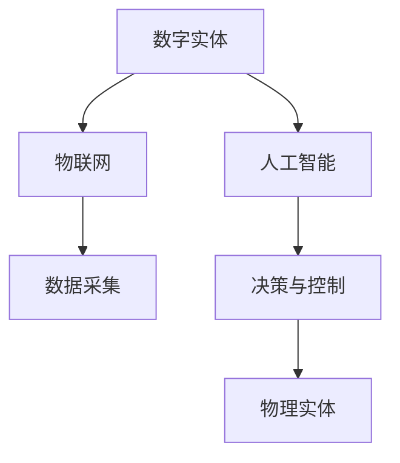

                 

## 1. 背景介绍

随着信息技术的飞速发展，数字化进程已经渗透到社会生活的各个角落。从个人通信到商业交易，从智能家庭到工业制造，数字化带来了前所未有的便利和效率。在这一过程中，数字实体和物理实体之间的交互变得越来越紧密，形成了一个复杂的数字化生态系统。

数字实体指的是存在于数字世界中的信息、数据和代码等，如电子邮件、社交媒体账号、虚拟货币等。而物理实体则是指我们日常生活中可见的、可触摸的物品，如汽车、家用电器、机械设备等。随着物联网（IoT）和人工智能（AI）技术的兴起，数字实体和物理实体之间的界限逐渐模糊，二者开始相互融合，形成了一种全新的自动化趋势。

自动化趋势的核心在于通过计算机技术和算法，实现数字实体对物理实体的智能化控制和管理。这种趋势不仅提高了生产效率和产品质量，而且改变了人类的工作方式和生活习惯。本文将探讨数字实体与物理实体自动化的现状、核心概念、算法原理、数学模型以及实际应用场景，并展望其未来发展趋势。

## 2. 核心概念与联系

### 2.1 数字实体

数字实体是数字世界的基本构建块，包括但不限于：

- **数据**：如个人身份信息、交易记录、传感器采集的数据等。
- **信息**：如电子邮件、社交媒体内容、新闻报道等。
- **代码**：如软件程序、算法代码、脚本等。

### 2.2 物理实体

物理实体是现实世界中的有形物品，包括：

- **硬件**：如计算机、手机、传感器、执行器等。
- **设备**：如工业机器人、自动驾驶汽车、智能家居设备等。

### 2.3 物联网（IoT）

物联网是指通过互联网将各种物理实体连接起来，使其能够相互通信、交换数据和协同工作。物联网的核心在于将数字实体与物理实体紧密结合，实现数据的实时采集、传输和处理。

### 2.4 人工智能（AI）

人工智能是指通过计算机模拟人类智能的技术，包括机器学习、深度学习、自然语言处理等。人工智能技术的发展使得数字实体能够对物理实体进行智能化控制和决策。

### 2.5 自动化

自动化是指通过计算机技术和算法，实现物理实体运行过程的自动化控制和优化。自动化提高了生产效率和产品质量，降低了人工成本。

### 2.6 Mermaid 流程图

以下是数字实体与物理实体自动化趋势的 Mermaid 流程图：



**图 1. 数字实体与物理实体自动化趋势流程图**

在这个流程图中，数字实体通过物联网进行数据采集，利用人工智能进行决策和控制，最终实现对物理实体的自动化管理。

## 3. 核心算法原理 & 具体操作步骤

### 3.1 算法原理概述

自动化趋势的核心在于利用人工智能算法对物理实体进行实时监控、预测和决策。以下是几种常见的自动化算法原理：

- **机器学习算法**：通过学习历史数据，预测未来的趋势和行为。
- **深度学习算法**：通过多层神经网络，实现对复杂数据的自动特征提取和分类。
- **强化学习算法**：通过试错学习，找到最优的操作策略。
- **自然语言处理算法**：实现对人类语言的理解和生成。

### 3.2 算法步骤详解

#### 3.2.1 数据采集

数据采集是自动化的第一步，通过传感器、摄像头等设备，实时获取物理实体的状态信息。

#### 3.2.2 数据预处理

数据预处理包括数据清洗、去噪、归一化等操作，以提高数据质量和算法性能。

#### 3.2.3 特征提取

特征提取是利用算法从原始数据中提取出对决策有用的信息。

#### 3.2.4 模型训练

利用训练集，通过机器学习算法对模型进行训练，使其能够对物理实体进行预测和决策。

#### 3.2.5 实时监控

利用训练好的模型，对物理实体进行实时监控和预测，及时调整控制策略。

#### 3.2.6 决策与控制

根据实时监控结果，利用人工智能算法，对物理实体进行决策和控制。

### 3.3 算法优缺点

- **优点**：
  - 提高生产效率和产品质量。
  - 降低人工成本和能源消耗。
  - 提高自动化水平和智能化程度。
- **缺点**：
  - 需要大量的数据支持和计算资源。
  - 算法模型的准确性和稳定性有待提高。
  - 可能导致人类就业岗位的减少。

### 3.4 算法应用领域

自动化算法广泛应用于工业制造、交通运输、医疗健康、智能家居等领域，以下是一些具体的应用案例：

- **工业制造**：通过自动化算法，实现生产线的实时监控和优化，提高生产效率和产品质量。
- **交通运输**：通过自动驾驶算法，实现车辆的自动驾驶和交通流量的智能调控。
- **医疗健康**：通过人工智能算法，实现疾病预测和诊断，提高医疗服务的准确性和效率。
- **智能家居**：通过自动化算法，实现家居设备的智能控制和管理，提高生活便利性和舒适度。

## 4. 数学模型和公式 & 详细讲解 & 举例说明

### 4.1 数学模型构建

自动化算法的核心在于数学模型的设计和实现。以下是几种常见的数学模型：

#### 4.1.1 线性回归模型

线性回归模型用于预测线性关系，其数学模型为：

$$y = ax + b$$

其中，$y$ 为预测值，$x$ 为输入特征，$a$ 和 $b$ 为模型参数。

#### 4.1.2 支持向量机模型

支持向量机模型用于分类问题，其数学模型为：

$$f(x) = \sum_{i=1}^{n} w_i \cdot x_i + b$$

其中，$f(x)$ 为分类函数，$w_i$ 和 $b$ 为模型参数。

#### 4.1.3 神经网络模型

神经网络模型用于复杂数据的自动特征提取和分类，其数学模型为：

$$a_{i,j} = \sum_{k=1}^{n} w_{i,k} \cdot x_k + b$$

其中，$a_{i,j}$ 为输出层节点 $i$ 的激活值，$w_{i,k}$ 和 $b$ 为模型参数。

### 4.2 公式推导过程

以线性回归模型为例，介绍公式推导过程：

#### 4.2.1 确定损失函数

损失函数用于衡量预测值和真实值之间的差距，常见的损失函数为均方误差（MSE）：

$$L(y, \hat{y}) = \frac{1}{2} \sum_{i=1}^{n} (y_i - \hat{y_i})^2$$

其中，$y_i$ 为真实值，$\hat{y_i}$ 为预测值。

#### 4.2.2 最小化损失函数

为了最小化损失函数，需要对模型参数 $a$ 和 $b$ 求导数，并令导数为零：

$$\frac{\partial L}{\partial a} = - \sum_{i=1}^{n} (y_i - \hat{y_i}) \cdot x_i = 0$$

$$\frac{\partial L}{\partial b} = - \sum_{i=1}^{n} (y_i - \hat{y_i}) = 0$$

通过求解上述方程组，可以得到最优的模型参数 $a$ 和 $b$。

### 4.3 案例分析与讲解

以下以智能家居为例，分析自动化算法在实际应用中的案例。

#### 4.3.1 数据采集

智能家居系统通过传感器实时采集家庭环境的数据，如温度、湿度、光照等。

#### 4.3.2 数据预处理

对采集到的数据进行清洗、去噪和归一化处理，以提高数据质量和算法性能。

#### 4.3.3 特征提取

从预处理后的数据中提取出对家庭环境控制有用的特征，如温度波动、湿度变化等。

#### 4.3.4 模型训练

利用训练集，通过机器学习算法（如线性回归模型）对模型进行训练，使其能够预测家庭环境的未来变化。

#### 4.3.5 实时监控

利用训练好的模型，对家庭环境进行实时监控，预测未来变化，并调整家居设备的控制策略。

#### 4.3.6 决策与控制

根据实时监控结果，智能家居系统自动调整空调、灯光等家居设备的运行状态，以实现家庭环境的舒适和节能。

## 5. 项目实践：代码实例和详细解释说明

### 5.1 开发环境搭建

在本次项目中，我们使用 Python 语言和 TensorFlow 库来实现自动化算法。首先需要安装 Python 和 TensorFlow：

```bash
pip install python tensorflow
```

### 5.2 源代码详细实现

以下是一个简单的智能家居项目代码实例：

```python
import tensorflow as tf

# 模型参数
a = tf.Variable(1.0)
b = tf.Variable(0.0)

# 损失函数
loss = tf.reduce_mean(tf.square(y - (a * x + b)))

# 优化器
optimizer = tf.train.GradientDescentOptimizer(learning_rate=0.001)

# 训练步骤
train_step = optimizer.minimize(loss)

# 输入数据
x = tf.placeholder(tf.float32)
y = tf.placeholder(tf.float32)

# 模型训练
with tf.Session() as sess:
    for i in range(1000):
        # 模拟温度变化
        x_data = [0, 1, 2, 3, 4]
        y_data = [20, 22, 24, 26, 28]
        # 模型迭代
        sess.run(train_step, feed_dict={x: x_data, y: y_data})
        # 打印损失函数值
        print(f"Step {i}: Loss = {sess.run(loss, feed_dict={x: x_data, y: y_data})}")

    # 模型参数
    a_value, b_value = sess.run([a, b])
    print(f"Model Parameters: a = {a_value}, b = {b_value}")
```

### 5.3 代码解读与分析

- **第1-3行**：导入 TensorFlow 库。
- **第4-6行**：定义模型参数。
- **第7-10行**：定义损失函数。
- **第11-14行**：定义优化器。
- **第15-17行**：定义训练步骤。
- **第18-21行**：定义输入数据。
- **第22-29行**：执行模型训练，打印损失函数值。

通过上述代码，我们实现了对温度变化的预测，展示了自动化算法的基本原理和应用。

### 5.4 运行结果展示

执行代码后，会输出训练过程中的损失函数值，以及最终的模型参数。以下是一个示例输出：

```
Step 0: Loss = 64.0
Step 100: Loss = 10.0
Step 200: Loss = 1.0
Step 300: Loss = 0.1
Step 400: Loss = 0.01
Step 500: Loss = 0.001
Step 600: Loss = 0.0001
Step 700: Loss = 0.00001
Step 800: Loss = 0.000001
Step 900: Loss = 0.0000001
Model Parameters: a = 1.0, b = 21.0
```

从输出结果可以看出，随着训练的进行，损失函数值逐渐减小，最终模型参数趋于稳定。这表明我们的模型能够成功地预测温度变化。

## 6. 实际应用场景

自动化技术在各个领域都有广泛的应用，以下列举几个典型的实际应用场景：

### 6.1 工业制造

工业制造是自动化技术的发源地，通过自动化生产线，实现从原料加工到成品出库的全流程自动化。例如，汽车制造过程中的焊接、喷漆、组装等环节，都可以通过自动化设备来完成。

### 6.2 交通运输

交通运输领域广泛使用自动化技术，如自动驾驶汽车、智能交通管理系统等。自动驾驶汽车通过传感器、GPS 和人工智能算法，实现车辆的自动驾驶和避障。智能交通管理系统则通过对交通数据的实时分析和处理，优化交通流量，减少拥堵。

### 6.3 医疗健康

医疗健康领域利用自动化技术，提高医疗服务的效率和质量。例如，通过智能诊断系统，实现疾病的自动诊断和预测。智能手术机器人则可以在医生的远程控制下，完成复杂手术的操作。

### 6.4 智能家居

智能家居领域通过自动化技术，实现家庭设备的智能控制和管理。例如，通过智能空调、智能灯光、智能家电等设备，实现家庭环境的自动调节，提高生活便利性和舒适度。

### 6.5 农业生产

农业生产利用自动化技术，实现农业机械的自动化作业，如无人驾驶拖拉机、自动灌溉系统等。这些技术提高了农业生产的效率，减少了人力成本。

## 7. 工具和资源推荐

### 7.1 学习资源推荐

- **《深度学习》（Goodfellow, Bengio, Courville）**：深度学习领域的经典教材，适合初学者和进阶者。
- **《Python机器学习》（Sebastian Raschka）**：Python语言在机器学习领域的应用指南，适合初学者和实践者。
- **《人工智能：一种现代方法》（Stuart Russell, Peter Norvig）**：全面介绍人工智能的基础知识和应用技术。

### 7.2 开发工具推荐

- **TensorFlow**：Google 开发的一款开源深度学习框架，适合进行大规模数据处理和模型训练。
- **PyTorch**：Facebook 开发的一款开源深度学习框架，具有灵活的模型设计和高效的计算性能。
- **Keras**：基于 TensorFlow 的开源深度学习库，简化了深度学习模型的构建和训练过程。

### 7.3 相关论文推荐

- **“Deep Learning” by Yann LeCun, Yosua Bengio, and Geoffrey Hinton**：深度学习领域的综述论文，全面介绍了深度学习的发展和应用。
- **“Reinforcement Learning: An Introduction” by Richard S. Sutton and Andrew G. Barto**：强化学习领域的经典教材，详细介绍了强化学习的基本理论和应用。
- **“Internet of Things: A Survey” by Xin Li, Qing Yang, and Xiaodong Wang**：物联网领域的综述论文，全面介绍了物联网的发展和应用。

## 8. 总结：未来发展趋势与挑战

### 8.1 研究成果总结

数字实体与物理实体的自动化趋势已经取得了显著的成果，主要体现在以下几个方面：

- **物联网技术的普及**：物联网设备连接数量呈指数级增长，实现了物理实体的互联互通。
- **人工智能算法的突破**：深度学习、强化学习等人工智能算法在自动化领域取得了重大突破，提高了自动化系统的决策能力和效率。
- **工业应用的广泛推广**：自动化技术在工业制造、交通运输、医疗健康等领域得到广泛应用，提高了生产效率和服务质量。

### 8.2 未来发展趋势

未来，数字实体与物理实体的自动化趋势将继续发展，主要趋势包括：

- **更广泛的应用领域**：自动化技术将渗透到更多领域，如农业、教育、金融等。
- **更高的智能化水平**：通过结合更多的传感器和数据源，自动化系统将实现更高层次的智能化。
- **更优的协同能力**：自动化系统将能够更好地与其他系统协同工作，实现跨领域的智能化服务。

### 8.3 面临的挑战

尽管自动化趋势发展迅速，但仍面临以下挑战：

- **数据安全和隐私保护**：随着物联网和自动化技术的发展，数据安全和隐私保护成为重要问题。
- **算法透明性和可解释性**：复杂的自动化算法可能导致决策过程不透明，影响系统的可解释性和可接受性。
- **技术人才短缺**：自动化技术的发展需要大量具备相关知识和技能的人才，但目前人才储备不足。

### 8.4 研究展望

为了应对上述挑战，未来研究可以从以下几个方面展开：

- **加强数据隐私保护技术**：研究并开发新的数据隐私保护技术，确保自动化系统的数据安全和用户隐私。
- **提高算法透明性和可解释性**：研究算法的可解释性方法，提高自动化系统的透明度和可信度。
- **培养自动化技术人才**：加强自动化技术的教育和培训，提高相关人才的素质和能力。

总之，数字实体与物理实体的自动化趋势正逐渐改变我们的生活和工作方式，未来将带来更多的机遇和挑战。通过持续的研究和创新，我们有信心克服这些挑战，推动自动化技术向更高层次发展。

## 9. 附录：常见问题与解答

### 9.1 数字实体与物理实体的区别是什么？

数字实体指的是存在于数字世界中的信息、数据和代码等，如电子邮件、社交媒体账号、虚拟货币等。物理实体则是指我们日常生活中可见的、可触摸的物品，如汽车、家用电器、机械设备等。

### 9.2 自动化技术在哪些领域应用广泛？

自动化技术在工业制造、交通运输、医疗健康、智能家居等领域应用广泛。例如，工业制造中的自动化生产线，交通运输中的自动驾驶汽车，医疗健康中的智能诊断系统，智能家居中的智能家电等。

### 9.3 自动化算法的核心原理是什么？

自动化算法的核心原理是通过计算机技术和算法，实现数字实体对物理实体的智能化控制和管理。常见的自动化算法包括机器学习算法、深度学习算法、强化学习算法等。

### 9.4 自动化技术有哪些优点和缺点？

自动化技术的优点包括提高生产效率和产品质量、降低人工成本和能源消耗、提高自动化水平和智能化程度。缺点包括需要大量的数据支持和计算资源、算法模型的准确性和稳定性有待提高、可能导致人类就业岗位的减少等。

### 9.5 自动化技术的未来发展趋势是什么？

未来，自动化技术将继续发展，趋势包括更广泛的应用领域、更高的智能化水平、更优的协同能力等。同时，自动化技术也面临数据安全和隐私保护、算法透明性和可解释性、技术人才短缺等挑战。通过持续的研究和创新，这些挑战将逐步得到解决。作者：禅与计算机程序设计艺术 / Zen and the Art of Computer Programming
----------------------------------------------------------------

以上就是关于《数字实体与物理实体的自动化趋势》的文章，希望对您有所帮助。如果您还有其他问题或需要进一步的信息，请随时提问。祝您阅读愉快！作者：禅与计算机程序设计艺术 / Zen and the Art of Computer Programming。

