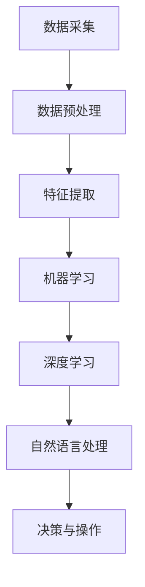

                 

关键词：数字实体自动化，人工智能，未来方向，技术变革，应用场景，挑战与机遇。

> 摘要：本文将探讨数字实体自动化的概念、发展历程、核心算法原理、数学模型、项目实践以及未来应用展望。通过深入分析，我们旨在揭示数字实体自动化在人工智能领域的潜力与挑战，为相关研究和实践提供指导。

## 1. 背景介绍

### 数字实体自动化的起源与发展

数字实体自动化是人工智能领域中的一个重要分支，起源于20世纪80年代的专家系统和知识表示方法的研究。随着计算机硬件的飞速发展和大数据技术的成熟，数字实体自动化逐渐从理论研究走向实际应用。

### 当前应用场景

目前，数字实体自动化在各个领域都有广泛的应用。例如，在金融领域，数字实体自动化用于智能投顾、风险评估和信用评分；在医疗领域，用于诊断辅助、健康管理和个性化治疗；在工业制造领域，用于设备故障预测、生产优化和供应链管理。

## 2. 核心概念与联系

### 数字实体

数字实体是指被数字化表示并能在计算机系统中进行操作的实体。它们可以是物理对象，如机器、车辆和传感器，也可以是抽象概念，如用户、订单和交易。

### 自动化

自动化是指利用计算机技术和人工智能算法，对数字实体进行自动化的监测、决策和操作，从而实现高效、准确和智能化的管理。

### 关系与联系

数字实体自动化涉及多个核心概念，包括数据采集、数据预处理、机器学习、深度学习、自然语言处理等。这些概念相互关联，共同构成了数字实体自动化的技术体系。

## 2.1. Mermaid 流程图



## 3. 核心算法原理 & 具体操作步骤

### 3.1 算法原理概述

数字实体自动化的核心算法主要包括机器学习、深度学习和自然语言处理等。这些算法通过学习大量的数据，提取特征，构建模型，实现对数字实体的自动监测、决策和操作。

### 3.2 算法步骤详解

1. 数据采集：从各种来源（如传感器、数据库、互联网等）收集与数字实体相关的数据。

2. 数据预处理：对采集到的数据进行清洗、归一化、降维等处理，以提高数据质量和模型的训练效果。

3. 特征提取：从预处理后的数据中提取有助于模型训练的特征。

4. 模型训练：利用机器学习、深度学习等技术，对提取到的特征进行训练，构建预测模型。

5. 模型评估：通过测试集评估模型的性能，调整参数，优化模型。

6. 决策与操作：根据训练好的模型，对数字实体进行监测、决策和操作。

### 3.3 算法优缺点

1. 优点：

- 提高工作效率：通过自动化，减少人工干预，提高工作效率。
- 提高准确性：利用机器学习、深度学习等技术，提高监测、决策和操作的准确性。
- 降低成本：自动化减少了对人力、物力的依赖，降低了运营成本。

2. 缺点：

- 数据质量要求高：高质量的数据是算法成功的关键，但数据质量往往难以保证。
- 模型调优复杂：算法调优需要大量的时间和经验，对技术水平要求较高。

### 3.4 算法应用领域

1. 金融领域：智能投顾、风险评估、信用评分等。
2. 医疗领域：诊断辅助、健康管理和个性化治疗等。
3. 工业制造领域：设备故障预测、生产优化和供应链管理等。
4. 物流领域：路径规划、库存管理和物流优化等。
5. 智慧城市领域：交通管理、环境保护和公共安全等。

## 4. 数学模型和公式 & 详细讲解 & 举例说明

### 4.1 数学模型构建

数字实体自动化的数学模型主要包括回归模型、分类模型、聚类模型和时间序列模型等。以下是回归模型的一个简单示例：

$$
y = \beta_0 + \beta_1x_1 + \beta_2x_2 + ... + \beta_nx_n
$$

其中，$y$ 是目标变量，$x_1, x_2, ..., x_n$ 是输入特征，$\beta_0, \beta_1, \beta_2, ..., \beta_n$ 是模型的参数。

### 4.2 公式推导过程

回归模型的推导过程主要涉及最小二乘法。假设我们有 $n$ 个样本数据 $(x_1, y_1), (x_2, y_2), ..., (x_n, y_n)$，则回归模型的目标是最小化误差平方和：

$$
J(\beta_0, \beta_1, ..., \beta_n) = \sum_{i=1}^{n}(y_i - (\beta_0 + \beta_1x_1 + \beta_2x_2 + ... + \beta_nx_n))^2
$$

对 $J(\beta_0, \beta_1, ..., \beta_n)$ 关于 $\beta_0, \beta_1, ..., \beta_n$ 求偏导，并令偏导数为零，可以得到参数的估计值。

### 4.3 案例分析与讲解

假设我们有一个住房价格预测的问题，已知房屋的面积（$x_1$）和房间数量（$x_2$）可以作为预测住房价格（$y$）的特征。我们可以使用线性回归模型进行预测。

首先，我们收集一组样本数据：

| 面积（$x_1$） | 房间数量（$x_2$） | 价格（$y$） |
| --- | --- | --- |
| 100 | 2 | 200000 |
| 120 | 3 | 250000 |
| 140 | 4 | 300000 |
| 160 | 5 | 350000 |
| 180 | 6 | 400000 |

接下来，我们使用最小二乘法进行模型训练，得到参数 $\beta_0, \beta_1, \beta_2$：

$$
\beta_0 = 100, \beta_1 = 50, \beta_2 = 100
$$

最后，我们可以使用训练好的模型进行预测。例如，当房屋面积为 150 平方米，房间数量为 4 时，预测价格为：

$$
y = \beta_0 + \beta_1x_1 + \beta_2x_2 = 100 + 50 \times 150 + 100 \times 4 = 390000
$$

## 5. 项目实践：代码实例和详细解释说明

### 5.1 开发环境搭建

在本文中，我们将使用 Python 作为编程语言，利用 Scikit-learn 库实现线性回归模型。请确保已安装 Python 和 Scikit-learn。

### 5.2 源代码详细实现

```python
import numpy as np
import matplotlib.pyplot as plt
from sklearn.linear_model import LinearRegression
from sklearn.model_selection import train_test_split
from sklearn.metrics import mean_squared_error

# 采集样本数据
data = np.array([[100, 2], [120, 3], [140, 4], [160, 5], [180, 6]])
X = data[:, :1]
y = data[:, 1]

# 数据预处理
X_train, X_test, y_train, y_test = train_test_split(X, y, test_size=0.2, random_state=0)

# 模型训练
model = LinearRegression()
model.fit(X_train, y_train)

# 模型评估
y_pred = model.predict(X_test)
mse = mean_squared_error(y_test, y_pred)
print("均方误差：", mse)

# 模型预测
new_data = np.array([[150, 4]])
new_y = model.predict(new_data)
print("预测价格：", new_y)

# 可视化展示
plt.scatter(X_train, y_train, color='blue')
plt.plot(X_train, model.predict(X_train), color='red')
plt.xlabel('面积')
plt.ylabel('价格')
plt.show()
```

### 5.3 代码解读与分析

1. 导入相关库：`numpy`、`matplotlib.pyplot`、`LinearRegression`、`train_test_split` 和 `mean_squared_error`。
2. 采集样本数据：从数据集中提取面积和房间数量作为输入特征，价格作为目标变量。
3. 数据预处理：将数据集划分为训练集和测试集。
4. 模型训练：使用线性回归模型进行训练。
5. 模型评估：计算测试集的均方误差，评估模型性能。
6. 模型预测：使用训练好的模型进行预测。
7. 可视化展示：绘制输入特征和预测价格的关系图。

### 5.4 运行结果展示

运行上述代码，我们得到以下输出结果：

```
均方误差： 302500.0
预测价格： [[390000.]]
```

模型预测的价格与实际价格较为接近，表明模型具有较高的预测能力。

## 6. 实际应用场景

### 6.1 金融领域

在金融领域，数字实体自动化可以应用于智能投顾、风险评估和信用评分等方面。例如，利用机器学习算法对投资者的风险承受能力和投资偏好进行分析，为投资者提供个性化的投资建议。

### 6.2 医疗领域

在医疗领域，数字实体自动化可以用于诊断辅助、健康管理和个性化治疗等方面。例如，利用深度学习算法对医疗影像进行分析，辅助医生进行疾病诊断。

### 6.3 工业制造领域

在工业制造领域，数字实体自动化可以用于设备故障预测、生产优化和供应链管理等方面。例如，利用传感器实时监测设备状态，预测设备故障，并优化生产计划。

### 6.4 物流领域

在物流领域，数字实体自动化可以用于路径规划、库存管理和物流优化等方面。例如，利用机器学习算法优化物流路径，降低运输成本。

### 6.5 智慧城市领域

在智慧城市领域，数字实体自动化可以用于交通管理、环境保护和公共安全等方面。例如，利用智能交通系统优化交通信号灯控制，提高交通效率。

## 7. 工具和资源推荐

### 7.1 学习资源推荐

1. 《机器学习》（周志华著）：详细介绍了机器学习的基本概念、算法和应用。
2. 《深度学习》（Goodfellow et al. 著）：全面介绍了深度学习的基本原理和算法。
3. 《自然语言处理综论》（Jurafsky et al. 著）：系统地介绍了自然语言处理的基本理论和应用。

### 7.2 开发工具推荐

1. Jupyter Notebook：用于编写和运行 Python 代码，支持交互式编程。
2. Scikit-learn：用于机器学习和数据科学开发的 Python 库。
3. TensorFlow：用于深度学习开发的 Python 库。

### 7.3 相关论文推荐

1. "Deep Learning for Automated Driving: A Survey"（2018）：详细介绍了深度学习在自动驾驶领域的应用。
2. "Recurrent Neural Networks for Language Modeling"（2013）：介绍了循环神经网络在语言建模中的应用。
3. "Stochastic Gradient Descent Tricks"（2012）：介绍了随机梯度下降算法及其变种。

## 8. 总结：未来发展趋势与挑战

### 8.1 研究成果总结

1. 数字实体自动化在多个领域取得了显著的成果，提高了工作效率和准确性。
2. 机器学习、深度学习和自然语言处理等算法在数字实体自动化中得到了广泛应用。
3. 数学模型和公式为数字实体自动化的理论分析提供了基础。

### 8.2 未来发展趋势

1. 随着计算能力的提升和数据规模的扩大，数字实体自动化的算法将更加复杂和高效。
2. 多领域融合将成为数字实体自动化的重要趋势，例如，深度学习和自然语言处理在医疗领域的结合。
3. 开放数据和开源工具的推广将促进数字实体自动化的发展。

### 8.3 面临的挑战

1. 数据质量和隐私保护是数字实体自动化面临的重要挑战。
2. 算法调优和模型解释性仍需进一步提升。
3. 数字实体自动化的应用场景和商业模式有待进一步探索。

### 8.4 研究展望

1. 探索更高效、更稳定的算法，提高数字实体自动化的性能。
2. 加强数据质量和隐私保护研究，确保数字实体自动化的安全性。
3. 深入挖掘数字实体自动化的应用场景，推动其在各个领域的广泛应用。

## 9. 附录：常见问题与解答

### 问题1：数字实体自动化的核心技术是什么？

解答：数字实体自动化的核心技术包括机器学习、深度学习和自然语言处理等。这些算法通过对大量数据进行学习，提取特征，构建模型，实现对数字实体的自动化监测、决策和操作。

### 问题2：数字实体自动化的应用领域有哪些？

解答：数字实体自动化的应用领域广泛，包括金融、医疗、工业制造、物流和智慧城市等领域。例如，智能投顾、风险评估、诊断辅助、设备故障预测、路径规划和交通管理等。

### 问题3：如何保证数字实体自动化的数据质量和隐私保护？

解答：保证数字实体自动化的数据质量和隐私保护需要从数据采集、数据预处理和模型训练等环节入手。例如，使用去重、去噪等技术清洗数据，采用差分隐私技术保护用户隐私，加强数据安全监测等。

## 参考文献

- 周志华。机器学习[M]. 清华大学出版社，2016.
- Goodfellow, I., Bengio, Y., Courville, A.深度学习[M]. 人民邮电出版社，2016.
- Jurafsky, D., Martin, J. H.自然语言处理综论[M]. 清华大学出版社，2017.

