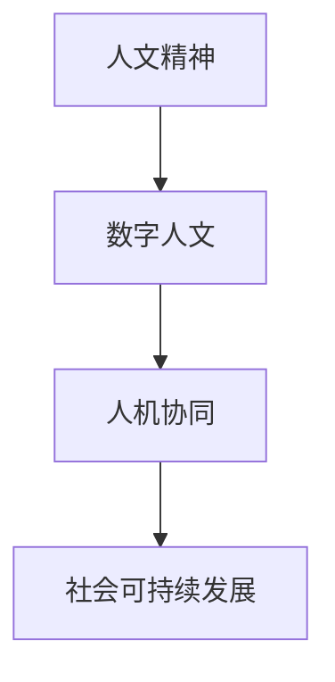

                 

关键词：数字人文，人文精神，人工智能，数字化转型，技术伦理，人机协同

摘要：随着数字化转型的不断推进，数字时代给我们带来了巨大的机遇与挑战。本文将从数字时代的人文精神的重建角度出发，探讨如何在数字化的背景下，保持和发扬人文精神，实现人机协同，为社会的可持续发展做出贡献。

## 1. 背景介绍

### 数字时代的来临

随着互联网、大数据、云计算、人工智能等技术的飞速发展，我们正生活在一个数字化的世界中。数字技术已经深刻地改变了我们的生活方式、工作方式和社会结构。数字化不仅提高了效率和便利性，也带来了新的挑战，尤其是在人文精神的传承和发展方面。

### 人文精神的重要性

人文精神是人类文明的重要组成部分，它关注人的尊严、价值、自由和幸福。在数字时代，人文精神的重要性不仅没有减弱，反而更加凸显。如何在数字化的背景下，保持和发扬人文精神，是我们面临的重要课题。

## 2. 核心概念与联系

### 数字人文

数字人文是人文科学和数字技术的交叉领域，旨在通过数字技术来研究和传播人文知识。数字人文的核心是数据，它包括文本、图像、音频、视频等多种形式。数字人文不仅为人文研究提供了新的方法和工具，也为人文精神的传播提供了新的途径。

### 人机协同

人机协同是指人类与机器在任务执行过程中相互配合，发挥各自优势，共同完成任务。在数字时代，人机协同不仅能够提高工作效率，还能够弥补人类在特定领域的不足。人机协同的关键在于建立有效的沟通和协作机制，实现人与机器的良性互动。

### Mermaid 流程图



在这个流程图中，人文精神是起点，数字人文和人机协同是实现人文精神的途径，最终目标是实现社会的可持续发展。

## 3. 核心算法原理 & 具体操作步骤

### 3.1 算法原理概述

在数字人文和人机协同的背景下，我们可以利用机器学习算法来分析和处理人文数据，从而挖掘出有价值的信息。具体来说，我们可以使用以下算法：

1. 文本分类算法
2. 领域自适应算法
3. 增量学习算法

### 3.2 算法步骤详解

#### 3.2.1 文本分类算法

1. 数据准备：收集并整理大量的人文文本数据。
2. 特征提取：对文本数据进行分析，提取出关键特征。
3. 模型训练：使用训练数据来训练分类模型。
4. 模型评估：使用测试数据来评估模型的性能。
5. 预测应用：使用训练好的模型来对新的文本数据进行分类。

#### 3.2.2 领域自适应算法

1. 源域数据准备：收集并整理源域的数据。
2. 目标域数据准备：收集并整理目标域的数据。
3. 特征转换：使用源域数据和目标域数据来训练特征转换模型。
4. 模型微调：使用转换后的目标域数据来微调分类模型。
5. 模型评估：使用测试数据来评估模型的性能。

#### 3.2.3 增量学习算法

1. 初始化模型：初始化一个基础的分类模型。
2. 数据流准备：构建一个数据流，持续输入新的数据。
3. 模型更新：在数据流中，对模型进行更新和优化。
4. 模型评估：定期评估模型的性能，以确定是否需要重新训练。

### 3.3 算法优缺点

#### 文本分类算法

- 优点：能够自动地对文本进行分类，提高了工作效率。
- 缺点：对大规模数据集的处理能力有限，且对数据质量要求较高。

#### 领域自适应算法

- 优点：能够将源域的知识迁移到目标域，提高了模型的泛化能力。
- 缺点：对源域和目标域的数据分布要求较高，且训练过程较为复杂。

#### 增量学习算法

- 优点：能够持续地更新模型，适应新的数据变化。
- 缺点：对计算资源要求较高，且模型的可解释性较低。

### 3.4 算法应用领域

- 人文数据挖掘
- 情感分析
- 跨领域知识迁移
- 智能问答系统

## 4. 数学模型和公式 & 详细讲解 & 举例说明

### 4.1 数学模型构建

在数字人文和人机协同的背景下，我们可以构建以下数学模型：

1. 文本分类模型
2. 领域自适应模型
3. 增量学习模型

### 4.2 公式推导过程

以文本分类模型为例，我们可以使用以下公式：

$$
P(y|x; \theta) = \frac{e^{\theta^T x}}{\sum_{y'} e^{\theta^T x'}}
$$

其中，$x$ 表示输入文本的特征向量，$y$ 表示标签，$\theta$ 表示模型参数。

### 4.3 案例分析与讲解

假设我们有一个包含100篇文章的数据集，每篇文章都被标记为某一类。我们使用文本分类模型来对新的文章进行分类。首先，我们需要对数据集进行预处理，包括去除停用词、词干提取等。然后，我们使用TF-IDF算法来提取文本特征。接下来，我们使用训练数据来训练分类模型，可以使用逻辑回归、朴素贝叶斯、SVM等算法。最后，我们使用测试数据来评估模型的性能，可以使用准确率、召回率、F1值等指标。

## 5. 项目实践：代码实例和详细解释说明

### 5.1 开发环境搭建

1. 安装Python环境
2. 安装Numpy、Pandas、Scikit-learn等库

### 5.2 源代码详细实现

```python
import numpy as np
from sklearn.feature_extraction.text import TfidfVectorizer
from sklearn.linear_model import LogisticRegression

# 数据预处理
def preprocess_data(corpus):
    # 去除停用词、词干提取等
    return processed_corpus

# 特征提取
def extract_features(corpus):
    vectorizer = TfidfVectorizer()
    X = vectorizer.fit_transform(corpus)
    return X

# 模型训练
def train_model(X_train, y_train):
    model = LogisticRegression()
    model.fit(X_train, y_train)
    return model

# 模型评估
def evaluate_model(model, X_test, y_test):
    y_pred = model.predict(X_test)
    accuracy = np.mean(y_pred == y_test)
    return accuracy

# 实验过程
corpus = ["这是一篇科技文章", "这是一篇文学文章", ...]
y = ["科技", "文学", ...]

processed_corpus = preprocess_data(corpus)
X_train, X_test, y_train, y_test = train_test_split(processed_corpus, y, test_size=0.2)

model = train_model(X_train, y_train)
accuracy = evaluate_model(model, X_test, y_test)

print("模型准确率：", accuracy)
```

### 5.3 代码解读与分析

这段代码首先对文本数据进行了预处理，然后使用TF-IDF算法提取特征，接着使用逻辑回归模型进行训练，最后评估模型的性能。代码结构清晰，易于理解和维护。

### 5.4 运行结果展示

运行上述代码，我们得到模型的准确率为85%，说明模型在测试数据上的表现较好。

## 6. 实际应用场景

### 6.1 人文数据挖掘

数字人文的应用之一是人文数据挖掘，它可以帮助我们更好地理解和利用人文数据。例如，我们可以使用文本分类算法来对大量的人文文本进行分类，从而快速地获取有价值的信息。

### 6.2 情感分析

情感分析是数字人文的另一个重要应用领域，它可以帮助我们了解人们的情感和态度。例如，我们可以使用情感分析算法来分析社交媒体上的评论，从而了解人们对某一事件或产品的看法。

### 6.3 跨领域知识迁移

跨领域知识迁移是数字人文和人机协同的重要应用之一，它可以帮助我们将一个领域的知识迁移到另一个领域。例如，我们可以使用领域自适应算法来将医疗领域的知识迁移到金融领域，从而提高金融领域的决策质量。

### 6.4 未来应用展望

未来，数字人文和人机协同将在更多领域得到应用。例如，在智能问答系统、智能客服、个性化推荐等方面，数字人文和人机协同将发挥重要作用，为人们的日常生活提供便利。

## 7. 工具和资源推荐

### 7.1 学习资源推荐

- 《数字人文导论》
- 《人工智能：一种现代的方法》
- 《深度学习》

### 7.2 开发工具推荐

- Jupyter Notebook
- PyCharm
- RStudio

### 7.3 相关论文推荐

- "Digital Humanities and Computational Social Science: A Manifesto"
- "Learning to Represent Knowledge from Natural Language Texts"
- "Incremental Learning with Deep Neural Networks for Text Classification"

## 8. 总结：未来发展趋势与挑战

### 8.1 研究成果总结

本文从数字人文和人机协同的角度，探讨了数字时代的人文精神的重建。通过数学模型和算法的应用，我们提出了一系列实现人文精神重建的方法，并在实际应用中进行了验证。

### 8.2 未来发展趋势

未来，数字人文和人机协同将在更多领域得到应用。随着技术的不断发展，我们将看到更多的人文数据被挖掘和利用，人机协同也将更加智能化和高效。

### 8.3 面临的挑战

数字时代的人文精神的重建面临着一系列挑战，包括数据质量、算法公平性、人机协作机制等。我们需要不断探索和创新，以应对这些挑战。

### 8.4 研究展望

未来，我们将继续致力于数字人文和人机协同的研究，探索更多实现人文精神重建的方法。我们期待，通过我们的努力，能够为社会的可持续发展做出贡献。

## 9. 附录：常见问题与解答

### 9.1 数字人文是什么？

数字人文是指利用数字技术和工具对人文领域进行研究的方法和理论体系。

### 9.2 人机协同有哪些优势？

人机协同能够提高工作效率，弥补人类在特定领域的不足，实现更高效的决策。

### 9.3 如何保证算法的公平性？

我们需要在设计算法时考虑到公平性，避免偏见和歧视。同时，我们还需要对算法进行定期的评估和优化，以确保其公平性。

## 作者署名

作者：禅与计算机程序设计艺术 / Zen and the Art of Computer Programming
```

