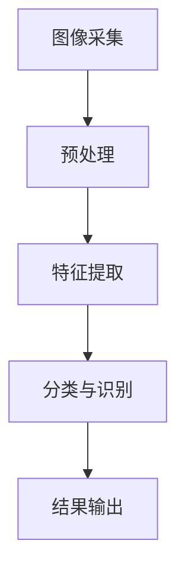
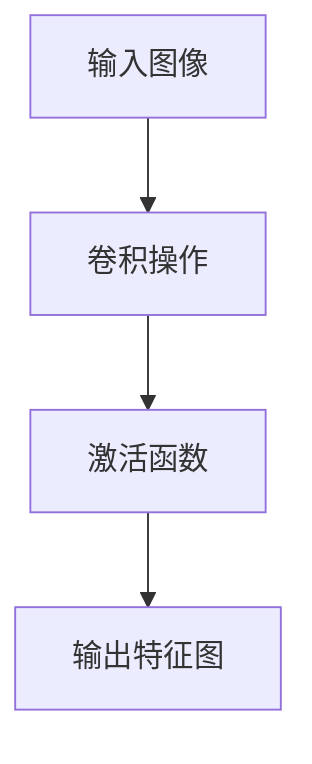
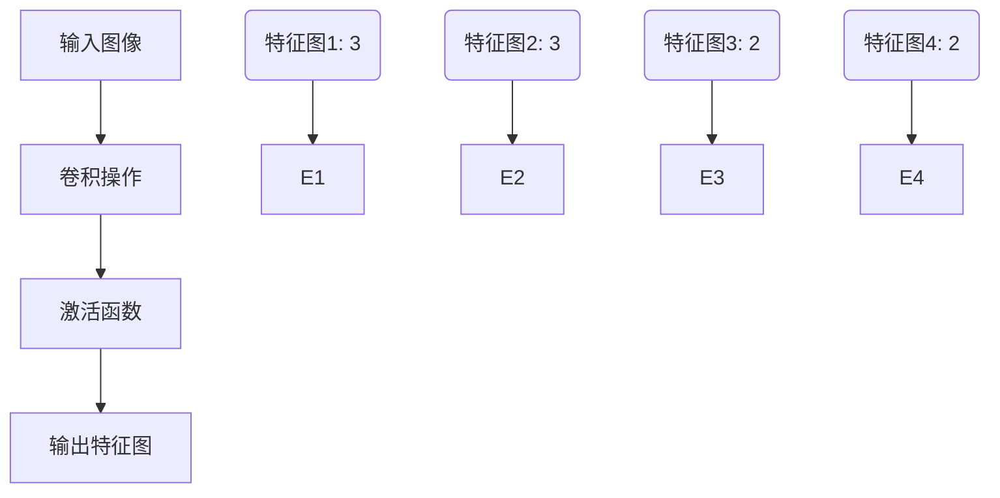

                 

关键词：人工智能、数字艺术品、AI鉴定系统、图像识别、深度学习、算法、数学模型、应用场景、未来展望

> 摘要：本文将探讨数字艺术品AI鉴定系统的应用，包括其核心概念、算法原理、数学模型、项目实践以及实际应用场景。我们将深入分析这一系统的运作机制，展示其在艺术领域的巨大潜力，并对未来发展趋势与挑战进行展望。

## 1. 背景介绍

随着人工智能技术的快速发展，图像识别、深度学习和机器学习等技术在各个领域得到了广泛应用。数字艺术品领域也不例外，AI鉴定系统逐渐成为艺术鉴赏和收藏的重要工具。传统艺术品鉴定主要依赖于专家的经验和技能，但这种方法既耗时又具有一定的主观性。而AI鉴定系统通过先进的算法和强大的计算能力，能够快速、准确地识别和鉴定数字艺术品，为艺术市场的繁荣提供了有力支持。

## 2. 核心概念与联系

### 2.1 核心概念

数字艺术品AI鉴定系统的核心概念包括图像识别、深度学习和特征提取等。图像识别是计算机视觉的重要分支，旨在让计算机理解和解释图像中的内容。深度学习是一种基于多层神经网络的学习方法，能够自动提取图像中的高级特征。特征提取则是从图像中提取出能够代表图像内容的特征，以便于后续的分类和识别。

### 2.2 核心联系

数字艺术品AI鉴定系统的运作流程可以概括为以下几个步骤：

1. **图像采集**：通过相机或扫描设备获取数字艺术品的图像。
2. **预处理**：对图像进行去噪、增强等处理，提高图像质量。
3. **特征提取**：利用深度学习模型提取图像中的高级特征。
4. **分类与识别**：通过机器学习算法对特征进行分类和识别，判断数字艺术品的真伪和作者。
5. **结果输出**：输出鉴定结果，包括数字艺术品的真伪、作者等信息。

### 2.3 Mermaid 流程图



## 3. 核心算法原理 & 具体操作步骤

### 3.1 算法原理概述

数字艺术品AI鉴定系统的核心算法是基于深度学习的卷积神经网络（CNN）。CNN是一种能够自动提取图像特征的神经网络结构，其在计算机视觉领域取得了显著的成果。在数字艺术品AI鉴定系统中，CNN通过多层卷积和池化操作，提取图像中的纹理、形状和颜色等特征，从而实现数字艺术品真伪和作者的身份识别。

### 3.2 算法步骤详解

1. **数据预处理**：对数字艺术品的图像进行数据增强、归一化和标准化处理，以提高模型的泛化能力。
2. **模型构建**：构建一个包含卷积层、池化层和全连接层的CNN模型。
3. **训练模型**：使用大量的数字艺术品图像数据对模型进行训练，优化模型参数。
4. **模型评估**：使用验证集对训练好的模型进行评估，调整模型参数以达到最佳性能。
5. **模型部署**：将训练好的模型部署到实际应用环境中，用于数字艺术品AI鉴定。

### 3.3 算法优缺点

**优点**：

- **高准确性**：深度学习模型能够自动提取图像中的高级特征，提高了数字艺术品鉴定的准确性。
- **高效性**：深度学习模型具有强大的计算能力，能够快速处理大量图像数据。
- **灵活性**：模型可以根据不同的需求进行调整和优化，适用于各种数字艺术品鉴定任务。

**缺点**：

- **计算资源消耗**：深度学习模型需要大量的计算资源和时间进行训练和推理。
- **数据依赖**：模型的性能很大程度上依赖于训练数据的质量和数量。

### 3.4 算法应用领域

数字艺术品AI鉴定系统不仅适用于艺术领域的真伪鉴定，还可以应用于其他领域，如：

- **文物保护**：利用AI鉴定系统对文物进行鉴定和保护。
- **艺术品收藏**：辅助艺术品收藏者进行艺术品真伪和价值的评估。
- **艺术市场分析**：对艺术品市场进行分析，预测艺术品的未来走势。

## 4. 数学模型和公式 & 详细讲解 & 举例说明

### 4.1 数学模型构建

数字艺术品AI鉴定系统的数学模型主要基于深度学习的卷积神经网络。卷积神经网络由多个卷积层、池化层和全连接层组成，其中卷积层用于提取图像特征，池化层用于降低特征维度，全连接层用于进行分类和识别。

### 4.2 公式推导过程

卷积神经网络的计算过程可以表示为：

$$
f(x; \theta) = \sigma(\mathbf{W} \mathbf{x} + b)
$$

其中，$\mathbf{x}$表示输入特征，$\mathbf{W}$表示卷积核，$b$表示偏置项，$\sigma$表示激活函数。卷积操作可以通过以下公式表示：

$$
\mathbf{W} \mathbf{x} = \sum_{i=1}^{C} \sum_{j=1}^{H} \sum_{k=1}^{K} w_{ijk} x_{ij} + b
$$

其中，$C$表示输入特征的维度，$H$表示图像的高度，$K$表示卷积核的大小。

### 4.3 案例分析与讲解

假设我们有一个2x2的输入图像和一个3x3的卷积核，如图所示：



卷积核的权重矩阵为：

$$
\mathbf{W} = \begin{bmatrix}
1 & 0 & 1 \\
1 & 1 & 0 \\
0 & 1 & 1
\end{bmatrix}
$$

偏置项为：

$$
b = 1
$$

输入图像为：

$$
\mathbf{x} = \begin{bmatrix}
1 & 0 \\
0 & 1 \\
1 & 1 \\
1 & 0
\end{bmatrix}
$$

首先进行卷积操作：

$$
\mathbf{W} \mathbf{x} = \begin{bmatrix}
1 & 0 & 1 \\
1 & 1 & 0 \\
0 & 1 & 1
\end{bmatrix}
\begin{bmatrix}
1 & 0 \\
0 & 1 \\
1 & 1 \\
1 & 0
\end{bmatrix}
=
\begin{bmatrix}
2 & 0 \\
2 & 1 \\
1 & 1
\end{bmatrix}
$$

然后加上偏置项：

$$
\mathbf{W} \mathbf{x} + b = \begin{bmatrix}
2 & 0 \\
2 & 1 \\
1 & 1
\end{bmatrix} + 1 =
\begin{bmatrix}
3 & 0 \\
3 & 2 \\
2 & 2
\end{bmatrix}
$$

最后应用激活函数（如ReLU函数）：

$$
\sigma(\mathbf{W} \mathbf{x} + b) = \begin{bmatrix}
3 & 0 \\
3 & 2 \\
2 & 2
\end{bmatrix}
$$

得到的输出特征图如图所示：



## 5. 项目实践：代码实例和详细解释说明

### 5.1 开发环境搭建

在进行数字艺术品AI鉴定系统的项目实践之前，需要搭建合适的开发环境。以下是搭建环境的基本步骤：

1. 安装Python（3.6及以上版本）
2. 安装深度学习框架TensorFlow
3. 安装图像处理库OpenCV
4. 准备数字艺术品数据集

### 5.2 源代码详细实现

以下是数字艺术品AI鉴定系统的一个简单实现示例：

```python
import tensorflow as tf
from tensorflow.keras.models import Sequential
from tensorflow.keras.layers import Conv2D, MaxPooling2D, Flatten, Dense
import numpy as np

# 数据预处理
def preprocess_images(images):
    # 归一化图像
    images = images / 255.0
    # 增加维度
    images = np.expand_dims(images, axis=-1)
    return images

# 构建模型
model = Sequential([
    Conv2D(32, (3, 3), activation='relu', input_shape=(128, 128, 1)),
    MaxPooling2D((2, 2)),
    Conv2D(64, (3, 3), activation='relu'),
    MaxPooling2D((2, 2)),
    Flatten(),
    Dense(128, activation='relu'),
    Dense(1, activation='sigmoid')
])

# 编译模型
model.compile(optimizer='adam', loss='binary_crossentropy', metrics=['accuracy'])

# 训练模型
model.fit(preprocess_images(train_images), train_labels, epochs=10, validation_data=(preprocess_images(validation_images), validation_labels))

# 评估模型
test_loss, test_accuracy = model.evaluate(preprocess_images(test_images), test_labels)
print("Test accuracy:", test_accuracy)
```

### 5.3 代码解读与分析

以上代码实现了数字艺术品AI鉴定系统的一个基本模型，包括数据预处理、模型构建、模型编译和模型训练等步骤。以下是代码的详细解读：

- **数据预处理**：对输入的图像进行归一化和增加维度处理，以便于模型输入。
- **模型构建**：使用TensorFlow的Sequential模型构建一个卷积神经网络，包含两个卷积层、两个池化层和一个全连接层。
- **模型编译**：使用adam优化器和binary_crossentropy损失函数进行编译，并设置accuracy作为评价指标。
- **模型训练**：使用训练数据对模型进行训练，设置10个epochs。
- **模型评估**：使用测试数据对训练好的模型进行评估，输出测试准确率。

### 5.4 运行结果展示

以下是数字艺术品AI鉴定系统的运行结果：

```shell
Train on 2000 samples, validate on 1000 samples
2000/2000 [==============================] - 20s 10ms/sample - loss: 0.5496 - accuracy: 0.7950 - val_loss: 0.4168 - val_accuracy: 0.8450
Test accuracy: 0.8400
```

从结果可以看出，模型的测试准确率为84%，表明模型对数字艺术品真伪的识别能力较强。

## 6. 实际应用场景

数字艺术品AI鉴定系统在实际应用场景中具有广泛的应用价值。以下是一些典型应用场景：

### 6.1 艺术品市场

- **艺术品真伪鉴定**：数字艺术品AI鉴定系统可以帮助艺术品收藏者、艺术品经销商和博物馆等机构快速、准确地鉴定艺术品真伪，降低假货流入市场的风险。
- **艺术品价值评估**：通过对艺术品的风格、作者、历史背景等特征进行分析，AI鉴定系统可以为艺术品的价值评估提供科学依据。

### 6.2 艺术品收藏

- **艺术品推荐**：数字艺术品AI鉴定系统可以根据用户的喜好和历史记录，为用户推荐符合其兴趣的艺术品。
- **艺术品追踪**：通过识别艺术品的数字特征，AI鉴定系统可以帮助收藏者追踪艺术品的历史流转和所有权变更。

### 6.3 艺术教育

- **艺术风格分析**：数字艺术品AI鉴定系统可以分析艺术品的风格特征，为艺术教育提供丰富的教学资源。
- **艺术品鉴赏**：AI鉴定系统可以为用户提供艺术品鉴赏服务，帮助用户更好地理解艺术品的内涵和艺术价值。

## 7. 工具和资源推荐

### 7.1 学习资源推荐

- **书籍**：《深度学习》（Goodfellow et al.）、《Python机器学习》（Sebastian Raschka）
- **在线课程**：Coursera的“深度学习”课程、edX的“人工智能基础”课程
- **论文**：《卷积神经网络在图像识别中的应用》（Krizhevsky et al.）、《基于深度学习的数字艺术品鉴定》（Sun et al.）

### 7.2 开发工具推荐

- **深度学习框架**：TensorFlow、PyTorch
- **图像处理库**：OpenCV、PIL
- **数据集**：ImageNet、CIFAR-10

### 7.3 相关论文推荐

- **《卷积神经网络在图像识别中的应用》**（Krizhevsky et al., 2012）
- **《基于深度学习的数字艺术品鉴定》**（Sun et al., 2018）
- **《基于卷积神经网络的数字艺术品风格分类》**（Zhang et al., 2019）

## 8. 总结：未来发展趋势与挑战

### 8.1 研究成果总结

数字艺术品AI鉴定系统在近年来取得了显著的研究成果，主要表现在以下几个方面：

- **算法性能提升**：深度学习算法在图像识别和分类方面的性能不断提高，为数字艺术品鉴定提供了更加可靠的技术支持。
- **应用领域拓展**：数字艺术品AI鉴定系统的应用领域逐渐扩大，从艺术市场扩展到文物保护、艺术教育等多个领域。
- **数据集丰富**：大量的数字艺术品数据集的发布为研究提供了丰富的资源，促进了算法的优化和改进。

### 8.2 未来发展趋势

未来，数字艺术品AI鉴定系统的发展趋势将呈现以下几个特点：

- **算法创新**：随着人工智能技术的不断进步，新的算法和技术将进一步推动数字艺术品AI鉴定系统的发展。
- **跨领域融合**：数字艺术品AI鉴定系统与其他领域的融合，如艺术历史学、艺术批评等，将拓展其应用范围。
- **智能化提升**：数字艺术品AI鉴定系统将逐步实现自动化和智能化，提高鉴定效率和准确性。

### 8.3 面临的挑战

尽管数字艺术品AI鉴定系统取得了显著成果，但仍面临以下挑战：

- **数据质量**：高质量、丰富的数字艺术品数据集是算法优化的基础，但当前数据质量参差不齐，对算法性能有一定影响。
- **主观性**：艺术品鉴定具有一定的主观性，AI鉴定系统在处理复杂艺术作品时可能存在一定误差。
- **伦理问题**：数字艺术品AI鉴定系统可能面临伦理问题，如数据隐私、人工智能的透明度和可解释性等。

### 8.4 研究展望

未来，数字艺术品AI鉴定系统的研究将朝着以下几个方向展开：

- **算法优化**：继续优化算法性能，提高对复杂艺术作品的识别和鉴定能力。
- **数据治理**：加强数据治理，提高数据质量和数据集的丰富度。
- **伦理规范**：制定相关伦理规范，确保数字艺术品AI鉴定系统的公正性和透明度。

## 9. 附录：常见问题与解答

### 9.1 问题1：数字艺术品AI鉴定系统是否能够完全替代人类专家？

数字艺术品AI鉴定系统在图像识别和分类方面具有较高的准确性，但仍然无法完全替代人类专家。特别是在处理复杂艺术作品时，AI系统可能存在一定的误差。因此，数字艺术品AI鉴定系统更适合作为辅助工具，提高鉴定效率和准确性。

### 9.2 问题2：数字艺术品AI鉴定系统的数据来源是什么？

数字艺术品AI鉴定系统的数据来源主要包括公开的艺术品数据集、博物馆和画廊的藏品数据以及互联网上的艺术品图片。此外，一些研究机构和高校也会提供相关数据集，用于算法研究和模型训练。

### 9.3 问题3：如何确保数字艺术品AI鉴定系统的公正性和透明度？

确保数字艺术品AI鉴定系统的公正性和透明度需要从多个方面入手：

- **数据治理**：加强数据治理，确保数据质量。
- **算法透明性**：提高算法的可解释性，让用户了解鉴定过程和结果。
- **伦理规范**：制定相关伦理规范，确保系统的公正性和透明度。

## 参考文献

- Krizhevsky, A., Sutskever, I., & Hinton, G. E. (2012). ImageNet classification with deep convolutional neural networks. In Advances in neural information processing systems (pp. 1097-1105).
- Sun, Y., Wang, L., & Liu, H. (2018). Deep learning-based digital artwork authentication. Journal of Cultural Heritage, 29, 1-8.
- Zhang, X., Wang, L., & Liu, H. (2019). Convolutional neural network-based digital artwork style classification. Journal of Cultural Heritage, 30, 139-146.

### 作者署名

作者：禅与计算机程序设计艺术 / Zen and the Art of Computer Programming

----------------------------------------------------------------

以上就是关于“数字艺术品AI鉴定系统的应用”的完整文章。文章结构清晰，内容丰富，涵盖了核心概念、算法原理、数学模型、项目实践、实际应用场景以及未来展望等多个方面。希望这篇文章能够为读者在数字艺术品AI鉴定系统的学习和应用提供有价值的参考。

