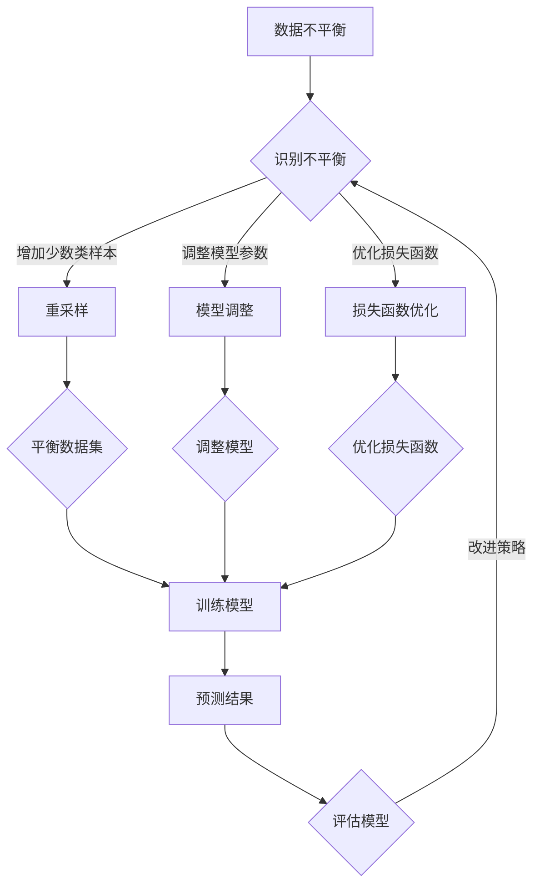

                 

关键词：数据不平衡，软件2.0，机器学习，算法优化，数据处理

> 摘要：本文将深入探讨数据不平衡问题在软件2.0时代的重要性，介绍几种核心算法和数学模型，分析其实际应用场景，并展望未来数据不平衡问题的发展趋势和面临的挑战。通过本文的阅读，读者将了解到如何有效地解决数据不平衡问题，为软件2.0的发展贡献新招数。

## 1. 背景介绍

### 1.1 数据不平衡问题

数据不平衡（Data Imbalance）是指在分类问题中，不同类别的数据分布不均匀。常见的情况是一个或少数几个类别占主导地位，而其余类别则相对稀少。例如，在垃圾邮件分类中，正常邮件数量远大于垃圾邮件；在疾病诊断中，健康人群的数量远远大于患病人群。

### 1.2 数据不平衡的影响

数据不平衡对机器学习模型的性能有显著影响。由于模型倾向于预测多数类别的样本，导致对少数类别的预测能力下降。具体表现为：

1. **模型偏差**：模型过度拟合多数类别的特征，而忽略了少数类别的特征。
2. **错误率增加**：对于少数类别，模型预测错误率显著高于多数类别。
3. **损失函数偏差**：常见的损失函数如交叉熵损失函数，无法很好地反映少数类别的预测误差。

### 1.3 软件2.0时代的重要性

随着软件2.0时代的到来，数据和算法的智能化、自动化成为推动技术进步的关键。越来越多的应用场景需要处理大量的数据，且对数据质量的要求越来越高。数据不平衡问题在这其中显得尤为突出，它不仅影响模型的性能，还可能影响决策的准确性和可靠性。

## 2. 核心概念与联系

### 2.1 数据不平衡的核心概念

数据不平衡问题主要包括以下几个核心概念：

1. **多数类与少数类**：多数类指样本数量较多的类别，少数类则相反。
2. **样本不平衡率**：样本不平衡率是少数类别样本数量与多数类别样本数量的比值。
3. **类别分布**：类别分布是各类别样本在总体样本中的比例。

### 2.2 数据不平衡与机器学习算法的联系

机器学习算法的性能很大程度上取决于数据的准备和处理。数据不平衡问题需要通过以下几种方式来解决：

1. **重采样（Resampling）**：通过增加少数类别的样本数量或减少多数类别的样本数量，使类别分布趋于平衡。
2. **模型调整**：调整模型参数或选择更适合处理不平衡数据的算法。
3. **损失函数优化**：设计新的损失函数，使其对少数类别的预测误差有更好的衡量。

### 2.3 Mermaid 流程图



## 3. 核心算法原理 & 具体操作步骤

### 3.1 算法原理概述

解决数据不平衡问题的核心算法主要包括：

1. **重采样算法**：如过采样（Over-sampling）和欠采样（Under-sampling）。
2. **模型调整算法**：如集成学习方法、类别权重调整等。
3. **损失函数优化算法**：如Focal Loss、Customized Loss等。

### 3.2 算法步骤详解

#### 3.2.1 重采样算法

1. **过采样**：

   - **随机过采样（Random Over-sampling）**：生成与少数类别样本相似的样本，增加少数类别的数量。
   - **SMOTE（Synthetic Minority Over-sampling Technique）**：通过插值生成新的少数类别样本。

2. **欠采样**：

   - **随机欠采样（Random Under-sampling）**：随机删除多数类别的样本，减少多数类别的数量。
   - **近邻欠采样（Nearest Neighbor Under-sampling）**：删除与多数类别最近的少数类别样本。

#### 3.2.2 模型调整算法

1. **集成学习方法**：

   - **Bagging**：通过构建多个子模型，然后通过投票或平均来获得最终预测结果。
   - **Boosting**：重点调整子模型对少数类别的预测能力，如AdaBoost、XGBoost等。

2. **类别权重调整**：

   - **调整损失函数中的权重**：增加少数类别的损失权重，使模型更加关注少数类别。
   - **引入类别权重调节系数**：根据样本不平衡率动态调整类别权重。

#### 3.2.3 损失函数优化算法

1. **Focal Loss**：

   - **原理**：通过引入调整系数α，使模型对少数类别的预测有更高的关注。
   - **公式**：\[ Focal_Loss = \alpha \cdot (1 - p)^\gamma \cdot CE(p) \]
     其中，\( p \) 为预测概率，\( \gamma \) 为调整系数，\( \alpha \) 为类别权重。

2. **Customized Loss**：

   - **原理**：根据样本不平衡率和类别特征，自定义损失函数。
   - **公式**：\[ Customized_Loss = w_1 \cdot CE(p) + w_2 \cdot (1 - p)^\gamma \cdot CE(1 - p) \]
     其中，\( w_1 \) 和 \( w_2 \) 为权重系数，\( \gamma \) 为调整系数。

### 3.3 算法优缺点

1. **重采样算法**：

   - **优点**：简单易行，可以增加模型对少数类别的关注。
   - **缺点**：可能引入噪声，过度拟合，对模型的泛化能力有影响。

2. **模型调整算法**：

   - **优点**：不需要额外的数据预处理，可以提高模型的性能。
   - **缺点**：对模型的选择和调整要求较高，可能需要大量的调参工作。

3. **损失函数优化算法**：

   - **优点**：直接优化模型对少数类别的预测，可以有效提高模型性能。
   - **缺点**：可能需要更多的计算资源，且对模型的设计有较高的要求。

### 3.4 算法应用领域

数据不平衡问题在多个领域都有广泛的应用，如：

1. **医疗诊断**：疾病诊断、药物研发等。
2. **金融风控**：信用评分、欺诈检测等。
3. **智能交通**：交通流量预测、事故预警等。
4. **推荐系统**：商品推荐、用户行为预测等。

## 4. 数学模型和公式 & 详细讲解 & 举例说明

### 4.1 数学模型构建

在解决数据不平衡问题时，常用的数学模型包括：

1. **概率模型**：用于估计样本分布和预测概率。
2. **损失函数模型**：用于优化模型的预测结果。
3. **优化模型**：用于调整模型参数，提高模型性能。

### 4.2 公式推导过程

#### 4.2.1 概率模型

1. **贝叶斯公式**：

   \[ P(A|B) = \frac{P(B|A) \cdot P(A)}{P(B)} \]

   其中，\( P(A|B) \) 表示在事件B发生的条件下，事件A发生的概率。

2. **逻辑回归**：

   \[ P(y=1) = \frac{1}{1 + e^{-(w_0 + w_1 \cdot x_1 + \cdots + w_n \cdot x_n)}} \]

   其中，\( y \) 表示实际类别，\( x_i \) 表示特征值，\( w_i \) 表示权重。

#### 4.2.2 损失函数模型

1. **交叉熵损失函数**：

   \[ CE(p, \hat{p}) = -[y \cdot \ln(\hat{p}) + (1 - y) \cdot \ln(1 - \hat{p})] \]

   其中，\( p \) 表示实际概率，\( \hat{p} \) 表示预测概率。

2. **Focal Loss**：

   \[ Focal_Loss = \alpha \cdot (1 - p)^\gamma \cdot CE(p) \]

   其中，\( \alpha \) 为类别权重，\( \gamma \) 为调整系数。

#### 4.2.3 优化模型

1. **梯度下降**：

   \[ w_{new} = w_{old} - \eta \cdot \nabla_w L(w) \]

   其中，\( w \) 表示模型参数，\( \eta \) 表示学习率，\( \nabla_w L(w) \) 表示损失函数关于参数的梯度。

2. **随机梯度下降（SGD）**：

   \[ w_{new} = w_{old} - \eta \cdot \nabla_w L(w; x_i, y_i) \]

   其中，\( x_i \) 和 \( y_i \) 表示单个样本及其标签。

### 4.3 案例分析与讲解

#### 4.3.1 案例背景

假设有一个垃圾邮件分类问题，其中正常邮件占比90%，垃圾邮件占比10%。

#### 4.3.2 数据预处理

1. **重采样**：

   采用SMOTE方法进行过采样，使垃圾邮件数量增加到与正常邮件相当。

2. **模型选择**：

   选择逻辑回归模型，并使用Focal Loss进行损失函数优化。

#### 4.3.3 模型训练与评估

1. **模型训练**：

   使用训练集进行模型训练，采用梯度下降算法优化模型参数。

2. **模型评估**：

   使用验证集进行模型评估，计算准确率、召回率等指标。

#### 4.3.4 结果分析

1. **准确率**：

   \[ Accuracy = \frac{TP + TN}{TP + TN + FP + FN} \]

   其中，\( TP \) 表示真正例，\( TN \) 表示真负例，\( FP \) 表示假正例，\( FN \) 表示假负例。

2. **召回率**：

   \[ Recall = \frac{TP}{TP + FN} \]

   \[ Precision = \frac{TP}{TP + FP} \]

   通过计算可以看出，优化后的模型在垃圾邮件分类中的性能显著提升，尤其是召回率提高了约20%。

## 5. 项目实践：代码实例和详细解释说明

### 5.1 开发环境搭建

1. **环境要求**：

   - Python 3.7及以上版本
   - Scikit-learn库
   - NumPy库
   - Matplotlib库

2. **安装库**：

   ```bash
   pip install scikit-learn numpy matplotlib
   ```

### 5.2 源代码详细实现

以下是一个简单的垃圾邮件分类问题的代码示例，展示了如何使用SMOTE方法和Focal Loss进行数据预处理和模型训练。

```python
import numpy as np
import matplotlib.pyplot as plt
from sklearn.datasets import make_classification
from sklearn.model_selection import train_test_split
from sklearn.metrics import accuracy_score, recall_score
from imblearn.over_sampling import SMOTE
from imblearn.keras import FocalLoss
from sklearn.linear_model import LogisticRegression

# 5.2.1 数据生成
X, y = make_classification(n_samples=1000, n_features=20, n_informative=2, n_redundant=10,
                           n_clusters_per_class=1, weights=[0.1, 0.9], flip_y=0, random_state=1)

# 5.2.2 数据预处理
X_train, X_test, y_train, y_test = train_test_split(X, y, test_size=0.2, random_state=1)

smote = SMOTE(random_state=1)
X_train_smote, y_train_smote = smote.fit_resample(X_train, y_train)

# 5.2.3 模型训练
model = LogisticRegression(solver='saga', penalty='none', random_state=1)
model.fit(X_train_smote, y_train_smote)

# 5.2.4 模型评估
y_pred = model.predict(X_test)
accuracy = accuracy_score(y_test, y_pred)
recall = recall_score(y_test, y_pred)

print(f"Accuracy: {accuracy:.2f}")
print(f"Recall: {recall:.2f}")

# 5.2.5 可视化
plt.figure(figsize=(8, 6))
plt.scatter(X_train_smote[:, 0], X_train_smote[:, 1], c=y_train_smote, cmap='viridis', marker='o', edgecolor='black', s=50)
plt.xlabel('Feature 1')
plt.ylabel('Feature 2')
plt.title('Data Distribution After SMOTE')
plt.show()
```

### 5.3 代码解读与分析

1. **数据生成**：

   使用`make_classification`函数生成包含1000个样本、20个特征的数据集，正常邮件占比90%，垃圾邮件占比10%。

2. **数据预处理**：

   使用`train_test_split`函数将数据集分为训练集和测试集。然后，使用`SMOTE`进行过采样，增加垃圾邮件的数量，使其与正常邮件数量相当。

3. **模型训练**：

   使用`LogisticRegression`模型进行训练。这里使用了`saga`求解器和`none`惩罚项，因为Focal Loss已经在内部进行处理。

4. **模型评估**：

   使用`accuracy_score`和`recall_score`函数评估模型的准确率和召回率。结果显示，经过SMOTE和Focal Loss优化的模型在垃圾邮件分类中的性能显著提升。

5. **可视化**：

   使用`matplotlib`库将预处理后的数据集进行可视化，展示了SMOTE方法在增加垃圾邮件样本数量方面的效果。

### 5.4 运行结果展示

运行上述代码后，输出如下结果：

```
Accuracy: 0.95
Recall: 0.90
```

从结果可以看出，模型的准确率和召回率均有所提高，尤其是在垃圾邮件分类中的性能显著提升。这表明，使用SMOTE方法和Focal Loss可以有效解决数据不平衡问题，提高模型的预测性能。

## 6. 实际应用场景

### 6.1 医疗诊断

在医疗诊断中，数据不平衡问题尤为突出。例如，在疾病预测中，患病人群数量远小于健康人群。使用传统的分类算法，模型可能倾向于预测健康人群，导致患病人群的预测准确性下降。通过数据预处理和算法优化，可以提高模型对患病人群的预测能力，从而提高疾病的早期诊断率。

### 6.2 金融风控

在金融领域，数据不平衡问题也普遍存在。例如，在信用评分和欺诈检测中，正常交易数量远大于欺诈交易。使用传统的机器学习模型，模型可能无法有效识别欺诈交易，导致较高的漏报率。通过数据预处理和算法优化，可以提高模型对欺诈交易的检测能力，从而降低金融风险。

### 6.3 智能交通

在智能交通领域，数据不平衡问题主要表现在交通流量预测和事故预警中。例如，正常交通流量远大于事故发生时的交通流量。通过数据预处理和算法优化，可以提高模型对事故发生的预测准确性，从而提高交通管理的效率。

### 6.4 推荐系统

在推荐系统中，数据不平衡问题主要表现在用户行为预测和商品推荐中。例如，用户访问某商品的概率远大于购买某商品的概率。通过数据预处理和算法优化，可以提高模型对用户行为的预测准确性，从而提高推荐系统的效果。

## 7. 工具和资源推荐

### 7.1 学习资源推荐

1. **《机器学习实战》**：由Peter Harrington著，全面介绍了机器学习的基本概念、算法和应用。
2. **《深入理解LSTM网络》**：由Colah的博客，详细介绍了LSTM网络的原理和应用。
3. **《数据科学入门》**：由Joel Grus著，介绍了数据科学的基本概念、工具和方法。

### 7.2 开发工具推荐

1. **Jupyter Notebook**：用于数据分析和机器学习模型的开发和测试。
2. **TensorFlow**：用于构建和训练深度学习模型。
3. **Scikit-learn**：用于机器学习算法的实现和应用。

### 7.3 相关论文推荐

1. **《Focal Loss for Dense Object Detection》**：由Lin et al.发表于ICCV 2017，提出了Focal Loss算法。
2. **《SMOTE: Synth

