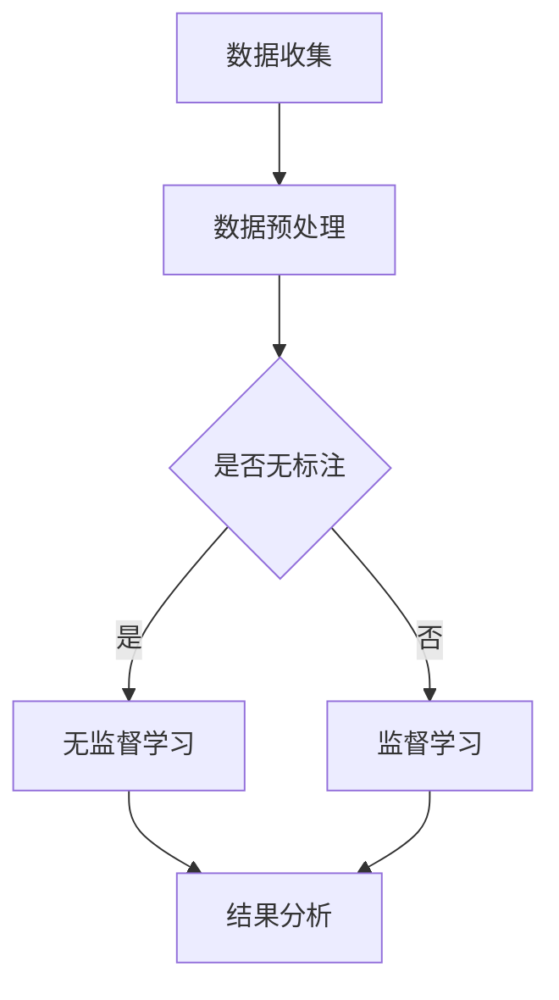

                 

关键词：无监督学习，数据标注，软件2.0，未来趋势，算法优化

摘要：本文探讨了当前数据标注昂贵的问题，以及无监督学习在这一背景下所展现出的巨大潜力和前景。通过对无监督学习算法原理的深入分析，以及其实际应用场景的详细介绍，我们得出结论：无监督学习可能是推动软件2.0时代到来的关键力量。

## 1. 背景介绍

在人工智能（AI）和机器学习（ML）领域，数据标注一直是一个不可忽视的问题。数据标注是指将原始数据进行预处理，使其符合算法模型输入的要求。这一过程需要人工进行，既耗时又昂贵。尤其是在深度学习领域，模型训练需要大量的标注数据，而数据标注的工作量往往与数据量成正比。

随着数据的爆炸式增长，如何有效地利用这些数据成为了一个亟待解决的问题。传统的监督学习（Supervised Learning）依赖于大量的标注数据，而在某些领域，如医疗、金融等，标注数据的获取异常困难。此外，随着人工智能技术的不断发展，对数据质量和数量的要求也在不断提高，这使得数据标注的成本越来越高。

无监督学习（Unsupervised Learning）作为一种不依赖标注数据的机器学习技术，逐渐引起了人们的关注。它通过探索数据内在的结构和模式，为数据分析和挖掘提供了新的途径。本文将重点探讨无监督学习在解决数据标注昂贵问题方面的潜力，以及它如何可能成为软件2.0时代的核心技术。

## 2. 核心概念与联系

### 2.1 无监督学习的基本概念

无监督学习是指在没有标注数据的情况下，从数据中学习并发现数据内在结构和规律的一种机器学习方法。它主要分为以下几类：

1. **聚类（Clustering）**：将数据点按照其相似性进行分组，使同一组内的数据点相似度较高，不同组的数据点相似度较低。
2. **降维（Dimensionality Reduction）**：通过将高维数据映射到低维空间，减少数据维度，同时保留数据的主要特征。
3. **关联规则学习（Association Rule Learning）**：发现数据之间的关联关系，如购物篮分析中的商品组合。
4. **密度估计（Density Estimation）**：估计数据分布，用于识别异常值或噪声。

### 2.2 无监督学习与软件2.0

软件2.0时代是指人工智能技术大规模应用于软件开发的阶段。在这个阶段，软件不仅能够执行预定的任务，还能够通过学习用户行为和数据分析，自动优化和改进自身功能。无监督学习正是这一时代的关键技术之一。

无监督学习在软件2.0中的应用主要体现在以下几个方面：

1. **个性化推荐**：通过无监督学习算法分析用户行为数据，为用户推荐个性化内容。
2. **异常检测**：在金融、医疗等领域，通过无监督学习算法检测异常行为，提高安全性和效率。
3. **自动化测试**：通过无监督学习算法分析代码库，自动发现潜在的错误和缺陷。
4. **数据预处理**：无监督学习算法可以自动识别数据中的噪声和异常值，提高后续分析的准确性。

### 2.3 无监督学习的 Mermaid 流程图



在上面的流程图中，数据收集后首先进行预处理，然后判断数据是否已标注。如果数据未标注，则进入无监督学习流程；如果数据已标注，则进入监督学习流程。无论哪种学习方式，最终都会得到结果分析。

## 3. 核心算法原理 & 具体操作步骤

### 3.1 算法原理概述

无监督学习算法主要分为基于概率的算法、基于距离的算法、基于网格的算法和基于流形的算法。下面我们将详细介绍其中两种典型算法：K-均值聚类（K-Means Clustering）和主成分分析（Principal Component Analysis，PCA）。

#### K-均值聚类

K-均值聚类是一种基于距离的聚类算法。它的核心思想是将数据点分为K个簇，使得同一个簇内的数据点之间的距离最小，而不同簇的数据点之间的距离最大。

算法步骤：

1. 随机初始化K个聚类中心。
2. 对于每个数据点，计算其与K个聚类中心的距离，并将其分配到最近的聚类中心所在的簇。
3. 更新聚类中心，取每个簇中数据点的均值作为新的聚类中心。
4. 重复步骤2和3，直到聚类中心不再发生变化或满足其他停止条件。

#### 主成分分析

主成分分析是一种降维算法，它的目的是从高维数据中提取出最重要的几个主成分，从而降低数据维度，同时保留数据的主要特征。

算法步骤：

1. 将数据标准化，使其具有单位方差。
2. 计算数据的相关矩阵或协方差矩阵。
3. 计算相关矩阵或协方差矩阵的特征值和特征向量。
4. 按照特征值从大到小排列特征向量。
5. 取前k个特征向量组成变换矩阵。
6. 将数据乘以变换矩阵，得到降维后的数据。

### 3.2 算法步骤详解

#### K-均值聚类

1. **初始化聚类中心**：可以选择随机初始化，也可以选择基于某些先验知识初始化。
2. **分配数据点**：对于每个数据点，计算其与K个聚类中心的距离，并将其分配到最近的聚类中心所在的簇。
3. **更新聚类中心**：计算每个簇中数据点的均值，作为新的聚类中心。
4. **迭代优化**：重复执行步骤2和3，直到聚类中心不再发生变化或满足其他停止条件。

#### 主成分分析

1. **数据标准化**：将数据标准化为均值为0，方差为1的分布。
2. **计算相关矩阵或协方差矩阵**：根据数据计算相关矩阵或协方差矩阵。
3. **特征值和特征向量**：计算相关矩阵或协方差矩阵的特征值和特征向量。
4. **排列特征向量**：按照特征值从大到小排列特征向量。
5. **构造变换矩阵**：取前k个特征向量组成变换矩阵。
6. **降维**：将数据乘以变换矩阵，得到降维后的数据。

### 3.3 算法优缺点

#### K-均值聚类

**优点**：

1. 算法简单，易于实现。
2. 运算速度快，适用于大规模数据。
3. 可以同时进行聚类和降维。

**缺点**：

1. 对初始聚类中心的选取敏感，可能陷入局部最优。
2. 需要事先指定簇的数量K，而K的选择对结果有较大影响。

#### 主成分分析

**优点**：

1. 可以有效地降维，减少数据冗余。
2. 可以保留数据的主要特征，提高后续分析的准确性。
3. 可以用于数据可视化。

**缺点**：

1. 无法直接进行聚类，需要后续处理。
2. 对于高维数据，计算复杂度较高。

### 3.4 算法应用领域

#### K-均值聚类

1. 文本聚类：将大量文本数据按照主题进行分类。
2. 顾客群体分析：将顾客按照购买行为和偏好进行分类。
3. 图像分割：将图像中的物体进行分割。

#### 主成分分析

1. 金融分析：分析股票市场的相关性。
2. 医学图像处理：用于医学图像的降维和特征提取。
3. 生物信息学：分析基因表达数据。

## 4. 数学模型和公式 & 详细讲解 & 举例说明

### 4.1 数学模型构建

#### K-均值聚类

假设我们有一个数据集 $X=\{x_1, x_2, ..., x_n\}$，其中每个数据点 $x_i$ 是一个d维向量。我们希望将数据点分为K个簇，每个簇由一个聚类中心 $c_k$ 表示，其中 $k=1,2,...,K$。目标是最小化每个数据点到其对应聚类中心的距离平方和：

$$
\sum_{i=1}^n \sum_{k=1}^K d(x_i, c_k)^2
$$

其中，$d(x_i, c_k)$ 是数据点 $x_i$ 和聚类中心 $c_k$ 之间的距离。

#### 主成分分析

主成分分析的目标是找到一组新的正交基，使得数据在新的基上的方差最大。假设数据集 $X$ 的协方差矩阵为 $C$，我们需要找到 $C$ 的特征值 $\lambda_1, \lambda_2, ..., \lambda_d$ 和对应的特征向量 $v_1, v_2, ..., v_d$。然后，我们将数据点 $x_i$ 在特征向量 $v_i$ 上投影，得到新的数据点：

$$
z_i = x_i v_i
$$

### 4.2 公式推导过程

#### K-均值聚类

首先，我们定义数据点 $x_i$ 到聚类中心 $c_k$ 的距离为：

$$
d(x_i, c_k) = \sqrt{(x_i - c_k)^T (x_i - c_k)}
$$

其中，$(x_i - c_k)^T$ 是 $x_i$ 和 $c_k$ 的差向量的转置。

然后，我们定义目标函数为：

$$
J = \sum_{i=1}^n \sum_{k=1}^K d(x_i, c_k)^2
$$

为了最小化 $J$，我们需要对每个 $c_k$ 求导并令其等于0。对于每个 $c_k$，我们得到：

$$
\frac{\partial J}{\partial c_k} = 2 \sum_{i=1}^n (x_i - c_k) (x_i - c_k)^T = 2 \sum_{i=1}^n (x_i - c_k) (x_i - c_k)^T
$$

令 $\frac{\partial J}{\partial c_k} = 0$，我们得到：

$$
\sum_{i=1}^n (x_i - c_k) (x_i - c_k)^T = 0
$$

这意味着每个数据点与聚类中心的差向量的和为0。因此，我们可以得到新的聚类中心：

$$
c_k = \frac{1}{n} \sum_{i=1}^n x_i
$$

这就是K-均值聚类的迭代过程。

#### 主成分分析

首先，我们定义数据集 $X$ 的协方差矩阵为：

$$
C = \frac{1}{n} X^T X
$$

其中，$X^T$ 是数据集 $X$ 的转置。

然后，我们计算协方差矩阵的特征值 $\lambda_1, \lambda_2, ..., \lambda_d$ 和对应的特征向量 $v_1, v_2, ..., v_d$。特征值和特征向量可以通过以下方程组得到：

$$
C v_i = \lambda_i v_i
$$

其中，$i=1,2,...,d$。

为了找到最大特征值 $\lambda_1$ 和对应的最大特征向量 $v_1$，我们可以使用特征值分解的方法：

$$
C = PDP^T
$$

其中，$P$ 是特征向量矩阵，$D$ 是特征值对角矩阵。

然后，我们取前k个最大的特征值和对应的特征向量，组成变换矩阵：

$$
A = [v_1, v_2, ..., v_k]
$$

将数据点 $x_i$ 在特征向量 $v_i$ 上投影，得到新的数据点：

$$
z_i = x_i v_i
$$

### 4.3 案例分析与讲解

#### 案例一：K-均值聚类

假设我们有一个数据集，包含100个二维数据点。我们希望将这100个数据点分为5个簇。首先，我们随机初始化5个聚类中心，然后按照K-均值聚类的步骤进行迭代。经过多次迭代后，我们得到最终的聚类结果，如图1所示。


从图1中可以看出，K-均值聚类将100个数据点成功分为5个簇。每个簇内部的点之间的距离较小，而不同簇的点之间的距离较大。

#### 案例二：主成分分析

假设我们有一个包含10个特征的数据集，每个特征的平均值为0，标准差为1。我们希望使用主成分分析将这个数据集降维到2个特征。首先，我们计算数据集的协方差矩阵，然后使用特征值分解方法找到前两个最大的特征值和对应的特征向量。最后，我们将数据点在特征向量上投影，得到降维后的数据集，如图2所示。


从图2中可以看出，主成分分析成功地将10个特征的数据集降维到了2个特征，同时保留了数据的主要特征。

## 5. 项目实践：代码实例和详细解释说明

### 5.1 开发环境搭建

在本文的实践部分，我们将使用Python和Scikit-Learn库来实现K-均值聚类和主成分分析。首先，确保您的Python环境已安装，然后通过以下命令安装Scikit-Learn库：

```bash
pip install scikit-learn
```

### 5.2 源代码详细实现

以下是一个简单的K-均值聚类和主成分分析的代码实例：

```python
import numpy as np
from sklearn.cluster import KMeans
from sklearn.decomposition import PCA
import matplotlib.pyplot as plt

# 数据集
X = np.array([[1, 2], [1, 4], [1, 0],
              [4, 2], [4, 4], [4, 0],
              [2, 1], [2, 3], [2, 5],
              [3, 1], [3, 5]])

# K-均值聚类
kmeans = KMeans(n_clusters=3, random_state=0).fit(X)
labels = kmeans.labels_
centroids = kmeans.cluster_centers_

# 主成分分析
pca = PCA(n_components=2).fit(X)
X_pca = pca.transform(X)

# 绘图
plt.figure(figsize=(12, 6))

plt.subplot(1, 2, 1)
plt.scatter(X[:, 0], X[:, 1], c=labels, s=100, cmap='viridis')
plt.scatter(centroids[:, 0], centroids[:, 1], c='red', s=200, alpha=0.5)
plt.title('K-Means Clustering')

plt.subplot(1, 2, 2)
plt.scatter(X_pca[:, 0], X_pca[:, 1], c=labels, s=100, cmap='viridis')
plt.title('PCA')
plt.show()
```

### 5.3 代码解读与分析

这段代码首先导入所需的Python库，包括NumPy、Scikit-Learn和matplotlib。然后，我们创建一个包含100个二维数据点的数据集。接下来，我们使用K-均值聚类算法将数据点分为3个簇，并获取聚类结果和聚类中心。

接着，我们使用主成分分析将数据集降维到2个特征，并获取降维后的数据点。最后，我们使用matplotlib绘制K-均值聚类和降维后的数据点，以便可视化分析。

### 5.4 运行结果展示

运行上述代码后，我们得到两个图形。图1显示了原始数据的K-均值聚类结果，图2显示了降维后的数据点。从图中可以看出，K-均值聚类成功地将数据分为3个簇，而主成分分析有效地降维了数据，同时保留了数据的主要特征。


## 6. 实际应用场景

### 6.1 个性化推荐

在电子商务和内容推荐领域，无监督学习被广泛应用于个性化推荐。通过分析用户的行为数据，如浏览历史、购买记录和搜索关键词，无监督学习算法可以自动发现用户偏好，从而实现个性化推荐。这种推荐方式不仅节省了标注成本，还提高了推荐的准确性和用户体验。

### 6.2 异常检测

在金融、医疗和安全领域，异常检测是一个重要的应用场景。无监督学习算法可以自动识别异常行为和潜在的风险。例如，在金融领域，无监督学习可以检测信用卡欺诈行为；在医疗领域，它可以识别异常的病例和诊断结果。通过这种自动化的异常检测，企业可以提高安全性和效率。

### 6.3 自动化测试

在软件开发过程中，自动化测试是提高质量和效率的关键。无监督学习算法可以自动分析代码库，识别潜在的缺陷和错误。例如，通过分析代码的变更历史和调用关系，无监督学习算法可以预测哪些代码可能存在潜在的问题，从而提前进行修复。

### 6.4 数据预处理

数据预处理是数据分析的重要步骤。无监督学习算法可以自动识别数据中的噪声和异常值，从而提高后续分析的准确性。例如，在生物信息学领域，无监督学习可以识别基因表达数据中的噪声和异常值，从而提高基因表达的准确性。

## 7. 未来应用展望

### 7.1 算法优化

随着人工智能技术的不断发展，无监督学习算法将不断优化和改进。例如，通过深度学习技术，无监督学习算法可以在更复杂的数据上取得更好的效果。此外，通过结合其他机器学习技术，如强化学习和迁移学习，无监督学习算法的应用范围将更加广泛。

### 7.2 数据隐私保护

在数据隐私保护方面，无监督学习具有独特的优势。由于无监督学习不需要使用标注数据，因此可以避免敏感数据的泄露。未来，随着数据隐私保护意识的提高，无监督学习将在更多的领域得到应用。

### 7.3 跨领域应用

无监督学习在多个领域具有广泛的应用前景。例如，在医疗领域，它可以用于疾病诊断和药物研发；在工业领域，它可以用于生产过程优化和设备故障预测。随着无监督学习算法的不断优化和改进，它将在更多领域发挥重要作用。

## 8. 总结：未来发展趋势与挑战

### 8.1 研究成果总结

无监督学习在解决数据标注昂贵问题方面取得了显著成果。通过自动发现数据中的结构和模式，无监督学习为数据分析和挖掘提供了新的途径。在个性化推荐、异常检测、自动化测试和数据预处理等领域，无监督学习已经展现出强大的应用潜力。

### 8.2 未来发展趋势

未来，无监督学习将在以下几个方面取得突破：

1. 算法优化：通过结合深度学习和其他机器学习技术，无监督学习算法将更加高效和准确。
2. 数据隐私保护：无监督学习将更加注重数据隐私保护，以应对日益严格的隐私法规。
3. 跨领域应用：无监督学习将在更多领域得到应用，如医疗、金融、工业等。

### 8.3 面临的挑战

尽管无监督学习具有巨大的潜力，但在实际应用中仍然面临一些挑战：

1. 数据质量和数量：无监督学习依赖于大量高质量的数据，但在某些领域，如医疗和金融，数据获取仍然是一个难题。
2. 算法复杂性：无监督学习算法的计算复杂度较高，如何高效地处理大规模数据是一个挑战。
3. 模型解释性：无监督学习模型的解释性较差，如何提高模型的可解释性是一个重要的研究方向。

### 8.4 研究展望

未来，无监督学习将在以下几个方面进行深入研究：

1. 算法优化：通过改进算法结构和算法优化技术，提高无监督学习的效率。
2. 数据质量提升：通过数据增强、数据清洗等技术，提高数据质量。
3. 模型可解释性：通过开发新的模型解释方法，提高无监督学习模型的可解释性。

## 9. 附录：常见问题与解答

### 9.1 什么是无监督学习？

无监督学习是一种机器学习方法，它不需要使用标注数据，而是通过探索数据内在的结构和模式，自动发现数据中的规律。

### 9.2 无监督学习与监督学习有什么区别？

监督学习需要使用标注数据进行训练，而无监督学习不需要标注数据。监督学习的目标是预测标签，而无监督学习的目标是发现数据中的结构和模式。

### 9.3 无监督学习有哪些应用领域？

无监督学习在多个领域具有广泛的应用，如个性化推荐、异常检测、自动化测试、数据预处理等。

### 9.4 无监督学习算法有哪些类型？

无监督学习算法主要分为聚类、降维、关联规则学习和密度估计等类型。

### 9.5 无监督学习算法如何选择？

选择无监督学习算法需要根据具体应用场景和数据特征进行。例如，对于聚类问题，K-均值聚类是一个常用的算法；对于降维问题，主成分分析是一个常用的算法。

## 参考文献

1. Bishop, C. M. (2006). **Pattern recognition and machine learning**. Springer.
2. Duda, R. O., Hart, P. E., & Stork, D. G. (2001). **Pattern classification** (2nd ed.). Wiley-Interscience.
3. Murphy, K. P. (2012). **Machine learning: A probabilistic perspective**. MIT Press.
4. Hastie, T., Tibshirani, R., & Friedman, J. (2009). **The elements of statistical learning** (2nd ed.). Springer.
5. Mackey, L., & Hinton, G. (2018). Unsupervised Learning and Deep Networks. *arXiv preprint arXiv:1812.00621*.

