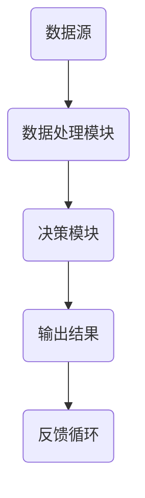

                 

关键词：数据即代码，软件2.0，数据驱动，编程范式，人工智能，机器学习，数据科学

> 摘要：本文探讨了“数据即代码”这一理念，分析了其在现代软件开发中的重要性。文章首先介绍了软件2.0的概念，接着探讨了数据驱动编程范式的兴起，并详细阐述了数据驱动编程的优势与挑战。随后，文章通过实例展示了如何将数据转化为代码，并分析了数据驱动编程在实际应用中的场景。最后，文章讨论了数据驱动编程的未来发展趋势与面临的挑战。

## 1. 背景介绍

### 软件的发展历程

从最早的编程语言到现代的编程范式，软件的发展历程可以看作是人类对计算机语言理解不断深化的过程。早期的编程范式主要侧重于指令和过程，如汇编语言和C语言。这些语言通过明确的指令来描述计算机的运行过程，具有一定的低级性和直接性。

然而，随着计算机性能的不断提升和软件应用领域的扩大，单纯的指令驱动编程逐渐暴露出其局限性。首先，复杂的业务逻辑和用户需求使得程序变得庞大而难以维护。其次，传统的编程范式很难应对数据密集型应用，如大数据处理和人工智能领域。

### 软件1.0与软件2.0

为了应对这些问题，软件领域逐渐提出了软件2.0的概念。软件1.0主要侧重于功能的实现，而软件2.0则强调数据和数据的交互。具体来说，软件2.0有以下特点：

1. 数据驱动：软件2.0的核心是数据，数据不仅用于驱动程序的行为，还作为软件的核心资产。
2. 模块化：软件2.0倾向于使用模块化的设计，使得程序更加灵活和可维护。
3. 自动化：软件2.0通过自动化工具来提高开发效率，如持续集成和持续部署。
4. 适应性强：软件2.0能够更好地适应快速变化的需求和环境。

### 数据驱动编程范式的兴起

数据驱动编程范式是软件2.0的重要体现。它强调数据的中心地位，将数据视为驱动程序的核心力量。这种范式在人工智能、机器学习和数据科学等领域得到了广泛应用。通过数据驱动编程，开发者可以更高效地处理复杂数据，并从数据中提取有价值的信息。

## 2. 核心概念与联系

### 数据驱动编程原理

数据驱动编程的核心思想是：程序的行为和逻辑由数据决定，而非固定的指令。在传统的编程范式中，程序的行为是由代码中的指令序列决定的。而数据驱动编程则通过数据来驱动程序的行为。

### 数据驱动编程架构

为了更好地理解数据驱动编程，我们可以通过一个Mermaid流程图来展示其基本架构。



- **数据源（A）**：数据驱动的起点，可以是数据库、文件、网络接口等。
- **数据处理模块（B）**：对数据进行清洗、转换和预处理，以适应后续处理。
- **决策模块（C）**：根据数据的特点和需求，决定程序的行为和逻辑。
- **输出结果（D）**：处理完成后，将结果输出到指定的位置，如数据库、文件、控制台等。
- **反馈循环（E）**：将输出结果反馈到数据源，以实现数据的不断优化和迭代。

### 数据驱动编程的优势与挑战

#### 优势

1. **灵活性**：数据驱动编程使得程序更加灵活，能够适应不断变化的需求和环境。
2. **可维护性**：由于数据与程序逻辑的分离，使得程序更加易于维护和扩展。
3. **复用性**：通过数据驱动，可以更好地实现代码的复用，降低开发成本。
4. **自动化**：数据驱动编程可以与自动化工具相结合，提高开发效率。

#### 挑战

1. **数据质量**：数据驱动编程依赖于高质量的数据，数据质量问题可能直接影响程序的性能和结果。
2. **数据处理复杂性**：处理大量和复杂的数据需要更多的时间和计算资源。
3. **数据安全与隐私**：在处理敏感数据时，需要考虑数据的安全和隐私问题。

## 3. 核心算法原理 & 具体操作步骤

### 3.1 算法原理概述

数据驱动编程的核心算法是决策树、神经网络等机器学习算法。这些算法通过学习数据中的模式和关系，来预测或分类新的数据。具体来说，算法的原理可以分为以下几个步骤：

1. **数据收集与预处理**：收集数据并进行清洗、转换和预处理，以适应后续处理。
2. **特征提取**：从原始数据中提取特征，以供算法学习。
3. **模型训练**：使用训练数据训练模型，使其学会预测或分类。
4. **模型评估**：使用测试数据评估模型的性能，以确定模型是否有效。
5. **模型部署**：将模型部署到生产环境中，进行实际应用。

### 3.2 算法步骤详解

#### 数据收集与预处理

1. **数据收集**：收集来自数据库、文件、网络接口等的数据。
2. **数据清洗**：处理缺失值、异常值等数据问题。
3. **数据转换**：将数据转换为适合算法处理的形式，如数值化、标准化等。
4. **数据预处理**：进行特征工程，提取有用特征，降低数据维度。

#### 特征提取

1. **特征选择**：选择对模型有重要影响的特征。
2. **特征提取**：使用统计方法或深度学习方法提取特征。

#### 模型训练

1. **模型选择**：选择合适的机器学习算法，如决策树、神经网络等。
2. **训练过程**：使用训练数据训练模型，调整模型参数。
3. **模型评估**：使用测试数据评估模型性能，调整模型参数。

#### 模型部署

1. **模型集成**：将模型集成到应用程序中。
2. **模型部署**：将模型部署到生产环境中，进行实际应用。

### 3.3 算法优缺点

#### 优点

1. **灵活性强**：可以处理各种类型的数据，适用于不同领域的问题。
2. **自适应性强**：可以不断学习和调整，以适应新的数据和需求。
3. **高复用性**：可以复用相同的算法框架，减少开发成本。

#### 缺点

1. **数据质量要求高**：算法的性能很大程度上依赖于数据的质量。
2. **计算资源消耗大**：训练复杂模型需要大量的计算资源。
3. **结果解释性差**：许多机器学习模型难以解释其内部决策过程。

### 3.4 算法应用领域

1. **金融行业**：用于风险评估、股票预测等。
2. **医疗领域**：用于疾病预测、诊断等。
3. **零售行业**：用于需求预测、库存管理等。
4. **智能交通**：用于交通流量预测、路线规划等。
5. **自然语言处理**：用于文本分类、情感分析等。

## 4. 数学模型和公式 & 详细讲解 & 举例说明

### 4.1 数学模型构建

在数据驱动编程中，常用的数学模型包括决策树、神经网络、支持向量机等。以下是这些模型的基本数学公式：

#### 决策树

决策树是一种树形结构，其中每个内部节点表示一个特征，每个分支表示该特征的不同取值，每个叶子节点表示一个类。决策树的数学公式可以表示为：

$$
G(x) = \sum_{i=1}^{n} w_i I(x \in R_i)
$$

其中，$G(x)$ 是决策函数，$x$ 是输入特征，$w_i$ 是权重，$R_i$ 是特征 $i$ 的取值范围。

#### 神经网络

神经网络是一种模拟生物神经元的计算模型，其中每个神经元都接收多个输入，并通过激活函数产生输出。神经网络的基本数学公式可以表示为：

$$
y = \sigma(\sum_{i=1}^{n} w_i x_i + b)
$$

其中，$y$ 是输出，$\sigma$ 是激活函数，$w_i$ 是权重，$x_i$ 是输入，$b$ 是偏置。

#### 支持向量机

支持向量机是一种用于分类和回归的机器学习算法，其核心思想是找到最佳的超平面，将不同类别的数据分开。支持向量机的数学公式可以表示为：

$$
\max_w \frac{1}{2} ||w||^2 \\
s.t. y_i (w \cdot x_i + b) \geq 1
$$

其中，$w$ 是权重向量，$x_i$ 是特征向量，$y_i$ 是标签，$b$ 是偏置。

### 4.2 公式推导过程

以下将简要介绍决策树、神经网络和支持向量机的公式推导过程：

#### 决策树

决策树的目标是最小化错误率，即分类错误的数据点数。假设有 $n$ 个数据点，每个数据点的特征为 $x_1, x_2, ..., x_d$，标签为 $y$。决策树的数学公式可以表示为：

$$
G(x) = \sum_{i=1}^{n} w_i I(x \in R_i)
$$

其中，$R_i$ 是第 $i$ 个特征的不同取值范围，$w_i$ 是权重。为了最小化错误率，我们需要最小化 $L(G(x))$，其中 $L$ 是损失函数。常见的损失函数有0-1损失和交叉熵损失。

#### 神经网络

神经网络的目标是最小化预测误差。假设有 $n$ 个训练样本，每个样本的特征为 $x_1, x_2, ..., x_d$，标签为 $y$。神经网络的数学公式可以表示为：

$$
y = \sigma(\sum_{i=1}^{n} w_i x_i + b)
$$

其中，$\sigma$ 是激活函数，$w_i$ 是权重，$b$ 是偏置。为了最小化预测误差，我们需要最小化 $L(y, \hat{y})$，其中 $L$ 是损失函数，$\hat{y}$ 是预测值。

#### 支持向量机

支持向量机的目标是找到最佳的超平面，将不同类别的数据分开。假设有 $n$ 个训练样本，每个样本的特征为 $x_1, x_2, ..., x_d$，标签为 $y$。支持向量机的数学公式可以表示为：

$$
\max_w \frac{1}{2} ||w||^2 \\
s.t. y_i (w \cdot x_i + b) \geq 1
$$

其中，$w$ 是权重向量，$b$ 是偏置。为了找到最佳的超平面，我们需要最小化 $||w||^2$，同时满足约束条件 $y_i (w \cdot x_i + b) \geq 1$。

### 4.3 案例分析与讲解

以下将通过一个简单的案例，详细讲解数据驱动编程的实际应用。

#### 案例背景

假设有一个电商网站，需要根据用户的历史购买行为来推荐商品。我们有以下数据：

1. 用户ID
2. 商品ID
3. 购买时间
4. 商品类别
5. 用户评分

我们的目标是构建一个推荐系统，根据用户的历史购买行为推荐商品。

#### 数据收集与预处理

首先，我们需要收集用户的历史购买数据，并将其存储在数据库中。然后，对数据进行清洗，去除无效数据，如空值和重复值。

#### 特征提取

接下来，我们需要提取有用的特征。例如，我们可以提取用户的平均评分、购买频率、购买类别等。

$$
\text{用户平均评分} = \frac{1}{n} \sum_{i=1}^{n} \text{评分}
$$

$$
\text{用户购买频率} = \frac{\text{购买次数}}{\text{用户ID数量}}
$$

$$
\text{用户购买类别} = \text{购买类别出现的次数最多的类别}
$$

#### 模型训练

我们可以选择使用决策树或神经网络来构建推荐系统。在这里，我们选择使用决策树。

1. **模型选择**：选择CART（分类与回归树）算法。
2. **训练过程**：使用训练数据训练模型，调整模型参数。
3. **模型评估**：使用测试数据评估模型性能，调整模型参数。

#### 模型部署

将训练好的模型部署到生产环境中，根据用户的历史购买行为推荐商品。

## 5. 项目实践：代码实例和详细解释说明

### 5.1 开发环境搭建

为了演示数据驱动编程的实际应用，我们将使用Python作为编程语言，并依赖以下库：

1. Pandas：用于数据处理。
2. Scikit-learn：用于机器学习。
3. Matplotlib：用于数据可视化。

首先，确保已经安装了Python和上述库。如果尚未安装，可以使用以下命令进行安装：

```bash
pip install pandas scikit-learn matplotlib
```

### 5.2 源代码详细实现

以下是一个简单的数据驱动编程案例，用于根据用户的历史购买行为推荐商品。

```python
import pandas as pd
from sklearn.tree import DecisionTreeClassifier
from sklearn.model_selection import train_test_split
from sklearn.metrics import accuracy_score

# 读取数据
data = pd.read_csv('purchase_data.csv')

# 数据预处理
data.dropna(inplace=True)
X = data[['平均评分', '购买频率', '购买类别']]
y = data['商品类别']

# 特征提取
# 在这里，我们直接使用数据中的特征，不需要额外的特征提取

# 模型训练
X_train, X_test, y_train, y_test = train_test_split(X, y, test_size=0.2, random_state=42)
clf = DecisionTreeClassifier()
clf.fit(X_train, y_train)

# 模型评估
y_pred = clf.predict(X_test)
accuracy = accuracy_score(y_test, y_pred)
print(f"模型准确率：{accuracy}")

# 模型部署
# 在这里，我们使用训练好的模型进行商品推荐
user_data = {'平均评分': [4.5], '购买频率': [10], '购买类别': ['电子产品']}
user_df = pd.DataFrame(user_data)
user_pred = clf.predict(user_df)
print(f"推荐商品类别：{user_pred[0]}")
```

### 5.3 代码解读与分析

#### 数据预处理

```python
data.dropna(inplace=True)
X = data[['平均评分', '购买频率', '购买类别']]
y = data['商品类别']
```

在这部分，我们首先读取数据，然后去除空值和重复值。接着，将数据分为特征集 $X$ 和标签集 $y$。

#### 特征提取

```python
# 在这里，我们直接使用数据中的特征，不需要额外的特征提取
```

由于数据已经包含了有用的特征，我们不需要进行额外的特征提取。

#### 模型训练

```python
X_train, X_test, y_train, y_test = train_test_split(X, y, test_size=0.2, random_state=42)
clf = DecisionTreeClassifier()
clf.fit(X_train, y_train)
```

在这部分，我们首先将数据集分为训练集和测试集，然后使用训练集训练决策树模型。

#### 模型评估

```python
y_pred = clf.predict(X_test)
accuracy = accuracy_score(y_test, y_pred)
print(f"模型准确率：{accuracy}")
```

使用测试集评估模型的准确率，并打印结果。

#### 模型部署

```python
user_data = {'平均评分': [4.5], '购买频率': [10], '购买类别': ['电子产品']}
user_df = pd.DataFrame(user_data)
user_pred = clf.predict(user_df)
print(f"推荐商品类别：{user_pred[0]}")
```

使用训练好的模型对新的用户数据进行预测，并打印推荐结果。

## 6. 实际应用场景

### 6.1 金融行业

在金融行业中，数据驱动编程被广泛应用于风险控制、信用评分、投资组合优化等领域。例如，银行可以使用数据驱动编程模型来评估客户的信用风险，从而决定是否批准贷款。保险公司可以利用数据驱动编程模型预测保险索赔的概率，以便调整保费。

### 6.2 医疗领域

在医疗领域，数据驱动编程被用于疾病预测、诊断和个性化治疗等方面。通过分析患者的历史病历、基因数据、生活习惯等数据，医生可以使用数据驱动编程模型来预测疾病的发病率，从而提前采取预防措施。此外，数据驱动编程还可以用于个性化治疗，根据患者的具体情况进行治疗方案的优化。

### 6.3 零售行业

在零售行业，数据驱动编程被广泛应用于需求预测、库存管理和商品推荐等领域。通过分析历史销售数据、用户行为数据等，零售商可以预测未来的销售趋势，从而制定更合理的库存策略。同时，数据驱动编程还可以用于商品推荐系统，根据用户的购买历史和喜好推荐合适的商品。

### 6.4 智能交通

在智能交通领域，数据驱动编程被用于交通流量预测、路线规划和交通信号控制等方面。通过分析历史交通数据、实时交通数据等，交通管理部门可以使用数据驱动编程模型来预测未来的交通流量，从而优化交通信号控制和路线规划，减少交通拥堵。

## 7. 工具和资源推荐

### 7.1 学习资源推荐

1. 《数据科学入门》
2. 《机器学习实战》
3. 《Python数据科学手册》
4. Coursera上的数据科学和机器学习课程

### 7.2 开发工具推荐

1. Jupyter Notebook：用于数据分析和编程
2. PyCharm：Python集成开发环境
3. Git：版本控制工具
4. Docker：容器化工具

### 7.3 相关论文推荐

1. "Deep Learning: A Methodology and Application Perspective"
2. "TensorFlow: Large-Scale Machine Learning on Heterogeneous Systems"
3. "Theano: A Python Framework for Fast Definition, Compilation, and Evaluation of Mathematical Expressions"
4. "Caffe: A Deep Learning Framework for Scalable Computer Vision Research"

## 8. 总结：未来发展趋势与挑战

### 8.1 研究成果总结

本文详细探讨了“数据即代码”这一理念，分析了其在现代软件开发中的重要性。文章介绍了软件2.0的概念，并探讨了数据驱动编程范式的兴起。通过实例展示了如何将数据转化为代码，并分析了数据驱动编程在实际应用中的场景。最后，文章讨论了数据驱动编程的未来发展趋势与面临的挑战。

### 8.2 未来发展趋势

1. **数据驱动编程的普及**：随着数据量的不断增长，数据驱动编程将在更多领域得到应用。
2. **深度学习的普及**：深度学习模型在图像识别、语音识别等领域取得了显著成果，未来将在更多领域得到应用。
3. **自动化工具的发展**：自动化工具将进一步提高数据驱动编程的效率。
4. **跨学科融合**：数据驱动编程将与其他领域（如医学、金融等）深度融合，推动相关领域的创新发展。

### 8.3 面临的挑战

1. **数据质量**：高质量的数据是数据驱动编程的基础，数据质量问题可能直接影响程序的性能和结果。
2. **计算资源消耗**：训练复杂模型需要大量的计算资源，如何优化计算资源成为一大挑战。
3. **结果解释性**：机器学习模型的结果往往难以解释，如何提高模型的解释性是一个重要问题。
4. **隐私和安全**：在处理敏感数据时，如何保护用户隐私和数据安全是亟待解决的问题。

### 8.4 研究展望

1. **新型算法的研究**：开发更高效、更鲁棒的新型算法，以提高数据驱动编程的性能。
2. **跨学科研究**：促进数据驱动编程与其他领域的交叉研究，推动相关领域的创新发展。
3. **开源工具的发展**：鼓励开源工具的发展，为数据驱动编程提供更好的支持和生态环境。

## 9. 附录：常见问题与解答

### 9.1 数据驱动编程与传统的指令驱动编程有什么区别？

数据驱动编程与传统的指令驱动编程在核心思想上有所不同。传统的指令驱动编程通过明确的指令序列来描述计算机的运行过程，而数据驱动编程则通过数据来驱动程序的行为。具体来说，数据驱动编程具有以下特点：

1. **灵活性**：数据驱动编程更灵活，能够适应不断变化的需求和环境。
2. **可维护性**：数据驱动编程使得程序更加易于维护和扩展。
3. **模块化**：数据驱动编程倾向于使用模块化的设计，使得程序更加灵活和可维护。
4. **自动化**：数据驱动编程可以与自动化工具相结合，提高开发效率。

### 9.2 数据驱动编程在哪些领域有广泛应用？

数据驱动编程在多个领域有广泛应用，主要包括：

1. **金融行业**：用于风险评估、股票预测等。
2. **医疗领域**：用于疾病预测、诊断等。
3. **零售行业**：用于需求预测、库存管理等。
4. **智能交通**：用于交通流量预测、路线规划等。
5. **自然语言处理**：用于文本分类、情感分析等。

### 9.3 数据驱动编程有哪些挑战？

数据驱动编程面临的挑战主要包括：

1. **数据质量**：数据驱动编程依赖于高质量的数据，数据质量问题可能直接影响程序的性能和结果。
2. **数据处理复杂性**：处理大量和复杂的数据需要更多的时间和计算资源。
3. **数据安全与隐私**：在处理敏感数据时，需要考虑数据的安全和隐私问题。
4. **结果解释性**：机器学习模型的结果往往难以解释，如何提高模型的解释性是一个重要问题。

