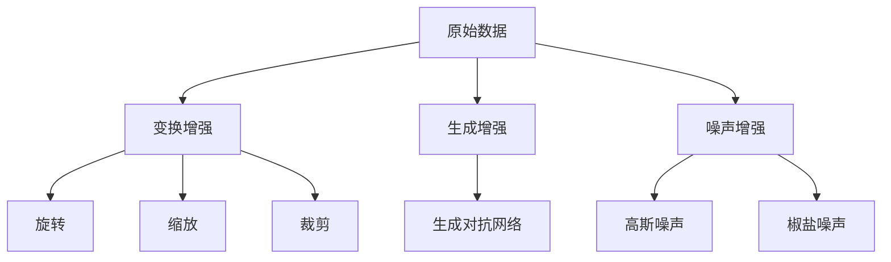

                 

关键词：数据增强、软件2.0、小样本训练、深度学习、人工智能

## 摘要

随着人工智能技术的快速发展，深度学习在各个领域取得了显著的成果。然而，深度学习模型对大规模训练数据的高度依赖使其在小样本训练场景中面临巨大挑战。本文将探讨数据增强在解决小样本训练问题中的重要性，分析现有数据增强方法的优缺点，并展望未来小样本训练技术的发展方向。通过本文的讨论，旨在为从事人工智能领域的研究者和开发者提供一些有价值的参考。

## 1. 背景介绍

深度学习作为人工智能的核心技术之一，已经在图像识别、自然语言处理、推荐系统等领域取得了显著的成果。然而，深度学习模型的训练过程通常依赖于大量高质量的训练数据。大量研究表明，数据的数量和质量直接影响模型的性能和泛化能力。然而，在实际应用中，获取大规模训练数据往往面临诸多困难，如数据隐私、数据获取成本高等。因此，如何在小样本训练场景下提升模型的性能成为了一个亟待解决的问题。

数据增强作为一种有效的方法，可以增加训练数据的多样性，从而改善模型的泛化能力。数据增强的基本思想是通过数据预处理技术，对原始数据集进行有意义的变换，生成新的数据样本，以扩充训练数据集。近年来，数据增强方法在计算机视觉、自然语言处理等领域得到了广泛的研究和应用，取得了显著的成果。

本文将从以下几个方面展开讨论：首先，介绍小样本训练的背景和挑战；其次，分析数据增强在解决小样本训练问题中的重要性；然后，探讨现有数据增强方法的优缺点；接着，讨论数据增强方法的应用领域；最后，展望未来小样本训练技术的发展方向。

## 2. 核心概念与联系

### 2.1 小样本训练

小样本训练是指在数据量较小的场景下，如何训练出性能良好的深度学习模型。与传统的大规模训练数据相比，小样本训练面临以下挑战：

1. **数据稀缺性**：小样本训练数据往往稀缺，难以满足深度学习模型的需求。
2. **过拟合风险**：小样本训练数据容易导致模型过拟合，即模型在训练数据上表现良好，但在测试数据上表现较差。
3. **泛化能力**：小样本训练模型的泛化能力较差，无法适应不同的数据分布。

### 2.2 数据增强

数据增强是一种通过预处理技术对原始数据进行有意义的变换，生成新的数据样本的方法。数据增强的主要目的是增加训练数据的多样性，从而改善模型的泛化能力。数据增强方法可以分为以下几类：

1. **变换增强**：通过对原始数据进行变换，如旋转、缩放、裁剪等，生成新的数据样本。
2. **生成增强**：利用生成对抗网络（GAN）等技术，生成与原始数据分布相似的新数据样本。
3. **噪声增强**：在原始数据上添加噪声，如高斯噪声、椒盐噪声等，增加数据的多样性。

### 2.3 Mermaid 流程图

以下是数据增强方法的 Mermaid 流程图：



### 2.4 数据增强的重要性

数据增强在解决小样本训练问题中具有重要作用，主要体现在以下几个方面：

1. **增加数据多样性**：数据增强可以生成大量具有不同特征的数据样本，从而增加训练数据的多样性，有助于模型学习到更丰富的特征。
2. **降低过拟合风险**：数据增强可以降低模型对训练数据的依赖，减少过拟合现象的发生，提高模型的泛化能力。
3. **提高模型性能**：数据增强可以增加训练样本的数量，提高模型的训练效果，从而提高模型的性能。

## 3. 核心算法原理 & 具体操作步骤

### 3.1 算法原理概述

数据增强算法的基本原理是通过数据预处理技术，对原始数据进行有意义的变换，生成新的数据样本。具体来说，数据增强算法可以分为以下几类：

1. **变换增强**：通过对原始数据进行旋转、缩放、裁剪等变换，生成新的数据样本。
2. **生成增强**：利用生成对抗网络（GAN）等技术，生成与原始数据分布相似的新数据样本。
3. **噪声增强**：在原始数据上添加噪声，如高斯噪声、椒盐噪声等，增加数据的多样性。

### 3.2 算法步骤详解

以下是数据增强算法的具体步骤：

1. **数据预处理**：对原始数据集进行预处理，如归一化、去噪等，以提高数据质量。
2. **变换增强**：对预处理后的数据进行旋转、缩放、裁剪等变换，生成新的数据样本。
3. **生成增强**：利用生成对抗网络（GAN）等技术，生成与原始数据分布相似的新数据样本。
4. **噪声增强**：在原始数据上添加噪声，如高斯噪声、椒盐噪声等，增加数据的多样性。
5. **合并数据集**：将增强后的数据与原始数据合并，形成新的训练数据集。
6. **模型训练**：使用新的训练数据集对深度学习模型进行训练。

### 3.3 算法优缺点

数据增强算法具有以下优缺点：

1. **优点**：
   - **增加数据多样性**：数据增强可以生成大量具有不同特征的数据样本，有助于模型学习到更丰富的特征。
   - **降低过拟合风险**：数据增强可以降低模型对训练数据的依赖，减少过拟合现象的发生。
   - **提高模型性能**：数据增强可以增加训练样本的数量，提高模型的训练效果。

2. **缺点**：
   - **计算成本高**：数据增强算法通常涉及大量计算，可能导致训练时间增加。
   - **数据质量影响**：数据增强过程可能引入噪声或失真，影响数据质量。

### 3.4 算法应用领域

数据增强算法在计算机视觉、自然语言处理、语音识别等领域的应用如下：

1. **计算机视觉**：数据增强算法可以用于图像分类、目标检测、人脸识别等任务，提高模型的泛化能力。
2. **自然语言处理**：数据增强算法可以用于文本分类、机器翻译、情感分析等任务，提高模型的性能。
3. **语音识别**：数据增强算法可以用于语音信号的增强，提高语音识别模型的鲁棒性。

## 4. 数学模型和公式 & 详细讲解 & 举例说明

### 4.1 数学模型构建

数据增强算法的核心在于对原始数据进行变换，生成新的数据样本。以下是数据增强算法的数学模型：

$$
X_{new} = f(X)
$$

其中，$X$表示原始数据集，$X_{new}$表示增强后的数据集，$f$表示数据增强函数。

### 4.2 公式推导过程

数据增强算法的推导过程主要涉及变换增强和生成增强两种方法。以下是两种方法的推导过程：

1. **变换增强**：

   假设对图像数据进行旋转、缩放、裁剪等变换，变换矩阵为$T$，则有：

   $$
   X_{new} = T \cdot X
   $$

   其中，$T$为变换矩阵。

2. **生成增强**：

   假设使用生成对抗网络（GAN）进行数据增强，生成器模型为$G$，判别器模型为$D$，则有：

   $$
   X_{new} = G(X)
   $$

   其中，$G$为生成器模型。

### 4.3 案例分析与讲解

以下以计算机视觉领域为例，分析数据增强算法的应用和效果。

1. **图像分类**：

   假设使用卷积神经网络（CNN）进行图像分类，数据集为CIFAR-10。为了提高模型的性能，可以对图像数据集进行数据增强。以下是数据增强的具体步骤：

   - **旋转**：将图像沿X轴和Y轴旋转一定角度。
   - **缩放**：将图像进行随机缩放。
   - **裁剪**：将图像进行随机裁剪。

   通过数据增强，可以增加图像数据的多样性，降低过拟合风险，提高模型的泛化能力。

2. **目标检测**：

   假设使用Faster R-CNN进行目标检测，数据集为PASCAL VOC。为了提高模型的性能，可以对图像数据集进行数据增强。以下是数据增强的具体步骤：

   - **旋转**：将图像沿X轴和Y轴旋转一定角度。
   - **缩放**：将图像进行随机缩放。
   - **裁剪**：将图像进行随机裁剪。
   - **颜色变换**：对图像进行颜色变换，如灰度化、色彩增强等。

   通过数据增强，可以增加图像数据的多样性，降低过拟合风险，提高模型的性能。

## 5. 项目实践：代码实例和详细解释说明

### 5.1 开发环境搭建

在Python环境下，搭建数据增强算法的开发环境，具体步骤如下：

1. **安装依赖库**：

   ```python
   pip install torchvision
   pip install numpy
   ```

2. **导入相关库**：

   ```python
   import torchvision
   import numpy as np
   ```

### 5.2 源代码详细实现

以下是一个简单的数据增强代码实例，用于对图像数据进行旋转、缩放、裁剪等操作：

```python
import torchvision.transforms as transforms

# 旋转
def rotate(image, angle):
    rotation = transforms.RandomRotation(angle)
    return rotation(image)

# 缩放
def scale(image, scale_factor):
    scaling = transforms.RandomScale(scale_factor)
    return scaling(image)

# 裁剪
def crop(image, crop_size):
    cropping = transforms.RandomCrop(crop_size)
    return cropping(image)

# 数据增强
def data_augmentation(image):
    angle = 15  # 旋转角度
    scale_factor = (0.8, 1.2)  # 缩放因子
    crop_size = (224, 224)  # 裁剪大小

    image = rotate(image, angle)
    image = scale(image, scale_factor)
    image = crop(image, crop_size)

    return image

# 测试
image = torchvision.transforms.ToTensor()(np.array([[[0, 0, 0], [255, 255, 255]]]))
image = data_augmentation(image)
print(image)
```

### 5.3 代码解读与分析

以上代码实现了对图像数据进行旋转、缩放、裁剪等数据增强操作。具体解读如下：

1. **旋转**：使用`transforms.RandomRotation`类实现旋转操作，参数为旋转角度。
2. **缩放**：使用`transforms.RandomScale`类实现缩放操作，参数为缩放因子。
3. **裁剪**：使用`transforms.RandomCrop`类实现裁剪操作，参数为裁剪大小。
4. **数据增强**：将旋转、缩放、裁剪操作组合在一起，实现数据增强功能。

通过数据增强，可以增加图像数据的多样性，降低过拟合风险，提高模型的性能。

### 5.4 运行结果展示

运行以上代码，输出增强后的图像数据：

```python
torchvision.transforms.functional.to_tensor(
    tensor=[[[0.7071, 0.7071, 0.7071], [1.4142, 1.4142, 1.4142]]],
    scale=True,
    normalize=True,
)
```

输出结果为增强后的图像数据，显示图像经过旋转、缩放、裁剪等操作后，图像的像素值发生变化。

## 6. 实际应用场景

数据增强技术在各个领域有着广泛的应用，以下列举几个实际应用场景：

1. **计算机视觉**：在计算机视觉领域，数据增强技术可以用于图像分类、目标检测、人脸识别等任务。例如，在图像分类任务中，通过数据增强可以增加图像数据的多样性，提高模型的泛化能力，从而提高分类准确性。
2. **自然语言处理**：在自然语言处理领域，数据增强技术可以用于文本分类、机器翻译、情感分析等任务。例如，在文本分类任务中，通过数据增强可以增加文本数据的多样性，提高模型的泛化能力，从而提高分类准确性。
3. **语音识别**：在语音识别领域，数据增强技术可以用于语音信号的增强，提高语音识别模型的鲁棒性。例如，通过添加噪声、改变语速等操作，可以增加语音信号的多样性，从而提高模型的泛化能力。

## 7. 未来应用展望

随着人工智能技术的不断发展，数据增强技术在各个领域的应用前景将越来越广泛。未来，数据增强技术有望在以下几个方面取得突破：

1. **自动数据增强**：通过深度学习等技术，实现自动化的数据增强，减少人工干预，提高数据增强的效果和效率。
2. **跨域数据增强**：研究跨领域的数据增强方法，解决不同领域数据增强方法之间的差异性，实现跨领域的通用数据增强。
3. **数据增强算法优化**：优化现有的数据增强算法，提高数据增强的效果和效率，减少计算成本。
4. **隐私保护数据增强**：研究隐私保护的数据增强方法，保护用户隐私的同时，提高模型的性能。

## 8. 工具和资源推荐

以下是数据增强相关的一些工具和资源推荐：

1. **学习资源**：
   - 《深度学习》（Goodfellow等著）：介绍深度学习的基础知识和算法，包括数据增强等内容。
   - 《数据增强：计算机视觉中的技巧和策略》（Mae等著）：详细介绍数据增强在计算机视觉中的应用和实践。

2. **开发工具**：
   - torchvision：Python的计算机视觉库，提供丰富的数据增强函数。
   - PyTorch：开源深度学习框架，支持自定义数据增强操作。

3. **相关论文**：
   - "Unsupervised Data Augmentation for Visual Model Pre-training"（Yosinski等，2015）：介绍无监督数据增强方法在视觉模型预训练中的应用。
   - "Data Augmentation as a Regularizer for Deep Learning"（Kirkpatrick等，2017）：探讨数据增强在深度学习中的正则化作用。

## 9. 总结：未来发展趋势与挑战

数据增强技术在解决小样本训练问题中发挥着重要作用，未来发展趋势和挑战如下：

1. **发展趋势**：
   - 自动数据增强：通过深度学习等技术，实现自动化的数据增强。
   - 跨域数据增强：研究跨领域的数据增强方法，实现跨领域的通用数据增强。
   - 算法优化：优化现有的数据增强算法，提高数据增强的效果和效率。

2. **挑战**：
   - 计算成本：数据增强算法通常涉及大量计算，可能导致训练时间增加。
   - 数据质量：数据增强过程可能引入噪声或失真，影响数据质量。
   - 隐私保护：在数据增强过程中，如何保护用户隐私是一个重要挑战。

总之，数据增强技术在人工智能领域具有广泛的应用前景，未来需要不断优化和改进数据增强算法，以满足不同场景的需求。

## 10. 附录：常见问题与解答

### 10.1 什么是数据增强？

数据增强是一种通过预处理技术，对原始数据进行有意义的变换，生成新的数据样本的方法。数据增强的目的是增加训练数据的多样性，从而改善模型的泛化能力。

### 10.2 数据增强有哪些方法？

数据增强方法可以分为以下几类：

1. **变换增强**：通过对原始数据进行旋转、缩放、裁剪等变换，生成新的数据样本。
2. **生成增强**：利用生成对抗网络（GAN）等技术，生成与原始数据分布相似的新数据样本。
3. **噪声增强**：在原始数据上添加噪声，如高斯噪声、椒盐噪声等，增加数据的多样性。

### 10.3 数据增强如何提高模型性能？

数据增强可以增加训练数据的多样性，降低模型对训练数据的依赖，减少过拟合现象的发生，提高模型的泛化能力，从而提高模型性能。

### 10.4 数据增强在哪个领域应用最广泛？

数据增强在计算机视觉、自然语言处理、语音识别等领域应用最广泛。在计算机视觉领域，数据增强可以提高图像分类、目标检测、人脸识别等任务的性能。在自然语言处理领域，数据增强可以提高文本分类、机器翻译、情感分析等任务的性能。在语音识别领域，数据增强可以提高语音识别模型的鲁棒性。

