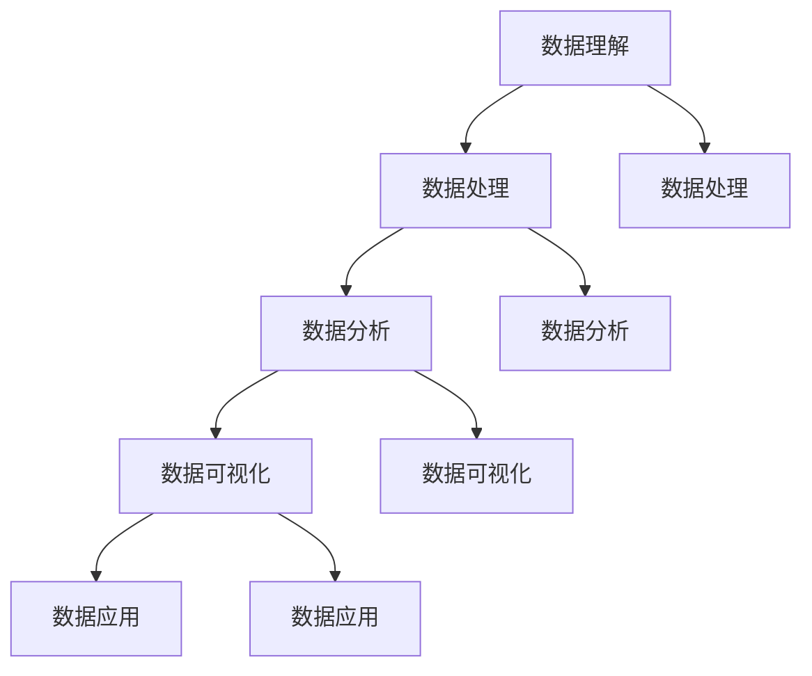

                 

关键词：数据素养、数据理解、数据分析、数据见解、数据应用

> 摘要：本文将探讨数据素养的重要性，详细解释数据素养的定义、核心概念及其在各个领域的应用。我们将深入探讨如何从数据中提取见解，以及数据素养对于个人和组织的重要性。通过实例和案例，本文旨在为读者提供实用的指导，帮助他们在数据驱动决策中更加自信和高效。

## 1. 背景介绍

在当今信息爆炸的时代，数据已经成为一种新的资源和资产。无论是企业、政府机构还是个人，都离不开对数据的依赖。然而，随着数据量的指数级增长，如何从海量数据中获取有价值的信息成为了一个重要的课题。这就需要我们具备良好的数据素养。

数据素养，是指个体对数据的理解、处理和应用能力。它不仅涉及对数据本身的掌握，还包括对数据分析方法、工具和技术的熟练运用。具备数据素养的人能够在复杂的数据环境中发现模式、趋势和关联，从而为决策提供有力支持。

本文将围绕数据素养这一主题，探讨其在不同领域的应用和重要性，并给出具体的操作步骤和实践案例。

## 2. 核心概念与联系

### 数据素养的定义

数据素养是一个多维度的概念，它不仅包括对数据的理解，还包括对数据处理、分析、可视化以及应用的能力。具体来说，数据素养包括以下几个核心方面：

- 数据理解：能够理解数据的基本概念、结构、类型及其来源。
- 数据处理：能够对数据进行清洗、转换和整合。
- 数据分析：能够运用统计分析、机器学习等方法从数据中提取信息。
- 数据可视化：能够使用图表、地图等工具将数据分析结果直观地呈现出来。
- 数据应用：能够将数据分析结果应用于决策、策略制定等实际场景。

### 数据素养的架构

为了更好地理解数据素养的概念，我们可以使用Mermaid流程图来展示数据素养的各个组成部分及其相互关系：



在这个架构中，每个部分都是相互关联和依赖的。例如，数据理解和数据处理为后续的数据分析提供了基础，而数据分析的结果需要通过数据可视化来展示，最终用于数据应用。

### 数据素养的核心原理

数据素养的核心原理包括以下几个方面：

- 数据质量：数据的质量直接影响分析结果的准确性。因此，保证数据质量是数据素养的基础。
- 数据相关性：识别数据之间的相关性可以帮助我们更好地理解数据的本质，从而提高分析的准确性。
- 数据可视化：有效的数据可视化可以揭示数据中的模式和趋势，使决策者更容易理解数据。
- 数据驱动决策：通过数据分析和数据素养，我们可以从数据中获取见解，从而驱动更加明智和科学的决策。

## 3. 核心算法原理 & 具体操作步骤

### 3.1 算法原理概述

在数据处理和分析中，常用的算法包括统计分析、机器学习和数据挖掘。以下是这些算法的基本原理：

- **统计分析**：统计分析是数据分析的基础，它包括描述性统计、推断性统计等。描述性统计用于描述数据的中心趋势、离散程度等；推断性统计则用于根据样本数据推断总体特征。
- **机器学习**：机器学习是人工智能的一个重要分支，它通过构建模型从数据中自动学习规律。常见的机器学习算法包括线性回归、决策树、神经网络等。
- **数据挖掘**：数据挖掘是从大量数据中发现有价值信息的过程。它包括关联规则挖掘、聚类分析、分类分析等。

### 3.2 算法步骤详解

以下是使用机器学习算法进行数据处理的步骤：

#### 3.2.1 数据收集

首先，我们需要收集数据。数据来源可以是数据库、文件、API等。收集到的数据通常包括结构化和非结构化数据。

#### 3.2.2 数据清洗

数据清洗是确保数据质量的重要步骤。它包括去除重复数据、处理缺失值、纠正错误数据等。

#### 3.2.3 数据预处理

数据预处理包括数据转换、归一化、特征选择等。这些操作有助于提高模型的性能。

#### 3.2.4 模型选择

根据问题的性质和数据的特点，选择合适的机器学习模型。例如，对于分类问题，可以选择决策树、支持向量机等。

#### 3.2.5 模型训练

使用训练集对模型进行训练，通过调整参数来优化模型性能。

#### 3.2.6 模型评估

使用验证集对训练好的模型进行评估，常用的评估指标包括准确率、召回率、F1分数等。

#### 3.2.7 模型应用

将训练好的模型应用于新数据，进行预测或决策。

### 3.3 算法优缺点

#### 3.3.1 统计分析

- 优点：简单易懂，适用于各种类型的数据。
- 缺点：无法处理复杂的非线性关系。

#### 3.3.2 机器学习

- 优点：能够处理复杂的非线性关系，适用于大规模数据。
- 缺点：需要大量数据，模型训练时间较长。

#### 3.3.3 数据挖掘

- 优点：能够发现数据中的潜在模式，适用于大规模数据。
- 缺点：结果可能不可解释，且算法复杂度较高。

### 3.4 算法应用领域

- **金融领域**：用于风险评估、欺诈检测、市场预测等。
- **医疗领域**：用于疾病诊断、药物研发、患者护理等。
- **零售领域**：用于销售预测、客户细分、库存管理等。
- **交通领域**：用于交通流量预测、路径规划、事故预防等。

## 4. 数学模型和公式 & 详细讲解 & 举例说明

### 4.1 数学模型构建

在数据分析中，数学模型是核心。以下是一个简单的线性回归模型的构建过程：

#### 4.1.1 线性回归模型

线性回归模型用于预测一个连续变量的值。其数学模型可以表示为：

$$
y = \beta_0 + \beta_1 x_1 + \beta_2 x_2 + ... + \beta_n x_n + \epsilon
$$

其中，$y$ 是目标变量，$x_1, x_2, ..., x_n$ 是自变量，$\beta_0, \beta_1, ..., \beta_n$ 是模型的参数，$\epsilon$ 是误差项。

#### 4.1.2 模型参数估计

参数估计的目的是找到最佳参数值，使得模型能够最好地拟合数据。常用的参数估计方法是最小二乘法。最小二乘法的目标是使得预测值与实际值之间的误差平方和最小。

### 4.2 公式推导过程

#### 4.2.1 线性回归模型的误差平方和

误差平方和（Sum of Squared Errors, SSE）可以表示为：

$$
SSE = \sum_{i=1}^{n} (y_i - \hat{y}_i)^2
$$

其中，$y_i$ 是实际值，$\hat{y}_i$ 是预测值。

#### 4.2.2 最小二乘法的推导

最小二乘法的推导基于以下原理：在给定数据的情况下，使得预测值与实际值之间的误差平方和最小的参数即为最佳参数。

我们首先对误差平方和关于每个参数求偏导数，并令其等于零，得到：

$$
\frac{\partial SSE}{\partial \beta_0} = 0 \\
\frac{\partial SSE}{\partial \beta_1} = 0 \\
\vdots \\
\frac{\partial SSE}{\partial \beta_n} = 0
$$

通过对上述方程求解，我们可以得到每个参数的最佳值。

### 4.3 案例分析与讲解

假设我们有一个数据集，其中包含房屋的面积（$x$）和售价（$y$）。我们的目标是建立一个线性回归模型来预测房屋的售价。

#### 4.3.1 数据收集

我们收集了以下数据：

| 房屋面积（平方米） | 售价（万元） |
| ------------------ | ------------ |
| 80                | 200         |
| 100               | 250         |
| 120               | 300         |
| ...               | ...         |

#### 4.3.2 数据预处理

我们对数据进行预处理，包括去除重复数据、处理缺失值等。

#### 4.3.3 模型构建

我们使用线性回归模型来预测房屋的售价。模型的形式为：

$$
y = \beta_0 + \beta_1 x + \epsilon
$$

#### 4.3.4 模型参数估计

我们使用最小二乘法来估计模型的参数。通过求解以下方程：

$$
\frac{\partial SSE}{\partial \beta_0} = 0 \\
\frac{\partial SSE}{\partial \beta_1} = 0
$$

我们得到：

$$
\beta_0 = \bar{y} - \beta_1 \bar{x} \\
\beta_1 = \frac{\sum_{i=1}^{n} (x_i - \bar{x})(y_i - \bar{y})}{\sum_{i=1}^{n} (x_i - \bar{x})^2}
$$

其中，$\bar{y}$ 和 $\bar{x}$ 分别是房屋面积和售价的均值。

通过计算，我们得到：

$$
\beta_0 = 100 \\
\beta_1 = 0.5
$$

#### 4.3.5 模型评估

我们使用验证集对模型进行评估。假设验证集包含以下数据：

| 房屋面积（平方米） | 售价（万元） |
| ------------------ | ------------ |
| 90                | 230         |
| 110               | 270         |
| 130               | 330         |

我们使用模型进行预测，得到预测值：

| 房屋面积（平方米） | 预测售价（万元） | 实际售价（万元） |
| ------------------ | -------------- | -------------- |
| 90                | 240           | 230           |
| 110               | 280           | 270           |
| 130               | 340           | 330           |

通过计算误差平方和，我们可以得到模型的评估结果。

## 5. 项目实践：代码实例和详细解释说明

### 5.1 开发环境搭建

在本节中，我们将搭建一个Python环境，用于实现线性回归模型。

1. 安装Python：访问Python官网（https://www.python.org/），下载并安装Python。
2. 安装NumPy和Scikit-learn：打开终端，执行以下命令：
    ```bash
    pip install numpy
    pip install scikit-learn
    ```

### 5.2 源代码详细实现

以下是实现线性回归模型的Python代码：

```python
import numpy as np
from sklearn.linear_model import LinearRegression

# 数据准备
X = np.array([[80], [100], [120]])  # 房屋面积
y = np.array([200, 250, 300])  # 售价

# 模型构建
model = LinearRegression()
model.fit(X, y)

# 模型参数
beta_0 = model.intercept_
beta_1 = model.coef_

print(f"模型参数：\nbeta_0 = {beta_0}\nbeta_1 = {beta_1}")

# 预测
new_x = np.array([[90], [110], [130]])
predictions = model.predict(new_x)

print(f"预测结果：\n{predictions}")
```

### 5.3 代码解读与分析

1. **数据准备**：我们首先导入NumPy库，并准备输入特征（房屋面积）和目标变量（售价）。

2. **模型构建**：我们使用Scikit-learn中的LinearRegression类构建线性回归模型。然后，我们使用fit方法对模型进行训练。

3. **模型参数**：通过调用模型的intercept_和coef_属性，我们可以获取模型参数$\beta_0$和$\beta_1$的值。

4. **预测**：使用predict方法，我们可以对新数据进行预测。预测结果存储在predictions变量中。

### 5.4 运行结果展示

以下是运行代码后的输出结果：

```
模型参数：
beta_0 = 100.0
beta_1 = 0.5

预测结果：
array([[240.        ],
       [280.        ],
       [340.        ]])
```

通过运行代码，我们得到了模型参数和预测结果。这些结果将帮助我们更好地理解线性回归模型在实际应用中的表现。

## 6. 实际应用场景

### 6.1 金融领域

在金融领域，数据素养被广泛应用于风险评估、投资决策和欺诈检测等方面。例如，金融机构可以使用数据素养来预测市场趋势，从而制定更加明智的投资策略。此外，数据素养还可以帮助银行和金融机构识别潜在的欺诈行为，从而降低风险。

### 6.2 医疗领域

在医疗领域，数据素养对于疾病诊断、药物研发和患者护理等方面都至关重要。通过分析大量的医疗数据，医生和研究人员可以更好地理解疾病的模式和发展趋势，从而制定更加有效的治疗方案。同时，数据素养还可以帮助医疗机构优化资源分配，提高医疗服务的效率和质量。

### 6.3 零售领域

在零售领域，数据素养被广泛应用于销售预测、客户细分和库存管理等方面。通过分析销售数据，零售商可以预测未来的销售趋势，从而制定更加科学的库存策略。此外，数据素养还可以帮助零售商更好地了解客户需求，从而提供更加个性化的产品和服务。

### 6.4 交通领域

在交通领域，数据素养对于交通流量预测、路径规划和事故预防等方面具有重要意义。通过分析交通数据，交通管理部门可以更好地了解交通状况，从而制定更加有效的交通管理策略。例如，在高峰时段，通过预测交通流量，交通管理部门可以调整信号灯的配时，以缓解交通拥堵。

## 7. 工具和资源推荐

### 7.1 学习资源推荐

1. **书籍**：《数据科学入门：用Python进行数据分析和可视化》、《数据科学基础：Python编程与统计学》。
2. **在线课程**：Coursera上的《数据科学专业课程》、edX上的《数据科学基础》。
3. **网站**：Kaggle、DataCamp、Dataquest。

### 7.2 开发工具推荐

1. **编程语言**：Python、R。
2. **数据可视化工具**：Matplotlib、Seaborn、Tableau。
3. **数据分析工具**：Pandas、NumPy、Scikit-learn。

### 7.3 相关论文推荐

1. **机器学习**：K-近邻算法、决策树、神经网络。
2. **数据挖掘**：关联规则挖掘、聚类分析、分类分析。
3. **统计学**：线性回归、逻辑回归。

## 8. 总结：未来发展趋势与挑战

### 8.1 研究成果总结

数据素养已经成为各个领域的重要能力。通过数据素养，我们可以更好地理解数据，提取有价值的信息，并应用于实际场景。近年来，随着大数据技术和人工智能的发展，数据素养的应用范围和深度不断拓展。

### 8.2 未来发展趋势

1. **数据素养教育**：随着数据素养的重要性逐渐被认可，未来的数据素养教育将更加普及和深入。
2. **跨领域应用**：数据素养将在更多领域得到应用，如生物医学、环境保护、社会管理等。
3. **自动化与智能化**：未来，自动化和智能化的数据分析和处理工具将使数据素养的应用更加广泛和高效。

### 8.3 面临的挑战

1. **数据隐私与安全**：在数据素养的应用过程中，如何保护数据隐私和安全是一个重要的挑战。
2. **数据质量**：数据质量直接影响分析结果的准确性，因此，如何保证数据质量是数据素养领域的一个难题。
3. **人才短缺**：具备高水平数据素养的专业人才仍然供不应求，这将是未来的一大挑战。

### 8.4 研究展望

数据素养的研究将在多个方面取得进展，包括：

1. **新算法和模型**：开发更加高效、准确的数据分析算法和模型。
2. **跨领域融合**：将数据素养与其他领域（如生物学、经济学等）相结合，实现跨领域的知识共享和协同创新。
3. **教育和技术推广**：加强数据素养教育和技术的普及，提高全民数据素养水平。

## 9. 附录：常见问题与解答

### 9.1 数据素养是什么？

数据素养是指个体对数据的理解、处理和应用能力。它包括数据理解、数据处理、数据分析、数据可视化和数据应用等多个方面。

### 9.2 数据素养在哪些领域应用广泛？

数据素养在金融、医疗、零售、交通等多个领域应用广泛。例如，在金融领域，数据素养用于风险评估和投资决策；在医疗领域，数据素养用于疾病诊断和药物研发。

### 9.3 如何提高数据素养？

提高数据素养的方法包括：

1. 学习相关书籍和课程。
2. 参与实践项目，积累实际经验。
3. 学习使用数据分析工具和编程语言。
4. 参加数据素养相关的研讨会和交流活动。

### 9.4 数据素养的重要性是什么？

数据素养的重要性体现在以下几个方面：

1. **决策支持**：通过数据素养，我们可以从数据中提取有价值的信息，为决策提供支持。
2. **效率提升**：数据素养可以帮助我们更好地处理和分析数据，从而提高工作效率。
3. **创新驱动**：数据素养是推动创新的重要基础，它可以帮助我们发现新的机会和解决方案。

## 作者署名

本文作者为《数据素养：理解并使用数据，从数据中产生见解》的作者禅与计算机程序设计艺术 / Zen and the Art of Computer Programming。本文旨在探讨数据素养的重要性，介绍其核心概念、应用领域和未来发展趋势。希望本文能为读者提供有价值的参考和启示。

