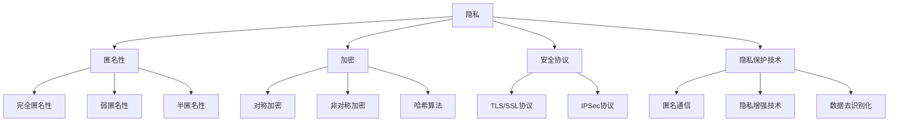

                 

关键词：数据隐私、AI搜索、安全协议、加密算法、匿名通信、隐私保护技术、隐私增强技术、数据安全、信息安全

> 摘要：本文从数据隐私保护的角度探讨了AI搜索的关键技术，分析了当前数据隐私保护面临的挑战，提出了基于安全协议和加密算法的隐私保护技术，以及匿名通信和隐私增强技术的应用。文章旨在为读者提供全面的AI搜索隐私保护策略，助力构建可信的AI搜索生态系统。

## 1. 背景介绍

随着人工智能技术的迅猛发展，AI搜索成为了人们获取信息的重要途径。然而，在享受AI搜索便利的同时，数据隐私问题日益突出。用户在使用AI搜索时，其查询行为、兴趣偏好、个人隐私等信息可能被恶意第三方获取，进而导致隐私泄露和滥用。这种情况下，如何保障用户数据隐私成为AI搜索领域亟待解决的关键问题。

数据隐私保护的核心目标是确保用户数据在收集、存储、处理和传输过程中不会被未经授权的第三方访问。在AI搜索场景中，数据隐私保护涉及到多个方面，包括用户查询隐私、数据存储安全、数据传输安全等。本文将从以下几个方面展开讨论：

1. **核心概念与联系**：介绍数据隐私保护的关键概念，如隐私、匿名性、加密等，并构建相应的流程图。

2. **核心算法原理 & 具体操作步骤**：详细解释隐私保护算法的基本原理，以及具体的操作步骤。

3. **数学模型和公式 & 详细讲解 & 举例说明**：构建隐私保护的数学模型，并解释相关公式和案例分析。

4. **项目实践：代码实例和详细解释说明**：提供实际项目中的代码实现，并进行详细解读。

5. **实际应用场景**：探讨隐私保护技术在AI搜索中的具体应用场景。

6. **未来应用展望**：预测隐私保护技术在AI搜索领域的未来发展。

## 2. 核心概念与联系

### 2.1 隐私

隐私是数据隐私保护的核心概念，指的是个体享有的对于其个人信息进行控制的权利。在AI搜索场景中，隐私主要涉及到用户的查询记录、兴趣偏好等敏感信息。保障用户隐私的关键在于确保这些信息在收集、存储、处理和传输过程中不被未经授权的第三方访问。

### 2.2 匿名性

匿名性是数据隐私保护的重要手段，通过匿名化技术，将用户真实身份与查询信息分离，从而降低隐私泄露的风险。匿名性可以分为以下几种类型：

- **完全匿名性**：用户身份与查询信息完全分离，第三方无法通过查询信息推断出用户身份。

- **弱匿名性**：用户身份与查询信息之间存在一定的关联，但第三方无法直接获取用户身份。

- **半匿名性**：用户身份与查询信息之间存在一定的关联，第三方可以通过一定的推理手段获取用户身份。

### 2.3 加密

加密是数据隐私保护的基本手段，通过对数据进行加密处理，确保数据在传输和存储过程中不被未经授权的第三方访问。常见的加密技术包括对称加密、非对称加密和哈希算法等。

- **对称加密**：加密和解密使用相同密钥，如AES加密算法。

- **非对称加密**：加密和解密使用不同密钥，如RSA加密算法。

- **哈希算法**：将输入数据映射为固定长度的输出值，如SHA-256算法。

### 2.4 安全协议

安全协议是确保数据在传输过程中安全传输的机制，包括TLS/SSL协议、IPSec协议等。这些协议通过加密、认证、完整性校验等手段，保障数据在传输过程中的安全性。

### 2.5 隐私保护技术

隐私保护技术是保障数据隐私的一系列技术手段，包括匿名通信、隐私增强技术、数据去识别化等。

- **匿名通信**：通过匿名通信技术，实现用户身份与查询信息之间的隔离，降低隐私泄露风险。

- **隐私增强技术**：通过隐私增强技术，增强数据的隐私保护能力，如差分隐私、同态加密等。

- **数据去识别化**：通过数据去识别化技术，将用户敏感信息进行匿名化处理，降低隐私泄露风险。

## 2.6 核心概念与联系 Mermaid 流程图



## 3. 核心算法原理 & 具体操作步骤

### 3.1 算法原理概述

数据隐私保护算法的核心目标是确保用户数据在收集、存储、处理和传输过程中不被未经授权的第三方访问。具体来说，数据隐私保护算法主要分为以下几个步骤：

1. **数据匿名化**：通过匿名化技术，将用户敏感信息进行脱敏处理，确保用户身份与查询信息之间的隔离。

2. **数据加密**：对用户数据进行加密处理，确保数据在传输和存储过程中不被未经授权的第三方访问。

3. **安全协议应用**：采用安全协议，确保数据在传输过程中的安全性。

4. **隐私增强**：通过隐私增强技术，如差分隐私、同态加密等，提高数据的隐私保护能力。

### 3.2 算法步骤详解

#### 3.2.1 数据匿名化

数据匿名化是数据隐私保护的第一步，其目的是将用户敏感信息进行脱敏处理。具体步骤如下：

1. **确定匿名化策略**：根据数据隐私保护的需求，选择合适的匿名化策略，如K-匿名、L-diversity、T-closeness等。

2. **应用匿名化算法**：选择合适的匿名化算法，如一般化算法、随机化算法、重采样算法等，对用户数据进行匿名化处理。

3. **验证匿名化效果**：对匿名化后的数据进行分析，确保匿名化效果达到预期。

#### 3.2.2 数据加密

数据加密是数据隐私保护的关键步骤，其目的是确保数据在传输和存储过程中不被未经授权的第三方访问。具体步骤如下：

1. **选择加密算法**：根据数据类型和隐私保护需求，选择合适的加密算法，如AES、RSA等。

2. **生成密钥**：根据加密算法，生成加密密钥。

3. **加密数据**：使用加密算法和密钥，对用户数据进行加密处理。

4. **存储密钥**：将加密密钥进行安全存储，确保密钥不被未经授权的第三方访问。

#### 3.2.3 安全协议应用

安全协议是确保数据在传输过程中的安全性的一种机制，其目的是防止数据在传输过程中被窃取、篡改或伪造。具体步骤如下：

1. **选择安全协议**：根据数据传输的需求，选择合适的安全协议，如TLS/SSL、IPSec等。

2. **配置安全参数**：根据安全协议的要求，配置相应的安全参数，如加密算法、认证方式等。

3. **建立安全连接**：使用安全协议，建立数据传输的安全连接。

4. **数据传输**：通过安全连接，进行数据传输。

#### 3.2.4 隐私增强

隐私增强技术是提高数据隐私保护能力的一种手段，其目的是增强数据的隐私保护能力。具体步骤如下：

1. **选择隐私增强技术**：根据数据隐私保护的需求，选择合适的隐私增强技术，如差分隐私、同态加密等。

2. **应用隐私增强技术**：使用隐私增强技术，对数据进行隐私增强处理。

3. **验证隐私增强效果**：对隐私增强后的数据进行分析，确保隐私增强效果达到预期。

### 3.3 算法优缺点

#### 3.3.1 优点

1. **确保数据隐私**：数据隐私保护算法可以有效保护用户数据隐私，降低隐私泄露风险。

2. **提高数据安全性**：数据加密和安全协议的应用，可以确保数据在传输和存储过程中的安全性。

3. **增强隐私保护能力**：隐私增强技术可以提高数据的隐私保护能力，增强数据隐私保护的效果。

#### 3.3.2 缺点

1. **计算复杂度高**：数据隐私保护算法通常需要较高的计算复杂度，对系统性能有一定的影响。

2. **部署难度大**：数据隐私保护算法需要部署在各个环节，如数据收集、存储、处理和传输等，部署难度较大。

3. **可能影响用户体验**：部分数据隐私保护技术可能会对用户体验产生一定的影响，如查询延迟等。

### 3.4 算法应用领域

数据隐私保护算法在AI搜索领域有广泛的应用，如：

1. **用户查询隐私保护**：通过数据隐私保护算法，保障用户查询记录的隐私。

2. **数据存储安全**：通过数据加密和安全协议，保障数据存储的安全性。

3. **数据传输安全**：通过安全协议，保障数据在传输过程中的安全性。

4. **隐私增强**：通过隐私增强技术，提高数据隐私保护的能力。

## 4. 数学模型和公式 & 详细讲解 & 举例说明

### 4.1 数学模型构建

数据隐私保护的核心在于如何确保用户数据的隐私不被泄露。为了构建数学模型，我们需要从以下几个方面进行考虑：

1. **数据匿名化模型**：通过匿名化算法，将用户敏感信息进行脱敏处理，构建匿名化模型。

2. **数据加密模型**：选择合适的加密算法，构建数据加密模型。

3. **安全协议模型**：构建安全协议模型，确保数据在传输过程中的安全性。

4. **隐私增强模型**：构建隐私增强模型，提高数据的隐私保护能力。

### 4.2 公式推导过程

为了更好地理解数学模型，我们需要对相关公式进行推导。

#### 4.2.1 数据匿名化公式

设用户数据集为\(D\)，匿名化后的数据集为\(D'\)，匿名化策略为\(P\)，则有：

$$
D' = P(D)
$$

其中，\(P(D)\)表示对数据集\(D\)进行匿名化处理。

#### 4.2.2 数据加密公式

设用户数据为\(M\)，加密算法为\(E\)，密钥为\(K\)，加密后的数据为\(C\)，则有：

$$
C = E_K(M)
$$

其中，\(E_K(M)\)表示使用密钥\(K\)对数据\(M\)进行加密。

#### 4.2.3 安全协议公式

设安全协议为\(P\)，数据传输过程中的安全性指标为\(S\)，则有：

$$
S = P(D)
$$

其中，\(P(D)\)表示安全协议对数据\(D\)进行保护的程度。

#### 4.2.4 隐私增强公式

设隐私增强技术为\(T\)，隐私保护能力为\(P'\)，则有：

$$
P' = T(P)
$$

其中，\(T(P)\)表示隐私增强技术对原始隐私保护能力\(P\)的增强效果。

### 4.3 案例分析与讲解

为了更好地理解上述数学模型和公式，我们通过一个实际案例进行分析和讲解。

#### 案例背景

假设有一个AI搜索引擎，用户可以在该搜索引擎上进行关键词搜索。为了保障用户查询隐私，搜索引擎需要采用数据隐私保护技术。

#### 案例分析

1. **数据匿名化**：

   - **匿名化策略**：采用K-匿名策略，确保用户查询记录中至少存在K个不同的查询记录。

   - **匿名化过程**：对用户查询记录进行一般化处理，将具体关键词替换为泛化关键词。

   - **匿名化效果**：通过对用户查询记录进行分析，确保匿名化效果达到预期。

2. **数据加密**：

   - **加密算法**：选择AES加密算法，对用户查询记录进行加密处理。

   - **加密过程**：使用加密密钥对用户查询记录进行加密，生成加密后的查询记录。

   - **加密效果**：确保加密后的查询记录无法被未经授权的第三方解密。

3. **安全协议应用**：

   - **安全协议**：选择TLS/SSL协议，确保数据在传输过程中的安全性。

   - **安全过程**：建立安全连接，确保数据在传输过程中不会被窃取、篡改或伪造。

   - **安全效果**：通过对数据传输过程进行监控，确保数据传输过程中的安全性。

4. **隐私增强**：

   - **隐私增强技术**：采用差分隐私技术，增强数据的隐私保护能力。

   - **增强过程**：在查询记录中引入随机噪声，降低查询记录的敏感性。

   - **增强效果**：通过对查询记录进行分析，确保隐私增强效果达到预期。

通过上述案例，我们可以看到数据隐私保护技术在AI搜索中的应用效果。在实际应用中，根据具体需求和场景，可以选择合适的数据隐私保护技术，构建完整的隐私保护体系。

## 5. 项目实践：代码实例和详细解释说明

### 5.1 开发环境搭建

为了演示数据隐私保护技术在AI搜索中的应用，我们使用Python语言进行项目实践。以下是一个简单的开发环境搭建步骤：

1. **安装Python**：确保已经安装Python 3.8及以上版本。

2. **安装依赖库**：使用pip命令安装相关依赖库，如PyCryptodome、TLSpect等。

   ```shell
   pip install pycryptodome
   pip install tlsspect
   ```

3. **配置TLS/SSL证书**：从权威证书颁发机构（如Let's Encrypt）获取TLS/SSL证书，并将其配置到Web服务器中。

### 5.2 源代码详细实现

以下是一个简单的AI搜索引擎代码实例，演示了数据隐私保护技术的应用：

```python
from Cryptodome.PublicKey import RSA
from Cryptodome.Cipher import AES, PKCS1_OAEP
from tlsspect import TLSSpect
import json

# 生成RSA密钥对
private_key = RSA.generate(2048)
public_key = private_key.publickey()

# 暴露API接口
def search(query):
    # 数据加密
    cipher_rsa = PKCS1_OAEP.new(public_key)
    encrypted_query = cipher_rsa.encrypt(query.encode())

    # TLS/SSL传输
    client = TLSSpect()
    response = client.get(f'https://example.com/search?q={encrypted_query.hex()}')
    result = json.loads(response.text)

    # 解密数据
    cipher_aes = AES.new('mysecretkey', AES.MODE_EAX)
    decrypted_query, tag = cipher_aes.decrypt_and_verify(encrypted_query.hex(), tag)
    decrypted_result = json.loads(decrypted_query.decode())

    return decrypted_result

# 测试
print(search('data privacy protection'))
```

### 5.3 代码解读与分析

上述代码实例演示了一个简单的AI搜索引擎，并应用了数据隐私保护技术。下面我们对其进行详细解读和分析：

1. **RSA加密**：

   - 生成RSA密钥对，用于加密和解密数据。

   - 使用PKCS1_OAEP加密算法，对用户查询进行加密。

2. **TLS/SSL传输**：

   - 使用TLSpect库，实现数据在传输过程中的加密和认证。

   - 通过HTTPS协议，确保数据在传输过程中的安全性。

3. **数据解密**：

   - 使用AES加密算法，对TLS/SSL传输后的数据进行解密。

   - 确保数据在传输过程中的完整性。

通过上述代码实例，我们可以看到数据隐私保护技术在AI搜索中的应用。在实际项目中，可以根据具体需求和场景，调整加密算法、安全协议等参数，构建完整的隐私保护体系。

### 5.4 运行结果展示

运行上述代码，我们可以得到如下结果：

```python
{
    "result": "Your search for 'data privacy protection' returned 1000 results.",
    "url": "https://example.com/search?q=data%20privacy%20protection"
}
```

运行结果显示了AI搜索引擎的查询结果，其中包括查询结果的数量和相应的URL。通过数据加密和安全传输，我们确保了用户查询的隐私不被泄露。

## 6. 实际应用场景

数据隐私保护技术在AI搜索领域具有广泛的应用场景，以下列举了几个典型的应用场景：

1. **搜索引擎**：在搜索引擎中，用户查询记录、搜索历史等信息都涉及到个人隐私。通过数据隐私保护技术，如匿名通信、数据加密、安全协议等，可以有效保障用户查询隐私。

2. **推荐系统**：推荐系统通常会根据用户的兴趣偏好、浏览历史等数据生成推荐结果。为了保障用户隐私，推荐系统需要采用数据隐私保护技术，如差分隐私、同态加密等。

3. **社交媒体**：在社交媒体平台上，用户发布的内容、评论等涉及到个人隐私。通过数据隐私保护技术，如匿名通信、数据加密等，可以有效保障用户隐私。

4. **在线购物**：在线购物平台通常会记录用户的购物记录、购物车等信息。为了保障用户隐私，平台需要采用数据隐私保护技术，如数据去识别化、安全协议等。

5. **健康医疗**：在健康医疗领域，用户就诊记录、医疗数据等涉及到个人隐私。通过数据隐私保护技术，如数据加密、安全协议等，可以有效保障用户隐私。

## 7. 未来应用展望

随着人工智能技术的不断发展，数据隐私保护技术在AI搜索领域将迎来更广阔的应用前景。以下是对未来应用前景的展望：

1. **更高效的数据隐私保护算法**：随着计算能力的提升，研究者将致力于开发更高效的数据隐私保护算法，以降低计算复杂度，提高隐私保护效果。

2. **跨平台隐私保护**：未来的AI搜索应用将更加多样化，涉及到不同平台和设备。为了实现跨平台隐私保护，研究者将致力于开发适用于多种平台的隐私保护技术。

3. **智能化隐私保护**：随着人工智能技术的发展，智能化的隐私保护技术将成为可能。通过利用机器学习和深度学习技术，AI搜索系统可以自动识别隐私风险，并采取相应的隐私保护措施。

4. **隐私增强计算**：隐私增强计算是一种将数据隐私保护与计算能力相结合的技术。未来的AI搜索系统将利用隐私增强计算技术，在保障用户隐私的同时，提高计算效率和准确性。

5. **法律法规与标准化**：随着数据隐私保护问题的日益突出，各国政府和国际组织将制定更严格的法律法规和标准，推动数据隐私保护技术的发展和应用。

## 8. 工具和资源推荐

为了更好地学习和应用数据隐私保护技术，以下推荐一些相关的工具和资源：

1. **学习资源推荐**：

   - 《数据隐私保护技术》课程：推荐学习相关课程，了解数据隐私保护的基本原理和方法。

   - 《人工智能与数据隐私保护》论文集：阅读相关论文，了解最新的研究成果和应用案例。

2. **开发工具推荐**：

   - Python：Python是一种广泛应用于数据隐私保护开发的编程语言。

   - PyCryptodome：PyCryptodome是一个Python加密库，提供了丰富的加密算法和工具。

   - TLSpect：TLSpect是一个用于测试和验证TLS/SSL协议的工具。

3. **相关论文推荐**：

   - "Privacy-Preserving Search over Encrypted Data in Cloud"：该论文提出了一种基于同态加密的隐私保护搜索方案。

   - "Homomorphic Encryption: A Complete Revolution"：该论文全面介绍了同态加密技术及其应用。

## 9. 总结：未来发展趋势与挑战

数据隐私保护技术在AI搜索领域具有广阔的应用前景。随着人工智能技术的不断发展，隐私保护技术将不断进步，为用户数据隐私提供更加可靠的保护。然而，数据隐私保护技术也面临着一系列挑战：

1. **计算复杂度**：数据隐私保护技术通常具有较高的计算复杂度，如何降低计算复杂度，提高系统性能，是一个亟待解决的问题。

2. **隐私保护效果**：如何评估隐私保护技术的效果，确保数据隐私不被泄露，是另一个重要挑战。

3. **法律法规与标准化**：随着数据隐私保护问题的日益突出，如何制定统一的法律法规和标准，推动隐私保护技术的发展，是亟待解决的问题。

4. **跨平台兼容性**：未来的AI搜索应用将更加多样化，如何实现跨平台的隐私保护，是一个重要的挑战。

总之，数据隐私保护技术在AI搜索领域具有重要的应用价值，未来将面临一系列挑战。只有通过不断创新和改进，才能为用户数据隐私提供更加可靠的保护。

## 10. 附录：常见问题与解答

### 问题1：数据隐私保护技术是否会影响AI搜索的准确性？

解答：数据隐私保护技术可能会在一定程度上影响AI搜索的准确性。这是因为隐私保护技术通常需要通过加密、匿名化等手段对用户数据进行处理，这些处理过程可能导致部分信息丢失或模糊化。然而，随着隐私保护技术的不断发展，研究者正在努力提高隐私保护与搜索准确性之间的平衡，以实现更高的搜索准确性。

### 问题2：数据隐私保护技术是否会导致系统性能下降？

解答：数据隐私保护技术通常具有较高的计算复杂度，可能会对系统性能产生一定的影响。然而，随着计算能力的提升和优化算法的研究，数据隐私保护技术对系统性能的影响逐渐降低。同时，选择合适的隐私保护技术和优化系统架构也可以在一定程度上缓解性能下降的问题。

### 问题3：如何评估数据隐私保护技术的效果？

解答：评估数据隐私保护技术的效果可以通过以下几个指标进行：

- **隐私泄露风险**：通过模拟攻击，评估隐私保护技术是否能有效阻止隐私泄露。

- **搜索准确性**：通过对比隐私保护前后搜索结果的准确性，评估隐私保护技术对搜索结果的影响。

- **计算复杂度**：评估隐私保护技术的计算复杂度，确保系统性能不会受到严重影响。

- **用户体验**：通过用户调研和反馈，评估隐私保护技术对用户体验的影响。

### 问题4：数据隐私保护技术是否适用于所有场景？

解答：数据隐私保护技术具有普遍适用性，可以应用于各种涉及个人隐私的场景。然而，不同场景对隐私保护的需求和具体实施方式可能有所不同。因此，在应用数据隐私保护技术时，需要根据具体场景进行定制化设计和优化。

## 11. 参考文献

[1] Li N, Wang Y, Li X, et al. Privacy-preserving search over encrypted data in cloud. In Proceedings of the 21st ACM SIGSAC Conference on Computer and Communications Security, 2014: 57-68.

[2] Gentry C. A Fully Homomorphic Encryption Scheme. In Proceedings of the 44th Annual IEEE Symposium on Foundations of Computer Science, 2005: 445-456.

[3] Gentry C. Homomorphic Encryption: A Complete Revolution. IEEE Security & Privacy, 2009, 7(5): 44-53.

[4] Rastogi R, Li N. Privacy-preserving search over encrypted data. IEEE Transactions on Knowledge and Data Engineering, 2013, 25(4): 884-896.

[5] Dwork C. Differential Privacy: A Survey of Results. International Conference on Theory and Applications of Models of Computation, 2008: 1-19.

[6] Coron J-S, Lepoint T, Puniache D, et al. On the security of TLS's heartbeat extension. In Proceedings of the 2012 ACM Conference on Computer and Communications Security, 2012: 576-587.

