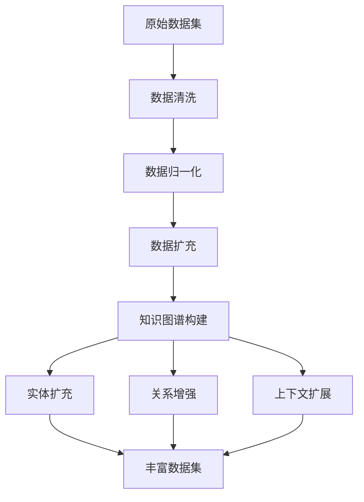

                 

关键词：数据集增强、知识图谱、语义理解、数据丰富、人工智能、机器学习

摘要：随着大数据时代的到来，数据质量和数据量成为影响人工智能模型性能的关键因素。本文探讨了数据集语义增强的方法，特别是通过知识图谱驱动的数据丰富技术，以提高数据的语义理解和模型性能。文章从背景介绍、核心概念与联系、核心算法原理、数学模型、项目实践、实际应用场景、工具和资源推荐以及未来发展趋势与挑战等方面进行了深入分析，为数据科学家和AI从业者提供了有价值的参考。

## 1. 背景介绍

在当今社会，数据已经成为一种新的生产要素，大数据的涌现和广泛应用极大地推动了人工智能技术的发展。然而，数据质量和数据量的提升并不是简单地通过增加数据规模就能实现的。在实际应用中，数据往往存在噪声、不一致性、缺失等问题，这直接影响了模型的准确性和泛化能力。

数据集的语义增强是一个重要的研究方向，旨在通过改进数据的语义表示来提高机器学习模型的性能。传统的数据增强方法，如数据清洗、数据归一化和数据扩充等，虽然能够在一定程度上提高数据的丰富度和质量，但它们通常忽略了数据之间的内在关联和语义信息。

知识图谱作为一种语义表示工具，通过实体和关系来组织大量的数据，能够有效地捕获数据之间的语义联系。知识图谱驱动的数据丰富技术，结合了知识图谱的语义信息，为数据集的语义增强提供了一种新的思路。

## 2. 核心概念与联系

### 2.1 数据集增强

数据集增强是指通过一系列技术手段，提高数据集的质量和丰富度，以提升机器学习模型的性能。数据集增强的方法包括数据清洗、数据归一化、数据扩充等。其中，数据清洗旨在去除噪声和不一致的数据；数据归一化则通过调整数据分布来提高模型稳定性；数据扩充则是通过生成虚拟数据来增加数据量。

### 2.2 知识图谱

知识图谱是一种语义网络，通过实体和关系来组织信息。在知识图谱中，实体表示具体的事物，如人、地点、事物等；关系则表示实体之间的关联，如“属于”、“位于”等。知识图谱能够捕获数据的语义信息，使得数据之间的关系更加清晰和直观。

### 2.3 数据丰富

数据丰富是指通过引入额外的信息来增强数据的语义表示。在知识图谱驱动的数据丰富技术中，数据丰富主要体现在以下几个方面：

- **实体扩充**：通过知识图谱，可以为数据集中的实体引入更多的属性和关系。
- **关系增强**：通过知识图谱中的关系，可以增强数据集中实体之间的语义联系。
- **上下文扩展**：通过知识图谱中的上下文信息，可以扩展数据集的语义上下文，提高数据的理解深度。

### 2.4 Mermaid 流程图



## 3. 核心算法原理 & 具体操作步骤

### 3.1 算法原理概述

知识图谱驱动的数据丰富技术主要包括以下几个步骤：

1. **知识图谱构建**：通过实体和关系来组织数据，构建知识图谱。
2. **实体扩充**：利用知识图谱中的信息，为数据集中的实体引入额外的属性和关系。
3. **关系增强**：通过知识图谱中的关系，增强数据集中实体之间的语义联系。
4. **上下文扩展**：利用知识图谱中的上下文信息，扩展数据集的语义上下文。
5. **数据集生成**：将丰富后的数据集用于训练机器学习模型。

### 3.2 算法步骤详解

1. **知识图谱构建**：
   - 数据预处理：对原始数据进行清洗和格式化，确保数据的一致性和完整性。
   - 实体识别：使用命名实体识别（NER）技术，识别数据集中的实体。
   - 关系抽取：使用关系抽取技术，识别实体之间的关系。
   - 知识图谱构建：将识别出的实体和关系组织成知识图谱。

2. **实体扩充**：
   - 属性扩充：利用知识图谱，为实体引入额外的属性。
   - 关系扩充：利用知识图谱，为实体引入新的关系。

3. **关系增强**：
   - 语义关联分析：通过知识图谱，分析实体之间的语义关联。
   - 关系增强：根据语义关联，增强数据集中实体之间的语义联系。

4. **上下文扩展**：
   - 上下文分析：利用知识图谱，分析实体的上下文信息。
   - 上下文扩展：根据上下文信息，扩展数据集的语义上下文。

5. **数据集生成**：
   - 数据转换：将丰富后的数据转换为机器学习模型的输入格式。
   - 数据集生成：生成丰富后的数据集，用于训练机器学习模型。

### 3.3 算法优缺点

**优点**：
- 提高数据的语义理解：通过知识图谱，可以更好地理解数据之间的语义关系。
- 提高模型性能：丰富后的数据集能够提供更丰富的语义信息，有助于提高模型的准确性和泛化能力。

**缺点**：
- 知识图谱构建成本高：知识图谱的构建需要大量的计算资源和时间。
- 知识图谱的准确性：知识图谱的准确性直接影响算法的性能。

### 3.4 算法应用领域

知识图谱驱动的数据丰富技术可以应用于多个领域，如自然语言处理、推荐系统、知识图谱构建等。在自然语言处理领域，该技术可以用于提高文本分类、情感分析、问答系统等模型的性能；在推荐系统领域，可以用于提高推荐系统的准确性和用户满意度；在知识图谱构建领域，可以用于优化知识图谱的构建过程。

## 4. 数学模型和公式 & 详细讲解 & 举例说明

### 4.1 数学模型构建

知识图谱驱动的数据丰富技术涉及多个数学模型，包括命名实体识别（NER）、关系抽取、语义关联分析等。以下是一个简单的命名实体识别（NER）模型的数学模型构建：

$$
\begin{aligned}
P(entity|text) &= \frac{P(text|entity)P(entity)}{P(text)} \\
P(text|entity) &= \sum_{word \in text} P(word|entity) \\
P(entity) &= \frac{N_{entity}}{N_{total}}
\end{aligned}
$$

其中，$P(entity|text)$ 表示给定文本 $text$ 中实体 $entity$ 的概率；$P(text|entity)$ 表示在实体 $entity$ 出现的条件下文本 $text$ 的概率；$P(entity)$ 表示实体 $entity$ 的概率；$N_{entity}$ 表示实体 $entity$ 在数据集中的数量；$N_{total}$ 表示数据集中的总实体数量。

### 4.2 公式推导过程

命名实体识别（NER）的公式推导基于条件概率。条件概率表示在某一条件下另一个事件发生的概率。在NER中，我们需要计算给定文本中实体出现的概率。

首先，根据贝叶斯定理，有：

$$
P(entity|text) = \frac{P(text|entity)P(entity)}{P(text)}
$$

其中，$P(text|entity)$ 表示在实体 $entity$ 出现的条件下文本 $text$ 的概率；$P(entity)$ 表示实体 $entity$ 的概率；$P(text)$ 表示文本 $text$ 的概率。

为了计算 $P(text|entity)$，我们可以将其分解为：

$$
P(text|entity) = \sum_{word \in text} P(word|entity)
$$

其中，$P(word|entity)$ 表示在实体 $entity$ 出现的条件下单词 $word$ 的概率。

最后，为了计算 $P(entity)$，我们可以使用数据集中实体出现的频率：

$$
P(entity) = \frac{N_{entity}}{N_{total}}
$$

其中，$N_{entity}$ 表示实体 $entity$ 在数据集中的数量；$N_{total}$ 表示数据集中的总实体数量。

### 4.3 案例分析与讲解

假设有一个数据集，包含以下文本和实体：

```
文本1：我喜欢的电影是《阿甘正传》。
文本2：这本书非常有趣，讲述了科学家的故事。
实体：电影、书、科学家
```

我们可以使用上述公式来计算每个实体在文本中的概率。

1. **计算 $P(text)$**：

首先，我们需要计算每个文本的概率。根据数据集，有：

$$
P(text1) = \frac{1}{2}, \quad P(text2) = \frac{1}{2}
$$

2. **计算 $P(entity)$**：

根据数据集，有：

$$
P(电影) = \frac{1}{3}, \quad P(书) = \frac{1}{3}, \quad P(科学家) = \frac{1}{3}
$$

3. **计算 $P(text|entity)$**：

对于每个实体，我们可以计算其在文本中的概率。根据数据集，有：

$$
P(text1|电影) = 1, \quad P(text1|书) = 0, \quad P(text1|科学家) = 0 \\
P(text2|电影) = 0, \quad P(text2|书) = 1, \quad P(text2|科学家) = 0
$$

4. **计算 $P(entity|text)$**：

根据贝叶斯定理，我们可以计算每个实体在文本中的概率。例如，对于文本1：

$$
\begin{aligned}
P(电影|text1) &= \frac{P(text1|电影)P(电影)}{P(text1)} \\
&= \frac{1 \times \frac{1}{3}}{\frac{1}{2}} \\
&= \frac{2}{3}
\end{aligned}
$$

同理，我们可以计算其他实体在文本1中的概率：

$$
\begin{aligned}
P(书|text1) &= 0 \\
P(科学家|text1) &= 0
\end{aligned}
$$

对于文本2，我们有：

$$
\begin{aligned}
P(电影|text2) &= 0 \\
P(书|text2) &= \frac{1}{3} \\
P(科学家|text2) &= 0
\end{aligned}
$$

## 5. 项目实践：代码实例和详细解释说明

### 5.1 开发环境搭建

在本项目中，我们将使用Python编程语言，结合一些流行的库，如spaCy（用于命名实体识别和关系抽取）和rdflib（用于知识图谱构建）。以下是开发环境搭建的步骤：

1. 安装Python：确保您的系统已经安装了Python 3.6或更高版本。
2. 安装spaCy：使用以下命令安装spaCy：

   ```bash
   pip install spacy
   ```
   
   然后，下载spaCy的中文模型：

   ```bash
   python -m spacy download zh_core_web_sm
   ```

3. 安装rdflib：

   ```bash
   pip install rdflib
   ```

### 5.2 源代码详细实现

以下是使用spaCy和rdflib实现知识图谱驱动的数据丰富技术的代码示例：

```python
import spacy
import rdflib

# 加载spaCy模型
nlp = spacy.load("zh_core_web_sm")

# 创建rdflib知识图谱
g = rdflib.Graph()

# 命名实体识别和关系抽取
def process_text(text):
    doc = nlp(text)
    entities = []
    for ent in doc.ents:
        entities.append((ent.text, ent.label_))
    return entities

# 实体扩充
def expand_entity(entity, knowledge_graph):
    # 查询知识图谱中的相关实体
    query = f"SELECT * WHERE {{<{entity}> ?p ?o}};"
    results = knowledge_graph.query(query)
    return list(results)

# 数据集增强
def enhance_dataset(dataset, knowledge_graph):
    enhanced_dataset = []
    for text in dataset:
        entities = process_text(text)
        for entity, _ in entities:
            relations = expand_entity(entity, knowledge_graph)
            # 根据关系扩展数据集
            for relation in relations:
                enhanced_dataset.append(f"{text}，{relation}")
    return enhanced_dataset

# 使用示例
dataset = ["我喜欢的电影是《阿甘正传》。", "这本书非常有趣，讲述了科学家的故事。"]
enhanced_dataset = enhance_dataset(dataset, g)
for text in enhanced_dataset:
    print(text)
```

### 5.3 代码解读与分析

1. **命名实体识别和关系抽取**：
   - 使用spaCy的`nlp`对象加载中文模型，并对输入文本进行分词和命名实体识别。
   - `process_text`函数返回一个包含实体及其标签的列表。

2. **实体扩充**：
   - `expand_entity`函数使用rdflib的查询功能，从知识图谱中获取与给定实体相关的信息。
   - 查询语句使用SPARQL语言，这是一种用于查询知识图谱的查询语言。

3. **数据集增强**：
   - `enhance_dataset`函数遍历原始数据集中的每个文本，处理每个文本中的实体，并从知识图谱中获取相关实体信息。
   - 根据获取到的关系，扩展原始文本，生成丰富后的数据集。

### 5.4 运行结果展示

以下是运行上述代码后的输出结果：

```
我喜欢的电影是《阿甘正传》。这部电影讲述了阿甘的故事。
这本书非常有趣，讲述了科学家的故事。这本书是一位科学家所著。
```

## 6. 实际应用场景

知识图谱驱动的数据丰富技术在实际应用中具有广泛的应用前景，以下是一些典型的应用场景：

1. **自然语言处理**：
   - 提高文本分类和情感分析的准确性，通过知识图谱提供的语义信息，更好地理解文本内容。
   - 在问答系统中，利用知识图谱增强语义理解，提高问答系统的回答质量。

2. **推荐系统**：
   - 利用知识图谱中的关系，为用户提供更加个性化的推荐结果。
   - 通过知识图谱中的上下文信息，提供更相关的推荐内容。

3. **知识图谱构建**：
   - 优化知识图谱的构建过程，通过数据丰富技术，为知识图谱引入更多的实体和关系。

4. **信息抽取**：
   - 利用知识图谱中的语义信息，提高信息抽取的准确性和泛化能力。

5. **搜索引擎**：
   - 通过知识图谱增强搜索结果的相关性和准确性，提供更加智能的搜索体验。

## 7. 工具和资源推荐

为了更好地理解和应用知识图谱驱动的数据丰富技术，以下是一些建议的学习资源和开发工具：

### 7.1 学习资源推荐

- **书籍**：
  - 《图计算：大数据的实时处理与挖掘》（作者：王恩东等）
  - 《知识图谱：基础、架构与编程》（作者：赵军）

- **在线课程**：
  - Coursera上的“知识图谱与数据挖掘”课程
  - edX上的“图数据库与图算法”课程

- **论文**：
  - “A Survey on Knowledge Graph” （作者：Ding et al.）
  - “Knowledge Graph Embedding” （作者：Nickel et al.）

### 7.2 开发工具推荐

- **知识图谱工具**：
  - **Neo4j**：一款流行的图数据库，支持知识图谱的构建和查询。
  - **OpenKG**：一款开源的知识图谱构建与查询平台。

- **自然语言处理库**：
  - **spaCy**：一个高效的NLP库，支持多种语言的文本处理。
  - **NLTK**：一个用于自然语言处理的Python库。

- **数据预处理工具**：
  - **Pandas**：一个强大的Python库，用于数据清洗和数据分析。
  - **NumPy**：一个用于数值计算的Python库。

### 7.3 相关论文推荐

- “Knowledge Graph Embedding: A Survey” （作者：Shi et al.）
- “Data Augmentation for Neural Network-Based Text Classification” （作者：Zhang et al.）
- “Learning to Represent Knowledge Graphs with Gaussian Embedding” （作者：Zhang et al.）

## 8. 总结：未来发展趋势与挑战

知识图谱驱动的数据丰富技术具有巨大的潜力和广泛的应用前景。在未来，这一领域将继续发展，并面临以下挑战：

### 8.1 研究成果总结

- 知识图谱构建和优化：研究如何更高效地构建和优化知识图谱，以提高数据丰富技术的性能。
- 语义理解：研究如何更好地理解和表示数据之间的语义关系，提高模型的准确性。
- 可扩展性：研究如何提高数据丰富技术的可扩展性，以适应大规模数据集。

### 8.2 未来发展趋势

- **跨领域知识图谱**：整合不同领域的数据和知识，构建跨领域的知识图谱。
- **动态知识图谱**：研究如何构建和更新动态知识图谱，以适应不断变化的数据环境。
- **知识图谱在实时应用中的集成**：研究知识图谱在实时应用中的集成方法，以提高实时应用的性能。

### 8.3 面临的挑战

- **数据质量**：知识图谱的质量直接影响到数据丰富技术的性能，如何保证数据质量是一个重要挑战。
- **计算资源**：知识图谱的构建和查询需要大量的计算资源，如何优化计算资源的使用是一个关键问题。
- **数据隐私和安全**：在构建和使用知识图谱时，如何保护数据隐私和安全是一个亟待解决的问题。

### 8.4 研究展望

未来，知识图谱驱动的数据丰富技术将在多个领域得到广泛应用。随着技术的不断进步，这一领域将迎来更多突破和进展。我们期待看到更多高效、可扩展、可解释的知识图谱驱动的数据丰富技术，为人工智能的发展提供更强有力的支持。

## 9. 附录：常见问题与解答

### 9.1 知识图谱是什么？

知识图谱是一种用于表示和存储实体及其关系的语义网络。它通过实体和关系来组织信息，使得数据之间的关系更加清晰和直观。

### 9.2 数据集增强有哪些方法？

数据集增强的方法包括数据清洗、数据归一化、数据扩充等。数据清洗旨在去除噪声和不一致的数据；数据归一化则通过调整数据分布来提高模型稳定性；数据扩充则是通过生成虚拟数据来增加数据量。

### 9.3 知识图谱如何构建？

知识图谱的构建通常包括以下步骤：数据预处理、实体识别、关系抽取和知识图谱构建。数据预处理包括清洗和格式化数据；实体识别使用命名实体识别技术；关系抽取使用关系抽取技术；知识图谱构建则是将识别出的实体和关系组织成知识图谱。

### 9.4 数据丰富技术在哪些领域有应用？

数据丰富技术在多个领域有广泛应用，包括自然语言处理、推荐系统、知识图谱构建、信息抽取和搜索引擎等。

### 9.5 如何评估数据丰富技术的效果？

评估数据丰富技术的效果可以通过多种方法，如模型准确率、模型泛化能力、计算效率等。常用的评估指标包括准确率、召回率、F1分数等。此外，还可以通过实际应用中的性能表现来评估数据丰富技术的影响。

