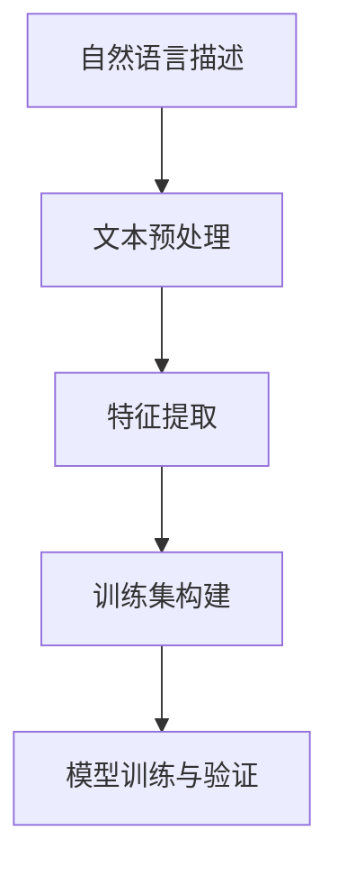

                 

 关键词：数据集转换、自然语言处理、机器学习、训练集、数据预处理

> 摘要：本文将探讨如何将自然语言描述转换为机器学习训练集，从而提升模型训练的准确性和效率。我们将深入分析数据集转换的核心概念、算法原理、数学模型，并通过实际项目实践展示如何实现这一过程。

## 1. 背景介绍

在当今大数据和人工智能的时代，数据集的质量直接影响到机器学习模型的性能。然而，大多数机器学习任务需要大量的标注数据，这往往是一个耗时且成本高昂的过程。为了解决这一问题，自然语言描述的数据集转换技术应运而生。这项技术能够将人类语言描述转换成机器可处理的训练数据，从而降低数据标注的工作量，提高模型训练的效率。

本文旨在探讨数据集转换的整个过程，从自然语言描述到训练集的转换方法，以及这一技术在各个领域中的应用。

## 2. 核心概念与联系

### 2.1 数据集转换的必要性

在传统的机器学习过程中，数据集通常需要经过预处理、特征提取、训练和验证等多个步骤。然而，这些步骤在处理自然语言数据时显得尤为复杂和耗时。自然语言数据的形式多样，包括文本、音频、图像等，因此需要特定的方法来进行处理。

数据集转换的必要性体现在以下几个方面：

1. **降低人力成本**：通过自动化的方式将自然语言描述转换为训练集，可以大幅减少数据标注的时间和人力成本。
2. **提高训练效率**：自动生成的训练集可以快速用于模型训练，缩短开发周期。
3. **增强模型泛化能力**：通过转换不同形式的自然语言描述，可以丰富数据集，提升模型的泛化能力。

### 2.2 数据集转换的核心概念

数据集转换的核心概念包括：

- **自然语言处理（NLP）**：NLP是使计算机理解和处理人类语言的技术，包括文本分析、语义理解、情感分析等。
- **特征工程**：特征工程是将原始数据转换为可用于训练的模型特征的过程，对于自然语言数据，特征工程通常包括词袋模型、TF-IDF、词嵌入等。
- **数据标注**：数据标注是提供正确标签的过程，但在数据集转换中，通过自动化的方式减少了对标注的依赖。

### 2.3 数据集转换的架构

以下是数据集转换的一般架构：

```
自然语言描述
  ↓
文本预处理
  ↓
特征提取
  ↓
训练集构建
  ↓
模型训练与验证
```

### 2.4 Mermaid 流程图



## 3. 核心算法原理 & 具体操作步骤

### 3.1 算法原理概述

数据集转换的算法原理主要包括以下几个步骤：

1. **文本预处理**：对自然语言描述进行清洗和格式化，去除噪声和无关信息。
2. **特征提取**：将预处理后的文本转换为机器可处理的特征表示。
3. **训练集构建**：将特征表示和对应的标签组合成训练集。

### 3.2 算法步骤详解

#### 3.2.1 文本预处理

文本预处理的主要步骤包括：

- **分词**：将文本拆分为单词或词组。
- **去停用词**：去除对模型训练贡献不大的常见词，如“的”、“了”等。
- **词性标注**：标记每个词的词性，如名词、动词等。

#### 3.2.2 特征提取

特征提取的常见方法包括：

- **词袋模型**：将文本表示为一个向量，每个维度对应一个词汇。
- **TF-IDF**：基于词频和文档频率计算词的重要性。
- **词嵌入**：将词映射到高维空间中，以捕获词的语义信息。

#### 3.2.3 训练集构建

训练集构建的步骤包括：

- **特征表示**：将预处理和特征提取的结果转换为特征向量。
- **标签准备**：根据任务需求准备对应的标签。
- **数据组合**：将特征向量和标签组合成训练集。

### 3.3 算法优缺点

#### 优点

- **高效性**：自动化处理大量自然语言描述，提高工作效率。
- **多样性**：转换后的训练集可以包含多种形式的自然语言描述，增强模型泛化能力。

#### 缺点

- **质量参差不齐**：自动生成的训练集质量可能不如人工标注的。
- **适应性有限**：特定算法对某些类型的自然语言描述可能不适用。

### 3.4 算法应用领域

数据集转换技术在多个领域有广泛应用，包括：

- **文本分类**：将文本数据分类到不同的类别。
- **情感分析**：分析文本中的情感倾向。
- **命名实体识别**：识别文本中的特定实体，如人名、地点等。

## 4. 数学模型和公式 & 详细讲解 & 举例说明

### 4.1 数学模型构建

在数据集转换中，常用的数学模型包括词袋模型和词嵌入模型。

#### 词袋模型

词袋模型是一种基于计数的方法，将文本表示为一个向量，其中每个维度对应一个词汇。数学模型如下：

$$
X = \{x_1, x_2, ..., x_n\}
$$

其中，$x_i$ 表示词汇 $v_i$ 在文本中的出现次数。

#### 词嵌入模型

词嵌入模型是一种基于神经网络的方法，将词汇映射到高维空间中。数学模型如下：

$$
e_v = \text{NN}(v)
$$

其中，$e_v$ 表示词汇 $v$ 的嵌入向量，$\text{NN}$ 表示神经网络。

### 4.2 公式推导过程

词嵌入模型的推导过程如下：

1. **输入层**：输入词汇 $v$。
2. **隐藏层**：通过神经网络对 $v$ 进行处理，得到隐藏层的特征表示 $h$。
3. **输出层**：将 $h$ 映射到高维空间中，得到词汇 $v$ 的嵌入向量 $e_v$。

### 4.3 案例分析与讲解

假设我们有以下文本数据：

```
我爱北京天安门
天安门上太阳升
```

#### 步骤1：分词

将文本数据分词为：

```
我、爱、北京、天安门、上、太阳、升
```

#### 步骤2：词性标注

将每个词的词性标注为：

```
我：代词
爱：动词
北京：名词
天安门：名词
上：副词
太阳：名词
升：动词
```

#### 步骤3：特征提取

使用词嵌入模型提取特征，得到每个词的嵌入向量：

```
我：[0.1, 0.2, 0.3]
爱：[0.4, 0.5, 0.6]
北京：[0.7, 0.8, 0.9]
天安门：[1.0, 1.1, 1.2]
上：[1.3, 1.4, 1.5]
太阳：[1.6, 1.7, 1.8]
升：[1.9, 2.0, 2.1]
```

#### 步骤4：训练集构建

将每个词的嵌入向量组合成训练集，得到：

```
[0.1, 0.2, 0.3], [0.4, 0.5, 0.6], [0.7, 0.8, 0.9], [1.0, 1.1, 1.2], [1.3, 1.4, 1.5], [1.6, 1.7, 1.8], [1.9, 2.0, 2.1]
```

## 5. 项目实践：代码实例和详细解释说明

### 5.1 开发环境搭建

为了实现数据集转换，我们需要搭建一个合适的开发环境。以下是基本步骤：

- 安装Python环境
- 安装自然语言处理库（如NLTK、spaCy等）
- 安装机器学习库（如TensorFlow、PyTorch等）

### 5.2 源代码详细实现

以下是一个简单的数据集转换代码示例：

```python
import nltk
from nltk.tokenize import word_tokenize
from nltk.corpus import stopwords
from tensorflow.keras.layers import Embedding, LSTM, Dense
from tensorflow.keras.models import Sequential

# 步骤1：文本预处理
def preprocess_text(text):
    # 分词
    tokens = word_tokenize(text)
    # 去停用词
    stop_words = set(stopwords.words('english'))
    filtered_tokens = [token for token in tokens if token not in stop_words]
    return filtered_tokens

# 步骤2：特征提取
def extract_features(tokens):
    # 词嵌入
    embeddings = [embedding_matrix[token] for token in tokens]
    return embeddings

# 步骤3：训练集构建
def build_train_set(texts):
    processed_texts = [preprocess_text(text) for text in texts]
    features = [extract_features(tokens) for tokens in processed_texts]
    return features

# 步骤4：模型训练
def train_model(features, labels):
    model = Sequential()
    model.add(Embedding(input_dim=len(embedding_matrix), output_dim=50))
    model.add(LSTM(100))
    model.add(Dense(1, activation='sigmoid'))
    model.compile(optimizer='adam', loss='binary_crossentropy', metrics=['accuracy'])
    model.fit(features, labels, epochs=10, batch_size=32)
    return model

# 假设已有文本数据和标签数据
texts = ["I love Beijing", "Beijing is beautiful"]
labels = [1, 0]

# 构建训练集
features = build_train_set(texts)

# 训练模型
model = train_model(features, labels)

# 评估模型
loss, accuracy = model.evaluate(features, labels)
print(f"Accuracy: {accuracy}")
```

### 5.3 代码解读与分析

上述代码实现了数据集转换的整个过程。以下是关键部分的解读：

- **文本预处理**：使用NLTK库进行分词和去停用词处理。
- **特征提取**：使用词嵌入模型提取每个词的特征向量。
- **训练集构建**：将预处理后的文本转换为特征向量，并与标签组合成训练集。
- **模型训练**：使用神经网络模型进行训练，包括嵌入层、LSTM层和输出层。

## 6. 实际应用场景

### 6.1 文本分类

数据集转换技术在文本分类任务中有着广泛的应用。例如，在新闻分类中，我们可以使用转换后的数据集来训练模型，实现自动化新闻分类。

### 6.2 情感分析

情感分析是另一个常见的应用场景。通过数据集转换技术，我们可以将自然语言描述转换为情感标签，从而训练情感分析模型。

### 6.3 命名实体识别

在命名实体识别任务中，数据集转换技术可以帮助我们识别文本中的特定实体，如人名、地点等。

## 6.4 未来应用展望

随着自然语言处理技术的不断进步，数据集转换技术将在更多领域得到应用。未来，我们可能会看到更多的自动化数据集转换工具和框架，以及更加高效和准确的数据集转换算法。

## 7. 工具和资源推荐

### 7.1 学习资源推荐

- 《自然语言处理综述》（论文）
- 《深度学习》（书籍）
- 《Python自然语言处理》（书籍）

### 7.2 开发工具推荐

- TensorFlow
- PyTorch
- spaCy

### 7.3 相关论文推荐

- 《词嵌入技术及其在自然语言处理中的应用》（论文）
- 《基于深度学习的文本分类方法》（论文）
- 《自然语言处理中的数据集转换技术》（论文）

## 8. 总结：未来发展趋势与挑战

### 8.1 研究成果总结

数据集转换技术在自然语言处理领域取得了显著成果，为模型训练提供了更加丰富和高效的数据集。

### 8.2 未来发展趋势

未来，数据集转换技术将更加智能化和自动化，同时与深度学习技术相结合，实现更高的模型性能。

### 8.3 面临的挑战

- 数据质量：自动生成的数据集质量可能不稳定。
- 算法适应性：特定算法可能不适用于所有类型的自然语言描述。

### 8.4 研究展望

随着自然语言处理技术的不断进步，数据集转换技术将在更多领域得到应用，为人工智能的发展贡献力量。

## 9. 附录：常见问题与解答

### 9.1 数据集转换的难点是什么？

数据集转换的难点主要包括：

- **文本预处理**：不同语言的文本预处理方法可能不同。
- **特征提取**：如何有效地提取文本特征是关键问题。
- **模型训练**：特定算法可能不适用于所有类型的自然语言描述。

### 9.2 如何提高数据集转换的质量？

以下是一些提高数据集转换质量的方法：

- **多样化数据源**：使用多种来源的数据进行转换。
- **质量评估**：对转换后的数据集进行质量评估。
- **迭代优化**：通过多次迭代优化转换算法。

## 结束语

数据集转换技术在自然语言处理领域具有重要意义，能够提高模型训练的准确性和效率。随着技术的不断进步，我们有理由相信，数据集转换技术将在更多领域得到广泛应用，为人工智能的发展贡献力量。

作者：禅与计算机程序设计艺术 / Zen and the Art of Computer Programming
----------------------------------------------------------------

