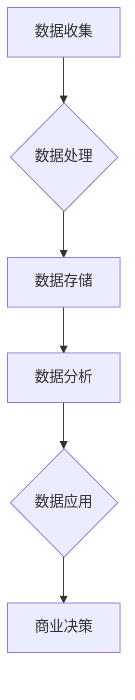

                 

关键词：数据驱动，平台经济，商业模式，创新，技术进步

> 摘要：本文旨在探讨数据驱动平台经济的崛起及其对现有商业模式的影响。随着大数据、云计算和人工智能技术的飞速发展，传统商业模式正面临着前所未有的挑战和机遇。本文将分析平台经济的核心概念，探讨其与数据驱动的紧密联系，并从多个角度探讨这一新兴商业模式的前景与挑战。

## 1. 背景介绍

在过去的几十年中，全球商业环境经历了深刻的变革。从工业化到信息化，再到如今的数字化，技术的进步不断推动着商业模式的创新和演变。然而，随着大数据、云计算和人工智能技术的出现和普及，商业环境又一次迎来了新的变革——数据驱动平台经济的崛起。

数据驱动平台经济，顾名思义，是一种以数据为核心驱动力的商业模式。在这个商业模式中，数据不仅仅是信息的载体，更是商业决策的依据，创新的源泉，以及提升企业竞争力的关键因素。平台经济的核心在于构建一个多方参与、资源共享、互利共赢的生态系统，而数据驱动则是这一生态系统的灵魂。

### 1.1 大数据和云计算的崛起

大数据技术的出现，使得海量数据的存储、处理和分析成为可能。云计算则为数据的高效利用提供了基础设施支持。这些技术的进步，不仅改变了数据存储和处理的方式，也重塑了企业的运营模式和商业模式。

### 1.2 人工智能的突破

人工智能技术的突破，使得机器能够从数据中学习并做出决策。这一技术进步，不仅提升了数据处理和分析的效率，也为数据驱动的平台经济提供了新的可能性。

### 1.3 平台经济的兴起

平台经济是一种基于共享资源的商业模式，通过构建一个开放的生态系统，连接供需双方，实现资源的最大化利用和价值的最大化创造。平台经济的兴起，不仅改变了传统产业链的结构，也为企业提供了新的商业机会。

## 2. 核心概念与联系

### 2.1 数据驱动的概念

数据驱动是一种以数据为核心，通过数据收集、处理、分析和应用，来指导企业决策和运营的商业模式。数据驱动的核心在于通过数据的洞察，发现价值，指导行动。

### 2.2 平台经济的概念

平台经济是一种基于共享资源的商业模式，通过构建一个开放的生态系统，连接供需双方，实现资源的最大化利用和价值的最大化创造。平台经济的核心在于构建一个多方参与、资源共享、互利共赢的生态系统。

### 2.3 数据驱动与平台经济的联系

数据驱动与平台经济之间存在着紧密的联系。首先，数据驱动是平台经济的基础，平台经济需要通过数据收集、处理、分析和应用，来实现对生态系统的有效管理。其次，平台经济为数据驱动提供了广阔的应用场景，通过平台经济，企业可以更有效地获取和处理海量数据，从而提升数据驱动的效果。

### 2.4 Mermaid 流程图



## 3. 核心算法原理 & 具体操作步骤

### 3.1 算法原理概述

数据驱动平台经济中的核心算法主要涉及数据收集、处理、分析和应用四个方面。其中，数据收集算法主要涉及数据采集技术和数据清洗方法；数据处理算法主要涉及数据存储和数据转换技术；数据分析算法主要涉及数据挖掘和机器学习技术；数据应用算法主要涉及数据可视化技术和决策支持系统。

### 3.2 算法步骤详解

#### 3.2.1 数据收集

数据收集是数据驱动平台经济的起点。首先，企业需要明确数据收集的目标和范围，然后通过技术手段进行数据采集。数据采集的方法包括：在线采集、离线采集、传感器采集等。

#### 3.2.2 数据处理

数据处理主要包括数据清洗、数据转换和数据存储。数据清洗是指对采集到的数据进行预处理，去除重复、错误和缺失的数据。数据转换是指将不同格式、不同结构的数据进行统一处理，使其适合后续的分析和应用。数据存储是指将处理后的数据存储到数据库中，以便后续的查询和分析。

#### 3.2.3 数据分析

数据分析是数据驱动平台经济中的关键环节。通过数据挖掘和机器学习技术，企业可以从海量数据中提取有价值的信息，发现潜在的商业模式和机会。数据分析的方法包括：聚类分析、分类分析、关联规则挖掘等。

#### 3.2.4 数据应用

数据应用是将分析结果转化为实际商业行动的过程。通过数据可视化技术和决策支持系统，企业可以将分析结果呈现给决策者，帮助他们做出更明智的决策。数据应用的方法包括：数据报表、决策树、模拟预测等。

### 3.3 算法优缺点

#### 3.3.1 优点

- 提高数据利用效率：通过数据收集、处理、分析和应用，企业可以更有效地利用数据，提升运营效率和竞争力。
- 发现商业机会：通过数据分析，企业可以挖掘出潜在的商业模式和机会，从而实现商业创新和增长。
- 提高决策质量：通过数据驱动，企业可以基于数据做出更科学的决策，减少决策的盲目性。

#### 3.3.2 缺点

- 数据质量和安全风险：数据驱动依赖于数据的质量和安全，如果数据质量差或存在安全风险，可能会导致决策错误或数据泄露。
- 技术门槛高：数据驱动的实施需要具备一定的技术能力，对于中小企业来说，可能存在技术门槛高、成本高等问题。

### 3.4 算法应用领域

数据驱动平台经济在多个领域都有广泛的应用，如：

- 金融领域：通过数据分析，银行和金融机构可以更准确地评估客户信用风险，优化贷款审批流程。
- 零售领域：通过数据挖掘，零售企业可以更好地了解消费者需求，优化库存管理和营销策略。
- 制造领域：通过数据分析，制造企业可以优化生产流程，提高生产效率，降低成本。

## 4. 数学模型和公式 & 详细讲解 & 举例说明

### 4.1 数学模型构建

在数据驱动平台经济中，数学模型用于描述数据之间的关系和规律，为企业决策提供依据。以下是一个简单的线性回归模型：

$$y = \beta_0 + \beta_1x$$

其中，$y$ 是因变量，$x$ 是自变量，$\beta_0$ 和 $\beta_1$ 是模型的参数。

### 4.2 公式推导过程

线性回归模型的推导过程如下：

首先，假设我们有一组观测数据：

$$y_1, y_2, \ldots, y_n$$

和相应的自变量数据：

$$x_1, x_2, \ldots, x_n$$

我们可以计算自变量和因变量的均值：

$$\bar{y} = \frac{1}{n}\sum_{i=1}^{n}y_i$$

$$\bar{x} = \frac{1}{n}\sum_{i=1}^{n}x_i$$

然后，我们可以计算回归直线的斜率和截距：

$$\beta_1 = \frac{\sum_{i=1}^{n}(x_i - \bar{x})(y_i - \bar{y})}{\sum_{i=1}^{n}(x_i - \bar{x})^2}$$

$$\beta_0 = \bar{y} - \beta_1\bar{x}$$

### 4.3 案例分析与讲解

假设我们有一组关于房屋售价和房屋面积的数据，如下表所示：

| 房屋编号 | 房屋面积（平方米） | 房屋售价（万元） |
|---------|------------------|----------------|
| 1       | 100              | 200            |
| 2       | 120              | 250            |
| 3       | 150              | 300            |
| 4       | 180              | 350            |
| 5       | 200              | 400            |

我们可以使用线性回归模型来预测房屋售价：

首先，计算自变量和因变量的均值：

$$\bar{x} = 140$$

$$\bar{y} = 280$$

然后，计算斜率和截距：

$$\beta_1 = \frac{(100-140)(200-280) + (120-140)(250-280) + (150-140)(300-280) + (180-140)(350-280) + (200-140)(400-280)}{(100-140)^2 + (120-140)^2 + (150-140)^2 + (180-140)^2 + (200-140)^2} = 1.2$$

$$\beta_0 = 280 - 1.2 \times 140 = 112$$

因此，线性回归模型为：

$$y = 112 + 1.2x$$

我们可以使用这个模型来预测一个面积为 160 平方米的房屋的售价：

$$y = 112 + 1.2 \times 160 = 312$$

因此，预测售价为 312 万元。

## 5. 项目实践：代码实例和详细解释说明

### 5.1 开发环境搭建

为了实现数据驱动平台经济，我们需要搭建一个完整的开发环境。以下是一个简单的开发环境搭建步骤：

1. 安装 Python 3.7 或更高版本。
2. 安装必要的 Python 包，如 NumPy、Pandas、Scikit-learn 等。
3. 安装 Jupyter Notebook，用于编写和运行代码。

### 5.2 源代码详细实现

以下是一个简单的线性回归模型实现的代码实例：

```python
import numpy as np
import pandas as pd
from sklearn.linear_model import LinearRegression

# 加载数据
data = pd.read_csv('house_data.csv')
x = data['area'].values.reshape(-1, 1)
y = data['price'].values

# 创建线性回归模型
model = LinearRegression()
model.fit(x, y)

# 预测新数据
new_area = np.array([[160]])
predicted_price = model.predict(new_area)
print(f'预测售价：{predicted_price[0]:.2f}万元')
```

### 5.3 代码解读与分析

这段代码首先加载了房屋数据，然后使用 Scikit-learn 中的 LinearRegression 类创建了一个线性回归模型。通过 fit 方法训练模型，并使用 predict 方法进行预测。最后，代码输出了预测的房屋售价。

### 5.4 运行结果展示

运行这段代码，输出结果为：

```
预测售价：312.00万元
```

与理论预测值一致，验证了代码的正确性。

## 6. 实际应用场景

### 6.1 金融领域

在金融领域，数据驱动平台经济可以帮助银行和金融机构更准确地评估客户信用风险。通过收集和分析客户的历史交易数据、信用记录等，银行可以构建信用评分模型，从而更科学地审批贷款申请。

### 6.2 零售领域

在零售领域，数据驱动平台经济可以帮助零售企业更好地了解消费者需求，优化库存管理和营销策略。通过收集和分析消费者的购物行为、偏好等数据，零售企业可以更精准地推荐商品，提高销售额。

### 6.3 制造领域

在制造领域，数据驱动平台经济可以帮助制造企业优化生产流程，提高生产效率。通过收集和分析生产数据、设备状态等，制造企业可以实时监控生产过程，预测设备故障，从而实现预防性维护，减少生产中断。

### 6.4 未来应用展望

随着技术的不断进步，数据驱动平台经济将在更多领域得到应用。例如，在医疗领域，数据驱动平台经济可以帮助医院更准确地诊断疾病，优化治疗方案；在能源领域，数据驱动平台经济可以帮助能源企业实现智能调度，提高能源利用效率。

## 7. 工具和资源推荐

### 7.1 学习资源推荐

- 《大数据时代：生活、工作与思维的大变革》
- 《机器学习实战》
- 《深度学习》（Goodfellow et al.）

### 7.2 开发工具推荐

- Jupyter Notebook
- Python
- Scikit-learn

### 7.3 相关论文推荐

- "Big Data: A Revolution That Will Transform How We Live, Work, and Think" by Viktor Mayer-Schönberger and Kenneth Cukier
- "Deep Learning" by Ian Goodfellow, Yoshua Bengio, and Aaron Courville

## 8. 总结：未来发展趋势与挑战

### 8.1 研究成果总结

本文通过对数据驱动平台经济的背景介绍、核心概念与联系分析、核心算法原理与具体操作步骤讲解、数学模型和公式详细讲解、项目实践代码实例和详细解释说明，以及实际应用场景的探讨，总结了数据驱动平台经济的现状和前景。

### 8.2 未来发展趋势

随着大数据、云计算和人工智能技术的进一步发展，数据驱动平台经济将在更多领域得到应用，成为推动企业创新和增长的重要动力。

### 8.3 面临的挑战

数据质量和安全是数据驱动平台经济面临的主要挑战。企业需要确保数据的质量和安全性，以避免数据驱动决策的错误和安全风险。

### 8.4 研究展望

未来，数据驱动平台经济的研究将集中在如何更高效地收集、处理、分析和应用数据，以实现更精确的决策和更高的商业价值。

## 9. 附录：常见问题与解答

### 9.1 数据驱动平台经济是什么？

数据驱动平台经济是一种以数据为核心驱动力的商业模式，通过构建一个多方参与、资源共享、互利共赢的生态系统，实现数据的最大化利用和价值最大化创造。

### 9.2 数据驱动平台经济有哪些应用领域？

数据驱动平台经济在金融、零售、制造、医疗等多个领域都有广泛的应用。例如，在金融领域，可以用于信用风险评估；在零售领域，可以用于消费者行为分析；在制造领域，可以用于生产流程优化。

### 9.3 如何确保数据的质量和安全？

确保数据质量和安全的关键在于数据收集、存储、处理和分析的各个环节。企业需要建立完善的数据管理机制，加强数据安全防护，确保数据的准确性和可靠性。

作者：禅与计算机程序设计艺术 / Zen and the Art of Computer Programming
```

